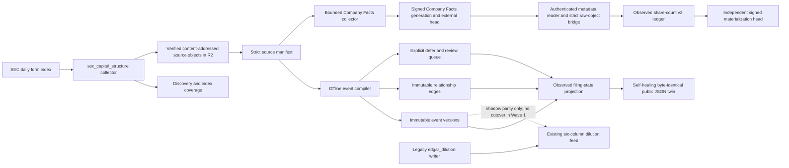

# Capital Structure Intelligence — Wave 0–2A plus authenticated share observations

Status: implemented evidence spine and observed-filing-state projection; authenticated
Company Facts share-observation code is pre-production/default-off; the manual isolated
R2 CAS conformance harness is unprovisioned and has never run; all context-only
Owner: `capital-structure-intelligence`
Canonical build docket: `research/CAPITAL_STRUCTURE_INTELLIGENCE_COMPETITIVE_TEARDOWN_AND_BUILD_DOCKET_2026-08-01.md`
R2 conformance operator handoff: `research/CAPITAL_STRUCTURE_SHARE_COUNT_R2_CONFORMANCE_HANDOFF.md`

## Ruling

Capital Structure Intelligence is a shared SEC evidence and issuer-context plane, not a
screen-scraped clone and not a second dilution score. Wave 0–1 establishes source truth,
immutable event history, point-in-time replay, and a compatibility boundary around the
existing `data/edgar/dilution_events.parquet` feed. Wave 2A adds a public-safe projection
of observed filing state. It grants no rank, entry, sizing, veto, or Prophet authority.

The temporary canonical event adapter is `capital_structure.event.v1`. The repository does
not yet contain the proposed generic `company_event.v1`; silently claiming that namespace
would create a second generic company-event truth plane. The migration owner is
`capital-structure-intelligence`, with a review date of 2026-10-01. Migration must preserve
event IDs or publish explicit supersession edges and PIT receipts.

## Data flow and ownership

| Artifact | Sole producer | Role |
|---|---|---|
| `data/capital_structure/discovery.parquet` | `collectors/sec_capital_structure.py` | Keep-first registration discovery plus issuer-scoped reconciliation rows |
| `data/capital_structure/index_coverage.parquet` | same | Per-index-day complete/retry/not-published ledger; only a structurally valid index can close a zero-target day |
| `data/capital_structure/retrieval_attempts.parquet` | same | Retryable operational attempts; failures never become source manifests |
| `data/capital_structure/retrieval_queue_receipt.json` | same | Strict per-lane selection/defer and oldest-backlog-age receipt |
| `data/capital_structure/source_manifest.jsonl` | same | Strict pointers to hash-verified source bytes. JSON Lines, not parquet: a manifest ID commits to its own canonical body, and pyarrow's nested-struct unification rewrote retained rows whenever a new row introduced a nested key. |
| R2 `capital_structure/sec/sha256/<prefix>/<sha256>` | same | Unlinked raw complete submissions and selected primary, EX-1, EX-FILING FEES, EX-3/EX-4/EX-10/EX-99 public SEC evidence |
| `data/capital_structure/event_versions.parquet` | `scripts/compile_capital_structure_events.py` | Immutable `capital_structure.event.v1` versions |
| `data/capital_structure/event_edges.parquet` | same | Immutable amends/effectuates/withdraws/supersedes edges |
| `data/capital_structure/review_queue.parquet` | same | Rebuildable ambiguity/linkage work queue |
| `data/capital_structure/telemetry.json` | same | Coverage, exclusions, failures, migration, and authority receipt |
| `data/capital_structure/projection.json` | `scripts/build_capital_structure_projection.py` | Canonical public-safe observed-filing-state bundle |
| `site/capital-structure-data/latest.json` | same | Byte-identical static read twin after each successful build or startup recovery |
| `data/capital_structure/companyfacts/generations/<sha256>/*` | `collectors/sec_capital_structure_companyfacts.py` | Immutable Company Facts manifest/coverage generation selected by a signed receipt and external head |
| R2 `capital_structure/share_counts/v2/generations/<sha256>/ledger.json` | `scripts/materialize_capital_structure_share_counts.py` | Immutable v2 direct share/public-float observations bound to authenticated Company Facts bytes |
| R2 `capital_structure/share_counts/v2/receipts/<sha256>.json` | same | HMAC-authenticated exact-predecessor publication receipt with constant-size rolling-prefix binding, bounded skip refs, and all-false authority |
| R2 `capital_structure/share_counts/v2/current_head.json` | same | Mutable selector cataloged by a closed v2/v3/v4 witness union; runtime authenticates all three, supports exact structural migration/recovery, and keeps native v4 genesis/successor production publication unavailable |
| ignored local `data/capital_structure/share_counts/v2/current_receipt.json` | same | Runner-local recovery/high-water cache; never an independent selector and never committed — it is gitignored, `collect`'s broad `git add data/` unstages every capital-structure path, and the capital-structure checkpoint stages only the generation and its public twin |
| GitHub Actions review artifact `capital_structure_share_count_r2_conformance_receipt.json` | `scripts/probe_capital_structure_share_count_r2.py` | Expiring, local-only record of one explicitly dispatched isolated-key conditional-write probe; not a Synapse artifact, R2 receipt, publication selector, coverage record, or authority source |
| `data/edgar/dilution_events.parquet` | `collectors/edgar_dilution.py` | Existing legacy feed; unchanged in Wave 1 |

The collector runs inside the serial SEC host group, in `daily.yml`'s `collect` job.
Since 2026-08-06 the compiler does **not** run in that job: the whole chain lives in the
`capital_structure` job (`needs: collect`), which nothing needs in turn, so a
fail-closed integrity error reds that job alone instead of the job the nightly hangs
off. It still runs after collection and before the capital-structure checkpoint that
publishes its generation — the ordering guarantee is now the `needs:` edge rather than
step adjacency.

That job boundary is crossed by an artifact, not by git, and the distinction is
load-bearing. `collect`'s market checkpoint deliberately **unstages**
`data/capital_structure`, because a source ledger no compiler has accepted must never be
committed (that carve-out is what lets a drifted ledger self-heal from git the next
night). Tonight's freshly appended manifest rows therefore exist only in `collect`'s
workspace and are handed over as a build artifact, together with a sha256/row-count
receipt published as a job output. The consuming job verifies the bytes against that
receipt before any compiler reads them, and fails closed on a mismatch: without the
check, a fresh `actions/checkout` would silently serve the last committed ledger, the
compilers would reproduce the previous generation byte for byte, and the lane would
freeze while every step stayed green.

Render workflows never fetch SEC or compile the spine.

The share-count materializer runs at the head of that same chain, but its R2
step is default-off behind
`CAPITAL_STRUCTURE_SHARE_COUNT_PUBLICATION_ENABLED`. Once its scalable
publication gate passes and a safe retention protocol is separately released,
it will recover its
independent external head first, re-authenticate the selected Company Facts
generation, reads only exact retained objects, and publishes at most one outer
generation per invocation. It never fetches SEC, selects a current denominator,
or feeds Prophet. Code deployment is not issuer coverage: activation is not
complete until the lane deliberately publishes and verifies its first external
receipt from retained source bytes.

## Authenticated share-observation law

The original `capital_structure.share_count_ledger.v1` compiler remains a
lab/compatibility kernel. Production uses
`capital_structure.share_count_ledger.v2`: every source snapshot embeds a bridge
receipt that binds the signed Company Facts receipt bytes, generation, ordered
manifest/coverage prefixes, manifest ID, issuer, filing anchor, raw object store
namespace/key/hash/length, and Mastermind acquisition clock.

Only direct `CommonStockSharesOutstanding`,
`EntityCommonStockSharesOutstanding`, and `EntityPublicFloat` facts are in
scope. The concepts remain separate; public-float dollars are not converted to
shares; ambiguity/defer outcomes remain explicit; and
`public_available_at=null` rather than a guessed filing clock. The ledger does
not choose current outstanding shares or derive fully diluted supply.

Share publication has its own HMAC domain and external R2 compare-and-swap head.
Immutable receipt and ledger bytes are externally sealed before that head moves;
the local pointer is replaced afterward. A clean runner authenticates the signed
head plus exactly its selected receipt and ledger in O(1) remote artifact reads.
A runner retaining a prior authenticated local high-water accepts a later head
only after an O(log delta) binary-lifting proof lands on that exact prior receipt.
Local pointer/receipt authentication and external selected-receipt authentication
now precede every local or external ledger open. A rejected rollback, fork, or
divergent ancestry proof opens no ledger; a valid external convergence fetches
exactly one selected external ledger after the proof, then exact-readbacks the
same bytes while installing the immutable local mirror. Exact replay is a no-op.
Tamper, fork, rollback below a retained local high-water, store rebinding,
missing source, oversize input, split-brain, or an indeterminate post-CAS result
fails closed. A clean runner has no independent monotonic witness and therefore
cannot detect credential-level restoration of an older, otherwise valid signed
head; global rollback protection requires a separate durable witness
or signer domain. Publication uses exactly one absent-only, signed local
`.share_count_publish_journal.json`; the reader dispatches by the record's exact
schema and rejects mixed or unknown shapes. Legacy
`capital_structure.share_count_publish_journal/v1` binds only exact v2
predecessor/candidate witnesses and their canonical local pointer bytes in its
dedicated HMAC domain and remains fully drainable. Native-v4
`capital_structure.share_count_publish_journal/v2` has its own HMAC domain and
admits only null expected witness to v4 genesis, or exact v4 expected witness to
v4 successor. Neither journal carries phase, CAS token, timestamp, or duplicated
receipt metadata.

The publisher fully seals and exact-reads both external immutable objects,
reasserts the held descriptor-relative lane, then durably creates the selected
journal schema before CAS. Once durable, every caught failure retains or
restores the exact journal. Restart re-authenticates the candidate receipt and
ledger before replaying `E -> C`, uses a fresh token, and permits at most two
conditional conflicts. `H == C`, a protocol-valid authenticated descendant, or
an authenticated genesis winner under the null-expected rule converges after
the required receipt-ancestry proof; rollback and divergent ancestry retain the
journal and fail closed. Any recovery state observed at publisher entry makes
that invocation recovery-only, so migration and new candidate validation need a
second clean lease. Legacy v1 recovery remains compatible with v3/v4 only under
the explicit matrix below; wrong scope, migration anchor, or ancestry fails
before selected artifact or ledger reads. Native v3 publication remains
impossible.

Capsule-only legacy recovery remains deliberately asymmetric:
an external head equal to the capsule's expected witness validates that expected
bundle and clears; a head equal to, or an authenticated descendant of, the
capsule candidate must prove the candidate as high-water before clearing; a
sibling, equal-sequence fork, rollback, malformed proof, or missing proof fails
closed and retains the exact capsule and pointer without opening a ledger. Any
legacy recovery bytes beside a v3 or v4 head fail unchanged, and legacy state
observed at lease entry prevents migration in that invocation. Legacy marker/capsule
readers remain only to drain old crash state; the normal publisher never writes
them. A journal beside either legacy name is terminal ambiguity before remote
I/O, with every exact local byte preserved.
Zero authenticated source manifests remain explicitly unavailable and do not
create an empty green ledger.

Each inner ledger receipt is one bounded append transition for at most 24 source
snapshots. It stores only that batch's new identities plus domain-separated
rolling commitments (`count`, `rolling_sha256`) to the exact ordered observation,
snapshot, bridge, and source-manifest histories. The outer signed receipt repeats
only those tail commitments, compiler version, materializer clock, and inner head;
it never copies the cumulative identity arrays. Canonical ledgers are capped at
128 MiB, snapshot-fact views at one million, source history at 16,384, and inner
receipt history at 4,096. Crossing a bound fails before publication and requires
an explicit authenticated epoch/checkpoint migration; no bound may be raised by
silently discarding history.

Each outer v2 receipt also carries at most 64 authenticated binary-lifting
references at exact powers-of-two distances. These remove the outer publication
lane's former 512-receipt full-replay cliff without deleting receipt history.
They do not remove the upstream dependency: the Company Facts source selector
still authenticates a v1 predecessor chain capped at 512 receipts and will block
at that checkpoint until its own authenticated migration lands.

The immutable v2 receipts/generations and closed v2/v3/v4 R2 head are the
publication data plane. A one-time, default-off v3 migration may replace an exact
canonical v2 head at the same key and CAS token with
`capital_structure.share_count_head_witness/v3`. The v3 witness keeps all eleven
selection fields and the sequence unchanged, signs an exact R2 scope
(`backend`, 32-hex account ID, bucket, and fixed head key) in a distinct v3 HMAC
domain, and commits to the exact canonical v2 witness bytes including their
newline. It cannot create genesis, advance v3, or publish a new generation.
While present at the same key, v3 makes an old v2-only writer reject the schema
before conditional PUT. The migration flag gates only that v2-to-v3 rewrite;
v3 recovery and exact no-op behavior remain active when the flag is
false, while every v3 successor publication remains blocked.

### Wave 6 v4 head-transition runtime (pre-production)

Wave 6 adds a closed Draft 2020-12 contract for
`capital_structure.share_count_head_witness/v4` and a closed external-head
catalog union referencing only v2, v3, and v4. The engine and test seam now
authenticate and sign v4, structurally migrate exact v2 or v3 heads to v4, and
recover both legacy-v1 and native-v2 journal outcomes. Production native v4
genesis/successor publication remains unavailable: the production wrapper never
enables the injected native-publish seam, and no workflow schedules it.

The v4 witness repeats the exact eleven existing selection fields, signs the
same exact R2 guard scope, and carries one closed transition object. The runtime
enforces this state matrix before any selected ledger is opened:

| Transition | Required witness state | Required external proof | v1-journal compatibility |
| --- | --- | --- | --- |
| `genesis` | `sequence=1`, `previous_receipt=null` | The expected remote head/pointer is null; no overwrite or non-null expected state is a genesis | A v1 recovery journal may converge only when its expected witness is null and the selected v4 artifacts authenticate; every non-null expected state fails closed. |
| `migration` from v2 | Exact existing selection and scope | `from_witness_sha256` is the exact v2 witness bytes; `v2_anchor_sha256` is that same canonical virtual-v2 anchor | A v1 recovery journal may recognize this only when the migration proves the exact virtual-v2 anchor for its v2 `E` or `C`. |
| `migration` from v3 | Exact existing selection and scope | `from_witness_sha256` authenticates the v3 witness and `v2_anchor_sha256` authenticates the v3 witness's exact virtual-v2 anchor | The same exact virtual-v2-anchor rule applies; a v3 wrapper never substitutes for the v1 journal's v2 evidence. |
| `successor` | `sequence>=2`, non-null `previous_receipt`, and `previous_witness_sha256` | Authenticated signed exact-scope v4 receipt ancestry proves continuity from the named preceding v4 witness; a matching sequence alone is insufficient | A v1 recovery journal may converge only when that ancestry proves its v2 `E` or `C` outcome; otherwise it retains exact evidence and fails closed. |

`from_schema` is closed to v2 or v3, and all migration digests plus a successor's
`previous_witness_sha256` are fixed lowercase SHA-256 values. The v4 schema
does not by itself establish a global rollback witness: a clean runner still
needs a separately durable monotonic witness or signer domain to detect
credential-level restoration of an older otherwise valid head. No activation,
retention, UI/API exposure, Prophet ingestion, ranking, sizing, entry, trade,
or analytical authority follows from cataloging this contract.

Native-v4 intent uses the same local journal filename with exact schema dispatch:

| Journal schema | Allowed durable intent | Current release state |
| --- | --- | --- |
| `capital_structure.share_count_publish_journal/v1` | Exact v2 `E -> C`; remains drainable through the v1/v4 compatibility matrix above | Implemented legacy path |
| `capital_structure.share_count_publish_journal/v2` | Null `E` to v4 `genesis`, or exact v4 `E` to v4 `successor`; no structural migration intent | Implemented engine/test seam; unavailable from the production publisher |

The strict lowercase
`CAPITAL_STRUCTURE_SHARE_COUNT_HEAD_V3_MIGRATION_ENABLED` and
`CAPITAL_STRUCTURE_SHARE_COUNT_HEAD_V4_MIGRATION_ENABLED` flags both default to
false and are mutually exclusive. A structural v4 migration is migration-only;
it cannot share an invocation with native publication. None of these code paths
provides schedule, activation, retention, UI, or Prophet authority.

### Manual isolated R2 CAS conformance harness (implemented, unprovisioned, never run)

The repository contains a separate operator harness for one narrow provider
question: on one fresh object in a disposable isolated bucket, does Cloudflare
R2 enforce the conditional create/update/readback behavior the share-count head
protocol expects? The harness is not part of `daily.yml`, the materializer, the
publisher, or the retention planner. Its workflow
`.github/workflows/capital-share-count-r2-conformance.yml` has only a
`workflow_dispatch` trigger, requires the boolean `run_conformance=true`, rejects
non-`main` refs, targets the unprovisioned
`capital-share-count-r2-conformance` Environment, has read-only repository
permissions, and caps the job at five minutes. Before any run, that Environment
must be restricted to `main`, require independent review, and preferably prevent
self-review; the ref expression alone is not source approval. The probe itself
has a fixed 90-second monotonic deadline plus a later 95-second process-alarm
backstop for a stuck SDK call; the later alarm cannot preempt normal stream
ownership transfer at the logical deadline.

The workflow builds a minimal clean `git archive` from its exact `GITHUB_SHA`,
checks that archive again before extraction, smoke-loads the reviewed core
without executing the broad Capital Structure package initializer, and installs
the narrow hash-locked Python 3.12 boto runtime from
`requirements/capital-share-r2-conformance-macos-arm64-py312.lock`. Pip runs in
isolated/no-input mode and Python runs with `-E -s`. The receipt binds the exact
source-archive and dependency-lock SHA-256 values alongside the exact GitHub
repository/workflow/main-ref/run/commit provenance. This is reviewed-source and
dependency attestation, not a process-security or runner-integrity proof.

The Environment must be provisioned with exactly these dedicated values:

- `R2_SHARE_COUNT_CONFORMANCE_ENDPOINT`;
- `R2_SHARE_COUNT_CONFORMANCE_ACCOUNT_ID`;
- `R2_SHARE_COUNT_CONFORMANCE_BUCKET`;
- `R2_SHARE_COUNT_CONFORMANCE_ACCESS_KEY_ID`; and
- `R2_SHARE_COUNT_CONFORMANCE_SECRET_ACCESS_KEY`.

There is no fallback to `R2_CAPITAL_STRUCTURE_*`, `R2_RESEARCH_*`, generic
`R2_*`, or production publication credentials. The endpoint must be the exact
HTTPS Cloudflare R2 global, EU, or FedRAMP account root bound to the supplied
32-hex account ID. The credential and bucket must be dedicated to this
disposable conformance plane; they are not configured by this code wave.

For each admitted dispatch the wrapper generates exactly one fresh key under
`capital_structure/share_counts/conformance/v1/<32-lowercase-hex>.json`. Its
adapter guards the reviewed path to exact-bucket/exact-key `HeadObject`,
`GetObject`, and `PutObject`, and the reviewed core contains no List, Delete,
copy, multipart, HMAC, share-count publication, selector, receipt, or retention
call. This is a reviewed-code guard, not a process sandbox: the wrapped boto
client and signer remain same-process implementation details. Dedicated
bucket-scoped credentials, the protected Environment, and exact-source review
are therefore load-bearing blast-radius controls. The intended passing contract
requires this complete sequence:

1. conditionally create payload A with `If-None-Match: *`;
2. HEAD A and exact bounded ranged-GET A with A's `If-Match` ETag;
3. prove a duplicate absent-only create returns exact HTTP 412
   `PreconditionFailed`, then
   HEAD and exact-read A again to prove the conflict did not mutate it;
4. conditionally replace A with payload B using A's exact ETag in `If-Match`;
5. HEAD B and require a different opaque ETag;
6. prove a ranged GET and PUT using stale ETag A each return exact HTTP 412
   `PreconditionFailed`; and
7. exact bounded ranged-GET B with B's ETag and verify the expected bytes.

The conflict classifier accepts only a botocore `ClientError` with HTTP 412 and
exact `Error.Code=PreconditionFailed` for these deliberately false conditions.
Every 409, unrelated provider error, successful stale request, or untyped
look-alike exception is inconclusive and cannot produce a passing receipt.

Even with that sequential contract correctly enforced, this is one fresh-key
trace. It launches no competing writer and does not prove concurrent
linearizability, race safety across independent clients, or the separately
configured production head client. The production guard now reconciles every
exception caught by the conditional head-PUT block, including a terminal
409/412 surfaced after an SDK retry. An authenticated bounded read-back proves
success only when its canonical bytes equal the exact frozen submitted
candidate; an absent, unchanged, unreadable, or otherwise ambiguous result is
indeterminate, while a recognized conditional-write failure plus a different
authenticated head is a conflict. Regression tests cover v2 genesis/successor,
v2-to-v3, v2/v3-to-v4, v4 genesis/successor, transport failure, and outage recovery. This
closes only the post-PUT retry-classification code prerequisite.

Wave 9 adds the separate, manual-only code foundation for the remaining
concurrent-writer prerequisite. It precommits eight unique disposable keys and
four candidate bodies per key before any remote call. For every key, two
persistent spawned OS children with distinct boto sessions and clients race one
`If-None-Match: *` genesis and then one `If-Match: <E0>` successor. A pass
requires exactly one HTTP 200 and one exact base botocore `ClientError` carrying
HTTP 412 plus `PreconditionFailed` in both races, one actual `before-send` and
one `needs-retry` attempt at attempt 1 per writer, zero SDK retries, overlapping
transport-attempt intervals, and exact parent HEAD/bounded-GET authentication of
the winning bytes. A final parent stale `If-Match: <E0>` PUT must receive the
same exact 412 and leave E1 byte-for-byte and ETag-for-ETag unchanged. A 409,
two successes, two refusals, response loss, hidden retry, missing hook,
sequential transport spans, malformed readback, unchanged successor ETag, or
post-hoc rewrite is non-passing. If a child may still have a request in flight,
the process is terminated and no semantic receipt or post-race readback is
emitted.

This second workflow reuses only the protected Wave 7 Environment, its five
dedicated conformance secret names, its exact dependency lock, and the same
concurrency mutex. It has no schedule, no production credentials or fallback,
and no List/Delete/copy/multipart/HMAC/publication capability. Its separate
`capital_structure.share_count_r2_concurrency_receipt/v1` contract is a
90-day review artifact with all output authorities false. The workflow is not
provisioned or dispatched, no concurrency receipt exists, and no R2 concurrent
behavior is yet proven. Even a future reviewed `passed` receipt would establish
only the exact bounded, time-and-scope-specific eight-round transport witness;
it would not be a general provider linearizability, security, durability,
availability, production-client, or activation proof. Neither that future
receipt, the sequential receipt, nor the Wave 8 reconciliation code activates
publication.

Every ambiguous transport outcome, deadline, malformed response, unexpected
status, body/metadata/range mismatch, or stream-close failure is non-passing.
The closed
`capital_structure.share_count_r2_conformance_receipt/v1` contract admits
`passed`, `failed`, or `inconclusive`; only `passed` carries all eleven step
witnesses. Non-pass receipts carry only a closed failure stage/category and an
ordered completed-step prefix. For core failures that prefix contains only
proven witnesses; wrapper-only failures may conservatively report an empty
prefix. The wrapper preserves structured core evidence instead of flattening
it. It attempts to close every owned response body on deadline, malformed
metadata, unexpected success, readback failure, and normal success paths, and
any close failure is non-passing. An admitted scope reduces bucket/key names and
ETags to SHA-256 commitments and binds the endpoint host. A failure before
configuration admission instead records `admitted=false`, null endpoint/bucket
identity, and the fresh-key commitment rather than fabricating scope. Every
receipt binds GitHub and reviewed-execution provenance and all-false output
authority. JSON Schema provides the closed structural contract; the Python
semantic validator is normative for cross-field relationships, body constants,
metadata equality, ordered-prefix meaning, and receipt self-hash validation.

The canonical receipt is written only to the runner's temporary artifact
directory and uploaded as
`capital-share-count-r2-conformance-<run_id>-<attempt>` for 90-day review. It is
never written to R2, Git, the public site, or the production share-count
namespace. The disposable R2 witness object intentionally remains because the
reviewed harness never calls Delete; that residue is why the bucket must be
isolated and must not be treated as a product store. Receipt upload uses
`always()` with `if-no-files-found: warn`: it is best-effort after the probe has
created output, not a guarantee for failures during checkout, environment setup,
dependency installation, archive verification, timeout, or cancellation. A
failed run with no artifact remains an explicit non-pass and must not be read as
an empty or successful receipt.

No live claim follows from the code existing. As of this contract update, the
protected Environment, dedicated bucket, and credentials have not been
provisioned; the workflow has not been dispatched; no receipt exists; and R2
conditional create/CAS/readback has not been proven. The conflict classifier and
failure/stream/archive hardening are implemented and locally regression-tested,
but an operator must still provision and independently approve the isolated
Environment before a dispatch can produce evidence. A future `passed` receipt
would prove only that exact fresh-key sequence at that run's time and scope. It
would not prove provider security, durability, availability, credential
authenticity, global rollback resistance, share-count publication, or any
issuer coverage.

#### Synapse non-registration ruling

The sequential and concurrent review receipts are intentionally absent from
`config/synapse.yml`. They have no consumer, expire as GitHub Actions artifacts,
and are neither Git-, runner-, nor R2-canonical state. The current Synapse
storage vocabulary has no exact GitHub review-artifact locus; labeling either
one `gitignored-local` or `r2` would misstate its authority and persistence. The
JSON Schemas are code, not runtime artifacts. A later durable receipt plane or
consumer must receive its own reviewed storage, cadence, retention, and Synapse
contract before use; neither expiring artifact may be silently promoted.

Local generation, receipt, pointer, journal, legacy pending/recovery, and lease files
are crash-recovery mirrors and are excluded by `.gitignore`; this lane never turns
a cumulative ledger into a Git object or public site payload. The publisher never
deletes, and ancestry receipts remain retained. A bounded retention planner and
receipt contract exist, but the production compactor is hard-disabled before
credential lookup or remote I/O. The manual CAS harness above never calls Delete
and its receipt explicitly disclaims retention/deletion proof, so even a future
`passed` receipt cannot release retention. Release requires all three of: a live
isolated proof that the provider offers atomic conditional delete, a shared
external fence covering publisher staging through head CAS and each retention
delete, and a
verifier-only/minted capability that can never write the signed head or receipts.
The selector/receipt-only high-water split, schema-dispatched single-file
journal recovery protocol, Wave 8 exception reconciliation, and both unrun
manual provider harnesses are implemented and CI-pinned; they do not activate
publication. Activation still requires separately reviewed `passed` sequential
and concurrent isolated-provider receipts, review of their exact run evidence,
all other release gates, and an explicit operator decision.
Migration additionally requires exact `SHARE_COUNT_HEAD_GUARD_ACCOUNT_ID`
configuration. Both strict lowercase migration flags default false and cannot
be true together; migration-false v2 operation does not require the account ID. Any
configured account ID is bound before client construction to the exact resolved
Cloudflare R2 endpoint (`R2_CAPITAL_STRUCTURE_ENDPOINT`, then `R2_ENDPOINT`):
HTTPS only, no URL credentials/port/path/query/fragment, and only the account's
global, EU, or FedRAMP R2 hostname is accepted. The endpoint itself is not copied
into signed scope. One 15-minute in-process deadline is
propagated through recovery, authenticated source reading, and publication, and
the nightly command has a process-level timeout backstop for a blocking storage
SDK call.

The projection writer replaces each output atomically and ordinarily rolls both files back
if either replace fails. The two paths are not one cross-file filesystem transaction: a hard
process stop can land between replaces. Every subsequent invocation therefore validates both
copies before reading the current source generation and deterministically heals a missing,
invalid, or older public copy from the valid canonical copy (or restores a missing canonical
copy from the valid public twin). If neither copy is valid, it fails closed. Successful and
recovered steady state is byte-identical; the contract does not claim crash-atomic twins.

## Source-truth law

A source-manifest row exists only after the original bytes are written to the object store,
read back, and matched to the expected SHA-256. Missing credentials, failed writes, and
failed readback are explicit failures in the attempts ledger. Retained unsupported or
suspect content carries an explicit parser eligibility and corruption state and compiles to
a defer state. None of these states may become “no financing” or a valid empty filing.
Manifest retrieval and first-seen clocks are stamped once the entire selected filing bundle
has completed verified readback, never at request start.

The raw-object key is derived only from the content hash. The same URL returning different
bytes therefore creates another immutable object instead of overwriting history. Complete
submission bytes are retained alongside the primary document and capital-term-bearing
exhibits, including `EX-1*` underwriting and `EX-FILING FEES` fee-table exhibits when
present. SEC evidence is public, but manifests still mark `contains_personal_data=true`
because filings routinely contain named officers, directors, and signatures. Every
downstream observation must carry a manifest ID and exact span hash. Instrument-term
evidence also propagates source rights, privacy, and a strict publication disposition; raw
evidence excerpts are capped at 500 characters, and public excerpts require explicit
excerpt permission and personal-data redaction.

`manifest_id` is `manifest:cs:<sha256>` over the canonical full manifest body with only
the ID field itself omitted. Existing ledgers are identity-validated as an immutable ordered
prefix before append; an identity mismatch, duplicate prior ID, or same-ID body divergence
fails closed instead of being hidden by dataframe deduplication.

Before publishing any generation, the compiler resolves every persisted and newly produced
event `source.manifest_ids` and every evidence `manifest_id` against the current source
manifest ledger. A truncated or valid-but-empty source ledger therefore cannot preserve old
events while publishing a green orphaned generation; compilation fails and the prior
telemetry-last generation remains untouched. Manifest IDs commit to each row's full
canonical body, and identity validation plus global duplicate-ID rejection runs before
accession grouping.

Every manifest also records a stable, non-secret `storage.store_id` namespace:
`capital_structure_local`, `r2_capital_structure`, `r2_research`, or `r2_shared`. This
preserves which configured store class owned the object at write time without publishing a
bucket name, endpoint, access key, or secret. Consumers resolve the namespace through
deployment configuration; `storage.object_key` alone is not treated as globally resolvable.
Changing the physical bucket behind an existing `store_id` requires a verified copy and
migration receipt first; an existing namespace must never be silently rebound.

File numbers are observed provenance, not an inferred issuer attribute. The collector
accepts a legacy SGML `<FILE-NUMBER>`, a modern submission-header `SEC FILE NUMBER:`, or
the explicit `fileNumber` field in an EFFECT XML payload. It canonicalizes whitespace only,
records the source encoding(s), and binds the value to the source-manifest identity. If two
authoritative encodings disagree, the manifest stores `file_number=null` with
`state=ambiguous`; graph linkage must defer rather than selecting a first match.

## Event and graph law

Events are immutable versions. Corrections create a new event ID and point backward; they
do not edit the original row. Registration relationships live in a separate edge table so a
later EFFECT or withdrawal cannot mutate an older registration. Each accession compiles
only from its latest closed bundle version; documents that belonged only to an older bundle
cannot leak into the replacement bundle. A revision persists the entire candidate bundle
at the newly allocated accession-wide `document_version` and must not append only the
changed members. A previously current member absent from the candidate because it was
deselected or removed is itself a revision; the removed member is not copied into N+1.
Every surviving child in that new bundle points at the new complete-submission
`manifest_id`.

The graph engine can use, in order:

1. an explicitly referenced accession supplied by reviewed deterministic linkage metadata;
   or
2. an exact CIK + SEC file number + registration family + prior chronology match.

Wave 1 source manifests do not yet extract referenced accessions from filing prose, so the
nightly compiler currently uses only the second path. Anything non-unique becomes
`deferred_linkage` in the graph review queue. A relationship form remains a classified
immutable filing-state event; linkage resolution is separate graph truth and never leaves
a successfully linked canonical event mislabeled as deferred. Only registration statements
and their amendments are eligible relationship parents, so an intervening prospectus cannot
capture a later amendment, EFFECT, or withdrawal edge merely by sharing a file number.
If the publicly earlier parent is retained after its child, the edge resolves only at the
later system-retention clock; it is never backdated to the child's earlier observation.
Once published, a child event version's lifecycle edge is immutable: a parent correction is
reached through its `supersedes` chain rather than retargeting or duplicating that edge. A
child correction is a new event version and can link to the latest visible parent version.
Prospectuses, 6-Ks, broad 8-Ks, and proxy forms that cannot be
classified safely from form metadata become content-deferred rather than being guessed.
Deterministic form routing may establish a filing-state candidate; it does not normalize
financing terms.

## Point-in-time law

Two clocks are mandatory:

- `public_available_at`: the SEC acceptance timestamp, or null when unavailable;
- `system_available_at`: Mastermind's keep-first observation timestamp.

Canonical `available_at` equals `system_available_at`, which is the latest first-seen clock
among every manifest in the selected closed evidence bundle. A primary or exhibit retained
later can never borrow the complete submission's earlier clock. A 2020 filing first
backfilled in 2026 is therefore invisible to a canonical 2020 replay. Historical research
may explicitly request public-clock mode, but must label it; it may never substitute
filing-date midnight for a missing acceptance timestamp. Legacy SGML
`ACCEPTANCE-DATETIME` is interpreted on the SEC Eastern clock (daylight or standard as
applicable) and normalized to UTC. A parser correction becomes available when produced,
not retroactively at the original filing time.

The compiler stages all outputs outside `data/capital_structure`, validates their serialized
contracts, promotes telemetry last, and hashes all three parquet artifacts into that commit
marker. Every later compile verifies the marker before trusting persisted ledgers; a partial
or tampered generation fails closed instead of becoming the next baseline. The marker also
contains an immutable source-ledger receipt: ordered record count, canonical prefix SHA-256,
and form-policy version. Its generation ID binds that receipt together with output hashes.
New source rows may append after a checkpoint, but truncation, mutation, or reordering inside
the committed prefix fails closed. A policy-version bump may consume a valid old-policy
prefix and stamps the newly compiled generation with the current policy version.
`status=ok` is
reserved for a zero-failure generation. Any accession-level schema, bundle, or compile
failure produces an in-memory `status=degraded` receipt with null artifact hashes and aborts
publication; it cannot overwrite a previously verified generation or pass the nightly data
checkpoint. `status=no_source_manifest` is valid only before any governed artifacts exist.

## Wave 1 form coverage

Collected now:

- S-1/F-1/S-3/F-3/F-10 registrations and amendments, including ASR variants;
- EFFECT, POS AM/POSASR, RW/RW-A, and AW/AW-A state documents;
- 424B1/B3/B4/B5/B7/B8 prospectuses;
- Reg-A 1-A, 1-A/A, 1-A POS, 1-K, 1-K/A, 1-U, and 253G1–G4 documents.

Issuer-scoped reconciliation is collected only for a CIK with an in-policy registration or
issuance anchor (including a registration in the same daily index): 8-K/8-K-A, 6-K/6-K-A,
proxy, 10-Q/10-K, 20-F, and 40-F. This is not an all-company 8-K/periodic crawl, and these
documents remain deferred until later content/reconciliation gates. Known capital-relevant
families still outside this bounded policy include S-8, S-11, S-4/F-4, F-6, N-2, S-3D/F-3D,
legacy 424B6, 424H/I, and blanket 424B2.
The 424B2 structured-note population is too large for defensible blanket collection and
remains a targeted-later family pending an explicit relevant-issuer universe; W1 does not
invent that universe. Existing ownership and 13F collectors remain the authority for their
own context families. Telemetry publishes both exclusion sets and labels coverage as an
explicit allowlist, so “Wave 1” cannot be presented as all-registration, all-issuance, or
all-SEC completeness.

The daily-index bootstrap is bounded to 90 calendar days. Nightly runs inspect a seven-day
window plus every outstanding retry date, including failures that have aged beyond seven
days; terminal rows stamped under an older form-policy version are also revalidated. The
Adapter `full_history` flag revalidates the bounded 90-day bootstrap window; it is
not a historical EDGAR backfill. Historical PIT backfill remains later work. Historical
index objects become terminal `not_published` only for deterministic observed US federal
holiday closures or after they are at least seven days old and return HTTP 404 on
consecutive runs. HTTP 403 is never missing-index evidence because SEC also uses it for
rate limiting and IP blocks. Recent or first-observed 404s, malformed 200 responses, HTML
error bodies, generic 403s, and transient failures stay retryable.

The filing fetch budget is no longer a single form-priority cap. Its daily date-rotated,
deterministic weighted lanes cover registrations, state notices (including EFFECT),
prospectuses, Reg-A, issuer-scoped current reports, issuer-scoped periodic reports, and
issuer-scoped proxies. Aging is a deterministic within-lane tie-break, so an old,
saturated prospectus lane cannot consume turns reserved for a fresh state or
reconciliation lane; absent lanes donate their turns rather than wasting capacity.
`retrieval_queue_receipt.json` records quota slots,
selected/deferred counts, oldest observable backlog age, and unknown-age counts per lane.
This is operational evidence that an overloaded prospectus stream did not silently erase a
current-report or periodic reconciliation lane; it makes no claim about a filing's content.

## Legacy compatibility and cutover

`engine/capital_structure/legacy.py` implements the exact six-column projection contract:

`accession, cik, ticker, form, filing_date, _first_seen`

It preserves seed rows and nulls, admits only the old S-3/S-3ASR/S-3-A/424B1–B5 universe,
and requires explicit post-cutover first-seen timestamps. The projector accepts the original
flat fixtures, strict canonical event objects, exact event-ledger rows carrying `event_json`,
and nested filing/issuer/point-in-time columns; every path emits the same exact six-column
shape. It is shadow-only in Wave 1. The old collector remains the sole network writer until
at least seven successful nightly parity comparisons and explicit cutover adjudication. A
new historical backfill must never be injected retroactively into Bottom Sensors or
falsifier histories.

## Authority firewall

The event, issuer-context, compiler-telemetry, share-count v2 publication,
retention-receipt, and R2 conformance-receipt contracts hard-code context-only,
rank=false, sizing=false, entry=false, and Prophet=false authority. A share-count ledger is observed
denominator evidence, not a selected current denominator. Source manifests and
term observations contain evidence and provenance rather than an authority object;
their closed schemas reject undeclared authority fields, and canonical extraction
methods exclude LLM-originated truth. These waves cannot:

- modify Prophet signals, labels, ordering, confidence, entry, or sizing;
- originate an offering-probability score;
- convert missing evidence to zero;
- let an LLM originate classification truth, financing terms, or risk escalation; or
- expose user-facing severity claims before the later calibration and product-surface gates.

The front-end product and Mastermind/Neural Web projection consume a later issuer-context
artifact. They do not read raw evidence or invent a second calculation path.

## Wave 2A/2B observed-filing-state projection and retrieval capacity

The bounded collector derives three operational classes after ordinary
eligibility and parking: `LIVE_TAIL` is the latest five policy-current completed
SEC index sessions, `RECOVERY` is a latest-open
`storage_deferred`, `transient_error`, or `stored_parser_deferred` attempt inside
the latest 20 completed sessions, and `HISTORICAL_BACKFILL` is the remaining
eligible debt. W2A introduced 160/20/20 inside the then-unchanged 200 ceiling;
its natural proof exposed admitted LIVE arrivals above effective capacity. W2B
qualifies the existing carrier and makes the reservation map the one canonical
capacity source: `LIVE_TAIL=500`, `RECOVERY=20`, and
`HISTORICAL_BACKFILL=20`, with the global 540 ceiling derived from their sum.
Unused slots retain W2A's deterministic spill in class order to the same
recipient order excluding the donor. Existing lane rotation runs once inside
each final class allocation. LIVE_TAIL remains newest-session first inside each
lane, with current-run arrival as the same-session tie-break; recovery and
historical work retain oldest-first debt service. Work class is scheduling
metadata on retrieval observations and never enters source,
evidence, event, or projection identity. The carrier qualification and its
200-to-540 bounded runtime projection are frozen in
`research/CAPITAL_STRUCTURE_W2B_CAPACITY_QUALIFICATION_2026-08-23.md`.

`scripts/build_capital_structure_projection.py` runs after the offline event and
document-term compilers and the generation-bound ingestion-health calculation. It
verifies the compiler's telemetry-last artifact hashes and append-only source
receipt before reading any event, edge, or review row. A corrupt, partial, or mismatched
generation fails closed and cannot replace the last published projection. With an explicit
`no_source_manifest` or degraded no-artifact receipt, the pure projection contract renders
`unavailable`; it never renders an empty green state.

Health is the sole calculator of the information horizon. It binds the latest
policy-admitted discovery filing, eligible-clean retained complete submission, and
accepted compiled event filing to the compiler generation, counts gaps only across
persisted completed SEC index sessions, and reports `current`, `lagging`,
`degraded_capacity`, `degraded_discovery`, or `unavailable` with stable reasons.
Durable-ingestion `verdict=ok` does not imply `horizon=current`; the #5792
zero-progress gate remains independently fatal. Public `coverage.freshness` is
`fresh` only for a generation-bound current horizon. Compiler-clock age remains
separate as `generation_freshness` / `generation_age_hours` and cannot authorize
an information-freshness claim.

The projection groups records by canonical SEC issuer ID / CIK rather than ticker, filters
event versions on canonical Mastermind system availability, and admits relationship edges
only after each edge's own observation clock. Each event preserves three clocks separately:
SEC acceptance, Mastermind first observation, and projection generation. It exposes public
SEC URLs plus bounded manifest/span/hash references, never raw retained documents, R2 object
keys, bucket names, or filing text.

This is deliberately titled **Observed filing state**. Registration, amendment, EFFECT,
withdrawal, and deferred prospectus observations are document-state facts. They are not
claims about issuance, offering ability, remaining capacity, instruments, fully diluted
shares, cash runway, overhang, risk severity, or financing probability. Those capabilities
remain explicit `unavailable` values until their separately versioned term, instrument,
calculation-receipt, and issuer-state ledgers pass reconciliation gates.

## Promotion gates

Implemented and CI-pinned in Wave 0–1:

- strict Draft 2020-12 contracts for source manifests, events, event edges, term
  observations, issuer context, review items, and compiler telemetry;
- content-addressed write/readback verification and storage-failure defer behavior;
- deterministic form routing and stable source-span hashing;
- immutable corrections and graph edges, with a strict immutable migration receipt;
- canonical/public dual-clock replay tests;
- exact legacy projection tests and render-network firewall tests;
- Synapse registry ownership for the canonical artifacts.

Still blocking normalized terms, issuer state, probability engines, Prophet integration,
and the full public dossier UI:

- the adjudicated 200-event real-filing golden corpus is not yet complete;
- term extraction and reconciliation need precision/recall and contradiction gates;
- legacy shadow parity needs seven real nightly observations;
- risk models need pre-registered labels, calibrated probabilities, OOS evaluation, and
  promotion through the existing house gauntlet;
- numerical UI lanes require the issuer-context compiler and their own
  freshness/reconciliation disclosures; Wave 2A permits only observed filing state.

No later wave may describe these blocked capabilities as live merely because the schemas or
dashboard placeholders exist.

## Wave 2B direct document terms

Wave 2B adds `data/capital_structure/document_term_observations.parquet`, an append-only
row/security-scoped ledger of only direct named registration-fee-table fields. The canonical
parser reads a retained **complete submission** through its manifest's exact `store_id`,
content-addressed object key, and SHA-256 verification. It inspects both the exact primary
child and any `EX-FILING FEES` child already contained in those immutable submission bytes;
the collector does not need to invent a separate exhibit manifest. A missing or mismatched
object aborts the term generation rather than creating a null/zero result.

The direct fields are amount to be registered, proposed maximum offering price per unit,
proposed maximum aggregate offering price, registration fee, and filing fee rate. Values are
decimal strings and each observed fact is tied to one explicit fee-table row, security title,
security classification, and field cell. Share amounts, debt principal, units, and generic
securities retain different dimensions; a generic amount is never defaulted to shares. A
denominated fee rate retains its explicit numerator in `value` and denominator in `scale`
with unit `USD_per_USD`; it is not stored or advertised as a normalized ratio. Multiple rows create
distinct observation slots and are never summed or collapsed. Competing tables or unsupported
dimensions are `ambiguous` with a null value. No matching direct value is `unavailable`, never
evidence that capacity is zero or that no financing can occur. Every observed row carries exact
table, row, security-cell, and term-cell byte spans/hashes (or the verified root span for a
document-level unavailable finding), source rights/privacy metadata, and an immutable correction
chain.

For terms, `source_available_at` records durable source retention while canonical
`available_at` is the time Mastermind produced that extraction/correction. This makes parser
corrections point-in-time safe: a later parser upgrade cannot backdate a fact to the original
SEC filing. The normal nightly compiler processes only new manifests or an older parser
version. An immutable row is reused only while its exact closed manifest/evidence identity,
retained-content SHA-256, mirrored filing fields, observation contract, and registered parser
version still match the canonical source ledger. New evidence, a corrected manifest, a parser
version change, or any detached dependency forces retained-byte parsing and source validation.
The nightly does not re-read or reparse unchanged historical roots merely to re-establish those
already closed dependencies. `--rebuild` remains the deliberate whole-ledger retained-byte audit
and correction path, and must produce the same semantic rows and byte-identical Parquet output
as the incremental path over the same inputs when no correction is present.

This lane does **not** create instruments, active or remaining capacity, aggregate offering
amounts, fully diluted shares, cash runway, overhang, risk, probability, rank, entry, sizing,
or Prophet authority. A fee-table aggregate offering-price cell is historical document evidence
only; a later reconciliation receipt must establish registration family, lifecycle, take-down,
and time validity before any issuer-state calculation can consume it. See
`research/CAPITAL_STRUCTURE_DOCUMENT_TERMS_WAVE2B_FABLE_HANDOFF.md` for the explicit next-gate
handoff.
