# Signal Bus — Artifact Registry

The **signal bus** is the set of cross-engine data artifacts that flow between producers and consumers inside the Macro Dashboard engine. Each artifact is the single authoritative output of one producer (a script or engine module); every downstream reader — whether another engine module, a site-build script, or an external system — is listed explicitly. The registry lives in `config/synapse.yml` and is the single source of truth: it records each artifact's path, format, freshness SLA, storage backend, tier on the qualification ladder, and full consumer list derived from the W0 census (workflow wf_67ace3c1 + wf_dd79661a red-team, 2026-07-04). In W0 the registry is **passive** — it names what exists; read-gating and envelope stamping follow in W1 and W2.

> generated from `config/synapse.yml` — do not edit by hand; regenerate with `python -m scripts.gen_signal_bus_doc`

## Summary

### Artifacts by owner_program

| owner_program | count |
|---|---|
| XSR | 1 |
| active-build-map | 1 |
| agentic_media | 4 |
| biopharma-seasonality-intelligence | 7 |
| blocked-entry-override | 2 |
| btc-vector | 6 |
| capital-structure-intelligence | 20 |
| causal-hypothesis-factory | 9 |
| cbf | 2 |
| ccw | 10 |
| china-alpha | 25 |
| china-intel-hub | 2 |
| china-pick-lab | 3 |
| china-system | 6 |
| codex-b5 | 1 |
| codex-docket-b6 | 3 |
| crypto-cockpit | 3 |
| cycle-intelligence | 14 |
| dannytrades | 1 |
| earnings-evidence-spine | 1 |
| engine-fix | 18 |
| entry-stack-expansion | 2 |
| factor-intelligence | 7 |
| fast-turn | 4 |
| flow-continuity | 3 |
| flow-leaders-desk | 2 |
| fundamental-forensics | 3 |
| gmi-theme-graph | 4 |
| government-revenue-foresight | 42 |
| grey-deer-risk-intelligence | 1 |
| hk-canada | 2 |
| hk-pick-lab | 3 |
| ignition-radar | 2 |
| ihm | 2 |
| institutional-sector-intelligence | 4 |
| intl-fix | 1 |
| intraday-flow-tracker | 3 |
| ird | 5 |
| leader-radar | 5 |
| long-hold | 36 |
| macro-context-rail | 17 |
| macro-release-intel | 17 |
| mag7-regime | 3 |
| mag7-washout | 5 |
| market-structure | 3 |
| marketing | 2 |
| mastermind-feedback-contract | 2 |
| metabolism-phase-a | 5 |
| metabolism-phase-v2a | 4 |
| metabolism-phase-v2b | 2 |
| metabolism-phase-v2c | 4 |
| metabolism-phase-v2d | 4 |
| metabolism-phase0 | 2 |
| mlc | 1 |
| momoedge | 10 |
| narrative-ignition | 5 |
| nasdaq-internals | 1 |
| neural-web | 64 |
| next3 | 3 |
| nw-context-intelligence | 3 |
| nw-mastermind-bridge | 5 |
| nw-rails | 7 |
| options-alpha | 8 |
| options-dislocation | 1 |
| options-flow | 1 |
| options-intelligence | 1 |
| options-intelligence-program | 19 |
| options-nw-entry-intelligence | 3 |
| options-prophet-shadow | 1 |
| oracle | 29 |
| personality-timing | 12 |
| pick-lab | 3 |
| policy-shock | 5 |
| price-pressure | 3 |
| prophet | 3 |
| qualitative-intelligence | 23 |
| rates-inflation-command | 8 |
| research-factory | 3 |
| rlt | 3 |
| rotation-command | 7 |
| rri | 1 |
| rsr | 2 |
| sector-pulse | 3 |
| setup-species | 6 |
| short-side | 1 |
| signal-commons | 12 |
| signal-foundry | 4 |
| standout-accountability | 8 |
| stock-personality | 5 |
| tech-internals | 1 |
| thematic-intelligence | 12 |
| til-w10-clinical | 2 |
| til-w11-options-witness | 2 |
| til-w7-hiring-intent | 3 |
| til-w8-trade-flows | 2 |
| til-w9-discovery-v2 | 3 |
| top-anatomy | 1 |
| transmission-intelligence | 1 |
| turn-sensitivity | 1 |
| us-stocks-prebreakout | 2 |
| whitehouse-desk | 1 |

### Artifacts by tier

| tier | count |
|---|---|
| display | 377 |
| infrastructure | 162 |
| scored | 5 |
| shadow | 101 |

### Artifacts by storage

| storage | count |
|---|---|
| git | 605 |
| git+r2 | 3 |
| gitignored-local | 19 |
| r2 | 18 |

## Artifacts by owner_program

### XSR

| id | path | format | cadence | tier | consumers | external consumers |
|---|---|---|---|---|---|---|
| us-sector-rotation-latest | `data/us_sector_rotation/latest.json` | json | daily-engine | display | 1 | 0 |

### active-build-map

| id | path | format | cadence | tier | consumers | external consumers |
|---|---|---|---|---|---|---|
| active-builds | `data/governance/active_builds.json` | json | daily-engine | infrastructure | 0 | 0 |

### agentic_media

| id | path | format | cadence | tier | consumers | external consumers |
|---|---|---|---|---|---|---|
| chronicle-earnings-call-events | `data/chronicle/earnings_call_events.jsonl` | jsonl | daily-engine | display | 4 | 0 |
| chronicle-events | `data/chronicle/events.jsonl` | jsonl | daily-engine | display | 4 | 0 |
| chronicle-manifest | `data/chronicle/manifest.json` | json | daily-engine | display | 3 | 0 |
| chronicle-state-log | `data/chronicle/state_log.jsonl` | jsonl | daily-engine | display | 3 | 0 |

### biopharma-seasonality-intelligence

| id | path | format | cadence | tier | consumers | external consumers |
|---|---|---|---|---|---|---|
| data-neuralweb-biopharma-seasonality-state | `data/neuralweb/biopharma_seasonality_state.json` | json | daily-engine | shadow | 2 | 0 |
| data-seasonality-nw-forward-ledger | `data/seasonality/nw_forward_ledger.jsonl` | jsonl | daily-engine | shadow | 2 | 0 |
| site-stock-seasonality-entity | `site/seasonalitydata/entities/<SYM>.json` | json | daily-engine | display | 1 | 1 |
| site-stock-seasonality-index | `site/seasonalitydata/index.json` | json | daily-engine | display | 1 | 1 |
| data-stock-seasonality-selection-cache | `data/seasonality/selection/<SYM>.json` | json | daily-engine | infrastructure | 1 | 0 |
| site-biopharma-seasonality-methodology | `site/seasonalitydata/methodology.json` | json | daily-engine | display | 0 | 1 |
| data-seasonality-program-watch | `data/seasonality/program_watch.json` | json | daily-engine | infrastructure | 0 | 0 |

### blocked-entry-override

| id | path | format | cadence | tier | consumers | external consumers |
|---|---|---|---|---|---|---|
| site-basket-washout-state | `site/factordata/basket_washout_state.json` | json | daily-engine | scored | 1 | 1 |
| site-basket-washout-history | `site/factordata/basket_washout_history.json` | json | daily-engine | display | 0 | 1 |

### btc-vector

| id | path | format | cadence | tier | consumers | external consumers |
|---|---|---|---|---|---|---|
| vector-calibration | `data/vector/calibration.json` | json | on-demand | scored | 6 | 0 |
| regime-spvector-latest | `data/regime/spvector_latest.json` | json | daily-engine | display | 4 | 0 |
| btc-override-ledger | `data/vector/override_ledger.jsonl` | jsonl | daily-engine | shadow | 2 | 0 |
| btc-regime-ledger | `data/vector/regime_ledger.jsonl` | jsonl | daily-engine | shadow | 2 | 0 |
| btc-impulse-ledger | `data/vector/impulse_ledger.jsonl` | jsonl | daily-engine | shadow | 1 | 0 |
| crypto-cockpit | `site/crypto_cockpit.json` | json | daily-engine | display | 0 | 0 |

### capital-structure-intelligence

| id | path | format | cadence | tier | consumers | external consumers |
|---|---|---|---|---|---|---|
| capital-structure-share-count-external-head | `capital_structure/share_counts/v2/current_head.json` | json | collect | infrastructure | 4 | 0 |
| capital-structure-share-count-materialization-receipts | `capital_structure/share_counts/v2/receipts/*.json` | json | collect | infrastructure | 4 | 0 |
| capital-structure-companyfacts-current-pointer | `data/capital_structure/companyfacts/coverage_receipt.json` | json | collect | infrastructure | 3 | 0 |
| capital-structure-share-count-ledger | `capital_structure/share_counts/v2/generations/*/ledger.json` | json | collect | infrastructure | 3 | 0 |
| capital-structure-companyfacts-coverage | `data/capital_structure/companyfacts/generations/*/coverage.parquet` | parquet | collect | infrastructure | 2 | 0 |
| capital-structure-companyfacts-coverage-receipts | `data/capital_structure/companyfacts/receipts/*.json` | json | collect | infrastructure | 2 | 0 |
| capital-structure-companyfacts-source-manifest | `data/capital_structure/companyfacts/generations/*/source_manifest.parquet` | parquet | collect | infrastructure | 2 | 0 |
| capital-structure-share-count-current-pointer | `data/capital_structure/share_counts/v2/current_receipt.json` | json | collect | infrastructure | 2 | 0 |
| capital-structure-source-manifest | `data/capital_structure/source_manifest.jsonl` | jsonl | collect | infrastructure | 2 | 0 |
| capital-structure-discovery | `data/capital_structure/discovery.parquet` | parquet | collect | infrastructure | 1 | 0 |
| capital-structure-event-edges | `data/capital_structure/event_edges.parquet` | parquet | collect | infrastructure | 1 | 0 |
| capital-structure-event-versions | `data/capital_structure/event_versions.parquet` | parquet | collect | infrastructure | 1 | 0 |
| capital-structure-index-coverage | `data/capital_structure/index_coverage.parquet` | parquet | collect | infrastructure | 1 | 0 |
| capital-structure-projection | `data/capital_structure/projection.json` | json | collect | display | 1 | 0 |
| capital-structure-retrieval-attempts | `data/capital_structure/retrieval_attempts.parquet` | parquet | collect | infrastructure | 1 | 0 |
| capital-structure-retrieval-queue-receipt | `data/capital_structure/retrieval_queue_receipt.json` | json | collect | infrastructure | 1 | 0 |
| capital-structure-review-queue | `data/capital_structure/review_queue.parquet` | parquet | collect | infrastructure | 1 | 0 |
| capital-structure-telemetry | `data/capital_structure/telemetry.json` | json | collect | infrastructure | 1 | 0 |
| capital-structure-document-term-observations | `data/capital_structure/document_term_observations.parquet` | parquet | collect | infrastructure | 0 | 0 |
| site-capital-structure-projection | `site/capital-structure-data/latest.json` | json | collect | display | 0 | 0 |

### causal-hypothesis-factory

| id | path | format | cadence | tier | consumers | external consumers |
|---|---|---|---|---|---|---|
| causal-confluence-audit | `data/neuralweb/causal_confluence_audit.json` | json | daily-engine | shadow | 2 | 0 |
| causal-nulls | `data/neuralweb/causal_nulls.jsonl` | jsonl | weekly | display | 2 | 0 |
| causal-edges | `data/neuralweb/causal_edges.jsonl` | jsonl | weekly | display | 1 | 0 |
| causal-frontier | `data/neuralweb/causal_frontier.json` | json | daily-engine | display | 1 | 0 |
| causal-lab-state | `data/neuralweb/causal_lab_state.json` | json | daily-engine | display | 1 | 0 |
| causal-llm-lane | `data/neuralweb/causal_llm_lane.json` | json | daily-engine | infrastructure | 1 | 0 |
| causal-brainstorm-runs | `data/neuralweb/causal_brainstorm_runs.jsonl` | jsonl | weekly | infrastructure | 0 | 0 |
| causal-surprise-queue | `data/neuralweb/causal_surprise_queue.jsonl` | jsonl | daily-engine | display | 0 | 0 |
| site-causal-lab-state | `site/neuralwebdata/causal_lab_state.json` | json | daily-engine | display | 0 | 0 |

### cbf

| id | path | format | cadence | tier | consumers | external consumers |
|---|---|---|---|---|---|---|
| cbf-flow-regime-history | `data/flow_regime/history.parquet` | parquet | daily-engine | display | 0 | 0 |
| cbf-flow-regime-latest | `data/flow_regime/latest.json` | json | daily-engine | display | 0 | 0 |

### ccw

| id | path | format | cadence | tier | consumers | external consumers |
|---|---|---|---|---|---|---|
| ccw-credit-momentum-json | `data/corp_bonds/credit_momentum.json` | json | collect | display | 2 | 0 |
| ccw-bond-panel-latest | `data/corp_bonds/series/bond_panel_latest.parquet` | parquet | collect | display | 1 | 0 |
| ccw-issuer-daily | `data/corp_bonds/series/issuer_daily.parquet` | parquet | collect | display | 1 | 0 |
| ccw-latest-json | `data/corp_bonds/latest.json` | json | collect | display | 1 | 0 |
| ccw-market-daily | `data/corp_bonds/series/market_daily.parquet` | parquet | collect | display | 1 | 0 |
| ccw-maturity-wall | `data/corp_bonds/series/maturity_wall.parquet` | parquet | collect | display | 1 | 0 |
| ccw-sector-daily | `data/corp_bonds/series/sector_daily.parquet` | parquet | collect | display | 1 | 0 |
| ccw-theme-daily | `data/corp_bonds/series/theme_daily.parquet` | parquet | collect | display | 1 | 0 |
| ccw-validation-json | `data/corp_bonds/validation.json` | json | collect | display | 1 | 0 |
| ccw-forward-log | `data/corp_bonds/forward_log.jsonl` | jsonl | collect | display | 0 | 0 |

### china-alpha

| id | path | format | cadence | tier | consumers | external consumers |
|---|---|---|---|---|---|---|
| site-china-standouts | `site/factordata/china_standouts.json` | json | asia-close | display | 5 | 2 |
| china-sector-cycles-forward-log | `data/china_sector_cycles/forward_log.parquet` | parquet | asia-close | shadow | 6 | 0 |
| name-score-calls | `data/name_score/us_calls.parquet` | parquet | daily-engine | shadow | 3 | 0 |
| china-basket-turn-cn | `site/chinabasketdata/basket_turn_cn.json` | json | daily-engine | display | 2 | 0 |
| china-board-ledger | `data/china_standout_track/board.parquet` | parquet | asia-close | shadow | 2 | 0 |
| china-regime-pit-daily | `data/china_regime/regime_daily.parquet` | parquet | asia-close | shadow | 2 | 0 |
| china-standout-cn-audit-state | `data/standout_audit/cn_audit_state.json` | json | asia-close | infrastructure | 2 | 0 |
| site-china-altdata-mastermind | `site/chinaaltdata/mastermind.json` | json | asia-close | display | 2 | 0 |
| site-china-intel-briefing | `site/china_intel/briefing.json` | json | asia-close | display | 1 | 1 |
| site-cn-track-ledger | `site/factordata/cn_track_ledger.json` | json | asia-close | display | 2 | 0 |
| china-mtf-upturn | `site/chinastockdata/mtf_upturn_cn.json` | json | daily-engine | display | 1 | 0 |
| china-radar-ledger | `data/china_radar/ledger.parquet` | parquet | asia-close | shadow | 1 | 0 |
| china-standout-cn-attribution | `data/standout_audit/cn_attribution.parquet` | parquet | asia-close | shadow | 1 | 0 |
| china-standout-cn-audit-scoreboard | `site/factordata/cn_audit_scoreboard.json` | json | asia-close | shadow | 1 | 0 |
| china-standout-cn-evidence | `data/standout_audit/cn_evidence.jsonl` | jsonl | asia-close | shadow | 1 | 0 |
| china-standout-cn-fitness | `data/metabolism/fitness/standouts_cn.json` | json | asia-close | shadow | 1 | 0 |
| cn-prophet-audit-latest | `data/cn_prophet_audit/latest.json` | json | asia-close | shadow | 1 | 0 |
| cn-reversal-sleeve-ledger | `data/cn_reversal_sleeve_track/sleeve.parquet` | parquet | asia-close | shadow | 1 | 0 |
| site-china-altdata-by-ticker | `site/chinaaltdata/by_ticker.json` | json | asia-close | display | 1 | 0 |
| china-basket-turn-ledger | `data/china_basket_turn/ledger.jsonl` | jsonl | daily-engine | display | 0 | 0 |
| china-curated-membership-pit | `data/baskets_china/membership_history.parquet` | parquet | asia-close | infrastructure | 0 | 0 |
| china-mtf-upturn-ledger | `data/mtf_upturn_cn/ledger.jsonl` | jsonl | daily-engine | display | 0 | 0 |
| china-ths-membership-pit | `data/baskets_china_ths/membership_history.parquet` | parquet | asia-close | infrastructure | 0 | 0 |
| cn-prophet-audit-forward-log | `data/cn_prophet_audit/forward_log.parquet` | parquet | asia-close | shadow | 0 | 0 |
| site-china-altdata-feed | `site/chinaaltdata/feed.json` | json | asia-close | display | 0 | 0 |

### china-intel-hub

| id | path | format | cadence | tier | consumers | external consumers |
|---|---|---|---|---|---|---|
| site-china-special-sits | `site/chinaspecialdata/special.json` | json | asia-close | display | 2 | 0 |
| site-china-intel-command | `site/china_intel/command.json` | json | asia-close | display | 1 | 0 |

### china-pick-lab

| id | path | format | cadence | tier | consumers | external consumers |
|---|---|---|---|---|---|---|
| cn-reversion-desk-artifact | `site/factordata/china_reversion_desk.json` | json | asia-close | display | 2 | 0 |
| cn-pick-lab-entry-ledger | `site/labdata/china_pick_lab.json` | json | asia-close | display | 1 | 0 |
| cn-pick-lab-snapshots | `data/china_pick_lab/snapshots/` | parquet | asia-close | infrastructure | 1 | 0 |

### china-system

| id | path | format | cadence | tier | consumers | external consumers |
|---|---|---|---|---|---|---|
| site-china-market-state | `site/chinastatedata/market_state.json` | json | asia-close | display | 4 | 1 |
| site-china-cycle-phase | `site/chinastatedata/cycle_phase.json` | json | asia-close | display | 1 | 1 |
| china-cb-store | `data/china_cb/breadth.parquet` | parquet | collect | display | 0 | 0 |
| china-fund-issuance-store | `data/china_fund_issuance/issuance.parquet` | parquet | collect | display | 0 | 0 |
| china-funding-store | `data/china_funding/shibor.parquet` | parquet | collect | display | 0 | 0 |
| site-china-calendar | `site/chinastatedata/calendar.json` | json | asia-close | display | 0 | 0 |

### codex-b5

| id | path | format | cadence | tier | consumers | external consumers |
|---|---|---|---|---|---|---|
| event-windows | `embedded: event_windows block inside site/stockdata/<TICKER>.json` | json | daily-engine | display | 1 | 0 |

### codex-docket-b6

| id | path | format | cadence | tier | consumers | external consumers |
|---|---|---|---|---|---|---|
| watchlist-alerts-jsonl | `data/alerts/watchlist_alerts.jsonl` | jsonl | daily-engine | infrastructure | 2 | 0 |
| watchlist-sentinel-cooldown | `data/alerts/watchlist_sentinel_cooldown.json` | json | daily-engine | infrastructure | 1 | 0 |
| watchlist-sentinel-states | `data/alerts/watchlist_sentinel_states.json` | json | daily-engine | infrastructure | 1 | 0 |

### crypto-cockpit

| id | path | format | cadence | tier | consumers | external consumers |
|---|---|---|---|---|---|---|
| btc-options | `site/btc_options.json` | json | daily-engine | display | 3 | 0 |
| crypto-asset-states | `site/crypto_asset_states.json` | json | daily-engine | display | 1 | 0 |
| crypto-class-state | `site/crypto_class_state.json` | json | daily-engine | display | 1 | 0 |

### cycle-intelligence

| id | path | format | cadence | tier | consumers | external consumers |
|---|---|---|---|---|---|---|
| cycle-ontology-falsifiers | `data/cycle_ontology/falsifiers.json` | json | on-demand | infrastructure | 6 | 0 |
| sector-cycles-forward-log | `data/sector_cycles/forward_log.parquet` | parquet | daily-engine | shadow | 6 | 0 |
| country-cycles-forward-log | `data/country_cycles/forward_log.parquet` | parquet | daily-engine | shadow | 5 | 0 |
| cycle-pattern-state | `data/neuralweb/cycle_pattern_state.json` | json | daily-engine | display | 4 | 0 |
| hazard-model | `data/hazard/model_price_c4414dcb.json` | json | on-demand | scored | 4 | 0 |
| cycle-pattern-truths | `data/cycle_pattern/truths.jsonl` | jsonl | on-demand | display | 2 | 0 |
| fed-net-liquidity | `data/macro/fed_net_liquidity.parquet` | parquet | daily-engine | infrastructure | 2 | 0 |
| cycle-pattern-entities | `data/cycle_pattern/entities.parquet` | parquet | on-demand | infrastructure | 1 | 0 |
| cycle-pattern-state-monthly | `data/cycle_pattern/state_monthly.parquet` | parquet | on-demand | infrastructure | 1 | 0 |
| regime-v2-pit | `data/regime/regime_v2_pit.parquet` | parquet | on-demand | infrastructure | 1 | 0 |
| cycle-pattern-outcomes | `data/cycle_pattern/outcomes.parquet` | parquet | on-demand | infrastructure | 0 | 0 |
| cycle-pattern-state-daily-live | `data/cycle_pattern/state_daily_live.parquet` | parquet | daily-engine | infrastructure | 0 | 0 |
| hazard-panel-index-v0 | `data/hazard/panel_index_v0.parquet` | parquet | on-demand | infrastructure | 0 | 0 |
| signal-archive-context-daily | `data/signal_archive/context_daily.parquet` | parquet | daily-engine | infrastructure | 0 | 0 |

### dannytrades

| id | path | format | cadence | tier | consumers | external consumers |
|---|---|---|---|---|---|---|
| dt-contra-state | `data/neuralweb/dt_contra_state.json` | json | daily-engine | display | 0 | 0 |

### earnings-evidence-spine

| id | path | format | cadence | tier | consumers | external consumers |
|---|---|---|---|---|---|---|
| earnings-evidence-context-latest | `site/premiumdata/earnings/context/latest.json` | json | intraday | display | 4 | 1 |

### engine-fix

| id | path | format | cadence | tier | consumers | external consumers |
|---|---|---|---|---|---|---|
| regime-latest | `data/regime/latest.json` | json | daily-engine | infrastructure | 37 | 4 |
| regime-history | `data/regime/regime_history.parquet` | parquet | daily-engine | infrastructure | 19 | 1 |
| breadth-breadth | `data/breadth/breadth.parquet` | parquet | collect | infrastructure | 18 | 1 |
| breadth-sp1500-pit | `data/breadth/sp1500_pit_membership.parquet` | parquet | on-demand | infrastructure | 11 | 0 |
| market-state-latest | `data/market_state/latest.json` | json | daily-engine | display | 8 | 0 |
| risk-radar-forward-log | `data/risk_radar/forward_log.jsonl` | jsonl | daily-engine | display | 7 | 0 |
| trial-ledger | `data/trial_ledger.jsonl` | jsonl | on-demand | infrastructure | 6 | 0 |
| regime-vector | `data/regime/regime_vector.parquet` | parquet | daily-engine | infrastructure | 4 | 0 |
| site-regime-timeline | `site/regime_timeline.json` | json | daily-engine | display | 2 | 2 |
| archetypes-history | `data/archetypes/history.parquet` | parquet | on-demand | display | 3 | 0 |
| market-state-forward-log | `data/market_state/forward_log.jsonl` | jsonl | daily-engine | display | 3 | 0 |
| regime-base-effect-fwd | `data/regime/base_effect_fwd.jsonl` | jsonl | daily-engine | display | 3 | 0 |
| site-factors | `site/factordata/factors.json` | json | daily-engine | display | 3 | 0 |
| data-risk-radar-scorecard | `data/risk_radar/scorecard.json` | json | daily-engine | display | 2 | 0 |
| site-allocation | `site/allocationdata/allocation.json` | json | daily-engine | display | 1 | 1 |
| site-regime-prior-js | `site/regimedata/regime_prior.js` | js | daily-engine | display | 2 | 0 |
| site-riskdata-scorecard | `site/riskdata/scorecard.json` | json | daily-engine | display | 1 | 1 |
| site-macro-signals | `site/macrodata/macro_signals.json` | json | daily-engine | display | 0 | 1 |

### entry-stack-expansion

| id | path | format | cadence | tier | consumers | external consumers |
|---|---|---|---|---|---|---|
| bottom-sensors-json | `site/neuralwebdata/bottom_sensors.json` | json | daily-engine | display | 1 | 1 |
| bottom-sensors-parquet | `data/neuralweb/bottom_sensors.parquet` | parquet | daily-engine | display | 1 | 0 |

### factor-intelligence

| id | path | format | cadence | tier | consumers | external consumers |
|---|---|---|---|---|---|---|
| factor-intelligence-state | `data/neuralweb/factor_intelligence_state.json` | json | nightly-factor-panel | display | 5 | 0 |
| site-factor-seasonality | `site/factordata/factor_seasonality.json` | json | daily-engine | display | 3 | 0 |
| factor-contradictions-ledger | `data/neuralweb/factor_contradictions.jsonl` | jsonl | nightly-factor-panel | display | 2 | 0 |
| fire-coordinates | `data/factordata/fire_coordinates.jsonl` | jsonl | nightly-factor-panel | display | 2 | 0 |
| site-momentum-display | `site/factordata/momentum_display.json` | json | daily-engine | display | 1 | 0 |
| factor-state-history | `data/factordata/factor_state_history.jsonl` | jsonl | nightly-factor-panel | display | 0 | 0 |
| site-factor-intelligence-state | `site/neuralwebdata/factor_intelligence_state.json` | json | nightly-factor-panel | display | 0 | 0 |

### fast-turn

| id | path | format | cadence | tier | consumers | external consumers |
|---|---|---|---|---|---|---|
| site-basket-turn-watch | `site/basketdata/turn_watch.json` | json | daily-engine | display | 1 | 0 |
| basket-turn-cohort-claims-log | `data/basket_turn/cohort_claims_log.jsonl` | jsonl | daily-engine | display | 0 | 0 |
| basket-turn-cohort-grades | `data/basket_turn/cohort_grades.jsonl` | jsonl | daily-engine | display | 0 | 0 |
| tape-disagreement-ledger | `data/basket_turn/disagreement_ledger.jsonl` | jsonl | daily-engine | display | 0 | 0 |

### flow-continuity

| id | path | format | cadence | tier | consumers | external consumers |
|---|---|---|---|---|---|---|
| options-flow-cohorts-json | `site/flowdata/cohorts.json` | json | collect | display | 1 | 0 |
| options-flow-cohorts-parquet | `data/options_flow/cohorts_*.parquet` | parquet | collect | display | 1 | 0 |
| cohort-flow-ledger | `data/cohort_flow_ledger/ledger.jsonl` | jsonl | daily-engine | display | 0 | 0 |

### flow-leaders-desk

| id | path | format | cadence | tier | consumers | external consumers |
|---|---|---|---|---|---|---|
| site-flow-leaders | `site/flowleaders/leaders.json` | json | daily-engine | display | 3 | 0 |
| site-flow-leaders-page | `site/flow_leaders.html` | other | daily-engine | display | 0 | 0 |

### fundamental-forensics

| id | path | format | cadence | tier | consumers | external consumers |
|---|---|---|---|---|---|---|
| fundamental-forensics-private-state | `fundamental_forensics/state.json.gz` | json | daily-engine | display | 3 | 1 |
| fundamental-forensics-disclosure-bundle | `fundamental_forensics/disclosures/v1/latest.json` | json | nightly-sec | infrastructure | 2 | 0 |
| fundamental-forensics-sec-source-snapshot | `fundamental_forensics/sec-source/v1/latest.json` | json | nightly-sec | infrastructure | 2 | 0 |

### gmi-theme-graph

| id | path | format | cadence | tier | consumers | external consumers |
|---|---|---|---|---|---|---|
| theme-graph-capability | `data/theme_graph/capability.parquet` | parquet | daily-engine | display | 0 | 0 |
| theme-graph-edges | `data/theme_graph/edges.parquet` | parquet | daily-engine | display | 0 | 0 |
| theme-graph-evidence | `data/theme_graph/evidence.parquet` | parquet | daily-engine | display | 0 | 0 |
| theme-graph-nodes | `data/theme_graph/nodes.parquet` | parquet | daily-engine | display | 0 | 0 |

### government-revenue-foresight

| id | path | format | cadence | tier | consumers | external consumers |
|---|---|---|---|---|---|---|
| government-revenue-collection-receipts | `data/government_revenue/collection_receipts.jsonl` | jsonl | collect | infrastructure | 4 | 0 |
| government-revenue-latest | `data/government_revenue/latest.json` | json | intraday | display | 3 | 1 |
| government-revenue-award-action-versions | `data/government_revenue/award_action_versions.parquet` | parquet | collect | infrastructure | 3 | 0 |
| government-revenue-award-event-snapshots | `data/government_revenue/award_event_snapshots.parquet` | parquet | collect | infrastructure | 3 | 0 |
| government-revenue-candidate-historical-suppressions | `config/government_revenue/candidate_historical_suppressions.v1.json` | json | on-demand | infrastructure | 3 | 0 |
| government-revenue-candidate-issuance-corrections | `config/government_revenue/candidate_issuance_corrections.v1.json` | json | on-demand | infrastructure | 3 | 0 |
| government-revenue-recipient-entity-graph | `data/government_revenue/recipient_entity_graph.json` | json | on-demand | infrastructure | 3 | 0 |
| government-revenue-subaward-collection-receipts | `data/government_revenue/subaward_collection_receipts.jsonl` | jsonl | collect | infrastructure | 3 | 0 |
| government-revenue-subaward-projection-state | `data/government_revenue/subaward_projection_state.json` | json | collect | infrastructure | 3 | 0 |
| government-revenue-subaward-snapshots | `data/government_revenue/subaward_snapshots.parquet` | parquet | collect | infrastructure | 3 | 0 |
| government-revenue-award-event-projection-state | `data/government_revenue/award_event_projection_state.json` | json | collect | infrastructure | 2 | 0 |
| government-revenue-candidate-ledger | `data/government_revenue/candidate_ledger.jsonl` | jsonl | intraday | display | 2 | 0 |
| government-revenue-candidate-projection-state | `data/government_revenue/candidate_projection_state.json` | json | intraday | infrastructure | 2 | 0 |
| government-revenue-candidate-projection-status | `data/government_revenue/candidate_projection_status.json` | json | intraday | infrastructure | 2 | 0 |
| government-revenue-candidate-queue | `data/government_revenue/candidate_queue.json` | json | intraday | display | 2 | 0 |
| government-revenue-dossiers | `data/government_revenue/dossiers.json` | json | intraday | display | 2 | 0 |
| government-revenue-entities | `data/government_revenue/entities.json` | json | on-demand | infrastructure | 2 | 0 |
| government-revenue-ingest-status | `data/government_revenue/ingest_status.json` | json | collect | infrastructure | 2 | 0 |
| government-revenue-recipient-resolution-coverage | `data/government_revenue/recipient_resolution_coverage.json` | json | intraday | infrastructure | 2 | 0 |
| government-revenue-sam-opportunity-ingest-status | `data/government_revenue/opportunity_ingest_status.json` | json | intraday | infrastructure | 2 | 0 |
| government-revenue-sbir-award-observations | `data/government_revenue/sbir_award_observations.parquet` | parquet | collect | infrastructure | 2 | 0 |
| government-revenue-sbir-collection-receipts | `data/government_revenue/sbir_collection_receipts.jsonl` | jsonl | collect | infrastructure | 2 | 0 |
| government-revenue-sbir-projection-state | `data/government_revenue/sbir_projection_state.json` | json | collect | infrastructure | 2 | 0 |
| government-revenue-subaward-dossiers | `data/government_revenue/subaward_dossiers.json` | json | intraday | display | 2 | 0 |
| government-revenue-subaward-ingest-status | `data/government_revenue/subaward_ingest_status.json` | json | collect | infrastructure | 2 | 0 |
| site-government-revenue-candidates | `site/government-revenue-data/candidates.json` | json | intraday | display | 2 | 0 |
| site-government-revenue-latest | `site/government-revenue-data/latest.json` | json | intraday | display | 2 | 0 |
| government-revenue-award-actions | `data/government_revenue/award_actions.parquet` | parquet | collect | infrastructure | 1 | 0 |
| government-revenue-award-snapshots | `data/government_revenue/award_snapshots.parquet` | parquet | collect | infrastructure | 1 | 0 |
| government-revenue-awards | `data/government_revenue/awards.parquet` | parquet | collect | infrastructure | 1 | 0 |
| government-revenue-collector-heartbeat | `data/government_revenue/collector_heartbeat.parquet` | parquet | collect | infrastructure | 1 | 0 |
| government-revenue-sam-opportunities | `data/government_revenue/opportunities.parquet` | parquet | intraday | infrastructure | 1 | 0 |
| government-revenue-sam-opportunity-documents | `data/government_revenue/opportunity_documents.parquet` | parquet | intraday | infrastructure | 1 | 0 |
| government-revenue-sam-opportunity-heartbeat | `data/government_revenue/sam_opportunity_heartbeat.parquet` | parquet | intraday | infrastructure | 1 | 0 |
| government-revenue-sam-opportunity-revisions | `data/government_revenue/opportunity_revisions.parquet` | parquet | intraday | infrastructure | 1 | 0 |
| government-revenue-sbir-collector-heartbeat | `data/government_revenue/sbir_collector_heartbeat.parquet` | parquet | collect | infrastructure | 1 | 0 |
| government-revenue-sbir-ingest-status | `data/government_revenue/sbir_ingest_status.json` | json | collect | infrastructure | 1 | 0 |
| government-revenue-subaward-collector-heartbeat | `data/government_revenue/subaward_collector_heartbeat.parquet` | parquet | collect | infrastructure | 1 | 0 |
| government-revenue-workspace | `data/government_revenue/workspace.json` | json | intraday | display | 1 | 0 |
| site-government-revenue-dossiers | `site/government-revenue-data/dossiers.json` | json | intraday | display | 1 | 0 |
| site-government-revenue-subaward-dossiers | `site/government-revenue-data/subaward-dossiers.json` | json | intraday | display | 1 | 0 |
| site-government-revenue-workspace | `site/government-revenue-data/workspace.json` | json | intraday | display | 1 | 0 |

### grey-deer-risk-intelligence

| id | path | format | cadence | tier | consumers | external consumers |
|---|---|---|---|---|---|---|
| risk-envelope-settled | `site/riskdata/risk_envelope.json` | json | daily-engine | display | 1 | 0 |

### hk-canada

| id | path | format | cadence | tier | consumers | external consumers |
|---|---|---|---|---|---|---|
| board-ledger-ca | `data/board_ledger/ca_board.parquet` | parquet | daily-engine | shadow | 1 | 0 |
| board-ledger-hk | `data/board_ledger/hk_board.parquet` | parquet | daily-engine | shadow | 1 | 0 |

### hk-pick-lab

| id | path | format | cadence | tier | consumers | external consumers |
|---|---|---|---|---|---|---|
| hk-1d-velocity-desk-artifact | `site/factordata/hk_1d_velocity_desk.json` | json | asia-close | display | 2 | 0 |
| hk-pick-lab-entry-ledger | `site/labdata/hk_pick_lab.json` | json | asia-close | display | 1 | 0 |
| hk-pick-lab-snapshots | `data/hk_pick_lab/snapshots/` | parquet | asia-close | infrastructure | 1 | 0 |

### ignition-radar

| id | path | format | cadence | tier | consumers | external consumers |
|---|---|---|---|---|---|---|
| ignition-radar-latest | `data/ignition_radar/latest.json` | json | daily-engine | display | 4 | 0 |
| ignition-log-us | `data/ignition_log/us_ignition.jsonl` | jsonl | daily-engine | display | 2 | 0 |

### ihm

| id | path | format | cadence | tier | consumers | external consumers |
|---|---|---|---|---|---|---|
| index-momentum-latest | `data/index_momentum/latest.json` | json | daily-engine | display | 1 | 0 |
| index-momentum-events | `data/index_momentum/events.parquet` | parquet | daily-engine | display | 0 | 0 |

### institutional-sector-intelligence

| id | path | format | cadence | tier | consumers | external consumers |
|---|---|---|---|---|---|---|
| site-sector-central | `site/sectordata/sector_central.json` | json | daily-engine | display | 4 | 0 |
| china-sector-central-calls | `data/china_sector_central/calls.parquet` | parquet | asia-close | display | 2 | 0 |
| sector-central-calls | `data/sector_central/calls.parquet` | parquet | daily-engine | display | 2 | 0 |
| site-china-sector-central | `site/chinasectordata/sector_central.json` | json | asia-close | display | 0 | 0 |

### intl-fix

| id | path | format | cadence | tier | consumers | external consumers |
|---|---|---|---|---|---|---|
| intl-bridge-ledger | `data/intl_bridge/ledger.json` | json | on-demand | shadow | 6 | 0 |

### intraday-flow-tracker

| id | path | format | cadence | tier | consumers | external consumers |
|---|---|---|---|---|---|---|
| intraday-flow-pulse | `site/live/flow_pulse.json` | json | intraday | display | 3 | 0 |
| intraday-flow-base | `site/flowtracker/base.json` | json | daily-engine | display | 1 | 0 |
| intraday-flow-ledger | `data/intraday_flow/ledger.parquet` | parquet | daily-engine | display | 0 | 0 |

### ird

| id | path | format | cadence | tier | consumers | external consumers |
|---|---|---|---|---|---|---|
| ird-intl-risk-latest | `data/intl_risk/latest.json` | json | daily-engine | display | 2 | 0 |
| fred-swpt | `data/fred/SWPT.parquet` | parquet | collect | display | 1 | 0 |
| fred-wlcfll | `data/fred/WLCFLL.parquet` | parquet | collect | display | 1 | 0 |
| imf-weo-store | `data/imf_weo/` | parquet | collect | display | 1 | 0 |
| ird-cb-calendar | `data/intl_risk/cb_calendar.yml` | other | on-demand | display | 1 | 0 |

### leader-radar

| id | path | format | cadence | tier | consumers | external consumers |
|---|---|---|---|---|---|---|
| site-leader-radar | `site/leaderradar/radar.json` | json | daily-engine | display | 2 | 0 |
| leader-radar-revisions-history | `data/leader_radar/revisions_history.parquet` | parquet | daily-engine | infrastructure | 1 | 0 |
| leader-radar-state-history | `data/leader_radar/state_history.parquet` | parquet | daily-engine | infrastructure | 1 | 0 |
| rs-series-store | `data/rs_series/` | parquet | daily-engine | infrastructure | 1 | 0 |
| sec-insider-quarterly | `data/sec_insider/insider.parquet` | parquet | daily-engine | display | 1 | 0 |

### long-hold

| id | path | format | cadence | tier | consumers | external consumers |
|---|---|---|---|---|---|---|
| edgar-statements-quarterly | `data/edgar/statements_quarterly.parquet` | parquet | on-demand | display | 3 | 0 |
| long-hold-delivery-waterfall-panel | `data/research/delivery_waterfall_panel.json` | json | on-demand | display | 2 | 0 |
| ticker-sectors | `data/breadth/ticker_sectors.parquet` | parquet | on-demand | display | 2 | 0 |
| breakaway-watch-states | `data/research/breakaway_watch.parquet` | parquet | daily-engine | display | 1 | 0 |
| capital-allocation-delta | `embedded: capital_allocation block inside site/stockdata/<TICKER>.json` | json | daily-engine | display | 1 | 0 |
| expect-drift-ruler-p-results | `data/research/expect_drift_ruler_p_results.parquet` | parquet | on-demand | display | 1 | 0 |
| great-company-trap | `embedded: great_company_trap fields inside site/stockdata/<TICKER>.json` | json | daily-engine | display | 1 | 0 |
| insider-lh-panel | `data/research/insider_lh_panel.parquet` | parquet | on-demand | display | 1 | 0 |
| insider-lh-panel-manifest | `data/research/insider_lh_panel_manifest.json` | json | on-demand | display | 1 | 0 |
| insider-lh-ruler-p-results | `data/research/insider_lh_ruler_p_results.parquet` | parquet | on-demand | display | 1 | 0 |
| long-hold-clocks | `embedded: entry_clock + thesis_clock inside site/stockdata/<TICKER>.json` | json | daily-engine | display | 1 | 0 |
| long-hold-compounder-features | `embedded: financials.multiyear.compounder inside site/stockdata/<TICKER>.json` | json | daily-engine | display | 1 | 0 |
| long-hold-dead-name-prices | `data/edgar/dead_name_prices.parquet` | parquet | on-demand | infrastructure | 1 | 0 |
| long-hold-delivery-waterfall | `data/research/delivery_waterfall.parquet` | parquet | on-demand | display | 1 | 0 |
| long-hold-expect-drift-manifest | `data/research/expect_drift_panel_manifest.json` | json | on-demand | display | 1 | 0 |
| long-hold-expect-drift-panel | `data/research/expect_drift_panel.parquet` | parquet | on-demand | display | 1 | 0 |
| long-hold-expectation-state | `embedded: expectation_state inside site/stockdata/<TICKER>.json` | json | daily-engine | display | 1 | 0 |
| long-hold-falsifier-packets-manifest | `data/research/falsifier_packets_manifest.json` | json | on-demand | display | 1 | 0 |
| long-hold-killtest-results | `data/research/missed_hold_study_results.parquet` | parquet | on-demand | display | 1 | 0 |
| long-hold-labels | `data/research/long_hold_labels.parquet` | parquet | on-demand | display | 1 | 0 |
| long-hold-labels-manifest | `data/research/long_hold_labels_manifest.json` | json | on-demand | display | 1 | 0 |
| long-hold-symbol-directory | `data/symbol_directory/manifest.json` | json | collect | display | 1 | 0 |
| long-hold-thesis-funnel-history | `data/research/thesis_funnel_history.parquet` | parquet | daily-engine | display | 1 | 0 |
| long-hold-thesis-funnel-panel | `embedded: thesis_funnel inside site/stockdata/<TICKER>.json` | json | daily-engine | display | 1 | 0 |
| long-hold-thesis-funnel-states | `data/research/thesis_funnel_states.parquet` | parquet | on-demand | display | 1 | 0 |
| long-hold-thesis-funnel-states-manifest | `data/research/thesis_funnel_states_manifest.json` | json | on-demand | display | 1 | 0 |
| moat-falsifier-sensors | `embedded: per-ticker moat sensor fields inside site/stockdata/<TICKER>.json` | json | daily-engine | display | 1 | 0 |
| per-fire-sector-benchmark | `data/research/per_fire_sector_benchmark.parquet` | parquet | on-demand | display | 1 | 0 |
| pricing-power-manifest | `data/research/pricing_power_manifest.json` | json | on-demand | display | 1 | 0 |
| pricing-power-states | `data/research/pricing_power_states.parquet` | parquet | on-demand | display | 1 | 0 |
| winner-autopsy-panel | `data/research/winner_autopsy_panel.json` | json | daily-engine | display | 1 | 0 |
| winner-episodes | `data/research/winner_episodes.parquet` | parquet | on-demand | display | 1 | 0 |
| breakaway-watch-history | `data/research/breakaway_watch_history.parquet` | parquet | daily-engine | display | 0 | 0 |
| long-hold-falsifier-packets | `data/research/falsifier_packets.json` | json | on-demand | display | 0 | 0 |
| winner-autopsy-manifest | `data/research/winner_autopsy_manifest.json` | json | daily-engine | display | 0 | 0 |
| winner-episodes-manifest | `data/research/winner_episodes_manifest.json` | json | on-demand | display | 0 | 0 |

### macro-context-rail

| id | path | format | cadence | tier | consumers | external consumers |
|---|---|---|---|---|---|---|
| forex-latest | `data/forex/latest.json` | json | daily-engine | display | 9 | 0 |
| commodity-latest | `data/commodity/latest.json` | json | daily-engine | display | 4 | 0 |
| transmission-latest | `data/transmission/latest.json` | json | daily-engine | display | 4 | 0 |
| crossasset-latest | `data/crossasset/latest.json` | json | daily-engine | display | 2 | 1 |
| macro-snapshots-ledger | `data/macro_snapshots/ledger.parquet` | parquet | daily-engine | infrastructure | 3 | 0 |
| bond-health | `data/bonds/bond_health.json` | json | daily-engine | display | 2 | 0 |
| canada-regime-latest | `data/canada_regime/latest.json` | json | daily-engine | display | 2 | 0 |
| china-regime-latest | `data/china_regime/latest.json` | json | asia-close | display | 2 | 0 |
| hk-regime-latest | `data/hk_regime/latest.json` | json | asia-close | display | 2 | 0 |
| macro-snapshots-latest | `data/macro_snapshots/latest.json` | json | daily-engine | display | 2 | 0 |
| macro-transitions | `data/macro_snapshots/transitions.jsonl` | jsonl | daily-engine | display | 2 | 0 |
| site-factor-series | `site/factordata/factor_series.json` | json | daily-engine | display | 2 | 0 |
| crossasset-shadow-latest | `data/crossasset_shadow/latest.json` | json | daily-engine | display | 1 | 0 |
| site-alerts-triage | `site/factordata/alerts_triage.json` | json | daily-engine | display | 1 | 0 |
| site-intelligence-briefing | `site/intelligence/briefing.json` | json | daily-engine | display | 1 | 0 |
| crossasset-history | `data/crossasset/history.jsonl` | jsonl | daily-engine | display | 0 | 0 |
| macro-context-latest | `data/macro_context/latest.json` | json | daily-engine | display | 0 | 0 |

### macro-release-intel

| id | path | format | cadence | tier | consumers | external consumers |
|---|---|---|---|---|---|---|
| inflation-intelligence | `data/release_forecast/inflation_intelligence.json` | json | daily-engine | display | 4 | 1 |
| release-forecast-latest | `data/release_forecast/latest.json` | json | daily-engine | display | 3 | 1 |
| release-cpi-truth-preregistered-sample | `data/release_forecast/cpi_truth/preregistered_sample.json` | json | on-demand | shadow | 3 | 0 |
| release-forecast-ledger | `data/release_forecast/forward_ledger.jsonl` | jsonl | daily-engine | shadow | 3 | 0 |
| release-target-vintage-manifest | `data/fred_vintage/release_targets/manifest.json` | json | daily-engine | shadow | 3 | 0 |
| release-cpi-official-table1-archive | `data/release_forecast/cpi_truth/official_table1_archive/` | other | daily-engine | infrastructure | 2 | 0 |
| release-cpi-official-table1-collection | `data/release_forecast/cpi_truth/official_table1_collection.json` | json | daily-engine | shadow | 2 | 0 |
| release-cpi-official-table1-receipts | `data/release_forecast/cpi_truth/official_table1_receipts.jsonl` | jsonl | daily-engine | shadow | 2 | 0 |
| release-official-actual-defects | `data/release_forecast/official_actual_defects.json` | json | on-demand | infrastructure | 2 | 0 |
| cleveland-nowcast-store | `data/cleveland_nowcast/nowcast.parquet` | parquet | collect | infrastructure | 1 | 0 |
| kalshi-releases-store | `data/prediction_markets/kalshi_releases.parquet` | parquet | collect | infrastructure | 1 | 0 |
| release-cpi-coherent-target-history | `data/release_forecast/cpi_truth/alfred_same_release_vintage_proxy_v1.json` | json | daily-engine | shadow | 1 | 0 |
| release-cpi-truth-build-completion | `data/release_forecast/cpi_truth/build_completion.json` | json | daily-engine | shadow | 1 | 0 |
| release-cpi-truth-parity | `data/release_forecast/cpi_truth/parity_report.json` | json | daily-engine | shadow | 1 | 0 |
| release-official-actuals | `data/release_forecast/official_actuals.jsonl` | jsonl | daily-engine | shadow | 1 | 0 |
| site-release-forecast | `site/macrodata/release_forecast.json` | json | daily-engine | display | 0 | 1 |
| release-forecast-scoreboard | `data/release_forecast/scoreboard.json` | json | daily-engine | display | 0 | 0 |

### mag7-regime

| id | path | format | cadence | tier | consumers | external consumers |
|---|---|---|---|---|---|---|
| mag7-regime-latest | `data/mag7_regime/latest.json` | json | daily-engine | display | 3 | 0 |
| mag7-regime-site | `site/stockdata/mag7_regime.json` | json | daily-engine | display | 1 | 0 |
| mag7-regime-ledger | `data/mag7_regime/ledger.jsonl` | jsonl | daily-engine | display | 0 | 0 |

### mag7-washout

| id | path | format | cadence | tier | consumers | external consumers |
|---|---|---|---|---|---|---|
| mag7-washout-triggers | `data/mag7_washout/triggers.jsonl` | jsonl | daily-engine | display | 3 | 0 |
| mag7-washout-latest | `data/mag7_washout/latest.json` | json | daily-engine | display | 2 | 0 |
| mag7-washout-prophet-confluence | `data/mag7_washout/prophet_confluence.jsonl` | jsonl | daily-engine | display | 0 | 0 |
| mag7-washout-shadow-book | `data/mag7_washout/shadow_book.jsonl` | jsonl | daily-engine | display | 0 | 0 |
| mag7-washout-shadow-state | `data/mag7_washout/shadow_state.json` | json | daily-engine | display | 0 | 0 |

### market-structure

| id | path | format | cadence | tier | consumers | external consumers |
|---|---|---|---|---|---|---|
| market-structure-latest | `data/market_structure/latest.json` | json | daily-engine | display | 4 | 1 |
| market-structure-history | `data/market_structure/history.parquet` | parquet | daily-engine | display | 1 | 0 |
| market-structure-ledger | `data/market_structure/ledger.parquet` | parquet | daily-engine | shadow | 0 | 0 |

### marketing

| id | path | format | cadence | tier | consumers | external consumers |
|---|---|---|---|---|---|---|
| marketing-lobe | `site/neuralwebdata/marketing_lobe.json` | json | daily-engine | display | 1 | 0 |
| marketing-state | `data/neuralweb/marketing_state.json` | json | daily-engine | display | 1 | 0 |

### mastermind-feedback-contract

| id | path | format | cadence | tier | consumers | external consumers |
|---|---|---|---|---|---|---|
| site-mastermind-nw-feedback | `site/mastermind/nw_feedback.json` | json | on-demand | display | 1 | 0 |
| mastermind-feedback-summary | `data/governance/mastermind_feedback_summary.json` | json | daily-engine | display | 0 | 0 |

### metabolism-phase-a

| id | path | format | cadence | tier | consumers | external consumers |
|---|---|---|---|---|---|---|
| metabolism-journal | `data/metabolism/journal/` | json | on-demand | infrastructure | 4 | 0 |
| metabolism-budget-ledger | `data/metabolism/budget_ledger.json` | json | on-demand | infrastructure | 1 | 0 |
| metabolism-til-fitness | `data/metabolism/fitness/til.json` | json | daily-engine | shadow | 1 | 0 |
| metabolism-verify | `data/metabolism/verify/` | json | on-demand | infrastructure | 1 | 0 |
| metabolism-digest | `data/metabolism/digest/` | other | weekly | shadow | 0 | 0 |

### metabolism-phase-v2a

| id | path | format | cadence | tier | consumers | external consumers |
|---|---|---|---|---|---|---|
| metabolism-organism-state | `data/metabolism/organism_state.json` | json | daily-engine | shadow | 2 | 0 |
| metabolism-insight-bus | `data/metabolism/insight_bus.jsonl` | jsonl | daily-engine | shadow | 1 | 0 |
| metabolism-agenda | `data/metabolism/agenda/` | json | daily-engine | shadow | 0 | 0 |
| metabolism-trajectory | `data/metabolism/trajectory.jsonl` | jsonl | daily-engine | shadow | 0 | 0 |

### metabolism-phase-v2b

| id | path | format | cadence | tier | consumers | external consumers |
|---|---|---|---|---|---|---|
| metabolism-build-claims | `data/metabolism/claims.jsonl` | jsonl | on-demand | shadow | 2 | 0 |
| metabolism-key-ledger | `data/metabolism/key_ledger.jsonl` | jsonl | on-demand | infrastructure | 2 | 0 |

### metabolism-phase-v2c

| id | path | format | cadence | tier | consumers | external consumers |
|---|---|---|---|---|---|---|
| metabolism-lobe-charters | `config/lobe_charters.yml` | other | on-demand | shadow | 3 | 0 |
| metabolism-authority-audit | `data/metabolism/authority_audit/` | json | on-demand | shadow | 1 | 0 |
| metabolism-lifecycle-docket | `data/metabolism/lifecycle_docket/` | json | on-demand | shadow | 1 | 0 |
| metabolism-lifecycle-journal | `data/metabolism/lifecycle/` | jsonl | on-demand | shadow | 1 | 0 |

### metabolism-phase-v2d

| id | path | format | cadence | tier | consumers | external consumers |
|---|---|---|---|---|---|---|
| metabolism-fitness-history | `data/metabolism/fitness_history.jsonl` | jsonl | daily-engine | shadow | 2 | 0 |
| metabolism-lessons | `data/metabolism/lessons.jsonl` | jsonl | on-demand | shadow | 2 | 0 |
| metabolism-agenda-archive | `data/metabolism/agenda_archive/` | json | on-demand | shadow | 1 | 0 |
| metabolism-preference-prior | `data/metabolism/preference_prior.json` | json | weekly | shadow | 1 | 0 |

### metabolism-phase0

| id | path | format | cadence | tier | consumers | external consumers |
|---|---|---|---|---|---|---|
| capability-manifest | `config/capability_manifest.yml` | other | on-demand | infrastructure | 1 | 0 |
| capability-audit | `data/neuralweb/capability_audit.jsonl` | jsonl | on-demand | infrastructure | 0 | 0 |

### mlc

| id | path | format | cadence | tier | consumers | external consumers |
|---|---|---|---|---|---|---|
| site-stance-matrix | `site/mlcdata/stance_matrix.json` | json | daily-engine | display | 4 | 0 |

### momoedge

| id | path | format | cadence | tier | consumers | external consumers |
|---|---|---|---|---|---|---|
| options-structure-gex-state | `options_structure/gex_state/<ROOT>.json` | json | daily-engine | display | 2 | 2 |
| us-context-vector | `data/us_prophet_rank/candidates/YYYY-MM.parquet` | parquet | daily-engine | shadow | 4 | 0 |
| prophet-index | `site/prophet/index.json` | json | daily-engine | display | 2 | 1 |
| prophet-trade-plan | `prophet/trade_plan/<ID>.json` | json | daily-engine | display | 2 | 1 |
| options-flow-chain-heat | `live_flow/chain_heat_current.json` | json | collect | display | 1 | 1 |
| options-structure-matrix | `options_structure/matrix/<ROOT>.json` | json | daily-engine | display | 1 | 1 |
| prophet-management-state | `prophet/state/<ID>.json` | json | daily-engine | display | 1 | 1 |
| us-prophet-grades | `data/us_prophet_rank/grades/YYYY-MM/YYYY-MM-DD.parquet` | parquet | daily-engine | shadow | 2 | 0 |
| options-structure-structural | `options_structure/structural/<ROOT>.json` | json | daily-engine | shadow | 1 | 0 |
| prophet-ledger | `data/prophet/ledger.jsonl` | jsonl | daily-engine | display | 1 | 0 |

### narrative-ignition

| id | path | format | cadence | tier | consumers | external consumers |
|---|---|---|---|---|---|---|
| stock-flare-persistence | `site/stockdata/flare_persistence.json` | json | daily-engine | display | 1 | 0 |
| stock-narrative-flares | `site/narrativedata/flares.json` | json | daily-engine | display | 1 | 0 |
| narrative-first-coverage | `data/narrative_flare/first_coverage.parquet` | parquet | daily-engine | infrastructure | 0 | 0 |
| stock-flare-persistence-history | `data/flare_persistence/state_hist.parquet` | parquet | daily-engine | display | 0 | 0 |
| stock-narrative-witness-history | `data/narrative_flare/witness_hist.parquet` | parquet | daily-engine | infrastructure | 0 | 0 |

### nasdaq-internals

| id | path | format | cadence | tier | consumers | external consumers |
|---|---|---|---|---|---|---|
| nasdaq-internals | `site/marketdata/nasdaq_internals.json` | json | daily-engine | display | 0 | 1 |

### neural-web

| id | path | format | cadence | tier | consumers | external consumers |
|---|---|---|---|---|---|---|
| world-state | `data/neuralweb/world_state.json` | json | daily-engine | infrastructure | 12 | 3 |
| liquidity-plumbing | `data/neuralweb/liquidity_plumbing.json` | json | daily-engine | shadow | 5 | 0 |
| machine-registry | `data/neuralweb/machine_registry.jsonl` | jsonl | nightly-cortex | infrastructure | 5 | 0 |
| spine-index | `data/neuralweb/spine_index.parquet` | parquet | daily-engine | infrastructure | 5 | 0 |
| cortex-memo | `data/neuralweb/cortex/memo.json` | json | nightly-cortex | shadow | 3 | 1 |
| mechanism-pathways | `data/neuralweb/mechanism_pathways.json` | json | daily-engine | display | 4 | 0 |
| confluence-graph | `data/neuralweb/confluence_graph.json` | json | daily-engine | display | 2 | 1 |
| cortex-probation | `data/neuralweb/cortex/probation.json` | json | nightly-cortex | infrastructure | 2 | 1 |
| feeds-plane | `site/feeds/` | json | daily-engine | infrastructure | 1 | 2 |
| governance-ledger | `data/neuralweb/governance.jsonl` | jsonl | daily-engine | infrastructure | 3 | 0 |
| kernel-families | `data/neuralweb/kernel_families.json` | json | daily-engine | infrastructure | 2 | 1 |
| neuralweb-health | `data/neuralweb/health.json` | json | daily-engine | infrastructure | 3 | 0 |
| rule-experiment-registry | `data/rule_experiments/registry.jsonl` | jsonl | on-demand | infrastructure | 3 | 0 |
| site-artifact-manifest | `site/factordata/contracts/artifact_manifest.json` | json | daily-engine | infrastructure | 1 | 2 |
| site-golden-signals | `site/factordata/contracts/golden_signals.json` | json | daily-engine | infrastructure | 1 | 2 |
| attention-deterministic | `data/neuralweb/attention_deterministic.json` | json | daily-engine | display | 2 | 0 |
| confluence-tape | `data/neuralweb/confluence_tape.jsonl` | jsonl | daily-engine | display | 2 | 0 |
| evidence-clock | `data/neuralweb/evidence_clock.json` | json | daily-engine | display | 2 | 0 |
| evidence-clock-reviews | `data/neuralweb/evidence_clock_reviews.jsonl` | jsonl | on-demand | display | 2 | 0 |
| kernel-decisions | `data/neuralweb/kernel_decisions.json` | json | on-demand | infrastructure | 1 | 1 |
| nw-health-run-history | `data/neuralweb/nw_health_run_history.jsonl` | jsonl | daily-engine | infrastructure | 2 | 0 |
| prophet-suggestions | `data/neuralweb/prophet_suggestions.json` | json | daily-engine | display | 2 | 0 |
| reflex-firings-pattern | `data/reflexes/<NAME>/firings.jsonl` | jsonl | on-demand | shadow | 2 | 0 |
| site-cortex-memo | `site/neuralweb/cortex_memo.json` | json | nightly-cortex | display | 2 | 0 |
| causal-mechanisms | `data/neuralweb/causal_mechanisms.jsonl` | jsonl | on-demand | shadow | 1 | 0 |
| claim-accountability | `data/governance/claim_accountability.json` | json | collect | infrastructure | 1 | 0 |
| confluence-sequence | `data/neuralweb/confluence_sequence.json` | json | daily-engine | display | 1 | 0 |
| confluence-strength | `data/neuralweb/confluence_strength.json` | json | daily-engine | display | 1 | 0 |
| cortex-attention-firings | `data/reflexes/cortex_attention/firings.jsonl` | jsonl | nightly-cortex | shadow | 1 | 0 |
| cortex-attention-grades | `data/reflexes/cortex_attention/grades.jsonl` | jsonl | nightly-cortex | shadow | 1 | 0 |
| fred-wresbal | `data/fred/WRESBAL.parquet` | parquet | collect | infrastructure | 1 | 0 |
| kernel-estimates | `data/neuralweb/kernel_estimates.parquet` | parquet | daily-engine | infrastructure | 1 | 0 |
| mechanism-pathways-history | `data/neuralweb/mechanism_pathways_history.jsonl` | jsonl | daily-engine | display | 1 | 0 |
| neuralweb-daily-brief | `data/neuralweb/daily_brief.json` | json | daily-engine | display | 1 | 0 |
| neuralweb-daily-brief-history | `data/neuralweb/daily_brief_history.jsonl` | jsonl | daily-engine | display | 1 | 0 |
| neuralweb-orchestrator-runlog | `data/neuralweb/orchestrator_runlog.jsonl` | jsonl | nightly-cortex | display | 1 | 0 |
| ops-push-basket-freeze | `data/alert_triage/push_sent_basket_freeze.jsonl` | jsonl | on-demand | infrastructure | 1 | 0 |
| ops-push-healthcheck | `data/alert_triage/push_sent_healthcheck.jsonl` | jsonl | on-demand | infrastructure | 1 | 0 |
| ops-push-nw-health | `data/alert_triage/push_sent_nw_health.jsonl` | jsonl | daily-engine | infrastructure | 1 | 0 |
| ops-push-signal-sanity | `data/alert_triage/push_sent_signal_sanity.jsonl` | jsonl | on-demand | infrastructure | 1 | 0 |
| prophet-pick-autopsies | `data/standout_audit/pick_autopsies/<market>/<pick_id>.json` | json | daily-engine | display | 1 | 0 |
| prophet-status | `data/neuralweb/prophet_status.json` | json | daily-engine | display | 1 | 0 |
| reflex-firings-commodity-shock | `data/reflexes/commodity_shock/firings.jsonl` | jsonl | on-demand | shadow | 1 | 0 |
| reflex-firings-regime-selfheal | `data/reflexes/regime_stale_selfheal/firings.jsonl` | jsonl | on-demand | infrastructure | 1 | 0 |
| reflex-push-dedup-store | `data/alert_triage/push_sent.jsonl` | jsonl | on-demand | infrastructure | 1 | 0 |
| site-attention-deterministic | `site/neuralwebdata/attention_deterministic.json` | json | daily-engine | display | 1 | 0 |
| site-confluence-graph | `site/neuralwebdata/confluence_graph.json` | json | daily-engine | display | 1 | 0 |
| site-kernel-families | `site/neuralwebdata/kernel_families.json` | json | daily-engine | display | 1 | 0 |
| site-liquidity-plumbing | `site/neuralwebdata/liquidity_plumbing.json` | json | daily-engine | display | 1 | 0 |
| site-mechanism-pathways | `site/neuralwebdata/mechanism_pathways.json` | json | daily-engine | display | 1 | 0 |
| site-neuralweb-daily-brief | `site/neuralwebdata/daily_brief.json` | json | daily-engine | display | 1 | 0 |
| site-neuralweb-governance-recent | `site/neuralwebdata/governance_recent.json` | json | daily-engine | display | 1 | 0 |
| site-neuralweb-health-history | `site/neuralwebdata/health_history.json` | json | daily-engine | display | 1 | 0 |
| site-neuralweb-orchestrator-runlog | `site/neuralwebdata/orchestrator_runlog.json` | json | nightly-cortex | display | 1 | 0 |
| causal-feature-inventory | `data/neuralweb/causal_feature_inventory.json` | json | daily-engine | infrastructure | 0 | 0 |
| confluence-candidates | `data/neuralweb/confluence_candidates.jsonl` | jsonl | daily-engine | display | 0 | 0 |
| entity-thesis-mechanism-registry | `data/neuralweb/entity_thesis_mechanism_registry.json` | json | daily-engine | infrastructure | 0 | 0 |
| hypothesis-inbox | `data/neuralweb/cortex/hypothesis_inbox.jsonl` | jsonl | nightly-cortex | infrastructure | 0 | 0 |
| lagging-signals | `data/neuralweb/lagging_signals.json` | json | daily-engine | infrastructure | 0 | 0 |
| research-queue | `data/neuralweb/research_queue.json` | json | on-demand | infrastructure | 0 | 0 |
| risk-radar-review-log | `data/risk_radar/review_log.jsonl` | jsonl | weekly | display | 0 | 0 |
| rule-experiment-summaries | `data/rule_experiments/results/<EXP_ID>_summary.json` | json | on-demand | display | 0 | 0 |
| site-neuralweb-health | `site/neuralwebdata/health.json` | json | daily-engine | infrastructure | 0 | 0 |
| site-neuralweb-ruling-graph | `site/neuralwebdata/ruling_graph.json` | json | on-demand | display | 0 | 0 |

### next3

| id | path | format | cadence | tier | consumers | external consumers |
|---|---|---|---|---|---|---|
| operator-exposure-log | `data/operator/exposure_log.jsonl` | jsonl | daily-engine | infrastructure | 1 | 0 |
| options-entry-coverage | `data/options_entry/coverage.json` | json | collect | infrastructure | 1 | 0 |
| operator-exposure-summary | `data/governance/operator_exposure_summary.json` | json | daily-engine | infrastructure | 0 | 0 |

### nw-context-intelligence

| id | path | format | cadence | tier | consumers | external consumers |
|---|---|---|---|---|---|---|
| context-candidates | `data/neuralweb/context_candidates.jsonl` | jsonl | nightly-cortex | display | 1 | 0 |
| context-risk | `data/neuralweb/context_risk.json` | json | nightly-cortex | display | 1 | 0 |
| site-context-risk | `site/neuralwebdata/context_risk.json` | json | nightly-cortex | display | 0 | 0 |

### nw-mastermind-bridge

| id | path | format | cadence | tier | consumers | external consumers |
|---|---|---|---|---|---|---|
| neuralweb-mastermind-context | `data/neuralweb/mastermind_context.json` | json | daily-engine | display | 2 | 1 |
| site-neuralweb-market-plane | `site/neuralwebdata/market_plane.json` | json | daily-engine | display | 1 | 1 |
| analyst-targets | `data/analyst/targets.parquet` | parquet | collect | display | 1 | 0 |
| site-neuralweb-mastermind-context | `site/neuralwebdata/mastermind_context.json` | json | daily-engine | display | 0 | 1 |
| neuralweb-market-plane | `data/neuralweb/market_plane.json` | json | daily-engine | display | 0 | 0 |

### nw-rails

| id | path | format | cadence | tier | consumers | external consumers |
|---|---|---|---|---|---|---|
| dispersion-regime | `data/dispersion/regime.json` | json | daily-engine | display | 4 | 0 |
| covariance-spine | `data/neuralweb/covariance_spine.json` | json | daily-engine | infrastructure | 3 | 0 |
| grading-closure | `data/governance/grading_closure.json` | json | collect | infrastructure | 1 | 0 |
| covariance-spine-history | `data/neuralweb/covariance_spine_history.parquet` | parquet | daily-engine | infrastructure | 0 | 0 |
| operator-action-ledger | `data/operator/action_ledger.jsonl` | jsonl | on-demand | infrastructure | 0 | 0 |
| operator-grading | `data/governance/operator_grading.json` | json | on-demand | infrastructure | 0 | 0 |
| site-covariance-spine | `site/neuralwebdata/covariance_spine.json` | json | daily-engine | infrastructure | 0 | 0 |

### options-alpha

| id | path | format | cadence | tier | consumers | external consumers |
|---|---|---|---|---|---|---|
| polygon-gex-summaries | `data/polygon_gex/summary_*.parquet` | parquet | collect | display | 4 | 0 |
| gex-state-history | `data/index_gex_history/*.parquet` | parquet | weekly | display | 3 | 0 |
| options-skew-snapshots | `data/options_skew/snapshots.parquet` | parquet | collect | display | 3 | 0 |
| polygon-gex-chains | `data/polygon_gex/chains/<DATE>.parquet` | parquet | collect | display | 3 | 0 |
| vol-regime-gate | `data/vol_regime/gate.json` | json | on-demand | scored | 3 | 0 |
| vol-regime-basket-overlay-gate | `data/vol_regime/basket_overlay_gate.json` | json | on-demand | scored | 2 | 0 |
| options-flow-index | `site/flow/index.json` | json | collect | display | 0 | 1 |
| options-ivspread-snapshots | `data/options_ivspread/snapshots.parquet` | parquet | collect | display | 1 | 0 |

### options-dislocation

| id | path | format | cadence | tier | consumers | external consumers |
|---|---|---|---|---|---|---|
| options-dislocation-gate | `data/options_dislocation/validation_gate.json` | json | weekly | shadow | 2 | 0 |

### options-flow

| id | path | format | cadence | tier | consumers | external consumers |
|---|---|---|---|---|---|---|
| options-flow-signing-gate | `data/options_flow/signing_gate.json` | json | on-demand | infrastructure | 2 | 0 |

### options-intelligence

| id | path | format | cadence | tier | consumers | external consumers |
|---|---|---|---|---|---|---|
| options-intel-brief | `site/options_intel_brief.json` | json | daily-engine | display | 2 | 0 |

### options-intelligence-program

| id | path | format | cadence | tier | consumers | external consumers |
|---|---|---|---|---|---|---|
| options-signal-episode-h60-outcomes | `data/options_signal_episode/outcomes_h60.jsonl` | jsonl | daily-engine | shadow | 5 | 0 |
| options-signal-episodes | `data/options_signal_episode/episodes.jsonl` | jsonl | daily-engine | shadow | 5 | 0 |
| live-flow-dte-tide-dated | `live_flow/dte_tide/<DATE>.json` | json | intraday | display | 1 | 1 |
| live-flow-surface-dated | `live_flow/surface/<ROOT>/<DATE>/idx.json` | json | intraday | display | 1 | 1 |
| live-flow-tide-dated | `live_flow/tide/<DATE>.json` | json | intraday | display | 1 | 1 |
| options-issue-desk-private-decisions | `runtime-private/options_issue_desk/decisions.jsonl` | jsonl | on-demand | infrastructure | 1 | 1 |
| options-issue-desk-private-proposals | `runtime-private/options_issue_desk/proposals.jsonl` | jsonl | on-demand | infrastructure | 1 | 1 |
| options-signal-campaign-checkpoint | `data/options_signal_campaign/checkpoint.json` | json | daily-engine | infrastructure | 2 | 0 |
| options-signal-campaign-revisions | `data/options_signal_campaign/campaigns.jsonl` | jsonl | daily-engine | shadow | 2 | 0 |
| options-signal-episode-session-outcomes | `data/options_signal_episode/outcomes_session.jsonl` | jsonl | daily-engine | shadow | 2 | 0 |
| live-flow-event-stage-dated | `live_flow/events/<DATE>.jsonl` | jsonl | intraday | infrastructure | 1 | 0 |
| options-session-ledger | `data/options_session/ledger.parquet` | parquet | daily-engine | display | 1 | 0 |
| options-signal-campaign-outcomes | `data/options_signal_campaign/outcomes.jsonl` | jsonl | daily-engine | shadow | 1 | 0 |
| options-signal-campaigns | `data/options_signal_episode/campaigns.jsonl` | jsonl | on-demand | shadow | 1 | 0 |
| options-signal-episode-checkpoint | `data/options_signal_episode/checkpoint.json` | json | daily-engine | infrastructure | 1 | 0 |
| polygon-intraday-price-cache | `data/intraday/<TICKER>.parquet` | parquet | daily-engine | infrastructure | 1 | 0 |
| polygon-intraday-price-receipt | `data/intraday/<TICKER>.parquet.receipt.json` | json | daily-engine | infrastructure | 1 | 0 |
| options-session-latest | `site/session/` | json | daily-engine | display | 0 | 0 |
| options-session-records | `data/options_session/` | json | daily-engine | display | 0 | 0 |

### options-nw-entry-intelligence

| id | path | format | cadence | tier | consumers | external consumers |
|---|---|---|---|---|---|---|
| options-entry-state | `data/options_entry/state.parquet` | parquet | collect | display | 3 | 1 |
| options-entry-gate | `data/options_entry/gate.json` | json | collect | shadow | 2 | 1 |
| live-options-flow-current | `live_flow/feed_current.json` | json | collect | display | 0 | 1 |

### options-prophet-shadow

| id | path | format | cadence | tier | consumers | external consumers |
|---|---|---|---|---|---|---|
| options-prophet-shadow | `site/options_prophet/index.json` | json | daily-engine | shadow | 1 | 1 |

### oracle

| id | path | format | cadence | tier | consumers | external consumers |
|---|---|---|---|---|---|---|
| radar-theses | `data/radar/theses.jsonl` | jsonl | daily-engine | display | 8 | 0 |
| site-radar-json | `site/basketdata/radar.json` | json | daily-engine | display | 7 | 0 |
| site-basketdata-radar-enriched | `site/basketdata/radar_enriched.json` | json | daily-engine | display | 6 | 0 |
| site-radar-ticker | `site/basketdata/radar_ticker.json` | json | daily-engine | display | 5 | 1 |
| site-basket-oracle-state | `site/basketdata/oracle_state.json` | json | daily-engine | display | 5 | 0 |
| site-basket-flow | `site/basketdata/flow.json` | json | daily-engine | display | 2 | 1 |
| index-leadership-snapshots | `data/index_leadership/snapshots.jsonl` | jsonl | daily-engine | shadow | 2 | 0 |
| oracle-operator-tape-outcomes | `data/oracle/operator_tape_outcomes.jsonl` | jsonl | daily-engine | infrastructure | 2 | 0 |
| oracle-qual-filter-accrual | `data/oracle/qual_filter_accrual.json` | json | daily-engine | display | 2 | 0 |
| oracle-qual-filter-stamps | `data/oracle/qual_filter_stamps.jsonl` | jsonl | daily-engine | shadow | 2 | 0 |
| oracle-reversion-forward-ledger | `data/oracle/reversion_forward/<compound_id>.jsonl` | jsonl | daily-engine | shadow | 2 | 0 |
| radar-track-record | `data/radar/track_record.json` | json | daily-engine | display | 2 | 0 |
| site-marketdata-subsector-rotation | `site/marketdata/subsector_rotation.json` | json | daily-engine | display | 2 | 0 |
| subsector-rotation-snapshots | `data/subsector_rotation/snapshots.jsonl` | jsonl | daily-engine | shadow | 2 | 0 |
| oracle-operator-scorecard | `data/oracle/operator_scorecard.json` | json | daily-engine | display | 1 | 0 |
| oracle-qual-filter-registry | `data/oracle/qual_filters/registry.jsonl` | jsonl | on-demand | infrastructure | 1 | 0 |
| oracle-reversion-authority | `data/oracle/reversion_authority.json` | json | daily-engine | infrastructure | 1 | 0 |
| oracle-reversion-kill-requeue | `data/oracle/reversion_kill_requeue.jsonl` | jsonl | on-demand | infrastructure | 1 | 0 |
| oracle-reversion-promotion-queue | `data/oracle/reversion_promotion_queue.json` | json | daily-engine | infrastructure | 1 | 0 |
| oracle-reversion-state | `site/basketdata/oracle_reversion_state.json` | json | daily-engine | display | 1 | 0 |
| oracle-tape-onset | `site/basketdata/oracle_tape_onset.json` | json | daily-engine | display | 1 | 0 |
| oracle-tape-onset-ledger | `data/oracle/tape_onset_ledger.jsonl` | jsonl | daily-engine | shadow | 1 | 0 |
| oracle-turn-desk | `site/basketdata/oracle_turn_desk.json` | json | daily-engine | display | 1 | 0 |
| oracle-turn-desk-ledger | `data/oracle/turn_desk_ledger.jsonl` | jsonl | daily-engine | shadow | 1 | 0 |
| site-basketdata-radar-news | `site/basketdata/radar_news.json` | json | daily-engine | display | 1 | 0 |
| site-member-context | `site/basketdata/member_context.json` | json | daily-engine | display | 1 | 0 |
| site-narrative-brain | `site/basketdata/narrative_brain.json` | json | daily-engine | display | 1 | 0 |
| oracle-ratio-lens-feed | `site/oracledata/ratio_lens.json` | json | daily-engine | display | 0 | 0 |
| oracle-ratio-lens-ledger | `data/oracle/ratio_lens_ledger.jsonl` | jsonl | daily-engine | display | 0 | 0 |

### personality-timing

| id | path | format | cadence | tier | consumers | external consumers |
|---|---|---|---|---|---|---|
| personality-gate-shadow-ledger | `data/personality_timing/gate_shadow.jsonl` | jsonl | daily-engine | display | 1 | 0 |
| personality-relief-hazard-ledger | `data/personality_timing/relief_hazard.jsonl` | jsonl | daily-engine | shadow | 1 | 0 |
| personality-relief-hazard-manifest | `data/personality_timing/relief_hazard_manifest_v1.json` | json | on-demand | shadow | 1 | 0 |
| personality-relief-hazard-membership | `data/personality_timing/relief_hazard_membership_v1.json` | json | on-demand | shadow | 1 | 0 |
| personality-terminality-shadow-ledger | `data/personality_timing/terminality_shadow.jsonl` | jsonl | daily-engine | shadow | 1 | 0 |
| personality-terminality-shadow-model-manifest | `data/personality_timing/terminality_shadow_model_v1/manifest.json` | json | on-demand | shadow | 1 | 0 |
| personality-terminality-shadow-near-model | `data/personality_timing/terminality_shadow_model_v1/near_low.json` | json | on-demand | shadow | 1 | 0 |
| personality-terminality-shadow-safe-model | `data/personality_timing/terminality_shadow_model_v1/tail_safe.json` | json | on-demand | shadow | 1 | 0 |
| personality-terminality-shadow-state | `data/personality_timing/terminality_shadow_state.json` | json | daily-engine | display | 1 | 0 |
| personality-timing-codex | `data/personality_timing/codex.parquet` | parquet | weekly | display | 1 | 0 |
| personality-gate-shadow-state | `data/personality_timing/gate_shadow_state.json` | json | daily-engine | display | 0 | 0 |
| personality-relief-hazard-state | `data/personality_timing/relief_hazard_state.json` | json | daily-engine | shadow | 0 | 0 |

### pick-lab

| id | path | format | cadence | tier | consumers | external consumers |
|---|---|---|---|---|---|---|
| pick-lab-entry-ledger | `site/labdata/pick_lab.json` | json | daily-engine | display | 2 | 0 |
| pick-lab-longhold-ledger | `site/labdata/pick_lab_longhold.json` | json | daily-engine | display | 1 | 0 |
| pick-lab-snapshots | `data/pick_lab/snapshots/` | parquet | daily-engine | infrastructure | 1 | 0 |

### policy-shock

| id | path | format | cadence | tier | consumers | external consumers |
|---|---|---|---|---|---|---|
| shock-deescalation-state | `site/live/shock_state.json` | json | daily-engine | display | 3 | 1 |
| flip-confirmation-events | `data/flip_confirmation/events.jsonl` | jsonl | daily-engine | display | 1 | 0 |
| flip-confirmation-snapshot | `site/flip_confirmation_data.json` | json | daily-engine | display | 1 | 0 |
| shock-deescalation-firings | `data/reflexes/shock_deescalation/firings.jsonl` | jsonl | daily-engine | shadow | 1 | 0 |
| site-policy-lever | `site/policy_lever.json` | json | daily-engine | display | 1 | 0 |

### price-pressure

| id | path | format | cadence | tier | consumers | external consumers |
|---|---|---|---|---|---|---|
| price-pressure-completion-receipts | `data/price_pressure/completion_receipts.jsonl` | jsonl | daily-engine | infrastructure | 1 | 0 |
| price-pressure-events | `data/price_pressure/events.parquet` | parquet | daily-engine | infrastructure | 1 | 0 |
| price-pressure-latest | `data/price_pressure/latest.json` | json | daily-engine | display | 1 | 0 |

### prophet

| id | path | format | cadence | tier | consumers | external consumers |
|---|---|---|---|---|---|---|
| us-basket-turn | `site/basketdata/us_basket_turn.json` | json | daily-engine | display | 5 | 0 |
| us-basket-turn-ledger | `data/us_basket_turn/ledger.jsonl` | jsonl | daily-engine | display | 1 | 0 |
| us-track-history | `site/factordata/us_track_history.json` | json | daily-engine | display | 1 | 0 |

### qualitative-intelligence

| id | path | format | cadence | tier | consumers | external consumers |
|---|---|---|---|---|---|---|
| altdata-by-ticker | `data/altdata/by_ticker.json` | json | daily-engine | display | 15 | 0 |
| qledger-claims | `data/qledger/claims.jsonl` | jsonl | daily-engine | shadow | 15 | 0 |
| qbus-items | `data/qbus/items.parquet` | parquet | daily-engine | infrastructure | 10 | 0 |
| site-altdata-mastermind | `site/altdata/mastermind.json` | json | daily-engine | display | 8 | 2 |
| site-altdata-by-ticker | `site/altdata/by_ticker.json` | json | daily-engine | display | 8 | 0 |
| site-qledger-track-record | `site/qledger/track_record.json` | json | daily-engine | display | 5 | 2 |
| spine-predictions | `data/spine/predictions.parquet` | parquet | daily-engine | shadow | 6 | 0 |
| ai-desk-theses | `data/ai_desk/theses.jsonl` | jsonl | daily-engine | shadow | 5 | 0 |
| altdata-theses | `data/altdata/theses.jsonl` | jsonl | daily-engine | shadow | 4 | 0 |
| foresight-log | `data/foresight/log.jsonl` | jsonl | daily-engine | shadow | 4 | 0 |
| policy-intent-theses | `data/policy_intent/theses.jsonl` | jsonl | daily-engine | shadow | 4 | 0 |
| site-intelligence-by-ticker | `site/intelligence/by_ticker.json` | json | daily-engine | display | 3 | 1 |
| demand-chain-theses | `data/demand_chain/theses.jsonl` | jsonl | daily-engine | shadow | 3 | 0 |
| master-brain-theses | `data/master_brain/theses.jsonl` | jsonl | daily-engine | shadow | 3 | 0 |
| site-experiments | `site/marketdata/experiments.json` | json | daily-engine | display | 2 | 1 |
| altdata-feed | `data/altdata/feed.json` | json | daily-engine | display | 2 | 0 |
| altdata-track-record | `data/altdata/track_record.json` | json | daily-engine | display | 2 | 0 |
| foresight-earliness-log | `data/foresight/earliness_log.jsonl` | jsonl | daily-engine | shadow | 2 | 0 |
| hub-signal-snapshots | `data/hub/signal_snapshots.jsonl` | jsonl | daily-engine | shadow | 2 | 0 |
| site-ai-desk-us | `site/allocationdata/ai_desk_us.json` | json | daily-engine | display | 1 | 1 |
| site-foresight-cascade | `site/basketdata/foresight_cascade.json` | json | daily-engine | display | 1 | 1 |
| stock-desk-theses | `data/stock_desk/theses.jsonl` | jsonl | daily-engine | shadow | 2 | 0 |
| thematic-desk-theses | `data/thematic_desk/theses.jsonl` | jsonl | daily-engine | shadow | 2 | 0 |

### rates-inflation-command

| id | path | format | cadence | tier | consumers | external consumers |
|---|---|---|---|---|---|---|
| opex-risk-snapshot | `site/vol/regime.json` | json | daily-engine | display | 3 | 2 |
| rates-command-latest | `data/rates_command/latest.json` | json | daily-engine | display | 2 | 3 |
| event-windows-snapshot | `site/event_windows/snapshot.json` | json | daily-engine | display | 3 | 0 |
| event-windows-forward-log | `data/event_windows/forward_log.jsonl` | jsonl | daily-engine | display | 2 | 0 |
| options-surface-index-etf | `data/options_surface/index_etf.parquet` | parquet | theta-ops-nightly | display | 1 | 0 |
| options-surface-industry-etf | `data/options_surface/industry_etf.parquet` | parquet | theta-ops-nightly | display | 1 | 0 |
| options-surface-sector-etf | `data/options_surface/sector_etf.parquet` | parquet | theta-ops-nightly | display | 1 | 0 |
| opex-windows-forward-log | `data/opex_windows/forward_log.jsonl` | jsonl | daily-engine | shadow | 0 | 0 |

### research-factory

| id | path | format | cadence | tier | consumers | external consumers |
|---|---|---|---|---|---|---|
| research-factory-candidates | `data/research_factory/candidates.jsonl` | jsonl | on-demand | display | 1 | 0 |
| research-factory-paper-monitor | `data/research_factory/paper_monitor.jsonl` | jsonl | on-demand | display | 0 | 0 |
| research-factory-transitions | `data/research_factory/transitions.jsonl` | jsonl | on-demand | display | 0 | 0 |

### rlt

| id | path | format | cadence | tier | consumers | external consumers |
|---|---|---|---|---|---|---|
| rebalance-pulse-events | `data/rebalance_pulse/events.jsonl` | jsonl | daily-engine | display | 2 | 0 |
| rebalance-pulse-latest | `data/rebalance_pulse/latest.json` | json | daily-engine | display | 1 | 0 |
| rebalance-pulse-site | `site/marketdata/rebalance_pulse.json` | json | daily-engine | display | 1 | 0 |

### rotation-command

| id | path | format | cadence | tier | consumers | external consumers |
|---|---|---|---|---|---|---|
| site-marketdata-subsector-confluence | `site/marketdata/subsector_confluence.json` | json | daily-engine | display | 5 | 0 |
| site-marketdata-rotation-events-china | `site/marketdata/rotation_events_china.json` | json | daily-engine | display | 0 | 2 |
| site-marketdata-rotation-events-hk | `site/marketdata/rotation_events_hk.json` | json | daily-engine | display | 0 | 2 |
| site-marketdata-rotation-events | `site/marketdata/rotation_events.json` | json | daily-engine | display | 1 | 0 |
| data-rotation-events-china-ledger | `data/rotation_events_china/events.jsonl` | jsonl | daily-engine | display | 0 | 0 |
| data-rotation-events-hk-ledger | `data/rotation_events_hk/events.jsonl` | jsonl | daily-engine | display | 0 | 0 |
| data-rotation-events-ledger | `data/rotation_events/events.jsonl` | jsonl | daily-engine | display | 0 | 0 |

### rri

| id | path | format | cadence | tier | consumers | external consumers |
|---|---|---|---|---|---|---|
| risk-radar-intl-forward-logs | `data/risk_radar_intl/` | jsonl | daily-engine | display | 2 | 0 |

### rsr

| id | path | format | cadence | tier | consumers | external consumers |
|---|---|---|---|---|---|---|
| rsr-deterioration-cascade-latest | `data/deterioration_cascade/latest.json` | json | daily-engine | display | 1 | 0 |
| rsr-leadership-crack-latest | `data/leadership_crack/latest.json` | json | daily-engine | display | 1 | 0 |

### sector-pulse

| id | path | format | cadence | tier | consumers | external consumers |
|---|---|---|---|---|---|---|
| baskets-membership | `data/baskets/membership.json` | json | weekly | infrastructure | 19 | 0 |
| site-baskets-json | `site/basketdata/baskets.json` | json | daily-engine | display | 9 | 1 |
| site-sector-pulse | `site/basketdata/sector_pulse.json` | json | daily-engine | display | 3 | 2 |

### setup-species

| id | path | format | cadence | tier | consumers | external consumers |
|---|---|---|---|---|---|---|
| us-board-ledger-retro-grades | `data/us_board_ledger/retro_grades.parquet` | parquet | daily-engine | infrastructure | 10 | 0 |
| signal-archive-mtf | `data/signal_archive/mtf_signals_latest.json` | json | daily-engine | display | 6 | 0 |
| species-registry | `data/species/registry.json` | json | on-demand | infrastructure | 6 | 0 |
| experiments-registry-seed | `data/experiments/registry_seed.json` | json | daily-engine | infrastructure | 5 | 0 |
| signal-archive-track-record | `data/signal_archive/track_record.parquet` | parquet | daily-engine | shadow | 5 | 0 |
| site-signals-per-ticker | `site/signals/<SYM>.json` | json | daily-engine | display | 3 | 2 |

### short-side

| id | path | format | cadence | tier | consumers | external consumers |
|---|---|---|---|---|---|---|
| bd-avoid1-ledger | `data/research/bd_avoid1_ledger.parquet` | parquet | on-demand | infrastructure | 1 | 0 |

### signal-commons

| id | path | format | cadence | tier | consumers | external consumers |
|---|---|---|---|---|---|---|
| special-sits-context-latest | `data/special_situations/context/latest.json` | json | daily-engine | display | 2 | 1 |
| stage-analysis-context-latest | `data/stage_analysis/context/latest.json` | json | daily-engine | display | 2 | 1 |
| darkpool-context-latest | `data/darkpool/context/latest.json` | json | daily-engine | display | 1 | 1 |
| event-priors-clinicaltrials | `data/special_situations/event_priors/clinicaltrials.json` | json | weekly | display | 2 | 0 |
| event-priors-earnings | `data/special_situations/event_priors/earnings.json` | json | weekly | display | 2 | 0 |
| event-priors-ipo-lockup | `data/special_situations/event_priors/ipo_lockup.json` | json | weekly | display | 2 | 0 |
| event-priors-openfda | `data/special_situations/event_priors/openfda.json` | json | weekly | display | 2 | 0 |
| event-priors-sp-index-changes | `data/special_situations/event_priors/sp_index_changes.json` | json | weekly | display | 2 | 0 |
| kernel-half-lives | `data/neuralweb/half_life.json` | json | daily-engine | infrastructure | 1 | 0 |
| site-kernel-half-lives | `site/neuralwebdata/half_life.json` | json | daily-engine | display | 1 | 0 |
| event-priors-gov-contract | `data/special_situations/event_priors/gov_contract.json` | json | weekly | display | 0 | 0 |
| reflexivity-n-eff-history | `data/reflexivity/n_eff_history.json` | json | daily-engine | infrastructure | 0 | 0 |

### signal-foundry

| id | path | format | cadence | tier | consumers | external consumers |
|---|---|---|---|---|---|---|
| signal-foundry-candidates | `data/signal_foundry/candidates.jsonl` | jsonl | weekly | display | 1 | 0 |
| signal-foundry-forward | `data/signal_foundry/forward` | jsonl | daily-engine | display | 1 | 0 |
| signal-foundry-lane-status | `data/signal_foundry/lane_status.json` | json | on-demand | display | 1 | 0 |
| signal-foundry-results | `data/signal_foundry/results` | json | weekly | display | 1 | 0 |

### standout-accountability

| id | path | format | cadence | tier | consumers | external consumers |
|---|---|---|---|---|---|---|
| us-board-ledger-retro-grades-v2 | `data/us_board_ledger/retro_grades_v2.parquet` | parquet | daily-engine | infrastructure | 1 | 0 |
| us-board-ledger-snapshots-v2 | `data/us_board_ledger/snapshots_v2.jsonl` | jsonl | daily-engine | infrastructure | 1 | 0 |
| us-standout-attribution | `data/standout_audit/us_attribution.parquet` | parquet | daily-engine | display | 1 | 0 |
| us-standout-evidence | `data/standout_audit/us_evidence.jsonl` | jsonl | daily-engine | display | 1 | 0 |
| us-standout-fitness-card | `data/metabolism/fitness/standouts_us.json` | json | daily-engine | display | 1 | 0 |
| us-audit-scoreboard | `site/factordata/us_audit_scoreboard.json` | json | daily-engine | display | 0 | 0 |
| us-board-track-v2 | `site/factordata/us_board_track_v2.json` | json | daily-engine | shadow | 0 | 0 |
| us-standout-audit-state | `data/standout_audit/us_audit_state.json` | json | daily-engine | infrastructure | 0 | 0 |

### stock-personality

| id | path | format | cadence | tier | consumers | external consumers |
|---|---|---|---|---|---|---|
| site-stock-personality | `site/factordata/stock_personality.json` | json | daily-engine | display | 4 | 0 |
| dna-class-ref | `site/factordata/dna_class.json` | json | nightly-factor-panel | infrastructure | 1 | 0 |
| stock-personality-panel | `data/stock_personality/panel/YYYY-MM/panel.parquet` | parquet | daily-engine | infrastructure | 1 | 0 |
| stock-personality-block | `embedded: personality block inside site/stockdata/<TICKER>.json` | json | daily-engine | display | 0 | 0 |
| stock-personality-forward-ledger | `data/stock_personality/forward_ledger.parquet` | parquet | daily-engine | shadow | 0 | 0 |

### tech-internals

| id | path | format | cadence | tier | consumers | external consumers |
|---|---|---|---|---|---|---|
| site-factordata-tech-lab | `site/factordata/tech_lab.json` | json | daily-engine | display | 1 | 0 |

### thematic-intelligence

| id | path | format | cadence | tier | consumers | external consumers |
|---|---|---|---|---|---|---|
| theme-state | `data/neuralweb/theme_state.json` | json | daily-engine | display | 5 | 0 |
| site-theme-thesis | `site/neuralwebdata/theme_thesis.json` | json | daily-engine | display | 4 | 0 |
| site-theme-asymmetry | `site/neuralwebdata/theme_asymmetry.json` | json | daily-engine | display | 2 | 0 |
| qledger-falsifier-evaluations | `data/qledger/falsifier_evaluations.jsonl` | jsonl | daily-engine | shadow | 1 | 0 |
| site-theme-pathways | `site/neuralwebdata/theme_pathways.json` | json | daily-engine | display | 1 | 0 |
| site-theme-state | `site/neuralwebdata/theme_state.json` | json | daily-engine | display | 1 | 0 |
| theme-phase-history | `data/neuralweb/theme_phase_history.jsonl` | jsonl | daily-engine | display | 1 | 0 |
| theme-placebo-tape | `data/foresight/theme_placebo_tape.jsonl` | jsonl | daily-engine | shadow | 1 | 0 |
| theme-thesis-ledger | `data/neuralweb/theme_thesis_ledger.jsonl` | jsonl | daily-engine | shadow | 1 | 0 |
| foresight-earliness-grades | `data/foresight/earliness_grades.json` | json | daily-engine | display | 0 | 0 |
| theme-asymmetry | `data/neuralweb/theme_asymmetry.json` | json | daily-engine | display | 0 | 0 |
| theme-pathways | `data/neuralweb/theme_pathways.json` | json | daily-engine | display | 0 | 0 |

### til-w10-clinical

| id | path | format | cadence | tier | consumers | external consumers |
|---|---|---|---|---|---|---|
| site-clinical-pipeline | `site/basketdata/clinical_pipeline.json` | json | collect | display | 2 | 0 |
| neuralweb-theme-clinical | `data/neuralweb/theme_clinical.json` | json | collect | display | 0 | 0 |

### til-w11-options-witness

| id | path | format | cadence | tier | consumers | external consumers |
|---|---|---|---|---|---|---|
| site-options-witness | `site/basketdata/options_witness.json` | json | collect | display | 2 | 0 |
| neuralweb-theme-options-witness | `data/neuralweb/theme_options_witness.json` | json | collect | display | 0 | 0 |

### til-w7-hiring-intent

| id | path | format | cadence | tier | consumers | external consumers |
|---|---|---|---|---|---|---|
| dol-certs-store | `data/dol_certs/certs.parquet` | parquet | collect | display | 1 | 0 |
| hiring-velocity | `data/dol_certs/hiring_velocity.json` | json | collect | display | 0 | 0 |
| site-hiring-intent | `site/basketdata/hiring_intent.json` | json | collect | display | 0 | 0 |

### til-w8-trade-flows

| id | path | format | cadence | tier | consumers | external consumers |
|---|---|---|---|---|---|---|
| site-trade-flows | `site/basketdata/trade_flows.json` | json | collect | display | 2 | 0 |
| neuralweb-theme-trade-flows | `data/neuralweb/theme_trade_flows.json` | json | collect | display | 1 | 0 |

### til-w9-discovery-v2

| id | path | format | cadence | tier | consumers | external consumers |
|---|---|---|---|---|---|---|
| site-github-adoption | `site/basketdata/github_adoption.json` | json | collect | display | 1 | 0 |
| site-phrase-velocity | `site/basketdata/phrase_velocity.json` | json | collect | display | 1 | 0 |
| neuralweb-discovery-confluence | `data/neuralweb/discovery_confluence.json` | json | collect | display | 0 | 0 |

### top-anatomy

| id | path | format | cadence | tier | consumers | external consumers |
|---|---|---|---|---|---|---|
| top-maturation-latest | `data/top_maturation/latest.json` | json | daily-engine | display | 0 | 1 |

### transmission-intelligence

| id | path | format | cadence | tier | consumers | external consumers |
|---|---|---|---|---|---|---|
| transmission-chains-state | `data/transmission/chain_state.json` | json | daily-engine | display | 3 | 1 |

### turn-sensitivity

| id | path | format | cadence | tier | consumers | external consumers |
|---|---|---|---|---|---|---|
| stock-mtf-upturn | `site/stockdata/mtf_upturn.json` | json | daily-engine | display | 1 | 0 |

### us-stocks-prebreakout

| id | path | format | cadence | tier | consumers | external consumers |
|---|---|---|---|---|---|---|
| site-us-standouts | `site/factordata/us_standouts.json` | json | daily-engine | display | 14 | 4 |
| site-signal-gate | `site/factordata/signal_gate.json` | json | daily-engine | display | 5 | 0 |

### whitehouse-desk

| id | path | format | cadence | tier | consumers | external consumers |
|---|---|---|---|---|---|---|
| treasury-watch | `site/whdata/treasury_watch.json` | json | intraday | display | 0 | 1 |

## Producer → Artifact → Consumer Graph

Flowchart covering the top 15 artifacts by total consumer count. Node count is capped — the full graph (64 artifacts, 200+ nodes) is unreadable.

```mermaid
flowchart LR
    P_engine_run_py(("engine/run.py"))
    A_regime_latest["regime-latest"]
    C_engine_alert_triage_py["engine/alert_triage.py"]
    C_engine_briefing_py["engine/briefing.py"]
    C_engine_china_intel_analysis_py["engine/china_intel_analysis.py"]
    C_engine_china_intel_bus_py["engine/china_intel_bus.py"]
    OVF_regime_latest["...+37 more"]
    A_regime_history["regime-history"]
    C_engine_alerts_py["engine/alerts.py"]
    C_engine_board_ledger_py["engine/board_ledger.py"]
    C_engine_neuralweb_context_api_py["engine/neuralweb/context_api.py"]
    C_engine_neuralweb_lagging_py["engine/neuralweb/lagging.py"]
    OVF_regime_history["...+16 more"]
    P_scripts_seed_us_sector_baskets_py(("scripts/seed_us_sector_baskets.py"))
    A_baskets_membership["baskets-membership"]
    C_engine_demand_ledger_py["engine/demand_ledger.py"]
    C_engine_financial_news_py["engine/financial_news.py"]
    C_engine_froth_fragility_py["engine/froth_fragility.py"]
    C_engine_news_common_py["engine/news_common.py"]
    OVF_baskets_membership["...+15 more"]
    P_collectors_breadth_py(("collectors/breadth.py"))
    A_breadth_breadth["breadth-breadth"]
    C_engine_anticipation_py["engine/anticipation.py"]
    C_engine_basket_score_py["engine/basket_score.py"]
    C_engine_neuralweb_world_state_py["engine/neuralweb/world_state.py"]
    OVF_breadth_breadth["...+15 more"]
    P_scripts_build_stock_library_py(("scripts/build_stock_library.py"))
    A_site_us_standouts["site-us-standouts"]
    C_engine_entry_radar_producers___init___py["engine/entry_radar/producers/__init__.py"]
    C_engine_entry_radar_producers_boards_py["engine/entry_radar/producers/boards.py"]
    C_engine_intelligence_py["engine/intelligence.py"]
    C_engine_risk_brain_py["engine/risk_brain.py"]
    OVF_site_us_standouts["...+14 more"]
    P_engine_altdata_signals_py(("engine/altdata_signals.py"))
    A_altdata_by_ticker["altdata-by-ticker"]
    C_engine_altdata_brain_py["engine/altdata_brain.py"]
    C_engine_altdata_confirmers_py["engine/altdata_confirmers.py"]
    C_engine_altdata_signals_py["engine/altdata_signals.py"]
    OVF_altdata_by_ticker["...+11 more"]
    P_engine_qledger_py(("engine/qledger.py"))
    A_qledger_claims["qledger-claims"]
    C_scripts_check_qledger_metric_validity_py["scripts/check_qledger_metric_validity.py"]
    C_engine_communique_diff_py["engine/communique_diff.py"]
    C_engine_missing_tape_py["engine/missing_tape.py"]
    C_engine_neuralweb_query_py["engine/neuralweb/query.py"]
    OVF_qledger_claims["...+11 more"]
    P_engine_neuralweb_world_state_py(("engine/neuralweb/world_state.py"))
    A_world_state["world-state"]
    C_scripts_build_feeds_py["scripts/build_feeds.py"]
    C_scripts_notify_py["scripts/notify.py"]
    C_scripts_build_impulse_py["scripts/build_impulse.py"]
    C_engine_etf_pulse_py["engine/etf_pulse.py"]
    OVF_world_state["...+11 more"]
    P_scripts_midsmall_pit_py(("scripts/midsmall_pit.py"))
    A_breadth_sp1500_pit["breadth-sp1500-pit"]
    C_engine_grading_py["engine/grading.py"]
    C_engine_group_flow_py["engine/group_flow.py"]
    C_engine_index_changes_py["engine/index_changes.py"]
    C_engine_intel_discovery_py["engine/intel_discovery.py"]
    OVF_breadth_sp1500_pit["...+7 more"]
    P_engine_qbus_py(("engine/qbus.py"))
    A_qbus_items["qbus-items"]
    C_engine_china_news_intel_py["engine/china_news_intel.py"]
    C_engine_importance_v0_py["engine/importance_v0.py"]
    OVF_qbus_items["...+6 more"]
    P_engine_altdata_emit_py(("engine/altdata_emit.py"))
    A_site_altdata_mastermind["site-altdata-mastermind"]
    C_engine_radar_plus_py["engine/radar_plus.py"]
    C_engine_radar_ticker_py["engine/radar_ticker.py"]
    OVF_site_altdata_mastermind["...+6 more"]
    P_scripts_build_baskets_py(("scripts/build_baskets.py"))
    A_site_baskets_json["site-baskets-json"]
    C_engine_conviction_accrual_py["engine/conviction_accrual.py"]
    C_engine_group_context_py["engine/group_context.py"]
    C_engine_oracle_panel_py["engine/oracle/panel.py"]
    C_engine_oracle_timemachine_py["engine/oracle/timemachine.py"]
    OVF_site_baskets_json["...+6 more"]
    P_scripts_grade_us_board_py(("scripts/grade_us_board.py"))
    A_us_board_ledger_retro_grades["us-board-ledger-retro-grades"]
    C_engine_china_standout_track_py["engine/china_standout_track.py"]
    C_engine_spine_py["engine/spine.py"]
    C_engine_track_record_py["engine/track_record.py"]
    OVF_us_board_ledger_retro_grades["...+6 more"]
    P_scripts_build_forex_py(("scripts/build_forex.py"))
    A_forex_latest["forex-latest"]
    C_engine_neuralweb_mastermind_context_py["engine/neuralweb/mastermind_context.py"]
    C_engine_master_brain_py["engine/master_brain.py"]
    C_engine_neuralweb_confluence_py["engine/neuralweb/confluence.py"]
    OVF_forex_latest["...+5 more"]
    P_engine_market_state_py(("engine/market_state.py"))
    A_market_state_latest["market-state-latest"]
    C_engine_regime_prior_py["engine/regime_prior.py"]
    C_engine_market_state_audit_py["engine/market_state_audit.py"]
    C_engine_market_state_tune_py["engine/market_state_tune.py"]
    OVF_market_state_latest["...+4 more"]
    P_engine_run_py --> A_regime_latest
    A_regime_latest --> C_engine_alert_triage_py
    A_regime_latest --> C_engine_briefing_py
    A_regime_latest --> C_engine_china_intel_analysis_py
    A_regime_latest --> C_engine_china_intel_bus_py
    A_regime_latest --> OVF_regime_latest
    P_engine_run_py --> A_regime_history
    A_regime_history --> C_engine_alerts_py
    A_regime_history --> C_engine_board_ledger_py
    A_regime_history --> C_engine_neuralweb_context_api_py
    A_regime_history --> C_engine_neuralweb_lagging_py
    A_regime_history --> OVF_regime_history
    P_scripts_seed_us_sector_baskets_py --> A_baskets_membership
    A_baskets_membership --> C_engine_demand_ledger_py
    A_baskets_membership --> C_engine_financial_news_py
    A_baskets_membership --> C_engine_froth_fragility_py
    A_baskets_membership --> C_engine_news_common_py
    A_baskets_membership --> OVF_baskets_membership
    P_collectors_breadth_py --> A_breadth_breadth
    A_breadth_breadth --> C_engine_anticipation_py
    A_breadth_breadth --> C_engine_basket_score_py
    A_breadth_breadth --> C_engine_neuralweb_lagging_py
    A_breadth_breadth --> C_engine_neuralweb_world_state_py
    A_breadth_breadth --> OVF_breadth_breadth
    P_scripts_build_stock_library_py --> A_site_us_standouts
    A_site_us_standouts --> C_engine_entry_radar_producers___init___py
    A_site_us_standouts --> C_engine_entry_radar_producers_boards_py
    A_site_us_standouts --> C_engine_intelligence_py
    A_site_us_standouts --> C_engine_risk_brain_py
    A_site_us_standouts --> OVF_site_us_standouts
    P_engine_altdata_signals_py --> A_altdata_by_ticker
    A_altdata_by_ticker --> C_engine_altdata_brain_py
    A_altdata_by_ticker --> C_engine_altdata_confirmers_py
    A_altdata_by_ticker --> C_engine_altdata_signals_py
    A_altdata_by_ticker --> C_engine_briefing_py
    A_altdata_by_ticker --> OVF_altdata_by_ticker
    P_engine_qledger_py --> A_qledger_claims
    A_qledger_claims --> C_scripts_check_qledger_metric_validity_py
    A_qledger_claims --> C_engine_communique_diff_py
    A_qledger_claims --> C_engine_missing_tape_py
    A_qledger_claims --> C_engine_neuralweb_query_py
    A_qledger_claims --> OVF_qledger_claims
    P_engine_neuralweb_world_state_py --> A_world_state
    A_world_state --> C_scripts_build_feeds_py
    A_world_state --> C_scripts_notify_py
    A_world_state --> C_scripts_build_impulse_py
    A_world_state --> C_engine_etf_pulse_py
    A_world_state --> OVF_world_state
    P_scripts_midsmall_pit_py --> A_breadth_sp1500_pit
    A_breadth_sp1500_pit --> C_engine_grading_py
    A_breadth_sp1500_pit --> C_engine_group_flow_py
    A_breadth_sp1500_pit --> C_engine_index_changes_py
    A_breadth_sp1500_pit --> C_engine_intel_discovery_py
    A_breadth_sp1500_pit --> OVF_breadth_sp1500_pit
    P_engine_qbus_py --> A_qbus_items
    A_qbus_items --> C_engine_china_news_intel_py
    A_qbus_items --> C_engine_communique_diff_py
    A_qbus_items --> C_engine_financial_news_py
    A_qbus_items --> C_engine_importance_v0_py
    A_qbus_items --> OVF_qbus_items
    P_engine_altdata_emit_py --> A_site_altdata_mastermind
    A_site_altdata_mastermind --> C_engine_intelligence_py
    A_site_altdata_mastermind --> C_engine_radar_plus_py
    A_site_altdata_mastermind --> C_engine_radar_ticker_py
    A_site_altdata_mastermind --> C_engine_china_intel_analysis_py
    A_site_altdata_mastermind --> OVF_site_altdata_mastermind
    P_scripts_build_baskets_py --> A_site_baskets_json
    A_site_baskets_json --> C_engine_conviction_accrual_py
    A_site_baskets_json --> C_engine_group_context_py
    A_site_baskets_json --> C_engine_oracle_panel_py
    A_site_baskets_json --> C_engine_oracle_timemachine_py
    A_site_baskets_json --> OVF_site_baskets_json
    P_scripts_grade_us_board_py --> A_us_board_ledger_retro_grades
    A_us_board_ledger_retro_grades --> C_engine_board_ledger_py
    A_us_board_ledger_retro_grades --> C_engine_china_standout_track_py
    A_us_board_ledger_retro_grades --> C_engine_spine_py
    A_us_board_ledger_retro_grades --> C_engine_track_record_py
    A_us_board_ledger_retro_grades --> OVF_us_board_ledger_retro_grades
    P_scripts_build_forex_py --> A_forex_latest
    A_forex_latest --> C_engine_neuralweb_world_state_py
    A_forex_latest --> C_engine_neuralweb_mastermind_context_py
    A_forex_latest --> C_engine_master_brain_py
    A_forex_latest --> C_engine_neuralweb_confluence_py
    A_forex_latest --> OVF_forex_latest
    P_engine_market_state_py --> A_market_state_latest
    A_market_state_latest --> C_engine_neuralweb_world_state_py
    A_market_state_latest --> C_engine_regime_prior_py
    A_market_state_latest --> C_engine_market_state_audit_py
    A_market_state_latest --> C_engine_market_state_tune_py
    A_market_state_latest --> OVF_market_state_latest
```

## Appendix — Known Extra Writers

Artifacts below have `known_extra_writers` — additional code paths that write to the same artifact outside the declared producer. These are flagged for eventual single-writer consolidation under the Neural Web architecture.

### archetypes-history

- **path:** `data/archetypes/history.parquet`
- **declared producer:** `engine/stock_fundamentals.py`
- **extra writers:**
  - scripts/build_archetype_history.py — alternative builder path

### baskets-membership

- **path:** `data/baskets/membership.json`
- **declared producer:** `scripts/seed_us_sector_baskets.py`
- **extra writers:**
  - scripts/promote_candidate.py — hand-curated edits to add/remove members; additive, idempotent

### board-ledger-ca

- **path:** `data/board_ledger/ca_board.parquet`
- **declared producer:** `engine/board_ledger.py`
- **extra writers:**
  - engine/canada_run.py — calls board_ledger via lane='CA'; store_df.to_parquet L83

### board-ledger-hk

- **path:** `data/board_ledger/hk_board.parquet`
- **declared producer:** `engine/board_ledger.py`
- **extra writers:**
  - engine/hk_run.py — calls board_ledger via lane='HK'; store_df.to_parquet L44

### canada-regime-latest

- **path:** `data/canada_regime/latest.json`
- **declared producer:** `engine/canada_run.py`
- **extra writers:**
  - scripts/build_vector.py — invokes build_canada.main() as a side-effect hook (build_canada is called from build_vector; see scripts/build_vector.py:3116-3117)

### capital-allocation-delta

- **path:** `embedded: capital_allocation block inside site/stockdata/<TICKER>.json`
- **declared producer:** `engine/capital_allocation.py`
- **extra writers:**
  - engine/stock_fundamentals.py — _compute_capital_allocation_block() calls compute_capital_allocation() inside panels()

### china-curated-membership-pit

- **path:** `data/baskets_china/membership_history.parquet`
- **declared producer:** `engine/basket_membership_pit.py`
- **extra writers:**
  - scripts/build_baskets_china_ths.py — calls basket_membership_pit.append_all() on --snapshot

### china-regime-pit-daily

- **path:** `data/china_regime/regime_daily.parquet`
- **declared producer:** `engine/china_regime_store.py`
- **extra writers:**
  - scripts/build_china_library.py — calls china_regime_store.append() in asia lane

### china-sector-central-calls

- **path:** `data/china_sector_central/calls.parquet`
- **declared producer:** `engine/china_sector_central.py`
- **extra writers:**
  - scripts/build_china_sector_central.py — runner that calls china_sector_central and persists output; additive append

### china-sector-cycles-forward-log

- **path:** `data/china_sector_cycles/forward_log.parquet`
- **declared producer:** `engine/china_sector_cycles.py`
- **extra writers:**
  - engine/china_sector_cycles_grader.py — grader also appends grade rows to the same parquet

### china-standout-cn-attribution

- **path:** `data/standout_audit/cn_attribution.parquet`
- **declared producer:** `engine/china_standout_audit.py`
- **extra writers:**
  - scripts/build_china_library.py — calls china_standout_audit.run_attribution()

### china-standout-cn-audit-scoreboard

- **path:** `site/factordata/cn_audit_scoreboard.json`
- **declared producer:** `engine/china_standout_audit.py`
- **extra writers:**
  - scripts/build_china_library.py — calls china_standout_audit.run_attribution()

### china-standout-cn-audit-state

- **path:** `data/standout_audit/cn_audit_state.json`
- **declared producer:** `engine/china_standout_audit.py`
- **extra writers:**
  - engine/china_regime_store.py — updates regime_store_last_date
  - scripts/build_china_library.py — triggers via chain

### china-standout-cn-evidence

- **path:** `data/standout_audit/cn_evidence.jsonl`
- **declared producer:** `engine/china_standout_audit.py`
- **extra writers:**
  - scripts/build_china_library.py — calls china_standout_audit.run_attribution()

### china-standout-cn-fitness

- **path:** `data/metabolism/fitness/standouts_cn.json`
- **declared producer:** `engine/china_standout_audit.py`
- **extra writers:**
  - scripts/build_china_library.py — calls china_standout_audit.run_attribution()

### china-ths-membership-pit

- **path:** `data/baskets_china_ths/membership_history.parquet`
- **declared producer:** `engine/basket_membership_pit.py`
- **extra writers:**
  - scripts/build_baskets_china_ths.py — calls basket_membership_pit.append_all() on --snapshot

### cn-pick-lab-snapshots

- **path:** `data/china_pick_lab/snapshots/`
- **declared producer:** `scripts/build_china_library.py`
- **extra writers:**
  - scripts/build_china_pick_lab.py — writes enriched snapshot back via write_snapshot (CNPL-R6)

### confluence-candidates

- **path:** `data/neuralweb/confluence_candidates.jsonl`
- **declared producer:** `engine/neuralweb/confluence_discovery.py`
- **extra writers:**
  - scripts/build_confluence_strength.py — thin CLI wrapper

### confluence-graph

- **path:** `data/neuralweb/confluence_graph.json`
- **declared producer:** `engine/neuralweb/confluence.py`
- **extra writers:**
  - scripts/build_confluence_graph.py — thin CLI wrapper; calls build_and_write() defined in the producer; no independent write logic

### confluence-sequence

- **path:** `data/neuralweb/confluence_sequence.json`
- **declared producer:** `engine/neuralweb/confluence_sequence.py`
- **extra writers:**
  - scripts/build_confluence_strength.py — thin CLI wrapper

### confluence-strength

- **path:** `data/neuralweb/confluence_strength.json`
- **declared producer:** `engine/neuralweb/confluence_strength.py`
- **extra writers:**
  - scripts/build_confluence_strength.py — thin CLI wrapper

### confluence-tape

- **path:** `data/neuralweb/confluence_tape.jsonl`
- **declared producer:** `engine/neuralweb/confluence_sequence.py`
- **extra writers:**
  - scripts/build_confluence_strength.py — invokes confluence_sequence.append_tape_and_build_sequence

### event-windows

- **path:** `embedded: event_windows block inside site/stockdata/<TICKER>.json`
- **declared producer:** `engine/event_landmine.py`
- **extra writers:**
  - engine/stock_fundamentals.py — compose() called inside panels(); result keyed as 'event_windows'

### experiments-registry-seed

- **path:** `data/experiments/registry_seed.json`
- **declared producer:** `engine/species_registry.py`
- **extra writers:**
  - scripts/backfill_forward_logs.py — additive experiment entries from historical backfill
  - scripts/build_measurement.py — measurement entries; additive, idempotent

### gex-state-history

- **path:** `data/index_gex_history/*.parquet`
- **declared producer:** `scripts/build_index_gex_history.py`
- **extra writers:**
  - engine/market_gamma.py

### governance-ledger

- **path:** `data/neuralweb/governance.jsonl`
- **declared producer:** `engine/neuralweb/governance.py`
- **extra writers:**
  - engine/risk_radar_intl_audit.py — authority_grant / authority_lapse events when can_force changes
  - engine/market_state_tune.py — a6_auto_apply lane-i events on every tune() call
  - engine/risk_radar_intl_tune.py — a6_auto_apply lane-i events on every tune() call

### government-revenue-collector-heartbeat

- **path:** `data/government_revenue/collector_heartbeat.parquet`
- **declared producer:** `collectors/usaspending_awards.py`
- **extra writers:**
  - scripts/collect.py — standard Adapter runner persists the returned heartbeat frame

### government-revenue-sam-opportunity-heartbeat

- **path:** `data/government_revenue/sam_opportunity_heartbeat.parquet`
- **declared producer:** `collectors/sam_gov.py`
- **extra writers:**
  - scripts/collect.py — standard Adapter runner persists the returned heartbeat frame

### government-revenue-sbir-collector-heartbeat

- **path:** `data/government_revenue/sbir_collector_heartbeat.parquet`
- **declared producer:** `collectors/sbir_awards.py`
- **extra writers:**
  - scripts/collect.py — standard Adapter runner persists the returned heartbeat frame

### government-revenue-subaward-collector-heartbeat

- **path:** `data/government_revenue/subaward_collector_heartbeat.parquet`
- **declared producer:** `collectors/usaspending_subawards.py`
- **extra writers:**
  - scripts/collect.py — standard Adapter runner persists the returned heartbeat frame

### great-company-trap

- **path:** `embedded: great_company_trap fields inside site/stockdata/<TICKER>.json`
- **declared producer:** `engine/moat_falsifiers.py`
- **extra writers:**
  - engine/stock_fundamentals.py — _compute_trap_block() calls great_company_trap() inside panels()

### hk-1d-velocity-desk-artifact

- **path:** `site/factordata/hk_1d_velocity_desk.json`
- **declared producer:** `scripts/build_hk_library.py`
- **extra writers:**
  - scripts/build_hk_pick_lab.py — re-computes enriched second pass (two-pass contract)

### hk-pick-lab-snapshots

- **path:** `data/hk_pick_lab/snapshots/`
- **declared producer:** `scripts/build_hk_library.py`
- **extra writers:**
  - scripts/build_hk_pick_lab.py — writes enriched snapshot back via write_snapshot (HKPL-R7)

### hub-signal-snapshots

- **path:** `data/hub/signal_snapshots.jsonl`
- **declared producer:** `engine/hub_track_record.py`
- **extra writers:**
  - scripts/build_intel_hub.py — CLI runner; calls compute() then appends snapshot

### index-leadership-snapshots

- **path:** `data/index_leadership/snapshots.jsonl`
- **declared producer:** `engine/index_leadership_track.py`
- **extra writers:**
  - scripts/build_index_leadership.py — CLI runner; calls compute() then appends snapshot

### kernel-estimates

- **path:** `data/neuralweb/kernel_estimates.parquet`
- **declared producer:** `engine/neuralweb/kernel.py`
- **extra writers:**
  - scripts/build_kernel_estimates.py — thin CLI wrapper; calls write_estimates() defined in the producer; no independent write logic

### kernel-families

- **path:** `data/neuralweb/kernel_families.json`
- **declared producer:** `engine/neuralweb/decay.py`
- **extra writers:**
  - scripts/build_kernel_diagnostics.py — thin CLI wrapper; calls write_families() defined in the producer; no independent write logic

### kernel-half-lives

- **path:** `data/neuralweb/half_life.json`
- **declared producer:** `engine/neuralweb/half_life.py`
- **extra writers:**
  - scripts/build_kernel_half_lives.py — thin CLI wrapper; calls write_half_lives() defined in the producer; no independent write logic

### lagging-signals

- **path:** `data/neuralweb/lagging_signals.json`
- **declared producer:** `engine/neuralweb/lagging.py`
- **extra writers:**
  - scripts/build_kernel_diagnostics.py — thin CLI wrapper; calls write_lagging() defined in the producer; no independent write logic

### live-flow-surface-dated

- **path:** `live_flow/surface/<ROOT>/<DATE>/idx.json`
- **declared producer:** `scripts/build_flow_surface.py`
- **extra writers:**
  - scripts/live_flow_poller.py

### long-hold-clocks

- **path:** `embedded: entry_clock + thesis_clock inside site/stockdata/<TICKER>.json`
- **declared producer:** `engine/long_hold_clocks.py`
- **extra writers:**
  - scripts/build_stock_library.py — calls entry_clock() per name after sig_verdict build
  - engine/stock_fundamentals.py — calls thesis_clocks_from_parquet() inside panels()

### long-hold-dead-name-prices

- **path:** `data/edgar/dead_name_prices.parquet`
- **declared producer:** `scripts/research/fetch_dead_name_prices_polygon.py`
- **extra writers:**
  - collectors/edgar_deadname_prices.py — legacy collector (Stooq→Polygon→yfinance); may append rows from CI runs

### long-hold-expectation-state

- **path:** `embedded: expectation_state inside site/stockdata/<TICKER>.json`
- **declared producer:** `engine/expectation_state.py`
- **extra writers:**
  - engine/stock_fundamentals.py — expectation_states() called inside panels(); result keyed as 'expectation_state'

### long-hold-thesis-funnel-history

- **path:** `data/research/thesis_funnel_history.parquet`
- **declared producer:** `scripts/research/build_thesis_funnel_snapshot.py`
- **extra writers:**
  - scripts/research/build_thesis_funnel_history.py — append_history() called by snapshot main() under --write-history

### long-hold-thesis-funnel-panel

- **path:** `embedded: thesis_funnel inside site/stockdata/<TICKER>.json`
- **declared producer:** `engine/thesis_funnel.py`
- **extra writers:**
  - engine/stock_fundamentals.py — _compute_thesis_funnel_block() called inside panels(); result keyed as 'thesis_funnel'

### market-state-latest

- **path:** `data/market_state/latest.json`
- **declared producer:** `engine/market_state.py`
- **extra writers:**
  - scripts/build_site.py — calls market_state.persist() at line 1700; build_site is the runner, market_state.py is the author

### mastermind-feedback-summary

- **path:** `data/governance/mastermind_feedback_summary.json`
- **declared producer:** `scripts/build_mastermind_feedback_summary.py`
- **extra writers:**
  - engine/neuralweb/mastermind_feedback.py — build_and_write() writes the artifact

### metabolism-fitness-history

- **path:** `data/metabolism/fitness_history.jsonl`
- **declared producer:** `engine/metabolism/memory.py`
- **extra writers:**
  - scripts/build_organism_state.py

### metabolism-insight-bus

- **path:** `data/metabolism/insight_bus.jsonl`
- **declared producer:** `engine/metabolism/insight_bus.py`
- **extra writers:**
  - engine/metabolism/anomaly_monitor.py

### metabolism-journal

- **path:** `data/metabolism/journal/`
- **declared producer:** `scripts/metabolism_journal.py`
- **extra writers:**
  - scripts/metabolism_verify.py
  - scripts/metabolism_dispatch.py

### metabolism-key-ledger

- **path:** `data/metabolism/key_ledger.jsonl`
- **declared producer:** `engine/neuralweb/key_pool.py`
- **extra writers:**
  - scripts/metabolism_dispatch.py

### moat-falsifier-sensors

- **path:** `embedded: per-ticker moat sensor fields inside site/stockdata/<TICKER>.json`
- **declared producer:** `engine/moat_falsifiers.py`
- **extra writers:**
  - engine/stock_fundamentals.py — _compute_moat_block() calls compute_moat_falsifiers() inside panels()

### name-score-calls

- **path:** `data/name_score/us_calls.parquet`
- **declared producer:** `engine/name_score_grader.py`
- **extra writers:**
  - engine/name_score_grader.py — grade(market) writes per-market: hk_calls.parquet, ca_calls.parquet, intl_calls.parquet
  - data/china_name_score/calls.parquet — CN legacy path; same producer, separate file

### neuralweb-market-plane

- **path:** `data/neuralweb/market_plane.json`
- **declared producer:** `engine/neuralweb/mastermind_context.py`
- **extra writers:**
  - scripts/build_nw_mastermind_context.py — CLI lane; build_and_write() calls build_and_write_market_plane() defined in the producer; no independent write logic

### neuralweb-mastermind-context

- **path:** `data/neuralweb/mastermind_context.json`
- **declared producer:** `scripts/build_nw_mastermind_context.py`
- **extra writers:**
  - engine/neuralweb/mastermind_context.py — build_and_write() writes both canonical and site copy

### neuralweb-orchestrator-runlog

- **path:** `data/neuralweb/orchestrator_runlog.jsonl`
- **declared producer:** `scripts/build_orchestrator_log.py`
- **extra writers:**
  - engine/neuralweb/orchestrator_log.py — record_run() appends entries + reviews, publishes site copy

### options-flow-cohorts-json

- **path:** `site/flowdata/cohorts.json`
- **declared producer:** `engine/flow_cohorts.py`
- **extra writers:**
  - scripts/build_flow_desk.py — calls engine.flow_cohorts.build_cohorts(site_flowdata_dir=...)

### options-flow-cohorts-parquet

- **path:** `data/options_flow/cohorts_*.parquet`
- **declared producer:** `engine/flow_cohorts.py`
- **extra writers:**
  - scripts/build_flow_desk.py — calls engine.flow_cohorts.build_cohorts() which writes via store.upsert

### options-flow-signing-gate

- **path:** `data/options_flow/signing_gate.json`
- **declared producer:** `scripts/calibrate_flow_signing.py`
- **extra writers:**
  - scripts/calibrate_thetadata_tape_sessions.py — updates only the thetadata_tape sub-key

### pick-lab-snapshots

- **path:** `data/pick_lab/snapshots/`
- **declared producer:** `scripts/build_stock_library.py`
- **extra writers:**
  - scripts/build_pick_lab.py — writes enriched snapshot back via write_snapshot (PL-R7b)

### qledger-claims

- **path:** `data/qledger/claims.jsonl`
- **declared producer:** `engine/qledger.py`
- **extra writers:**
  - scripts/backfill_qledger_us.py — historical backfill; additive append-only
  - scripts/backfill_qledger_cn.py — CN historical backfill; additive append-only

### regime-history

- **path:** `data/regime/regime_history.parquet`
- **declared producer:** `engine/run.py`
- **extra writers:**
  - engine/canada_run.py — writes data/canada_regime/regime_history.parquet (separate region path, not this path)
  - engine/china_run.py — writes data/china_regime/regime_history.parquet (separate region path)
  - engine/hk_run.py — writes data/hk_regime/regime_history.parquet (separate region path)

### regime-vector

- **path:** `data/regime/regime_vector.parquet`
- **declared producer:** `engine/regime_vector.py`
- **extra writers:**
  - engine/run.py — calls regime_vector.py:487 and stores result at line 681; run.py is the orchestrator

### research-factory-candidates

- **path:** `data/research_factory/candidates.jsonl`
- **declared producer:** `<RESEARCH_FACTORY_INGEST>`
- **extra writers:**
  - scripts/research_factory_ingest.py — W2 ingest writer (planned)

### research-factory-paper-monitor

- **path:** `data/research_factory/paper_monitor.jsonl`
- **declared producer:** `<RESEARCH_FACTORY_MONITOR>`
- **extra writers:**
  - scripts/research_factory_monitor.py — W6 nightly monitor writer (planned)

### research-factory-transitions

- **path:** `data/research_factory/transitions.jsonl`
- **declared producer:** `<RESEARCH_FACTORY_INGEST>`
- **extra writers:**
  - scripts/research_factory_ingest.py — W2 transition writer (planned)
  - scripts/research_factory_decide.py — W5 decision recorder (planned)

### research-queue

- **path:** `data/neuralweb/research_queue.json`
- **declared producer:** `engine/neuralweb/research_queue.py`
- **extra writers:**
  - scripts/build_research_queue.py — thin CLI wrapper; calls write_queue() defined in the producer; no independent write logic

### risk-envelope-settled

- **path:** `site/riskdata/risk_envelope.json`
- **declared producer:** `scripts/build_risk_envelope.py`
- **extra writers:**
  - engine/risk_envelope.py — the PURE composer (states in, envelope out); build_risk_envelope.py is the only writer
  - scripts/build_risk_envelope.py also mirrors the same bytes to data/risk_envelope/latest.json (durable settled copy; site/ path is the public contract)

### sector-central-calls

- **path:** `data/sector_central/calls.parquet`
- **declared producer:** `engine/sector_central.py`
- **extra writers:**
  - scripts/build_sector_central.py — runner that calls sector_central and persists output

### shock-deescalation-state

- **path:** `site/live/shock_state.json`
- **declared producer:** `engine/shock_deescalation.py`
- **extra writers:**
  - scripts/build_risk_state.py — intraday fast-path calls build_intraday() site/ only

### signal-archive-track-record

- **path:** `data/signal_archive/track_record.parquet`
- **declared producer:** `engine/track_record.py`
- **extra writers:**
  - scripts/build_track_record.py — CLI runner that calls update_track_record(); additive append

### signal-foundry-lane-status

- **path:** `data/signal_foundry/lane_status.json`
- **declared producer:** `scripts/run_signal_foundry_brainstorm.py`
- **extra writers:**
  - scripts/run_signal_foundry_harness.py
  - scripts/signal_foundry_accrue.py

### site-baskets-json

- **path:** `site/basketdata/baskets.json`
- **declared producer:** `scripts/build_baskets.py`
- **extra writers:**
  - scripts/build_baskets_canada.py — writes canadabasketdata/baskets.json (separate path)
  - scripts/build_baskets_china.py — writes chinabasketdata/baskets.json (separate path)
  - scripts/build_baskets_hk.py — writes hkbasketdata/baskets.json (separate path)
  - scripts/build_baskets_intl.py — writes intlbasketdata/baskets.json (separate path)

### site-github-adoption

- **path:** `site/basketdata/github_adoption.json`
- **declared producer:** `engine/theme_adoption.py`
- **extra writers:**
  - scripts/build_discovery_confluence.py

### site-government-revenue-candidates

- **path:** `site/government-revenue-data/candidates.json`
- **declared producer:** `scripts/build_government_revenue_candidates.py`
- **extra writers:**
  - scripts/build_government_revenue.py --site-only — verifies the canonical generation and mirrors exact bytes without advancing the ledger

### site-neuralweb-market-plane

- **path:** `site/neuralwebdata/market_plane.json`
- **declared producer:** `engine/neuralweb/mastermind_context.py`
- **extra writers:**
  - scripts/build_nw_mastermind_context.py — CLI lane; build_and_write() calls build_and_write_market_plane() defined in the producer; no independent write logic

### site-neuralweb-mastermind-context

- **path:** `site/neuralwebdata/mastermind_context.json`
- **declared producer:** `scripts/build_nw_mastermind_context.py`
- **extra writers:**
  - engine/neuralweb/mastermind_context.py — build_and_write() writes both canonical and site copy

### site-neuralweb-orchestrator-runlog

- **path:** `site/neuralwebdata/orchestrator_runlog.json`
- **declared producer:** `scripts/build_orchestrator_log.py`
- **extra writers:**
  - engine/neuralweb/orchestrator_log.py — _publish_site() writes the stamped site copy

### site-phrase-velocity

- **path:** `site/basketdata/phrase_velocity.json`
- **declared producer:** `engine/edgar_phrase_velocity.py`
- **extra writers:**
  - scripts/build_discovery_confluence.py

### site-qledger-track-record

- **path:** `site/qledger/track_record.json`
- **declared producer:** `engine/qledger.py`
- **extra writers:**
  - scripts/grade_qledger.py — reads + merges ladder_states into track_record.json at line 576

### species-registry

- **path:** `data/species/registry.json`
- **declared producer:** `engine/species_registry.py`
- **extra writers:**
  - scripts/backfill_forward_logs.py — additive merge of historical entries

### spine-index

- **path:** `data/neuralweb/spine_index.parquet`
- **declared producer:** `engine/neuralweb/query.py`
- **extra writers:**
  - scripts/build_spine_index.py — thin CLI wrapper; calls write_index() defined in the producer; no independent write logic

### subsector-rotation-snapshots

- **path:** `data/subsector_rotation/snapshots.jsonl`
- **declared producer:** `engine/subsector_track_record.py`
- **extra writers:**
  - scripts/build_subsector_rotation.py — CLI runner; calls compute() then appends snapshot

### trial-ledger

- **path:** `data/trial_ledger.jsonl`
- **declared producer:** `engine/trial_ledger.py`
- **extra writers:**
  - scripts/intl_phase0.py — appends family='intl_bridge' entries

### us-board-ledger-retro-grades

- **path:** `data/us_board_ledger/retro_grades.parquet`
- **declared producer:** `scripts/grade_us_board.py`
- **extra writers:**
  - scripts/stamp_options_state.py — nightly options-state + tape-flow stamp pass (runs after grade_us_board in daily.yml): schema-unions and fills the nullable opt_* columns from engine/options_stamp.STAMP_COLS (incl. W-OVC keys opt_vanna_relief, opt_front7_charm_share, opt_root_class; registered 2026-08-02 after the six-week silent-null repair) + engine/tape_flow_stamp.TAPE_FLOW_STAMP_COLS; no-overwrite per family, never touches grading columns (A9)

### us-context-vector

- **path:** `data/us_prophet_rank/candidates/YYYY-MM.parquet`
- **declared producer:** `engine/us_context_vector.py`
- **extra writers:**
  - scripts/run_us_scan_tier.py

### world-state

- **path:** `data/neuralweb/world_state.json`
- **declared producer:** `engine/neuralweb/world_state.py`
- **extra writers:**
  - scripts/build_world_state.py — thin CLI wrapper; calls build_and_write() which is defined in the producer; no independent write logic
