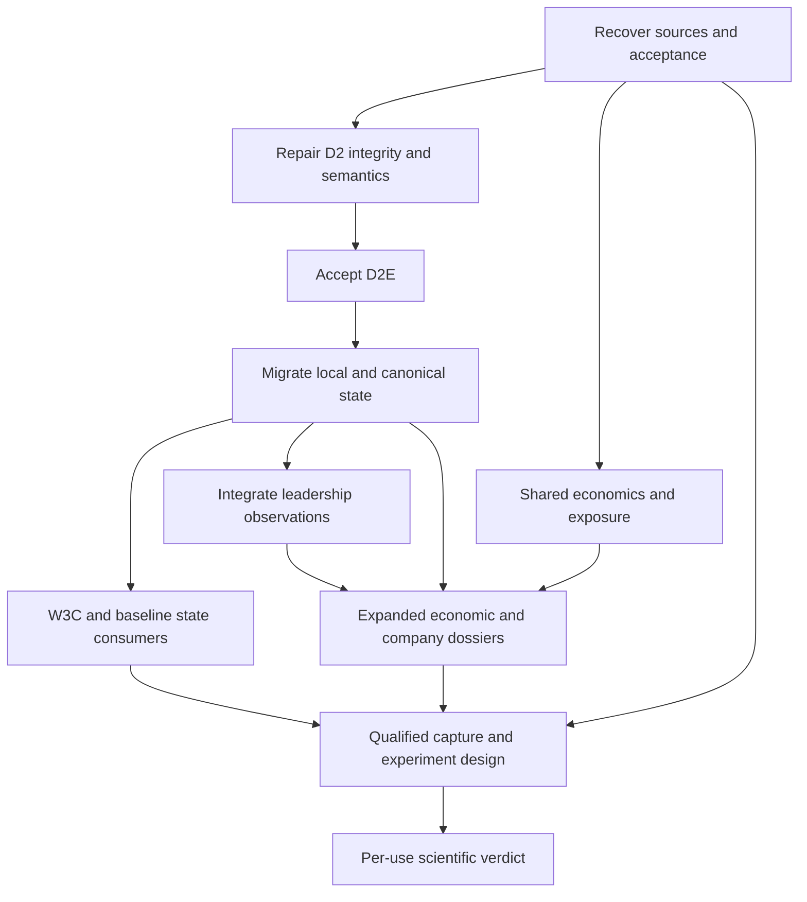

# GMI Theme/Subtheme Intelligence — Audited Master Plan v3

**Date:** 2026-10-03  
**Program:** WS:GMI-THEME-GRAPH, composed with incumbent F04, STSI, Company Intelligence, Prophet, Terminal and Evaluation owners.  
**Carrier:** [Macro PR #8324](https://github.com/mastermindx-market-intelligence/macro/pull/8324).  
**Disposition:** executable research/architecture plan for Astra CEO; implementation and production acceptance remain incomplete. This document was produced in standard Pro execution. No additional Deep Research run was used.

## Executive decision

**Retain the existing GMI organism and repair its actual correctness and integration gaps before widening its authority.** The uploaded revision has a sound direction, but it is not safe to execute mechanically. Its claim that D2D has become acceptance-only is too broad; it omits the required W3C U.S./China post-selection capability; it can suppress valid unmapped local themes; it overlooks a real Terminal consumer and Company Theme Exposure publication path; and its research/evaluation chapters do not yet define how the proposed intelligence could earn predictive use.

The re-census also found concrete defects that the previous plan did not identify: permissive history reads can reach replacement writes; the graph can disagree with its PIT membership owner about removed members; the Neural Web narrative leg expects incompatible input shapes; a long-lived rights reader can retain a stale permission; and the open Prophet evidence compiler has rights/null incompatibilities. These are source-level findings with bounded reproductions, not claims that a production incident or financial loss occurred. The accompanying audit distinguishes exact source inspection, controlled reproduction, historical testimony, current generated artifacts, and unobserved production behavior.

The immediate critical path is:

**recover custody and acceptance criteria → repair history/temporal/observation defects → finish residual D2D curation and owner binding → accept D2E → migrate one local-plus-canonical ThemeState → deliver W3C and governed consumer composition.**

Shared economic research, exposure evidence acquisition, and lawful evaluation capture can advance in parallel where their real inputs and ownership are independent. They do not need to wait for an unrelated vendor's public-display permission or every dashboard migration. Predictive promotion remains a separate, evidence-dependent outcome; a negative result is a legitimate scientific completion.

## How Astra should use this paper

This is the single implementation entry point replacing the earlier 125-line Master Plan v2 at this path. Read the companion [audit](../../../research/gmi/GMI_THEME_SUBTHEME_NORMAL_PRO_AUDIT_2026-10-03.md) for finding-level evidence and the [scientific review](../../../research/gmi/GMI_RESEARCH_AND_EVALUATION_AUDIT_V3_2026-10-03.md) for the complete primary-source ledger and experiments. The [handoff prompt](../../../research/gmi/ASTRA_CEO_GMI_HANDOFF_2026-10-03.md) commissions the recipient to execute this plan; it does not itself establish pickup, source custody, a RuntimeBinding, or deployment authority.

Re-pin current protected Mastermind procedure and the relevant implementation heads at execution time. Read material changes to this audit's source set, not the entire historical program again. Preserve the accepted conclusions below unless a relevant source, contract, authority, or observation changes.

### Evidence boundary and source identities

| Evidence | Exact identity and limit |
|---|---|
| Protected procedure | Initial Mastermind master **20adcaf65c2dd1bb734ab06e215feb1a0eb65659**; protected publication recheck **cb8398a30b27ef6f0c369d803daab45bb28c337e**, same required procedures reloaded with no semantic change; INDEX schema mastermind.sol_skillpack.v1, skillpack 1.0.1, bootstrap major 1 compatible. Current enrolled ACTIVE_EXECUTION is the finalization owner; WEB_CEO_DELEGATION is enrolled; SESSION_RELIABILITY is not enrolled at this pin. |
| Macro implementation census | **bebcb24db8707f93c3acca470590fead13e78dbd**. Moving default-branch search was used only for path discovery; implementation claims bind to this pin or a separately named PR head. |
| Terminal implementation census | Canonical repository **mastermindx-market-intelligence/mastermind-terminal**, master **41b8af2da46614cedd2a485214e53003d4f030fc**. The colloquial repository name Terminal must not be used to infer absence from a failed lookup. |
| Earlier #8324 documents | Head **3a8c71456e44e32d597ba648e372a08416dbaa6f**; open Draft when recovered. |
| Uploaded latest revision | deep-research-report (6).md; 1,055 logical lines (1,054 newline characters), 65,630 bytes; SHA-256 **ba9a28e88836ac9d0f5b385612f8985f87d22af8e92f6c9e9a4ad6475f29c21f**. |
| Executive observation | Readonly executive_state succeeded at **2026-10-03T09:57:04Z**, with no degraded inputs, Mastermind at the procedure pin and Macro at **88804ed7079700c598bb8e04aa64307d1335402d**. This differing runtime grounding was preserved. Aggregate state does not establish a GMI worker/Job/Attempt. |
| What this audit did not prove | No production deployment, live user journey, ordinary new source event through every consumer, actual rights entitlement change, full-repository CI, historical alpha replication, or predictive promotion. |

At the publication-boundary recheck, Macro main was **3d9969c15bba0f57b64da7592c0731cc8a0f2eac**. Root-tree comparison showed only the site subtree changed; implementation, configuration, data, contracts, research and Agent OS trees were unchanged. The new site narrative still has six dictionary-leg narratives, and the site state still has 18 themes with all narrative values null. Terminal master was unchanged. Initial counts and reproductions remain tied to the original census pin.

The source-linked audit and evidence files are the durable record. Opaque file citations from a previous ChatGPT run have not been carried forward as proof.

## 0. Acceptance summary for every execution handoff

A packet is accepted only when its claimed behavior is verified at an exact source/artifact revision, existing ownership is preserved, required rights/time/identity/null rules hold, and its real consumer and refresh/correction obligations are either proven or explicitly retained as incomplete. Original GMI completion requires full D2C/D2D/D2E, local-plus-canonical W3B and finalized U.S./China W3C. Expanded product completion additionally requires the declared economic/exposure/leadership and consumer envelope. All decision authority stays off until a separately accepted per-use result. Actual worker handoffs must include their applicable acceptance gates inline; a plan link alone is insufficient. For UI work, include the applicable dark/light, EN/ZH, desktop/mobile and degraded-state gates directly. The complete acceptance matrix is in §9.

## 1. Product outcome and completion boundaries

The user should be able to ask: **What is developing, where is it strongest, how broad is it, why does it matter economically, which companies express it, what contradicts it, and what should I watch next?** The answer should be consistent when moving from Sector Central to a subtheme, a company, Prophet context or Terminal.

The system must distinguish four questions instead of forcing them into one score:

1. **Association:** which source-local or canonical themes relate to this company or selected cohort?
2. **Observation:** what do price, participation, concentration, operating evidence and expectations actually show at the stated time?
3. **Interpretation:** which supported explanation, conflict, deterioration or watch condition follows from those observations?
4. **Decision:** does an existing Prophet, Terminal, risk or entry owner have enough evidence to act? GMI supplies context and never silently assumes this authority.

### Three distinct completion decisions

| Boundary | Required completion | What can remain open |
|---|---|---|
| **This audit assignment** | Current-source reassessment, hardened plan, source/claim ledger, actionable handoff and verified GitHub publication. | All production implementation. |
| **Original GMI D2/W3 development frontier** | Accepted D2C/D2D/D2E; one local-plus-canonical ThemeState with history; W3C over real finalized U.S. and China selections; required natural producer/reader and downstream F04 proof. | F04 product evolution, additional domain coverage and later authority experiments. |
| **Expanded Theme/Subtheme Intelligence program** | A declared coverage envelope with leadership, economic research and typed company exposure; coherent required human/machine consumers; reliable refresh/correction/degradation; evaluation capture and a governed forward report. | Unsupported future predictive uses remain disabled. Additional verticals remain explicitly owned backlog, rather than being silently described as complete. |

The accepted finish-and-fold architecture closes unique GMI development after D2/W3 acceptance and keeps F04 as downstream product composition owner. This paper does not recreate standalone GMI W4/W5/W6, a Theme Sensorium, or another transmission engine. [S1]

### Initial coverage envelope

Freeze exact cohort/source coverage in the first execution packet. Required acceptance spans **both U.S. and China**, at least one otherwise eligible **unmapped local concept**, a mapped local/canonical example, a sparse or concentrated cohort, a removed/reappearing membership, and **two economically dissimilar domain adapters**. Semiconductors plus an already-owned non-technology vertical such as Energy or Consumer is a practical first conformance pair; the owner must select it from lawful, ready evidence rather than choose the pair for favorable returns.

The launch envelope limits supported measurements and publication uses; it does not reduce D2D's required inventory denominator or discard original source-family obligations. Required gaps remain explicit even where concepts properly remain unmapped.

All existing domain programs receive a disposition and compatible common interface. Two-domain conformance proves that the kernel can generalize; it does not prove all sectors have been implemented or populated. A dashboard must expose its coverage limits. The whole expanded program cannot be called complete while an explicitly required launch surface or market is missing.

## 2. What the new audit changes

| Earlier assumption | Audited ruling | Consequence |
|---|---|---|
| D2C/D2D are acceptance-only after merge. | Core D2C integration and D2D readers are delivered. D2C has concrete boundary defects; full D2D still includes curation, exact owner binding and natural projection. | Preserve code; repair only demonstrated gaps and satisfy the original full acceptance contract. |
| ThemeState identity is always a canonical theme ID. | One authority must support **source-local and canonical subjects**. Unmapped local state can be useful and measurable. | Mapping absence blocks only the projection requiring that mapping. |
| Prophet #8240 covers the selection integration. | #8240 is an Early Leadership research compiler. W3C post-selection annotation is a distinct accepted obligation. | Build/accept both interfaces without changing finalized selections. |
| Terminal thematic context is wholly missing. | A company-theme API, immutable R2 resolver and mounted context card already exist. | Extend that seam for graph-backed state; preserve latest-event and generation checks. |
| Exposure has no clear natural publication path. | The company-intelligence workflow already builds and publishes the sidecar to R2. | Verify ordinary execution and served consumers; do not invent a publisher. |
| #7211 should publish every thematic projection. | #7211 owns its Sector Intelligence Git/site family; Company Intelligence has a different incumbent publication family. | Share contracts/generation references while preserving each actual publication owner. |
| A merged STSI contract proves a governed dossier implementation. | #7777 establishes a contract/plan slice; the planned generic dossier composer/builder/consumer/payload were not present at the audited main paths. | Distinguish specification from runtime; implement the missing owner-preserving reader. |
| #7886 title implies implementation in that PR. | Its eight changed files are Markdown coordination/research. The real public owner-bundle loader is on #7870. | Preserve that public-reader progress, without inventing #7886 code or completed private-source integration. |
| Fresh graph metadata proves fresh members and evidence. | Build time and source-vintage time differ materially. Narrative source shape mismatches produce null state. | Qualify freshness per dependency and test actual observation consumption. |
| W2 is merely future research context. | Incumbent preregistration, measured results and rejected constructions already exist. Some explanatory claims need an erratum. | Reuse results, preserve nulls/refusals, append corrections; do not optimize old experiments anew. |
| Many agreeing legs are independent confirmation. | Several legs share prices, members, sources or event ancestry. | Report dimensions separately and test incremental contribution. |
| One forward report or successful example earns promotion. | It establishes operation at most; power and prospective testing remain separate. | Support SUPPORTED, NOT_SUPPORTED and INCONCLUSIVE outcomes. |

These corrections supersede the earlier report's corresponding assumptions, capability labels and sequencing. They do not repeal accepted identity, rights, PIT, additive-versioning, curation, no-ranking or specialist-ownership law. [S1] [S2] [S3] [S4]

## 3. Canonical ownership and interfaces

| Responsibility | Incumbent owner / seam | GMI integration rule |
|---|---|---|
| Issuer/security/market identity | Data OS and accepted identity owners | Reference exact IDs and versions; no second master or ticker-only identity. |
| Source-local and canonical thematic semantics | engine/theme_graph; ontology, probation, structural navigation | Preserve namespaces and typed relationships. Proposals do not become accepted vocabulary by publication or model confidence. |
| Membership acquisition and history | Existing source collectors and engine/basket_membership_pit.py; THS consumes its PIT history, Finviz its dated vintage ladder, and five other basket families their current-document paths | Extend completeness/correction support within the owner; no rival snapshot ledger. |
| Graph belief, lifecycle and evidence | engine/theme_graph/store.py and materialize.py | Preserve append-only revisions and lawful current/as-known queries. |
| Source rights and capabilities | config/theme_sources.yml, engine/theme_graph/rights.py and capability.py | Separate internal use, emission, measurement and mapping eligibility; current registry decisions govern. |
| Thematic synthesis | Reconciled successor of engine/neuralweb/thematic_state.py under accepted GMI ownership | One active state producer for local and canonical subjects. Neural Web becomes a consumer after controlled cutover. |
| Price/breadth/leadership observations | Incumbent subtheme/sector lanes #7455/#8299/#7976 and their native measures | Separately report measures, same-vintage cohort semantics and qualified nulls. |
| Economic research | #7870 common binding/registry/mount/public bundle seams, domain-owned composers; #7886 coordination | Reuse the real shell and source loaders; domain economics remain local to each adapter. |
| Company economic evidence/exposure | Company Intelligence and engine/company_theme_exposure | Extend typed evidence, not membership-derived invented percentages. Preserve its R2 publication and lineage. |
| Governed product reads | STSI contract/federation, F04 composition | Join owner results, preserve disagreements and missingness; do not calculate a rival state. |
| Human publication | Each incumbent publisher, including #7211 and Company Intelligence/R2 | No universal replacement publisher. Share source/generation references and compatibility rules. |
| Finalized selection explanation | W3C read-only cohort contract | Preserve source cohort identities, order and reasons in U.S. and China. |
| Prophet research / ranking | #8240 research compiler; existing Prophet decision owners | Fix rights/null/source bindings; context-only until separate promoted use. |
| Terminal | mastermind-terminal company-theme-context API, companyThemeExposure resolver, CompanyThemeContextCard | Preserve authenticated access, immutable-generation verification and current-event boundary. |
| Options, catalysts, events, entry, macro | Existing specialist owners; Live Entry Radar retains expert-event ownership | Reference exact receipts; do not build a new options/event/entry plane or infer causality from co-membership. |
| Relationships and transmission | K3-D / accepted relationship owners; MarketOntology F04 composes | Separate membership, similarity, co-movement, exposure and causal hypotheses. |
| Outcomes, replay and promotion | Evaluation OS / accepted QLedger/consequence owners | Add GMI registrations and artifacts there; no separate grader, backtester or result ledger. |
| Runtime and continuity | Executive OS; Agent OS; GitHub; Slack as transport | This plan creates no scheduler, queue, memory, retry or permission authority. |

### Why federation is the preferred architecture

A new thematic database would duplicate source identity/history and fail to solve the defective seams already present. A single giant ThemeState score would hide differences between economic condition, market participation and entry suitability. Leaving each dashboard to interpret its own inputs preserves the contradictions the user wants removed.

The selected design uses **one state authority, referenced specialist observations and owner-preserving projections**. Its cost is explicit version/generation compatibility and per-field missingness. That cost is justified because it makes disagreements inspectable and prevents one stale input from masquerading as an entirely fresh answer. Two immutable schema generations may coexist during migration; this is compatibility, not two independently authoritative writers. [S1] [S5]

## 4. Contract design that must be frozen before implementation

The fields below are proposed contract obligations, not a claim that a deployed API already exposes these names. The implementation owner must map them onto incumbent schemas, retain additive v1 compatibility, and introduce a versioned successor for genuine breaking changes. No model may rename existing IDs or activate reserved-null graph quantities as a shortcut.

### 4.1 Subject identity

A state subject is a discriminated union:

| Subject | Required identity | Optional relationship |
|---|---|---|
| Source-local theme | Exact source family and immutable native concept ID, such as the existing Finviz/THS namespace | Zero, one or several accepted canonical relationships, each with type, curation revision and evidence |
| Canonical theme | Exact GMI theme ID and ontology revision | Parent, overlap and other accepted semantic relationships |

Sector, industry, operating group, basket, ETF, issuer and security remain different object kinds. A basket is an expression with its own membership/weight method; it is not identical to a theme. A source-local concept does not become canonical through lexical similarity. Do not force a strict tree: multiple memberships and typed polyhierarchy are legitimate.

Retirements, merges, splits and aliases preserve history and old identifiers. A current label is not an immutable historical name. Cross-market aliases do not automatically make two cohorts comparable; currency, session calendar and economic scope remain explicit.

### 4.2 Observation and state envelope

Every observation/state must carry enough information to explain what was knowable and what was actually consumed:

| Field family | Required meaning |
|---|---|
| Subject and version | Object kind/ID, identity and ontology revisions, measurement/transform version |
| Effective time | Period or interval the fact describes; market calendar/session and timezone |
| Availability | Source publication/observation time, Mastermind first-known time, consumer received time where decision use is tested |
| Computation | Build time, source generation/hash set, producer code/schema version |
| Historical query | Explicit as-of and knowledge cutoff; observed versus reconstructed membership/evidence |
| Completeness | Expected population, known eligible population, observed members, source collection outcome and missing reasons |
| Eligibility | Owner-backed use verdict for the exact audience/purpose; measurement eligibility separate from canonical mapping |
| Evidence | Immutable source/extraction/curation references and correction/supersession ancestry |
| Values | Typed units and basis; numeric value or typed null, never unavailable converted to zero |
| Interpretation | Supported named dimension or conflict, evidence rule/version, and scope/horizon |
| Authority | Explicit inherited context-only limits and any separately approved use; no self-promotion |

A newer build timestamp cannot refresh an old observation. A daily close state cannot claim intraday discovery latency. Unknown clocks refuse the historical/decision-bearing use that needs them, while a clearly labeled descriptive view may remain available when its owner contract permits.

### 4.3 PIT, negative evidence and corrections

The existing owner-to-graph contract needs an explicit distinction among:

1. successful complete snapshot with members;
2. successful complete snapshot of an empty or retired concept;
3. partial snapshot;
4. uncollected/failed source;
5. correction to a previous known assertion.

Absence in cases 3 or 4 must not manufacture removals. Cases 2 and an explicit valid removal must not leave old graph memberships open. Extend the incumbent membership owner to expose collection completeness and negative evidence; the graph consumes that receipt rather than independently interpreting a missing group.

For a query at effective time t and knowledge cutoff k: first exclude assertions not known by k, then resolve the latest eligible belief/correction, then apply the valid interval. A later correction may change today's corrected historical view; it must not change what a prior decision knew. Apply this to identity, membership, ontology, rights/use qualification, prices/adjustments, fundamentals, estimates and curation—not only membership.

Preserve documented daily first-write histories as their existing product. They do not provide every intraday correction or the complete input snapshot needed by future evaluation. When a richer record is required, version/extend the same owner with new revision identity and references; never overwrite old daily evidence or create a parallel history authority.

An unreadable prior authoritative store is a refusal, not bootstrap emptiness. A valid empty initialized store and an absent never-initialized store need separate admitted paths. Writes must validate the prior generation, build a candidate atomically, validate it, and preserve the last good generation on failure. The existing lane/custody owner governs serialization and publication.

### 4.4 Rights, eligibility and audience

Current source registry values, actual source terms and accepted owner decisions govern use. This plan makes no new legal determination and authorizes no vendor purchase or entitlement. Preserve the existing internal-only posture for unresolved source families where current law permits internal evidence; do not interpret internal accessibility as public-display permission. [S5]

Required separations are: acquisition permission, internal computation, derived public display, raw redistribution, canonicalization eligibility, measurement eligibility, and population coverage. A verified internal-use verdict can permit internal research without public display. An arbitrary nonempty rights string cannot.

Bind rights decisions to a version/generation and invalidation rule. Same-path process caching must not make a downgrade ineffective. Before public emission or research admission, validate the relevant ancestry and permitted view with the owner. Restricted fields, derived quantities and evidence references must not leak through a permissive wrapper. An unavailable field can produce an approved minimal null/reason envelope without publishing the restricted value.

Do not block every lawful cohort while one vendor's rights are unresolved. Use the permitted coverage envelope, disclose exclusions and route only the actual remaining decision to its owner.

### 4.5 ThemeState dimensions and abstention

ThemeState synthesizes referenced observations; it does not own their native raw calculations or become a ranking engine.

| Dimension | Accepted interpretation rule |
|---|---|
| Market strength | Named return/relative-strength measurement with horizon, benchmark and population |
| Acceleration | Declared change-of-rate measurement, distinct from rank change and ordinary level strength |
| Participation | Observable eligible breadth with denominator/coverage and composition changes |
| Persistence | Predeclared recurrence/duration, with overlapping-window limits |
| Concentration | Weight and contribution concentration reported separately |
| Economic thesis condition | Domain-supported operating/cash-flow evidence, with an explicit baseline and time period |
| Expectations | PIT revision/consensus evidence or a clearly named proxy; no implication from price alone |
| Recognition | A declared price-response or valuation/expectations proxy; no unsupported claim of underpricing |
| Attention/crowding | Specialist observation with exact proxy and event ancestry; not generic sentiment or bullishness |
| Deterioration/risk | Named observed failure/conflict, not an invented trade veto |
| Lifecycle | Ontology/economic lifecycle distinct from market strength and entry phase |
| Watch conditions | Specific future observations that would strengthen, weaken or invalidate the interpretation |

Use per-leg states such as measured, partial, stale, insufficient, conflicting, restricted and not applicable. Sparse/concentrated cohorts can have useful descriptive measurements while failing a proposed inference. Unmapped status is a relationship result and blocks only canonical projections that require the missing relation. There is no global zero score hiding these distinctions.

Conflict classes include time horizon, subject scope, source freshness, population coverage, methodological difference, authority/use difference, genuine fresh contradictory evidence and evidence unavailable. When two qualified claims disagree, retain both with their bases; do not average them into false confidence.

Example permitted product statements are: “Memory participation is broadening while the parent semiconductor group remains mixed”; “Operating evidence improved, but the entry specialist reports an extended setup”; and “Price strength is measured; economic confirmation is unavailable.” These are illustrative wording, not current market claims.

### 4.6 Leadership measurements

Measures are **separately reported, not statistically independent**. Freeze definitions before comparing #7455, #8299 and #7976. Their local/canonical identity, source clocks, roster vintage, eligible denominator, session endpoints and aggregation policy must agree before numerical parity is expected.

For a one-period basket return use the sum of start-of-period weights times member total returns. For an H-session strategy return, compound daily returns under its stated rebalance rule. A frozen t-cohort outcome, a window-start weighted buy-and-hold basket and a daily-rebalanced index are different constructions. Do not silently switch among them.

Relative strength must name arithmetic excess return, return ratio or a risk-model residual. Acceleration must specify its transform—for example, the difference between adjacent recent/prior-window mean residual returns divided by past-only volatility. That example is a research candidate, not an approved production default. Rank change requires a fixed comparison universe or an explicit universe-change decomposition.

Breadth reports observed/eligible/expected counts. For same-cohort broadening, compare the same members at both endpoints and report membership entry/exit separately. Missing-to-positive is not a newly crossed technical condition. Endpoint transition counts are not a complete count of all events inside a window.

For nonnegative normalized weights, HHI is the sum of squared weights and effective weight count is 1/HHI. This is concentration, not the number of independent statistical observations. Signed performance contributions need separate positive/negative denominators; near-zero net return makes net contribution percentages unstable. EW, cap-weighted and median behavior can legitimately disagree.

No missing observations are silently redistributed into stronger available weights. No minimum cohort size is met by adding economically unrelated names. Keep price-only observations distinct from earnings revision, exposure and entry evidence. Reserve return-based or exposure-magnitude user ordering unless the incumbent ordering authority explicitly permits it. [S5]

### 4.7 Economic research and company exposure

The reusable grammar is: **mechanism → business role → operating fact → earnings/cash-flow consequence → expectations → valuation/required return → observed price response**. Each arrow is a typed claim with evidence or a hypothesis, not proof of causation.

The shared kernel owns approved generic query/bundle/refusal, time/selection/generation and composition/transport primitives, plus the existing closed registration/mount seams. It consumes the existing evidence, curation, identity and rights contracts; it does not acquire their authority or define a second universal financial/evidence schema. Semiconductor inventory/capex/cycle semantics, Energy value capture, Consumer pricing/volume/margins and other domain facts remain in their adapters. One vertical must not be imported eagerly by the generic shell or become the template for every sector's economics.

The current #7870 public owner-bundle loader and its validation are valuable implementation. A private assertion/interpretation tuple still needs an admitted owner and actual source binding. “Public reader built” is neither “all private sources bound” nor “product deployed.” Preserve those distinct gates and every incumbent domain recovery decision.

Extend Company Theme Exposure with records that distinguish:

- disclosed revenue share, estimated revenue share, profit sensitivity, capex intensity, customer/supplier dependence, qualitative role and forecast exposure;
- numerator/denominator, units/currency, fiscal period, gross/net treatment, estimate/observation basis and uncertainty;
- source document/accession, first-known time, extraction/curation version and correction lineage;
- direct, indirect/proxy, beneficiary, adverse, substitution and enabling roles;
- scenario-conditioned direction. A demand increase can help a supplier but reduce a buyer's near-term free cash flow through capex.

Shares across overlapping themes need not sum to 100%. Values across different measurement kinds must never be summed. A missing magnitude remains null. Membership, geography revenue, market beta, generic vendor relevance and an LLM judgment are not substitutes for measured theme revenue.

The graph's existing reserved-null economic/trading/attention axis fields remain reserved unless their owner separately accepts a formula and use under the current constraints. Respect DNR:HOLD-TICKER-EXPOSURE-TAGS and the incumbent W2 boundaries; the new research packet is not an implicit reopening or exposure ranking permission. [S5] [S6] [S7]

### 4.8 W3C, Prophet and Terminal boundaries

**W3C:** read finalized U.S. and China selections, record their artifact/schema/generation, selection timestamp, exact securities, source order and reasons where the source owner exposes them, and append only a descriptive semantic view. Require source cohort digest and ordered ID/reason equivalence before/after. Include multiple-theme overlap and no-overlap cases. Output includes selected counts/fractions, overlapping local concepts, legitimate canonical references, state/evidence references and coverage; missing identity/state, stale context and no-overlap have typed results. Membership and state must both be valid and knowable at the selection cutoff. Missing mandatory clocks/identity go back to the selection owner rather than being guessed. A neighborhood distinguishes already-selected securities from verified non-selected contextual neighbors. Later explanations are versioned; the existing consequence episode hook is extended under QLedger/grader law. No insert, drop, rank, size, gate, originate or escalate. [S2]

**Prophet #8240:** retain the existing research compiler, correct arbitrary-rights-string readiness, and adapt typed-null/partial legs to the accepted state contract. Bind inputs to real graph/state/exposure receipts rather than synthetic all-numeric shapes. A rights-blocked minimal output must not retain a value whose use/emission is forbidden. Current disabled decision flags stay disabled. Feature availability and research usability are separate from stock eligibility; GMI may not reject a stock merely because its theme data are missing.

**Terminal:** extend its current company-theme-context route and R2 resolver. Preserve authentication, path validation, immutable manifest/file verification, matching Company Intelligence generation/event and the historical-event quarantine. The existing card is current/latest-event context; historical context requires explicit as-known support rather than displaying today's sidecar against an old event. Daily theme context is not intraday tactical evidence. [S8] [S9] [S10]

## 5. Dependency-ordered execution packets

These packets specify outcomes and integration seams. They are not automatic commissions, custody transfers or permission to merge someone else's open branch. Astra first recovers each incumbent writer and pending effect through existing owners. Where a carrier is merged, a bounded repair uses the existing program's lawful successor operation; do not resurrect a squash-merged branch. Where a live open carrier owns the path, coordinate or integrate there under current custody.

### Packet A — source recovery and an acceptance map

**Owner:** Astra principal with GMI/F04 and source owners. **Inputs:** this paper, current protected procedure, WS:GMI-THEME-GRAPH, original D2C/D2D/D2E/W3B/W3C packets, current PR heads, runtime/source-custody evidence.

Produce one current acceptance map: original requirement → current source → source-level proof → natural/consumer proof → residual gap → existing owner. Split D2D reader delivery from curation and structural owner binding. Preserve historical accepted evidence rather than marking everything unbuilt because this audit did not re-observe production. Record the exact source coverage and publication owners. Separate THS observed history, Finviz vintages and other families' current-document temporal bases; accepted D2C does not imply historically complete all-market membership coverage. Do not project a runtime job from GitHub prose.

**Exit:** every required D2/W3 criterion has an explicit disposition; no unknown active writer is displaced; current bugs/holds are bounded; accepted work is under DO_NOT_REDO. Update stale Agent OS claims only to the level established by evidence, using its schemas. Do not mark an entire TODO done from a merged reader PR.

### Packet B — protect history and fix owner-to-graph membership semantics

**Owners/seams:** engine/theme_graph/store.py; engine/basket_membership_pit.py; engine/theme_graph/local_sources.py; materialize.py; their existing tests and collection lanes. Reuse #6809/#7458/#7462 lineage.

1. Make the authoritative append path refuse unreadable/schema-invalid prior stores; distinguish first initialization from broken existing data. Preserve prior bytes/manifest on failure and return a typed failure rather than a false no-op or success.
2. Extend the incumbent snapshot owner with an admitted completeness/empty/retired distinction. Define partial-fetch behavior and negative evidence before changing interval synthesis.
3. Make graph membership agree with the owner for valid add/remove windows, wholly empty concepts, retired concepts and reappearance. Preserve first-known time and correction lineage; do not backdate a newly discovered snapshot.
4. Verify evidence references and unknown/source-shape refusals through strict current/as-known readers.

**Discriminating proof:** unreadable existing store cannot reach replacement publication; valid empty initialization succeeds; absent/partial source does not close memberships; complete empty source closes exactly the intended interval; explicit removed-at/before-snapshot member is absent; A→B→A yields two A intervals; a late correction is invisible before its knowledge cutoff; repeated same input has the documented no-op behavior; exact source ownership/lane fences hold.

**Natural proof owed:** an ordinary source collection and a later real source change/correction flow through owner history → graph → strict reader. A synthetic correction can prove mechanism, but must not be called an observed vendor correction. If no natural correction occurs during acceptance, retain that evidence-accrual obligation with an actual owner rather than manufacture a market event.

### Packet C — complete D2D residual semantics, then D2E

**Owners/seams:** graph ontology/probation/proposal_worklist/structural_navigation; current curation owner; rights/capability and graph contract guards. Original D2D operation: gmi-theme-ontology-d2d-20260827-sol-001. D2E operation: gmi-theme-accept-d2e-20260827-sol-001; recover current incarnations rather than assume they are running.

D2D must prove typed accepted/rejected/probation/unmapped states, reviewer/authority and time/version receipts, many-to-many preservation, structural links to real owner IDs, exact coverage denominators and natural consumption of accepted curation. The current September handoff still records unadmitted sodium-ion/vanadium proposals, a solid-state scope hold and lithium-battery/recycling identity gaps; these are **questions to resolve from current evidence**, not approvals to admit named concepts. [S3]

Prove ontology relationship corrections separately from member removals. An explicitly adjudicated mapping withdrawal, replacement destination, merge or retirement must close or supersede the appropriate earlier belief through the incumbent curation/graph owner, preserving the original as-known view. Same-pair receipt rekey, changed canonical destination, intentional withdrawal and partial/missing source require separate tests. Missing input alone must not authorize withdrawal.

D2E then accepts the D2 substrate: source-specific rights/coverage, local measurement eligibility, D2B3 identity/lifecycle natural evidence, strict guard behavior and ordinary publication. A bare exit code from an advisory graph check is insufficient. Verify the actual strict invocation, breach output and triaged notices; do not require an impossible “no notices” marker or assume every guard is merge-gating.

Existing capability.v1 classification is a substrate-presence hint, not measurement admission: three matching price artifacts/schema columns can produce measurement_candidate, while measurable is deliberately unreachable in that implementation. D2E must validate actual readable, nonempty, correctly identified and temporally eligible prices. The measurement owner must seal history, endpoint freshness and observed/eligible coverage requirements. Corrupt or empty price files, stale/short history, future observations and insufficient coverage cannot qualify merely because paths exist.

Fix the rights-cache revision boundary within the incumbent owner and test unknown/revoked/changed grants at each use boundary. Unknown vendor and malformed class fail the relevant gate. A public-safe projection must be derived from the current verified rights result, not a mint-time evidence boolean. Extend DAG input/output declarations for the real PIT and identity sidecars where missing; verify actual executor behavior before claiming list order caused an observed stale publication.

**Exit:** clause-complete D2C/D2D acceptance and accepted, exact-revision D2E evidence for the declared coverage envelope. Rights- or curation-held concepts remain explicit and do not become invented mappings.

### Packet D — repair incumbent observations and migrate ThemeState

**Owners/seams:** engine/neuralweb/thematic_state.py; actual narrative_emergence and membership input producers; state history and consumers; GMI state contract; STSI references. Original W3B operation: gmi-theme-state-w3b-20260827-sol-001.

Before migration, fix or explicitly retire each broken observation adapter. The current narrative reader expects list-shaped legs/tickers, whereas the inspected artifact uses dictionary legs and recommended rows; the membership reader expects tickers where current baskets carry members. Define the semantic source mapping with its owner, then test known positive evidence, valid empty evidence, stale/future timestamps and malformed shapes. Do not simply broaden parsing until something non-null appears.

Include Company Theme Exposure's exact neuralweb.theme_state.v1 schema, crosswalk theme-set and old authority acceptance, plus Terminal's closed company_theme_exposure.v1 item keys, in the mandatory migration. Qualify producer, scheduled builder, R2 object, BFF normalizer and card together before disabling the predecessor. Arbitrary fields added to closed v1 objects will not achieve compatibility.

Create a field migration table for every incumbent state field: keep unchanged, transform with explicit version, reference a specialist, or retire with consumer agreement. Preserve old history's genuine meaning; never relabel legacy records as graph-backed or point-in-time inputs they did not consume.

Run a shadow successor with no publication/decision authority. Compare identical input generations on mapped and unmapped local subjects, both markets, missing/contradictory evidence and corrections. Differences must be explained by documented semantics, not accepted because schemas parse.

Cutover is one owner action: designate the canonical producer, switch compatible readers, and disable the former competing producer. Preserve last-good compatible generations and rollback references. A rollback may restore one prior producer/version; it cannot leave two active writers. Where a consumer cannot accept the new version, return a typed compatibility failure or an explicitly approved prior-generation view.

**Exit:** one naturally refreshed local-plus-canonical state authority; historical lineage retained; source-bound state consumed identically by at least two machine readers; all predecessor consumers mapped; no second active interpretation producer; null/conflict/future-clock/correction tests accepted.

### Packet E — restore W3C Selection Cohort Intelligence

**Owner:** GMI cohort reader with U.S./China selection owners and F04 product composition. Original operation: gmi-theme-cohort-w3c-20260827-sol-001.

Implement the preserved-selection contract in §4.8 and route it to actual consumers. Prove one real finalized U.S. cohort and one real finalized China cohort, plus no-overlap and multi-theme cases. Preserve local usefulness where canonical mapping is null. Join state and membership at the finalized selection's declared effective time and knowledge cutoff; later corrections create a versioned explanatory receipt and never mutate the selection. Compare source digest, ordered IDs and reasons before/after; every decision-authority flag remains false. Register the required cohort consequence link through the existing QLedger/Evaluation owner, preserving its outcome clocks and authority.

**Exit:** users and machine readers can explain the selected cohort without changing it; selection-cutoff leakage refusal, versioned explanatory corrections and the incumbent consequence hook are proved. This closes a unique original GMI requirement even if predictive experiments have not earned any effect.

### Packet F — converge leadership observations

**Owners/carriers:** #7455 closed-session local leadership, #8299 missingness/history qualification, #7976 Finviz repricing/participation/durability, and their native Sector/Subsector owners.

First compare exact current heads and changed-path overlap. Produce one semantic field map over §4.6; retain each justified source-local observation and retire duplicate calculations only after consumer and parity evidence. Do not combine whole branches blindly or collapse their measures into a global score.

Correct common-cohort missingness, unqualified current-roster history and capitalization/weight timing at the appropriate owner. Historical evaluation uses actual PIT identity/membership/weights and delisting/corporate-action handling; otherwise its output is explicitly a current-roster counterfactual. Support current descriptive leadership without labeling it predictive.

**Exit:** real ordinary-refresh observations across unrelated theme families, exact source/measurement vintage, observed/expected denominators, concentrated/sparse/missing/parent-unavailable cases, same-cohort breadth controls and frozen qualified snapshots delivered to Evaluation OS.

### Packet G — finish the shared economic foundation and two-domain conformance

**Owner/carrier:** #7870 with domain owners; #7886 retains coordination decisions. Dependency examples include #7891 Technology ex-Semis and #8002 Energy; Robotics follows #8085 recovery after the #7908/#8013 merge/revert history.

Re-census the current #7870 implementation before prescribing more extraction. Keep its binding, mounts, registry and public bundle loader. Finish only actual generic/domain coupling, source binding, CI/restart/publication and consumer gaps. Shared code must not depend on the presence of an unmerged vertical merely to import the application. Unknown or unavailable verticals return a typed unavailable result, not a guessed substitute.

Retain vertical-owned slice and view validation; the common API must not force Semiconductor-specific enums/query fields on every domain. Lazy imports alone do not make the interface generic.

Conformance includes two materially different economic domains with their native fields preserved, exact source rights/known-time/extraction evidence and a useful dossier consumer. Test public and private bundles separately. Validate lazy-loading and deployment restart coverage together; a lazy adapter must not escape both import-closure and restart proof. The Robotics re-land must preserve its recovery manifest, test enrollment and restart obligations; this umbrella does not waive them.

**Exit:** accepted shared shell and domain contracts, exact-current integration tests/CI and required release proof; both domain journeys use real owner evidence. No claim that all other verticals shipped merely because common types compile.

### Packet H — evidence-backed company exposure

**Owner/seams:** engine/company_theme_exposure contracts/views, Company Intelligence source bundles, build_company_theme_exposure, existing R2 publisher and company-intelligence workflow; relevant member-evidence #7252 and specialist entry #7508.

Map existing membership projection fields to §4.7. Acquire the missing segment/business-role evidence through the incumbent source owner; separately validate extraction and semantic mapping before calculating any magnitude. Keep factual exposure tests independent of return outcomes. Demonstrate disclosed and unknown magnitude, proxy/direct roles, opposing scenario effects, share-class/security changes and revised disclosures.

Build and publish through the existing Company Intelligence generation and sidecar chain. Preserve exact Company Intelligence parent generation/latest-event binding. Theme→company and company→theme views must agree on the same evidence/time selection; neither implies a new underlying direct graph edge unsupported by a source.

**Exit:** two-domain exposure evidence with truthful units/nulls and correction lineage, naturally published sidecars and an actual Terminal/company consumer, no new exposure database, no unsupported numeric tags or ordering authority.

### Packet I — governed read federation and consumer convergence

**Owners/seams:** STSI #7577/#7777 contract and missing implementation, #7211 Sector Intelligence publication, F04/Neural Web, Company Intelligence/R2, Prophet #8240 and mastermind-terminal.

Start from the accepted sector dossier contract and incumbent composer/builder plan. Record a field-by-field grain migration: sector identity/ticker/benchmark and nested sector governance become explicitly typed subject identities and applicable benchmark/governance bindings. Preserve v1 sector consumers; use a versioned successor for breaking theme/subtheme changes. Prove both the existing sector case and mapped/unmapped theme/subtheme cases through the real composer and publisher. Then implement the missing governed composition on those accepted owner contracts. A filesystem contract or a configured workflow is not a served dossier. Pair each field with its source generation and freshness; atomically publish coherent views within each publication family, and verify compatibility across families.

Consumer acceptance is specified in §6. Start with a small vertical journey that includes real local/canonical state, company exposure and W3C, then migrate the remaining required named surfaces. Keep special-purpose entry/recommendation #7669 and visibility #7664 semantics under their owners; a renderer fix must not acquire state or policy authority.

**Exit:** every required consumer has a source/version compatibility rule, a real read path, ordinary-refresh/correction evidence and a degraded-state response. At least two human surfaces and two independent machine consumers share the same owner-backed state; this minimum integration proof does not excuse an omitted launch surface.

### Packet J — controlled discovery and cross-theme composition

**Owners:** existing GMI proposals/curation plus K3-D and F04. Foundational D2D curation occurs earlier; this packet is expanded discovery after that contract is accepted.

LLM/embedding/vendor/price-cluster outputs can nominate research candidates with source evidence. Freeze a blinded semantic test set and measure accepted useful concepts, duplicate/incorrect mappings, abstention quality and reviewer burden. Preserve reject/remain-local/merge/retire outcomes. A rising stock must not retroactively define a theme.

Compose typed relationships without turning proximity or shared constituents into a causal edge. Absent or insufficient economic evidence causes abstention. Disconfirming evidence remains visible and can weaken, reject or retire a transmission hypothesis; supported adverse exposure remains measurable under its declared scenario. Expose supported transmission hypotheses only through existing owners, with explicit uncertainty and disconfirmation conditions.

**Exit:** real proposals receive supported accepted, rejected, remain-local or merged dispositions with lineage and reader evidence. Where evidence supports admission, prove the lawful adjudication-to-natural-graph/read path. A valid negative or remain-local result is acceptable; no positive mapping is required merely to pass the program. No new discovery queue, event ledger or GMI transmission engine.

### Packet K — evaluation capture, sealed experiments and per-use decisions

**Owner:** Evaluation OS with GMI and consumer owners. This starts alongside Packet A only for inputs whose lawful capture/identity/clock contracts are already satisfied. Until those are qualified, capture development/operational evidence with the limitation intact.

Use the complete protocol in §7. Separate capture operation, research qualification, confirmatory evaluation and decision-bearing promotion. A first forward report must show what was captured, missing, excluded, corrected and unresolved; it must not pretend that a few favorable episodes constitute validation.

**Exit for evaluation infrastructure:** frozen source-linked snapshots and actual received consumer payloads can be replayed as known, delayed outcomes mature under existing clocks, corrections are versioned, a report is independently reproducible, and every proposed use has a sealed protocol or remains research-only. **Exit for any promoted feature:** its individual evidence and owner gates are satisfied; otherwise publish NOT_SUPPORTED or INCONCLUSIVE and leave authority off.

## 6. Product and machine acceptance matrix

| Consumer | Required user/machine job | Specific proof and retained boundary |
|---|---|---|
| Sector Central and sector/subsector detail | Explain parent condition and localized leadership without hiding strong children | Same state refs; scope/horizon and coverage shown; no independent thematic synthesis; #7211 publication stays scoped to its family. |
| Theme Tracker and theme/subtheme dossier | Show what changed, breadth/concentration, economic evidence, disagreement and watch conditions | Local and canonical identity explicit; unmapped local dossier remains useful; field-level stale/null/provenance; real membership→company navigation. |
| Company/Company Intelligence | Explain business role and actual evidence of thematic exposure | Evidence type/units/period; unknown magnitude; correct Company Intelligence generation/event; membership not mislabeled revenue. |
| W3C U.S. cohort | Explain a finalized U.S. selection | Exact ordered selection/reasons unchanged; PIT semantic join; no-overlap and multi-membership. |
| W3C China cohort | Explain a finalized China selection | Same preservation proof; market-native sessions/IDs; local lithium/battery/recycling distinctions without forced global mapping. |
| Foresight and Radar | Reuse thematic context alongside their specialist observations | No new event store or hidden entry/risk policy; genuine source disagreements represented rather than overridden. |
| Neural Web | Consume sole state and compose its existing views | Old producer disabled after cutover; narrative/pathway relationships retain their true owner; historical lineage remains distinguishable. |
| MarketOntology/F04 | Compose thematic evidence with typed economic/relationship hypotheses | #6929 incumbent exposure composer reused; graph/economic/similarity types preserved; absent evidence cannot become causal certainty. |
| Prophet #8240 | Produce qualified research comparison context | Closed owner-backed rights/use verdict; typed nulls; exact candidate/input vintage; actual all-decision-flags-false proof; no new candidate selector. |
| Terminal company-theme context | Deliver current company-theme context reliably | Existing authenticated API/resolver/card; immutable R2 verification; matching parent generation/latest event; historical selection quarantines today's context. |
| Options references | Explain what the options owner observed at the relevant horizon | Native sign/structure/coverage/time reliability; no raw-call-volume bullishness, assumed institutional identity/opening intent or duplicate options engine. |
| Evaluation OS | Grade the correct object/use on what was actually available | Captured payload+dependency refs; fixed full population; existing outcome owner; reproducible exclusions/negative results. |

### Publication and freshness protocol

Each family exposes a validated immutable/versioned publication receipt using its incumbent mechanism: for example, a Git commit for the site family or an immutable R2 generation with compare-and-swap marker for Company Intelligence. Reuse each owner's existing publication machinery; this plan does not require R2-style pointer semantics for every family. The graph, state, dossier and exposure references form a compatible dependency set; there is no need to invent one global publisher or transaction across every product.

Readers must refuse an incompatible mixture or display the last known good compatible view with its real age under the incumbent policy. They must not substitute a newer child into an old Company Intelligence event or relabel a cached payload as current. Preserve lineage-mismatch quarantine in Terminal.

Add a stopped-upstream acceptance case: Company Intelligence and its sidecar cease advancing while the old marker, immutable manifest and company object continue returning HTTP 200. The consumer must calculate/disclose semantic age under the owner's freshness policy rather than repeat an obsolete stored Fresh flag.

Measure source receipt → owner history → state generation → family publication → consumer receipt. Set each budget from the existing source cadence, exchange calendar and product horizon. A manual membership refresh and a daily price close need different budgets. Do not declare a source broken solely because it has no new trading session on a market holiday. Conversely a frequently rebuilt artifact does not excuse months-old constituent evidence.

Prove one ordinary new observation and its downstream generations, plus removal/correction and rights downgrade behavior. Record the distinction among a fixture, a controlled production-safe canary, a natural observation and a naturally occurring correction. Retain any owed natural-time proof with a durable owner; no fabricated receipt or idle Web watcher.

### User experience acceptance

Follow current Macro/Terminal design and navigation law. The default glance should explain the conclusion, change, breadth, economic support, conflict and next watch condition. Source methods, raw members, detailed clocks and historical traces belong in drilldown rather than requiring the user to assemble the interpretation.

A material UI change requires dark and light as deliberate art directions, EN/ZH, desktop 1440 and mobile 390 evidence under current product law. Test fresh, stale, partial, no-data, restricted, conflicting and mismatched-generation states, with keyboard/interaction and real navigation where applicable. A screenshot alone is not live-data proof, and a functionally correct screenshot does not prove design quality.

## 7. Scientific foundation and executable evaluation design

### 7.1 What research supports

The retained literature gives reasons to test group information and economically specified relationships. Industry momentum motivates a strong group-momentum baseline; industry-to-market lead/lag and customer/supplier studies motivate particular information-diffusion hypotheses; evolving product-market similarity motivates time-varying semantic relationships; attention research motivates a distinct, horizon-dependent attention measure. None establishes the predictive value of arbitrary Finviz/THS cohorts, GMI's proposed interactions, or intraday/1–3-session decisions. The complete source-to-claim boundaries are in the scientific review. [R1–R6]

Professional systems are methodological precedents, not a common truth metric. FactSet granular business activity and supplier relationships, MSCI relevance, S&P thematic index expressions, Morningstar holdings consensus versus analyst thematic research, and FTSE taxonomy methods answer different questions. In particular, MSCI explicitly distinguishes thematic relevance from measured thematic revenue share; holdings-based consensus is not independent operating evidence. Use original implementation and authorized sources. [V1–V5]

The selection of transitions/disagreements as product priorities is a **design hypothesis**. Its expected alpha is unknown. Keep simple momentum, parent behavior and existing consumer context as serious competitors rather than declaring the sophisticated system superior in advance.

### 7.2 Incumbent W2 — preserve results and append errata

W2 already preregistered and measured exposure-axis computability/distinctness/stability. Preserve its exact historical construction IDs, receipts and qualified verdicts. Economic share was an honest null requiring ingestion and formula adjudication. The ex-self beta construction used reconstruction-era membership. Monthly CN LHB attention was refused as price-selected and unstable; US WSB/flare had coverage/staleness/degeneracy limitations. These are not blank invitations to reuse the same source under a new label. [S6] [S7]

Append the confirmed mathematical correction: the implemented common transformation b' = 0.66 b + 0.34 mean(b) reduces dispersion but preserves each cross-sectional rank and tie. It therefore does not inflate the Spearman H2/H3 statistics on the same observations, despite the historical report/docstring saying it would. Keep the raw-beta choice and historic results; do not rewrite the preregistration or reselect an estimator. The diagnostic evidence accompanies this audit.

Also correct the claim that full-sample attention universes are harmless in a short panel. Future knowledge of source coverage can leak into an earlier month at any panel depth. Named-stock expectations and a median beta near one are diagnostics, not correctness proofs. Calendar accrual dates are review prompts; actual source freshness, known-by coverage and independent information determine readiness.

### 7.3 Experiment manifest and outcome policy

Every proposed predictive or decision-bearing use must have an immutable Evaluation-owned manifest containing:

- hypothesis and estimand, object domain and full eligible population;
- decision cutoff, market/session/currency/total-return convention and first feasible receipt/action time;
- identity, membership, weight, benchmark, source, extraction/curation, model/prompt and feature versions;
- primary horizon, outcome, loss/utility and incumbent/strong baseline definitions;
- missingness/abstention, correction, delisting, failed-source and delayed-label treatment;
- exact feature/threshold/model trials, including rejected/null/abandoned variants;
- primary test family, dependence-aware interval/resampling method and multiplicity treatment;
- a minimum practical improvement margin and tolerable harm/coverage/latency limits;
- an information/power target, analysis date or predeclared sequential rule, and futility/stop rule;
- consumer-owner acceptance and rollback conditions.

Numeric practical margins and power targets must be chosen from the actual consumer's base rate, costs and outcome variability before confirmatory outcomes are inspected. This audit cannot legitimately invent a universal Sharpe threshold, percentage win rate or minimum calendar duration. Astra must obtain the needed baseline/cost evidence in the first experiment packet and seal those values; until then the lane is development research, not a completed preregistration.

Capture can begin early, but mark **development**, **operational shadow** and **confirmatory** vintages separately. The confirmatory tranche begins only after the relevant feature/taxonomy policy, transforms, model fit schedule, labels, thresholds and consumer use are frozen. Prospective collection while choosing them remains useful development evidence; it is not untouched validation.

Use past-only transforms and blocked walk-forward fitting. Purge training labels whose outcome intervals overlap held-out decisions and separate windows where required. Preserve whole cross-sections in time-block resampling and account for issuer/theme-family overlap; randomly splitting theme rows creates false independence. Feature-family ablation and held-out economic-family transfer are different experiments. Multiple-testing methods address search; none repairs lookahead or a wrong measurement. [R7–R9]

Probability calibration applies only to a probabilistic forecast of a defined event. A descriptive strength number is not a probability. DSR is relevant to a selected return series, not a universal certificate for explanatory features. Report uncertainty and incomplete label maturity; do not stop at the first favorable weekly result.

### 7.4 Five initial experiment contracts

| Experiment | Primary question, baseline and outcome | Falsifier / authority boundary |
|---|---|---|
| **E1: child information** | Predict next 20 completed sessions' **parent-minus-child** frozen-cohort excess total return; 5 sessions is a predeclared secondary horizon. Baseline: parent-minus-child past returns, market state/volatility; stronger baseline adds ordinary child relative return, size and concentration. Challenger adds declared acceleration and participation change. | No gain beyond child momentum; effect disappears excluding child members or matching random child partitions; only CPU/Memory works; overlap-adjusted evidence vanishes. Association is not causal transmission. |
| **E2: economic expression** | Within one declared economic shock family, test typed pre-existing exposure/role against future company outcome conditional on the same PIT theme state. Use 20-session return and a separately specified next-disclosure operating outcome. Baselines include membership, company/sector returns, size/liquidity and already-known revisions. | Exposure assigned after returns; effect duplicates revisions; unrelated links perform similarly; sparse companies disappear from the denominator; sign contradicts cash-flow mechanism. Descriptive exposure can remain useful if prediction fails. |
| **E3: Prophet support** | Freeze pre-GMI candidate ledger, incumbent context/policy, decision horizon and candidate budget; compare shadow addition of one GMI family on exactly those opportunities, including missing-coverage cases. If the use is 1–3 sessions, that horizon is primary. | Benefit exists only at 20 sessions, after population changes, or before feasible receipt; harms/costs exceed margin; duplicates incumbent sector/momentum. No ranking/gating promotion without owner acceptance. |
| **E4: Terminal context** | Freeze an existing tactical event definition and alert budget; compare recall and detection lag at the same false-alert burden, including never-alerted events and unsuccessful alerts. Log source, production, receipt and feasible action times. | More alerts manufacture a lead; stale daily input masquerades as intraday foresight; false-alert reduction buys unacceptable missed events. Execution/alert policy stays Terminal-owned until separately earned. |
| **E5: discovery quality** | Blinded pre-outcome semantic adjudication with hard negatives; compare accepted useful coverage, mapping error/duplication, abstention and reviewer burden to current curation. | More labels merely create duplicates/speculation; graph proximity substituted for economics; future returns bias review. Semantic correctness is graded independently of alpha. |

For E1, parent-minus-child means the **parent constituent complement**: take eligible PIT parent members at the decision cutoff, remove all child constituents and normalize remaining starting weights under the declared rule. It is the return of that remaining cohort, not parent index return minus child index return. Require an admitted parent relation and an observable complement; otherwise mark not applicable or abstain. Match random child controls on cohort count, starting weight concentration and trailing volatility. Missing prices still follow the frozen missingness rule.

For E4, calibrate thresholds/cooldowns only on permitted development/training data and freeze them for confirmation. Report achieved held-out false-alert burden alongside recall/lag. A predeclared operating-curve comparison is an evaluation statistic, not permission to deploy a threshold chosen from confirmatory outcomes.

Each row still needs its sealed numeric margins, power design and dataset receipt under the common manifest. These are concrete proposed experiments, not completed preregistrations or proven thresholds.

### 7.5 Promotion and revocation

Descriptive acceptance requires correct identity, source/time/rights, deterministic measurements, truthful missingness and a useful product path. Research readiness adds a defined hypothesis and qualified snapshots. Confirmatory support requires uncertainty-adjusted incremental usefulness above the sealed practical margin and acceptable harm/coverage behavior. Consumer decision authority additionally requires its separate owner approval, shadow-live proof, monitoring and exact rollback.

Use **SUPPORTED**, **NOT_SUPPORTED** or **INCONCLUSIVE** for each scientific question. Do not make “find alpha” a compulsory success condition. A well-powered negative result can close that experiment, retain the useful descriptive system and keep the proposed influence off. Insufficient data remains an accrual obligation, not a positive verdict. Post-promotion drift, data-quality/rights changes or failed calibration must revoke or demote the affected use without rewriting history.

## 8. Parallelism, release and recovery

The practical dependency structure is:

W3C may complete once its real finalized U.S./China cohorts and accepted thematic joins are proven; it does not wait for economic-exposure magnitude, #8240 research readiness or all domain adapters. Expanded dossier acceptance retains those additional dependencies.

This graph expresses integration gates, not a rule that all source reading/repair waits for every predecessor. Leadership calculations can be repaired on disjoint owned paths before state cutover; production integration needs compatible contracts. Public/private source binding and economic kernel work may proceed independently of unrelated rights decisions. Capture begins on already-qualified inputs, with explicit development status elsewhere.

Route bounded extraction, adapters, fixtures and ordinary implementation to the least-scarce capable admitted worker. Reserve Astra/other principal judgment for owner disputes, scientific design, source contradictions and cutover acceptance. This paper does not choose provider credentials, hosts, accounts or quotas and does not establish a Fabric route. Use the actual current admission/capacity owner; a missing fabric tool alone does not stop lawful direct source work.

Each modifying packet binds one current carrier and one writer. Review exact semantic heads and current-base integration evidence. Preserve real HOLDs, independent review and legitimate CI; never use a historical green run or a descriptive PR body as a release gate. No force pushes, synthetic checks, reset of another worker or replay after an uncertain write. If source drift is disjoint, preserve relevant review; if an input contract or owned behavior changed, requalify only what changed.

At each accepted milestone, persist a compact delta to the existing owners: capability, exact source/artifact revision, verification, holds, active children/effects and next action. A checkpoint is a save, not an automatic end of work. Continue the next safe critical-path action while current scope and execution health permit. A Web turn is not a daemon; natural-event waits require actual durable ownership and a return path, never a claim that this conversation is silently monitoring.

Rollback plans are per owner and generation. On bad state or incompatible publication, retain or restore one last-good compatible view, disclose its actual age, stop affected promotion and preserve evidence. A rollback cannot erase a source correction, re-enable revoked rights or conceal that a consumer is held. Source cleanup/branch release occurs only after the current owner's accepted completion/custody procedure.

## 9. Program acceptance checklist

The following are hard observable criteria; references to tests are necessary only where they discriminate the behavior at issue.

| Gate | Required proof |
|---|---|
| Identity/semantics | Source-native IDs, accepted canonical refs, issuer/security distinction, unmapped local example, aliases/retirements and many-to-many behavior |
| History integrity | Existing unreadable store refused without replacement; valid initialization; no-op/revision semantics; known-time correction query |
| Membership lifecycle | Complete empty/retired, partial/missing fetch, explicit removed member, reappearance and ownership parity |
| Ontology relationship lifecycle | Explicit withdrawal, changed destination, same-pair rekey, merge/retirement and partial-input refusal; current reads corrected without altering prior knowledge-cutoff reads |
| D2D | Full original clause map; independent curation and structural owner binding; exact counts and natural consumption; residual holds explicit |
| Rights/D2E | Current registry/use verdict, revision invalidation, public/private separation, source ancestry and strict guard evidence; actual valid/readable temporal price coverage rather than file-presence candidates |
| Observation consumption | Real positive narrative/member evidence binds correctly; valid empty vs malformed vs stale/future inputs distinct |
| Sole state | Field migration map, shadow comparison, one active producer, local+canonical eligibility, history lineage and rollback |
| W3C | Real U.S. and China cohorts preserve ordered selected IDs/reasons; no-overlap and multi-theme cases; all authority flags false |
| Leadership | Qualified cohort/weights/benchmarks/session math, missingness/concentration tests and ordinary-refresh artifacts |
| Economics/exposure | Two dissimilar domains, real source facts, typed magnitudes/nulls, public/private binding, no unsupported axis activation |
| Consumers | Every required launch surface disposition; at least two human and two machine paths share compatible state; existing Terminal/publishers retained |
| Refresh/correction | Natural observation receipt chain, mechanism proof for removal/correction/rights downgrade, any still-owed natural correction clearly owned |
| Product experience | Current design law, dark/light × EN/ZH × desktop/mobile and fresh/degraded/conflict states where UI changes apply |
| Evaluation | Existing owner capture/replay, development vs confirmatory separation, sealed per-use protocols, delayed outcomes and a governed forward report |
| Authority | No unearned rank/gate/size/origination/escalation/execution change; separate owner proof for any promoted use |
| Continuity | Exact current carriers, source/effect custody, accepted/rejected work and next actions persisted; no false-green Agent OS/Linear state |

The descriptive product may be accepted without a positive predictive finding. It may not be accepted with false freshness, corrupted history, missing required market journeys or incompatible live consumers. Final reporting must state the audit, original GMI frontier, expanded product and each predictive-use status separately.

## 10. First Astra execution return

The first meaningful return should contain a **D2 acceptance/repair decision backed by source and evidence**, not another broad research essay. It should show current custody, the full D2D requirement map, the demonstrated history/membership/rights/narrative defects either repaired on accepted carriers or bounded with exact owners, the chosen local/canonical state contract, restored W3C packet and parallel #7870/evaluation work that actually started through an admitted path.

After that return, continue to the next safe packet under the original end-to-end commission. Do not ask the Chairman to repeat “continue” for routine already-authorized work. Escalate only the precise authority, source-rights, material scope/spend or human-only gate that cannot be resolved lawfully; advance independent permitted work around it.

### Evidence references

[S1]: https://github.com/mastermindx-market-intelligence/macro/blob/bebcb24db8707f93c3acca470590fead13e78dbd/research/theme_graph/THEME_GRAPH_END_TO_END_COMPLETION_FREEZE_2026-08-27.md
[S2]: https://github.com/mastermindx-market-intelligence/macro/blob/bebcb24db8707f93c3acca470590fead13e78dbd/agentos/handoffs/GMI-THEME-GRAPH-2026-08-27-w3c-cohort-intelligence-commission.md
[S3]: https://github.com/mastermindx-market-intelligence/macro/blob/bebcb24db8707f93c3acca470590fead13e78dbd/agentos/handoffs/GMI-THEME-GRAPH-2026-09-20-takeover-and-tool-gates.md
[S4]: https://github.com/mastermindx-market-intelligence/macro/blob/bebcb24db8707f93c3acca470590fead13e78dbd/agentos/handoffs/GMI-THEME-GRAPH-2026-08-27-d2d-ontology-probation-commission.md
[S5]: https://github.com/mastermindx-market-intelligence/macro/blob/bebcb24db8707f93c3acca470590fead13e78dbd/contracts/theme_graph/README.md
[S6]: https://github.com/mastermindx-market-intelligence/macro/blob/bebcb24db8707f93c3acca470590fead13e78dbd/research/theme_graph/W2_EXPOSURE_AXES_PREREG.md
[S7]: https://github.com/mastermindx-market-intelligence/macro/blob/bebcb24db8707f93c3acca470590fead13e78dbd/research/theme_graph/w2_probe/W2_PROBE_REPORT.md
[S8]: https://github.com/mastermindx-market-intelligence/macro/blob/bebcb24db8707f93c3acca470590fead13e78dbd/.github/workflows/company-intelligence.yml
[S9]: https://github.com/mastermindx-market-intelligence/mastermind-terminal/blob/41b8af2da46614cedd2a485214e53003d4f030fc/terminal/lib/companyThemeExposure.ts
[S10]: https://github.com/mastermindx-market-intelligence/mastermind-terminal/blob/41b8af2da46614cedd2a485214e53003d4f030fc/terminal/components/fin/CompanyThemeContextCard.tsx
[R1–R6]: ../../../research/gmi/GMI_RESEARCH_AND_EVALUATION_AUDIT_V3_2026-10-03.md#academic-rationale
[R7–R9]: ../../../research/gmi/GMI_RESEARCH_AND_EVALUATION_AUDIT_V3_2026-10-03.md#evaluation-safeguards
[V1–V5]: ../../../research/gmi/GMI_RESEARCH_AND_EVALUATION_AUDIT_V3_2026-10-03.md#professional-method-precedents
