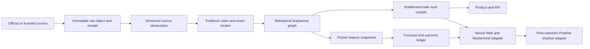
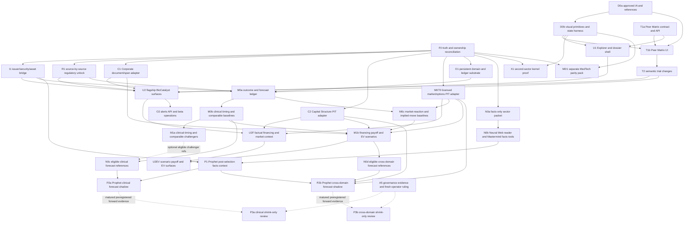

# BioCatalyst full-parity and superintelligence build handoff for Fable

> **Execution status superseded 2026-08-06:** use
> `research/BIOCATALYST_REMAINING_BUILD_WAVES_HANDOFF_FOR_CLAUDE_2026-08-06.md`
> as the canonical current-state correction and remaining-wave order. This document
> remains the binding architecture, product-forensics, source, model, and acceptance
> reference.

| Field | Value |
|---|---|
| Status | **Architecture and benchmark reference; execution status superseded by the 2026-08-06 Claude handoff** |
| Decision | **BUILD TO FULL FUNCTIONAL PARITY, THEN SURPASS IT** — preserve the shipped evidence substrate, complete the missing domain graph and product jobs, and make BioCatalyst the first governed pack on the Sector Intelligence Platform |
| As of | 2026-08-02, America/Vancouver |
| Repository baseline | `origin/main` at `822c22f76ce2337ca8c2944fbe7d150f1c7fc3d7` when this handoff finalized; refresh before every implementation PR |
| Audience | Fable orchestrator; Opus designer, builders, and reviewers; data/ML/operations owners; Neural Web, Mastermind, Prophet, and product-shell owners |
| Canonical architecture file | `research/BIOCATALYST_FULL_PARITY_SUPERINTELLIGENCE_BUILD_HANDOFF_FOR_FABLE_2026-08-02.md` |
| Canonical execution file | `research/BIOCATALYST_REMAINING_BUILD_WAVES_HANDOFF_FOR_CLAUDE_2026-08-06.md` |
| Precedence | This file supersedes the sequencing and current-state sections of the 2026-08-01 teardown and the narrow B4E continuation note wherever the state has advanced. The original teardown remains the detailed product/source/engine reference. The B4E runbook remains binding for activation. |
| Publication boundary | Private build artifact. Do not publish through `reports.html` without a separate operator decision. |
| Clean-room boundary | BioPharmCatalyst and BiopharmIQ are behavioral benchmarks only. Use official, public, or properly licensed sources and independently authored code/design. Never use competitor credentials, private APIs, proprietary rows, copied frontend assets, or authenticated scraping. |

---

## 0. Binding acceptance gates

Fable should treat this section as the release contract. A lane is not complete because a page renders, an endpoint returns JSON, or a model emits a number.

### 0.1 No-rediscovery and no-rebuild gate

Before assigning work, Fable must:

1. read this file, `CLAUDE.md`, `AGENTS.md`, `docs/ACTIVE_BUILD_MAP.md`, `research/DO_NOT_REBUILD.md`, `docs/DESIGN_DOCTRINE.md`, the original BioCatalyst teardown, and the B4E continuation note;
2. fetch `origin/main`, inspect live open PRs, and regenerate the active build map if collision-sensitive work will begin;
3. verify the current contracts and producers named in section 2 rather than trusting an older planning status;
4. extend the shipped ClinicalTrials.gov, history, prospective, publication, entitlement, and activation paths—never replace them with parallel paths; and
5. consume Company Intelligence, Corporate/earnings evidence, Capital Structure, Terminal/Supabase user state, Neural Web authority, and Prophet through versioned read contracts—never create BioCatalyst-owned substitutes for those planes.

Any proposal that violates the already-covered fence in section 4 is rejected before implementation.

### 0.2 Product-parity gate

Functional parity means that users can complete the benchmark jobs, not that MastermindX reproduces the benchmark's page names or layout. The completed product must provide:

- a unified Event Explorer for trial, regulatory, company-disclosed, safety, patent/exclusivity, financing, partnership, earnings, and conference events;
- Company, Asset × Indication, Trial, Regulatory, and Catalyst dossiers;
- trial screening, explicit peer-study comparison, revision history, historical mode, evidence inspection, saved cohorts, watchlists, alerts, and exports;
- company pipeline, regulatory history, safety/label context, patents/exclusivities, deal economics, and cash-through-catalyst context when their source contracts are available;
- historical outcome cohorts, transparent probability/timing baselines, comparable outcomes, market-reaction context, and expected-value scenarios once their ledgers and evaluation gates mature;
- a separately governed MedTech/device subpack before the program claims parity with the benchmark's device-calendar and device-pipeline estate;
- an authenticated, versioned, point-in-time API with deterministic pagination and incremental synchronization; and
- one consistent interaction model across BioCatalyst and later procurement, shipping/trade, mining, energy, and agriculture packs.

Feature parity must not recreate twenty isolated calendars and databases. Each benchmark feature becomes a saved lens, dossier section, change event, or governed model inside one operating system.

### 0.3 Truth and provenance gate

Every displayed or machine-consumed value must preserve, as applicable:

- canonical subject and source-native identity;
- source system, source URI, content hash, field path or exact evidence span;
- source-published/effective time, retrieval time, first-seen time, valid interval, and transaction interval;
- original date wording and precision/bounds;
- parser/model version, license class, coverage class, missingness, contradiction state, and analyst-review state;
- whether it is a **source fact**, **derived estimate**, **scenario/forecast**, **unavailable**, **stale**, or **contradicted** value; and
- its authority manifest and exact downstream contribution trace.

Unknown, unavailable, censored, ambiguous, and stale are real output states. None may silently become zero, neutral, no-event, or low risk.

### 0.4 Billion-dollar SaaS UI/UX gate

No user-facing lane ships without approved, committed reference states and browser verification against production-shaped data. Every flagship surface must pass:

1. **Five-second comprehension:** a cold user can state what changed, how trustworthy/current it is, and the next research action.
2. **Progressive disclosure:** Tier 1 gives state + stance + one plain line; Tier 2 gives mechanics/provenance; Tier 3 gives the complete evidence/model study.
3. **Visible epistemics:** fact, estimate, scenario, unavailable, stale, conflict, and identity ambiguity have distinct, consistent treatments.
4. **One mental model:** command search, query state, time travel, evidence inspection, Research Tray, save/watch/export, and Ask Mastermind behave the same across every dossier.
5. **Intentional composition:** desktop, tablet, and mobile each have designed layouts. Mobile is a focused list-to-dossier flow, never a crushed desktop table.
6. **Bilingual parity:** English and Chinese preserve uncertainty and meaning; internal states and untranslated machine slugs never leak.
7. **State-atlas completeness:** loading, empty, stale, partial coverage, partial entitlement, source outage, contradiction, ambiguous identity, historical mode, slow network, and recovery are designed—not afterthoughts.
8. **Accessibility:** keyboard-only, screen reader, focus return, touch targets, reduced motion, contrast, and zoom pass.
9. **Performance:** primary reads meet section 14; large results virtualize; evidence payloads stay bounded; entitlements never cause layout shift; no full dataset ships in the browser bundle.
10. **No template smell:** no generic admin dashboard, pill wall, KPI-card cemetery, spreadsheet-with-sidebar, decorative motion, or visual copy of a competitor.

The design owner must use `docs/DESIGN_DOCTRINE.md` plus the repo's frontend-design workflow/skill. Fable or an Opus-level designer chooses the visual language and user-facing copy. Code builders receive exact reference images and state specifications.

### 0.5 Intelligence gate

- Facts-first product work does not wait for a model.
- Baselines ship and remain visible before challengers.
- Every forecast stores its frozen feature snapshot, knowledge cutoff, model/calibration version, outcome policy, evidence references, uncertainty, and authority.
- Challengers remain shadow until pre-registered, point-in-time, leakage-safe evaluation clears section 14.
- Clinical probability, catalyst timing, payoff, financing survival, competitive position, and technical setup remain separate calibrated layers. Do not multiply five unrelated raw scores into a scientific-looking scalar.
- LLMs may retrieve, summarize, compare, and explain contradictions. They may only de-escalate a pre-registered, calibrated key within an existing authority manifest. They never create, alter, suppress, or promote source facts, clinical conclusions, probabilities, materiality states, rankings, signals, or authority.

### 0.6 Neural Web, Mastermind, and Prophet gate

Integration is complete only when:

- BioCatalyst emits a deterministic, versioned `sector_intelligence_packet.v1` through a registered read adapter;
- one explicit Neural Web reader validates the packet, freshness, evidence, contradictions, and authority caps;
- Mastermind tools cite bounded evidence and never read the raw domain store;
- any Prophet join uses a reviewed point-in-time issuer/security/asset bridge and a private, validated transport;
- the first Prophet attachment occurs **after** the existing technical selection and cannot change candidate IDs, order, entry gate, size, geometry, option selection, or confidence;
- every model output already exists in the BioCatalyst-owned forward ledger before Prophet reads it; and
- identical inputs reproduce identical packets and contribution traces.

Current NCT-only facts do not satisfy these prerequisites. No direct Prophet wire is authorized now.

### 0.7 Operations gate

Each live source lane requires:

- documented rights and redistribution disposition;
- isolated credentials and least privilege;
- supervised scheduling, retries, dead-letter handling, idempotent replay, watermarks, immutable receipts, and fail-closed pointer advancement;
- per-opportunity attempt/fetch/parse/publish/completeness/freshness accounting;
- explicit stale and outage behavior;
- correction and analyst-review workflows;
- backup/retention/restore evidence appropriate to the source class; and
- a fourteen-day production soak with severity-weighted SLOs and incident/rollback drills.

Unit tests and synthetic source fixtures are not proof that a source is live. Code deployment is not evidence accrual.

### 0.8 Delivery gate

Every tracked implementation slice must use a fresh worktree/branch from current `origin/main`, commit only its paths, pass focused and downstream tests, push, open a PR, clear genuine CI failures, squash-merge, and verify production ancestry and the changed live surface. No wave parks at an open PR. No monolithic “full parity” PR is allowed.

---

## 1. Executive directive to Fable

The build is approved. Do not restart competitor forensics and do not rewrite the trial foundation.

The program has two simultaneous goals:

1. **Reach complete clean-room functional parity** with the useful BioPharmCatalyst/BiopharmIQ jobs; and
2. **Build the superior product**: a temporal evidence graph that connects clinical progress, regulatory state, financing survival, competitive context, valuation/payoff scenarios, market structure, and company memory to MastermindX's research system.

The immediate visible wedge is the **Trial Protocol Peer Matrix** on top of the existing entitlement-safe trial APIs and evidence rails. In parallel, design the shared Sector Intelligence shell and reconcile now-shipped Corporate/Company/Capital contracts. Then unlock regulatory and issuer-linked features source by source. Prediction and Prophet work come after identity, point-in-time history, and the domain ledger—not before them.

The organizing product law is:

> One temporal evidence graph, one operator cockpit, many domain-native lenses.

The organizing engineering law is:

> Reuse generic planes; let BioCatalyst own only biopharma truth, biopharma projections, and biopharma model ledgers.

The organizing intelligence law is:

> Facts earn trust first. Models accrue in shadow. Authority is a separate governed decision.

### 1.1 First three assignments

Fable should launch these as coordinated but separately shippable lanes:

1. **F0 — truth/ownership reconciliation:** update stale ownership statuses and freeze executable read adapters against current Company Intelligence, Corporate/earnings, Capital Structure, security-master, user-state, and Neural Web contracts. This is a contract delta, not a new data plane.
2. **D0 — suite design reference pack:** produce and approve the complete BioCatalyst IA, signature interactions, state atlas, and production-shaped desktop/tablet/mobile × dark/light × EN/ZH reference images.
3. **T1 — Trial Protocol Peer Matrix:** build the next facts-only product slice over explicit NCT cohorts, without issuer/ticker inference, trial ranking, “competitor” claims, or any activation side effect.

F0 and D0 may proceed in parallel. T1 may use only data already authorized at runtime or bounded fixtures that exactly match the existing public projection. It must work honestly when the real lane is dark.

### 1.2 Model and agent routing

- **Fable:** adjudication, architecture, dependency rulings, authority changes, final acceptance, merge decisions.
- **Opus designer:** information architecture, visual system, interaction grammar, user-facing language, reference states.
- **Opus builders:** source semantics, domain models, authority-sensitive code, model/evaluation code, complex migrations, and any implementation requiring unresolved judgment.
- **Opus adversarial reviewer:** source semantics, point-in-time leakage, privacy/rights, authority, security, and visual verification.
- **Terra/Luna at extra-high effort:** bounded, fully specified adapters, API/UI assembly, fixtures, tests, and mechanical implementation lanes, always behind exact contracts/reference states and an independent Opus review.
- **Lower-cost agents:** source census, mechanical extraction, fixture inventory, test-log triage, backfill execution, and other low-judgment fan-out.

No builder may both invent the design and self-approve it. No model may self-promote an intelligence artifact.

---

## 2. Current state freeze — extend this, do not rebuild it

### 2.1 Shipped BioCatalyst substrate

| Capability | State at handoff | Canonical implementation | Preservation rule |
|---|---|---|---|
| B0 contracts and Sector Intelligence kernel | Shipped | `contracts/biocatalyst/`, `contracts/sector_intelligence/`, `engine/sector_intelligence/contracts.py`, `config/biocatalyst_sources.yml`, `config/biocatalyst_outcomes.yml`, `config/sector_intelligence_ownership.yml` | Extend schemas compatibly; never create a second contract registry |
| ClinicalTrials.gov v2 evidence lane | Shipped, production-permitted source class; runtime still operator-provisioned | `collectors/biocatalyst/clinicaltrials_v2.py`, `engine/biocatalyst/trials.py`, `engine/biocatalyst/publication.py`, `engine/biocatalyst/storage.py`, `scripts/biocatalyst_worker.py` | Keep immutable raw receipts, complete-run watermark, overlap/reconcile, and pointer-bound publication |
| Authenticated read API | Shipped | `app/biocatalyst.py` | Preserve `site_full`, private/no-store headers, generation-bound cursors, bounded payloads, and fail-closed 503 behavior |
| Trial Intelligence Workspace | Shipped | `templates/biocatalyst.html.j2`, `templates/biocatalyst.css`, `templates/biocatalyst.js`, `scripts/build_biocatalyst.py` | Evolve in place; do not ship a second BioCatalyst shell |
| Trial dossier and filters | Shipped | `/api/biocatalyst/v1/trials`, `/trials/{nct_id}` and current UI | Preserve source-fact wording and coverage labels |
| Registry milestone monitor | Shipped | `/api/biocatalyst/v1/trials/milestones` | A registry date is not automatically a market catalyst |
| Exact Record History adapter | Implemented, source gate remains dark | `collectors/biocatalyst/clinicaltrials_history.py`, `engine/biocatalyst/history.py` | Do not enable an undocumented backing route without source-shape canary and operator/rights review |
| Historical Change Tape | Shipped read surface; data depends on history gate | `/api/biocatalyst/v1/trials/changes` | Say “registry record changed,” not “protocol changed,” unless stronger evidence establishes it |
| Prospective first-seen ledger | Shipped, retention-gated and dark | `engine/biocatalyst/prospective.py`, prospective worker path, `/trials/prospective-changes` | Preserve first-observed interval semantics; no backfilled clock or inferred event time |
| Drugs@FDA evidence substrate | Implemented private/dark | `collectors/biocatalyst/drugs_at_fda.py`, `engine/biocatalyst/regulatory.py`, `scripts/biocatalyst_regulatory_worker.py` | No public projection, issuer join, PDUFA, pending-application, CRL, clinical, or Prophet inference until separately authorized |
| Retention and activation control | Shipped, not armed | `engine/biocatalyst/activation.py`, `scripts/biocatalyst_activation.py`, `app/deploy/biocatalyst-*`, `docs/biocatalyst_operations_runbook.md` §14 | Root-sealed gate and fresh heartbeat must validate before source, store, attempt, or pointer mutation |
| Entitlement-safe static shell | Live | `config/site_access.yml`, `site/biocatalyst.html`, API auth boundary | The shell contains no study facts; anonymous API access remains denied |
| BioCatalyst test estate | Shipped and substantial | `tests/test_biocatalyst_*.py`, `tests/test_clinicaltrials_biocatalyst.py` | New work adds focused tests and reruns downstream BioCatalyst packs |

Relevant merged PRs include #4188, #4218, #4227, #4251/#4252, #4270, #4279, #4285, #4293, and #4309. Inspect current main rather than relying on these snapshots alone.

### 2.2 What the current product actually does

The current page is an authenticated, bilingual, responsive three-pane trial workspace:

- filter/control rail;
- Milestones, Change Tape, and First-seen Tape modes;
- query, phase, status, condition, field, and date-window controls;
- keyboard list navigation and mobile dossier drawer;
- trial inspector with current fields, evidence/source links, history/coverage states, and Mastermind launch affordance;
- explicit loading, locked, unavailable, stale, empty, and source-responsibility messaging; and
- data-free static assets that fetch only the entitlement-scoped public projection.

This is a strong narrow instrument. It is not yet a full catalyst calendar, company/pipeline database, FDA suite, financing model, historical-outcome database, or predictive product.

### 2.3 Adjacent shipped planes to consume

| Plane | Current useful capability | BioCatalyst relationship |
|---|---|---|
| Company Intelligence | Context-only immutable per-company earnings/history dossier artifacts, health, a public rate-limited teaser API, public ticker-page dossier module, and one safe Neural Web reader | Reuse its immutable-producer/read-adapter pattern and shared ticker dossier; the teaser API is not a private shared-data transport, and the plane is not yet a complete issuer identity, generic document/span, clinical, or asset-ownership service |
| Earnings/transcript stack | Transcript intake, earnings event/story infrastructure, Chronicle, R2 publication, public Earnings Wire, and broad call-record estate | Consume through an executable Corporate document/span adapter; never create another transcript/document store |
| Capital Structure | SEC evidence/event spine, observed filing-state projection, registration lifecycle, share-count and Company Facts substrates, document-term work | Consume point-in-time read models. Do not calculate a second cash/burn/runway/dilution truth plane |
| Security/symbol plane | Listed-symbol/CIK snapshots and market data | Consume a reviewed PIT security bridge; current coverage is not a complete global security master |
| Terminal/Supabase product plane | Tenant-scoped saved state, watchlists, assignments, preferences, billing/entitlements | Owns user state. BioCatalyst may expose UI/API adapters, not a new user database |
| Sector Intelligence contracts | `source_record`, `evidence_claim`, `entity_link`, `sector_event`, `feature_snapshot`, `prediction`, `outcome_label`, `lobe_run`, `sector_intelligence_packet`, `authority_manifest` | Use these envelopes; create only pack-specific biopharma objects beneath them |
| Neural Web | Authority governor and governed read patterns | Owns cross-sector federation and authority; never domain truth |
| Prophet | Existing technical selection and signal artifacts | Remains the sole selection owner; no BioCatalyst shortcut through `engine/prophet_bridge.py` |

### 2.4 Current coordination hazards

At the handoff snapshot:

- `docs/ACTIVE_BUILD_MAP.md` lagged actual merged code and must be regenerated before collision-sensitive assignment;
- the deterministic earnings evidence graph PR #4260 was still open despite green checks;
- Capital Structure candidate instrument terms PR #4319 was open; and
- Company Intelligence dossier rendering had merged through #4318, with its render-lane DAG declaration fixed through #4322.

These are coordination facts, not stable dependencies. Fable must re-query GitHub and current contracts at the start of each lane.

---

## 3. Dark lanes and external activation boundaries

| Lane | Why it is dark | What code work may do | What code work may not do |
|---|---|---|---|
| ClinicalTrials.gov v2 production canary | VPS runtime, isolated environment, R2 credentials, and worker timer require operator provisioning/arming | Build against exact projection contracts and authorized fixtures; improve preflight and observability | Claim live collection, create credentials, or arm the timer as a side effect |
| ClinicalTrials.gov Record History | Undocumented UI-backing route; source registry says `production_ingest_allowed: false` | Maintain canary, parser fixtures, exact-history contracts, and unavailable states | Enable from a casual env switch or promise full historical coverage |
| Drugs@FDA | Rights/projection review and operator service setup remain incomplete | Extend private source-fact tests and design honest unavailable states | Publish FDA facts, infer issuer/ticker, PDUFA, pending applications, holds, CRLs, odds, or clinical meaning |
| Prospective first-seen ledger | Requires separately verified R2 retention lock, no overlapping lifecycle delete, root-sealed receipt, and fresh heartbeat | Preserve and test fail-closed activation; build UI that handles unavailable prospective state | Backfill first-seen history, collect before the gate, or treat deployed units as active |
| Neural Web/Prophet | No reviewed PIT issuer/security/asset bridge or BioCatalyst prediction ledger | Design contracts and invariant tests | Attach current NCT-only facts to securities or Prophet |

The operator activation sequence lives only in `docs/biocatalyst_operations_runbook.md` §14 and `research/BIOCATALYST_CONTINUATION_HANDOFF_2026-08-02.md`. Fable must not weaken, paraphrase away, or bypass it. Product and engine work can continue while these lanes remain honestly dark.

---

## 4. Already covered / explicitly excluded fence

### 4.1 Do not rebuild

Do not create another:

- ClinicalTrials.gov v2 collector, raw archive, trial snapshot store, exact-diff store, coverage ledger, current pointer, or trial read API;
- ClinicalTrials.gov Record History collector or read model;
- prospective first-seen ledger or retention gate;
- Drugs@FDA release parser/archive/index foundation;
- generic SEC collector, filing store, transcript store, source-span store, earnings event store, or retrieval index;
- generic company identity service, security master, user/watchlist database, authority governor, or cross-sector database;
- cash, burn, runway, share-count, financing-capacity, or dilution truth calculator;
- parallel ticker-company dossier when the shared ticker dossier can host the BioCatalyst lens;
- generic navigation estate beside the canonical authenticated site navigation and emerging “One Door” workspace grammar; or
- standalone five-factor “biotech score” that fuses raw clinical, technical, financing, competitive, and payoff values.

### 4.2 Competitor boundary

The credentials supplied during the initial discussion are not a production input and must never be placed in source code, prompts, fixtures, logs, documentation, browser automation, or secrets setup. Do not authenticate to a competitor for build data. Do not copy competitor code, bundles, wording, visual assets, proprietary datasets, hidden API responses, or inferred private backend logic.

The lawful reconstruction target is the observable job-to-be-done and independently designed product contract, using registered official/public/licensed evidence.

### 4.3 Forbidden semantic shortcuts

Never equate:

| Observed evidence | Forbidden claim without stronger evidence |
|---|---|
| Registry field changed | Protocol changed materially |
| Location appeared/disappeared | Site activated/closed |
| Enrollment count changed | Enrollment velocity or delay |
| Registry status terminated/suspended | Endpoint failure or regulatory hold |
| Registry date | Certain catalyst date or market-moving event |
| Sponsor string | Public issuer/ticker/owner |
| Drugs@FDA application row | Pending application, PDUFA, or company exposure |
| FAERS/adverse-event count | Causality, incidence, or comparative safety |
| Source absence | No event, zero risk, or healthy state |
| Model prose | Clinical probability, materiality, or decision authority |

### 4.4 Authority exclusions

Until later governed promotion, BioCatalyst may not:

- originate or reorder Prophet candidates;
- change entry, sizing, risk geometry, option selection, or confidence;
- fuse positioning/context keys into an authority score;
- let an LLM raise attention, authority, probability, or materiality;
- publish a buy/sell/trade instruction from clinical facts;
- silently prioritize a facts-only Change Tape by an unvalidated materiality model; or
- expose raw receipt keys, hashes, object paths, storage bindings, credentials, or worker internals to product/API clients.

Chronological or explicitly user-authored ordering is the facts-first default. Algorithmic attention ordering is itself an authority-shaped feature and requires its own evaluation and ruling.

---

## 5. Full parity and superiority matrix

| User job | Current state | Parity target | Superior MastermindX layer | Canonical owner/source | Completion evidence |
|---|---|---|---|---|---|
| Trial search/screening | Bounded NCT API and filters shipped | Full entitled universe; robust phase/status/condition/sponsor/intervention/date filters; saved queries/export | Historical/as-of query, contradictions, exact coverage, evidence thread | BioCatalyst + ClinicalTrials.gov | Search correctness set, PIT replay, API/UI performance |
| Trial milestones | Registry milestone monitor shipped | Calendar/list views with exact source precision and source wording | Temporal Braid, revision history, watchlist relevance | BioCatalyst | Date-precision fixtures; no false exact dates |
| Trial revision intelligence | Exact history and prospective tapes shipped but gated | Endpoint/enrollment/site/status/timing revision classes | Semantic endpoint alignment, review queue, Impact Trace | BioCatalyst | Exact-diff ≥99% gate; endpoint precision/recall gate |
| Trial peer landscape | Not built | Explicit cohort comparison across endpoints, enrollment, sites/countries, arms, dates, and history availability | Time-safe comparable retrieval and structured rationale | BioCatalyst | T1 facts-only matrix, then adjudicated nDCG set |
| Company/pipeline screen | Generic company dossier exists; Bio asset graph absent | Company/asset/indication/trial/regulatory pipeline lenses | Temporal ownership, rights geography, financing and company memory | Corporate identity + BioCatalyst asset graph | Entity golden set and ambiguity queue |
| Company dossier | Shared ticker dossier shipped; Bio lens absent | Bio program/catalyst lens inside shared dossier plus non-public-company dossier grammar | Cross-evidence change map and research tray | Shared product shell + BioCatalyst | No duplicate generic company page; source-complete states |
| Asset × Indication dossier | Not built | Development state, owners/rights, trials, endpoints, regulators, peers, events | Scenario lattice and comparable outcomes | BioCatalyst | PIT owner/rights replay and contradiction tests |
| FDA/PDUFA/AdCom calendar | Drugs@FDA private substrate only | Regulator-published and company-reported events with source-class labels | Catalyst-date interval/distribution and contradiction handling | BioCatalyst regulatory + Corporate disclosure adapter | Rights gate, source SLO, date/evidence audit |
| Regulatory history | Private Drugs@FDA graph only | Application-native approvals/submissions/docs/labels/adcom/safety history | Global-regulator crosswalk and correction lineage | BioCatalyst | Source-native dossier and replay fixtures |
| Safety/label/recall/shortage | Legacy collectors only; noncanonical | Registered source-specific product lenses | Label-change impact map; safety hypotheses with strict noncausal language | BioCatalyst source lanes | Dataset rights, causal-language lint, freshness drill |
| Patents/exclusivities | Not built | Orange/Purple Book plus rights-reviewed patent/exclusivity records | Asserted vs calculated expiry, family/jurisdiction scenarios, legal-review state | BioCatalyst domain graph | Assumption-class and contradiction tests |
| Licensing/partnership economics | Not built | Evidence-bound upfront/milestone/royalty/territory/option/termination terms | Asset-rights timeline, comparable deal economics, scenario cash flows | Corporate documents/spans + Bio extraction | 100% displayed term-span coverage; range/unknown preserved |
| Cash/runway/dilution | Capital Structure partial context exists | Point-in-time cash, normalized burn, financing instruments, share count, runway/dilution scenarios | Cash-through-catalyst and financing-survival distributions | Capital Structure read adapter | No duplicate calculation; PIT adapter and scenario validation |
| Historical catalysts/outcomes | Registry history only | Adjudicated clinical/regulatory/program outcome cohorts with censoring and corrections | Comparable outcomes, management track record, event-return history | BioCatalyst ledger + market data | Locked PIT cohort, delisting/censoring audit |
| Probability of success | Not built | Transparent phase × therapeutic-area baseline | Hierarchical/competing-risk challenger with calibration and uncertainty | BioCatalyst model ledger | Baseline visible; Brier/calibration gates |
| Catalyst timing | Source dates only | Source-constraint baseline and historical-duration baseline | Competing-event timing distribution with delay/cancel/unresolved mass | BioCatalyst | Interval coverage and CRPS/WIS gates |
| Catalyst impact/options | Not built | Historical event-return distribution and licensed option-implied move | Liquidity-aware payoff distribution, skew/vol-crush, abnormal-return scenarios | Market/options owner + Bio adapter | Rights, event-time alignment, benchmark comparison |
| Expected value | Not built | Explicit scenario table, not a bull/bear headline | Joint clinical × timing × financing × competition × market distribution | BioCatalyst orchestrates read-only model outputs | Dependency-aware scenario reconciliation; no double risk adjustment |
| Earnings/filings/transcripts | Adjacent infrastructure shipped/in flight | Bio-relevant evidence lenses and change links | Management promise/track-record memory; catalyst/CMC/partnership extraction | Corporate/earnings owner + Bio extraction | Exact source spans and correction propagation |
| Alerts/watchlists/cohorts | Product user-state plane exists; Bio adapter absent | Watch company, asset, indication, trial, event, target, or saved cohort | Evidence-aware change explanations and affected-object graph | Terminal/Supabase + Bio events | Tenant isolation, idempotent alerts, fatigue/quality metrics |
| API/data product | Authenticated trial API shipped | Versioned search/dossier/events/history/as-of/updated-since API | Bulk/webhook/MCP/service-account tiers after rights review | Product/API plane | Contract, pagination, entitlement, audit, load tests |
| Medical-device calendar/pipeline | Not built in BioCatalyst | A separately governed MedTech subpack with device-native identity, trial, submission, panel, clearance/approval, recall, and company lenses | Shared Explorer/dossier/evidence grammar without forcing device semantics into drug objects | MedTech domain owner + registered regulator/Corporate adapters | Required before claiming whole-benchmark parity; not required for the biopharma closed beta |
| IPO and lockup workflow | Generic market/Corporate/Capital ingredients exist; no Bio lens | Biopharma IPO, follow-on, lockup, and financing-event lenses | Connect deal state to program/catalyst context without inventing allocation or price certainty | Corporate/Capital/market owners + Bio read lens | PIT event adapter, rights, corporate-action and date-precision tests |
| Insider/13F/hedge-fund lenses | Existing beneficial-ownership/holdings systems; not Bio-native | Reuse existing ownership context inside shared Company/Explorer lenses | Crowd/ownership context with filing latency and position-meaning caveats | Existing ownership owners | No duplicate collector; filing-period and availability-time replay |
| M&A and asset transactions | Generic company-event ingredients partial; Bio transaction graph absent | Company, asset, option, return-of-rights, divestiture, and change-of-control lenses | Temporal ownership/right propagation across programs and catalysts | Corporate evidence + Bio asset/right graph | Exact spans, effective/known-at intervals, correction and supersession tests |
| Analyst ratings/targets/estimates | No licensed BioCatalyst product lane | Licensed-later context lens only | Estimate revisions and dispersion separated from clinical truth and house scenarios | Licensed estimates owner | Contract/redistribution rights and PIT-vintage proof before display/model use |
| Biotech movers/market screener | Generic quote/screener estate exists | Biopharma universe lens with price, liquidity, event, and program filters | Explain observed moves with evidence candidates, never causal certainty | Market-data owner + Bio query adapter | No duplicate quote plane; session/freshness/corporate-action tests |
| Editorial/newsletter workflow | Existing News, Research Vault, Press, and Marketing systems | Explicitly not a separate BioCatalyst CMS/newsletter product; emit governed facts/changes into existing editorial planes | Evidence-grounded research packets and story leads with source receipts | Existing News/Research/Press owners | No duplicate editorial store; publication requires existing review/rights gates |
| Portfolio-news workflow | Existing watchlist/news/user-state planes | Route Bio events and corrections into the existing portfolio/watch delivery system | Affected-object explanations and “why received” evidence | Product user-state + News/alerts owner | Tenant isolation, delivery idempotency, correction/retraction propagation |
| Community games/expert lists | Not part of the intelligence core | Explicitly excluded unless a later product decision establishes a distinct user job and moderation model | None required for parity of decision-grade intelligence | Product decision | Cannot block full intelligence completion or contaminate probabilities |
| Mastermind research | Launch affordance only | Evidence-grounded company/asset/trial/event investigation tools | Cross-source contradiction and “what changed since” reasoning | Mastermind reads Bio packet | Citation completeness and authority tests |
| Neural Web/Prophet | Not wired by design | Facts-only packet and post-selection context | Shadow forecasts, contribution traces, eventually shrink-only risk | Neural Web/Prophet consumers | Invariant tests and forward-ledger gates |

Parity is achieved when every benchmark job above is usable at production quality, even if MastermindX presents it through fewer, better surfaces.

---

## 6. Product architecture and unmatched UI/UX

### 6.1 One product shell

Keep `/biocatalyst.html` as the authenticated web entry during the parity program. Evolve the existing workspace rather than creating a second application. Shared ticker/company pages host generic company truth; BioCatalyst supplies a domain lens and deep links into asset/trial/regulatory dossiers. Terminal/Supabase remains the user-state owner.

The primary navigation inside BioCatalyst is:

1. **Catalyst Radar** — default working surface for upcoming events, revisions, coverage, freshness, and watched-object relevance;
2. **Explorer** — one query engine over events, companies, assets, indications, trials, applications, targets, and changes;
3. **Dossiers** — Company lens, Asset × Indication, Trial, Regulatory, and Catalyst;
4. **Change Tape** — one temporal stream of exact changes and their evidence/affected objects;
5. **Research Workbench** — peer sets, Query Lens, Evidence Thread, Research Tray, as-of replay, scenarios, exports, and Mastermind investigation;
6. **Alerts** — saved cohorts, watches, delivery history, why-received, and correction status; and
7. **Data/API** — keys, scopes, sync status, changelog, usage, and service health for eligible plans.

Do not add separate top-level “FDA Calendar,” “PDUFA Calendar,” “Cash DB,” “Funding DB,” “Trial DB,” and “Historical Calendar” applications. Those are saved Explorer lenses.

### 6.2 Signature interaction grammar

Reuse the original teardown's full design definitions and make these the shared Sector Intelligence primitives:

- **Decision Sentence:** one plain-language state, meaning, and next research action;
- **Temporal Braid:** source wording/effective interval, source publication, system first-seen, revisions, and forecast interval shown without collapsing clocks;
- **Evidence Thread:** visible claim → exact source field/span → receipt/time/parser/rights/coverage;
- **Impact Trace:** changed evidence → affected entity/event/scenario/portfolio-context path, with unresolved edges visible;
- **Scenario Lattice:** mutually exclusive scenarios and uncertainties, never one false-precision score;
- **Query Lens:** inspectable filters and time cutoff that can be saved/shared/exported;
- **Research Tray:** persistent evidence/comparison basket across objects; and
- **Object switcher:** company ↔ asset × indication ↔ trial ↔ regulatory application ↔ event without losing the cutoff or research context.

These signatures communicate system behavior. Decorative dashboard animation does not.

### 6.3 Surface specifications

#### Catalyst Radar

- Decision Sentence at top;
- watched and broad event lanes with source class, time interval, revision marker, freshness, and coverage;
- “what changed since last visit” as a deterministic diff;
- no unearned materiality ranking—chronology/watch state first;
- one-click evidence and dossier navigation; and
- honest “no eligible events” versus “source unavailable” states.

#### Explorer

- universal command/search bar;
- inspectable query chips with plain labels, not raw slugs;
- result density toggle without changing the underlying query;
- columns/fields chosen per object type, with fact/estimate/scenario classification;
- as-of and knowledge-cutoff controls;
- saved view/cohort/export through the existing product plane; and
- large-result virtualization and deterministic cursor recovery.

#### Shared Company lens

- preserve the shared ticker dossier as the generic company home;
- add BioCatalyst sections for programs, asset/indication ownership, trials, regulatory events, catalysts, partnerships, and cash-through-catalyst context;
- expose dependency-unavailable states rather than placeholder zeros;
- handle private/non-listed companies through the domain dossier grammar without fabricating a ticker; and
- deep-link to canonical shared filings, earnings, and Capital Structure evidence.

#### Asset × Indication dossier

- current and historical owner/rights by jurisdiction;
- program state distinct from trial status;
- linked trials, endpoints, evidence, regulators, peer programs, partnerships, and dates;
- contradiction and review status;
- scenario lattice only after eligible model artifacts exist; and
- no ticker as the canonical identifier.

#### Trial dossier and Peer Matrix

- current source record with exact evidence links;
- endpoint roles/timeframes/populations, enrollment, arms, sites/countries, dates, sponsors, interventions, and status;
- historical and prospective change availability clearly separated;
- explicit user-selected NCT peer cohort first;
- column-level source/coverage labels and before/after inspection;
- “peer studies,” not “competitors,” until asset/indication/owner resolution is reviewed; and
- no ranking or odds in the first slice.

#### Regulatory dossier

- application-native identity and jurisdiction;
- regulator-published versus company-reported versus derived/inferred claim classes;
- submissions, actions, approvals, labels, safety, advisory meetings, documents, and corrections;
- precise source coverage and freshness by sub-lane;
- no PDUFA unless an eligible source claim exists; and
- no inferred company/security exposure from application text alone.

#### Change Tape and Alerts

- one event row per immutable domain change, with known-at time and correction lineage;
- visible semantic class: exact source field change, reviewed domain interpretation, or model/scenario update;
- affected-object graph with unresolved edges;
- why the user received the alert and how to inspect/change the watch;
- correction/retraction propagation; and
- chronological/user-authored ordering until a governed attention model earns authority.

### 6.4 Mobile contract

At 390×844:

- default to a single focused Radar/Explorer list;
- opening an object transitions to a full-height dossier with an explicit back path and preserved filters/scroll/focus;
- Evidence Thread becomes a bottom sheet;
- Research Tray becomes a compact persistent drawer;
- tables become semantic comparison cards or horizontal comparison with frozen identity, never unreadable compression;
- all primary actions remain reachable with one thumb; and
- no information required to interpret uncertainty is hover-only.

### 6.5 Required design reference pack

Before implementation of the full shell, commit production-shaped references for at least:

- Catalyst Radar: EN dark, ZH dark, EN light;
- Explorer with long filters and 100+ result state;
- Trial Peer Matrix desktop and mobile;
- Company lens with partially unavailable dependencies;
- Asset × Indication dossier with ambiguous ownership;
- Regulatory dossier with mixed source classes;
- Change Tape with correction and contradiction;
- Evidence Thread expanded;
- historical mode;
- stale/source-outage/locked/empty/error states;
- keyboard focus and reduced-motion behavior; and
- responsive breakpoints at 1440×900, 820×1180, and 390×844.

Reference images live under `mockups/refs/biocatalyst/<wave>/`. Builders must match them with production-shaped fixtures and capture browser verification images before merge.

---

## 7. Data and service architecture

### 7.1 Canonical flow

No downstream consumer reads the raw store or becomes a second writer of domain truth.

### 7.2 Canonical domain unit

The durable commercial/scientific unit is:

> **Asset × Indication × Temporal Owner × Jurisdiction/right interval**

NCT ID, application number, sponsor string, company, and ticker are linked identities—not interchangeable primary keys.

### 7.3 Kernel versus pack boundary

The reusable Sector Intelligence Kernel owns interfaces and helpers only:

- source/evidence/temporal/authority contracts;
- rights registry grammar;
- receipt, watermark, replay, and observability helpers;
- API pagination/as-of/update conventions;
- read-side federation and packet validation;
- shared UI primitives and state grammar; and
- synthetic cross-pack compatibility tests.

BioCatalyst owns:

- the biopharma ontology and entity graph;
- trial, endpoint, asset/indication, regulatory, safety, patent/exclusivity, partnership, and catalyst semantics;
- domain read models and analyst review queues;
- biopharma feature/forecast/outcome ledgers; and
- domain-specific evaluation, model cards, and correction policies.

The kernel is not a universal sector database, global writer, or generic reasoning ontology.

### 7.4 Existing generic envelopes

Use the shipped `contracts/sector_intelligence/` envelopes:

- `source_record.v1`
- `evidence_claim.v1`
- `entity_link.v1`
- `sector_event.v1`
- `feature_snapshot.v1`
- `prediction.v1`
- `outcome_label.v1`
- `lobe_run.v1`
- `sector_intelligence_packet.v1`
- `authority_manifest.v1`

New biopharma contracts should be pack-specific and reference these envelopes. Candidate contracts include:

- `biopharma_entity.v1`
- `asset_indication_program.v1`
- `temporal_owner_right.v1`
- `endpoint_definition.v1`
- `endpoint_alignment.v1`
- `trial_peer_set.v1`
- `disclosed_date_claim.v1`
- `biopharma_catalyst.v1`
- `regulatory_application_link.v1`
- `safety_label_event.v1`
- `patent_exclusivity_claim.v1`
- `partnership_economic_term.v1`
- `biocatalyst_capital_context.v1`
- `biocatalyst_company_context.v1`
- `biocatalyst_public_projection.v1`

F0 must determine which are truly new versus projections of already-shipped contracts. No name is reserved until its owner, writer, source clocks, authority, and migration behavior are frozen.

### 7.5 Storage and serving

- Immutable raw/private evidence and domain ledgers live in the dedicated persistent plane, not git or browser storage.
- Read models are deterministic, bounded, entitlement-safe projections.
- Public/static shells contain no private source facts.
- API processes read only committed projections/pointers and never traverse worker staging or private stores.
- User state stays tenant-scoped in the existing product plane.
- Every projection supports a generation ID/hash, source watermarks, schema version, coverage/freshness receipt, and rollback pointer.
- Historical queries fail closed when the requested precision exceeds evidenced coverage.

---

## 8. Source-lane program

Every source gets its own registration, rights review, clock semantics, fixtures, parser, immutable receipts, completeness definition, cadence/SLO, correction behavior, projection allowlist, and incident drill.

| Source family | Current posture | Intended job | Required precondition |
|---|---|---|---|
| ClinicalTrials.gov v2 | Registered, facts projection allowed | Current trial records and prospective observations | Operator-provisioned live lane; retain current terms/attribution obligations |
| ClinicalTrials.gov Record History | Implemented, disabled | Exact source-version history | Rights/operator review and source-shape canary |
| AACT | Registered, disabled | Coarse historical research snapshots | Rights review; monthly-only coverage labels; no intramonth claims |
| Drugs@FDA | Private substrate, disabled | Application/submission/approval source facts | Rights and product-projection review, isolated service, no issuer inference |
| openFDA dataset families | Registered, disabled | Labels, recalls, shortages, adverse events as source-specific facts | Dataset-by-dataset semantics and redistribution review |
| FDA labels/safety communications | Not canonicalized | Label/safety change evidence | Source registration, document/span evidence, causal-language policy |
| Advisory committee/Federal Register | Not canonicalized | Meeting and regulator-document events | Source registration and date/status semantics |
| Orange/Purple Book | Not canonicalized | Regulatory exclusivity and listed patent facts | Source-specific identity and assumption classes |
| SEC filings and issuer disclosures | Generic owner exists/in flight | Company-reported catalysts, holds/CRLs, partnerships, CMC, financing evidence | Executable Corporate document/span read contract |
| Capital Structure data | Shared plane partially operating | Cash, burn, shares, instruments, runway/dilution inputs | Versioned PIT read adapter with unavailable-state semantics |
| Literature/grants | Later | Mechanism/scientific/competitive context | Source rights, identifiers, retraction/correction handling |
| Patent offices/licensed patent data | Later | Patent family and jurisdiction claims | Rights and legal-assumption policy |
| Market/options/estimates | Later/licensed | Historical reaction, liquidity, implied move, valuation scenarios | Redistribution/training rights and event-time alignment |
| Global regulators | Later | Jurisdiction-specific development/regulatory states | One registered adapter per regulator; no cross-jurisdiction state collapse |
| Medical-device regulator/trial sources | Later, separate domain pack | Device-native trial, submission, panel, clearance/approval, recall, and company evidence | MedTech ontology/owner, source-by-source registration, and explicit separation from drug/application semantics |
| Commercial/alternative data | Later/licensed | Prescriptions, claims, hiring, supply/manufacturing, expert/BD context | Contract-specific rights, entitlement, bias, and coverage review |

Suggested freshness targets from the original docket remain requirements hypotheses until measured:

- SEC material disclosures: p95 ≤ 5 minutes after the canonical Corporate owner observes them;
- issuer disclosure projection: p95 ≤ 15 minutes;
- regulator/FDA calendar changes: p95 ≤ 60 minutes;
- ClinicalTrials.gov changes: p95 ≤ 2 hours after the upstream dataset timestamp; and
- market/quote/options context: source-license and session-specific.

Fable freezes measured source SLO manifests before closed beta. A scheduler-success percentage alone is insufficient.

BC-F0 must create `config/biocatalyst_launch_slo_manifest.yml` with contract ID
`biocatalyst_launch_slo_manifest.v1`. No source may be called launch-critical
until that committed manifest defines:

- source ID, severity, owner, exact UTC opportunity window/cadence, and the rule that creates an expected opportunity;
- success semantics for fetch, parse, contract validation, completeness reconciliation, publication, and watermark/pointer advancement;
- freshness clock origin, target percentile, maximum consecutive misses, completeness-drift floor, and error-budget threshold;
- the frozen fourteen-day soak start/end, manifest digest, and required telemetry generation;
- planned-maintenance and source-nonpublication treatment; only maintenance declared before the soak and source-native nonpublication days may leave the denominator;
- upstream outages as explicit misses/`upstream_unavailable` observations, never silently excluded;
- critical integrity, rights, privacy, and cross-tenant failures as unconditional beta failures; and
- aggregate pass logic: **every** launch-critical source must pass its own manifest row. A weighted aggregate cannot hide one failed critical source.

Changing any source row, opportunity definition, threshold, weight, or exclusion rule restarts that source's soak under a new manifest version. The manifest is configuration and acceptance evidence, not permission to arm a dark lane.

Both acceptance manifests are executable contracts, not prose conventions:

- `contracts/biocatalyst/biocatalyst_launch_slo_manifest.v1.schema.json` validates `config/biocatalyst_launch_slo_manifest.yml`;
- `contracts/biocatalyst/biocatalyst_product_acceptance_manifest.v1.schema.json` validates `config/biocatalyst_product_acceptance.yml`;
- both schemas register in `engine/sector_intelligence/contracts.py` and both documents carry schema version, immutable manifest ID, canonical content digest, effective time, superseded-manifest reference, owner, and CI validation receipt;
- launch-SLO validation cross-checks the source registry exactly: every launch-critical source appears once, every manifest source is registered, and no unknown/omitted row can pass;
- a soak/result receipt binds the exact manifest digest and raw telemetry references, so editing a manifest in place cannot preserve or manufacture a pass;
- product-acceptance validation rejects unbounded/dynamic visual masks, missing reference hashes, missing benchmark samples/artifacts, and missing named human approval; and
- CI fixtures prove rejection of invalid opportunity denominators, undeclared exclusions, absent telemetry, mutable manifest identity, unbounded masks, missing reference hashes, and absent reviewer sign-off.

BC-F0 owns the first contract/schema/config/CI path for the launch-SLO manifest. BC-D0a owns the corresponding product-acceptance contract. Neither manifest may self-authorize a source, entitlement, model, or authority level.

---

## 9. Domain engines — build specifications

### 9.1 Entity, asset, indication, and temporal ownership engine

**Inputs:** source-native companies/sponsors, securities, assets/interventions, aliases, indications, trial/application links, partnerships and acquisitions.

**Outputs:** stable canonical entities; temporal aliases/owners/rights; link evidence; confidence; contradiction; review queue; PIT resolution API.

**Rules:**

- deterministic exact identifiers and reviewed mappings outrank fuzzy matching;
- ticker is never an asset or company identity;
- ownership/rights are interval- and jurisdiction-specific;
- ambiguous links remain separate and visible;
- corrections append; they do not rewrite past ownership; and
- auto-link gates are per family, not one aggregate score.

**Gate:** lower confidence bound auto-merge precision ≥99.5% and recall ≥95% on a pre-sized adjudicated set for each entity/link family.

### 9.2 Trial Protocol Peer Matrix

**First version inputs:** explicit user/configured NCT cohort and current pointer-bound, entitlement-safe trial projection records.

**First version outputs:** side-by-side phase, status, conditions, interventions, arms, enrollment, endpoints/roles/timeframes, milestone dates/precision, sites/countries, sponsor, record age, history availability, and first-seen coverage.

**Rules:** no inferred issuer/security/asset, no automatic competitor label, no peer ranking, no “delay,” no enrollment velocity, and no site activation claim. Before/after exact values remain evidence-bound.

**Later version:** reviewed asset × indication peer cohorts, time-safe comparable retrieval, diversity constraints, exact rationale, and analyst override with audit trail.

**Gate:** facts-first matrix passes contract and visual gates; later retrieval requires nDCG@10 lower confidence bound ≥0.80 on a pre-sized adjudicated query set plus time-availability and diversity checks.

### 9.3 Trial change intelligence

Separate:

- exact source JSON/path operations;
- normalized field changes;
- semantic endpoint alignment;
- reviewed domain interpretation; and
- model/attention consequences.

Endpoint text reorder or formatting must not become a material alert. Primary/secondary role changes, endpoint replacement, population/timeframe changes, enrollment changes, status changes, milestone-constraint changes, and site-list changes have distinct classes and evidence floors.

**Gate:** exact registry-diff accuracy LCB ≥99%; endpoint-change precision LCB ≥95% and recall LCB ≥90%; 100% displayed claim-to-source locator coverage.

### 9.4 Catalyst date engine

Store two distinct objects:

1. **Disclosed/source constraint:** original phrase, interval, precision, source class, known-at time, revision/cancellation status; and
2. **Predictive occurrence distribution:** separately versioned model with delay, cancellation, unresolved, and competing-event mass.

Quarter, half, month, “by,” “around,” and exact dates never collapse to the same point. An issuer-reported PDUFA remains company-reported unless regulator evidence exists.

**Baselines:** latest disclosed constraint and historical median duration conditional on phase/event family.

**Gate:** paired CRPS/weighted-interval-score improvement with ≥10% lower-confidence-bound gain over the appropriate baseline and interval-coverage checks by disclosure precision.

### 9.5 Regulatory engine

Build application-native, jurisdiction-specific histories from regulator facts first. Link to assets/companies only through reviewed entity edges. Distinguish submitted, accepted, under review, advisory meeting, approved, complete response, refused-to-file, withdrawn, and postmarketing commitments according to source evidence.

No source family may silently fill another's missing fields. Contradictions are displayed and adjudicated. Company-reported holds/CRLs/PDUFA claims enter only through the Corporate evidence adapter.

### 9.6 Safety, label, recall, and shortage engine

- treat each dataset under source-specific semantics;
- version labels and identify exact section changes;
- link recalls/shortages to products/applications with uncertainty;
- separate reports, signals/hypotheses, regulator conclusions, and causal claims; and
- ban causal/incidence/comparative-safety language for FAERS counts alone.

### 9.7 Patent and exclusivity engine

Represent:

- source-asserted patent/exclusivity facts;
- patent family/jurisdiction/claim scope;
- owner/right intervals;
- terminal disclaimers/extensions and assumptions;
- asserted versus calculated expiry; and
- legal-review/uncertainty state.

Never present a calculated date as a legal conclusion.

### 9.8 Partnership and licensing economics

Extract only evidence-bound terms: parties, asset/indication/territory, rights, option/return/reversion, upfront, development/regulatory/commercial milestones, royalties, cost/profit share, equity, termination, and source ranges/conditions.

Unknown receipt timing, undisclosed allocation, contingent milestones, and ambiguous currency remain unknown. LLM extraction may propose candidates for deterministic validation/analyst review; it cannot write canonical terms by itself.

### 9.9 Financing survival and dilution adapter

BioCatalyst consumes, never recomputes, point-in-time Capital Structure facts and scenarios. It joins:

- cash and normalized burn distribution;
- debt/commitments and financing instruments;
- share-count truth and dilution scenarios;
- catalyst timing distribution;
- recurrent financing/cancellation states; and
- market-liquidity/price assumptions where licensed.

Output is a **cash-through-catalyst/financing-survival distribution**, not one months-of-runway scalar. Missing Capital Structure fields produce unavailable/degraded states.

### 9.10 Historical outcome and probability engine

Outcome taxonomy remains layered:

- study conduct;
- named endpoint result with role/population/timeframe;
- jurisdiction-specific regulatory disposition;
- asset × indication program state;
- discontinuation cause;
- observation/censoring/resolution state; and
- later correction.

The first probability champion is a transparent phase × therapeutic-area transition table with cohort dates, risk sets, sample counts, censoring, uncertainty, and missingness. Challengers may use hierarchical or competing-risk models, but must preserve interpretability and subgroup calibration.

**Probability gates:** Brier-skill improvement LCB ≥10% over baseline; expected calibration error UCB ≤0.05; declared calibration slope/intercept equivalence bounds; log loss, reliability, subgroup stability, and interval coverage.

### 9.11 Comparable-trial and competitive-position engine

Comparable retrieval combines:

- hard eligibility filters;
- indication/endpoint/population/intervention/modality/phase structure;
- time-available lexical/embedding/graph retrieval;
- diversity and leakage controls;
- exact reason codes; and
- analyst override with audit.

“Competitive position” is not a popularity score. Keep mechanism, indication, line of therapy, biomarker, modality, endpoint, trial design, geography, safety, timing, ownership, commercial status, and evidence quality as inspectable axes.

### 9.12 Expected-value distribution

Build a joint, mutually exclusive scenario mixture across:

- clinical/regulatory outcomes;
- event timing/delay/cancellation;
- financing and dilution paths;
- ownership/partnership economics;
- competitive/commercial response;
- valuation/payoff assumptions; and
- market/liquidity state.

Do not multiply dependent marginal probabilities, double risk-adjust a risk-adjusted NPV, or collapse clinical truth and market-implied move. Every scenario declares its inputs, dependencies, missingness, sensitivity, and evidence/model versions.

### 9.13 Market reaction and option structure

Keep distinct:

- physical clinical/regulatory probability;
- historical abnormal-return distribution;
- market-implied valuation assumptions;
- option-implied move;
- skew/term structure/volatility crush;
- liquidity and execution cost; and
- pre-event drift/confounders.

All historical event studies preserve public-time uncertainty, after-hours session mapping, corporate actions, delistings, overlap/confounds, matched controls, clustered dependence, and selection corrections.

### 9.14 Company memory and management track record

Consume source-backed earnings, filings, transcripts, presentations, and partnership/regulatory claims. Track promises, revisions, delivery, language changes, capital allocation, trial timelines, CMC/manufacturing statements, and later outcomes with exact source spans and corrections.

LLM summaries are replaceable projections. Source claims and deterministic links remain canonical.

### 9.15 Materiality and attention

Facts-first product rows are chronological, watchlist-filtered, or user-sorted. A later attention model may estimate likely research relevance, but:

- it is distinct from clinical probability and trade direction;
- it stores feature snapshot and calibration;
- it cannot suppress severe contradictions or stale-source warnings;
- it begins shadow; and
- it requires an explicit authority decision before changing default ordering.

---

## 10. Neural Web, Mastermind, and Prophet integration

### 10.1 BioCatalyst sector packet

Build one private, bounded producer for `sector_intelligence_packet.v1`. A birth packet contains:

- entity/security references only when the PIT bridge is reviewed;
- current fact references;
- material-change and upcoming-event references, initially facts/context only;
- coverage, freshness, missingness, contradictions, and stale states;
- evidence and source-record references;
- optional feature/prediction references only when those artifacts already exist in the domain ledger;
- one `lobe_run` and `authority_manifest` reference; and
- authority caps that explicitly forbid origination, ranking, selection, sizing, gating, and execution.

Birth authority is at most A0 Observe / A1 Explain. Packet generation is deterministic and cutoff-reproducible.

### 10.2 Neural Web reader

Follow the existing Company Intelligence reader pattern:

- one registered reader;
- immutable generation/manifest verification;
- strict field allowlist and payload bounds;
- no raw-store path;
- visible unavailable/stale/contradicted state;
- no write-back to BioCatalyst; and
- no authority upgrade by being adjacent to higher-authority organs.

### 10.3 Mastermind tools

Initial tools may include:

- `search_biocatalyst_objects`
- `get_trial_dossier`
- `compare_peer_studies`
- `get_registry_changes`
- `get_upcoming_source_dates`
- `get_asset_indication_dossier`
- `get_regulatory_dossier`
- `get_company_biocatalyst_context`
- `trace_biocatalyst_evidence`
- `explain_biocatalyst_contradictions`

Each returns bounded, validated facts and citations. Mastermind may explain or identify research gaps; it may not create canonical links, outcomes, probabilities, materiality, rankings, or trade instructions.

### 10.4 Prophet integration ladder

#### P0 — blocked today

No NCT-only join. No sponsor-to-ticker guess. No public packet carrying private company/security context.

#### P1 — post-selection facts context

After the PIT bridge and private transport exist, attach official facts to already-selected Prophet names. Invariants:

- candidate IDs identical;
- order identical;
- entry/gate identical;
- size and risk geometry identical;
- confidence identical;
- missing/stale packet cannot create a candidate; and
- every displayed attachment has an evidence trace.

#### P2 — prediction shadow

Prophet may read a BioCatalyst forecast only if it was already written to the BioCatalyst domain ledger from a frozen feature snapshot. It remains invisible to money-path decisions and accrues forward outcomes.

#### P3 — first possible behavioral authority

The first lawful promotion is **shrink-only** after pre-registered forward evidence and an explicit governance ruling: sufficiently evidenced stale/contradictory/risk states may cap or abstain. BioCatalyst may not add a candidate, raise a score, loosen a cap, improve rank, or override technical invalidation.

### 10.5 Reframing the requested five-factor score

The user's conceptual formula—technical setup × catalyst probability × expected payoff × financing survivability × competitive position—is valuable as a checklist, not as raw multiplication.

Implement it as five separately governed layers:

| Layer | Owner | Output |
|---|---|---|
| Technical setup | Prophet | Existing technical selection/state |
| Catalyst probability/timing | BioCatalyst | Calibrated scenario distribution |
| Expected payoff | BioCatalyst + licensed market/valuation inputs | Conditional return/value distribution |
| Financing survivability | Capital Structure → Bio adapter | Cash-through-catalyst/dilution distribution |
| Competitive position | BioCatalyst | Evidence-backed axes and, later, calibrated conditional features |

Fusion occurs only inside an explicit joint scenario model with dependency assumptions and uncertainty. Prophet remains the selection owner. A displayed summary must let the user inspect every layer and must never imply one observed “superintelligence score.”

---

## 11. Reusable Sector Intelligence Platform

### 11.1 Shared platform capabilities

BioCatalyst, Government/Procurement, Shipping/Trade, Mining, Energy, and Agriculture should share:

- source/evidence/time/authority envelopes;
- identity-link interface, not one universal identity writer;
- command search and Explorer query grammar;
- dossier shell, Temporal Braid, Evidence Thread, Impact Trace, Query Lens, Research Tray, and state atlas;
- saved cohorts/watchlists/alerts through the existing product plane;
- API/auth/pagination/as-of/update conventions;
- observability, correction, analyst-review, and incident interfaces;
- Neural Web packet and Mastermind tool conventions; and
- billing/entitlement/navigation design language.

### 11.2 Domain-native packs

Each pack retains its own ontology, raw evidence, graph, cadences, rights, source semantics, models, outcome ledger, domain review queue, and authority cap. Procurement awards are not clinical trials; vessels are not assets in the drug sense; a generic schema must not erase domain meaning.

### 11.3 Cross-sector edges

Cross-sector federation is read-side and evidence-backed:

- BioCatalyst may consume BARDA/NIH/DoD/HHS/VA procurement facts from the procurement pack;
- Shipping/Trade may supply cold-chain, ingredient, port, manufacturing, and sanctions context;
- Energy/Mining may supply input-cost and supply-chain context; and
- Macro/market planes supply regimes and price/volatility context.

No pack writes another pack's truth. Neural Web links versioned references and contradictions; it does not become the canonical source database.

### 11.4 Second-pack proof

Before calling the kernel reusable, a synthetic Mining or Shipping pack must pass:

- source/evidence/entity/event/packet validation;
- time/rights/freshness/authority semantics;
- product-shell state atlas;
- API pagination/as-of behavior; and
- zero dependency on NCT, FDA, endpoint, asset-indication, or other biopharma-only fields.

---

## 12. Execution program and PR dependency graph

### 12.1 Dependency graph

### 12.2 PR-sized build lanes

| ID | Deliverable | Primary paths/owners | Required proof |
|---|---|---|---|
| BC-F0 | Reconcile ownership/source/status registry against current main; freeze executable read-adapter names, compatibility fixtures, and `biocatalyst_launch_slo_manifest.v1` | ownership/source/SLO registries, executable JSON schema, contract-registry/CI wiring, docs/tests only | No new writer; one-writer audit; live PR census; manifest digest/immutability; exact source cross-check; denominator/pass rejection fixtures |
| BC-D0a | IA, interaction/state spec, content contract, and `biocatalyst_product_acceptance_manifest.v1` | research/design docs + committed references + executable JSON schema/config/CI benchmark contract | Fable approval; immutable digest; frozen perf/visual corpus, masks, thresholds, artifacts, and reviewer sign-off |
| BC-D0b | Shared BioCatalyst visual primitives and state-atlas harness | template/site paired assets, isolated test page/harness | Visual matrix and accessibility/performance proof |
| BC-T1a | `trial_peer_set` contract and bounded peer API over explicit NCT IDs | Bio contracts/engine/API/tests | No identity/rank/inference; deterministic pagination and evidence coverage |
| BC-T1b | Trial Peer Matrix UI | existing Bio template/CSS/JS + rendered site twin/tests | Desktop/tablet/mobile × EN/ZH × dark/light browser proof |
| BC-T2a | Endpoint normalization/alignment candidates and review queue | Bio engine/contracts/fixtures | Exact/source layer separated from semantic layer |
| BC-T2b | Change classification and alert projection | Bio engine/API/UI/tests | Endpoint precision/recall and exact-diff gates; correction behavior |
| BC-I1a | Generic issuer/security read adapter compatibility | adapter/contracts/tests; no new source writer | PIT lookup, ambiguous/unavailable, owner-transfer replay |
| BC-I1b | Asset × indication × temporal owner graph | Bio domain engine/contracts/review fixtures | Per-family entity-resolution gates |
| BC-R1* | One rights-reviewed regulatory source per PR | source registry, collector/parser, private store, contracts/tests/runbook | Rights disposition, replay, completeness, SLO, projection allowlist |
| BC-R2 | Regulator-native read projection/API/dossier | Bio regulatory engine/API/UI | No inferred issuer/PDUFA/clinical meaning; source-class labels |
| BC-C1 | Corporate document/span read adapter and Bio claim extraction | adapter and Bio extraction only | Exact spans; no duplicate SEC/transcript store |
| BC-C2 | Capital Structure PIT adapter and cash-through-catalyst inputs | adapter/projection/tests | No duplicate cash/runway/dilution calculation; unavailable states |
| BC-MKT0 | Rights-reviewed PIT market/options/event-study adapter | registered licensed read contract, corporate actions, event/session clocks, source cadence/tests | No quote/options writer; redistribution/training rights, after-hours alignment, delistings, liquidity and missing-chain states |
| BC-U1 | Unified Explorer/query/as-of/evidence/research-tray shell | current Bio shell and product-plane adapters | One mental model; no browser-owned canonical user state |
| BC-U2 | Factual Company lens, Asset, Trial, Regulatory, Catalyst dossiers and Radar | Bio read models/UI | Every field classified and evidence-resolvable; financing/market sections remain unavailable until U2F and scenarios until U2EV |
| BC-U2F | Factual cash-through-catalyst inputs and market/option context sections | C2 + MKT0 read adapters | No duplicate calculations, unlicensed inputs, or implied scenario output; dependency-unavailable states remain visible |
| BC-U2EV | Scenario, payoff, and EV dossier surfaces | U2F + eligible BC-M1b family artifacts | Explicit scenario/model/evidence receipts; no surface before an eligible Bio scenario exists |
| BC-U3 | Saved cohorts, object watches, alerts, exports and API expansion | Terminal/Supabase/API adapters | Tenant isolation, idempotency, why-received, corrections |
| BC-O1 | Persistent Bio domain migrations/interfaces for append-only forecasts, outcomes, review queues, and immutable run receipts | persistent service/domain plane; no user-facing activation | Restore/replay/migration tests; no canonical ledger or queue in git/browser storage |
| BC-O2 | Source health console, analyst queue, replay/rollback and closed-beta soak | ops/runbooks/telemetry | Fourteen-day SLO soak and drills |
| BC-M0a | Outcome taxonomy implementation and append-only forecast/outcome ledger | persistent Bio domain plane/contracts | PIT/censoring/correction tests; no git ledger |
| BC-M0b | Transparent PoS, timing, and comparable baselines | Bio research/eval | Locked manifests, model cards, visible champions |
| BC-M0c | Historical market-reaction and licensed option-implied-move baselines | MKT0 + Bio event ledger/research | Rights/PIT/event-time/corporate-action proof; model cards and visible champions |
| BC-M1a* | One clinical/timing/comparable challenger family per preregistered PR | M0b + Bio research/model ledger | Paired evaluation, uncertainty, shadow only |
| BC-M1b* | One financing/payoff/EV scenario family per preregistered PR | C1 + C2 + MKT0 + M0b/M0c + Bio model ledger | Dependency receipts, joint-scenario reconciliation, paired evaluation, shadow only |
| BC-N0a | Deterministic facts-only Bio sector packet producer | stable Bio read projection/contracts/tests | May carry empty security refs; reproducibility, freshness, contradictions, A0/A1 authority caps |
| BC-N0b | One Neural Web reader and facts-only Mastermind tools | Neural Web/Mastermind adapters | Strict allowlist, citations, no raw-store/authority leak |
| BC-N0c | Extend the packet with any eligible already-ledgered clinical/timing/comparable forecast references | M0b baseline or an eligible M1a artifact + packet producer | Per-forecast eligibility; no inline model execution; challenger is not required for a baseline shadow |
| BC-N0d | Extend the packet with eligible already-ledgered financing/payoff/EV forecast references | M1b + C2/MKT0 dependency receipts + packet producer | Cross-domain references validate exact inputs and retain their own authority |
| BC-P1 | Prophet post-selection facts-context adapter | PIT identity bridge + N0b private adapter/tests | Byte-identical candidate/order/gate/size/geometry/confidence invariants |
| BC-P2a | Prophet clinical forecast-shadow adapter | P1 + N0c + Bio forecast ledger | Per-forecast shadow only; contribution trace and forward evaluation; does not wait for financing/EV models |
| BC-P2b | Prophet cross-domain forecast-shadow adapter | P1 + N0d + Bio forecast ledger + exact C2/MKT0 receipts | Shadow only; reject missing dependency receipts; contribution trace and forward evaluation |
| BC-P3a | Separate clinical-family shrink-only authority review, not an implementation default | matured BC-P2a evidence + A5 governance evidence + fresh operator ruling | No PR until the pre-registered forward gate clears; can only cap/abstain |
| BC-P3b | Separate cross-domain-family shrink-only authority review, not an implementation default | matured BC-P2b evidence + A5 governance evidence + fresh operator ruling | No PR until the pre-registered forward gate clears; can only cap/abstain |
| BC-MD1 | Separate MedTech device parity pack and lenses | new device-domain owner, registered sources, shared shell/kernel | Device-native semantics; required for whole-benchmark parity, not Bio closed-beta launch |
| BC-X1 | Synthetic second-sector compatibility pack | kernel test fixtures only | No biopharma field leakage |

`BC-R1*`, `BC-M1a*`, and `BC-M1b*` are repeatable templates, not permission to combine unrelated sources/models into one PR.

### 12.3 Parallelization rules

- D0 design can run beside F0 contracts.
- T1a can run against current authorized projections/fixtures without waiting for issuer identity; T1b cannot ship before D0a/D0b reference and state-harness approval.
- Each regulatory source lane can run independently after F0 and its own rights decision.
- Corporate and Capital adapters may run in parallel after their producer contracts merge.
- MKT0 is a rights-reviewed read adapter, never a shortcut collector. Market-reaction, option-implied, payoff, and market-dependent EV work remains unavailable until it lands.
- U1 shell work may use production-shaped unavailable states while I1/R1/C1 mature.
- U2 factual dossiers may ship before C2/MKT0, but U2F factual financing/market sections must render explicitly unavailable. C2 and MKT0 are hard prerequisites for U2F and the corresponding M1b families. U2EV additionally requires an eligible M1b scenario artifact; factual adapters alone cannot render payoff/EV.
- O1 must land before M0a. M0 outcome modeling also waits for identity and evidence coverage sufficient for a leakage-safe cohort; the ledger opens the prospective clock as soon as its target/outcome policy is frozen. M0c additionally waits for MKT0.
- N0a/N0b facts packets may begin once F0 confirms the stable Bio read contract and may carry no security refs. P1 facts context additionally waits for the PIT issuer/security bridge. N0c/P2a can shadow each eligible clinical baseline/challenger independently; they do not wait for cross-domain models. N0d/P2b wait for an eligible M1b artifact and exact C2/MKT0 dependency receipts. None block facts context.
- P3 is not scheduled by this handoff. It is a per-family review that exists only after the corresponding P2a/P2b forward evidence and a new governance/operator ruling.
- MD1 is a separate pack that may run after F0/D0b; it does not block the biopharma closed beta but is required before claiming parity with the benchmark's device estate.
- X1 should run early enough to prevent the first pack from hard-coding the kernel.

### 12.4 Collision discipline

Before every lane:

1. `git fetch origin main`;
2. inspect `gh pr list --state open` for topic and file collisions;
3. regenerate `docs/ACTIVE_BUILD_MAP.md` when assignment depends on it;
4. claim exact files and contracts in the lane brief;
5. rebase before final verification; and
6. never modify another worktree, branch, stash, or unowned path.

If a shared owner is in flight, depend on its merged contract or build a strict fixture adapter. Do not invent a temporary competing truth plane.

---

## 13. Fable orchestration and review protocol

### 13.1 Every lane brief must name

- the user job and exact non-goals;
- canonical writer and read dependencies;
- source rights/clock/coverage semantics;
- contract/schema versions and migration behavior;
- authority ceiling and forbidden consumers;
- production-shaped fixtures, including missing/conflict/stale states;
- focused and downstream tests;
- visual states/viewport/language/theme matrix if user-facing;
- operational activation status; and
- ship-loop/live verification plan.

### 13.2 Builder-reviewer separation

For every substantive engine/UI lane:

1. Fable freezes the brief and acceptance gates.
2. Opus designer provides approved references for design work.
3. Opus builder implements in a fresh worktree.
4. Independent Opus reviewer attacks point-in-time leakage, source semantics, entity ambiguity, rights/privacy, API exposure, authority, and failure states.
5. Builder fixes findings and reruns the complete owned/downstream suite.
6. Fable adjudicates any semantic disagreement and ships only after evidence.

Reviewers may fix trivial mechanical defects in place, but design, authority, ownership, or source-semantic changes return to Fable.

### 13.3 Required adversarial cases

Every relevant lane adds tests that:

- inject future/revised evidence into an historical query and reject it;
- prove a later owner transfer cannot rewrite the past;
- distinguish endpoint reorder from role/content change;
- preserve quarter/half-year/month bounds;
- refuse site-activation, enrollment-velocity, delay, clinical-outcome, and issuer claims without evidence;
- show source outage as stale/unknown rather than neutral;
- block unreviewed rights/entitlements from projection/export;
- prevent raw/private keys, receipts, paths, hashes, and secrets from reaching product payloads;
- prevent FAERS causality language;
- prove LLM output cannot mutate truth, probability, rank, or authority;
- prove only registered readers consume domain projections;
- prove Prophet candidate/order/gate/size/geometry identity; and
- pass the synthetic non-biopharma pack boundary.

---

## 14. Benchmark, quality, and release gates

### 14.1 Data and extraction

| Family | Minimum gate |
|---|---|
| Exact registry diff | Accuracy lower confidence bound ≥99% |
| Endpoint semantic changes | Precision LCB ≥95%; recall LCB ≥90% |
| Entity auto-link/merge | Precision LCB ≥99.5%; recall LCB ≥95%, measured separately by entity/link family |
| Displayed claims | 100% exact source field/span/path coverage |
| Filing numeric extraction | Accuracy LCB ≥99% with declared numeric tolerances |
| Instrument/deal extraction | Precision LCB ≥95% |
| Comparable retrieval | nDCG@10 LCB ≥0.80 plus time-availability/diversity checks |

All gates require pre-sized reviewed sets, effective sample size, class counts, adjudicator agreement, disagreement resolution, and error taxonomy. Point estimates alone do not pass.

### 14.2 Probability, timing, and EV

- probability: Brier-skill improvement LCB ≥10% over the declared baseline;
- expected calibration error UCB ≤0.05;
- calibration slope/intercept inside predeclared equivalence bounds;
- timing/EV: paired CRPS or weighted-interval-score improvement LCB ≥10%;
- interval coverage by source-date precision and relevant subgroup;
- no materially worse sparse/rare/modality subgroup without explicit restriction;
- challenger cannot replace champion automatically; and
- all outputs remain shadow until a separate authority ruling.

### 14.3 Product/API performance

BC-D0a must commit `config/biocatalyst_product_acceptance.yml` with contract ID
`biocatalyst_product_acceptance_manifest.v1`. Its performance section freezes:

- exact endpoint and query corpus, projection generation/hash, object/result-set cardinalities, page sizes, and response shapes;
- authenticated entitlement states, tenant mix, and permitted versus denied requests;
- host class, process/runtime versions, commit, worker count, storage topology, and network location;
- cold-process/cold-projection and warmed scenarios, fixed warm-up, concurrency levels including 1, 10, and the declared closed-beta peak;
- at least 1,000 measured requests per primary endpoint/scenario and at least 200 frozen search queries per search scenario, with no discarded failures;
- browser/device/network profiles and at least 20 complete navigations per page/profile for web-vital percentiles; and
- artifact path, run ID, timestamps, raw samples, summary code version, and pass/fail digest.

Against that frozen manifest:

- primary API reads p95 <500 ms;
- search p95 <1.2 s;
- LCP p75 <2.5 s;
- deterministic cursor/as-of recovery;
- no client bundle containing full data corpora;
- no layout shift from late entitlement checks;
- bounded evidence payloads and progressive graph loading; and
- large-table/list virtualization.

Changing the corpus, host class, concurrency, sample floor, cache state, or percentile procedure creates a new manifest version and cannot be used to preserve an old pass.

### 14.4 Operations

Before closed beta, every source marked launch-critical in the frozen
`biocatalyst_launch_slo_manifest.v1` completes fourteen continuous days under
the manifest's exact UTC denominator and immutable version with:

- expected opportunities;
- attempts;
- successful fetch/parse/publish;
- completeness reconciliation;
- freshness-target attainment;
- maximum consecutive misses;
- correction/replay evidence;
- restore/rollback drill; and
- source-specific error-budget pass.

All launch-critical rows must pass independently; one failed source, one critical integrity/rights/privacy/tenant breach, an edited-in-place manifest, or a missing opportunity denominator fails the beta gate. Planned maintenance qualifies only when declared before the soak. Upstream outages remain counted and separately attributed.

### 14.5 UI/UX visual matrix

The visual section of `biocatalyst_product_acceptance_manifest.v1` freezes, for every required cell:

- committed reference image path and SHA-256;
- production-shaped fixture/projection generation and hash;
- browser engine/version, OS/font bundle, device scale, viewport, theme, language, motion mode, entitlement, and UI state;
- exact navigation/setup script and stable masking rules for approved nondeterministic regions;
- explicit maximum changed-pixel ratio and perceptual-delta threshold—no wildcard threshold—and whether the cell requires zero structural diff;
- accessibility assertions, screenshot artifact path, CI run ID, and named Fable/Opus reviewer; and
- approval status plus a written reason for every intentional reference update.

Every flagship flow is reviewed in:

- 1440×900, 820×1180, and 390×844;
- dark and light;
- English and Chinese;
- keyboard-only and reduced motion;
- long names and dense results;
- empty, stale, source outage, contradiction, ambiguous identity, partial permission, and historical mode; and
- production-shaped live or contract-exact fixture data.

Every matrix cell must clear its frozen automated comparison threshold **and** named human design approval. References and review notes are committed with the design wave; run artifacts are retained under the manifest's recorded path. A curl 200 is not visual verification. Changing a reference, fixture, browser/font environment, mask, or threshold creates a new reviewed manifest version; it cannot silently turn a regression green.

### 14.6 Security and privacy

- bearer credentials only in Authorization headers;
- tenant and entitlement checks server-side;
- strict response allowlists and private/no-store caching where applicable;
- no secrets, competitor credentials, raw private objects, source emails, personal data, or internal paths in product payloads;
- least-privilege service accounts and auditable access;
- safe pagination cursors bound to generation/query/user scope; and
- explicit rights gate for API/bulk/export/model-training use.

---

## 15. Exact first mission for the next Fable session

Use this as the launch brief:

> Continue the canonical BioCatalyst program from
> `research/BIOCATALYST_FULL_PARITY_SUPERINTELLIGENCE_BUILD_HANDOFF_FOR_FABLE_2026-08-02.md`.
> Do not repeat competitor forensics or rebuild the shipped
> trial/history/prospective/publication/activation stack. Start from fresh
> `origin/main`; re-query open PRs and regenerate the active build map.
>
> First adjudicate and ship BC-F0, while an Opus designer produces BC-D0a
> references and a separate bounded builder scopes BC-T1a. The first visible
> feature is the facts-only Trial Protocol Peer Matrix over explicit NCT
> cohorts, but BC-T1b cannot ship before BC-D0a/D0b reference and state-harness
> approval.
>
> Preserve all clean-room, source-rights, point-in-time, entitlement,
> provenance, and authority fences. Do not arm Cloudflare/VPS timers, enable
> Record History/Drugs@FDA, infer issuer/ticker/asset identity, or wire Prophet
> as a side effect. Use Terra/Luna extra-high for fully specified bounded
> implementation where efficient, retain Fable/Opus judgment and independent
> Opus review, build in PR-sized lanes, squash-merge, and verify live.

The session must report:

1. current `origin/main` SHA and BioCatalyst/open-adjacent PR census;
2. any status drift from section 2;
3. exact lane/file claims;
4. the approved D0 reference-state path;
5. BC-F0 contract/ownership decisions;
6. BC-T1 schema/API/UI scope and non-goals;
7. tests and adversarial cases;
8. merge/live evidence; and
9. which dependency/wave is unblocked next.

---

## 16. Definition of full completion

BioCatalyst is complete—not merely launched—when all of the following are true:

### Product

- every job in section 5 has a production-quality home;
- the suite uses one coherent Explorer/dossier/change/research grammar;
- EN/ZH, desktop/tablet/mobile, dark/light, accessibility, failure, and historical states pass;
- watchlists, saved cohorts, alerts, exports, and API workflows are tenant-safe; and
- a user can move from “what changed?” to evidence, peers, company/asset context, financing path, scenario, and Mastermind investigation without leaving the mental model.

### Data

- all launch sources are rights-reviewed, receipted, replayable, freshness-accounted, and correction-safe;
- company/security/asset/indication/trial/application identities are point-in-time and ambiguity-aware;
- displayed claims have complete evidence lineage;
- historical coverage is labeled honestly and never reconstructed beyond evidence; and
- the fourteen-day source soak and incident drills pass.

### Intelligence

- transparent PoS, timing, comparable, financing, reaction, and EV baselines exist;
- challengers are evaluated point-in-time against those champions;
- every forecast/outcome accrues in the persistent BioCatalyst ledger;
- model cards, calibration, uncertainty, subgroup limits, and rollback are visible; and
- no LLM or fused raw score masquerades as clinical or trading authority.

### Integration

- one deterministic sector packet and one bounded Neural Web reader operate;
- Mastermind tools answer evidence-grounded BioCatalyst questions with citations;
- Prophet facts/shadow adapters satisfy all no-change invariants;
- any later behavioral authority is separately earned and initially shrink-only; and
- the second-sector compatibility proof demonstrates a reusable kernel without erasing domain meaning.

### Commercial and operational

- entitlements, audit logs, service health, usage, API scopes, correction workflows, and analyst queues operate;
- source/data-license economics are compatible with each product tier;
- closed-beta telemetry proves acquisition, activation, retained research value, alert usefulness, and willingness to pay; and
- the system can expand to the next sector pack without duplicating generic infrastructure.

---

## 17. Canonical references

Read in this order:

1. **This execution handoff:** `research/BIOCATALYST_FULL_PARITY_SUPERINTELLIGENCE_BUILD_HANDOFF_FOR_FABLE_2026-08-02.md`
2. **Detailed teardown/source/engine/product reference:** `research/BIOCATALYST_INTELLIGENCE_COMPETITIVE_TEARDOWN_AND_BUILD_DOCKET_2026-08-01.md`
3. **B4E activation boundary:** `research/BIOCATALYST_CONTINUATION_HANDOFF_2026-08-02.md`
4. **Operator runbook:** `docs/biocatalyst_operations_runbook.md`
5. **Design law:** `docs/DESIGN_DOCTRINE.md`
6. **Permanent exclusions:** `research/DO_NOT_REBUILD.md`
7. **Temporal collision map:** `docs/ACTIVE_BUILD_MAP.md` plus live GitHub PR census
8. **Source and outcome policy:** `config/biocatalyst_sources.yml`, `config/biocatalyst_outcomes.yml`
9. **Ownership:** `config/sector_intelligence_ownership.yml`
10. **Generic contracts:** `contracts/sector_intelligence/`
11. **BioCatalyst implementation:** `collectors/biocatalyst/`, `engine/biocatalyst/`, `app/biocatalyst.py`, `scripts/biocatalyst_worker.py`, `contracts/biocatalyst/`
12. **Current product:** `templates/biocatalyst.html.j2`, `templates/biocatalyst.css`, `templates/biocatalyst.js`
13. **Company Intelligence:** `engine/company_intelligence/`, `app/company_intelligence.py`, `engine/neuralweb/company_intelligence_reader.py`
14. **Capital Structure:** `docs/CAPITAL_STRUCTURE_INTELLIGENCE_CONTRACT.md`, `engine/capital_structure/`, `app/capital_structure.py`
15. **Tests:** `tests/test_biocatalyst_*.py`, `tests/test_clinicaltrials_biocatalyst.py`

The shortest correct summary for Fable is:

> The evidence foundation is built. Finish the identity and source graph, turn it into one beautiful operator cockpit, open the forward ledgers before claiming intelligence, and let Neural Web/Prophet consume only governed point-in-time projections. Full parity is the floor; temporal evidence, financing survival, calibrated scenarios, and cross-sector reasoning are the moat.
