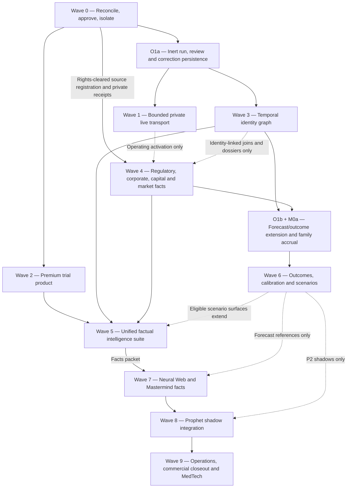

# BioCatalyst remaining build waves — Claude continuation handoff

| Field | Binding value |
|---|---|
| Status | **Canonical execution handoff for all remaining BioCatalyst work** |
| Audited repository base | `origin/main` at `83935501224807d51fdabd53bf9fc1f3959729e9` on 2026-08-06; no BioCatalyst path changed after the detailed `981d8851e0b` census |
| Production observed | `/api/health` checkout `83935501224`; static `/biocatalyst.html` 200; anonymous BioCatalyst APIs 401, `private, no-store`, `Vary: Authorization` |
| Supersedes | The current-state freeze, first mission, and remaining-lane ordering in the 2026-08-02 full-parity handoff |
| Retains as architecture | `research/BIOCATALYST_FULL_PARITY_SUPERINTELLIGENCE_BUILD_HANDOFF_FOR_FABLE_2026-08-02.md` |
| Design contract | `research/BIOCATALYST_D0A_IA_STATE_CONTENT_CONTRACT.md` — draft only; named design approval remains pending |
| Intended reader | Claude/Fable commissioning session, Opus design/review owners, Sonnet builders, source/data owners, Neural Web/Mastermind/Prophet owners |

This file is the one handoff to give Claude. The earlier full-parity document remains
the detailed architecture, product-forensics, source, model, and acceptance reference.
Where its status or sequence conflicts with this document, **this document wins**.

---

## 0. Binding instructions before any build

BioCatalyst is no longer a blank-slate competitor clone. It is a strong, narrow,
facts-first trial platform with several finished private APIs and several intentionally
dark controls. The remaining program must extend that substrate into a beautiful,
multi-source, temporal intelligence product without creating duplicate truth planes or
quietly upgrading facts into investment authority.

### 0.1 Clean-room and source boundary

- BioPharmCatalyst and BiopharmIQ remain behavioral/product benchmarks only.
- Never use competitor credentials, authenticated scraping, proprietary rows, private
  APIs, copied frontend assets, or competitor source code.
- Use independently authored implementation over official, public, or properly
  licensed sources, with a rights record for every source family.
- A source being publicly reachable does not automatically authorize redistribution,
  training, retention, bulk collection, or publication.

### 0.2 Repository and delivery boundary

Before every lane, Claude must:

1. read `CLAUDE.md`, `AGENTS.md`, `research/DO_NOT_REBUILD.md`, this handoff, and the
   older full-parity architecture document;
2. fetch fresh `origin/main` and re-query open pull requests;
3. regenerate the Active Build Map or use its dry-run output instead of trusting the
   committed 2026-08-02 snapshot;
4. create a unique worktree and fresh branch from `origin/main`;
5. claim exact paths and identify collisions before edits;
6. use Sonnet for bounded building, Opus for independent review, and Fable only in the
   commissioning/adjudication loop; and
7. complete the full commit → push → PR → green checks → squash merge → origin/main
   ancestry → production verification loop.

Parallel builders never share a worktree. Never use the shared stash stack, force-push,
or change the dirty main checkout's branch/index state.

### 0.3 Authority boundary

- Source facts and deterministic context remain A0/A1.
- LLMs may extract, summarize, compare, identify contradictions, and de-escalate; they
  may not originate probabilities, rankings, signals, scores, sizing, or escalation.
- Current NCT-only facts do not authorize issuer, ticker, sponsor, asset ownership, or
  security joins.
- Neural Web may consume governed facts/context; it does not own BioCatalyst truth.
- Prophet remains the selection owner. BioCatalyst cannot originate or reorder
  candidates, change gates, sizing, entry geometry, options selection, or confidence.
- Forecasts enter Prophet only after they already exist in an append-only BioCatalyst
  forward ledger and pass an independently governed shadow gate.

### 0.4 Activation boundary

No contract, UI, parser, or test PR may incidentally:

- enable a source;
- install, enable, or start a service/timer;
- mutate R2 or production pointers;
- publish a new route or dataset;
- accrue a prospective ledger;
- create alerts/exports;
- attach Neural Web or Prophet; or
- claim a soak, rights review, or operator decision happened.

Those are separate, explicit, independently reviewed lanes.

---

## 1. Executive state of the product

### 1.1 What is already real

The repository already has one BioCatalyst product shell, one private read API, a
ClinicalTrials.gov evidence/storage/publication foundation, exact trial-history and
prospective-change machinery, source/authority contracts, a dark Drugs@FDA substrate,
and a large hostile-test estate.

The current browser is a responsive bilingual three-pane Trial Intelligence Workspace:

1. control rail;
2. queue/list; and
3. evidence-backed trial dossier.

It currently exposes Milestones, the older Changes view, First-seen Tape, trial
list/detail, loading/locked/stale/empty/unavailable states, mobile dossier behavior,
and a Mastermind launch affordance.

### 1.2 What the user cannot yet do

Despite the deeper backend, the browser still does **not** expose:

- the facts-only Trial Screen and its facets;
- the explicit-NCT Trial Protocol Peer Matrix;
- the replay-verified Change Tape endpoint;
- endpoint-alignment review candidates;
- a company, asset × indication, regulatory, or catalyst dossier;
- a complete catalyst calendar;
- FDA/openFDA safety and label intelligence;
- patents/exclusivities, partnership economics, or financing survival;
- historical probability/timing/comparable models;
- expected-value scenario distributions;
- saved cohorts, watches, alerts, or exports; or
- operating Neural Web/Mastermind/Prophet integration.

The central product gap is therefore not “build a biotech dashboard.” It is:

> Finish a governed temporal evidence graph, productize the backend that already
> exists, add missing official-source and cross-plane facts, then earn predictive and
> signal integration through forward evidence.

---

## 2. Shipped-state correction — do not rebuild these lanes

| Lane/capability | Shipped evidence | Exact present state |
|---|---|---|
| Original full-parity handoff | PR #4325, merge `40c4887855c` | Architecture/planning only; no runtime feature |
| `BC-F0` baseline | PR #4347, merge `4e20deecce6` | Ownership/read-adapter and launch-SLO control freeze. Current successor is `pre_soak_unarmed`; blocked adapters did not become usable |
| Offline launch verifier | PR #4364, merge `ac0deefde18` | Evidence/recovery validation only; not a scheduler or live soak |
| `BC-D0a` | PR #4371, merge `7cb2bf7ebd4` | Draft IA/state/content/acceptance contract plus 24 synthetic plates. It is not browser proof, named approval, D0b, or a finished surface |
| `BC-T1a` | PR #4367, merge `32343600a2b` | Explicit caller-supplied NCT facts-only peer resolver. No discovery, rank, identity, or UI |
| `BC-T2a` | PR #4403, merge `d58715aaefe` | Private deterministic `needs_review` endpoint-alignment candidates. No persistent review queue or protocol-change claim |
| `BC-T2b` foundation | PR #4420, merge `c39a7dc4491` | Exact field-change classification and non-deliverable alert projection. Not user alerting or materiality |
| Replay-safe Change Tape | PR #4434, merge `9528c3622c8` | Private API exists; current browser still calls the older `/trials/changes` path |
| `BC-N0a` foundation | PR #4401, merge `d51d864c3a4` | Deterministic compiler only. No producer service, operating packet, reader, Mastermind tool, or Prophet connection |
| `BC-X1` | PR #4402, merge `9c46bafd02d` | Synthetic shipping interoperability proof is complete. Retain as regression proof; do not schedule a replacement |
| Narrow transcript seam | PR #4442, merge `13cb76a3c39` | Receipt-bound caller-ticker transcript context only. Not a generic corporate document/span adapter and no issuer/security/trial linkage |
| Trial Screen | PR #4449, merge `c0a92be850a` | Private facts-only `GET /trials:screen`; no browser integration, fuzzy search, ontology expansion, identity, or ranking |
| Trial Screen facets | PR #4453, merge `47e57451d3d` | Private atomic facet counts; no browser facet rail |
| `B1S0` discovery control | PR #4457, merge `5bcdb018f3e` | Dark, hermetic injected-transport harness only; no HTTP collector, service, storage, route, or activation |
| `B1S1` fixed cohort | PR #4459, merge `3420e944989` | Validation-only canonical 1–25 NCT control; no collection, publication, scoring, alert, or consumer |

### 2.1 Existing private routes to consume

Do not create competing versions of these routes:

| Route | State |
|---|---|
| `GET /api/biocatalyst/v1/health` | Authenticated private health |
| `GET /api/biocatalyst/v1/trials` | Current trial projection |
| `GET /api/biocatalyst/v1/trials/{nct_id}` | Trial dossier/detail |
| `GET /api/biocatalyst/v1/trials/milestones` | Registry milestone view; not automatically a market catalyst |
| `GET /api/biocatalyst/v1/trials/changes` | Existing historical changes projection |
| `GET /api/biocatalyst/v1/trials/change-tape` | Replay-verified Change Tape |
| `GET /api/biocatalyst/v1/trials/prospective-changes` | Retention/activation-gated first-seen changes |
| `GET /api/biocatalyst/v1/trials:screen` | Facts-only literal-AND Trial Screen |
| `GET /api/biocatalyst/v1/trials:screen/facets` | Atomic Trial Screen facets |
| `POST /api/biocatalyst/v1/trial-peer-sets:resolve` | Explicit-NCT facts-only peer comparison |

Preserve authentication, entitlements, `private, no-store`, `Vary: Authorization`,
generation/query/caller-bound cursors, bounded payloads, and fail-closed unavailable
responses.

### 2.2 Existing browser bundle boundary

`templates/biocatalyst.html.j2`, `templates/biocatalyst.css`,
`templates/biocatalyst.js`, and `scripts/build_biocatalyst.py` are the only shell to
evolve. The current JavaScript consumes milestones, legacy changes, prospective
changes, and trial list/detail. It does not consume Screen/facets, the peer resolver,
or the replay-verified Change Tape.

Build those integrations in this shell. Do not create `biocatalyst-v2`, a second SPA,
a browser-side truth store, or a Bio-only clone of the shared Sector Intelligence
workspace.

### 2.3 Dark and blocked boundaries at this audit

| Boundary | Current registry state | Consequence |
|---|---|---|
| ClinicalTrials.gov v2 source class | Production ingest allowed, runtime still operator provisioned/gated | Code may extend existing receipts/projections; do not claim the new fixed-cohort lane is live |
| Discovery | `dark_contract_and_hermetic_harness_only` | No network/service/storage/API path exists |
| Fixed cohort | `validation_only_fixed_cohort_control` | Membership authority only; consumers are empty |
| Record History | Production ingest not allowed | Keep unavailable/canary behavior; never casually enable undocumented history transport |
| Prospective accrual | Retention proof + root-sealed gate + fresh heartbeat required | No backfill or first-seen claim without verified activation |
| Drugs@FDA | `dark_b4a_private_only`; production ingest not allowed | No public projection, ticker join, PDUFA, CRL, clinical interpretation, or signal claim |
| openFDA | Production ingest not allowed | Requires a separate rights/source lane |
| Company PIT identity | Blocked | Current Company Intelligence context is not a point-in-time identity service |
| Security PIT identity | Blocked | Existing roster is not a complete security master/corporate-actions history |
| Corporate documents/spans | Blocked except the narrow transcript seam | Reuse owner substrates; do not create another filing/transcript store |
| Capital Structure PIT adapter | Blocked | BioCatalyst cannot duplicate cash/burn/runway/dilution truth |
| Neural Web/Prophet | No eligible identity bridge, operating packet/ledger, or approved shadow path | Facts/context design only; no signal wire |

---

## 3. Current collision snapshot

At the audited base there were 81 open fleet PRs, 450 mapped file-collision pairs, and
**zero open BioCatalyst PRs**. Claude must re-query this state because it changes
rapidly.

Avoid these active collision zones until their PRs land or are superseded:

| PR | Collision/implication |
|---|---|
| #4746 | Capital Structure job isolation; owns CI/daily/DAG paths |
| #4701 | Prophet job isolation; overlaps CI/daily/DAG paths |
| #4764 | Shared CI and `tests/conftest.py` repair |
| #4751 | Nightly workflow/telemetry paths |
| #4762 | VPS/deploy/Caddy/site-access paths; blocks a clean B1S2b assignment |
| #4740 | Capital Structure document-term lineage; settle before pinning a Bio capital adapter |
| #4689 and #4673 | Neural Web outcome semantics/edge ledger; settle before Bio outcome coupling |
| #4512 | Shared navigation/Sector Intelligence JavaScript; do not fork around it |

`B1S2a` can proceed without touching CI, DAG, deploy, Caddy, site-access, shared
navigation, Capital Structure, Neural Web, or Prophet paths.

---

## 4. Dependency-correct wave map

The arrows are authority/data prerequisites, not a command to serialize everything.
Regulator-native `R1` source registration, parsing, and private receipt lanes may begin
after Wave 0 plus their own rights decision; they do not wait for the PIT identity graph.
Only source activation waits for the relevant operations gate, and only issuer-linked
joins/dossiers wait for Wave 3. `O1a` is an early prerequisite for soak receipts and
review queues. `O1b/M0a` opens each eligible outcome family's forward clock as soon as
that family's frozen policy, identity and source inputs exist; it does not wait for the
entire Wave 5 UI. Each wave below identifies safe parallel lanes.

---

## 5. Wave 0 — reconciliation, design approval, and isolated readiness

### W0-A — `B1S2a` private fixed-cohort transport

This is the immediate first implementation lane.

Suggested isolated paths:

- `collectors/biocatalyst/clinicaltrials_fixed_cohort.py`;
- one new `contracts/biocatalyst/` transport-run/receipt schema;
- one frozen hostile fixture family under `tests/fixtures/biocatalyst/`; and
- one focused test module.

Required transport sequence:

1. `GET /version`;
2. exactly one bounded `GET /studies` request for the manifest's canonical cohort; and
3. `GET /version` again.

Required invariants:

- `config/biocatalyst_sources.yml` plus the validated `ctgov_fixed_cohort.v1`
  document are the sole membership authority;
- environment variables cannot replace or enlarge the cohort;
- source version before and after must match;
- returned NCT set and count must match the requested cohort exactly;
- duplicate NCT IDs fail closed;
- any `nextPageToken` fails closed; one page only;
- redirects are disabled;
- proxy/environment inheritance is disabled for the HTTP session;
- response encoding/content length must be canonical and bounded;
- reads are streamed with a cap-plus-one strategy and hostile giant chunks are trimmed
  before comparison;
- every response closes on every path while preserving the primary exception;
- retry count, connect/read timeouts, retry budget, response bytes, and run bytes are
  hard bounded; and
- output is private run/receipt evidence only.

Starting caps from the adjudicated design:

| Dimension | Default/hard boundary |
|---|---|
| Cohort size | 1–25 canonical unique `NCT########` IDs |
| Query bytes | ≤299 UTF-8 bytes |
| Attempts | 3 |
| Connect/read timeout | 10s / 45s |
| Total retry budget | 120s |
| Response bytes | 3 MiB default; 8 MiB hard |
| Run bytes | 16 MiB default; 64 MiB hard |

The opt-in variable, if implemented, is
`BIOCATALYST_FIXED_COHORT_TRANSPORT_ENABLED=0` by default. Do not add
`BIOCATALYST_FIXED_COHORT_NCTS` or another membership override.

Explicit exclusions: no worker installer, service, timer, DAG, deploy file, R2/storage
publication, read API, browser UI, source activation, issuer/asset mapping, alerts,
Neural Web, Prophet, or model work.

Exit gate: focused hostile tests, existing fixed-cohort/discovery/source-registry
regressions, bounded failure behavior, independent security/authority review, merge and
production ancestry proof. Because the lane is dark, the live surface proof is that no
new route appears.

### W0-B — D0a named design adjudication

`config/biocatalyst_product_acceptance.yml` is presently
`draft_human_approval_pending`. Its 24 PNGs under
`mockups/refs/biocatalyst/d0a/` are synthetic contract-state plates rendered with a
non-portable helper. They are neither live-browser truth nor approval.

A named Fable/Opus design owner must:

- review the information architecture, content grammar, state precedence, evidence
  envelope, interaction model, bilingual voice, and responsive direction;
- accept, amend, or replace the reference direction;
- record the decision in a successor contract/receipt rather than editing v1 into a
  passing state; and
- freeze the reference/state pack that D0b will implement.

A builder cannot self-approve this gate.

### W0-C — `BC-F0-delta` shared-plane reconciliation

Re-audit `config/sector_intelligence_ownership.yml` and
`data/biocatalyst/fixtures/shared_plane_read_adapters.v1.json` against current:

- Company Intelligence;
- Corporate/earnings documents and spans;
- Capital Structure;
- security master/corporate actions;
- Terminal/Supabase user state;
- Neural Web; and
- Prophet.

Only mark an adapter eligible when its owning plane supplies an executable, versioned,
point-in-time contract with ambiguity/unavailable behavior and compatible fixtures.
This is a compatibility delta—not permission to build substitute writers.

Wait for #4740/#4746 or their successors before pinning the Capital adapter. Preserve
blocked states when the dependency is still incomplete.

### W0-D — split and build `BC-O1a` inert operational persistence

Do not wait until the modeling wave to create the canonical homes required by earlier
operations. Split the former `BC-O1` into:

- `BC-O1a` now: inert migrations/interfaces for immutable source-run and soak receipts,
  identity/endpoint review queues, correction lineage, review decisions, and replay
  metadata; and
- `BC-O1b` later: forecast snapshots, outcomes, model registrations, evaluation
  manifests, and contribution traces.

`O1a` must provide versioned schemas, a single writer interface, idempotency keys,
append-only or correction-linked semantics, tenancy/role boundaries where applicable,
restore/migration/replay tests, bounded query APIs, and an unavailable state. It has no
public route, source activation, model, alert, or authority effect. The canonical store
is a persistent service/domain plane—never git, fixtures, browser storage, or logs.

This substrate must exist before `B1S2b` writes durable run/soak evidence, before W3
opens review queues, and before W5-E claims an operating review console.

In parallel, a contract-only `M0a-policy` lane may freeze the common outcome envelope,
known-at/censoring/correction grammar and family-registration rules. It creates no
forecast and no authority. Each family's actual forward clock opens later—but as soon
as that family has eligible inputs and `O1b`, not after the entire product UI ships.

### W0-E — closed-beta source and adapter manifest

Create a successor contract such as
`biocatalyst_closed_beta_source_manifest.v1` before anyone claims “launch sources” are
ready. The manifest must name, by exact source/adapter ID and version:

- ClinicalTrials.gov current-record coverage and discovery scope;
- at least one regulator-native application/submission source;
- label/safety coverage or an explicit blocking ruling;
- PIT company/asset identity and security context boundaries;
- Corporate document/span coverage;
- Capital Structure PIT inputs;
- market/options context if factual financing/market or EV surfaces are in beta scope;
- mandatory versus optional/deferred families;
- rights, retention, redistribution, training, and publication disposition;
- freshness/completeness/error/correction SLOs and denominators; and
- the exact UI/API features each family unlocks or leaves unavailable.

The fourteen-day launch SLO must bind a successor of this exact manifest. The current
registry's single `launch_critical` source cannot, by itself, authorize a “full
BioCatalyst beta” claim.

### Wave 0 completion

- `B1S2a` is merged and remains dark;
- D0a has a named adjudication and immutable successor reference contract;
- current shared-plane eligibility is executable and truthfully blocked where absent;
- `O1a` supplies inert durable run/review/correction homes;
- a named closed-beta source/adapter manifest defines the actual launch denominator;
- no source or authority is activated; and
- exact next file owners are collision-free.

---

## 6. Wave 1 — bounded live-data operation

### W1-A — `B1S2b` privileged deployment boundary

Entry: `B1S2a` merged and independently reviewed; active deploy/Caddy/site-access
collisions resolved.

Build a separate installer/service/timer lane with:

- distinct runtime user, state root, environment file, and least privilege;
- no R2/publication credentials unless a later lane explicitly requires them;
- default-off transport gate;
- updater reconciliation only for already installed units;
- installer behavior that never enables or starts the unit;
- explicit masking/non-overlap with the existing B0a worker paths; and
- install, upgrade, rollback, mask, ownership, and permission tests.

Freeze this runtime contract rather than leaving the installer to invent it:

| Runtime object | Binding path/interface |
|---|---|
| Service identity | dedicated `macro-biocatalyst-fixed-cohort` user/group |
| Environment | `/etc/macro-biocatalyst-fixed-cohort.env`, `root:root`, mode `0600`; transport enablement and limits only, never cohort membership |
| Immutable manifests | `/etc/macro-biocatalyst-fixed-cohort/manifests/{cohort_id}.{content_sha256}.json`, root-owned and read-only |
| Active manifest bytes | `/etc/macro-biocatalyst-fixed-cohort/active.json`, root-owned, canonical JSON plus one LF; never a symlink |
| Private run root | `/var/lib/macro-biocatalyst-fixed-cohort/runs/{run_id}/` |
| Private receipt root | `/var/lib/macro-biocatalyst-fixed-cohort/receipts/{yyyy}/{mm}/{run_id}.json` |
| Canonical receipt ledger | `BC-O1a` immutable source-run/soak receipt writer |
| Executable | `scripts/biocatalyst_fixed_cohort_transport.py` with explicit `--manifest` and `--receipt-root`; no NCT-list argument |
| Loader interface | one bounded nofollow loader that returns a detached, contract-valid manifest only after file-type, owner/mode, canonical-byte, self-digest, registry-ref, and registry-digest checks |

Rotation lifecycle:

1. install a new immutable versioned manifest under the digest-qualified path;
2. validate and byte-read it back under the runtime loader;
3. record an `O1a` rotation receipt binding old/new IDs, hashes, actor and known time;
4. atomically replace `active.json` with the exact validated bytes and read it back;
5. leave the prior immutable manifest and receipt intact; and
6. rollback by the same validated atomic-copy procedure, never by editing membership
   in place.

The runtime CLI loads `active.json` once per run, binds its exact bytes and digest into
the run receipt, calls the W0-A transport library, writes bounded private run evidence,
then appends the canonical `O1a` receipt. If `O1a` is unavailable, the run fails closed
before collection. Close/cleanup failure must not erase the primary error.

Hostile deployment tests must cover symlink/FIFO/device/hardlink/path-swap attacks,
unsafe owner/mode, noncanonical bytes, digest mismatch, partial rotation, concurrent
rotation/run, stale rollback, duplicate run ID, receipt-store outage, disk-full, crash
between write/fsync/rename, and any environment-based attempt to alter membership.

This runtime has no R2 credentials and cannot write the existing public projection.

Exit: deployment artifacts are installable and inert. No collector traffic has been
claimed or caused.

### W1-B — `B1S2c` operator arm and 14-day soak

This is an operator/operations decision, not a normal feature PR. Entry requires:

- source-rights disposition;
- root-sealed retention proof where prospective state is involved;
- exact production environment and service identity;
- immutable launch-SLO manifest and verifier evidence;
- replay/rollback drills; and
- fresh operator arming decision.

Exit requires fourteen continuous days meeting the manifest's freshness,
completeness, error, integrity, privacy, and rollback thresholds with no critical
breach. Report attempted/failed runs honestly. Never backfill a “first seen” clock.

### W1-C — controlled ingestion into the existing evidence plane

Only after the soak gate may a separate PR connect the fixed-cohort receipt/run output
to the existing BioCatalyst raw-receipt, storage, watermark, publication, and private
read projections.

It must reuse:

- `collectors/biocatalyst/clinicaltrials_v2.py` source parsing;
- `engine/biocatalyst/storage.py`;
- `engine/biocatalyst/publication.py`;
- the existing worker/run receipt patterns; and
- current authenticated routes.

Do not build a second trial store, pointer scheme, or public API.

### W1-D — `B1S4` controlled coverage expansion

The fixed 1–25-NCT cohort is a safe proof slice, not product-scale coverage. After the
fixed-cohort transport, soak, and existing-plane integration are proven, graduate the
already-shipped B1S0 discovery harness through separately reviewed coverage epochs.

Each expansion PR/run must bind:

- one explicit `discovery_scope.v1` policy and source-query family;
- immutable discovery run and coverage-epoch receipts;
- deterministic candidate admission into reviewed fixed cohorts;
- exact pagination/termination, total-count, duplicate, and version-drift behavior;
- coverage denominator and known exclusions;
- byte/time/request/rate-limit budgets and stop conditions;
- replay, correction, withdrawal, and rollback behavior; and
- no issuer/security/model/alert inference during discovery.

Expand in measured cohorts; never flip from 25 IDs to an unbounded universe. A coverage
claim is earned only by the recorded denominator, not by the breadth of a query string.

### Wave 1 completion

The product has evidenced, bounded, operator-armed and replayable live trial coverage
through the existing private projection, plus a governed path from the proof cohort to
measured discovery coverage. A deployment file or one successful request does not
satisfy this wave.

---

## 7. Wave 2 — premium trial product and state system

### W2-A — `BC-D0b` state atlas and visual primitives

Entry: named D0a approval and stable shared Sector Intelligence shell direction.

Implement the approved primitives in the existing shell:

- Decision Sentence;
- Temporal Braid;
- Evidence Thread;
- object identity ribbon;
- contradiction rail;
- Research Tray adapter;
- source/known-at/as-of/freshness envelope;
- locked, partial, unavailable, stale, correction, outage, empty, historical, and
  ambiguity states; and
- deterministic state precedence.

The state harness must render real browser fixtures across desktop/tablet/mobile,
dark/light, EN/ZH, standard/reduced motion, keyboard-only navigation, and screen-reader
semantics.

### W2-B — `BC-T1b` Trial Protocol Peer Matrix UI

Consume the existing explicit-NCT resolver. The user chooses or pastes the cohort;
the product does not discover/rank peers yet.

Required UX:

- stable identity/frozen first column on wide screens;
- compact comparison cards or horizontal matrix treatment on mobile;
- enrollment, phase, status, dates, arms, endpoints, sites/countries, and coverage;
- source links and per-cell provenance;
- covered/uncovered/partial fields;
- evidence thread from any cell;
- locked/stale/empty/unavailable/error states; and
- bilingual plain-language labels.

Non-goals: automatic competitors, sponsor/ticker mapping, odds, semantic endpoint
equivalence, “best trial,” materiality, or investment ranking.

### W2-C — Trial Screen/facets UI

Wire the existing `/trials:screen` and `/trials:screen/facets` routes into the same
workspace. Preserve literal filter semantics and generation-bound pagination. Show the
active query as a removable, shareable visual grammar rather than a dense legacy form.

Do not add fuzzy retrieval, client-owned canonical filters, browser-only results, or
silent expansion beyond the API contract.

### W2-D — replay-safe Change Tape and review UX

Move the browser from the legacy changes route to the replay-verified Change Tape where
appropriate. Show exact before/after fields, source path, observed/known timestamps,
correction lineage, and history coverage.

Endpoint-alignment candidates remain `needs_review`. A later persistent queue may let
an analyst accept/reject an alignment, but the UI cannot call a registry edit a
protocol change or material event without reviewed evidence.

### W2-E — saved cohorts/watch adapter

Saved state belongs to Terminal/Supabase. Once its tenant-scoped adapter is available,
connect saved explicit cohorts and object watches without creating a BioCatalyst user
database or localStorage authority.

### Billion-dollar SaaS acceptance

Every visible lane must prove:

- one coherent information hierarchy and one evidence interaction grammar;
- progressive disclosure instead of dense competing cards;
- glanceable answer → inspectable rationale → source evidence;
- native mobile behavior rather than a squeezed desktop table;
- no clipped popovers, hidden columns without disclosure, dead hover-only actions, or
  loading dead ends;
- honest data-unavailable and dependency-unavailable states;
- EN/ZH copy written natively rather than word-for-word translated;
- reduced motion without information loss;
- WCAG-compatible focus, contrast, labels, and keyboard behavior;
- LCP p75 below 2.5 seconds under the frozen acceptance profile; and
- committed browser captures and machine-readable receipts for every required state.

### Wave 2 completion

The existing APIs feel like one premium trial product on 1440/820/390 viewports across
both themes/languages and reduced motion. No second shell exists.

---

## 8. Wave 3 — point-in-time identity and temporal biopharma graph

### W3-A — `BC-I1a` issuer/security read adapters

Wait for owning planes to publish reviewed PIT contracts. Required behavior:

- source-native company identity and identifiers;
- issuer/legal-entity aliases with effective intervals;
- security/listing identifiers with effective intervals;
- corporate actions, ticker reuse, delistings, mergers, and rename history;
- ambiguous and unavailable results; and
- as-known/as-of replay.

Current ticker rosters and Company Intelligence context are insufficient. Never infer
through an unavailable adapter.

### W3-B — `BC-I1b` asset × indication × ownership graph

Build typed, temporal relationships among:

- company/issuer;
- sponsor/collaborator;
- asset/drug/biologic/device;
- target/mechanism;
- indication/therapeutic area;
- trial;
- application/submission;
- regulator event;
- patent/exclusivity;
- license/partnership; and
- security only through the eligible PIT bridge.

Every edge carries source, evidence, effective time, known time, confidence class,
review state, correction lineage, and authority ceiling. Ambiguous relationships enter
a review queue; they do not become guessed joins.

### W3-C — ontology/review operations

Implement duplicate resolution, alias conflict handling, source precedence,
contradiction surfacing, review receipts, corrections, and temporal replay. LLM-suggested
links remain candidates until deterministic or reviewed admission.

### Wave 3 completion

The system can answer “what was known about this company, asset, indication, trial, and
security at time T?” without using today's symbol map to rewrite history.

---

## 9. Wave 4 — official-source and shared-plane facts

Each `BC-R1*` source is a separate PR with its own rights record, receipt contract,
replay fixture, completeness definition, freshness SLO, correction behavior, projection
allowlist, runbook, and fail-closed tests.

### W4-A — regulatory source lanes

Recommended order:

1. complete the Drugs@FDA rights/activation decision and private regulator-native
   projection;
2. openFDA labels;
3. recalls and safety notices;
4. shortages;
5. adverse-event context with explicit reporting-bias limits;
6. advisory-committee and Federal Register/calendar evidence;
7. Orange Book patent/exclusivity facts;
8. Purple Book biologic/reference-product facts; and
9. other sources only after rights and product job are explicit.

Source facts cannot be upgraded into inferred issuer, PDUFA, pending application, CRL,
clinical outcome, materiality, or market impact. Those require separate evidence and
reviewed joins.

### W4-B — `BC-R2` regulatory projection/dossier

Produce regulator-native, source-labeled application/submission/event timelines with
evidence coverage and unavailable states. Add company/security context only after the
PIT graph is eligible.

### W4-C — `BC-C1` corporate documents and partnership claims

Consume a versioned Corporate document/span adapter. Extract exact evidence spans for:

- trial guidance and timing;
- enrollment/endpoint commentary;
- regulatory correspondence disclosed by the company;
- licensing/partnership terms;
- milestones, royalties, opt-ins, territory, rights reversions, and termination; and
- management claims and subsequent outcome comparison.

Reuse the existing transcript seam and owner-managed SEC/transcript stores. Do not
download or canonicalize a second document archive.

### W4-D — `BC-C2` Capital Structure PIT adapter

Capital Structure remains the truth owner for cash, burn, share count, registrations,
offerings, convertibles, warrants, ATM capacity, debt, runway, and dilution inputs.

BioCatalyst may consume point-in-time inputs and express catalyst-relative scenarios;
it may not create a competing filing state or present a duplicate “true runway.”

### W4-E — `BC-MKT0` market/options/event-study adapter

Use a rights-reviewed PIT contract with corporate actions, sessions, after-hours event
alignment, delistings, liquidity, stale/missing chains, redistribution, retention, and
training rights. Do not create another quote/options writer.

### W4-F — shared-context and remaining parity adapters

The retained benchmark matrix includes jobs that cannot disappear into a generic
“later” bucket. Assign them explicitly:

| Lane | Product facts | Canonical owner / gate |
|---|---|---|
| `BC-CTX1` capital lifecycle | IPOs, follow-ons, ATMs, convertibles, lockups, offering capacity and completed financing events | Capital Structure PIT adapter; BioCatalyst adds catalyst-relative context only |
| `BC-OWN1` ownership context | Insider filings, 13D/G and 13F context, ownership changes and filing lag | Existing beneficial-ownership/SEC owner projections; point-in-time filing dates, no “smart money” score |
| `BC-TXN1` transactions | M&A, asset acquisitions/disposals, option exercises, rights reversion and collaboration changes | Corporate document/span + temporal asset graph; exact transaction evidence and effective intervals |
| `BC-EST1` licensed estimates | Revenue/EPS/cash/readout-date or analyst expectation context where licensed | Versioned licensed vendor adapter with redistribution/training rights; otherwise explicit unavailable |
| `BC-SCI1*` literature/grants/science | Publications, trial-linked papers, grants, abstracts/conference evidence and scientific updates | One official/public/licensed source per PR; identifier linking and evidence only, no result/PoS inference |
| `BC-ALT1*` alternative context | Source-specific operational/scientific context not covered above | Separate rights/privacy/PIT review per source; no generic “alternative data” bucket or silent web scraping |
| `BC-NEWS1` news/editorial context | Company, catalyst and portfolio-relevant news references | Consume existing News/Press/Company Intelligence contracts; no second news store or editorial truth plane |

Every lane requires source latency, known-at semantics, correction behavior, rights,
coverage denominator and explicit authority. `13F` is delayed institutional holdings
context, not a live ownership or conviction signal. Literature, grants, conference
abstracts and adverse-event reports are evidence with source-specific limitations, not
clinical validation. Licensed estimates remain unavailable until a contract exists.

### Wave 4 completion

The product has source-native trial, regulatory, corporate, financing, patent, and
market inputs plus explicit shared-context dispositions joined through the temporal
graph with visible missing dependencies.

---

## 10. Wave 5 — unified factual intelligence suite

### W5-A — `BC-U1` Explorer

Build one query/as-of/evidence/research-tray workspace across trials, companies, assets,
indications, applications, regulatory events, patents, partnerships, and catalysts.
Filters and saved state use server contracts, not browser truth.

### W5-B — `BC-U2` dossiers and Catalyst Radar

Productize:

- Company lens;
- Asset × Indication dossier;
- Trial dossier;
- Regulatory dossier;
- Catalyst Radar/calendar;
- Change Tape;
- competitive landscape; and
- evidence/correction thread.

Every field is labeled as source fact, deterministic derived fact, reviewed mapping,
model estimate, or unavailable. Catalyst dates carry source, date type, interval,
confidence, known-at time, revision history, and whether the date is company guidance,
registry timing, or regulator-confirmed.

### W5-C — `BC-U2F` factual financing/market sections

Entry requires eligible `C2 + MKT0` receipts. Otherwise the product displays dependency
unavailable—not placeholder zeros or an implied survivability verdict.

### W5-D — `BC-U3` cohorts, watches, alerts, exports, and API expansion

Consume Terminal/Supabase tenancy and entitlement services. Required properties:

- tenant isolation;
- idempotent watch/alert creation;
- “why received” evidence;
- correction/retraction behavior;
- quiet hours and delivery preferences;
- bounded exports with rights enforcement;
- stable API scopes, audit trail, cursors, and rate limits; and
- no canonical state in localStorage or git.

### W5-E — operational source/review console

Expose source health, coverage, stale/error state, replay, correction queue, ambiguous
identity queue, endpoint-alignment queue, publication generation, and rollback status.
This is an operator instrument, not a public marketing dashboard.

### W5-F — remaining benchmark lenses and routing

Productize the W4-F adapters without creating new truth planes:

- biotech movers and screener views from `MKT0`, labeled as market movement/filtering
  rather than alpha or catalyst probability;
- IPO/follow-on/ATM/convertible/lockup calendar from `CTX1`;
- insider/13D/G/13F ownership context from `OWN1`, with filing lag and coverage;
- M&A, asset transaction, licensing and rights-reversion tape from `TXN1`;
- licensed analyst-estimate context from `EST1`, or a first-class unavailable state;
- literature/grant/conference/science evidence library from eligible `SCI1` lanes;
- source-specific alternative-data context from eligible `ALT1` lanes; and
- company/catalyst/portfolio-news routing from `NEWS1` plus Terminal watches.

Every surface exposes source, known-at/as-of, lag, coverage, correction, rights class,
and why the object is shown. Editorial routing may prioritize relevance to a saved
object; it cannot silently become a ranked security recommendation.

### Wave 5 completion

A user can research an upcoming catalyst end-to-end, inspect every evidence dependency,
save/watch it, and receive correction-aware updates without encountering disconnected
mini-products.

---

## 11. Wave 6 — outcomes, calibration, and expected-value intelligence

Model fitting and scenario claims begin only when the relevant data/identity families
produce point-in-time, correction-aware, non-leaking cohorts. **Forward accrual starts
earlier**: each eligible outcome family opens its clock as soon as its policy, input
contracts and persistent ledger are ready. Do not wait for the entire factual product
or every source family before recording tomorrow's evidence.

### W6-A — `BC-O1b` forecast/outcome extension

Extend the already-operating `O1a` substrate with append-only homes for:

- feature snapshots;
- forecasts;
- outcomes;
- model registrations;
- evaluation manifests; and
- contribution traces.

Reuse `O1a`'s single-writer, idempotency, migration, restore/replay, audit and correction
semantics. Do not move review/run receipts into a second database. Do not store the
canonical ledger in git or a browser.

### W6-B — `BC-M0a` outcome taxonomy

Freeze the shared outcome envelope early, then define and accrue censored, time-safe
families for:

- trial progression/termination;
- endpoint readouts;
- timing slips;
- enrollment/site changes;
- regulatory outcomes;
- financing/dilution events;
- partnership events;
- market reaction; and
- forecast calibration.

Each family has its own entry gate: frozen policy/version, eligible source and identity
contracts, known-at clock, censoring/terminality rules, and `O1b` writer. Once those
conditions hold, start prospective accrual immediately even if no model or UI consumes
it yet. Corrections never rewrite the original forecast snapshot.

### W6-C — `BC-M0b` transparent baselines

Build interpretable baselines for:

- probability of success by phase and therapeutic area;
- trial completion/readout timing;
- enrollment/site trajectory;
- comparable-trial retrieval; and
- competitive position.

Every output shows cohort definition, sample size, exclusions, censoring, as-of cutoff,
uncertainty, calibration, and model card. “Industry average” without cohort evidence is
not acceptable.

### W6-D — `BC-M0c` market reaction and implied-move baselines

Entry requires `MKT0`. Correct for event timing, market/sector moves, corporate actions,
liquidity, delistings, and missing options chains.

### W6-E — `BC-M1a*` clinical/timing/comparable challengers

One preregistered family per PR, evaluated against the current champion on frozen,
leakage-safe, point-in-time data. Challenger outputs remain shadow-only.

### W6-F — `BC-M1b*` financing/payoff/EV scenarios

Entry requires `C1 + C2 + MKT0 + M0b/M0c` and exact dependency receipts. Model:

- cash survival to catalyst;
- financing probability/timing;
- dilution instruments and scenario ranges;
- clinical/regulatory outcome branches;
- competitive erosion;
- market/option reaction distributions; and
- joint dependencies.

Do not multiply five headline scores. The requested product concept—technical setup ×
catalyst probability × expected payoff × financing survivability × competitive
position—becomes a transparent scenario graph whose layers retain separate evidence,
models, cutoffs, uncertainty, and sensitivity.

### W6-G — `BC-U2EV` scenario UI

Render distributions, not naïve bull/base/bear labels alone:

- outcome branches and probabilities;
- payoff distribution and confidence intervals;
- financing/dilution branches;
- dependency/correlation assumptions;
- sensitivity tornado;
- comparable evidence;
- model version/cutoff; and
- “what would change this” falsifiers.

No eligible scenario artifact means no EV panel.

### Wave 6 completion

At least one transparent baseline family is forward-accruing, calibrated, reproducible,
and shown as shadow intelligence with honest uncertainty. Historical fit alone does not
authorize signal use.

---

## 12. Wave 7 — Neural Web and Mastermind integration

### W7-A — finish `BC-N0a` operationally

Turn the existing compiler into a deterministic packet producer that references
eligible projections and emits:

- source/evidence references;
- point-in-time facts;
- freshness and coverage;
- contradictions/corrections;
- identity state;
- eligible already-ledgered forecast references only; and
- explicit A0/A1 authority caps.

The producer cannot read raw stores behind owner projections or run models inline.

### W7-B — `BC-N0b` one Neural Web reader

Implement exactly one allowlisted reader with schema validation, source/claim limits,
freshness checks, contradiction propagation, deterministic ordering, bounded payloads,
and no write-back or authority escalation.

### W7-C — Mastermind facts tools

Provide bounded tools such as:

- search trials/catalysts;
- inspect a trial/company/asset/regulatory dossier;
- compare an explicit peer cohort;
- explain what changed;
- show evidence and uncertainty; and
- summarize financing dependencies.

Mastermind may narrate and challenge; it cannot manufacture missing facts or promote a
shadow forecast.

### W7-D — forecast references

`BC-N0c` may add eligible clinical/timing/comparable forecast references after M0b/M1a.
`BC-N0d` may add financing/payoff/EV references only after M1b plus exact C2/MKT0
dependency receipts.

### Wave 7 completion

Neural Web and Mastermind can retrieve reproducible BioCatalyst facts/context with
citations and contradictions while authority remains unchanged.

---

## 13. Wave 8 — Prophet integration, shadow first

### W8-A — `BC-P1` post-selection facts context

Entry requires the reviewed PIT issuer/security/asset graph, private validated packet
transport, and N0b.

For a frozen Prophet input, tests must prove byte-identical:

- candidate IDs;
- candidate order;
- entry/admission gates;
- score/confidence;
- position size;
- trade geometry;
- option/contract selection; and
- output when BioCatalyst is absent, unavailable, stale, ambiguous, or contradictory.

BioCatalyst may explain risk/context after selection. It cannot originate a name.

### W8-B — `BC-P2a` clinical forecast shadow

Read only eligible forecasts already stored in the Bio forward ledger. Emit contribution
traces and outcomes to a shadow ledger invisible to money-path decisions.

### W8-C — `BC-P2b` cross-domain scenario shadow

Requires eligible M1b forecasts and exact capital/market dependency receipts. Missing or
stale dependencies fail closed.

### W8-D — `BC-P3a/P3b` authority review

Deliberately unscheduled. Promotion requires matured forward evidence, preregistered
gates, stability/calibration proof, A5 governance review, fresh operator ruling, and a
separate PR. The first possible authority is shrink-only: cap or abstain, never add,
promote, reorder, or enlarge.

### Wave 8 completion

Prophet receives governed context and evaluated shadow forecasts with complete
contribution traces. No behavioral authority is implied.

---

## 14. Wave 9 — operations, commercial closeout, and sector-platform proof

### W9-A — `BC-O2` production operations

- source/service health and freshness;
- retry/dead-letter/replay controls;
- immutable run receipts;
- rollback and corruption drills;
- analyst/review queues;
- model/packet/alert observability;
- incident response and audit export;
- source-rights and retention review; and
- closed-beta SLO evidence.

### W9-B — commercial/API readiness

- entitlement matrix and plan limits;
- tenant audit trails;
- usage metering;
- export/redistribution enforcement;
- correction guarantees;
- support/incident workflow;
- API documentation and stable versioning; and
- retained-research-value/product-quality telemetry.

### W9-C — `BC-MD1` MedTech/device pack

Build device-native identity, submissions, clearances/approvals, advisory panels,
clinical evidence, safety/recalls, and company/market context as a separate domain pack.
It may reuse the Sector Intelligence kernel and shared shell, but it cannot force device
semantics into drug/biologic objects.

MedTech does not block a biopharma closed beta. It **does** block any claim of complete
BioPharmCatalyst benchmark parity if device coverage is included in that claim.

### W9-D — reuse for future sector products

`BC-X1` already proved synthetic cross-sector contract interoperability. Retain that
test. The next real sector—procurement/defense, shipping/import-export, mining,
energy, or agriculture—must reuse:

- evidence/source envelopes;
- temporal identity and correction patterns;
- state atlas and product shell primitives;
- review/forecast/outcome ledgers;
- Neural Web/Mastermind adapters; and
- authority manifests.

It must not inherit NCT/FDA/phase/endpoint assumptions. Each sector owns its native
ontology, sources, predictions, and outcomes.

---

## 15. Safe parallelization plan for Claude

### Start immediately

| Stream | First assignment | Why it is safe |
|---|---|---|
| A | `B1S2a` private fixed-cohort transport | Isolated collector/contract/test paths; no deploy, DAG, UI, or authority collision |
| B | D0a named design adjudication and D0b-ready interaction spec | Artifact/design work only; no runtime state change |
| C | Source-rights dossiers and owner-contract requests for I1/C1/C2/MKT0 | Research/contracts coordination without duplicating writers |
| D | `BC-O1a` inert persistence + `M0a-policy` contract | Needed by soak/review queues; no source, model or UI activation |
| E | One rights-cleared `BC-R1*` parser/private-receipt lane | Regulator-native work need not wait for issuer identity or source activation |

### Start after dependencies settle

| Stream | Wait for |
|---|---|
| `BC-F0-delta` Capital pin | #4740/#4746 or their successor contracts |
| `B1S2b` | `B1S2a` review plus #4762/deploy-path stability |
| D0b code | Named D0a approval plus shared-shell/navigation direction |
| N0 outcome integration | #4689/#4673 or successor semantic contracts |
| `O1b` family accrual | Frozen M0a family policy + eligible source/identity inputs; do not wait for all UI |
| Prophet context | PIT identity graph + operating N0b private reader |

### Agent routing

- Fable main loop: architecture, dependency/authority rulings, acceptance and merge.
- Opus: design owner, security/authority reviewer, model/statistics reviewer.
- Sonnet: bounded implementation, fixtures, tests, mechanical contract updates.
- Every builder and reviewer gets the binding gates inline in its assignment, not only
  a pointer to this long document.
- A child returns its PR/evidence to the commissioning session; the commissioning
  session completes review, merge, and production proof in the same task.

---

## 16. PR-sized lane ledger

| Lane | Status | Next deliverable / unblocker |
|---|---|---|
| B0/B1/B1b/B2/B4D/B4E | Shipped substrate; some runtime gates dark | Extend; never rebuild |
| B1S0 | Shipped dark control | Input to B1S2a |
| B1S1 | Shipped validation control | Input to B1S2a |
| B1S2a | **Next** | Private bounded transport only |
| B1S2b | Pending | Inert privileged deployment package |
| B1S2c | Operator-gated | Arm and 14-day soak |
| B1S3 | Pending after soak | Existing storage/publication integration |
| B1S4 | Pending after B1S3 | Measured discovery/coverage expansion in bounded epochs |
| BC-F0 | Baseline shipped | Delta audit only as adjacent planes evolve |
| BC-D0a | Draft shipped | Named design adjudication + successor acceptance contract |
| BC-D0b | Pending | Real browser state system/primitives |
| BC-T1a | Shipped | Existing peer resolver |
| BC-T1b | Pending | Peer Matrix UI |
| BC-T2a | Candidate engine shipped | Persistent review queue/productization pending |
| BC-T2b | Classifier foundation shipped | Deliverable alerting remains dependency-gated |
| Q1/Q2 | APIs shipped | Trial Screen/facets browser integration pending |
| Change Tape | API shipped | Browser integration pending |
| BC-I1a/I1b | Blocked/pending | PIT owner adapters, then temporal Bio graph |
| BC-R1* | Pending; Drugs@FDA substrate dark | One rights-reviewed source per PR |
| BC-R2 | Pending | Regulatory-native projection/dossier |
| BC-C1 | Narrow transcript seam only | General owner-supplied document/span adapter |
| BC-C2 | Blocked | Capital PIT adapter from Capital owner |
| BC-MKT0 | Pending | Licensed PIT market/options adapter |
| BC-CTX1/OWN1/TXN1 | Pending | Capital lifecycle, ownership and M&A/asset-transaction owner adapters |
| BC-EST1 | Licensed-later unless contracted | Versioned estimates adapter or explicit unavailable state |
| BC-SCI1*/ALT1* | Pending per source | Rights/PIT-reviewed literature, grants, science and alternative context |
| BC-NEWS1 | Pending adapter | Reuse News/Press/Company Intelligence; no second news store |
| BC-U1/U2/U3 | Pending/partial shell only | Unified Explorer/dossiers/user-state features |
| BC-O1a | Immediate prerequisite | Inert run/soak/review/correction persistence before operations and queues |
| BC-O1b | Pending by eligible family | Forecast/outcome/model extension of O1a |
| BC-O2 | Pending | Production source/review/replay console |
| BC-M0a | Policy may start immediately | Open each family's forward clock once its inputs and O1b are eligible |
| BC-M0b/M0c | Pending | Transparent probability/timing/comparable/reaction baselines |
| BC-M1a*/M1b* | Pending | Preregistered shadow challenger/scenario families |
| BC-N0a | Compiler foundation shipped | Operating packet producer pending |
| BC-N0b/N0c/N0d | Pending | Reader/tools, then eligible forecast refs |
| BC-P1/P2a/P2b | Pending | Post-selection context, then shadow only |
| BC-P3a/P3b | Unscheduled | Mature forward evidence + fresh ruling |
| BC-X1 | **Complete** | Keep as regression proof |
| BC-MD1 | Pending | Device-native parity pack |

---

## 17. Definition of completion

### Biopharma closed beta

Requires:

- bounded live official-source operation with completed soak;
- premium Trial Screen, Peer Matrix, Change Tape, and dossiers;
- temporal company/asset/indication/trial/regulatory graph;
- an approved, version-pinned successor of
  `biocatalyst_closed_beta_source_manifest.v1`, with every mandatory family eligible
  and its exact manifest-bound fourteen-day SLO evidence complete;
- honest unavailable states for every optional, deferred, blocked, or unlicensed
  source family and surface;
- saved cohorts/watches/alerts through the product plane;
- source/review/replay operations console;
- tenant, rights, correction, privacy, security, and SLO proof; and
- no unsupported signal/odds/issuer claims.

### Functional benchmark parity

Requires every benchmark job-to-be-done in the older full-parity matrix to be either:

- implemented with an eligible source and evidence;
- explicitly licensed-later with an honest unavailable state; or
- formally excluded by a product ruling.

MedTech/device scope must be complete before claiming whole-benchmark parity when that
scope is part of the comparison.

### BioCatalyst superiority

Requires more than more fields. The product must prove:

- point-in-time evidence and correction lineage;
- cross-source temporal identity;
- transparent financing survivability and scenario dependencies;
- calibrated probabilities/timing with forward evidence;
- superior comparable retrieval;
- evidence-first, responsive UI/UX;
- source health and operational transparency; and
- governed Neural Web/Mastermind/Prophet contribution without authority leakage.

### Prophet authority

Not part of ordinary completion. P3 remains a separate future governance decision even
if product parity and shadow integration are complete.

---

## 18. Paste-ready first prompt for Claude

> Continue the canonical BioCatalyst program from
> `research/BIOCATALYST_REMAINING_BUILD_WAVES_HANDOFF_FOR_CLAUDE_2026-08-06.md`.
> Treat the 2026-08-02 full-parity document as architecture/background and this newer
> handoff as the authoritative status and remaining-wave order.
>
> Start by reading repo guidance, fetching fresh `origin/main`, regenerating the Active
> Build Map, re-querying open PRs, and confirming that no newer BioCatalyst lane has
> landed. Preserve the existing trial evidence/API/shell stack and all source,
> entitlement, point-in-time, provenance, and authority fences.
>
> Queue five collision-isolated assignments, limited by the current Active Build Map:
> (1) `B1S2a` fixed-cohort private transport only; (2) named Fable/Opus review of the
> draft D0a design/reference pack plus a D0b-ready Trial Screen/Peer Matrix interaction
> specification; (3) source-rights/owner-contract reconciliation for I1/C1/C2/MKT0,
> preserving blocked adapters and producing the exact
> `biocatalyst_closed_beta_source_manifest.v1` successor contract; (4) `BC-O1a` inert
> operational persistence plus contract-only `M0a-policy`; and (5) one rights-cleared
> regulator-native `BC-R1*` parser/private-receipt lane. Source research and private
> parsing may begin after W0 rights review; neither waits for W1 transport or W3 identity.
>
> `B1S2a` must perform `/version → one /studies → /version`, exact fixed-cohort
> reconciliation, version stability, pagination-token rejection, streamed byte caps,
> bounded retry/time budgets, redirects/proxy inheritance disabled, and private run/
> receipt evidence. It must not add a service, timer, DAG, deploy file, storage,
> publication, route, activation, identity join, alert, model, Neural Web, or Prophet
> consumer.
>
> `BC-O1a` must remain a private, persistent, single-writer substrate with versioned
> migrations, idempotency, correction lineage, restore/replay tests, and no source,
> model, public-route, alert, or authority activation. Keep forecast/outcome storage in
> later `BC-O1b`. The `M0a-policy` assignment freezes contracts only; each family's
> forward clock opens only when that family has eligible inputs and `O1b`.
>
> Do not start D0b code before named design approval and shared-shell direction are
> stable. Do not infer sponsor/ticker/security identity, duplicate Company/Corporate/
> Capital/Terminal truth planes, or promote any forecast. Each implementation is a
> fresh worktree, bounded PR, independent security/authority review, green merge, and
> production verification.

---

## 19. Canonical references

- `research/BIOCATALYST_INTELLIGENCE_COMPETITIVE_TEARDOWN_AND_BUILD_DOCKET_2026-08-01.md`
- `research/BIOCATALYST_FULL_PARITY_SUPERINTELLIGENCE_BUILD_HANDOFF_FOR_FABLE_2026-08-02.md`
- `research/BIOCATALYST_D0A_IA_STATE_CONTENT_CONTRACT.md`
- `research/BIOCATALYST_CONTINUATION_HANDOFF_2026-08-02.md`
- `docs/biocatalyst_operations_runbook.md`
- `docs/BIOCATALYST_LAUNCH_SLO_OFFLINE_VERIFIER.md`
- `config/biocatalyst_sources.yml`
- `config/biocatalyst_outcomes.yml`
- `config/biocatalyst_launch_slo_manifest.yml`
- `config/biocatalyst_product_acceptance.yml`
- `config/sector_intelligence_ownership.yml`
- `contracts/biocatalyst/`
- `engine/biocatalyst/`
- `collectors/biocatalyst/`
- `app/biocatalyst.py`
- `templates/biocatalyst.html.j2`
- `templates/biocatalyst.css`
- `templates/biocatalyst.js`
- `scripts/build_biocatalyst.py`
- `mockups/refs/biocatalyst/d0a/`

The operating maxim for the rest of this program is:

> **Facts before joins. Joins before models. Models before shadows. Shadows before
> authority. All of it should feel effortless in the product.**
