# Capital Structure issuer-state build docket

## Canonical implementation path

This docket is the canonical handoff for the issuer-state build. It converts
the product goal into a clean-room, evidence-first sequence rather than a
surface-level clone of a competitor dashboard.

The implementation begins with SEC-derived facts and preserves the distinction
between what a filing directly says, what can be mechanically derived, and what
would require an eventual controlled model decision. No stage may silently
promote the latter into the former.

## Non-negotiable operating rules

- Use public/licensed source material only; do not copy competitor code, copy,
  private APIs, or circumvent access controls/paywalls.
- Every issuer claim must retain issuer identity, exact source document,
  evidence spans, content hashes, source availability, and system availability.
- Unknown, ambiguous, and unavailable are first-class states. They never mean
  zero capacity, no dilution, or no financing risk.
- Registration, EFFECT, shelf, resale registration, warrant, or offering
  language alone does not prove active, executable, or remaining capacity.
- A later compiler/parser/model change must produce an append-only correction
  that becomes visible only at its actual system availability time.
- Context layers have no direct signal authority. Prophet gating requires a
  separately versioned, shadow-tested promotion decision.

## Staged architecture

```mermaid
flowchart LR
    A["Verified SEC documents and lifecycle facts"] --> B["W2 direct document-term ledger"]
    B --> C["W3A candidate-term projection"]
    C --> D["W3A identity resolution and candidate state"]
    D --> E["W3B share basis, capacity, supply, corporate-action state"]
    E --> F["W3C cash, runway, financing-history context"]
    F --> G["W3D issuer dossier, API, UI, alerts"]
    G --> H["W4 wider instruments and document families"]
    H --> I["W5 forward hazard ledger"]
    I --> J["W6 controlled Prophet promotion"]
```

### W3A — candidate terms, identity candidates, and resolution state

**Purpose:** retain enough precise input for later entity resolution without
pretending a fee-table row is an instrument or a financing capacity.

Implemented in this slice:

- `capital_structure.instrument_candidate_term/v1` contract.
- One-for-one immutable projection of validated
  `capital_structure.document_term_observation/v1` rows.
- Closed mapping from direct security class to a candidate family only:
  common stock, preferred stock, debt, units, warrant, other, or unknown.
- A deliberately narrow `registration_security_candidate` supply role for the
  direct **amount-to-be-registered** row only. It means the registration row is
  source-scoped, not primary, resale, active, executable, or available.
- Fee, aggregate-price, per-unit-price, and rate rows remain attached evidence
  with `supply_role=not_applicable`; they cannot generate capacity arithmetic.
- Explicit `deferred` and `ambiguous` outcomes for unknown row classes,
  unavailable direct terms, ambiguous direct terms, missing row identity, and
  unsupported future source types.
- Candidate availability is the actual candidate compiler time, not a
  retroactive copy of the direct term’s availability. The direct source PIT is
  retained separately.

Still required before the W3A lane is complete:

1. Define an instrument-candidate relation contract with explicit matching
   evidence, deterministic candidate keys, and no fuzzy cross-filing joins.
2. Add resolver states: `unresolved`, `candidate`, `resolved`, `conflicted`,
   and `deferred`, with reversible/manual-review paths.
3. Add correction-aware links from candidate terms to a resolved issuer
   security only when a source document explicitly supplies the identity.
4. Add ledger receipt telemetry if/when the upstream document-term compiler
   emits a durable signed/recorded availability receipt. The current projection
   binds the exact validated source observation and its availability instead.

### W3B — share basis, capacity, supply, and corporate-action state

**Purpose:** build auditable issuer state after identity resolution exists.

Implemented substrate in this slice:

- An authenticated, append-only v2 observation ledger for direct SEC Company
  Facts outstanding-share and public-float concepts.
- Exact source/receipt/generation/anchor/store/PIT bridge receipts, explicit
  observed/deferred/ambiguous states, and correction-preserving snapshots.
- Independently signed, crash-recoverable outer publication with no decision
  authority. This is denominator evidence, not a selected denominator.

Still required before W3B is complete:

- Separate outstanding shares, float, authorized shares, registered shares,
  issuer-reported remaining ATM/shelf availability, exercise/convertible share
  potential, and resale registration. No shared “dilution” scalar.
- Corporate action ledger: reverse splits, split ratios, effective dates, and
  explicit split-adjustment provenance. No silent historical normalizations.
- Capacity facts require direct source language plus basis, as-of date,
  denominator/units, and a state (`reported`, `derived`, `unknown`,
  `ambiguous`). EFFECT is lifecycle context, never a capacity switch.
- Scenario calculations remain clearly labelled calculations, separate from
  reported facts, and must refuse missing share bases or undefined terms.

### W3C — cash/runway and financing history

**Purpose:** layer financial context beside, not inside, instrument facts.

- Issuer-reported cash, burn components, going-concern language, debt service,
  and known financing commitments receive their own fact contracts and PIT
  visibility.
- Runway uses explicit assumptions, source periods, units, cash restrictions,
  and scenario labels. If a defensible burn basis is absent, emit unknown.
- Financing history captures observed pricing, discounts, underwriters,
  insider participation, and outcomes only where source/economic definitions
  are coherent. It does not imply a forward probability.

### W3D — dossier, APIs, front end, and alerts

**Purpose:** expose an operator cockpit rather than a cluttered document dump.

- Issuer dossier chronology: filing, amendment, lifecycle, terms, candidate
  state, capacity state, share basis, cash context, and source evidence.
- The default screen answers: what changed, what is directly known, what is
  unresolved, and which exact filing supports each fact.
- Separate reported facts, calculated scenarios, and later model views in the
  UI. Show as-of time, source time, coverage, and freshness on every panel.
- Alerts are change/coverage alerts first (new filing, correction, source
  unavailable, resolution conflict). They are not buy/sell alerts.
- Mastermind AI retrieval must cite canonical fact IDs and status, never turn
  blank/missing records into assertions.

### W4 — wider document/instrument coverage

Add 8-Ks, prospectus supplements, ATM agreements, PIPEs, convertibles,
warrants, equity lines, preferreds, exchange offers, and press releases in
separate extractors. Each new document family earns its own contract, parser
evaluation corpus, ambiguity states, and correction behavior before feeding the
shared resolver.

### W5 — forward hazard ledger

Only after W3B/W3C coverage can a separate, non-authoritative hazard layer be
considered. It needs dated labels, frozen definitions, base-rate reporting,
calibration, coverage gating, and scenario/output provenance. “Probability of
offering” cannot be inferred from registration existence or rendered as a
single unexplained dial.

### W6 — Prophet integration

Prophet receives context as cited facts first. Any hard gate/weight requires a
separate proposal: versioned input snapshot, causal rationale, adversarial
backtest, shadow mode, calibration by cohort, override/audit policy, and an
explicit rollback switch. Until then the issuer-state lobe has
`prophet_authority=false` by contract. The W3A candidate-term contract also
sets every other authority lane false (`instrument`, `capacity`, `risk`,
`probability`, `rank`, `sizing`, `entry`, and `trade`) while preserving
`is_context_only=true`.

## Current W3A contract and compiler boundary

| Component | Purpose | Explicitly excluded |
| --- | --- | --- |
| `contracts/capital_structure_instrument_candidate_term.schema.json` | Immutable candidate-term contract and authority boundary | instrument ID, capacity, risk, probability, Prophet authority |
| `engine/capital_structure/instrument_candidates.py` | Verified direct-term to candidate-term projection, PIT reads, correction validation | network access, joins, arithmetic, UI/DAG/Synapse work |
| `scripts/compile_capital_structure_instrument_candidate_terms.py` | Offline canonical Parquet compiler with manifest/retained-byte validation | source fetches, SEC parsing, source-store mutation |
| `tests/test_capital_structure_instrument_candidates.py` | Contract, PIT, mutation, collision, evidence, and no-fuzzy-join tests | economics backtest or signal validation |

The candidate output belongs in:

`data/capital_structure/instrument_candidate_terms.parquet`

Its only semantic source is:

`data/capital_structure/document_term_observations.parquet`

The candidate compiler and every trusted PIT read must re-bind that ledger to
`source_manifest.parquet` and the manifest-addressed, hash-verified retained
bytes. Candidate-local hashes are an envelope-integrity check only; they cannot
on their own authorize copied issuer, value, or evidence fields. A historical
`source_as_of` is rejected for the canonical ledger so it cannot append a
newer candidate correction sourced from an older direct-term version.

**External-manifest-ledger residual (explicit):** this verifier proves that a
selected manifest, direct row, and candidate row agree with retained bytes. It
does not itself authenticate an independently rewritten upstream manifest
ledger or object-store namespace. The source-manifest ID is a commitment, not a
signature; the upstream generation/receipt anchor remains required before this
lane can claim externally anchored ledger history. Until that receipt is wired
into this compiler, this slice remains cited, context-only evidence and cannot
be promoted into instrument, capacity, risk, probability, rank, sizing, entry,
trade, or Prophet authority.

## Immediate next build order

1. **Landed:** W3A candidate-term contract/compiler/tests.
2. **Landed:** authenticated Company Facts intake and v2 direct share-observation
   materializer/publication substrate.
3. Write resolver and candidate-state contracts before implementing matching.
4. Build a small fixture corpus containing renewals, amendments, similarly
   named classes, resales, and reverse-split cases; define false-join failure
   tests first.
5. Add a current-share-basis selector, corporate-action ledger, and capacity
   facts with no scenario math until all units and
   availability states are exact.
6. Build the dossier API/UI around provenance and change chronology, then add
   optional UI refinements.

## Product direction

The durable moat is not a prettier registration table. It is a reliable issuer
state machine that lets an investor/operator ask *what can actually change the
share supply, on what evidence, and since when?* The front end should make that
causal chain legible; the backend should make every answer replayable.
