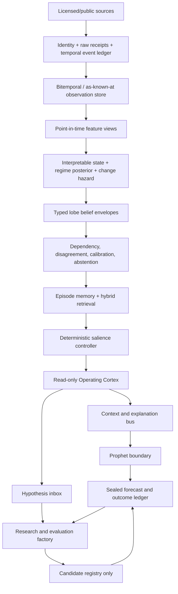

# Konseki clean-room assessment, Market Memory W0, and the Mastermind cognitive architecture

Date: 2026-08-08
Audience: Chris, Fable, Neural Web, Prophet, data-platform, and options-program owners
Status: **W0 implemented; PIT Historical Experience Simulator not yet implemented**
Authority: research/product architecture. Nothing in this document grants signal, ranking, sizing, gating, Prophet, portfolio, or execution authority.

---

## Executive ruling

**Study Konseki's product compression; do not copy or depend on its engine.**

Konseki turns a familiar historical-analogue workflow into an unusually clear retail product: enter a symbol, see comparable paths, inspect forward distributions and path risk, and read a short qualified summary. That interaction is worth learning from.

The strategic capability belongs inside Mastermind, but Konseki should not become its foundation:

1. Konseki's current [Terms](https://konseki.io/terms) explicitly prohibit using the service to build a competing historical-context product and prohibit reverse engineering or replicating its methodology. Multiple free accounts to evade quotas would cross the same boundary. We will not do that.
2. Public documentation does not establish a production-quality point-in-time universe, corporate-action policy, delisting treatment, overlap embargo, independent effective sample size, source licence, revision model, or out-of-sample calibration.
3. Mastermind already owns independent analogue and episode engines that predate this assessment. Building another matcher would duplicate them and violate the repository's reuse discipline.
4. Konseki covers a narrow price/volume similarity problem. Mastermind's opportunity is much larger: macro, curve, credit, breadth, volatility/options, positioning, dark pool, intraday structure, fundamentals, earnings, news, alternative data, and existing Prophet context under one temporal evidence contract.

The correct decision is:

| Decision | Ruling |
|---|---|
| Use the $12 plan for personal evaluation | **Yes, optionally**, for a bounded benchmark after confirming current entitlement |
| Use multiple accounts to expand calls | **No** |
| Embed Konseki output into Neural Web or Prophet now | **No** |
| Seek a written enterprise/custom licence | **Optional**, only if vendor output remains useful after independent validation |
| Build Mastermind's strategic market-memory capability | **Yes**, independently and clean-room |
| Copy the product's simplicity | **Yes, at the category/workflow level** |
| Copy formulas, weights, tags, JSON, prose, design, or corpus | **No** |
| Give analogue output Prophet authority | **No; context/shadow only until feature-level promotion** |

The original ChatGPT proposal in `Mastermind_Cognitive_Architecture_Original_Response.md` has the right strategic shape—deterministic lobes, persistent state, memory, attention, an operating Cortex, a research Cortex, outcome evaluation—but the wrong build order. The upgrade is:

> temporal evidence spine → sealed forecasts/outcomes → interpretable state → honest replay → episodic retrieval → read-only Cortex → governed research factory → narrowly promoted deterministic features

not:

> giant vector → LLM “lives through history” → self-adjusting superintelligence

The most important substrate is **temporal memory before cognitive memory**.

---

## 1. Evidence boundary and clean-room record

### 1.1 What was inspected

Research used only public pages, public HTTP behavior, public search-index history, the vendor's public GitHub/npm MCP wrapper, primary research, the supplied ChatGPT Markdown, and the current Mastermind repository.

No Konseki login, private route, API key, quota circumvention, bulk extraction, proprietary output corpus, or private implementation was used.

### 1.2 Claim labels

- **Verified:** directly observed public behavior or current repository code.
- **Vendor claim:** a statement made by Konseki that was not independently validated.
- **Inference:** a reasoned architectural/product conclusion.
- **Recommendation:** the proposed Mastermind direction.

### 1.3 Safe boundary

Safe:

- learn from the category, workflow, progressive disclosure, and evidence-first positioning;
- independently implement public/common time-series and retrieval methods over licensed data;
- design distinct formulas, labels, schemas, UI, prose, thresholds, and validation;
- retain a source log and code-history proof of independent development;
- use Konseki only under a written licence if vendor data ever enters a Mastermind product.

Not safe:

- reproduce Konseki's weights, thresholds, tags, response schema, copy, screenshots, or curated examples;
- query authenticated output to infer its engine or train a parity model;
- use many accounts or keys to reconstruct its corpus;
- proxy or rehost its raw output;
- treat it as a calibration oracle for a competing engine.

This is a product/engineering risk assessment, not legal advice.

---

## 2. Konseki product audit

### 2.1 Current product, as publicly served on 2026-08-08

The [homepage](https://konseki.io/) leads with one job: “see what happened last time” before taking a trade. Its fixed AAPL example compresses the product into one screen: current path, a subset of matching periods, sample count, positive share, median outcome, distribution, risk/reliability tags, and a qualified takeaway.

The authenticated Explore route is magic-link gated. Public pages imply the following flow:

1. enter an email;
2. use a one-time login link;
3. search a ticker;
4. select a lookback;
5. inspect matches, forward distributions, path risk, and commentary;
6. access an API key on an eligible plan.

The public methodology describes:

- eight lookbacks: 5, 10, 15, 20, 25, 30, 40, and 50 trading days;
- four forward windows: 3, 5, 10, and 15 trading days;
- cross-symbol historical matches;
- component distances for normalized correlation, path shape, realized volatility, trend, range position, volume, and downside/risk behavior;
- 1–5 match-quality dimensions;
- positive rate, mean, median, min/max, and return percentiles;
- maximum adverse/favorable excursion;
- time/symbol diversity and same-calendar-month comparisons;
- categorical direction, consistency, reliability, risk, and outlier tags;
- dated precomputed artifacts and historical lookup on eligible plans.

Sources: [engine description](https://konseki.io/methodology/how-the-engine-computes-historical-context), [similarity components](https://konseki.io/methodology/seven-components-match-similarity-scoring), and [API documentation](https://konseki.io/docs).

The official [Konseki MCP repository](https://github.com/konseki-official/konseki-mcp) is a thin MIT-licensed public-API client. It is not the analytical engine.

### 2.2 Pricing is in transition

Current public [pricing](https://konseki.io/pricing):

| Plan | Current public offer |
|---|---|
| Free | $0; 200 **symbol analyses** per month; 15-day lookback; four forward windows; no API |
| Pro | $12/month; all eight lookbacks; “unlimited” ordinary-use analyses; API |
| Custom | negotiated universe, historical snapshots, and support |

Older search-indexed pages recently advertised API-first Free/Lite/Pro/Research plans at $0/$19/$49/custom with 200/5,000/20,000 API calls. Those pages are retired or 404. The user's “200 free API calls” understanding therefore appears to describe the earlier offer, not the current public plan. An existing account may be grandfathered; only an authenticated entitlement check can confirm it.

### 2.3 What is genuinely strong

- **Product compression:** one question, one input, one coherent answer.
- **Progressive disclosure:** the example is understandable before methodology is opened.
- **Distribution before verdict:** median, tails, MAE/MFE, and count are more honest than a single score.
- **Machine/human parity:** structured fields can support tools while commentary serves retail users.
- **Low evaluation friction:** $12 is a cheap sandbox.
- **Batch artifacts:** precomputation and dated outputs are directionally correct for reproducibility.
- **Qualified positioning:** public copy repeatedly calls the product historical context, not prediction.

### 2.4 What is not publicly established

- market-data vendor and redistribution rights;
- exact live universe and historical point-in-time membership;
- inactive/delisted securities and delisting returns;
- symbol changes, mergers, IPO age, and corporate actions;
- split/dividend adjustment policy;
- exact formula, weights, thresholds, and candidate selection;
- overlapping-match exclusion, label overlap, embargo, or effective independent sample count;
- currency/calendar/limit-move/liquidity normalization across countries;
- bad tick, missing volume, stale price, and revision policies;
- confidence intervals, block bootstrap, null comparisons, or calibration;
- independent out-of-sample or live-forward results;
- engine, universe, source-vintage, and code version on historical artifacts;
- SLA, security controls, recovery, and enterprise key governance.

An immutable file generated today for a 2014 date is a **recomputed historical artifact**, not proof of what an engine emitted or knew in 2014. Those must be separate product claims.

### 2.5 Moat assessment

The exposed JSON, MCP wrapper, and seven component names are not a durable moat. The defensible work would be:

1. licensed point-in-time market data and universe history;
2. a long, genuinely versioned artifact corpus;
3. calibrated match selection and uncertainty;
4. corporate-action, delisting, revision, and evidence QA;
5. product compression and distribution.

Konseki publicly proves the fifth and plausibly implements parts of the second/third. It does not publicly prove the first four at production-research quality.

### 2.6 GTM lessons for Mastermind

Adopt:

- one memorable question at the top of the page;
- a real example visible before methodology;
- symbol search with near-zero setup;
- forward distributions and path risk, not an “AI score”;
- sample size and evidence caveats beside the result;
- a low-friction product surface usable without learning Neural Web internals;
- methodology/content pages that make the workflow discoverable;
- API/tool access as a product extension, not the core moat.

Do not mirror $12 as a standalone price reflexively. Market Memory is more valuable as a visible reason to retain/upgrade the existing Mastermind suite. A public fixed example or bounded teaser can acquire users; full macro + symbol + PIT replay belongs in a paid tier. Pricing should follow measured conversion/retention, not competitor anchoring.

---

## 3. What Mastermind already owns

The most important repository conclusion is **extend, do not rebuild**.

### 3.1 Macro analogues already exist

`engine/neuralweb/brain_analogues.py` already implements `brain.analogues.v1`:

- current complete macro query state;
- growth, inflation, 2s10s, 10y3m, VIX, breadth;
- quad, liquidity, and cycle categories;
- temporal exclusion around the query;
- episode diversity spacing;
- bounded deterministic retrieval;
- S&P 500 5/20/60-session paths, 10-year yield change, and VIX change;
- display-only language and tests against leakage/probability claims;
- an existing Brain tool, `get_historical_analogues`.

This is the current macro-memory lobe. W0 productizes it; it does not replace it.

### 3.2 The per-symbol historical playbook already exists

`engine/stock_events.py` and `engine/event_atlas.py` implement the Signal Episode Atlas:

- one frozen RSI-MACD event taxonomy across 2-session, 3-session, and weekly grids;
- strictly trailing event classes;
- matured-only 21/63-session and 13/26-week outcomes;
- absolute and SPY-excess outcomes;
- pre/post-2010 split;
- name, sector, archetype, and global support counts;
- hierarchical empirical-Bayes shrinkage (name → archetype → global);
- explicit survivor-bias, clustering, era, and authority caveats;
- display-only authority;
- current per-ticker receipts already rendered on stock pages.

`engine/prophet_doors.py` already allows a tightly controlled Door W read of the same receipt after selection, with zero selection authority. This is the correct precedent: the context can explain/measure a candidate without becoming the candidate selector.

### 3.3 Other relevant memory systems

- `scripts/build_analog_library.py` and `data/cycle_pattern/analog_library.parquet`: cycle-pattern analogue library.
- `scripts/build_china_analogs.py`: China analogue display layer.
- `engine/oracle/episodes.py`: Oracle episodic memory.
- `engine/provisional_replay.py` and `engine/rule_replay.py`: bounded replay precedents.
- `engine/neuralweb/world_state.py`: read-only composition of domain-owned artifacts.
- `engine/neuralweb/envelope.py`: source schema/producer/time/hash/tier envelope.
- `engine/neuralweb/constitution.py`: A0–A7 authority ladder and permanent A7 origination ban.
- `docs/SIGNAL_BUS.md` and `config/synapse.yml`: canonical artifact/consumer registry.
- `research/DO_NOT_REBUILD.md`: binding collision/kill registry.

### 3.4 The learned all-lobe embedding is correctly parked

`research/neuralweb/latent_state/feature_coverage.md` and `panel_manifest.json` audit 65 candidates (64 usable after excluding the forward label):

- 13 `pit_live`;
- 22 `recomputed_history`;
- 29 `current_snapshot_backfill`;
- **0 rolling-vintage**.

Most options, kernel, confluence, and personality families begin after 2021 or in 2026. A unified embedding trained now would learn data availability/era as much as market state. `research/NW_CORE_COGNITION_ADJUDICATION_BY_FABLE.md` therefore parks the encoder until its come-back gate. This program does not reopen that ruling.

---

## 4. W0 implementation in this change

### 4.1 What is implemented

| Capability | State | Owner |
|---|---|---|
| One Market Memory product page | Implemented | `templates/market_memory.html.j2`, `site/market_memory.{html,css,js}` |
| Paid/current-context API | Implemented | `app/market_memory.py` |
| Macro-state memory adapter | Implemented by reuse | `engine/neuralweb/market_memory.py` → `brain_analogues.py` |
| Symbol episode-memory adapter | Implemented by reuse | `engine/neuralweb/market_memory.py` → `event_atlas.py` |
| Explicit all-false authority | Implemented | `engine/neuralweb/market_memory.py` |
| Canonical `as_known_at` contract | Implemented and tested | `engine/neuralweb/market_memory.py` |
| Mandatory domain coverage, including options | Implemented in contract | `CANONICAL_CONTEXT_DOMAINS` |
| Future-EOD/OI clock rejection | Implemented in contract tests | `tests/test_market_memory.py` |
| Current navigation/build integration | Implemented | `_navlinks`, `nav_market.js`, `build_site.py` |

The page exposes two live lenses:

1. **Whole-market memory:** current macro state plus dated macro episodes and observed forward paths.
2. **Symbol episode memory:** current event class on W/2B/3B grids, shrunken historical outcome receipts, support counts, and era notes.

### 4.2 What W0 does not implement

| Capability | State |
|---|---|
| Requested-date `/as-known-at` query API | Not implemented |
| Immutable operational state snapshots | Not implemented |
| Frozen historical membership/security identity | Not implemented |
| Rolling-vintage macro feature store | Not implemented |
| Options chain/surface/OI point-in-time snapshots | Not implemented |
| Dark-pool/intraday/news/fundamental/earnings PIT playback | Not implemented |
| Effective independent match count or block-bootstrap bands | Not implemented |
| Historical Cortex forecast simulation | Not implemented |
| Prophet training/influence | Deliberately blocked |

Therefore W0 is a **current-context product/composition shell over real existing engines plus a frozen PIT contract**. It is not the complete Historical Experience Simulator and must never be described as one.

The symbol engine currently discloses `current membership (survivor-biased backfill)`. The API carries `historical_basis=recomputed_history`; the UI prints that limitation. Current recomputation is not historical truth.

---

## 5. Canonical `as_known_at` contract

The contract lives in `engine/neuralweb/market_memory.py` as `market_memory.as_known_at.v1`.

Its purpose is to stop the options program—or any other learner—from creating a second market-history/state engine.

### 5.1 Required clocks

- `event_time`: time in the modeled market/world.
- `measurement_end`: end of the source measurement window.
- `available_at`: when the source/vendor made that measurement available.
- `observed_at`: when Mastermind captured or produced the receipt.
- `as_known_at`: the product/query name for the decision-time cutoff;
- `knowledge_cutoff`: the byte-identical repository-contract alias for `as_known_at`.

Operational PIT law:

```text
event_time <= measurement_end <= available_at <= observed_at <= as_known_at
```

Public reconstruction law:

```text
event_time <= measurement_end <= available_at <= as_known_at
observed_at may be later, but remains visible and the mode is public_reconstruction
```

This distinction prevents a backfilled public series from being misrepresented as something Mastermind operationally possessed.

`operational_pit` accepts only `live_captured` or `source_vintage` evidence observed by the cutoff; an explicitly missing feature may use `unknown`. Recomputed history, public reconstruction, current-snapshot backfill, and unknown observed values fail closed in operational mode.

### 5.2 Required source receipt

Each source includes:

- stable `receipt_id` and `source_id`;
- all clocks above;
- `vintage_id` and `revision_id`;
- `pit_basis`;
- `availability_class`;
- `market_session`;
- quality status, flags, observation-time staleness, and imputation;
- deterministic `age_at_cutoff_seconds` in the context projection.

`receipt_id` hashes the immutable source evidence, including its clocks,
artifact, vintage, revision, and observation-time quality. It deliberately does
not hash `age_at_cutoff_seconds`: replaying the same receipt at a later valid
cutoff changes the context ID and age projection, not the durable receipt ID.

Allowed availability classes explicitly include `intraday`, `session_close`, `eod_vendor_snapshot`, `open_interest_eod`, scheduled releases, filings, news, revisions, and reconstructed snapshots.

Open interest or any EOD vendor field is not admissible merely because its measurement date is the session date. It is admissible only after its recorded `available_at`. The contract test rejects future OI/EOD information at an earlier decision cutoff.

### 5.3 Required feature receipt

Each feature includes:

- stable `feature_id`;
- domain;
- status `observed` or `missing`;
- value and unit, or explicit missing reason;
- observed clock and PIT basis;
- transform version;
- input source receipt IDs;
- quality/missingness receipt.

The contract computes `domain_coverage` and never fills an absent plane with zero.

### 5.4 Mandatory domains

The canonical domain set is:

1. macro;
2. rates/credit;
3. breadth/factors;
4. technicals;
5. options;
6. positioning/flows;
7. dark pool;
8. intraday microstructure;
9. fundamentals;
10. earnings;
11. news/narrative;
12. alternative data;
13. Prophet context;
14. system/data health.

A requested snapshot can be partial, but every required plane must say observed, partial, or missing. “We do not have options for 2008” is valid evidence. Silently omitting the plane is not.

The required-domain list is not caller-reducible: every valid packet carries all 14 coverage rows even when most are explicitly missing.

### 5.5 Labels are structurally separate

`market_memory.as_known_at.v1` cannot carry outcomes or labels. It is content-addressed by `context_id`.

The options/outcome owner may append a separate record only after the declared horizon closes:

```text
context_id
candidate_id
label_definition_version
horizon_start
horizon_end
label_available_at
source_receipts
outcome values
cost/mark convention
quality
```

`label_available_at` must be at or after `horizon_end` and after all sources used to compute the label. The pre-outcome context is never rewritten.

### 5.6 Ownership boundary with the options program

Market Memory owns:

- source/time/identity contracts;
- canonical as-known-at querying;
- immutable context snapshots;
- point-in-time feature and missingness receipts;
- requested-date playback;
- reusable context references consumed by options events.

The options program owns:

- the append-only `options.signal_episode/v1` per-print/per-campaign ledger and its durable date-keyed raw stage;
- option-event/candidate definition;
- candidate selection;
- contract selection;
- entry/exit and trade-management logic;
- mark/cost convention;
- horizon declaration;
- later H+60 and executable option outcome/label records;
- evaluation of whether the candidate process adds value.

It must import/consume `AsKnownAtReader`; it must not build another macro/news/options state history.

### 5.7 Repository contract convergence

Wave 1 must converge on the temporal contracts already enforced elsewhere in Mastermind, not create a second vocabulary:

- `contracts/sector_intelligence/source_record.v1.schema.json` is the normative source-vintage shape: published/effective/retrieved/first-seen clocks, valid and transaction intervals, content hash, parser/schema versions, and licence receipt.
- `contracts/sector_intelligence/feature_snapshot.v1.schema.json` is the normative feature/missingness shape: `as_of`, `knowledge_cutoff`, `computed_at`, PIT-safe flag, per-feature observation time, source references, input hashes, missingness, and staleness.
- `contracts/sector_intelligence/outcome_label.v1.schema.json` is the normative later-label shape: observation window, resolution clock, evidence, revision, and transaction interval. Market Memory never writes program-specific labels.
- `engine/government_revenue/point_in_time.py` is the generic dual-clock, fail-closed selection precedent; `engine/pit.py` plus `collectors/fred.py`/`data/fred_vintage/vintages.parquet` remain macro-vintage truth owners.
- `engine/neuralweb/query.py` remains the cross-domain read federation. Its derived spine index is not a source-of-truth ledger and must not be promoted into one.

`market_memory.as_known_at.v1` is the typed consumer envelope over those contracts. Its `as_known_at` and `knowledge_cutoff` clocks are identical by construction. A future JSON Schema may specialize the existing source/feature contracts; it must not fork their semantics.

---

## 6. Options-context plane: required design

Options is not an optional later idea. It is a mandatory Market Memory plane whose **data materialization is not yet built**.

### 6.1 Canonical identity

At minimum:

- permanent underlying/security identity;
- observed ticker/root and mapping version;
- OCC contract identity;
- expiry, strike, put/call, multiplier;
- deliverable/adjustment history;
- listing/delisting/expiry status;
- corporate-action lineage;
- exchange/vendor symbol mapping.

### 6.2 Raw/PIT source families

- option quotes/NBBO and trades, where licensed;
- chain snapshots;
- implied volatility and Greeks with model/version;
- volume;
- open interest with exact publication clock;
- underlying quotes/trades;
- risk-free/dividend/borrow assumptions used by derived fields;
- exchange calendar/session state;
- corporate actions and contract adjustments.

### 6.3 Derived context features

Distinct transforms, each with receipts:

- ATM IV and realized/IV spread;
- skew/smile and put-call wings;
- term structure;
- IV rank/percentile using only prior admissible observations;
- call/put volume and OI distributions;
- gamma/delta/vanna/charm exposure under a declared model;
- dealer-positioning proxies explicitly labelled proxies;
- expected move and event-volatility premium;
- strike/expiry concentration;
- liquidity, spread, depth, and stale-quote flags;
- unusual-flow context with duplication and sweep definitions;
- dark-pool/intraday confluence as separate source planes.

### 6.4 No future OI/EOD leakage

Open interest commonly describes positions after a session but becomes available later. The observation date is not the decision availability time.

Acceptance fixture:

1. an option event at 2026-08-07 15:30 ET;
2. same-session final OI whose vendor availability is 2026-08-08 07:00 ET;
3. request `as_known_at=2026-08-07 15:30 ET`;
4. OI must be missing with reason `not_yet_available`;
5. request after the vendor clock;
6. OI may appear with the original measurement window and later availability receipt.

The same law applies to final EOD dark-pool aggregates, short-volume files, revised macro releases, earnings transcripts, and delayed vendor classifications.

### 6.5 Unknown issue time is an interval, never a guessed timestamp

Some historical call ledgers expose an issue date, entry/contract, and later close/outcome but omit the issue time. Market Memory must not invent an intraday timestamp from row order, close time, option mark, or surrounding market movement.

Wave 1B.4A adds a separate, clock-free uncertainty envelope around the source event. It does not weaken or mutate `market_memory.as_known_at.v1`:

- `event_time_precision`: `date` or `session` in the first frozen profile;
- `event_time_lower_bound` and `event_time_upper_bound`;
- `timestamp_inferred`: always `false` for admissible replay evidence;
- `replay_scope`: `civil_date` or `market_session`;
- `market_session_window_id`: the exact reviewed session-window receipt when session sensitivity is admissible.

Date precision means the entire source-local civil day `[00:00, next 00:00)`, including 23- and 25-hour DST days. It is not evidence that the event occurred during regular trading hours. A date-only event may receive partial session sensitivity only when its source contract separately fixes `replay_scope=market_session` and supplies an independently reviewed, versioned session-window receipt. Plain `civil_date`, weekends, holidays, unresolved calendars, and missing receipts do not fan out. Session precision always requires the same exact receipt.

The W1B.4A event reference is explicitly a caller-attested hash of a pre-decision projection. This clock-free layer neither receives nor authenticates the referenced event bytes, source-contract semantics, or the caller's replay-scope claim. Those limitations are frozen into every envelope. W1B.4B must replace that attestation with a typed, authenticated source receipt before any historical context can be materialized.

W1B.4A emits only an ordered, explicitly **unmaterialized** sensitivity plan. When a session receipt is admissible its hypothetical cutoffs are exact open, temporal midpoint, and `close - 1 microsecond`; no cutoff is selected, weighted, averaged, or called the actual event time. The plan carries zero execution, ranking, gating, sizing, training, promotion, or point-claim authority. It creates no context packets, store, service, API, or private-source read.

Actual `public_reconstruction` packet fanout is deferred to W1B.4B. That later phase requires an authenticated historical session schedule, historical identity/corporate-action resolution, and a separately named generation-pinned reconstruction reader. Only then may each scenario reconstruct what was available by its cutoff across the 14 canonical domains. Later close, exit, premium outcome, realized P&L, H+60 labels, direction, and management decisions remain forbidden. The options program owns the per-contract episode and matured outcome; Market Memory owns only the referenced context reconstruction.

---

## 7. Upgraded Mastermind cognitive architecture

The architecture is a governed typed blackboard, not a monolithic “superintelligence” and not a trainable mixture-of-experts in the usual sense.



### Layer 0 — Governance/control plane

Cross-cutting:

- model/data registry;
- authority class;
- source licence;
- lineage and audit log;
- experiment/trial ledger;
- review/expiry clocks;
- rollback, kill switches, SLOs, security policy.

[NIST AI RMF](https://doi.org/10.6028/NIST.AI.100-1) is a useful voluntary Govern–Map–Measure–Manage frame. It is not a claim that Mastermind is regulated under it.

### Layer 1 — Source, identity, and evidence

Stable identity, raw payload hash, source availability, system observation, revision/vintage, parser/run version, quality, corporate-action map, and licence.

No inferred issuer/security/contract join becomes fact without an adjudication receipt.

### Layer 2 — Temporal observation store

Event sourcing preserves state changes; bitemporal records distinguish the modeled time from database/knowledge time. [Fowler's event-sourcing](https://martinfowler.com/eaaDev/EventSourcing.html) and [bitemporal history](https://martinfowler.com/articles/bitemporal-history.html) are useful patterns, not complete finance-specific solutions.

ALFRED/FRED expose real-time periods and vintages because revised macro data changes historical forecast evaluation: [FRED real-time periods](https://fred.stlouisfed.org/docs/api/fred/realtime_period.html), [vintage dates](https://fred.stlouisfed.org/docs/api/fred/series_vintagedates.html), and the Philadelphia Fed [RTDSM](https://www.philadelphiafed.org/surveys-and-data/real-time-data-research/real-time-data-set-for-macroeconomists).

### Layer 3 — PIT feature views

Deterministic, versioned, requested-as-of feature views. Every feature carries level/change/acceleration, horizon, uncertainty, freshness, coverage era, missingness, and transform lineage.

Keep separately:

- actual historical output;
- current-model recomputation;
- comparison between model versions.

### Layer 4 — State estimation

“World state” is a belief state, not truth. Separate:

- observations;
- evidence/data health;
- continuous latent factors;
- soft regime posterior;
- change-point probability/duration;
- system state;
- decision/portfolio state.

Hamilton regime switching, dynamic factors, and online change-point detection are complementary, not interchangeable: [Hamilton 1989](https://doi.org/10.2307/1912559), [Stock and Watson](https://www.nber.org/papers/w2772), and [Adams/MacKay](https://arxiv.org/abs/0710.3742).

### Layer 5 — Expert lobes

Each domain owns its methods and publishes a typed envelope. It does not mutate another lobe.

Claims are separated into observation, estimate, forecast, association, mechanism hypothesis, uncertainty, reliability, and authority.

### Layer 6 — Dependency-aware fusion

Before combining signals/context, model shared sources, covariance, horizon compatibility, calibration cohort, contribution caps, and abstention.

Any future numerical weighting is deterministic/allowlisted and separately validated. Cortex may explain a weight; it may not generate one.

### Layer 7 — Memory and retrieval

Hybrid retrieval order:

1. hard filters for time, identity, horizon, asset, data coverage, and regime;
2. interpretable feature distance;
3. time-series shape distance;
4. graph/event relation match;
5. learned embeddings only after coverage gates;
6. rerank by quality and independence.

For an independent technical engine, use an auditable baseline such as [Matrix Profile](https://doi.org/10.1109/ICDM.2016.0179), then constrained [DTW](https://doi.org/10.1109/TASSP.1978.1163055) only as an explicit sensitivity lane. [k-Shape](https://doi.org/10.1145/2723372.2737793) can diversify descriptive prototypes. None proves a trading edge.

Every analogue reports:

- similar because;
- different because;
- raw and effective independent count;
- source/PIT basis;
- outcome distribution and uncertainty;
- coverage/era mismatch;
- abstention.

### Layer 8 — Salience controller

Deterministic/statistical attention based on standardized surprise, change-point probability, novelty/coverage, disagreement, materiality, and data health.

Surprise is distribution- and horizon-specific. Proper scores—not post-hoc narrative—measure forecast quality. See [Gneiting and Raftery](https://doi.org/10.1198/016214506000001437).

### Layer 9 — Operating Cortex

Allowed:

- summarize cited evidence;
- retrieve episodes;
- find contradictions/missing data;
- propose mechanisms/falsifiers;
- generate scenarios;
- draft research hypotheses;
- explain approved deterministic output.

Forbidden:

- originate signals/trades;
- set weights;
- rank, gate, size, veto, or execute;
- rewrite models/config;
- turn association into causality;
- promote its prose into validated memory.

### Layer 10 — Prophet boundary

Prophet remains an independent scored system. Neural Web/Market Memory may supply display context, evidence, contradiction flags, shadow features, and separately promoted deterministic features.

There is no Cortex-to-Prophet weight path.

### Layer 11 — Outcome evaluator

Join sealed forecasts with outcomes using predeclared target, horizon, mark, benchmark, and cost convention. Evaluate proper score, calibration, interval coverage, ranking metrics when applicable, utility after costs, tail behavior, subgroup/regime performance, and unsupported-claim rate.

### Layer 12 — Research factory

Every candidate requires a hypothesis, mechanism/falsifiers, target/horizon, PIT plan, baseline, split/trial family, authority ceiling, and rollback/demotion criteria.

The Research Cortex can propose code/artifacts in isolation; it cannot merge, configure, or promote itself.

---

## 8. Core persisted contracts

### `TemporalFact.v1`

Required conceptually:

```json
{
  "fact_id": "content-addressed",
  "feature_id": "macro.cpi.core_yoy",
  "entity_id": "country:US",
  "value": 3.1,
  "unit": "percent_yoy",
  "event_time": "...",
  "measurement_end": "...",
  "available_at": "...",
  "observed_at": "...",
  "recorded_at": "...",
  "superseded_at": null,
  "vintage_id": "...",
  "revision_id": "...",
  "pit_basis": "live_captured",
  "source_receipt": "...",
  "transform_version": "...",
  "quality": {"status": "ok", "missing_reason": null, "imputed": false},
  "authority": "fact_context"
}
```

### `StateSnapshot.v1`

Manifest referencing columnar feature blocks and receipts, not one giant JSON. Includes decision cutoff, universe/calendar/identity versions, PIT basis counts, missing domains, coverage era, system health, and lineage hash.

### `BeliefEnvelope.v1`

One lobe's subject, claim class, target/horizon, distribution, support/effective n, uncertainty components, freshness, failure state, causal status, and explicit authority block.

Do not collapse quality, novelty, calibration, uncertainty, and support into one “confidence” number.

### `ForecastRecord.v1`

Sealed before outcome: snapshot ID, model/prompt/retriever versions, target formula, horizon/evaluation time, benchmark, predictive distribution, precommitted score, authority, and hash. No later edits.

### `ExperienceRecord.v1`

Episode mode, decision time, state snapshot, forecasts, retrieved episode IDs, pre-outcome hypotheses, reveal schedule, outcomes/scores, independence clusters, and outcome-known postmortem candidates.

LLM “lessons” enter a hypothesis inbox, not semantic truth.

---

## 9. Historical Experience Simulator

### 9.1 Three modes

1. **Actual-output replay:** immutable artifacts Mastermind actually emitted. Strongest operational evidence; limited to dates after capture began.
2. **PIT recomputation:** today's candidate over data public/available at the past cutoff. Useful evaluation; label `recomputed_history`, not “what Mastermind knew.”
3. **Counterfactual simulation:** changes an action/policy/world variable. Requires an explicit causal or execution model; not produced by analogue playback.

### 9.2 Replay protocol

1. freeze development/test eras;
2. resolve stable identities and historical membership;
3. materialize `as_known_at` state;
4. enforce publication/vendor/system clocks;
5. freeze code/model/prompt/retrieval versions;
6. seal target, distribution, and hypotheses;
7. advance only to declared reveals;
8. append outcomes without rewriting context;
9. score against simple and current-Prophet baselines;
10. cluster overlap/shared-event dependence;
11. record every trial;
12. route postmortem lessons to research candidates only.

Historical windows do not create millions of independent experiences. Repeated prompts do not create new market histories.

### 9.3 LLM temporal contamination

A current LLM may know famous later events even if the prompt says “it is 2008.” A 2026 NBER paper directly studies point-in-time language models for leakage-free finance/social-science backtests: [Kelly et al.](https://www.nber.org/papers/w35247).

Controls:

- point-in-time-trained model where feasible;
- anonymized identities/dates and nonce labels;
- structured data without recognizable headlines;
- contamination probes;
- live-forward shadow evaluation after model cutoff.

Otherwise call the exercise narrative rehearsal, not unbiased forecast evaluation.

---

## 10. Validation and promotion gates

### G0 — Temporal/data integrity

- all features have PIT basis;
- future sentinels cannot enter as-of queries;
- source availability and observation clocks enforced;
- options OI/EOD availability fixture passes;
- identity, corporate actions, delists, membership, revisions tested;
- missingness explicit;
- labels structurally absent pre-outcome.

### G1 — Reproducibility

Immutable manifests; code/model/prompt/tool versions; deterministic replay where intended; complete trial ledger.

### G2 — Conceptual soundness

Purpose, target, horizon, baseline, assumptions, limitations, claim/causal class, and abstention.

### G3 — Predictive validity

Untouched out-of-time blocks, proper scores, calibration, interval coverage, clustered uncertainty, stable target.

### G4 — Leakage/selection control

Purged overlapping labels, embargo, issuer/time/event isolation, LLM contamination tests, and whole-family multiple-testing accounting. [Probability of Backtest Overfitting](https://papers.ssrn.com/sol3/Papers.cfm?abstract_id=2326253) and [White's Reality Check](https://doi.org/10.1111/1468-0262.00152) motivate preserving all tried variants.

### G5 — Robustness/incremental value

Era breaks, missing/stale/revised data, reasonable transforms, cost/liquidity stress, lobe ablation, shared-source dependency, and incremental value after existing Prophet information.

### G6 — Shadow-forward

Identical production code path, no authority. Accumulate independent events, not just calendar time.

### G7 — Bounded feature promotion

Feature-by-feature signed promotion, limited horizon/universe, capped contribution, expiry/review, challenger/rollback, circuit breaker.

### G8 — Continuous demotion

Automatic quarantine/demotion on stale evidence, OOD/coverage breach, calibration decay, broken lineage, schema/source change, or baseline underperformance.

---

## 11. PIT Wave 1: concrete owner map and acceptance tests

### 11.0 W1A implementation checkpoint (2026-08-10)

W1A starts the temporal spine without pretending that historical replay or
trusted source federation already exists. It adds the frozen JSON Schema, an
immutable bounded file store, a concrete exact `AsKnownAtReader`, a sole capture
CLI, and authenticated private/no-store exact-query and context-ID reads.
`context_id` and the SHA-256 of the exact packet bytes are independently bound.
A hash-addressed complete generation plus atomically advanced `HEAD.json` makes
a proven exact miss distinguishable from an unavailable or partially published
store. There is no nearest/latest/recompute fallback.

Admission is deliberately narrower than the complete Wave 1 plan:

- only exact RFC3339 `operational_pit` packets captured within 15 minutes of
  their cutoff are accepted;
- all 18 features must be explicitly missing until trusted domain adapters can
  authenticate the cited component bytes and publication clocks;
- capture receipts state that source and identity artifacts are not yet
  authenticated and that the packet is ineligible for training or promotion;
- public reconstruction, date-only uncertainty, historical identity,
  corporate actions/OCC resolution, labels, replay, UI, and source adapters
  remain deferred;
- no packet is committed merely to demonstrate the mechanism, and Market
  Memory still never writes the options episode, H+60 outcome, board, or Prophet
  ledgers.

This is a go-forward capture/read **spine**, not completion of the Historical
Experience Simulator and not evidence-authoritative PIT history.

### 11.0.1 W1B.0 source-evidence checkpoint

W1B begins below the feature layer. Its first subwave captures one bounded,
official source family without claiming that a single macro series is a regime,
that a backfill was known contemporaneously, or that a source receipt is a
forecast. The pilot is the ALFRED `CPIAUCSL` full-vintage matrix already owned
by `scripts/collect_release_target_vintages.py` and consumed by Release Radar.
Market Memory does not become a second FRED collector.

The source intake contract is deliberately separate from the W1A context
store:

- the collector publishes a completion clock and exact artifact byte/hash
  binding only after its durable parquet write;
- the private Market Memory source writer stable-reads the collector manifest
  and artifact, validates ALFRED `output_type=2`, and preserves the selected
  vintage as immutable evidence;
- a source object and receipt are published before a cumulative immutable
  generation, and `SOURCE_HEAD.json` advances last;
- readers may pin a generation, so a later revision appends evidence rather
  than silently changing an earlier read;
- ALFRED `realtime_start` remains date-precision evidence. Availability is the
  half-open UTC interval from the start of that date to the start of the next
  date. Operational admission requires both the conservative upper bound and
  the actual Market Memory observation clock, so a late capture cannot be
  backdated. No exact release timestamp is invented;
- a legacy manifest without an exact artifact/completion binding is
  reconstruction evidence only. It cannot become an operational source
  receipt merely because the file is present in Git or observed later;
- the API process cannot read the private writer state, and no route exposes
  raw source artifacts.

W1B.0 still emits no observed Market Memory feature. All 18 W1A feature rows,
including `macro.regime_state` and every `options.*` row, remain explicitly
missing until a later adapter can bind a complete derived feature to all of its
component receipts, identity/calendar evidence, and cutoff. Consequently this
checkpoint remains ineligible for training, ranking, gating, sizing, trading,
Prophet promotion, or options-ledger mutation.

### 11.0.2 W1B.1 trusted actual-output canary

W1B.1 adds the first observed feature without pretending that one current
snapshot is historical truth. The canary stable-reads the canonical
`data/regime/latest.json` actual output, records the exact raw SHA-256 and byte
count, and projects only the frozen, label-free `macro.regime_state` fields.
The raw artifact's `freshness.built_at` remains its measurement/build clock;
Market Memory availability begins only at the projector's post-read process
observation. The producer boundary now converts non-finite numeric leaves to
JSON `null`, serializes with `allow_nan=false`, and publishes `latest.json`
through a durable atomic replace so strict intake never needs to legalize
Python's non-standard `NaN` token.

This is a single current SPY/ARCX/USD market-scope canary. Its permanent IDs
come from a strict config, while membership and XNYS calendar evidence are
captured only for the current observation with a one-microsecond validity
interval. The calendar and derived identity remain `degraded` with
`partial_coverage`: the repository calendar captures full-day closures but
does not claim complete historical early-close or unknown-one-off coverage.
It is not a historical constituent, corporate-action, delisting, or OCC
resolver.

The publisher keeps exact raw regime, membership, and calendar bytes under
`/var/lib/macro-market-memory/state/context-projection`, which is inaccessible
to `macro-api`. Only the typed macro feature object, the frozen as-known-at
packet, duplicate query/context receipts, cumulative generation, and HEAD are
published under the separate read-only
`/var/lib/macro-market-memory/public/trusted-v1` store. Private evidence lands
first and public HEAD advances last. The API federates that store with W1A only
for exact query/context matches; neither store provides nearest/latest or
request-time recomputation, an ambiguous dual publication is an error, and a
missing/corrupt trusted generation never silently falls through.

Exactly `macro.regime_state` is observed. The other 17 frozen features,
including every `options.*` row, remain explicit missing receipts. The capture
authenticates exact regime output bytes and current identity/calendar
artifacts, but explicitly records that the regime output's component source
receipts are not yet authenticated. It is therefore actual-output context
only: training, promotion, ranking, gating, sizing, trading, execution,
Prophet, options-candidate, options-episode, and outcome authority all remain
false. Market Memory still never writes `options.signal_episode`, H+60, or
U-CHAIN records.

### 11.0.3 W1B.2 private SPY identity observations

W1B.2 does not pretend that the repository contains a historical US security
master. It adds a private, append-only observation lane for one already-frozen
SPY/ARCX/USD canary. Each row means only `present_in_snapshot` or
`symbol_absent_from_complete_snapshot` in one complete symbol-directory
collection. It never infers continuity, an effective listing interval, a
rename, a delisting, a corporate action, an issuer identity, or OCC history.
A missing daily snapshot remains `snapshot_missing`, not evidence of absence.

The collector hardening is prospective. A newly written listing snapshot may
receive a separate completion sidecar only in the same successful collection
transaction and only after the exact parquet has been durably published. The
sidecar binds the normalized artifact bytes, row count, logical schema,
collector clocks, both source-response SHA/byte commitments, and exact
pre-dedup SPY diagnostics. Raw upstream response bodies are not retained, so
the receipt states `retained=false` and `replay_verifiable=false`; this lane
must not be described as authenticating retained upstream bytes. Existing
files and skipped same-date collections never receive retroactive receipts.

All pre-cutoff tracked snapshots therefore remain
`public_reconstruction` (24 at the implementation checkpoint). Only a
post-cutoff snapshot with its exact, strict completion receipt and exactly one
authenticated SPY row can become a `live_captured` observation. Market Memory
samples availability only after the receipt-artifact-receipt stable read, and a
create-once prepared record retains that first observation clock across a crash
and retry. A zero-SPY snapshot remains reconstruction-only: row-volume floors
cannot prove source completeness strongly enough to make operational absence,
delisting, or continuity claims.

CIK data remains a separate SEC registrant-reference source. The collector may
prospectively receipt-bind its normalized output, but W1B.2 does not import it
into the listing object, local security handles, operational eligibility, or
identity version. A later or backfilled ticker-to-CIK map therefore cannot
upgrade or rewrite a listing observation.

The ledger lives only under
`/var/lib/macro-market-memory/state/identity-v1`. Exact source artifacts,
listing objects, optional upstream receipts, first-clock records, captures,
and cumulative generations are private and create-once. Private HEAD is the
sole mutable pointer and is atomically replaced and fsynced last. The
network-dark writer is the sole production caller. `macro-api`
cannot read the lane, no public route or trusted-v1 feature consumes it, and
training, promotion, ranking, gating, sizing, trading, execution, Prophet,
options-candidate, episode, and outcome authority remain false.

### 11.0.4 W1B.3A private current-tip breadth actual output

W1B.3A adds one private breadth actual-output lane without importing the
repository's recomputed history as point-in-time truth. The projector pins one
exact Git commit and stable-reads the exact committed bytes for
`data/breadth/breadth.parquet`, the current constituent roster, the SPY canary
config, and the reviewed XNYS calendar module. It projects only the latest
session row: priced-member coverage, percentages above the 50- and 200-day
averages, new highs/lows, and advancers/decliners. The historical `ad_line` is
excluded because its current-membership recomputation cannot support a
historical operational claim.

The projection is clock-free and content-addressed. Its source and feature
objects bind exact SHA-256, byte counts, Git blob IDs, the frozen canary IDs,
and frozen v1 calendar/config semantics. The output remains `degraded` with
`partial_coverage`, explicitly records current-membership survivor bias and
partial calendar coverage, and is never exposed as a public packet or trusted
feature. A compressed parquet cannot bypass pre-materialization row, column,
row-group, or uncompressed-size limits, and decoded constituent strings are
also bounded.

The sole writer stores raw source bodies and canonical objects only under
`/var/lib/macro-market-memory/state/breadth-v1`, which remains inaccessible to
`macro-api`. The store owns availability: for a genuinely new source it samples
one first-observed clock after detached validation, admits only the prior
completed XNYS session or a same-day session after the conservative 22:00 UTC
threshold, and writes a create-once prepared record before any source CAS.
Crash recovery resumes that sealed clock even if the retry is days later, while
an already-active idempotent retry must still prove the tip is fresh now.
Immutable source/feature/capture/generation records land before private HEAD,
which is the sole mutable pointer and advances last.

This lane does not feed W1B.1 `trusted-v1`, the public API, Prophet, options, or
any outcome writer. Training, promotion, ranking, gating, sizing, trading,
execution, options-candidate, options-episode, and outcome authority remain
false. It is one go-forward current-tip evidence accrual lane, not a repaired
historical breadth database.

### 11.0.5 W1B.3B private SPY raw-close technical actual output

W1B.3B adds one independent private technical evidence lane over the current
SPY daily object in the public Massive R2 publication. It does not relabel the
value as `price.ret_20d`: the frozen feature is
`price.raw_close_ratio_20_sessions`, computed as the endpoint close divided by
the close exactly twenty source observations earlier. The contract states that
the bars use the provider-documented unadjusted basis, that split, dividend,
and other-corporate-action adjustment are false, that this is not an economic
return, and that corporate actions and split detection are not evaluated. The
basis is a reviewed provider-contract assertion, not a fact inferred from
Parquet shape. The provider daily aggregate may include eligible extended-hours
trades, so XNYS binds session dates only and a regular-session close is not
authenticated.

The projector performs one bounded stable remote transaction: manifest GET,
SPY HEAD/conditional GET/HEAD, and manifest GET again. Fixed HTTPS host, paths,
content types, strong ETags, MD5 body bindings, lengths, Last-Modified clocks,
manifest anchor, and exact last 21 consecutive frozen-XNYS session dates must all
agree. It separately pins exact Git bytes and blob IDs for the SPY canary
identity, frozen calendar implementation, reviewed Massive entitlement record,
and `us_stocks_sip/day_aggs_v1` provider price-basis contract. The entitlement
record confirms the legal rights described in its own scope; binding it grants
this private lane no ranking, execution, public-publication, or model-training
authority.

The sole writer persists all six source bodies and canonical source/feature
objects under `/var/lib/macro-market-memory/state/technicals-v1`. The store
owns the first-observed clock, requires a nonfuture manifest no older than 26
hours and a tip no more than one completed XNYS session behind. A prior session
is not treated as final until 02:00 UTC on the following calendar day, after the
documented 20:00 ET extended-hours endpoint in both EST and EDT. The writer
seals a prepared record before source CAS publication, preserves that clock
across crash recovery, and rechecks freshness for an already-active idempotent retry.
Immutable objects, capture receipts, and cumulative generations precede the
private HEAD replacement.

The network-enabled systemd writer has fixed public URLs in reviewed code,
loads no credential or environment file, masks every repo-known application
credential/key path, and has write access only to the technical private root.
It runs as the existing root-owned Market Memory writer profile; this MVP mask
is denylist-dependent rather than a dedicated service identity. `macro-api`
cannot read or route the lane. W1B.1
`trusted-v1`, Prophet, options, outcomes, ranking, gating, sizing, trading,
execution, training, and promotion remain disconnected and false. Historical
R2 rows only support the current endpoint calculation; they are not admitted
as historical operational observations.

### 11.0.6 W1B.5 private option-OI source-availability canary

W1B.5 deliberately stops before building an options state plane. It makes one
credentialed request to the fixed Massive SPY option-chain snapshot URL with
`limit=250`, preserves the exact first-page response privately, and follows no
continuation. The projection exposes only bounded result, unique-vendor-ticker,
and OI-field-presence counts plus the fact that a continuation URL was present.
It does not expose tickers or OI values. `page_complete=true` means only that
the one response body passed its local contract; `chain_complete=false`,
`contract_universe_complete=false`, `atomic_chain_snapshot_verified=false`, and
`intentionally_bounded=true` are permanent v1 limits. Omitted contracts are
never zero, and this lane cannot compute totals, surfaces, GEX, or a replay
feature.

Massive documents the field qualitatively as open interest held at the end of
the last trading day, but this endpoint supplies no authenticated measurement
date, publication instant, SLA, total count, or atomic snapshot token. The
response cannot be backdated through a market calendar. `available_at` is the
exact response-body completion clock; the private writer samples and seals a
distinct `first_observed_at` only after every exact source body is durable. Both
remain quality-degraded source-availability evidence, not a dated EOD OI state.
Receipts integrity-bind the HTTPS payload and validate its local source
contract; `provider_response_signed=false` prevents either fact from becoming a
provider-signature claim.
Vendor option tickers are checked only for the requested SPY source boundary
and retained inside raw CAS. Permanent OCC identity, adjustment lineage,
deliverables, and multiplier remain unresolved; no suffix or assumed multiplier
is promoted into an identity claim.

The append-only store lives at the disjoint
`/var/lib/macro-market-memory-options/options-v1` profile. New attempts persist
the exact response/config/entitlement bodies before sampling the store clock,
then create a recoverable prepared record; immutable receipts and cumulative
generation precede HEAD. On process or power loss, the sole writer scans
bounded prepared records and resumes from CAS before opening the credential or
performing another request. Scratch writes are isolated from the canonical
prepared scan, strictly bounded, and safely cleaned under the writer lock.

The networked oneshot runs as a dedicated non-login identity, receives one
fixed systemd credential, has no application-environment or argv key fallback,
and writes only the disjoint mode-0700 profile. `macro-api` and all existing
Market Memory writers hide both the option root and credential source; the
option writer reciprocally hides every other Market Memory root and reviewed
application-secret path. These mount denies are accidental-path isolation
inside the legacy root API trust domain, not a claim that they contain a
compromised root process. Deployment creates only empty root-owned deny anchors
before restart, then must prove a new `macro-api` PID under those non-optional
mounts before it creates the service-writable profile, rebinds the credential,
starts the writer, or enables the nonpersistent weekday timer. The API runtime
receipt seals the exact MainPID and systemd InvocationID; a separate reciprocal
receipt binds the stop-then-exact-load transition for all five service/timer
pairs. Both timer and oneshot require those receipts, and the oneshot rechecks
them plus effective unit/drop-in state before every request, so a reboot-cleared
`/run` or an unreviewed restart cannot start the lane before re-attestation.

Every action-authority bit remains zero or false; `context_only=true` is the
restrictive context flag. No public/API publication, trusted-context, replay,
options-episode, outcome, ranking, gating, sizing, trading, execution,
training, or promotion consumer exists. A full chain, reference
contract join, deliverable lineage, and independently supportable point-in-time
options/OI plane remain W3 work; a stable or repeated first page cannot prove
vendor-wide atomic completeness.

### 11.0.7 W2A private sealed forward-evaluation grammar

W2A is the inert grammar for forward evaluation, not a forecasting lane. A
state snapshot is derived from exact W1 context bytes and reproduces the
feature-receipt plane domain by domain. An observed state must join to the
exact W1 source receipt and clocks; a missing W1 plane cannot be rewritten as
observed by the W2 projection. The snapshot binds its W1 context, store,
generation, and complete fourteen-domain missingness without adding a learned
embedding or a reconstructed value.

The trial registration freezes the target formula and marks, horizon,
distribution and proper score, issued-at-forecast baselines, time splits,
purge and embargo, dependence clusters, trial budget, abstention, expiry,
demotion, and exact model/code/config implementation hashes. A separate
`outcome_definition_sha256` binds the target, input and outcome marks, horizon,
and evaluation rule. Forecast keys transitively bind that definition, so two
trials with different measurement marks cannot share an outcome event.
Registration must precede the frozen live-forward split, that split must leave
a non-empty pre-expiry window, and forecasts before it are rejected. The
expiry instant itself is inactive and therefore permits only the preregistered
`policy_expired` abstention.

Each admitted forecast record is sealed as either `issued` or `abstained`.
That is a per-record disposition guarantee only: W2A has no opportunity
schedule, completeness receipt, production writer, or claim that every market
opportunity was recorded. Outcome records are separate, maturity-gated facts
with explicit effective, available, known, observed, and recorded clocks.
Corrections append as sequential active revisions and cannot rewrite a state,
trial, or forecast.

The companion store accepts only a caller-supplied private temporary root. It
uses four disjoint content-addressed namespaces, create-once atomic publication,
exact dependency joins, cumulative generations, and HEAD-last replacement;
interrupted writes recover without accepting partial final objects. There is no
default production path, environment override, API route, systemd unit,
scheduler, evaluator result, or public output. Every action-authority bit is
false, `context_only=true`, and training and promotion remain false. A real
opportunity writer, completeness receipt, proper-score evaluator, and any use
of these records remain later evidence-gated work.

### 11.0.8 W2B1 synthetic per-event scoring kernel

W2B1 adds a pure scoring grammar over exact W2A records, not an operational
evaluator. A baseline bundle must cover every preregistered baseline exactly
and bind the candidate forecast, state, context, event, target, horizon, and
outcome definition. A `predecision_fit` row binds a fit cutoff no later than
the candidate decision cutoff; a fixed-rule row carries no fit clock. Because
`operational_seal_authenticated=false`, this synthetic record does not prove
that its distributions existed before the outcome and cannot support a real
baseline comparison. It contains no delta, winner, or skill claim.

One event-score record binds that exact bundle and one caller-supplied exact W2A
outcome revision. Candidate and baseline rows use the same preregistered proper
score and exact revision; W2B1 does not select or authenticate the active store
revision. Issued complete records are scored; abstained,
unavailable, censored, and missing cases remain named `not_scored` rows and are
never omitted or replaced with zero. Intrinsic forecast abstention and baseline
unavailability take reason precedence inside their score rows, while the
top-level outcome status independently preserves later censoring or missingness.
Supported formulas are scalar squared and absolute error, mean pinball loss
over the complete frozen quantile grid, and multiclass log and Brier loss.
Categorical probability mass must equal one under exact Decimal conversion;
near-one inputs are rejected rather than normalized. Arithmetic is frozen as
`decimal64_half_even_q18/v1`: precision 64, half-even rounding, one final
quantization to 18 decimal places. Zero-probability log loss is an explicit
tagged positive infinity; clipping and JSON non-finite numbers are forbidden.

This slice admits only `synthetic_fixture_only` records. It authenticates no
operational seal or opportunity population and exposes no cohort aggregate,
paired delta, skill, winner, confidence interval, effective sample size,
calibration fit, writer, store, filesystem root, environment switch, CLI, API,
service, scheduler, or public output. Aggregate eligibility, skill-claim
eligibility, emission, training, promotion, and every action-authority bit
remain false. Evaluator code and configuration hashes are content-bound and
the exact-join API requires out-of-band expected hashes, but this pure module
does not inspect executable bytes or authenticate the caller-supplied
evaluation clock. A production opportunity schedule and completeness receipt,
prospectively sealed real baselines, outcome adapters, dependence-aware cohort
inference, and any promotion decision remain later evidence-gated work.

### 11.0.9 W3A generation-pinned operational playback preparation catalog

W3A exposes a bounded preparation catalog of exact `operational_pit` captures
already published by W1A and the W1B.1 trusted canary. It does not execute a
playback or provide playback evidence, and it does not reconstruct a
requested date, search for a nearest or latest state, materialize a new packet,
or read any private evidence root. Each row contains only opaque capture and
context identifiers, capture clocks, the exact packet digest, and the fourteen
domain statuses; feature values, source evidence, labels, outcomes, scores,
filesystem paths, and object keys remain absent.

Each store generation is accepted only when it is the authenticated current
HEAD or a reachable append-only ancestor. The reader walks the complete bounded
chain to empty genesis, rejects crash-orphan generations, cycles, rewrites,
missing ancestors, owner drift, and byte-budget overflow, and reauthenticates
the duplicate receipt before subject selection. The W1A HEAD is pinned first
and the trusted HEAD second. That ordered pair is explicit and immutable for
pagination, but the two independent publications are never called an atomic
cross-store snapshot.

Rows merge only on exact `query_id`. Unequal context or packet commitments are
a hard integrity error. An identical dual publication retains both capture
provenances, and every returned provenance packet is owner-loaded and required
to have identical canonical bytes before the catalog may claim returned-entry
packet closure. Off-page packets are deliberately not loaded. Offset pages are
stable only when both exact generation IDs are supplied; an unpinned request
must begin at offset zero, and its continuation recipe repeats the subject,
limit, ordered generation pair, and next offset. The content-addressed catalog
ID and strong ETag bind the complete page representation rather than merely the
generation pair.

The site-full authenticated `/api/market-memory/v1/playback/catalog` route is
private/no-store, rate- and concurrency-bounded, and distinguishes malformed
selection, unreachable pins, and store-integrity failures. Existing
`/context/{context_id}` remains a current-HEAD content-ID resolver, not a
pinned-generation playback guarantee. W3A proves completeness only for the two
pinned receipt indexes and only validates packets on the returned page. It does
not prove an opportunity population, historical coverage, an options chain or
OI plane, cross-store atomicity, externally authenticated capture clocks, or
origin signatures. Every action-authority bit remains false,
`context_only=true`, and ranking, gating, sizing, trading, execution, training,
promotion, forecast, and outcome use remain disconnected.

Route readiness also requires two complete generation spines even when one is
empty. The trusted projector already owns trusted-v1 initialization; deployment
now separately creates or authenticates W1A manifest/empty-genesis/HEAD metadata
before API start or restart because W1A has no scheduled capture writer. This
does not fabricate a context, receipt, query, packet, or opportunity. Only the
deterministic empty-initialization prefix may be completed after interruption;
capture-bearing namespace partials, generation-metadata tamper, unowned entries,
unsafe modes or links, or unwritable state abort readiness. Packet bytes remain
closure-validated only for returned playback rows, and readers retain no
missing-HEAD fallback or request-time materialization path.

### 11.0.10 W4A synthetic episodic-retrieval conformance

W4A freezes one exact retrieval calculation without pretending that Market
Memory can discover a complete historical analogue population. Its registration
binds an exact W2A trial contract, must be created after that trial and before
its frozen live-forward split, and preregisters one to thirty-two sorted
coordinate identifiers with fixed positive scales. Coordinate values remain
caller-supplied `synthetic_fixture_only` inputs: no W1/W2 feature projection,
normalization fit, center, imputation, clipping, learned embedding, or
candidate-pool rescaling is authenticated.

The only distance is normalized Euclidean under the frozen
`decimal64_half_even_q18/v1` convention. It computes with local Decimal
precision 64, performs no intermediate quantization, and quantizes once to
eighteen decimal places. A missing query coordinate abstains the whole supplied
audit; a missing candidate coordinate makes only that candidate ineligible.
Numeric, lexical, collection, context-dependency, and canonical-JSON bounds
fail closed before unbounded parsing or traversal.

Every supplied candidate is rejoined to its exact W2A state, forecast, and W1
context bytes and appears exactly once in the result. Candidates must have the
same subject and instrument, be strictly earlier than the query, and avoid the
query's preregistered purge-plus-embargo interval. Distance-eligible rows sort
by exact distance then forecast ID. The selector greedily retains the nearest
rows whose half-open intervals do not overlap a previously selected row, and
every overlap rejection names those earlier selected IDs. This is deterministic
de-overlap of a supplied fixture, not a claim that the list is historically
complete, globally nearest, independent, or suitable for evaluation.

W4A reports only supplied, distance-eligible, and selected-nonoverlapping
counts. Statistical effective sample size is permanently
`not_estimated/dependence_model_not_evidence_ready`; selected count is never
relabeled effective N. Outcomes, W2B scores, predictive-distribution changes,
DTW, graph relations, bootstrap or conformal intervals, retrieval evaluation,
cohort aggregation, winners, and skill are structurally absent. There is no
store, writer, API, CLI, service, scheduler, environment switch, or public
output. Every evidence and action claim remains false, `context_only=true`,
`emission_enabled=false`, and forecast input, training, promotion, ranking,
gating, sizing, trading, and execution remain forbidden.

### 11.0.11 W5A synthetic Operating Cortex conformance

W5A freezes a pure, caller-supplied structural review kernel over one exact W4A
synthetic retrieval record. It revalidates the complete W4/W2 dependency chain
before examining evidence, accepts no operational playback input, and has no
filesystem, network, clock, LLM, store, writer, service, scheduler, or emission
capability. The registration fixes the required evidence kinds, six-component
salience policy, citation policy, bounded read tools, implementation hashes,
resource limits, and zero-authority profile before a packet can be built.
Those W4 dependency and exact-source checks are invocation-local. Because the
packet has no operational signer, its durable W4-join and citation-byte coverage
flags remain false; a consumer must rerun the exact join validator with every
external dependency rather than treat packet metadata as portable provenance.

Ownership boundary: this W5A kernel is not `engine/neuralweb/cortex.py`; it
neither imports nor replaces that nightly LLM runtime and cannot read or write
`data/neuralweb/cortex/`, `site/neuralweb/cortex_memo.json`, or
`data/reflexes/cortex_attention/`. It also does not produce or replace
`data/neuralweb/attention_deterministic.json`, which remains owned by
`engine/neuralweb/attention_deterministic.py` and its builder. The
`attention_queue` and seven read methods here are packet-local projections over
caller-supplied synthetic W5 evidence, not entries in either live attention
registry or the live Cortex tool dispatcher. Any future handoff into the live
Cortex requires a separately reviewed adapter; this contract alone grants no
runtime or authority.

Evidence and claim cards are content-addressed and bound to the exact query or
selected analogue episode. Citations authenticate caller-supplied source bytes
and a half-open byte span; this proves byte and reference closure only, never
semantic entailment. Salience uses the preregistered six fixed weights under a
local Decimal64 half-even context and one final q18 quantization. A missing
component abstains rather than imputes. The resulting order is only an attention
queue within one supplied synthetic subject; it is not an asset, forecast, or
trade rank.

Contradictions are structural support-versus-challenge groups on an exact
subject and claim key. Missingness means absent from the supplied synthetic
evidence, not absent from the world. Falsifiers are audited but never invented.
Malformed or hash-mismatched source/span citation closure aborts packet
construction. Claims with no evidence references, structurally incompatible
references, or a missing preregistered evidence kind are withheld with a
deterministic reason; structurally closed claims remain explicitly
semantic-entailment-not-evaluated. The unsupported-claim scorecard is structural
only, and attention quality is permanently `not_evaluated` because no
preregistered attention outcomes exist.

Every operational, population, provenance, entailment, truth, attention-quality,
synthesis, hypothesis, forecast-input, aggregation, skill, and Prophet-input
claim remains false. The input profile is `synthetic_fixture_only`, emission is
disabled, and ranking, gating, sizing, trading, execution, training, and
promotion authority remain structurally absent.

### 11.0.12 W6A Research Factory candidate conformance

W6A adds a pure adapter from one exact W2A
`market_memory.trial_registration.v1` byte string to the canonical
`research_factory.candidate.v1` shape. The Research Factory source, candidate
type, and domain enums gain the matching values `market_memory`,
`market_memory_candidate`, and `market_memory` atomically. The output is always
`proposed`, display-only, and `trial_accounting.mode=read_only`; the adapter
does not ingest the row, declare a trial family, write a ledger, execute an
experiment, or advance a lifecycle.

The exact W2A owner loader must accept the canonical bytes and content-bound
registration ID before projection. The candidate spec binds the exact byte
digest and length plus verbatim read-back of purge, embargo, trial budgets, and
model/code/config implementation hashes. Semantic spec and candidate IDs do
not include the adapter's `created_at`, so repeated projections cannot create
new candidate identities by clock churn. W4 is represented only by a deferred
null `episodic_retrieval_record_id`, and W5 only by a deferred null
`operating_cortex_packet_id`; neither missing owner artifact is fabricated.
Challenge completion, emission, training, promotion, and every
action-authority bit remain false.

Canonical Research Factory admission treats any reserved Market Memory marker
anywhere in the whole row as a request for the whole sealed subtype. That
ownership survives relabelled wrappers and includes the enum values, reserved
identity prefixes, conformance/spec schemas, and distinctive trial read-back
and W4/W5 join keys. The exact source/type/domain triple, inert
proposal/accounting/evaluation state, empty lifecycle, canonical IDs, strict
conformance/spec morphology, and zero authority are then all mandatory.
Malformed owned input is recorded only through a fixed generic digest-only
rejection envelope and marker-free audit identity; none of the submitted
subtype payload is laundered into the candidate ledger. This generic validator
is structural only because a candidate row cannot prove the source bytes named
by its digest. Only the adapter validator authenticates the exact owner-valid
W2A bytes and reconstructs the canonical projection.

This slice has no registry, store, writer, filesystem/environment/network
input, CLI, service, scheduler, API route, real candidate emission, or real
experiment. It establishes schema conformance only. W6A identities are
strictly proposed-only: generic state transitions, challenge admission, and
paper-monitor admission all fail closed. Later work must supply owner-valid W4
episodic retrieval and W5 Operating Cortex evidence in a new evidence-bearing
version before that version can enter the existing human-gated Research
Factory lifecycle without weakening either program's authority rails.

### 11.0.13 W7 inert feature-promotion audit

W7 does not promote a feature. It adds a pure, content-addressed negative audit
over the frozen `market_memory.feature_registry.2026-08-09.v1` registry. The
artifact enumerates exactly all 18 canonical feature IDs in sorted order and
has no registry, data file, configuration, Synapse entry, store, writer, API,
service, scheduler, or runtime consumer. Its structural v1 grammar admits only
`failed` and `not_run` gate states; there is no `pass` state, eligible and
promoted counts are fixed at zero, and exact W2A authority keeps emission,
training, promotion, and every action bit false.

The evidence checkpoint is negative. Only `macro.regime_state` has a current
actual-output projection, and it remains degraded because its component source
receipts are unauthenticated. The other 17 canonical features remain missing.
The private technical lane is an unadjusted current-tip raw-close ratio rather
than canonical `price.ret_20d`; private breadth is degraded current-membership
partial coverage with survivor bias and no operational history; and the option
OI canary is one bounded source-availability page without a complete, dated,
atomic chain state. None can be substituted for a canonical observed feature.

At the frozen 2026-08-11 checkpoint, W2 and W4 evidence is synthetic-only,
while W5 and W6 are classified `not_operational_promotion_evidence`. This is a
durable evidence classification, not a shipment-state assertion: dormant or
synthetic code remains insufficient until it accrues owner-authenticated
operational evidence, and later shipment cannot rewrite this audit. There
is no operational forward sample size, calibration evidence, clustered
dependence interval, incremental value after existing Prophet information, or
shadow-forward evidence. Consequently G0-G7 cannot pass for any feature. The
audit records G0 temporal/data integrity as `failed` for all 18 features and
leaves G1-G7 `not_run`; later gates are not credited through a failed entry
gate. It explicitly excludes a pass state, eligibility or promotion decisions,
runtime/Synapse integration, training consumption, and action authority. A
future audit requires a new version and owner-authenticated evidence; v1 cannot
be edited into a promotion artifact.

Current conformance topology: W4, W5, W6, and W7 are guardrail slices, not an
operational W4-to-W7 dataflow. W4 can build a caller-supplied synthetic
`episodic_retrieval_record`; W5 can revalidate that exact dependency set to
build an unsigned structural Cortex packet whose portable external-coverage
claims remain false. W6 currently consumes only exact W2A trial-registration
bytes and carries deferred null `episodic_retrieval_record_id` and
`operating_cortex_packet_id` owner references. W7 reads the frozen feature
registry and this evidence checkpoint, not a W6 candidate. Real W5-to-W6 and
W6-to-W7 edges require new owner-authenticated, evidence-bearing contract
versions and separate review. The mere presence of a later contract is never
operational or promotion evidence.

### 11.0.14 W2C bounded prospective SPY experience accrual

W2C is the first production-private opportunity census and derived-outcome
owner in this program. It is disjoint from W2A: it does not operationalize the
synthetic forward store, reuse `as_known_at.v1` horizons, build a combined
domain state, or admit fallback, action, Prophet, Cortex, Research Factory,
API, or UI consumers. Its preregistration is content addressed and activates
prospectively on 2026-08-17 only if a private installation receipt is durably
published first. Its `installed_at` field is only a local observation and both
`external_clock_authenticated` and `aba_resistance_authenticated` remain
false. The denominator is exactly the first 126 XNYS sessions on or after
activation, ending 2027-02-16; the last +5-session target is 2027-02-23. A
missed installation makes the whole pilot no-go and requires a new forward
registration rather than backfill. Deployment readiness authenticates the
tracked registration, installation content ID and capacity arithmetic,
installer-commit provenance, and manifest binding; regular-file presence is
not attestation.

Each expected session receives one immutable admitted, abstained, or missed
row. The session calendar is XNYS_REGULAR, while the registered SPY instrument
venue remains ARCX; those identities are separately bound. Admission uses a
narrow macro-feature/technical-feature owner pair, never the macro packet's
still-missing technical slot. The writer reads both authenticated current
generation heads, samples its actual clock, and re-reads both heads. Only
identical content-addressed IDs and hashes across that sandwich can bind a
pair. It then loads exact-session rows from those pinned generations and
requires every owner availability clock to be no later than the sampled
cutoff, which must fall in the tracked 04:30-04:45Z next-calendar-day window.
Opportunity input selection is frozen separately from outcome revision
semantics as `earliest_distinct_owner_observation_exact_session.v1`: within
each authenticated generation and exact subject/session, trusted rows order by
parsed `captured_at` and technical rows by parsed `first_observed_at`, then by
lexicographic capture ID for a deterministic total order. Any equal-clock
multiplicity is unselectable and produces
`abstained/owner_capture_clock_tie`; it is never broken by capture ID.
Producer capture clocks precede HEAD publication and therefore never prove a
fixed 04:30 as-of. A durable prepared
object observed before the deadline may resume after a crash; otherwise later
reconciliation records `missed/not_sealed_by_deadline` and cannot overwrite a
timely abstention. An unstable pair is retryable, never an authenticated
abstention; bounded retries run through the window and become
`missed/owner_pair_not_stable_by_deadline` only after it elapses. Every
owner-specific missed reason also persists
`owner_attempted_window_session` and the exact in-window
`owner_attempted_at` from that same failed attempt. Runtime validation binds
both fields to the row's own registered window; a later run cannot stamp its
failure onto an older gap. A generic `not_sealed_by_deadline` row forbids those
attempt fields because it proves only local non-publication, not an owner
failure by that deadline. Every
registration, opportunity, outcome, and population claim explicitly records
`external_clock_authenticated:false`: the calendar derivation and stable
content-addressed generation pins can be authenticated, but the local writer
clock cannot. The v1 sandwich proves only that the same authenticated HEAD was
observed before and after the local sample under each owner's registered
monotone append-only protocol. It does not observe continuous stability: a
transient A -> B -> A between reads is undetectable, so every durable claim also
records `aba_resistance_authenticated:false`. An authenticated owner journal is
required before any v2 claim of ABA resistance.

Every timely admitted episode also freezes the future retrieval coordinates at
decision time. `market_memory.spy_regime_decision_state_projection.v1` binds
the exact trusted feature snapshot ID/hash and its source transform
`market_memory.macro_regime_transform.v1`: `growth_score.q18`,
`inflation_score.q18`, `quad`, `liquidity_overlay`, and `cycle_tag`. JSON integer
or float numeric inputs are normalized to exact binary64, retain hex and exact
decimal encodings, then round half-even to q18 without ambient Decimal context.
Future W4 distance uses Decimal precision 64 and ROUND_HALF_EVEN; numeric delta
is `(q18_query-q18_candidate)/2.000000000000000000`, categorical delta is
exactly 0/1, the five squared deltas are summed without intermediate
quantization, and Decimal square root is quantized once to q18. `unknown`
liquidity or cycle is missing, never a matching category: the opportunity and
outcome census remain admitted, but projection is null with its raw reason and
the episode is non-scoreable. No future W4 version may choose different
coordinates or geometry after seeing outcomes.

Only admitted rows mature, no earlier than the exact +5 XNYS session ordinal.
The target is explicitly
`spy.raw_unadjusted_daily_aggregate_close_ratio`: the exact target capture's
`feature.state.end_close` divided by the sealed anchor capture's
`feature.state.end_close`. Each mark persists its IEEE-754 binary64 hex and
`Decimal.from_float` exact expansion; q18 uses exact integer-ratio half-even
rounding without ambient Decimal context. It is not the ratio of two 20-day
ratios, not a regular-session-close claim, and never reads a target from later
historical rows. A stable target-generation sandwich persists observed,
unavailable, or clock-tie-censored maturity facts. A missed maturity window is
also an immutable censored receipt. The three owner-specific maturity reasons
require an exact `owner_attempted_window_session` equal to the target session
and an `owner_attempted_at` inside that target's registered window. The generic
`maturity_owner_window_missed` receipt forbids those fields and is not an owner
integrity fact. If the writer crashes after publishing an
authenticated in-window technical view but before outcome revision one,
recovery chooses the earliest distinct `pair_observed_at` inside that maturity
window and finishes its exact candidate batch before considering a descendant
generation. Multiple eligible views at the same earliest clock are ambiguous
and fail closed; view ID and later owner state never break that tie. Later
source resolution/correction appends
one strictly ordered active-predecessor chain and never erases the initial
absence. An equal-clock later owner delta appends a censored active-predecessor
revision; a strictly later unambiguous delta may then resolve it. Owner clocks
are compared as parsed UTC instants, so an exact-second timestamp orders before
the same second plus fractional microseconds regardless of wire spelling.

Corrections are finite. Each admitted target has its initial next-calendar-day
04:30-04:45Z maturity window; later revisions may be observed only in that same
daily window through 2027-03-03 inclusive, never at noon through Persistent
catch-up. Exactly five XNYS sessions form the final tail after the last target,
through 2027-03-02, and the terminal census window is 2027-03-03
04:30-04:45Z. Newly reachable candidates are consumed as complete owner-clock
groups with per-generation capture-ID progress, so a crash after any revision
resumes the unconsumed suffix. Equal clocks append an integrity censor; a newly
published candidate older than the consumed owner-clock boundary appends a
distinct order-integrity censor rather than bricking or rewriting the chain.

Terminal publication separates denominator closure from source-revision
closure. `denominator_and_maturity_receipts_complete` may be true even when the
terminal owner window was missed, while
`final_source_revision_census_authenticated` is true only for a stable terminal
generation. If no authenticated owner pair ever exists, W2C still accounts all
126 sessions locally as missed, seals a null-owner-reference terminal census,
and leaves the source-revision claim false; future W4 is impossible from that
pilot. `TERMINAL.json` is not a pathname latch. Every later invocation performs
a read-only authentication of registration installation, manifest, exact store
inventory, prepared seals, all 126 opportunity rows, every outcome predecessor
chain, technical-view chain, population chain and HEAD, then recomputes the
final receipt before doing zero owner reads, clock samples, or writes. Systemd
has no unvalidated `ConditionPathExists` shortcut, and the updater disarms the
timer only after the credential-free terminal verifier accepts the full ledger.

This is a bounded v1 pilot, not indefinite storage. Installation requires
`trusted_count + 126 + 32 <= 256` and
`technical_count + 136 + 32 <= 256`; public pins admit 256 captures and fail
before W2C mutation at 257. Every population receipt exposes current owner
counts, exact stable generation references, and auditability policy. One
run-scoped authenticated owner view walks each ancestry at most twice and
reprojects only technical capture IDs newly reachable since its last cached
generation; an unchanged HEAD reprojects and appends nothing. Every changed
trusted or technical owner pin must also prove that W2C's last persisted
generation is an exact published ancestor. The bounded public membership walk
is bracketed by the same current HEAD identity and its returned generation
reference must equal W2C's persisted reference. A valid sibling owner branch is
therefore a current owner-integrity miss for that attempt, not permission to
extend the cached view and not corruption of the local W2C ledger; the finite
census can still close. Local W2C chain or byte corruption remains a hard
failure. An explicit-old technical pin exposes only the requested generation
itself and its older ancestry, never descendants walked on the way down from
current HEAD. Authenticated checkpoint/delta generations
must exist before either owner reaches 384 captures, with warning at 320, and
v2 acceptance must prove that every v1 pilot source reference reloads. The
current cumulative full-ancestry pin contract deliberately makes no indefinite
auditability claim.

Fresh-store installation and every prepared object/seal, opportunity, outcome,
technical view, population receipt/HEAD, and terminal marker use recoverable
same-directory publication with file and directory durability boundaries.
Before deriving new clock-bearing bytes, the writer validates and replays a
single safe pending artifact or cleans only explicitly unsealed staging;
mutable HEAD recovery first authenticates its immutable target. Deterministic
empty initialization prefixes may resume after a crash; multiple, divergent,
tampered, noncontiguous, or capture-bearing ambiguous state fails closed.

Population receipts make a future gate computable from immutable rows: timely,
missed and reason-partitioned abstention counts; pending versus matured admitted
episodes; receipted/observed/unavailable/censored outcomes; corrected chains;
scoreable episodes; coordinate coverage; quad/category coverage; coordinate
nondegeneracy; complete non-overlapping five-session blocks; and owner
integrity failures. These are diagnostics only, never an eligibility, skill, or
promotion claim.

Current W4A/W5 remain synthetic and disconnected. A future pinned population
reader/W4B may activate only with at least 60 matured scoreable episodes, at
least 12 non-overlapping five-session blocks, at least two observed quads,
nondegenerate coordinates, 100% session accounting, at least 95% timely
coverage, at least 95% due-outcome completion, zero owner-integrity errors, and
an authenticated final source-revision census. W4B must discover candidates
from one pinned complete generation, apply preregistered purge/embargo, and
abstain when fewer than eight remain. Retrieval skill waits for at least 30
independent clusters plus preregistered paired absolute-loss improvement whose
block-bootstrap 95% lower confidence bound is above zero against both ratio=1
and an expanding unconditional median. The 126-session v1 pilot supplies at
most about 25 non-overlapping five-session blocks; it can support the context
shadow gate but cannot establish the 30-cluster skill gate. Any skill claim
therefore requires a separately preregistered prospective renewal/version.

W5 remains disconnected until at least 50 genuine W4B shadow packets have
persistent owner-signed W4 joins, 100% citation-byte closure, and zero emitted
unsupported claims, plus a separate preregistered attention-grade owner with at
least 50 independently graded packets whose NDCG@5 and top-k recall beat fixed
recency/materiality baselines with paired 95% lower confidence bounds above
zero. No live `cortex.py`, Brain, Prophet, Research Factory, API, UI, action, or
authority edge exists before a separate owner-signed evaluation.
### 11.0.15 First production-record admission: options decision episodes

**Boundary reconstruction.** This admission does not reinterpret W1-W7 as a
finished cognitive pipeline. W1 owns the operational temporal/source capture
spine. W2's Forecast/Outcome grammar and store remain caller-supplied synthetic
research. W3 is a generation-pinned playback catalog, not playback execution.
W4 retrieval and W5 Operating Cortex remain `synthetic_fixture_only`; W6 is a
proposed-only adapter over W2 bytes with null W4/W5 joins; W7 is a frozen
negative audit that cannot express `pass`. There is still no operational
W4-to-W7 path, no Cortex or Research Factory consumer, and no promotion claim.

**Admission rubric and decision.** Candidates were scored 0-5 on temporal
integrity, stable identity, production authenticity, future outcomes,
authority safety, deterministic replay readiness, and implementation cost.
Hard-gate failures override totals.

| Candidate | Temporal | Identity | Authentic | Outcomes | Authority | Replay | Cost | Total | Decision |
|---|---:|---:|---:|---:|---:|---:|---:|---:|---|
| options decision episodes | 5 | 5 | 5 | 5 | 5 | 4 | 4 | **33** | admit exactly this class |
| macro/regime current canary | 5 | 5 | 4 | 2 | 5 | 5 | 5 | 31 | reject: already a current-context canary; no canonical forward grader |
| options campaigns | 5 | 5 | 1 | 4 | 5 | 4 | 4 | 28 | reject: initial rules/corpus are explicitly retrospective discovery |
| Government Revenue projections | 5 | 5 | 1 | 5 | 5 | 4 | 2 | 27 | reject: zero active authentic rows; eight historical rows quarantined |
| Release Radar official actuals | 4 | 5 | 3 | 1 | 3 | 3 | 5 | 24 | reject: realized facts, known binding defects, no pre-outcome record |
| Prophet opportunity receipts | 2 | 3 | 4 | 4 | 2 | 2 | 3 | 20 | reject: mutable/date-grain projection and mixed regions |
| Theme/GMI | 2 | 2 | 2 | 1 | 5 | 1 | 3 | 16 | reject: edge identity, ThemeState history, and grading are not built |

The sole admitted owner class is `options.signal_episode/v1` from
`data/options_signal_episode/episodes.jsonl`. Its owner already supplies exact
event/observation/decision/availability clocks, a stable source-event identity,
canonical append-only bytes, frozen decision-time facts and provenance, and
all-false authority. The nightly options builder remains the only writer.
Market Memory reads the exact committed Git object; it never mutates, repairs,
or appends the owner ledger. Outcomes, campaigns, raw stages, and every other
record family are rejected by construction rather than handled by a generic
adapter.

**Narrow record contract.** One
`market_memory.options_signal_episode_production_record/v1` envelope binds:

- stable content identity from record class plus canonical owner-row SHA-256;
- owner `episode_id`, `source`, and `source_event_id` as source identity;
- `event_time` as effective time; exact owner `observed_at`, `decision_at`, and
  `available_at`; and Market Memory's first durable capture as both `known_at`
  and `captured_at`;
- the observed ticker/expiration/strike/right tuple with
  `permanent_contract_identity=false`; it is not laundered into OCC/deliverable
  identity;
- exact decision and feature facts, exact embedded owner row, committed source
  snapshot hash/size/commit/row index, and the owner's source receipt;
- explicit nulls plus reason-coded missingness. Missing publication time, DTE,
  prior OI, outcomes, or option P&L never becomes zero;
- context/display-only evidence and every origination, candidate-addition,
  ranking, gating, sizing, escalation, trading, publication, training, and
  promotion capability fixed false.

The record ID excludes capture time. Capture time belongs to the immutable
observation receipt, complying with the content-identity law. A same-row retry
is idempotent. The same `episode_id` or semantic source identity with different
canonical bytes is a hard refusal; the adapter cannot write a correction over
an existing record.

**Activation and reconstruction honesty.** Contract rules froze at
`2026-08-11T12:02:48Z` against an exact 384-row source prefix whose SHA-256 is
`f2177c9ace2ecb2965a6356caa2a81c67495754ed06a63d84c0f34939521bc95`
and whose last identity is `osep_64fa418f78d7818a33005a47`. The production
store seals a separate create-once `activated_at` on its first valid run. A row
is `production_forward` only if it is appended after that exact prefix and its
owner `available_at` is not earlier than store activation. The inspected 384
rows are real owner outputs, not reconstructions, but they are permanently
`pre_activation_actual_output`, `forward_grading_eligible=false`, and cannot be
counted as prospective evidence. The adapter exposes no historical seed or
backfill mode.

**Capture and replay.** A network-dark, credential-free systemd writer reads
the immutable Git blob at deployed `HEAD`, validates the complete owner ledger,
frozen prefix, append ordering, identity uniqueness, exact canonical bytes,
future clocks, and completed-XNYS-session freshness for every new snapshot,
then copies only the exact newly appended bytes into a linear-growth private
CAS. An unchanged later ledger is idempotent and makes no unsupported
stale-versus-zero-event freshness claim. Normal admission binds the supplied
full snapshot hash to the sealed delta; crash recovery reconstructs the full
committed snapshot from prior owner rows plus that delta and revalidates its
exact hash and size. A create-once prepared receipt seals the first knowledge
clock before record objects are written. Every capture advance and replay
reauthenticates the receipt chain, append-delta bytes, prepared receipts, record
objects, and cumulative generation. Immutable generations are fsynced before
`HEAD.json` advances last; crash-prepared append deltas resume before a later
snapshot. The API, public Market Memory tree, other writers, options credential,
Prophet, and serving surfaces cannot access the profile root.

V1 is deliberately finite: 25,000 rows, a 48 MiB full source, and a 16 MiB
post-bootstrap append are the executable ceilings. A hostile cold-store test at
10,384 rows/15.8 MiB used 340.5 MiB peak RSS and 79.3 seconds, leaving measured
headroom beneath the service's 2 GiB/300-second limits. The capture result reports
a 20,000-row migration warning. Reaching that mark requires a separately
reviewed chunked-store v2; operators must not silently raise v1 bounds.

The same admin CLI supports exact `episode_id` plus exact `as_known_at` replay.
It returns only `available` or explicit `not_yet_known`, never nearest/current
fallback. The replay ID binds the query and result but not the active mutable
HEAD, so the same captured source identity and cutoff return byte-equivalent
state across later cumulative generations. Retrieval, Cortex, Research Factory,
and promotion integration are deliberately deferred.

**Forward grading ruler.** Records join only on `episode_id` to the existing
owner `options.signal_episode_outcome/v1` H+60 ledger and
`options.signal_episode_session_outcome/v1` EOD/1d/3d/5d/10d ledger. Grading
first requires `era=production_forward` and
`forward_grading_eligible=true`; numeric measures additionally require complete
owner and `underlying` status. It reads only owner
`underlying.ret`/`underlying.mfe`/`underlying.mae` at each owner's `matured_at`;
pending is missing and terminal incomplete/censored remains explicit. Owner v1
outcomes are immutable and reject semantic conflicts, so a correction is
unavailable until the owner ships a separately versioned contract; Market
Memory never rewrites either owner outcomes or production records.
Option P&L is unavailable until executable NBBO evidence exists. Evaluation
readiness requires at least 30 matured production-forward records spanning 20
distinct session dates and 20 tickers, clustered by session date plus ticker.
This is a readiness floor, not an edge, performance, promotion, or training
threshold; no such threshold is frozen by this admission.

**GMI prerequisite.** The generic narrow mechanism is now proven, but GMI is
not admitted. Theme records still require W1b permanent edge identity and
bitemporal evidence, W3 ThemeState/expectation owner artifacts and outcome
semantics, and a separately reviewed theme-record contract. W2/W4 retrieval
also remains synthetic-only. GMI continues its standalone expectation ledger
and cannot claim Market Memory analogs until those prerequisites land.
### 11.1 File ownership

Existing/frozen now:

- `engine/neuralweb/market_memory.py` — W0 composition, `as_known_at` schema, validator, `AsKnownAtReader` protocol, canonical domains/authority.
- `tests/test_market_memory.py` — clock, source, missingness, tamper, label, OI/EOD leakage tests.
- `app/market_memory.py` — current-context API plus W1A authenticated exact
  reads; no request-time capture or reconstruction.
- `templates/market_memory.html.j2` + `site/market_memory.*` — current-context UI with survivor-bias/PIT disclosure.

Existing truth owners that Wave 1 must read rather than replace:

- `engine/neuralweb/query.py` — cross-domain read federation and derived spine index; never source truth.
- `scripts/build_macro_snapshot.py`, `engine/pit.py`, `collectors/fred.py`, and `data/fred_vintage/` — macro facts, contexts, and vintages. The current same-`asof` macro ledger is replaceable and label-hashed, so it must be marked partial/recomputed until its complete receipts are hardened.
- `engine/oracle/{panel,episodes,memory}.py` — sector/factor experience.
- `engine/stock_events.py` and `engine/event_atlas.py` — name-event experience.
- `engine/options_entry_state.py`, `engine/options_stamp.py`, and `scripts/stamp_options_state.py` — options facts and nullable stamp/context columns.
- `data/us_board_ledger/retro_grades.parquet` plus `scripts/grade_us_board.py` — canonical board outcomes. Market Memory must never become a second writer.
- `engine/prophet_doors.py`, `scripts/grade_prophet_doors.py`, and `engine/prophet_arena.py` — prospective Prophet exposure/outcome evaluation.

Wave 1 owned additions, kept in the current Neural Web read namespace:

- `contracts/market_memory/as_known_at.v1.schema.json` — specialization/reference of the existing source, feature, and outcome contracts; no divergent field semantics.
- `engine/neuralweb/market_memory_pit.py` — requested-as-of federation across domain-owned ledgers and a concrete `AsKnownAtReader`; no source mutation.
- `engine/neuralweb/market_memory_identity.py` — historical security, membership, corporate-action, underlying, and OCC contract resolution used only by the read projection.
- `engine/neuralweb/market_memory_replay.py` — explicit actual-output, reconstructed-PIT, and counterfactual modes.
- `scripts/capture_market_memory_context.py` — append-only actual-output packet capture with content hashes; one packet writer.
- `data/neuralweb/market_memory/contexts/` — content-addressed derived packets, registered in `config/synapse.yml`/`docs/SIGNAL_BUS.md` only when the artifact is real.
- `app/market_memory.py` W1A routes — authenticated exact requested-as-of read;
  no label co-mingling.
- `tests/test_market_memory_pit.py` — vintage, identity, cutoff, missingness, one-writer, and immutability fixtures.

W1B.0 source-evidence additions:

- `engine/neuralweb/market_memory_sources.py` — private CPI source-object,
  receipt, cumulative-generation, and pinned-reader contract; no feature or
  packet writer;
- `contracts/market_memory/source_artifact_receipt.v1.schema.json` — strict
  receipt/clock/provenance/authority shape, including reconstruction-versus-
  hardened evidence coupling;
- `scripts/ingest_market_memory_sources.py` — sole credential-free production
  intake wrapper over the engine-owned validator;
- `app/deploy/macro-market-memory-source.{service,timer}` — network-dark
  root-only writer lane whose state is explicitly inaccessible to `macro-api`;
- `tests/test_market_memory_sources.py` and
  `tests/test_market_memory_source_deploy.py` — exact bytes, stable reads,
  availability bounds, immutable retries/generations, tamper failure, private
  deployment, and zero-authority fixtures.

W1B.1 trusted-canary additions:

- `config/market_memory_canary.v1.json` and
  `engine/neuralweb/market_memory_identity.py` — strict current-only SPY
  membership/calendar evidence, not historical identity resolution;
- `engine/neuralweb/market_memory_projection.py` and
  `contracts/market_memory/macro_regime_{snapshot,feature_object}.v1.schema.json`
  — bounded stable read plus distinct validated observation metadata and a
  content-addressed, finite, label-free macro-regime feature object;
- `engine/neuralweb/market_memory_trusted.py` and
  `contracts/market_memory/trusted_capture_receipt.v1.schema.json` — separate
  immutable trusted store, private-evidence-first publication, exact reader,
  and conflict-failing W1A federation;
- `scripts/project_market_memory_context.py` and
  `app/deploy/macro-market-memory-context.{service,timer}` — the only
  credential-free/network-dark production writer and its retry lane;
- `tests/test_market_memory_{identity,projection,trusted,context_deploy}.py`
  plus `tests/test_regime_latest_json_boundary.py` — identity/clock/source
  binding, strict projection, crash/tamper/ambiguity, deploy sandbox, and
  finite atomic-source fixtures.

W1B.2 identity-observation additions:

- `collectors/symbol_directory.py`,
  `lib/symbol_directory_receipts.py`, and
  `contracts/symbol_directory/symbol_directory_completion_receipt.v1.schema.json`
  — prospective artifact-first/receipt-last listing and SEC registrant lanes;
- `engine/neuralweb/market_memory_identity_observation.py` and the strict
  `spy_listing_{object,observation}.v1` contracts — one bounded current SPY
  listing projection with explicit reconstruction/operational basis and no
  historical resolver claim;
- `engine/neuralweb/market_memory_identity_store.py` and the
  `identity_observation_*.v1` contracts — private first-clock, capture,
  cumulative-generation, HEAD-last, and tamper-failing storage;
- `scripts/ingest_market_memory_identity.py` and
  `app/deploy/macro-market-memory-identity.{service,timer}` — the sole
  Git-bound, credential-free, network-dark production writer and retry lane;
- `tests/test_{symbol_directory_completion_receipts,market_memory_identity_observation,market_memory_identity_store,ingest_market_memory_identity,market_memory_identity_observation_deploy}.py`
  — legacy non-upgrade, post-cutoff receipt, absence, clock, crash, tamper,
  private-root, exact-Git, no-CIK, and zero-authority fixtures.

W1B.3A breadth actual-output additions:

- `engine/neuralweb/market_memory_breadth_observation.py` and the strict
  `breadth_{source_observation,factors_snapshot}.v1` contracts — pinned-Git,
  clock-free, current-tip-only projection with frozen identity/calendar rules,
  bounded parquet decoding, explicit survivor bias, and no historical upgrade;
- `engine/neuralweb/market_memory_actual_output_store.py` and the strict
  `breadth_actual_output_{capture_receipt,store}.v1` contracts — private
  first-clock preparation, freshness admission, crash recovery, cumulative
  generations, HEAD-last publication, and current-attempt stale detection;
- `scripts/capture_market_memory_breadth.py` and
  `app/deploy/macro-market-memory-breadth.{service,timer}` — the only
  Git-pinned, credential-free, network-dark production writer and retry lane;
- `tests/test_market_memory_breadth_{observation,store,deploy}.py` — exact Git
  bytes, frozen-v1 drift, resource bounds, freshness, crash, tamper, private
  roots, deploy isolation, CI closure, and zero-authority fixtures.

W1B.3B technical actual-output additions:

- `engine/neuralweb/market_memory_technical_observation.py` and the strict
  `spy_{daily_price_source_observation,raw_close_ratio_snapshot}.v1` contracts
  — fixed-URL stable remote reads, exact Git identity/calendar/entitlement/
  price-basis binding, bounded 21-session projection, and explicit
  provider-documented unadjusted-price semantics with no regular-close claim;
- `engine/neuralweb/market_memory_technical_store.py` and the strict
  `technicals_actual_output_{capture_receipt,store}.v1` contracts — six-body
  private CAS, first-clock freshness, sealed crash recovery, current-attempt
  stale detection, immutable generations, and HEAD-last publication;
- `scripts/capture_market_memory_technicals.py` and
  `app/deploy/macro-market-memory-technicals.{service,timer}` — the sole
  fixed-source public transport with no loaded credential/environment file,
  plus a repo-known secret-path mask and bounded retry lane;
- `tests/test_{market_memory_technical_observation,market_memory_technical_store,capture_market_memory_technicals,market_memory_technicals_deploy}.py`
  — transport, ETag/body, frozen-source, resource, session, price-basis,
  freshness, crash, tamper, private-root, deploy, CI, and zero-authority guards.

W2C prospective experience-accrual additions:

- `config/market_memory_spy_experience_registration.v1.json` and the strict
  registration, opportunity, outcome-revision, and population-receipt
  contracts — byte-bound activation/calendar/window/identity/capacity/target
  semantics with all authority false;
- `engine/neuralweb/market_memory_experience_accrual.py` — sole owner of the
  bounded calendar census, stable owner-pair sandwiches, durable prepared
  seals, exact raw-close ratio receipts, append-only target revisions, finite
  correction/terminal FSM, run-scoped incremental owner view, and population
  coverage; it imports only public trusted/technical read and pin APIs and
  never copies their source bodies;
- authenticated ancestry pins in `market_memory_technical_store.py` and
  bounded public feature/generation reads in `market_memory_trusted.py` —
  owner hardening required by W2C, not a new source writer;
- `scripts/accrue_market_memory_spy_experience.py` and
  `app/deploy/macro-market-memory-experience.{service,timer}` — the only
  production writer callsite, network-dark and credential-free, reading only
  the two owner stores and writing only `state/experience-v1`; deferred owner
  services complete before it during update finalization, installation is a
  preactivation deployment gate, and a read-only full-ledger verifier—not
  marker presence—authorizes terminal timer disarmament;
- `tests/test_market_memory_{experience_accrual,experience_deploy}.py` plus
  owner-store hostile additions — registration/hash/calendar, ARCX-versus-XNYS,
  cutoff sandwich, crash/retry/miss, target absence/correction, exact numeric,
  ancestry/cap, longevity, isolation, CI ownership, and no-runtime-consumer
  guards.

W2A private forward-contract additions:

- `engine/neuralweb/market_memory_forward.py` and the strict
  `state_snapshot`, `trial_registration`, `forecast_record`, and
  `outcome_record` v1 contracts — exact W1 projection, frozen preregistration,
  mark-bound outcome identity, sealed issued-or-abstained records, explicit
  outcome clocks/revisions, and zero-authority validation;
- `engine/neuralweb/market_memory_forward_store.py` — caller-root-only private
  CAS with exact dependency joins, atomic no-replace publication, bounded crash
  recovery, cumulative generations, and no production callsite;
- `tests/test_market_memory_forward.py` and
  `tests/test_market_memory_forward_store.py` — schema/runtime parity, W1
  provenance, preregistration, mark separation, tamper, crash, replay, CI
  ownership, and absence-of-authority fixtures.

W2B1 synthetic scoring additions:

- `engine/neuralweb/market_memory_scoring.py` and the strict
  `baseline_forecast_bundle` and `event_score_record` v1 contracts — exact
  prospective baseline binding, deterministic per-event proper scores,
  correction-specific identities, explicit not-scored states, and zero
  authority;
- `tests/test_market_memory_scoring.py` — schema/runtime parity, known-answer
  Decimal fixtures, prospective-fit and dependency joins, outcome correction,
  infinity, tamper, loader-bound, import-fence, and no-aggregate/no-skill
  fixtures.

W3A operational playback preparation additions:

- `engine/neuralweb/market_memory_playback.py` and the strict
  `operational_playback_catalog.v1` contract — bounded exact-generation
  enumeration, deterministic dual-store merge, immutable paired pagination,
  returned-packet closure, content-addressed pages, and zero authority;
- pinned-generation readers in `market_memory_pit.py` and
  `market_memory_trusted.py` — complete HEAD-to-genesis authentication with no
  crash-orphan, nearest, latest, or reconstruction fallback;
- `scripts/initialize_market_memory_w1a.py` plus deploy reconciliation — the
  sole metadata-only W1A genesis owner, run before API readiness and never from
  a request path;
- `app/market_memory.py` — the site-full, private/no-store, rate- and
  concurrency-bounded playback catalog read route; no writer or new store;
- `tests/test_market_memory_playback.py` and
  `tests/test_market_memory_playback_api.py` — ancestry, tamper, resource,
  dual-provenance, pagination, schema/runtime, auth, cache, and no-leak guards.

W4A synthetic retrieval additions:

- `engine/neuralweb/market_memory_retrieval.py` and the strict
  `retrieval_registration.v1` and `episodic_retrieval_record.v1` contracts —
  exact W2A joins, fixed-scale Decimal retrieval, bounded supplied-candidate
  audit, deterministic purge/embargo de-overlap, explicit effective-N
  abstention, and zero authority;
- `tests/test_market_memory_retrieval.py` — schema/runtime parity, exact joins,
  known-answer arithmetic, missingness, half-open interval, tie, permutation,
  tamper, loader, resource, purity, and no-skill/no-runtime guards.

W5A synthetic Operating Cortex additions:

- `engine/neuralweb/market_memory_operating_cortex.py` and the strict
  `operating_cortex_registration.v1` and `operating_cortex_packet.v1`
  contracts — invocation-local exact W4/W2 and citation-byte revalidation,
  durable external-coverage abstention, content-addressed evidence,
  deterministic salience, structural contradiction/missingness/falsifier/
  citation audits, immutable bounded read views, and zero authority;
- `tests/test_market_memory_operating_cortex.py` — schema/runtime and join
  parity, content identity, source/span tamper, Decimal and permutation,
  hostile morphology, missing-component abstention, reader immutability,
  resource bounds, purity, and no-LLM/no-runtime/no-quality-claim guards.

W6A Research Factory conformance additions:

- `engine/research_factory/adapter_market_memory.py` — pure exact-W2A-byte to
  canonical proposed-candidate projection with semantic IDs and zero authority;
- additive canonical enums in `engine/research_factory/schema.py`; no new
  candidate schema, registry, store, writer, or lifecycle;
- `tests/test_research_factory_market_memory.py` — exact-byte, owner-control
  read-back, deterministic-ID, null-join, no-I/O, no-callsite, and authority
  mutation guards.

W7 inert promotion-audit additions:

- `contracts/market_memory/feature_promotion_audit.v1.schema.json` and
  `engine/neuralweb/market_memory_promotion_audit.py` — strict failed/not-run
  projection of all 18 owner-registry features with content identity and zero
  authority; no decision or runtime seam;
- `tests/test_market_memory_promotion_audit.py` — registry completeness,
  evidence honesty, mutation, canonical-byte, bounds, no-I/O, no-callsite, and
  CI-ownership guards.

First production-record admission additions:

- `contracts/market_memory/options_signal_episode_production_record.v1.schema.json`
  — the only admitted envelope, with exact clocks, owner-row provenance,
  activation era, missingness, grading ruler, and all-false authority;
- `engine/neuralweb/market_memory_production_records.py` — narrow source-prefix
  intake, private append-delta CAS/preparation/receipt/generation store, conflict
  refusal, and deterministic exact as-known-at replay; no generic ingest;
- `scripts/capture_market_memory_options_episodes.py` and
  `app/deploy/macro-market-memory-production-records.{service,timer}` — the sole
  committed-Git, credential-free, network-dark production caller and bounded
  retry lane;
- `tests/test_market_memory_production_records.py` and
  `tests/test_market_memory_production_records_deploy.py` — temporal correction,
  duplicate/conflicting identity, authority smuggling, missingness,
  pre-activation, future-clock, retained receipt/delta tamper, published-prepared
  backlog, source immutability, replay determinism, mutation, private deployment,
  and CI-closure guards.

Options integration preserves the existing one-writer paths. The options
program's `options.signal_episode/v1` still owns append-only decision episodes,
its durable date-keyed raw stage, H+60 and session outcomes, campaigns, sparse
selection, and lifecycle; those owner rows do not acquire Market Memory fields
or authority. Market Memory stores a derived external reference envelope over
exact owner bytes and never mutates the episode or outcome ledgers. The initial
384 owner rows stay pre-activation and ineligible for forward proof. Future
grading joins the existing outcome owners on `episode_id`; it does not create
another outcome or board ledger. The adapter must not create
`options_world_state`, `options_history_context`, another macro/news snapshot
store, another options episode ledger, or another board ledger.

### 11.2 Wave 1 acceptance tests

1. exact as-known-at query returns byte-stable/context-hash-stable output;
2. source with `available_at > cutoff` is absent/missing;
3. operational mode rejects `observed_at > cutoff`;
4. public reconstruction permits later observed clock but labels the mode;
5. revised macro value returns correct vintage for each cutoff;
6. historical universe excludes future constituents and includes later delists where investable;
7. ticker/contract changes resolve through permanent identity;
8. split/option adjustment fixtures preserve contract deliverables;
9. intraday query cannot see final EOD aggregates;
10. same-day OI cannot appear before vendor availability;
11. missing options/news/alt data remains explicit, never zero/imputed silently;
12. context contains no label/outcome field;
13. outcome append before horizon fails;
14. outcome append after horizon leaves original context hash unchanged;
15. requested-as-of API and product copy distinguish operational vs reconstructed;
16. no Market Memory artifact can rank, gate, size, trade, or train Prophet.
17. date-only event fixture preserves lower/upper time bounds and never emits an inferred exact time;
18. a reviewed market-session fixture produces exactly three ordered, unmaterialized sensitivity scenarios; a plain civil-date or unresolved-session fixture produces no session fanout;
19. no W1B.4A artifact claims a replay packet, selected time, stability conclusion, source availability, or historical feature coverage;
20. uncertainty inputs and plans structurally reject close, exit, realized P&L, premium outcome, H+60, direction, labels, or management decisions.

---

## 12. Fable execution sequence

### W0 — merged by this change

- current-context product surface;
- existing macro/symbol engine composition;
- explicit authority and survivor/PIT disclosures;
- canonical typed temporal contract;
- clean-room/architecture handoff.

### W1A — immutable go-forward spine

- frozen JSON Schema and exact packet validation;
- bounded create-once objects/receipts plus complete generation/HEAD;
- sole contemporaneous missing-only capture writer;
- exact authenticated reads with no fallback;
- explicit unauthenticated-source, no-training, no-promotion status.

### W1B — trusted temporal federation and replay

- identity/membership/corporate-action service;
- append-only source receipts and vintages;
- trusted actual-output snapshot capture;
- as-known-at feature projection;
- macro/regime, technical, breadth, and one options-source availability pilot;
- W1B.4A date/session timestamp-uncertainty envelope plus unmaterialized multi-cutoff sensitivity plan;
- W1B.4B generation-pinned public-reconstruction replay only after its historical session, identity, and reader gates exist;
- temporal-integrity fixture suite;
- authenticated requested-as-of API.

### W2 — state/forecast records

- interpretable multi-domain state without learned embedding;
- sealed ForecastRecord/OutcomeRecord;
- effective-event clustering;
- proper-score evaluator;
- baseline suite and trial registry.

### W3 — options and multi-plane playback

- point-in-time options chain/surface/OI plane;
- dark-pool/intraday publication clocks;
- news/earnings/fundamental revision planes;
- requested-date product mode;
- “similar because / different because” across planes;
- uncertainty/abstention.

### W4 — episodic retrieval

- exact normalized-Euclidean baseline;
- overlap exclusion/effective n;
- constrained-DTW sensitivity;
- event/graph temporal relations;
- block-bootstrap or conformal intervals with measured coverage;
- retrieval evaluation.

### W5 — Operating Cortex

- deterministic salience;
- read-only tools;
- contradictions/missingness/falsifiers;
- citation-bearing synthesis;
- unsupported-claim and attention-quality scorecard.

### W6 — research factory

- preregistration;
- isolated candidate construction;
- purged/embargoed evaluation;
- multiple-testing ledger;
- independent challenge;
- candidate registry only.

### W7 — limited feature promotion

Only individual deterministic features that pass G0–G7. Cortex and raw analogue tags never promote.

### Latent-state encoder

Remain parked under the existing 2027 come-back ruling until rolling-vintage/coverage gates pass. Do not let this program reopen it by renaming an embedding “memory.”

---

## 13. Research foundations for later waves

- Exact subsequence retrieval/exclusion: [Yeh et al., Matrix Profile](https://doi.org/10.1109/ICDM.2016.0179).
- Time-warped shape sensitivity: [Sakoe and Chiba](https://doi.org/10.1109/TASSP.1978.1163055).
- Shape prototypes: [Paparrizos and Gravano, k-Shape](https://doi.org/10.1145/2723372.2737793).
- Ordered split primitive: [scikit-learn TimeSeriesSplit](https://scikit-learn.org/stable/modules/generated/sklearn.model_selection.TimeSeriesSplit.html); not sufficient alone for arbitrary overlapping financial labels.
- Backtest selection risk: [Bailey et al.](https://papers.ssrn.com/sol3/Papers.cfm?abstract_id=2326253) and [White](https://doi.org/10.1111/1468-0262.00152).
- Macro vintages: [FRED real-time](https://fred.stlouisfed.org/docs/api/fred/realtime_period.html) and [RTDSM](https://www.philadelphiafed.org/surveys-and-data/real-time-data-research/real-time-data-set-for-macroeconomists).
- Filing clocks/identity: [SEC EDGAR APIs](https://www.sec.gov/search-filings/edgar-application-programming-interfaces).
- Temporal interval relations: [Allen](https://doi.org/10.1145/182.358434).
- Dependent uncertainty: [stationary bootstrap](https://doi.org/10.1080/01621459.1994.10476870).
- Sequential time-series intervals: [Xu and Xie](https://proceedings.mlr.press/v139/xu21h.html).
- Proper scores: [Brier](https://journals.ametsoc.org/view/journals/mwre/78/1/1520-0493_1950_078_0001_vofeit_2_0_co_2.xml) and [Gneiting/Raftery](https://doi.org/10.1198/016214506000001437).
- Survivorship: [Brown et al.](https://doi.org/10.1093/rfs/5.4.553).
- Delisting bias: [Shumway](https://onlinelibrary.wiley.com/doi/10.1111/j.1540-6261.1997.tb03818.x) and [CRSP guide](https://www.crsp.org/wp-content/uploads/guides/CRSP_US_Stock_%26_Indexes_Database_Guide_Flat_File_Format_2.0.pdf).
- LLM temporal contamination: [Kelly et al., 2026](https://www.nber.org/papers/w35247).

---

## Final assessment

Konseki is not the architecture. It is one narrow, well-packaged illustration of episodic retrieval.

Mastermind's defensible system is the combination of:

- licensed and temporally honest evidence;
- stable identity and revisions;
- domain-owned deterministic lobes;
- sealed state/forecast/outcome records;
- retrieval that exposes differences, dependence, and missingness;
- a read-only Cortex;
- an evidence-gated research factory;
- permanent authority fences.

The target is not a machine that claims it “felt 2008.” The target is a system that can prove what was knowable, what version of each engine believed, what it retrieved, what it forecast, what was unavailable, what happened later, and whether the conclusion survived a different era.

That is less theatrical than artificial superintelligence. It is also the only credible path toward one.
