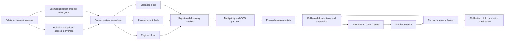

# Seasonax Investigation and Biopharma Seasonality Intelligence Build Docket

**Canonical deliverable:** this file is the source of truth for the investigation, clean-room product specification, system contracts, and build sequence.

**Execution status:** current build state and remaining-wave sequencing moved to
`research/BIOPHARMA_SEASONALITY_INTELLIGENCE_CLAUDE_CONTINUATION_HANDOFF_2026-08-06.md`.
This file remains the canonical competitor teardown, product/statistical
specification, and clean-room design record. Since this dossier's initial
foundation snapshot, the Calendar Clock backend and public workstation plus the
Neural Web shadow emitter/forward ledger have shipped; do not rebuild them.

**Investigation as of:** 2026-08-01. **Execution status refreshed:** 2026-08-06.

---

## Executive verdict

Seasonax is a useful descriptive seasonality workstation wrapped around a weak inference model. Its product is broader than its intelligence:

1. normalize repeated historical price paths;
2. select or discover a recurring date/event window;
3. summarize the historical occurrences;
4. scan instruments and rank the most attractive in-sample results;
5. let users compare, save, tag, export, upload, basket, and alert.

The interface is compact and workmanlike. The engine, based on everything observable in the product, public documentation, responses, and statistics, does not demonstrate the controls required to turn a seasonal pattern into a reliable probability forecast. A default 10-year pattern normally has about ten independent annual observations, yet it is presented with the visual confidence of a mature trading edge. Pattern Finder emits heavily overlapping windows. Screener ranking is driven overwhelmingly by in-sample return summaries. There are no visible selection-adjusted probabilities, confidence bands, point-in-time universe guarantees, true out-of-sample epochs, structural-break tests, transaction-cost gates, probability calibration, or biopharma knowledge.

The right objective is therefore **not a literal clone**. It is a clean-room, independently implemented product that preserves the useful workflow and replaces the statistical theater with three honest clocks:

- a **calendar clock** for repeated trading-calendar structure;
- an **event clock** for biopharma catalysts and revisions;
- a **regime clock** for market, biotech, liquidity, and issuer state.

Those clocks feed a source-provenanced probability engine, a context-only Neural Web lobe, and a shrink-only Prophet overlay. Seasonality begins as explanation and attention context. It earns any later influence only through forward evidence.

The moat is not the turquoise chart. The moat is a bitemporal issuer–program–trial–regulatory graph, selection-aware research, calibrated event-relative distributions, and a measurement loop that can tell when a pattern died.

---

## Scope, evidence, and clean-room boundary

### Investigation scope

The investigation used:

- Seasonax official marketing, feature, FAQ, pricing, terms, API, and tutorial pages;
- the public demo and public static JavaScript/CSS bundles;
- the user-supplied product screenshots;
- an authorized trial account to inspect visible product workflows and low-volume first-party responses;
- browser developer instrumentation limited to requests made by the visible application;
- no cookie, local-storage, session-token, or unrelated-account inspection;
- no uploads, writes, alerts, exports, basket mutations, or account changes;
- no attempts to access undocumented authorization boundaries or server internals.

### Confirmed versus inferred

This docket uses four evidence labels:

- **Confirmed — official:** Seasonax explicitly documents the behavior.
- **Confirmed — observed:** the authenticated or public product visibly performed it.
- **Strong inference:** an independently reproducible observation strongly constrains the likely method, but Seasonax has not documented the formula.
- **Target design:** our original implementation proposal, not a claim about Seasonax.

### Binding clean-room fence

Seasonax's [Terms and Conditions §4.2](https://www.seasonax.com/terms-and-conditions/) prohibit reverse development, duplication, and use of the product to create a separate application. Therefore:

- do not copy Seasonax source code, CSS, assets, text, icons, chart styling, watermarks, data, or proprietary formulas;
- do not call its private product endpoints from our product;
- do not train on or bulk-extract its outputs;
- do not represent a guessed proprietary rule as ours;
- do implement generic financial statistics from published methods and public behavior;
- do use original information architecture, contracts, tests, models, and visual language;
- do acquire public or separately licensed price, corporate-action, event, and reference data.

“Feature parity” means solving the same user jobs with independent code. It does not mean pixel duplication or formula appropriation.

---

## Product suite: complete observed map

### 1. Instrument seasonality workspace

**Job:** understand how an instrument historically behaved across a recurring calendar year and a selected subwindow.

Observed components:

- instrument name, ticker, type, and available history;
- full-year normalized seasonal curve, rebased near 100;
- selectable history through arbitrary date inputs and 5/10/15/25/40-year presets;
- drag-to-select a recurring start/end window;
- selected-window statistics and per-year occurrences;
- average return by weekday;
- average return by month;
- cumulative pattern-equity and annual occurrence views;
- annualized pattern-versus-rest comparison;
- current-date marker;
- shift calendar left/right;
- invert selected period;
- detrend;
- reset;
- a “COVID” visual exclusion;
- year filters;
- multi-series comparison;
- mode switching among Seasonality, Events, and Intra-Month.

Officially, the consumer web application uses adjusted end-of-day closes with splits and dividends incorporated. Intraday data is reserved for Bloomberg/Refinitiv integrations. See the [Seasonax FAQ](https://www.seasonax.com/faq/).

#### Year filters

Observed presets:

- bullish market years;
- bearish market years;
- even years;
- odd years;
- US presidential election years;
- post-election years;
- midterm years;
- pre-election years;
- individual manually selected years, with a three-year minimum.

These are user-selected historical cohorts, not learned market regimes.

#### Compare modes

The product supports:

- a single historical year;
- another recurring date range;
- another instrument;
- multiple colored comparison rows.

The [official comparison guide](https://www.seasonax.com/comparing-seasonal-market-patterns-instruments-timeframes/) notes that filters on the base series do not consistently apply to comparison series. That can make two apparently adjacent curves semantically incomparable.

#### Detrending

Seasonax describes detrending as removing the overarching start-to-end movement proportionally so the final point equals the starting point. See its [September weakness example](https://www.seasonax.com/september-stock-market-weakness-seasonal-analysis/). This is useful as a visual decomposition, but it is not benchmark residualization, factor neutralization, or an out-of-sample expected-return estimate.

#### COVID toggle

The authenticated product sends a separate visual flag that excludes 20 February through 20 April 2020 from the chart. It does not trigger the statistics request. Seasonax copy also says the exclusion is visual only. This is a legacy special case, not a general outlier or regime methodology.

### 2. Pattern Finder

**Job:** propose recurring windows without manually dragging the chart.

For NASDAQ 100 over the observed 10-year range, Pattern Finder returned exactly ten candidate windows. Many overlapped heavily—for example, multiple March-to-June and April-to-July windows occupying most of the same observations.

Each row showed:

- a small year-by-year positive/negative bar strip;
- start and end dates;
- historical occurrence returns;
- win ratio;
- annualized return.

No visible information explained:

- how start/end candidates are enumerated;
- the optimization target;
- overlap suppression;
- familywide multiplicity;
- in-sample versus out-of-sample performance;
- neighboring-window stability;
- whether the ten returned windows are diverse or simply the top ten correlated variants.

### 3. Seasonality Screener

**Job:** find the strongest historical window starting near a chosen date across a market or basket.

Inputs observed:

- market or universe;
- start date: now, tomorrow, +7, +14, or +30 days;
- examination period: 5, 10, 15, or 20 years;
- duration: 5–30, 31–60, or 61–90 calendar days;
- minimum win ratio in five-point increments;
- Long or Short ranking direction.

Output columns:

- rank;
- symbol and instrument;
- annualized return;
- average return;
- median return;
- pattern start/end;
- calendar days;
- maximum profit/loss;
- number of winners/trades;
- win ratio;
- standard deviation;
- Sharpe ratio.

The [official Screener page](https://www.seasonax.com/seasonality-screener/) describes the same core job. The public [Core API documentation](https://www.seasonax.com/seasonax-core-api-documentation/) additionally exposes Sortino, volatility, trading days, current streak, loser counts/profits, and related fields.

#### Universe tree

Observed groups included:

- personal baskets;
- commodities;
- currencies;
- DJIA, NASDAQ 100, S&P 500;
- CAC 40, DAX, HDAX, MDAX, TecDAX, FTSE 100, SMI, Euro Stoxx 50, STOXX 600;
- ASX 200, CSI 300, Hang Seng, Nikkei 225;
- eleven US sector groups;
- a larger set of European sectors;
- global, US, and European index groups.

Seasonax also markets “double screening”: first identify a seasonal sector, then screen its constituents. See the [official double-screening article](https://www.seasonax.com/new-double-screening-sp500/).

#### Short is mostly reverse ordering

The public FAQ and frontend tooltip state that the platform's calculations are long-side calculations. Choosing Short changes screener sorting; it does not transform all displayed metrics into a modeled short trade. That is an important semantic trap.

#### Empirical ranking clue

An independent regression on one 28-row Dow result table reconstructed the returned hidden score from only annualized, average, and median return with `R² ≈ 0.9999` and about `0.013` score RMSE. This is a strong clue—not a proprietary formula—that the ranking is essentially an in-sample return composite. Visible risk, sample-size, and robustness statistics were not needed to explain nearly all score variation.

We must not reproduce that exact fit. Our rank must instead be an original, declared utility that makes uncertainty, selection, OOS skill, liquidity, and stability load-bearing.

### 4. Event Studies

**Job:** align historical price paths around a recurring named event.

Observed workflow:

- choose an instrument;
- choose an event family;
- choose 3, 4, 5, 6, 7, 8, 9, 10, 15, 20, or 30 days around day zero;
- select history and years;
- optionally detrend;
- view an event-time curve indexed near 100;
- inspect each historical event occurrence with start/end prices, return, max rise, and max drop;
- select a subwindow to calculate statistics.

For the S&P 500 around the second day of a Fed meeting, the product returned 79 events over ten years and a simple -10 to +10 trading-day path. No visible control addressed same-day clustering, event contamination, abnormal returns, or release-time alignment.

Official background: [Event Studies overview](https://www.seasonax.com/how-you-can-benefit-from-event-studies/) and [feature introduction](https://www.seasonax.com/the-new-seasonax-feature-event-studies-how-do-events-affect-prices/).

#### Observed event catalogue

**Central banking**

- Fed meeting days, minutes, cuts, hikes, changes, and no-change decisions;
- Humphrey–Hawkins testimony;
- Bank of England, Bank of Japan, and ECB variants.

**Elections and politics**

- France first/second round;
- Germany, Italy, Japan, UK;
- US presidential and midterm elections;
- Chinese Communist Party Congress;
- US government shutdowns.

**Futures expiry**

- US 10-year note;
- WTI crude;
- DAX;
- Euro Bund;
- FTSE;
- Nikkei;
- S&P triple witching.

**Macroeconomic reports**

- Chicago PMI, construction spending, consumer confidence, CPI, Michigan sentiment;
- EIA, durable goods, existing/pending homes, factory orders, GDP, industrial production;
- jobless claims, payrolls, unemployment;
- ISM manufacturing and non-manufacturing;
- Philadelphia Fed, PPI, retail sales;
- non-US CPI and GDP families;
- Ifo, monetary aggregates, and ZEW.

**Treasury auctions**

- 4/13/26/52-week bills;
- 2/3/5/7/10/30-year securities.

**Calendar turns**

- turn/start/middle of month;
- first days of each month;
- turn/start/middle of quarter;
- first days of each quarter.

**Holidays and culture**

- New Year, Martin Luther King Day, India Republic Day, Chinese New Year;
- Western/Orthodox Easter;
- non-US and US/Canada Labor Days;
- Memorial Day, Eid, Yom Kippur, Columbus Day;
- Singles Day, Thanksgiving, Black Friday, Christmas, US Independence Day.

**Miscellaneous**

- major airline accidents;
- US recession starts/ends;
- Super Bowl and AFC/NFC events;
- moon and eclipse events.

The list is broad but generic. It contains almost none of the event ontology needed for biopharma.

### 5. Intra-Month

**Job:** view the average path through a generic calendar month.

Observed behavior:

- aggregate selected months and years onto day labels 0–31;
- show an indexed average curve;
- select a subwindow for statistics;
- apply history, year, month, and detrend controls.

No visible disclosure explains how shorter months, non-trading days, month-end anchoring, or mixed month lengths are aligned. Our implementation must expose these rules explicitly and offer both calendar-day and nth-trading-day clocks.

### 6. My Patterns and Calendar

**Job:** turn discovery into a personal monitoring workflow.

Observed capabilities:

- bookmark patterns;
- search;
- tag and filter;
- table and calendar views;
- bulk add/remove calendar;
- update examination range;
- export;
- delete;
- email notifications three days before start and end.

See the [official My Patterns page](https://www.seasonax.com/my-patterns/).

### 7. Baskets

**Job:** screen a personally defined universe.

Observed capabilities:

- create named baskets;
- add instruments from instrument navigation;
- open a basket directly in the Screener;
- use personal baskets as market/universe selectors.

Professional pricing advertises up to three personal baskets/portfolios.

### 8. Custom uploads

**Job:** apply the same seasonality machinery to a private historical series.

Observed workflow:

- enter asset name;
- select CSV;
- verify a preview and data consistency;
- confirm import;
- keep the asset private to the account.

The public format is semicolon-delimited `YYYY-MM-DD;price`. Our product should support an explicit schema, exchange/timezone/calendar, currency, adjustment state, missing-data report, provenance, and a validation-only dry run before storing anything.

### 9. APIs, embeds, and distribution

Seasonax also offers:

- a Core API for baskets and scans;
- broader B2B/market API work;
- public iframe widgets;
- Bloomberg integration;
- Refinitiv Eikon references;
- AlgoCloud daily seasonal signals;
- a newsletter, featured patterns, and paid Trade Compass reports.

Sources: [Core API](https://www.seasonax.com/seasonax-core-api-documentation/), [B2B](https://www.seasonax.com/b2b-seasonax-for-businesses/), [S&P 500 widget](https://www.seasonax.com/seasonalscreener-sp500/), [AlgoCloud](https://www.seasonax.com/algocloud/), and [Trade Compass](https://shop.seasonax.com/products/seasonax-trade-compass).

---

## Frontend and observable application architecture

### Stack fingerprint

The public and authenticated bundles expose a conventional legacy SPA stack:

- Vue 2.7.16;
- Vuex 3.6.2;
- Chart.js 2.9.4;
- Axios 0.21.4;
- Bootstrap 4.6.2;
- Moment.js;
- Popper;
- Webpack.

The authenticated JavaScript application bundle observed during this investigation was approximately 1.29 MB before browser transfer compression. No source map was publicly offered. Login and server shell behavior are consistent with a Laravel/PHP backend, but that is an inference rather than an official disclosure.

Public assets include the [demo](https://demo.seasonax.com/), [demo JavaScript bundle](https://demo.seasonax.com/js/demo.js?id=0a4f2e70c59c83194b5bd5a5ab322c5e), and [public CSS bundle](https://demo.seasonax.com/css/app.css?id=9b7e7b36db2a1a035b1a442811e2de3e).

### Client/server split

The visible client sends compact filter specifications and renders returned arrays/statistics. The calculation engines remain server-side. Public route strings include conceptual services for:

- asset metadata;
- seasonal chart;
- selected-window statistics;
- pattern discovery;
- screener configuration and results;
- event charts and statistics;
- intra-month charts and statistics;
- custom-asset prices;
- baskets, portfolio rows, calendar, tags, notifications, and export.

This tells us the correct product decomposition without revealing the server implementation:

```text
instrument reference
  ├── seasonal curve service
  ├── selected-window evidence service
  ├── pattern discovery service
  ├── event-time service
  ├── intra-month service
  └── personal workflow services
```

Our equivalent should preserve that service separation but use explicit versioned contracts, semantic field names, `asof`, provenance, uncertainty, and evidence tiers.

### Observed seasonal chart contract

Semantically, the chart request contains:

- asset ID;
- history start/end;
- selected years;
- calendar starting month;
- comparison definitions;
- detrend flag;
- COVID visual flag.

The response contains:

- 366 `MM-DD` labels;
- a normalized path;
- optional compare paths;
- history count/start/end/years;
- weekday averages;
- monthly averages.

The selected-window statistics request adds recurring pattern start/end. Its response contains:

- summary statistics;
- one record per historical occurrence;
- cumulative/equity curve;
- annual pattern-return bars;
- annualized pattern-versus-rest comparison.

### Observed statistic set

Fields included:

- average, median, and annualized return;
- annualized return outside the selected window;
- win ratio;
- standard deviation;
- winners/losers and their profits;
- pattern count;
- calendar and trading days;
- maximum profit/loss;
- total/average profit;
- current streak;
- year-by-year returns;
- Sharpe, Sortino, and volatility;
- a hidden rank score.

For NASDAQ 100 from 3 August to 11 September over 2016–2025, the product showed approximately:

- mean +2.02%;
- median +1.52%;
- 9 winners from 10 years;
- annualized +20.6%;
- standard deviation 3.2%;
- Sharpe 0.97;
- Sortino 1.58.

The correct inference unit is approximately ten annual occurrences, not the thousands of daily points used to draw the curve.

### Formula findings

**Confirmed or strongly evidenced:**

- win ratio is profitable occurrences divided by all occurrences;
- standard deviation is calculated from historical occurrence returns;
- “Short” keeps long-side values and reverses ranking;
- annualized return is consistent with calendar-day compounding:

```text
annualized = (1 + period_return) ** (365 / calendar_days) - 1
```

- one public sample's average return matched the geometric mean of the displayed yearly returns;
- public tooltips say Sharpe, Sortino, and volatility use daily returns of the cumulative-profit line;
- the normalized full-year curve is consistent with compounding an aggregate daily seasonal return path from a base near 100.

**Not disclosed:**

- exact Pattern Finder objective and grid;
- exact hidden rank formula and tie-breaking;
- risk-free rate;
- volatility annualization;
- missing-session/calendar interpolation;
- point-in-time constituent handling;
- futures roll construction;
- multiple-testing correction;
- outlier policy beyond manual warnings and the COVID visual switch.

### UI assessment

#### What works

- One instrument workspace supports several related questions.
- Mode switching between seasonality, events, and intra-month is compact.
- Drag selection makes recurring windows tangible.
- Dense tables suit expert desktop scanning.
- Tiny occurrence bars communicate consistency quickly.
- Save, calendar, basket, and export flows convert analysis into a repeatable workflow.

#### What feels old

- Dense Bootstrap-era toolbars lack information hierarchy.
- Ambiguous icon-only controls require hover help.
- A large Chart.js watermark competes with the data.
- Statistics appear as a wall rather than an evidence narrative.
- Mobile layouts compress instead of recompose.
- Comparisons can silently use inconsistent filters.
- Uncertainty and sample size are visually subordinate to return.
- Source, adjustment, timing, and freshness are absent from the primary view.
- Hard-coded COVID behavior substitutes for a general robustness tool.
- The SPA bundle and framework generation indicate accumulated frontend debt.

---

## Analytical red-team: why the core product is weak

### 1. The observation-count illusion

A ten-year recurring annual pattern has about ten independent annual realizations. The 366-point line is a visualization of average path shape, not 366 independent confirmations. A 9/10 win ratio has wide uncertainty and can change dramatically with one future year.

### 2. Massive undisclosed multiple testing

Search across:

- tens of thousands of instruments;
- many start days;
- many end days/horizons;
- several lookbacks;
- several filters;
- long/short orderings;
- event families;
- user-visible winner thresholds.

The reported maximum will look impressive under the null. No visible false-discovery or familywise correction pays for that search.

### 3. Overlapping winners masquerade as independent ideas

Pattern Finder returned many windows sharing most observations. Showing ten near-duplicates creates a false sense of breadth. Our discovery UI must cluster overlapping candidates into one pattern family and show the familywide testing budget.

### 4. In-sample return dominates rank

The empirical score reconstruction shows that mean/median/annualized return nearly explains the hidden screener score. That encourages the most flattering historical windows instead of the most stable future hypotheses.

### 5. No visible OOS epoch

Users cannot see:

- discovery period;
- model-freeze date;
- validation period;
- untouched holdout;
- forward outcomes after publication.

Without these, a “statistically backed” pattern can simply be a selected historical artifact.

### 6. Manual cohorts are not regimes

Bull/bear and election-year filters are useful exploratory slices. They are not point-in-time probabilistic regimes, and selecting a favorable cohort after inspecting results spends additional testing budget.

### 7. Event studies ignore event-study pathology

Visible outputs do not adjust for:

- event-induced variance;
- fat-tailed small-cap returns;
- same-day conference clusters;
- issuer clustering;
- overlapping catalysts;
- after-hours release timing;
- expected/abnormal returns;
- revisions to scheduled dates;
- matched controls.

### 8. Survivor and corporate-action ambiguity

Seasonax advertises large current universes but does not visibly disclose point-in-time membership, delisted names, mergers, failed companies, historical security mapping, or reproducible adjustment vintages. Those omissions are fatal in biopharma, where failure, dilution, acquisition, and ticker churn are structural.

### 9. Tradability is not modeled

The displayed edge ignores:

- bid/ask spread;
- market impact;
- next-bar execution;
- borrow;
- halts and gaps;
- liquidity collapse around binary events;
- options surface availability;
- capital constraints.

### 10. No probability calibration

A historical win ratio is not a calibrated conditional probability. There is no visible Brier score, log score, calibration slope, reliability curve, conformal coverage, or abstention policy.

### 11. No biopharma ontology

Generic holiday, election, and macro event families cannot reason about:

- PDUFA timing and date revisions;
- advisory committees;
- clinical phase, endpoint, indication, modality, comparator, and trial design;
- top-line versus conference presentation;
- filing acceptance versus regulatory outcome;
- cash runway, dilution, and financing windows;
- peer read-through;
- safety holds and label constraints;
- conference abstract embargoes;
- catalyst contamination.

### 12. AI claims are not evidenced by the product

Nothing visible requires machine learning. This is not a criticism of descriptive statistics; it is a boundary. We should not call our system intelligent because it owns more charts. Intelligence is earned by point-in-time synthesis, uncertainty, adaptation, abstention, and measured incremental value.

---

## Target product: Biopharma Cycle Intelligence

### Product stance

The new product should answer four questions in order:

1. **What recurring calendar or event-time pattern is visible?**
2. **How much of it survived honest selection and future data?**
3. **What biopharma and market conditions make this instance comparable—or not?**
4. **What may Neural Web or Prophet do with it?**

The public surface can feel faster and simpler than Seasonax while exposing more truth.

### System flow



---

## Clock 1: calendar seasonality

### Supported clocks

- day of year;
- ISO week;
- calendar month;
- weekday;
- nth trading day of month;
- turn of month;
- start/middle/end of quarter;
- holiday adjacency;
- option expiry;
- index rebalance;
- user-defined recurring windows.

Each named family owns a separate hypothesis namespace. A user-drawn window is `exploratory: true` and cannot inherit a validation badge from a nearby registered pattern.

### Canonical curve

For year `y`, convert adjusted prices to log returns and map them to a declared calendar. Rebase the cumulative path:

```text
path_y(0) = 100
path_y(t) = 100 * exp(sum(log_return_y[1:t]))
```

Aggregate path increments geometrically. Publish:

- median path;
- mean log-return path;
- 20–80% and 10–90% bands;
- current year;
- raw path;
- broad-market residual path;
- biotech-benchmark residual path;
- exact independent year count;
- missing-session and interpolation policy.

Never average raw price levels across years.

### Smooth discovery champion

Use a low-dimensional cyclic Fourier model:

```text
f(d) = sum[k=1..K](a_k sin(2πkd/252) + b_k cos(2πkd/252))
```

- freeze small `K`;
- ridge-shrink coefficients;
- tune chronologically;
- use the smooth model to propose a limited number of contiguous windows;
- freeze windows before validation.

A cyclic spline/GAM may challenge it under the identical epoch and budget.

### Exhaustive scanner

For every declared start `s` and horizon `h`, compute one residual window return per independent year:

```text
R*(issuer, year, s, h) = sum(price_return - PIT_trailing_beta × factor_return)
```

Required output:

- mean and median;
- positive-return probability;
- raw and residual mean;
- MFE, MAE, and max drawdown;
- 5/25/50/75/95% quantiles;
- year contributions;
- start/end perturbation stability;
- costs and spread assumptions;
- `n_years`, `n_events`, `n_issuers`, and date clusters;
- selection-adjusted probability;
- OOS epoch results.

Dense results may be explored visually. Only registered and corrected candidates receive an evidence tier.

---

## Clock 2: biopharma catalyst time

### Event ontology

#### Regulatory

- investigational submissions and clearances;
- NDA/BLA submissions and acceptances;
- filing classification;
- PDUFA date or range;
- priority/standard review;
- advisory-committee announcement, materials, and meeting;
- approval, complete response letter, resubmission;
- label expansion/restriction;
- postmarketing requirement;
- safety communication, hold, warning, withdrawal.

#### Clinical development

- trial start;
- first patient dosed;
- enrollment guidance/revision/completion;
- primary completion date/revision;
- database lock;
- top-line readout window and actual release;
- posted results;
- endpoint amendment;
- protocol amendment;
- DSMB review;
- trial pause/termination;
- phase transition.

#### Scientific conferences

- abstract submission and acceptance;
- title release;
- abstract release;
- late-breaker status;
- presentation day/time;
- embargo and publication;
- conference cohort and indication track.

#### Corporate and financing

- earnings and R&D day;
- pipeline guidance change;
- partnership/license;
- acquisition process;
- equity/debt/ATM financing;
- warrant exercise;
- cash-runway threshold;
- patent/exclusivity milestone;
- commercial launch and sales milestone.

### Event windows

Keep phases separate:

- anticipation: `[-60,-21]`, `[-20,-6]`, `[-5,-1]`;
- immediate reaction: `[0,+1]`, `[0,+5]`;
- post-event drift: `[+2,+20]`, `[+6,+60]`.

Day zero is timestamp-aware:

- before market open → same session may be affected;
- during market hours → use the first executable bar after publication;
- after market close → next session is day zero;
- unknown time → interval-censor and abstain from same-day causal attribution.

### Event-study statistics

Estimate abnormal returns from point-in-time trailing exposures. Support:

- AR/CAR distributions;
- BMP standardized cross-sectional test;
- Corrado/generalized rank test;
- issuer clustering;
- event-date/conference clustering;
- synchronized cluster bootstrap;
- event contamination flags;
- matched controls by size, liquidity, stage, indication, modality, and regime;
- placebo dates and negative-control event families.

Primary references: [MacKinlay](https://econpapers.repec.org/article/aeajeclit/v_3a35_3ay_3a1997_3ai_3ap_3a13-39.htm), [Boehmer–Musumeci–Poulsen](https://ink.library.smu.edu.sg/lkcsb_research/4666/), and [Corrado](https://doi.org/10.1016/0304-405X(89)90064-0).

Event-time association is not automatically causal. The UI must say “historically associated” unless a stronger design supports a causal claim.

---

## Clock 3: regime conditioning

Use a small pre-registered state vector, expressed as probabilities rather than brittle labels.

### Broad market

- trend and drawdown;
- volatility state;
- breadth and dispersion;
- rates and liquidity;
- credit stress;
- equity financing conditions.

### Biotech tape

- XBI/IBB trend and relative strength;
- small versus large biotech;
- biotech breadth;
- cross-sectional dispersion;
- follow-on issuance activity;
- clinical-event gap behavior;
- risk appetite for pre-revenue issuers.

### Issuer

- market cap and liquidity;
- cash runway;
- burn and financing pressure;
- short interest and borrow where licensed;
- options-implied event geometry where licensed;
- clinical stage and pipeline concentration;
- event proximity and date precision.

Calendar × regime and event × stage interactions require strong hierarchy and shrinkage toward zero. Do not build a combinatorial filter factory.

---

## Point-in-time biopharma graph

### Entity graph

```text
issuer → security
issuer → program → indication
program → trial → endpoint
program → regulatory application
issuer/program/trial/application → event revisions
```

### Required event contract

```text
schema, event_id, issuer_id, program_id, nct_id, application_id
event_type, stage, indication, endpoint_type
scheduled_start, scheduled_end, actual_at
date_precision, certainty, status
published_at, ingested_at, effective_at, known_at
source_class, source_url, source_hash
extraction_model_version, evidence_span
```

`effective_at` says when the underlying fact applies. `known_at` says when our system could have known it. Never overwrite history with the latest revised date.

### Source plan and cadence

| Source | What it supplies | Cadence | Point-in-time rule |
|---|---|---:|---|
| Licensed adjusted EOD prices | prices, volumes, actions | daily after close | snapshot vendor cutoff and adjustment version |
| Security master | issuer/security/ticker/exchange history | daily + event-driven | effective-dated mappings; never join by current ticker alone |
| Index/ETF memberships | universes and peers | each official change | preserve announcement and effective dates |
| ClinicalTrials.gov | trials, dates, status, endpoints | weekday daily snapshot | retain every revision and API dataset timestamp |
| SEC EDGAR | filings, XBRL, financing, guidance | intraday + nightly bulk | `known_at` no earlier than accepted/ingested time |
| Drugs@FDA | application/action history | weekday mornings | actions are historical facts; inferred PDUFA remains separate |
| FDA calendars/notices | meetings, materials, safety | monitored intraday/daily | preserve publish time and source document hash |
| Company IR/press releases | catalyst guidance and actuals | monitored intraday | source span required; issuer claim stays issuer claim |
| Conference sources | deadlines, abstracts, sessions | daily near event | distinguish scheduled, embargoed, and public timestamps |
| FAERS/openFDA | safety-attention context | quarterly | descriptive only; never causal incidence |

Official source guidance:

- [ClinicalTrials.gov API](https://clinicaltrials.gov/data-about-studies/learn-about-api)
- [SEC EDGAR APIs](https://www.sec.gov/search-filings/edgar-application-programming-interfaces)
- [Drugs@FDA data files](https://www.fda.gov/drugs/drug-approvals-and-databases/drugsfda-data-files)
- [FDA Priority Review](https://www.fda.gov/patients/fast-track-breakthrough-therapy-accelerated-approval-priority-review/priority-review)
- [openFDA FAERS limitations](https://open.fda.gov/apis/drug/event/)

Priority review's six-month and standard review's ten-month goals are not guaranteed dates. Store inferred regulatory ranges separately from company-disclosed exact dates.

### Qualitative extraction

An LLM may propose structured fields only when it returns:

- source URL and hash;
- exact evidence span;
- extraction model/version;
- field-level certainty;
- conflicts with deterministic parsers or other sources.

Unknown is valid. Parser disagreement excludes the field from modeling rather than resolving it by confidence theater.

---

## Pattern selection, multiplicity, and research governance

### Trial families

Every generated configuration is logged before evaluation through the existing `TrialLedger`. A family includes every candidate competing for the same headline:

```text
assets × start windows × horizons × directions × lookbacks × filters × regimes
```

Do not create one convenient testing family per winning ticker.

### Dense overlapping scans

Use synchronized circular calendar shifts or stationary/block bootstrap:

1. generate a joint null sample preserving dependence;
2. recompute the complete candidate scan;
3. record the maximum statistic in each resample;
4. compare every observed statistic with the null distribution of maxima.

This yields Westfall–Young-style `maxT` familywise values.

### Registered finite panels

Use Benjamini–Yekutieli for a small, pre-registered panel under arbitrary dependence. Ordinary BH may be a sensitivity result but cannot be the only protection for overlapping windows. References: [Benjamini–Hochberg](https://www.dcscience.net/Benjamini-Hochberg-1995-FDR.pdf) and [Benjamini–Yekutieli](https://doi.org/10.1214/aos/1013699998).

### Strategy-family superiority

Use White's Reality Check or Hansen's SPA against explicit baselines. These address the fact that the published strategy was selected from many alternatives. References: [White](https://doi.org/10.1111/1468-0262.00152), [Hansen](https://papers.ssrn.com/sol3/papers.cfm?abstract_id=264569), and [Sullivan–Timmermann–White](https://eprints.lse.ac.uk/119144/1/dp303.pdf).

### Tradable simulations

Retain the repo's Deflated Sharpe and Probability of Backtest Overfitting gates. DSR is not a substitute for FDR, OOS skill, or calibration. Reference: [Bailey and López de Prado](https://papers.ssrn.com/sol3/Delivery.cfm/SSRN_ID2460551_code87814.pdf?abstractid=2460551).

### Discovery cadence

- discovery: quarterly or an explicit registered experiment batch;
- model freeze: immediately after the registered build epoch;
- daily operation: frozen scoring only;
- emergency rebuild: source/schema break, not poor recent performance;
- holdout opening: closes the model epoch and requires a new version.

Daily rescanning cannot spend a fresh testing budget and then pretend it is the same validated model.

---

## OOS and robustness gauntlet

### Core protocol

- expanding chronological walk-forward;
- split by years or event-date blocks;
- purge/embargo at least the maximum forward horizon;
- keep adjacent overlapping labels together;
- final untouched holdout;
- issuer holdout;
- therapeutic-cluster holdout;
- leave-one-era and leave-one-regime stress;
- include delisted, acquired, failed, and bankrupt names;
- point-in-time memberships, market cap, and corporate actions;
- next-bar execution;
- net costs, spread, and liquidity feasibility;
- start/end perturbation ±2 and ±5 trading days;
- alternative benchmark and adjustment-source sensitivity;
- reject one-year, one-ticker, and one-conference-cluster dependence.

### Starting shadow gates

These are pre-registration proposals, not retroactively optimized thresholds:

| Gate | Calendar | Event cohort |
|---|---:|---:|
| Independent evidence | ≥12 years | ≥50 events |
| Breadth | disclose issuers | ≥20 issuers |
| Date clusters | ≥12 | ≥20 |
| Selection adjustment | `p_maxT ≤ .05` or registered `q_BY ≤ .10` | same |
| Family superiority | SPA/Reality Check passes | same |
| Chronological OOS | positive skill/economics | positive skill/economics |
| Stability | no major-fold sign reversal | no major-fold sign reversal |
| Perturbation | survives neighboring windows | survives timing/benchmark perturbation |
| Simulation only | `DSR ≥ .95`, `PBO ≤ .25` | `DSR ≥ .95`, `PBO ≤ .25` |

Passing these makes a pattern a promotion candidate. It does not automatically grant Neural Web scoring or Prophet authority.

---

## Probability and uncertainty engine

### Three different probabilities

Never collapse these into one “success probability”:

1. `P(event occurs within horizon)` — scheduling/hazard;
2. `P(event outcome class)` — clinical/regulatory evidence;
3. `P(market outcome | information known now)` — return/distribution model.

### Forecast targets

- `P(excess return > 0)` at 5/10/20/40/60 trading days;
- `P(up barrier before down barrier)`;
- `P(drawdown exceeds threshold)`;
- return quantiles;
- expected shortfall;
- expected net return versus matched baseline.

### Model stack

**Champion:** hierarchical logistic/distributional regression with cyclic Fourier terms, peer partial pooling, and pre-specified strong-hierarchy interactions.

**Challenger:** gradient-boosted or analogue retrieval model evaluated under the same epoch, universe, labels, and costs.

**Event occurrence:** discrete-time survival/hazard model.

Single-name estimates shrink toward stage × indication × modality peers. Sparse single-name “80% win” displays are forbidden.

### Calibration

Calibrate only on prior OOS predictions:

- logistic/Platt recalibration for modest samples;
- isotonic only with genuinely large calibration data;
- Brier and log score for binary targets;
- CRPS for distributions;
- slope/intercept and reliability plots;
- rolling/adaptive conformal coverage as uncertainty, not alpha.

References: [Gneiting and Raftery](https://sites.stat.washington.edu/people/raftery/Research/PDF/Gneiting2007jasa.pdf), [Niculescu-Mizil and Caruana](https://icml.cc/Conferences/2005/proceedings/papers/079_GoodProbabilities_NiculescuMizilCaruana.pdf), and [Gibbs and Candès](https://papers.neurips.cc/paper_files/paper/2021/hash/0d441de75945e5acbc865406fc9a2559-Abstract.html).

### Required forecast disclosure

- probability and baseline probability;
- incremental edge;
- 90% interval;
- return quantiles;
- effective independent sample;
- issuer/date-cluster counts;
- regime coverage and extrapolation;
- data quality and staleness;
- abstention reason;
- model, hypothesis, and data snapshot hashes.

---

## Neural Web integration

### Birth authority

Seasonality enters Neural Web at `shadow`, `is_context_only: true`.

It may:

- explain a calendar/event/regime state;
- flag attention;
- surface contradictions;
- route unstable hypotheses to Research Factory.

It may not:

- originate a candidate;
- rank;
- gate;
- size;
- rewrite Prophet geometry;
- boost confidence;
- silently fuse with another score.

### State contract

```json
{
  "schema": "neuralweb.biopharma_seasonality_state.v1",
  "artifact_id": "biopharma-seasonality-state",
  "entity": {"type": "issuer", "id": "issuer:123", "ticker": "XYZ"},
  "asof": "2026-08-01",
  "available_at": "2026-08-01T21:30:00Z",
  "expires_at": "2026-08-02T21:30:00Z",
  "tier": "shadow",
  "is_context_only": true,
  "clock": {
    "type": "event",
    "phase": "pre_event_20d",
    "pattern_id": "pat_...",
    "event_id": "evt_..."
  },
  "forecast": {
    "target": "excess_return_gt_0",
    "horizon_td": 20,
    "p": 0.58,
    "p_baseline": 0.51,
    "edge": 0.07,
    "ci90": [0.48, 0.65],
    "quantiles": {"q05": -0.14, "q50": 0.02, "q95": 0.21}
  },
  "evidence": {
    "n_independent": 74,
    "n_issuers": 31,
    "n_date_clusters": 48,
    "q_by": 0.07,
    "p_max_t": null,
    "spa_p": 0.03,
    "oos_brier_skill": 0.06,
    "live_n": 18
  },
  "uncertainty": {
    "abstain": false,
    "flags": ["forward_sample_thin"]
  },
  "authority": {
    "may_explain": true,
    "may_flag_attention": true,
    "may_deescalate": false,
    "may_rank": false,
    "may_gate": false,
    "may_size": false,
    "may_originate": false,
    "may_rewrite_geometry": false,
    "may_boost_confidence": false
  },
  "provenance": {
    "model_version": "seasonality-2026q3",
    "pattern_spec_hash": "sha256:...",
    "data_snapshot": "sha256:..."
  }
}
```

### Neural Web behaviors

- add catalyst timing and seasonal state to entity context;
- explain agreement and contradiction;
- emit `calendar_tailwind_vs_event_hazard` conflicts;
- distinguish duplicate momentum/sector information through the covariance spine;
- keep confluence display-only until separately gauntleted;
- expire stale states instead of carrying them forward;
- write forward outcomes for every shown forecast.

---

## Prophet integration

### Initial overlay

```text
schema = prophet.seasonality_overlay/v1
plan_id
seasonality_state_ref
horizon_match
event_inside_plan_horizon
overlap_with_existing_features
action = NONE | NARRATE | ATTEND | CAP_CONFIDENCE
reason_codes
expires_at
```

### Binding rules

- seasonality cannot create a Prophet plan;
- cannot alter trigger, target, invalidation, or horizon;
- cannot boost rank or confidence;
- cannot add historical win rate to Prophet confidence;
- positive context is narrative/attention only;
- adverse binary-event context may become a bounded confidence cap only after a separate de-escalation gauntlet;
- the cap is shrink-only;
- the overlay version is stored in Prophet's outcome ledger.

Later integration requires a cross-fitted meta-model trained only on historical Prophet candidates. The comparison is Prophet + seasonality versus Prophet alone under identical candidates and epochs. If incremental skill is absent, the overlay remains narrative.

---

## Original user experience

The repo's design doctrine requires glance → hover → study progression and bilingual parity. The unavailable `frontend-design:frontend-design` skill is required before changing the user-facing template, so this tranche ships a design-ready specification and public methodology endpoint, not an improvised UI.

### Navigation stance

Do not call the product “Seasonax clone.” Proposed user-facing name:

**Biopharma Cycle Intelligence**

Submodes:

- Calendar;
- Catalysts;
- Regimes;
- Screener;
- Investigations;
- Portfolio Event Map.

### Glance layer

One sentence answers the current question:

> Historical calendar tailwind, but the upcoming binary catalyst dominates; forward evidence is thin.

Five chips maximum:

- clock/phase;
- calibrated probability versus baseline;
- independent sample;
- OOS tier;
- freshness/abstention.

### Hover layer

- definitions;
- why a state exists;
- exact sample unit;
- raw versus adjusted result;
- source and freshness;
- why authority is limited.

### Study layer

- full distribution and uncertainty bands;
- occurrence table;
- in-sample/OOS toggle;
- stability heatmap;
- selection family and adjusted probability;
- event timeline and contamination;
- regime cohorts;
- matched controls;
- provenance and model card;
- saved investigation notes.

### Desktop workspace

```text
┌──────────────── Entity / search / as-of / freshness ────────────────┐
│ Verdict                         Evidence tier       Authority         │
├───────────────┬───────────────────────────────┬──────────────────────┤
│ Mode + clock  │ Main distribution/chart       │ Catalyst timeline    │
│ Calendar      │ Median + bands + current       │ dates + revisions    │
│ Catalysts     │ Raw / residual / OOS           │ contamination        │
│ Regimes       │ Drag = exploratory             │ provenance           │
├───────────────┴───────────────────────────────┴──────────────────────┤
│ Return distribution │ Stability │ Regime cohorts │ Forward scorecard   │
├──────────────────────────────────────────────────────────────────────┤
│ Occurrences / matched controls / saved investigation                │
└──────────────────────────────────────────────────────────────────────┘
```

### Mobile behavior

Recompose; do not squeeze:

1. verdict and five chips;
2. main chart;
3. catalyst timeline;
4. evidence drawer;
5. occurrence cards;
6. advanced comparator and provenance.

The desktop table becomes cards with return, sample, interval, OOS state, and catalyst collision. No horizontal 16-column table is required for the core job.

### Controls that improve on Seasonax

- Raw / detrended / beta-neutral / sector-neutral;
- In-sample / OOS / forward-live;
- median / mean / current year;
- 20–80 / 10–90 bands;
- calendar day / nth trading day;
- visible exploration badge for dragged windows;
- universal outlier/stress controls, not a COVID-specific switch;
- consistent filters across compare series;
- overlap-clustered Pattern Families rather than ten duplicates;
- visible selection budget and adjusted significance;
- catalyst and regime chips attached to the chart;
- explicit data cutoff and source panel;
- “why abstained” as a first-class result.

---

## Repo-native architecture

### Reuse; do not rebuild

The repo already owns:

- `engine/factor_seasonality.py` — Ken French monthly factor climate, display-only;
- `engine/technicals.py` — per-instrument monthly averages, hit rate, and count;
- `engine/strategy_lab.py` — point-in-time prior-five-year same-month cross-sectional logic;
- `engine/event_window.py` — forward/event-window measurement, Newey–West inference, era splits, and sign stability;
- `engine/validation.py` — purged folds, CPCV/PBO, DSR, calibration, forecast scores, and related honesty primitives;
- `engine/trial_ledger.py` — append-only multiple-testing memory;
- `engine/cycle_pattern/` — Cycle Intelligence discovery, registry, outcomes, live clocks, and research-factory seams;
- `engine/neuralweb/envelope.py` — sibling provenance envelope;
- `engine/neuralweb/constitution.py` — authority law;
- `engine/neuralweb/covariance_spine.py` — overlap awareness;
- Prophet plan and outcome ledgers.

The new package must extend these; it must not create a parallel validation constitution or overwrite the existing factor seasonality page.

The monthly-seasonality calculation inside `scripts/build_ticker_pages.py` sums daily percentages rather than compounding them. It is a legacy display helper and must not become the canonical engine.

### Exact future integration seams

- Market-level context already reads factor seasonal climate through `engine/neuralweb/world_state.py`; keep instrument seasonality separate from that market climate.
- Per-ticker Neural Web projection belongs in the compact `candidate_context` built by `engine/neuralweb/mastermind_context.py`, with `allowed_behavior: annotate_only`. The bridge is size-capped and seasonality must remain a sparse map; it never creates candidates.
- A read-only Neural Web tool should follow the clinical-context precedent in `engine/neuralweb/ask_brain.py` and `engine/neuralweb/cortex.py`.
- Prophet enrichment belongs after candidate selection in `engine/prophet_bridge.py`, next to existing context enrichments. It must not touch `_conviction_score`, candidate order, geometry, or management state.
- `scripts/build_prophet.py` uses an explicit public-field whitelist; a later overlay must be added deliberately and snapshotted at plan origination.
- `engine/prophet_management.py` remains unchanged until a de-escalation experiment passes.

### Existing biopharma seams and present limitations

- `collectors/clinicaltrials.py` has ticker-level Phase 3 start/halt events.
- `collectors/openfda.py` has approval and label-expansion events.
- `collectors/clinicaltrials_themes.py` and `engine/theme_clinical.py` provide theme/modality context.
- `config/clinical_modalities.yml` owns nine existing modality families.

These sources can seed a pilot, but they do not yet satisfy the target bitemporal graph. The theme collector keeps one row per `(modality_id, nct_id)`, so historical phase transitions are not point-in-time. The repo also lacks a dependable forward PDUFA/advisory-committee calendar; `engine/event_landmine.py` explicitly excludes one. Until the new revision store exists, event conditioning is limited to known-at-the-time ClinicalTrials events, observed Phase 3 starts/halts, openFDA approvals/label changes, and earnings.

### Workflow correction to schedule with Lane 2

The current engine-render workflow builds world state before rebuilding factor seasonality, which can project stale seasonal climate. When the instrument engine is wired, reorder the seasonality build ahead of world state, Mastermind context, and Prophet projection, then add a workflow-order regression test. Do not change that workflow in this foundation-only tranche.

### Proposed artifacts

```text
data/biopharma/security_master.parquet
data/biopharma/program_graph.parquet
data/biopharma/events.jsonl
data/seasonality/hypotheses.jsonl
data/seasonality/patterns.parquet
data/seasonality/forecasts.jsonl
data/seasonality/outcomes.parquet
data/seasonality/calibration.json
data/neuralweb/biopharma_seasonality_state.json
site/seasonalitydata/methodology.json
site/seasonalitydata/index.json
site/seasonalitydata/entities/<ID>.json
```

### Proposed modules

```text
engine/seasonality/contracts.py
engine/seasonality/calendar.py
engine/seasonality/event_clock.py
engine/seasonality/scanner.py
engine/seasonality/multiplicity.py
engine/seasonality/event_study.py
engine/seasonality/model.py
engine/seasonality/calibration.py
engine/seasonality/state.py
```

### Proposed API

```text
GET  /api/seasonality/v1/entities/{id}/curve?asof=...
POST /api/seasonality/v1/screen
GET  /api/seasonality/v1/patterns/{pattern_id}
GET  /api/seasonality/v1/patterns/{pattern_id}/methodology
GET  /api/biopharma/v1/entities/{id}/events?asof=...
GET  /api/seasonality/v1/state/{id}?asof=...
```

Research endpoints accept or require `asof`. Production caches are keyed by data snapshot, model version, entity, and query contract.

---

## Implemented in the foundation tranche

This investigation shipped the first non-visual slice:

### `engine/seasonality/contracts.py`

- validates bitemporal biopharma events;
- prevents `known_at` from preceding ingestion;
- accepts future effective catalyst dates without leakage;
- builds and validates expiring Neural Web state;
- recomputes probability edge consistency;
- hard-codes context-only authority;
- builds a Prophet overlay that cannot originate, rank, size, rewrite geometry, or boost confidence;
- permits a future confidence cap only for adverse events after a separately passed de-escalation gate.

### `engine/seasonality/multiplicity.py`

- Benjamini–Yekutieli adjusted values for dependent registered panels;
- joint maxT familywise values from a caller-supplied dependency-preserving null matrix;
- finite-sample `(+1)/(B+1)` correction;
- fail-closed validation for malformed/empty/non-finite inputs.

### Public methodology manifest

`site/seasonalitydata/methodology.json` truthfully exposes:

- foundation status;
- no live forecast/screener/event-graph claim;
- clean-room policy;
- three clocks;
- selection/OOS/calibration requirements;
- Neural Web/Prophet authority ceiling;
- versioned contract identifiers.

### Tests

The foundation test suite covers temporal leakage, authority boundaries, probability consistency, shrink-only Prophet behavior, BY correction, maxT correction, and deterministic public output.

---

## Build docket

> **Program status — 2026-08-01.** Lane 0 implemented and live. Lanes 1, 2 and
> the selection-correction slice of Lane 4 are **in build**; their pinned design
> and artifact contract live in
> `research/STOCK_SEASONALITY_LANE2_DESIGN_SPEC.md`, whose §12–§13 record what
> real-data probes and a built mockup changed before those lanes shipped. Lane 3
> is **not ours to build** — the boundary with the BioCatalyst program that owns
> it is pinned in `research/SEASONALITY_BIOCATALYST_INTEGRATION_SEAM.md`, and the
> event clock is blocked on that program publishing a real (non-fixture)
> catalyst artifact. Two corrections this docket's own text needs, both from
> measurement rather than argument:
>
> - **the family null is an *independent* circular year-shift, not a
>   synchronized one** (this docket's §"Dense overlapping scans" says
>   "synchronized"). A synchronized shift relocates a real seasonal effect
>   instead of removing it, so the null maximum inherits the structure the test
>   exists to price. Dependence *between hypotheses* is preserved the way
>   Westfall–Young requires by recomputing the whole grid inside each resample.
> - **no election-year, presidential-cycle, or bull/bear cohort filters**, which
>   the incumbent ships as year-filter presets. `research/DO_NOT_REBUILD.md`
>   carries `Election / midterm cycle as standalone signal — REFUTED`, and a
>   cohort chosen after seeing the chart spends testing budget the family
>   accounting cannot see.

### Lane 0 — Clean-room and contract foundation — **implemented**

Deliverables:

- canonical investigation/build docket;
- bitemporal event validator;
- Neural Web state contract;
- Prophet overlay firewall;
- BY and maxT primitives;
- public claim-bounded methodology manifest;
- registry entry and tests.

Acceptance:

- no copied code/assets/data;
- no forecast claim;
- all authority booleans fail closed;
- deterministic tests pass;
- public manifest is live.

### Lane 1 — Point-in-time price and universe spine

Deliverables:

- canonical issuer/security identifiers;
- adjusted EOD history with corporate-action version;
- delisted/acquired/failed names;
- historical XBI/IBB and pilot biopharma universe membership;
- exchange calendars/timezones;
- benchmark and liquidity fields;
- daily snapshot hashes.

Acceptance:

- no current-ticker join for history;
- constituent lookup reproducible at any `asof`;
- split/dividend audit fixtures;
- delisted-name sample present;
- null/missing sessions explicit;
- source license and cutoff documented.

### Lane 2 — Truthful calendar explorer

Deliverables:

- canonical curves and bands;
- current-year overlay;
- weekday/month/nth-session/TOM views;
- raw/detrended/market-neutral/biotech-neutral;
- selected-window occurrence stats;
- fixed-window scanner;
- overlap clustering;
- XBI/IBB and pilot universe;
- original bilingual UI after design-skill pass.

Acceptance:

- independent `n_years` beside every headline;
- dragged windows labeled exploratory;
- no score/rank path;
- visual/result fixtures cover leap years and missing sessions;
- mobile recomposes;
- EN/ZH parity;
- selection controls visible.

### Lane 3 — Biopharma catalyst graph

Deliverables:

- ClinicalTrials.gov daily revision snapshots;
- SEC filing and financing events;
- FDA action/calendar sources;
- company IR ingestion;
- program/trial/application graph;
- date precision and interval censoring;
- event timeline UI;
- contamination detector.

Acceptance:

- every mutable row has `effective_at` and `known_at`;
- source hash/span present;
- revisions append, never overwrite;
- after-hours day-zero tests;
- unresolved entity or date conflict abstains;
- no causal wording by default.

### Lane 4 — Event-study and selection engine

Deliverables:

- AR/CAR;
- BMP and rank tests;
- issuer/date clustering;
- matched controls;
- synchronized nulls;
- TrialLedger families;
- BY/maxT;
- SPA/Reality Check;
- OOS and perturbation reports.

Acceptance:

- null simulations meet nominal error rates;
- family budget includes discarded candidates;
- same-conference events cluster together;
- next-bar execution and costs;
- no evidence tier without registered/OOS results;
- failure cases remain visible.

### Lane 5 — Calibrated probability engine

Deliverables:

- calendar and event champions;
- hazard model;
- hierarchical peer pooling;
- regime conditioning;
- return distribution targets;
- abstention;
- forward calibration ledger;
- drift/retirement.

Acceptance:

- probability, baseline, edge, interval, and sample disclosed;
- calibration uses prior OOS predictions only;
- champion beats baseline in chronological OOS;
- issuer/therapeutic holdout results positive;
- no unsupported interaction survives shrinkage;
- stale/extrapolative cases abstain.

### Lane 6 — Neural Web shadow lobe

Deliverables:

- synapse registration;
- envelope-stamped compact state;
- entity-context reader;
- contradiction hooks;
- covariance overlap;
- freshness/health;
- forward outcomes.

Acceptance:

- no origin/rank/gate/size path;
- context expires;
- duplicate momentum information discounted;
- `calendar_tailwind_vs_event_hazard` visible;
- absent data fails open with a structured gap;
- state stays bounded and explainable.

### Lane 7 — Prophet overlay

Deliverables:

- plan-referenced narrative/attention overlay;
- horizon and catalyst collision;
- overlap flags;
- outcome-ledger versioning;
- separately registered adverse confidence-cap experiment.

Acceptance:

- positive seasonality never boosts rank/confidence;
- no plan origination or geometry mutation;
- cap unavailable before de-escalation gate;
- cross-fitted comparison uses Prophet candidates only;
- incremental attribution reported against Prophet alone.

### Lane 8 — Advanced product frontier

Deliverables:

- catalyst-delay hazard;
- conference cohort engine;
- clinical/market analogue retrieval;
- custom baskets/uploads;
- portfolio event clustering;
- options-implied event geometry;
- enterprise API and alerting;
- live forward scorecards.

Acceptance:

- no feature receives authority by proximity;
- licensed data boundaries enforced;
- portfolio overlap is covariance-aware;
- alert precision/recall measured;
- stale or drifting patterns retire automatically.

---

## Already covered / excluded fence

### Already covered; integrate instead of rebuilding

- factor seasonality page and Ken French climate;
- generic validation/PBO/DSR/calibration primitives;
- TrialLedger;
- Cycle Intelligence registry/outcomes/live mechanics;
- Neural Web envelope and constitution;
- covariance spine;
- Prophet plan origination and measurement ledgers;
- general macro, factor, breadth, and regime context already present in the repo.

### Explicitly excluded from this foundation

- a pixel clone of Seasonax;
- copied Seasonax frontend/backend/data/formulas;
- private Seasonax API dependency;
- live forecasts before a point-in-time data graph;
- placeholder/synthetic market claims;
- scraped bulk Seasonax results;
- intraday seasonality without a licensed intraday feed;
- causal claims from ordinary event studies;
- positive seasonality rank/confidence boost;
- UI edits without the required frontend-design workflow;
- merging this work into the existing factor seasonality score path.

### Kill conditions

Stop or demote a pattern/model when:

- source licensing/provenance is unresolved;
- point-in-time reconstruction fails;
- selection-adjusted significance fails;
- OOS sign reverses;
- effect depends on one issuer/year/cluster;
- net economics fail;
- calibration skill is non-positive;
- coverage/drift breaches persist;
- a supposed independent feature duplicates existing Prophet inputs;
- the model cannot explain its abstention/uncertainty state.

---

## Official Seasonax source index

- [Terms and Conditions](https://www.seasonax.com/terms-and-conditions/)
- [Pricing](https://www.seasonax.com/pricing/)
- [FAQ](https://www.seasonax.com/faq/)
- [Seasonality Screener](https://www.seasonax.com/seasonality-screener/)
- [Core API documentation](https://www.seasonax.com/seasonax-core-api-documentation/)
- [Event Studies overview](https://www.seasonax.com/how-you-can-benefit-from-event-studies/)
- [Event Studies introduction](https://www.seasonax.com/the-new-seasonax-feature-event-studies-how-do-events-affect-prices/)
- [Compare guide](https://www.seasonax.com/comparing-seasonal-market-patterns-instruments-timeframes/)
- [My Patterns](https://www.seasonax.com/my-patterns/)
- [Double screening](https://www.seasonax.com/new-double-screening-sp500/)
- [Pattern quality guide](https://www.seasonax.com/7-tips-to-recognize-the-best-seasonal-patterns/)
- [Commodity continuous-history guide](https://www.seasonax.com/how-to-trade-commodities-optimally-with-seasonax/)
- [B2B](https://www.seasonax.com/b2b-seasonax-for-businesses/)
- [S&P 500 widget](https://www.seasonax.com/seasonalscreener-sp500/)
- [AlgoCloud](https://www.seasonax.com/algocloud/)

---

## Final adjudication

Seasonax's core is straightforward enough to reproduce independently: normalized recurring paths, selected-window statistics, pattern scans, event-time alignment, comparison, personal workflows, and APIs. Its weakness is the leap from descriptive recurrence to implied predictability.

Our edge should be the opposite:

- fewer but globally accounted hypotheses;
- explicit independent sample sizes;
- point-in-time universes and catalysts;
- bitemporal revisions;
- biopharma event ontology;
- residual and matched-control returns;
- dependency-aware selection correction;
- chronological OOS and forward measurement;
- calibrated distributions and abstention;
- context-only Neural Web integration at birth;
- shrink-only Prophet integration after evidence;
- a modern UI that puts the answer first and the proof one interaction away.

Build the familiar explorer because it is useful. Do not confuse it with the intelligence. The intelligence begins where Seasonax currently stops: knowing whether this historical pattern is comparable to the issuer, catalyst, regime, and information set that exist now—and being willing to say “we do not know.”
