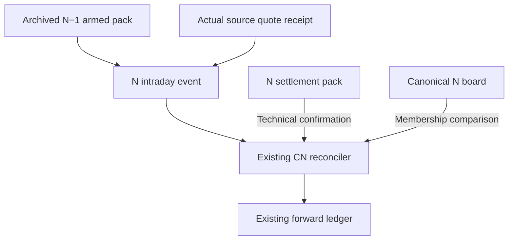

# China Prophet: complete implementation handoff after deeper research

**Version 2 · 10 October 2026 UTC · bounded research result for the existing implementation owners.**

```text
FINALIZATION_CLASSIFICATION: PROVEN_OUTCOME — the requested research/problem-solving scope
RESEARCH_MISSION_COMPLETE: true, subject to the final manifest and remote readback
IMPLEMENTATION_COMPLETE: false
PRODUCTION_PROOF_COMPLETE: false
RANKING_PROMOTION_EARNED: false
```

The research mission was to do the feasible experimentation and design work before implementation. That work now includes actual pinned native execution, source/data census, historical archaeology, stronger controls, independent challenges, repaired contracts and exact acceptance evidence. The next session should implement the settled correctness contracts at their existing owners, then obtain the natural lifecycle and consumer receipts that an offline laboratory cannot supply.

**Before:** the first investigation identified broken or ambiguous seams but left several repair recipes untested. **After:** the existing-owner implementation can start from reproducible failing controls and independently accepted candidate behavior, with unresolved historical facts and production premises explicitly fenced. Executable research prototypes are `BUILT_NOT_PROVEN` for production. The wider goal of substantially better investment selection remains unproven.

Read [RESEARCH_DECISIONS.md](RESEARCH_DECISIONS.md) for the findings, [EVIDENCE_INDEX.md](EVIDENCE_INDEX.md) for exact accepted artifacts, and [INTERFACE_JOIN_MAP.md](INTERFACE_JOIN_MAP.md) for the cross-component identities. Keep the [original report](../REPORT.md) and [first handoff](../IMPLEMENTATION_HANDOFF.md) as historical evidence.

## 1. Pickup, source and custody

| Item | Bound identity / required action |
| --- | --- |
| Scientific repository and input pin | `mastermindx-market-intelligence/macro` at `3d90aad6d83152dfeeaf8345bc995826ac9d3139`; do not substitute current data into its reported results. |
| Research operation | `MMX-CN-PROPHET-CENSUS-20261009`. |
| Sole research carrier | `claude/cn-prophet-census-20261009`, [PR #8714](https://github.com/mastermindx-market-intelligence/macro/pull/8714), OPEN DRAFT/HOLD. Use the final immutable readback, not this branch name as a permanent identity. |
| Original accepted first pass | Commit `492c2c3f137ee80df14a7192715dde72aea4eff9`; original 36 files remain unchanged. |
| Protected procedure | Mastermind `master` at `326c8469a21d7f50fc9ecb1848196bf1c6e66685`, Skillpack 1.0.1 / minimum bootstrap major 1. Requalify at pickup. |
| Current-source continuity | [CURRENT_SOURCE_RECONCILIATION.md](CURRENT_SOURCE_RECONCILIATION.md) and final persistence receipt. Study source is separate from moving main, generated data and deployed identity. |
| R0 publication/original-history owner | Existing #6871; last retained observation is OPEN DRAFT/HOLD at `51ddb898ff0c130910f9f3f4266727905826a92d`. Re-read its current head, dispute and writer before touching overlapping work. |

The new handoff supersedes the **generic implementation recipes** in the first handoff's W0–W4 and the stale-display part of W8 with the accepted contracts below. It preserves the original empirical findings, disputed R0 claims, existing owners, scope and do-not-rebuild boundaries. W5–W7 and broader W8 product ideas remain a hypothesis backlog; they are not prerequisites for these correctness repairs and are not newly activated here.

At implementation pickup, recover the current compatible protected procedure, exact implementation base, incumbent carrier/writer and applicable source/DNR records. Compare movement in the actual dependency closure before reusing the scientific candidates. Reuse path-disjoint reviews only with the existing release owner's required integrated-candidate proof; do not merge/rebase solely to remove branch lag. No fresh session inherits a branch writer lease merely by reading this handoff.

## 2. Architectural decisions that implementation must preserve



The archived pack fixes event thresholds, frozen score and published rank. The current-session settlement pack supplies the actual technical gate result. The canonical board supplies membership. Preserve these roles across nightly key rollover. Neither provisional presence nor a convenient current key substitutes for the other authorities.

Bind the following at existing schema owners. Research field names illustrate the contract; the implementation uses the incumbent versioning and migration rules.

| Boundary | Required evidence | Failure behavior |
| --- | --- | --- |
| Canonical publication → pack | Canonical bytes/hash, board definition, as-of and effective ordering, unique canonical tickers, all four primary arrays, valid score and published rank | Refuse structural identity/score/rank conflicts. Preserve genuinely absent cross candidates without invented rank. |
| Pack → event | Archived content identity, intended generation/session, pack available by the event | Refuse a replacement nightly or future-built pack. |
| Source → event | Exact retained source bytes or immutable retrievable receipt, provider/parser contract, selected field, units/basis, provider clock and receipt/first-seen clock | Receipt no later than event. Unsupported basis stays unavailable; a caller string is not provenance. |
| Event → envelope | Exact native event economics and class, full timestamp, event ID, event no later than envelope | Refuse impossible clocks or conflicting aliases. Envelope publication cannot legitimize a backdated event. |
| Complete spool → reconciler | All listing pages and object reads, archived packs, valid close snapshot, all prior consumed target-session events still supported | Refuse partial/lost/corrupt evidence before any durable write. |
| Durable prior rows → merge | Existing schema, unique native daily keys, authenticated immutable first fields and consumed IDs | Exact replay coalesces; conflicting keys/ties/tampering refuse without rewriting the file. |
| Source bars → mark diagnostic | Exact source row/field, calendar anchor, price basis, availability and matching stock/benchmark endpoints | Missing or invalid mark stays unavailable. No inferred Open, HL2 time, fill or total return. |
| Qualified population → ranking helper | Exact population and baseline generation, coherent original scores/ranks, optional intelligence generation and cutoff | Optional intelligence failure may use a separately trustworthy whole baseline. Baseline identity conflicts require refusal/quarantine. |

The event-forward daily key remains `(date, ticker, kind)`. The original-entry/latch contract separately models identity as `(decision_id, ticker)`. Do not combine the ledgers, or add `entry_session` to original uniqueness to allow a second original.

## 3. Ordered implementation packages

### P0 — Preserve original publication, entry and outcome truth

**Existing owners:** Prophet CN/R0 and tracking/price/calendar owners. Main paths: `scripts/build_china_library.py`, `engine/china_prophet_shadow.py`, `engine/china_standout_track.py`, `engine/cn_prophet_audit.py`, `engine/track_scoring.py`, `collectors/china_stock_prices.py`, `engine/china_microstructure.py`, `lib/cn_calendar.py`. Start on the incumbent R0 carrier after fresh custody reconciliation.

1. Keep original publication and latch records immutable. Connect the original board definition/generation, source/feature cutoff, cohort and first entry through the existing receipts. Preserve the 39/683 candidate-lane disagreements and 21 score disagreements from the first census. Quarantine the unsupported August 26/27 and September 4/15/18 bakes rather than making them agree by overwriting history.
2. Preserve original V4 mature accounting at 133/289 wins; the 129/289 current-price recomputation is a separately named comparison. Retain original versus current price basis, the 274/206/176 decomposition across changed unique entries, and the unresolved `.SZ` basis dispute. Numeric raw matches and uniform price scales are conditional evidence only.
3. Adapt the accepted original/correction contract to the existing durable owner. Authenticate the entire stored history before replay or lookup. An authentic exact replay is idempotent. One original per decision/ticker protects its entry session and first economics. Corrections append separately with a reason, target identity and a recording time strictly later than the referenced original.
4. Keep correction scope narrow. The accepted fixture supports declared price/basis corrections retaining entry session. It does not choose a latest correction or totally order independent corrections. A legitimate future session migration needs an explicit replacement-session field and owner-reviewed migration. All 1,948 retained current T+1 session equalities remain unchanged; this data calls for no session migration.
5. Add actual OHLC retention at the current China price owner without changing its required native Close/Volume projection. Retain optional raw values without coerced numeric strings or invented prices. Use the same finite-positive/range validator at retention and mark admission. Close-only benchmark data remains useful for aligned-close diagnostics while opening comparisons remain unavailable.
6. Build the production source resolver around the actual immutable Parquet bytes and incumbent calendar/basis/availability receipts. The research JSON codec and finite calendar are fixtures. Re-resolve the row/field and compare the entire mark at grading. A blob-wide availability claim must cover every finalized row, not only the selected earlier row.
7. Keep signal marks, first-entry observations and execution labels separately named. Match stock/benchmark entry and exit anchors and bases. HL2 remains an original proxy without exact execution time. Apply existing effective-date CN microstructure and resale restrictions before labeling an executable outcome; do not infer them from adjusted tape.

**Acceptance:** replay the 104 producer and 86 independent vintage controls against the installed adapters; retain byte-identical original records and current T+1 identities; show real durable append/replay custody; reject wrong row, field, basis, clock, duplicate key and corrupted original. Historical missing facts remain explicitly unresolved when their original receipt cannot be recovered. [Accepted design](repairs/vintage_contract/DECISIONS.md); [independent scope](reviews/vintage_repair_acceptance/ACCEPTANCE.md).

### P1 — Repair canonical pack construction and complete tradability input

**Existing owners:** CN pack publisher and nightly metadata owner. Main paths: `scripts/build_cn_live_pack.py`, `engine/prophet_live/cn_pack.py`, `scripts/build_china_library.py`, `engine/china_liquidity.py`, and the existing shared `stock_tradability_ok` predicate.

Read `site/factordata/china_standouts.json`. Traverse its four primary arrays once; do not duplicate names through the `watch` alias. Project `prophet.score` to the existing flat score input and published `board_rank` to the existing flat rank input. Preserve a separately named score rank. Validate finite scores in 0–100, canonical tickers and required date/generation identity; zero is valid. The exact frozen board positive control has 180 primary names and must survive without fixture-specific rewriting.

Extract the current nightly metadata loading into a shared read-only helper at its existing owner. Preserve members/name/cap precedence, Tushare gap filling, the 30 亿 cap placeholder treatment, moneyflow ST-name handling and current ADV units/formula. Build one strict Boolean entry for every stock in the pack universe using `stock_tradability_ok(...) is None`. Assert coverage before invoking `build(..., tradable=map)`: a missing dictionary key is not the incumbent policy for an explicitly unknown metadata value.

The frozen current census has 1,716 stock names, 1,638 passes, 77 ADV exclusions and one ST exclusion; one unknown usable cap passes the existing rule. These are current predicate counts, not expected fixed future counts. Preserve the stock/ETF/index distinction and existing price/session guards. The injected-series branch bypasses native filtering and is a controlled testing seam; do not use it to claim full production admission.

Archive each content-addressed armed pack in the existing namespace before replacing the current key. Attach source-board identity and actual intended session. Natural archive retention and listing remain the existing storage owner's responsibility.

**Acceptance:** exact 180-name score/rank projection, missing/zero/malformed boundaries, captured native main arguments, the six actual pre-gate witnesses, complete-map coverage and the real three-name native gate probe. Explain any current census movement with current inputs. Do not run an expensive new full gate grid merely to reproduce the old fixed census. [Tradability specification](tradability_lab/DECISION_MEMO.md); [integration map](repairs/integration_contract/REPAIR_DECISIONS.md).

### P2 — Bind natural quotes, events and the existing durable reconciler

**Existing owners:** live quote/parser, evaluator, R2 archive/event spool, CN reconciler and Asia-close workflow/DAG. Main paths: `engine/live_quotes.py`, `engine/marketing/live_verify.py`, `engine/prophet_live/cn_states.py`, `scripts/cn_live_evaluator.py`, `scripts/reconcile_cn_live.py`, `engine/prophet_live/cn_reconcile.py` and the incumbent scheduled invocation.

First resolve the natural quote contract. Retain original received bytes or a retrievable immutable source receipt, adapter identity, selected field, currency/units, adjustment basis, provider timestamp and actual receipt clock through existing quote publication. The synthetic resolver demonstrates how to bind these facts; it is not production certification of a vendor. The pinned generic snapshot projection loses provider/basis custody, and `price_basis=regular` is not enough. If the source owner cannot qualify a basis, keep the stronger outcome unavailable instead of stamping a raw label.

Preserve native CN interval/debounce/session arithmetic. Use the CN market phase, reset predecessor state on generation change, and retain full evaluation timestamp precision in existing ISO fields after native-second agreement. Require pack and source receipt by the event instant, and event by envelope publication. The integration fixture's 60-second future **provider-quote** allowance is a separate clock-policy parameter for owner ratification; it does not relax receipt-before-event or pack-before-event. Do not install fixture delay/age settings as observed production tolerances. Keep native producer `price`; map it once to the reconciler's existing `px` input at the boundary. No synthetic `close_same_day` or `next_close_fill` is supplied.

Consume the existing spool by default in the scheduled reconciler; a `--pack`-only call does not load the event history. Resolve every object/listing page and every archived generation needed by its events. Retain a zero-event close snapshot, so a genuinely empty session can be distinguished from an incomplete read. Validate every existing target-session row's consumed event set against the complete resolved session **before** iterating reconstructed keys. Losing every object for one key must not silently leave its old row looking reconciled.

Validate readable Parquet as well as read failures. Required schema, row shapes, session/key validity and unique `(date,ticker,kind)` keys must pass before native merge/write. Missing ledger means no prior rows; unreadable or unrelated ledger does not. Preserve compatible older noncolliding native rows without inventing provenance. A target-session unbound legacy row or any duplicate daily key requires incumbent-owner adjudication. The research supplies no automatic guessed migration.

Reconstruct first-observation fields from authentic event/source/archived pack evidence and verify them before native FIRST_WINS. Later authentic observations update only their allowed last/count/consumed-ID fields. Distinct event identities at the exact same retained timestamp refuse ambiguity; genuinely ordered fractional instants within a second remain ordered. Conflicting economic close snapshots at equal observation time refuse; equivalent evidence with irrelevant metadata/row-order differences may coalesce while retaining all supporting object keys.

Run all validation before the native atomic writer. Emit a success/confirmation receipt only after the write and readback succeed. Keep membership comparison separate from technical `center_buyable` confirmation. Preserve `CN_LANE=asia` and supply the session, complete spool and actual settlement pack through the installed schedule.

**Acceptance:** the repaired full native 136-control run, 59 exact retained-fixture checks and 80 independent checks define the discriminating scope. Real Parquet acceptance includes five native writes, four readable hostile-file refusals with identical bytes/zero writes, exact replay, a legitimate fractional receipt and a truly backdated refusal. The release gate additionally needs a natural source-qualified event, archived prior pack, zero-transition close, complete actual object listing, installed scheduled invocation and durable idempotent readback. A native synthetic run does not discharge those receipts. [Exact integration candidate](repairs/integration_contract/REPAIR_DECISIONS.md); [acceptance](reviews/integration_repair_review/REVIEW.md).

### P3 — Make the existing publication surface truthful

**Existing owners:** China page/card renderer and paired live script; coordinate overlapping #8444/#7669 and other current product carriers at pickup. Paths: `scripts/build_china.py`, `templates/china.html.j2`, `templates/cn_prophet_live.js`, generated `site/cn_prophet_live.js` through its current publication mechanism.

Apply the final research candidate's behavior to the existing script pair. Remove optional chips on every non-OK response. Expire accepted data at its own timestamp plus MAXAGE, with an inclusive boundary and an expiry check before poll guards/on visibility resume. Preserve request sequence identity so old responses cannot repaint after newer refusal/state. Bound requests using both timeout cancellation and an absolute deadline checked before headers and after JSON completion; delayed timer callbacks must not allow expired results. Release fetching state so ordinary polling can recover.

Keep the existing 120-second poll and MAXAGE 900,000 ms (15 minutes). Correct the old 45-minute comment. Retain bilingual observational vocabulary, absent-header behavior, SSR card content/order and tooltip teardown. The proposed request lifetime is 30 seconds and future artifact allowance 60 seconds. The owner must ratify these values against actual clocks/latency; the research did not measure them. Preserve optional operation without AbortController. A frozen browser cannot run timers; the supported promise is expiry/refusal when execution resumes.

Separately repair server fallback age: derive it from the actual original anchor and current existing calendar at render time. Missing/invalid anchors are unknown. A stored `delayed:false` field must not make a later render fresh. The JS suite did not exercise this server behavior, so add a discriminating existing-renderer fixture for old fallback and unknown anchor.

**Acceptance:** 30 producer and 38 independent repaired-display checks, plus the server-age fixture. Then bind actual deployed paired bytes and exercise real authenticated browser/API paint, non-OK refusal, late headers/body, visibility resume, recovery and exact card order. The source VM suite proves neither authentication nor deployment nor visual layout. [Candidate and patch](repairs/display_contract/REPAIR_DECISIONS.md); [independent acceptance](reviews/display_repair_review/ACCEPTANCE.md).

## 4. Intelligence implementation and scientific evaluation

### P4 — Carry clocks and generations through existing intelligence owners

**Existing owners:** China extras, alternative-data, intelligence Hub/interest, source producers and calibration. Paths: `engine/china_extras.py`, `engine/china_altdata.py`, `engine/china_intel_hub.py`, `engine/china_intel_interest.py`, `engine/china_signal_lab.py`, `collectors/china_margin_detail.py`, existing source receipts and board-generation owner. Reuse accepted IRM observation/revision work (#8393) where applicable; it is not automatically an analyst forecast-vintage contract.

Carry source observation date, publication time, system first-seen/receipt time, ingestion time, authoritative revision identity/order, applicable session/period, unit, feature-contract identity and exact source bytes identity through existing joins. Do not reconstruct missing first-seen from `asof`, Git commit time or a caller Boolean. Historical reconstruction and future system-observed replay need separately named evidence modes.

At a decision cutoff, exclude provably future observations before malformed optional details can influence past replay. Select each observation's latest known revision before payload/status validity. A known invalid/retracted/expired higher version suppresses the old observation; a version not yet known cannot. Preserve the accepted future-effective revision behavior. The existing owner supplies a real revision relation; a digest or physical row order does not.

Use family-specific expected source sessions and owner-declared periodic applicability. A row cannot declare itself periodic to avoid a daily age gate. Validate actual ISO dates/types; obtain exchange holiday truth from the calendar owner. Aggregate with the source's defined rule before cross-sectional normalization. Require one aggregate per canonical issuer, one family, one unit and one feature-contract identity. Freeze the reference population and bind it in the selected-input digest along with source/clock/unit/contract identity.

Attach an additive generation receipt at the existing board owner, binding the canonical publication/definition, decision cutoff, qualification function/version and complete pre-cap population, baseline score/rank generation, source/selected-observation digest, normalization population, calibration identity and effective ordering/fallback reason. Then prove the joins at the caller: substitute each generation identity independently and require refusal of the mixed decision/write. If only optional intelligence fails while a separate complete baseline remains authenticated, the whole baseline may still be selected. Do not call the accepted numeric helper a generation validator; it is not one.

Repair margin's source window at its current producer. The target is 20 source-index positions with 21/22 fallback, not the scoring divisor. Preserve actual `date` and `prior_date` in the consumer contract. Use a bounded prior slice that returns no candidate when the selected current has fewer than 20 preceding rows; require a strictly earlier qualifying prior before measured change. Preserve missing prior balance as unavailable. The frozen data's 155,688 date pairs all have gap20 in the pinned index, so the demonstrated short-history defect is synthetic rather than a current-data incident. Calendar completeness and availability remain separate.

At calibration, require actual Boolean verdicts, finite numeric evidence and exact feature/target/horizon/benchmark/basis identity, plus scorecard artifact availability by the cutoff and matured labels. Positive and negative coefficient actions need comparable appropriate effective-evidence gates. A whole-market margin timer cannot qualify the issuer-level margin-change feature. Retain current normalized signed priors until a qualified card exists. The actual current card does not move them in the audit; no current board linkage was proven.

**Acceptance:** preserve the 56 principal and 79 independent intelligence checks, exact analyst-duplication negative result, twelve native weight checks/seven scenarios and the source-window addendum. Add actual generation-caller substitution controls at the existing owner; then retain natural clocks/receipt identities across each relevant source cadence. Do not rewrite legacy caches with invented history. [Intelligence decisions](intelligence_lab/INTELLIGENCE_DECISIONS.md); [accepted helper](reviews/intelligence_contract_review/acceptance_f2f5aeeb/ACCEPTANCE.md); [margin trace](intelligence_lab/MARGIN_HORIZON_TRACE.md).

### P5 — Validate an explicit challenger only after correctness

**Existing owners:** Prophet rank/qualification, shadow, tripwire and forward evaluation. Paths: `engine/china_board_rank.py`, `engine/china_prophet_shadow.py`, incumbent forward/grade records and original R0 owner. This package defines the evidence gate; it does not activate intelligence-first selection or a new rank formula.

Determine the qualified competitor population before sector or featured caps. Measure intelligence across every competitor, including names likely to fall below the current caps. Preserve measured zero. Reject Boolean/string/nonfinite/out-of-range scores. Missing competing intelligence selects the coherent whole incumbent baseline; missing unrelated observations do not. Structural candidate/baseline conflicts refuse. Never blend V3 scores into an intelligence scale on a row-by-row basis.

The actual reconstructed population is 125/125 measured, and V3 exactly reproduces the 24 published names. Intelligence-first ordering overlaps four, which demonstrates influence only. Keep the displaced policy in the existing shadow owner and record definition, cutoff, coverage and effective-order reason for each prospective decision. The existing helper's tie behavior is safe only when supplied baseline scores and ranks are coherent.

Freeze the outcome convention, return horizon, benchmark/basis, entry/exit anchors, cost/execution status, cohort, K, sector/ADV policy, missing-data policy and one primary comparison before evaluating new labels. Keep every feasible slot assignment and missing outcome weight. A date with no complete strict matching has no strict-policy estimate. Do not relax matching after inspecting results, or resample an unobserved control until its return is known.

Use paired common-support date comparisons, purged chronological fit/validation/holdout and dependence sensitivities appropriate to overlapping horizons/repeated issuers. Report the complete dates and effective evidence assumptions; stock rows are not independent dates. Preserve the original no-promotion results and current matched difference of −0.108148 pp on nine supported dates. The illustrative 2,908 independent-date-equivalent calculation is conditional on its assumed variance/effect/hurdle/power and is not a production release countdown.

New H10/H20/H60 labels mature only after the declared ten/twenty/sixty trading-session windows. One matured batch does not establish generalization. Promote only against the existing owner's prespecified net-effect, uncertainty, downside and untouched-period gates. Broader universe, event-feature, abstention and conditional-learning ideas from first-pass W5–W7 remain separately commissioned experiments after data qualification; repeating a broad feature search on this evidence is not the next action. [Matched-control specification](matched_controls/DECISION_MEMO.md); [independent review](reviews/matched_controls_review/REVIEW.md); [first report](../REPORT.md).

## 5. Build order, compatibility and migration

Use the following sequence; it describes dependencies, not calendar estimates:

1. Reconcile current source/custody, preserve original evidence and map all proposed fields through incumbent schema owners.
2. Implement P0 source/mark/ledger preservation and P1 canonical/tradability preparation. Obtain owner decisions for natural quote basis and the two proposed display timing parameters. These decisions can proceed in parallel with disjoint source work.
3. Implement P2 using the archived pack and complete spool, then couple its native path to P1. Exercise real durable refusal/idempotence before changing the scheduled invocation.
4. Implement P3 and prove its paired deployment and server fallback age. P4 source-clock capture can proceed in parallel where changed paths do not collide; it need not wait for future return evidence.
5. Review the integrated exact implementation, pass the existing required CI/security gates and perform natural owning-lane verification. Only then describe the implemented correctness capability as live.
6. Accumulate qualified prospective evidence for P5. No correctness fix in P0–P4 itself promotes a stock-selection strategy.

Compatible older noncolliding native forward rows retain their values and unverified provenance. Nullable new columns do not retroactively qualify them. A target-session legacy conflict, damaged schema or duplicate key is adjudicated through the existing owner with original bytes preserved. Original-entry corrections stay separate from forward-event updates. No whole-history replacement, automatic guessed migration, new candidate store, feature store, price store or outcome ledger is required.

Register discriminating controls in the owning suites. Reuse their recorded source fixtures where license/custody permits. Replace synthetic adapters with actual native adapters and genuine receipts; do not install a research helper by importing the dossier as a production dependency. Broad testing is justified by an actual integration risk or required gate, not by the accumulated number of research assertions.

## 6. Release evidence, observability and rollback

| Gate | Concrete receipt that resolves it |
| --- | --- |
| Implementation source/custody | Exact accepted implementation head, changed paths and current dependency/source comparison; required CI/security and independent review tied to that head. |
| Natural quote qualification | Real provider/adapter/field/unit/basis contract, exact retained response identity and actual provider/receipt clocks. Unsupported natural basis remains unavailable. |
| Natural session roundtrip | Actual armed archive, source-qualified event, zero-transition close, complete store listing/read, N settlement and N canonical board, installed Asia-close arguments, durable write and idempotent replay. |
| Original/corrected history | Preserved original bytes plus externally trusted custody, separately appended corrections, exact source/mark/calendar adapter evidence and explicit unavailable rows. |
| Intelligence generation | Real cutoff/source/revision/aggregation/normalization/calibration identities joined to the actual pre-cap population and baseline; mixed-decision refusal with valid-baseline fallback distinguished. |
| Display/publication | Deployed paired script identity, authenticated API/browser cases, exact SSR order, server fallback age/unknown-anchor cases and ratified request/skew parameters. |
| Selection improvement | Untouched same-policy cohort/outcome evidence meeting the existing prespecified statistical and downside gates after label maturity. |

The natural lifecycle gate needs the next suitable mainland session through its actual owning close process. The source-cadence gate depends on each producer's real updates. Some historical original receipts or missing opening marks may remain permanently unrecoverable; report their coverage instead of converting current data into old evidence. The final package is a research proof record, not an installed release/CI/security certificate.

Use current telemetry/receipts to report population and funnel counts, effective ordering, missing source/clock counts, generation identity, stale/unknown publication, original/current differences, missing outcomes, consumed events, zero-event completion, reconciliation refusals and durable writer result. Keep “no qualified opportunities,” “data could not be evaluated,” “no new events” and “incomplete event history” distinguishable. No second telemetry authority is required.

Release one bounded correctness change per reviewable owner wave where practical. A regression that loses original fields, writes through incomplete evidence, changes admission outside scope, duplicates events or paints stale live state stops that wave. Preserve the ledger/archive bytes and receipts. Disable the affected optional live surface or stop the affected consumer through existing controls when necessary; do not roll back to corrupt-as-empty behavior, delete durable evidence or invent a replacement ledger. A ranking challenger remains unpromoted or returns to its retained baseline under the prespecified gate; observing a bad result is not grounds to redefine the test.

## 7. Do-not-redo and held work

Preserve R0's rejected 172/172 and healthy-shadow claims as disputed. Current `.SZ` raw numeric agreement does not resolve original basis. Preserve all original tests and blocked review snapshots alongside the accepted repairs. The actual analyst duplicate-order hypothesis is already falsified in the tested feature; do not repeat it as a current defect. The margin window now has a bound producer/data trace; do not derive it from the score divisor alone.

Preserve the killed A-share subsector-state reversal gate, the price-only supply-absorption/momentum equivalence, adjusted-tape legal-limit prohibition, weak family-reliability interaction result and the broad unqualified fused-composite restriction. The prior 186-feature/34-nominal-hit search supplies no multiple-testing-qualified promotion. Keep CIE visit discovery `may_feed_prophet=false` / `may_rank=false`. Contract lifecycle metadata is not independently measured materiality; existing Technical Opportunity Intelligence is not an unbuilt replacement screener.

Private TuShare compliance remains `CHAIRMAN_VERIFIED_PRIVATE / SATISFIED`; do not reopen paperwork. Technical schema/entitlement/quota/timing/coverage are distinct operational facts. No US Pop, trading/sizing, new vendor purchase, Beijing expansion, runtime orchestration, second store or policy-owner transfer is included in this research handoff.

## 8. Exact next action

**The incumbent China implementation/R0 owners should pick up this accepted docket, reconcile their current carrier and source, and implement P0/P1 with the recorded failing controls and preservation contract.** P2 then completes the existing event-to-ledger roundtrip, P3 proves truthful delivery, and P4 supplies qualified source generations. Preserve P5 as a separately gated challenger evaluation. The required implementation authority, current source/custody and genuine production receipts remain with those owners; this document supplies the concrete work and acceptance evidence.
