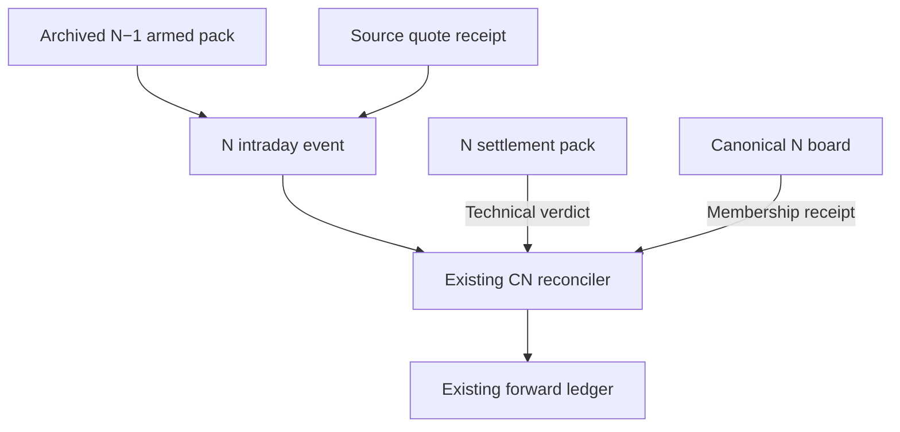

# Cross-component implementation contracts

This map consolidates the research decisions without creating a new store, runtime or policy owner. Exact names inside research fixtures are illustrative; the existing schema owners register additive production fields and migrations. The original census maps all current paths and carriers. This later map specifies which evidence must meet at their existing boundaries.

## 1. Preserve distinct authorities

The armed pack fixes thresholds and the frozen board values used at an event. It does not become the settled N verdict because it is the most convenient available artifact. The settlement pack's `center_buyable` supplies technical confirmation. The canonical board supplies membership comparison. A provisional close-board observation supplies neither settled fact by itself. The quote receipt establishes what the source adapter actually received and parsed; a generic `quotes` label does not certify unadjusted prices.

| Join | Required identity and time relation | If unavailable or conflicting |
| --- | --- | --- |
| Published board → armed pack | Exact canonical board bytes/hash, board definition/as-of/effective ordering, all four primary arrays, native board rank and measured score | Refuse malformed identity; preserve a genuine absent-from-board cross candidate without fabricated rank. |
| Armed pack → event | Exact archived content-addressed pack, same intended session/generation; pack built no later than event | Refuse use of the replacement nightly pack or a future-built pack. |
| Quote receipt → event | Exact received bytes, provider/parser contract, chosen field, units/basis, provider time and first-seen/receipt clock; receipt no later than event | Preserve unavailable/provisional state; do not stamp raw provenance from a field name or numerical agreement. |
| Event → envelope | Event clock no later than envelope publication; actual native price/class/phase carried intact; deterministic event identity | Reject aliases with different values and impossible clocks. Envelope publication cannot excuse a backdated event. |
| Existing spool → ingest | Complete authenticated listing and reads, archived-pack resolution, every previously consumed target-session event still present | Stop before any ledger write on partial listings, unreadable objects, whole-key disappearance or unknown provenance. |
| Close snapshot → membership comparison | Same session/pack identity; canonical semantics at each observation time; exact N board paired with settlement identity | Conflicting same-time membership refuses; identical semantics may coalesce with supporting identities retained. |
| Resolved events → first observation | Same native daily key, all first fields bound to the authentic event/pack/source; exact duplicate event IDs coalesce | Distinct events at the same exact retained event timestamp cannot be chronologically ordered by hash; refuse ambiguity. |
| N settlement → technical confirmation | Same-session generation and qualified `center_buyable` | Unknown stays unknown; presence in a provisional list is insufficient. |
| Durable ledger → replay | Readable valid schema, unique native daily keys, authenticated first projection, normalized persisted null/list types | Existing unreadable or conflicting content is never treated as empty. |

The event-forward key stays `(date, ticker, kind)`. The separate original-entry/latch key stays with its incumbent decision identity; the research original-entry contract models that identity as `(decision_id, ticker)`. Do not merge these two ledgers or add entry session to the original uniqueness key. The original entry session is protected content. The bounded repair tests price/basis corrections retaining that identity; a future legitimate session correction needs an explicitly named replacement field and owner-reviewed migration, not a second original.

## 2. Generation admission precedes numeric fallback

The accepted intelligence helper tests coverage over a supplied qualified pre-cap population. Its caller still has to prove that the population, baseline scores/ranks and optional intelligence belong together. The smallest implementation is an evidence receipt attached by the existing generation owner to its existing board artifact, binding:

1. Canonical source/program version and decision cutoff, plus board definition and effective-order reason.
2. Exact scored and qualified pre-cap population identities, incumbent score/rank values and qualification/cap-policy versions.
3. Source-selected input identities and their observation/publication/first-seen/revision contracts.
4. Each feed's post-qualification aggregation and normalization reference population, units and feature-contract version.
5. Calibration artifact, availability and matured-label cutoff, feature/target/horizon/benchmark/basis identity, or explicitly frozen baseline priors.
6. Chosen order, cap exclusions and actual publication receipt, retained before outcomes mature.

These items extend an existing artifact's lineage. They are not another feature store, candidate database or promotion authority. A hash binds the actual attached inputs; the owner must derive the metadata from its real source operations rather than copy asserted labels into an old artifact.

**Fallback is conditional on a trustworthy baseline.** Missing or invalid optional intelligence can select the complete incumbent ordering when that baseline and its qualified population are themselves coherent and authenticated. Structural conflicts in baseline score/rank, population or publication generation require refusal/quarantine; a fallback label cannot make the conflicting board trustworthy. No qualifying opportunities is a valid empty selection. Data that could not be evaluated is a different state.

## 3. Price outcomes are downstream observations

Publication identifies the cohort. The source/calendar resolver identifies the selected price marks. The outcome owner joins those two facts without revising the original cohort or latch. For each diagnostic, derive both stock and benchmark entry/exit anchors from the existing calendar, match the endpoints exactly, keep one declared vintage/basis per instrument and verify source bytes/row/field after deserialization. Publication must be at or before the assumed entry; grading must follow the complete source observation and exit.

The repaired fixture contains finalized daily rows. Its blob-wide availability must follow every row's close. A production adapter using a different observation-completion model must declare that model through the source owner; it cannot inherit a finalized-bar proof while using partial intraday rows. The fixture's synthetic JSON codec and finite calendar are not production implementations of those owners.

HL2 is an original proxy when the latch says so. It is not an exact executable timestamp. Benchmark Close cannot be substituted for missing Open. Current/raw numerical agreement, historical Git witnesses and action-title leads do not establish an original basis bridge. Preserve original records, append separately labeled corrections/comparisons and report unresolved outcomes explicitly.

## 4. Refusal and missingness have different consequences by layer

| Condition | Required observable result |
| --- | --- |
| Stock excluded by the existing quality predicate | Record its existing rejection reason and do not run its stock signal probe; preserve configured context-series treatment. |
| Missing required tradability metadata coverage | Explicit caller/owner refusal or named incumbent missing-data rule; an accidental absent Boolean-map key cannot silently authorize a stock. |
| Missing optional feature | Preserve missingness and source reason; do not convert it to a measured zero. |
| Complete qualified population with measured zero intelligence | Valid measured values; use the coherent incumbent tie behavior. |
| Conflicting event/source/ledger identity | Retain original durable bytes, stop the affected write and surface the conflict. |
| Empty but complete event session | Valid zero-event receipt, distinguishable from failed/partial reads. |
| Expired or failed live API observation | Remove optional live chips while retaining server-rendered cards with their separately evaluated freshness. |
| Unknown renderer anchor | Unknown age; never a cached healthy `delayed:false` state. |
| Missing outcome in a prespecified matching graph | Keep the graph and missing assignment weight; do not resample until a result is observable. |
| No feasible strict full control matching | Strict-policy estimate unavailable for that date; hypothetical completion scenarios remain separately named. |

## 5. Research proof versus release proof

The isolated native/source/Parquet and JS fixtures establish deterministic seams and hostile-input behavior. Independent acceptance is against exact candidate hashes. The implementation session still has to bind the actual installed source, owner-provided quote/basis/calendar receipts, real complete object listing, actual scheduled arguments, durable write/read and authenticated browser behavior. A natural completed owning-lane cycle proves something the synthetic fixture cannot. New outcome horizons and independent temporal evidence mature on their own clocks.

Those are concrete implementation/evidence gates. They do not call for another speculative rank formula, a new orchestration system or a repetition of already falsified current-data hypotheses.
