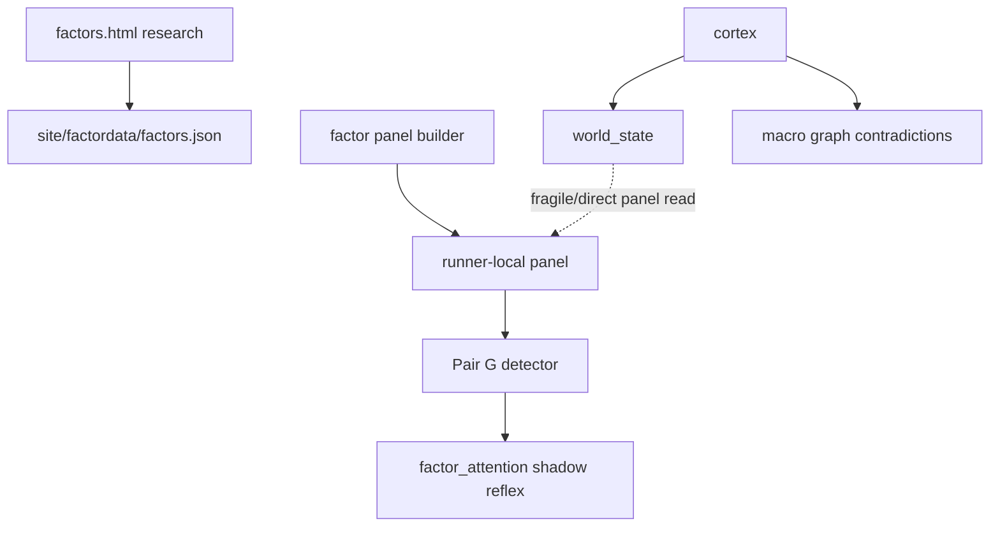
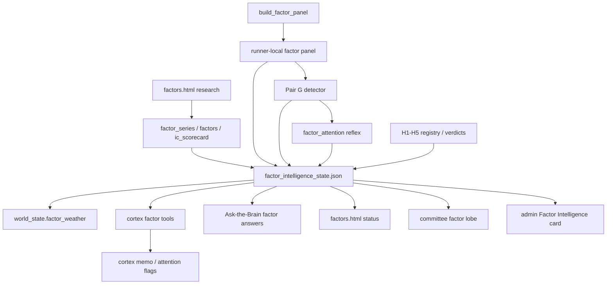
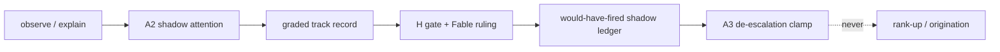

# Factor Intelligence x Neural Web Integration Docket - for Fable Review

**Program:** Factor Intelligence -> Neural Web integration
**Drafted:** 2026-07-06
**Status:** Review docket. This is not a preregistration edit and does not move any locked gate.
**Audience:** Fable adjudication, with Sonnet build lanes and Opus review lanes called out.
**Prompt:** The operator's concern is that factor research and `factors.html` are not truly integrated into Neural Web decision making.

---

## 0. Executive Verdict

The operator is directionally right.

The repo has serious factor research machinery: `factors.html`, the deep IC scorecard, factor return series, the factor panel builder, Pair G `borrowed_strength`, `factor_attention`, and the locked H1-H5 prereg family. But the current Neural Web integration is still too much like this:

1. Factor research exists as a rich standalone page and research program.
2. A few Neural Web hooks exist in code.
3. The actual decision brain mostly sees macro world state, spine/kernel, graph contradictions, and options tools.
4. Factor Intelligence is not yet a first-class deliberation input, not visible enough on the committee/admin surfaces, and not translated into an authority-laddered set of decision primitives.

The target state should not be "factors pick stocks." That remains killed. The target state is:

> Factor Intelligence becomes the Neural Web's per-name context, de-escalation, and conditioning lobe: it explains what a signal is made of, flags when a signal is borrowed from factor streams, conditions reliability by DNA/style state, and earns only bounded attention or de-escalation authority through pre-registered outcomes.

This docket proposes the missing integration layer.

---

## 1. Already Built / Do Not Rebuild

These are real assets and should be treated as existing substrate, not new scope.

### 1.1 `factors.html` research surface

`factors.html` already surfaces:

- Equity factor rankings across S&P 1500.
- Leak-free PIT IC scorecard with HAC t-stats and BH-FDR.
- Factor leadership and factor return series.
- Factor portfolio performance, crowding, quilt, sector monitor.
- Composite leader/laggard lists.
- Insider conviction and per-factor leaderboards.

Important: this is a research/display surface. It is not currently a Neural Web decision lobe.

### 1.2 Factor series and scorecard

Existing artifacts:

- `site/factordata/factor_series.json`
- `data/edgar/ic_scorecard.json`
- `site/factordata/factors.json`

The current deep scorecard says the broad factor zoo is mostly weak. Payout is the lone FDR survivor in the deep panel; SUE collapsed on the deeper retest. That prior must remain visible. No new integration may smuggle the equal-weight factor composite into ranking.

### 1.3 Factor panel builder

`scripts/build_factor_panel.py` implements the intended per-name panel:

- Block-A attribution streams.
- Block-B factor percentile coordinates.
- DNA class.
- Style-regime state.
- Synthetic twin fields.
- Alibi share.

This is the right raw material for Neural Web, but it is a gitignored / runner-local data plane. That matters operationally.

### 1.4 World-state `factor_weather` code

`engine/neuralweb/world_state.py` has `_compose_factor_weather()`, returning:

- `style_regime`
- `style_regime_pending`
- `style_regime_hold_days`
- `factor_leader`
- `factor_leader_ic`
- ETF pulse ratios
- `display_only: true`

This is conceptually right. But the current committed `data/neuralweb/world_state.json` in this checkout has no `factor_weather` key, so the integration is not reliably present in the artifact the brain reads.

### 1.5 Pair G and factor attention

`engine/neuralweb/factor_contradictions.py` detects `borrowed_strength`:

- A T1/T2 name fires.
- `alibi_share_20d` is above trailing-252d Q80.
- The record is `display_only`.
- The severity is hard-clamped to `note` until H2 passes.
- It writes a separate `factor_attention` reflex.

`scripts/grade_factor_attention.py` grades those firings after horizon maturity using the falsifier:

> direction=-1; hit = name underperforms SPY at horizon_d=21

That is good epistemics. It is not yet enough integration.

### 1.6 Locked H1-H5 prereg family

The locked family is correct and should not be moved:

- H1: factor-adjusted confluence annotation.
- H2: borrowed-strength / alibi veto validity.
- H3: DNA x style-regime drawdown discrimination.
- H4: twin-bleed veto validity.
- H5: thesis-decay in held names.

This docket does not change those thresholds. It proposes the product and Neural Web integration around them.

---

## 2. The Actual Gap

The missing thing is not another factor formula. The missing thing is a Neural Web operating layer that converts factor research into:

1. **A stable state artifact** the brain can read.
2. **Read tools** the cortex and Ask-the-Brain can call directly.
3. **Decision primitives** with explicit authority levels.
4. **Committee/admin visibility** so the operator sees whether factors are display-only, accruing, or gate-passed.
5. **Build-order guarantees** so factor state does not silently disappear from `world_state.json`.
6. **A post-gate de-escalation path** that is concrete but constitution-compliant.

Right now the system has code-level pieces but no unified factor intelligence blackboard.

The most concrete bug-shaped symptom:

- `factor_panel` is a separate nightly job after `factor_series`.
- `build_world_state` runs inside the engine job before the separate `factor_panel` job can reliably provide runner-local panel data.
- The panel is gitignored and not committed.
- Therefore `_compose_factor_weather()` can exist and still not reliably appear in committed `world_state.json`.

That is a classic "wired in source, absent in bus artifact" failure mode.

---

## 3. New Artifact: `factor_intelligence_state.json`

### 3.1 Purpose

Add a small committed summary artifact:

`data/neuralweb/factor_intelligence_state.json`

This is not the full panel. It is the Neural Web-readable state digest for factors.

It should be the canonical answer to:

- Is the factor panel present?
- How much history does it have?
- Is Pair G dormant or firing?
- What did the factor scorecard say?
- What is current style weather?
- What factor hypotheses are registered and what authority do they have?
- What factor observations, if any, should the cortex review?

### 3.2 Producer

Add:

`scripts/build_factor_intelligence_state.py`

Run after `build_factor_panel` and after `factor_contradictions`.

Because the full panel is runner-local/gitignored, this script commits only summary metadata and the latest small objects. It should never commit panel rows.

### 3.3 Shape

Proposed schema:

```json
{
  "schema": "neuralweb.factor_intelligence_state.v1",
  "as_of": "YYYY-MM-DD",
  "produced_at": "ISO-8601",
  "is_context_only": true,
  "display_only": true,
  "panel": {
    "available": true,
    "n_partitions": 73,
    "n_dates": 1260,
    "latest_date": "YYYY-MM-DD",
    "history_floor_met": true,
    "n_tickers_latest": 1500,
    "storage": "runner-local-panel-plus-committed-summary",
    "gaps": []
  },
  "scorecard": {
    "span": "2011-03-31..2025-12-31",
    "rebalances": 60,
    "survivors": ["payout"],
    "negative_ic_legs": ["low_vol", "low_beta", "investment", "composite"],
    "composite_tradeable": false,
    "note": "Scorecard is an optimistic survivorship-biased bound; not a buy list."
  },
  "factor_weather": {
    "style_regime": "mixed",
    "style_regime_pending": null,
    "style_regime_hold_days": 12,
    "factor_leader": "profitability",
    "factor_leader_ic": 0.0141,
    "ratio_iwf_iwd_20d": 0.01,
    "ratio_qqq_spy_20d": 0.02,
    "ratio_iwm_spy_20d": -0.01,
    "display_only": true
  },
  "contradictions": {
    "pair_g": {
      "dormant": false,
      "n_today": 4,
      "latest": [
        {
          "ticker": "EXAMPLE",
          "pair_id": "borrowed_strength:EXAMPLE:YYYY-MM-DD",
          "severity": "note",
          "alibi_share_20d": 0.82,
          "q80": 0.77,
          "display_only": true
        }
      ]
    }
  },
  "attention": {
    "factor_attention": {
      "n_firings": 12,
      "n_graded": 0,
      "granted": false,
      "tier": "A0/A1 shadow",
      "reason": "insufficient-n"
    }
  },
  "hypotheses": {
    "h1": {"status": "registered|missing|accruing|gate_passed|null", "authority": "display"},
    "h2": {"status": "registered|missing|accruing|gate_passed|null", "authority": "display"},
    "h3": {"status": "registered|missing|accruing|gate_passed|null", "authority": "display"},
    "h4": {"status": "registered|missing|accruing|gate_passed|null", "authority": "display"},
    "h5": {"status": "registered|missing|accruing|gate_passed|null", "authority": "display"}
  },
  "allowed_actions": {
    "may_explain": true,
    "may_flag_attention": true,
    "may_deescalate": false,
    "may_rank": false,
    "may_originate": false
  },
  "gaps": []
}
```

### 3.4 Why this matters

This artifact solves three problems:

1. The cortex can read one small factor state object without scanning panel parquet.
2. Admin and `factors.html` can show whether the factor lobe is live or dormant.
3. The gitignored panel can remain runner-local while the brain still has a committed summary.

This should be the first build lane.

---

## 4. New Cortex and Ask-the-Brain Tools

### 4.1 Current gap

`engine/neuralweb/cortex.py` currently has read tools for:

- world state
- spine
- kernel
- graph
- macro contradictions
- governance
- generic artifact reads
- options-specific tools

But there is no first-class factor tool. The cortex can technically read files via `read_artifact`, but that is not an integration. It is a loophole.

Also, `read_contradictions` reads contradictions from `confluence_graph.json`. It does not read `data/neuralweb/factor_contradictions.jsonl`. That means the masterplan phrase "cortex may select items from factor_contradictions" is not operationally natural.

### 4.2 Add read tools

Add the following to cortex:

#### `read_factor_state`

Reads `data/neuralweb/factor_intelligence_state.json`.

Use for:

- Current style weather.
- Panel status.
- H1-H5 status.
- Factor attention probation.
- Pair G counts.

#### `list_factor_contradictions`

Reads `data/neuralweb/factor_contradictions.jsonl`.

Parameters:

- `ticker` optional.
- `date_from` optional.
- `limit` default 25, max 100.
- `unreviewed_only` optional if we later add review state.

Returns:

- Pair G records.
- `display_only`.
- alibi/q80 readings.
- suggested falsifier for attention.

#### `explain_factor_context`

Ticker-level explanation tool. It should not rank or recommend.

Parameters:

- `ticker` required.

Returns:

- Latest Block-A attribution summary if available.
- DNA class.
- style_regime.
- alibi share.
- twin state.
- scorecard prior for any relevant factor leader.
- "allowed action" block.

If panel data is absent, return a structured gap instead of a text apology.

#### `query_factor_attention`

Reads:

- `data/reflexes/factor_attention/firings.jsonl`
- `data/reflexes/factor_attention/grades.jsonl`
- `data/reflexes/factor_attention/probation.json`

Returns:

- track record
- matured/unmatured split
- current authority
- latest firings

### 4.3 Prompt changes

Change the cortex deliberation protocol from:

1. Read world state.
2. Query spine.
3. Read graph contradictions.
4. Read kernel.

To:

1. Read world state.
2. Read factor state.
3. Query spine for recently graded claims.
4. Read macro graph contradictions.
5. List factor contradictions.
6. Read kernel.
7. If any factor contradiction deserves attention, flag it with the pre-committed factor falsifier.

This makes factor intelligence a normal brain sense, not an optional file read.

### 4.4 Ask-the-Brain changes

`engine/neuralweb/ask_brain.py` should classify factor questions:

Trigger terms:

- factor
- value
- quality
- low-vol
- profitability
- payout
- SUE
- alibi
- borrowed strength
- DNA
- style regime
- factor weather
- twin bleed
- factor contradiction

Seed tools:

- `read_factor_state`
- `explain_factor_context` if ticker context exists
- `list_factor_contradictions` for contradiction phrasing

This is important because the customer-facing brain currently has no special path for a question like:

> Why is this setup factor-borrowed?

Without the tool, the model either guesses from world state or tries generic artifact reads.

---

## 5. Decision Primitives

The factor layer should publish five named primitives into Neural Web. Each primitive must have a fixed authority and a fixed "allowed action."

### 5.1 `factor_annotated`

Source: H1.

Meaning:

The raw technical fire also has residual/sector-relative confirmation.

Decision role:

- Diagnostic before gate.
- If H1 passes, logged annotation.
- Never direct board rank boost.

Allowed action:

- Explain.
- Attach a context chip.
- Feed H5 thesis-decay study.

Forbidden action:

- Rank up.
- Increase score.
- Escalate alert.

### 5.2 `high_alibi_flag`

Source: H2 / Pair G.

Meaning:

The name fired, but recent return is mostly explained by factor streams rather than idiosyncratic residual.

Decision role:

- Before H2 passes: display-only contradiction, severity note.
- After H2 passes: de-escalation candidate only after would-have-fired shadow ledger.

Allowed action:

- A1 explain.
- A2 attention flag if cortex selects it.
- A3 de-escalation only after H2 gate plus shadow-log step.

Forbidden action:

- Short signal.
- Rank-down before gate.
- Push alert by itself.

### 5.3 `dna_style_cell`

Source: H3.

Meaning:

A name's factor DNA class is being read inside current style weather.

Decision role:

- Before H3 passes: taxonomy.
- If H3 passes: regime-conditioned risk report card.
- Ultimately a kernel conditioning coordinate, not a direct prior.

Allowed action:

- Explain "this name is a small_spec name in a junk_rally tape."
- Show historical stop-out rate with PRE-FDR or GATE-PASSED label.

Forbidden action:

- Encode folk priors like "growth tape means buy growth."
- Any deterministic regime buy/sell rule.

### 5.4 `twin_bleed_flag`

Source: H4.

Meaning:

The name's factor/residual peer twin is bleeding while the name fires.

Decision role:

- Display before gate.
- De-escalation candidate after H4 gate plus shadow-log step.

Allowed action:

- Explain peer deterioration.
- Add a "twin bleeding" caution chip.
- Later A3 clamp candidate.

Forbidden action:

- Direct removal from board before gate.

### 5.5 `decay_flag`

Source: H5.

Meaning:

Held name is being carried by factor alibi while residual return deteriorates.

Decision role:

- Slow thesis-decay monitor.
- Board holding quality, not entry selection.

Allowed action:

- Attention item.
- Exit-watch context after gate.

Forbidden action:

- Automatic exit.
- Recommendation.

---

## 6. Authority Ladder Mapping

The integration should use four rungs only.

### A1 - Explain

Always allowed.

Examples:

- "NVDA has high growth beta and a quality_growth DNA class."
- "The current factor leader is profitability, but its deep-history IC is weak."
- "This T1 fire is high-alibi, meaning most of its recent move is factor-carried."

### A2 - Attend

Allowed in shadow form.

Examples:

- Cortex selects 3 of 12 Pair G records as worth operator attention.
- The attention item has direction, horizon, and falsifier.
- It accrues to cortex or factor_attention probation.

This is not ranking. This is "watch this."

### A3 - De-escalate

Only after:

1. The relevant H gate passes.
2. A would-have-fired shadow ledger shows the proposed clamp would not have harmed outcomes.
3. Fable explicitly approves the wiring.

Potential clamps:

- Altdata `_reconcile`: ACCUMULATE -> WATCH.
- Narrative `_reconcile`: ENTER -> MONITOR.
- Board display: "operator review required" chip.

Do not touch:

- `board_ordering`
- `top_setups`
- `push_floor`
- alert priority

### A5 - Condition / score path

Only via kernel machinery.

Examples:

- style_regime shadow kernel cells.
- DNA x style report cards.
- Kernel-FDR batch decides whether enriched cells matter.

This is slow. That is correct.

---

## 7. `factors.html` Integration

The factor page should stop looking like a separate quant lab and start showing how it feeds Neural Web.

Add a compact "Neural Web integration" panel near the top.

### 7.1 Panel contents

Suggested fields:

- **Panel history:** latest date, n dates, history floor met / dormant.
- **World-state lobe:** style_regime and factor leader currently exported to Neural Web.
- **Pair G:** current borrowed-strength records, severity policy, H2 status.
- **Attention authority:** factor_attention A2 status, n graded, hits, granted/refused.
- **H1-H5:** registered/accruing/gate-passed/null status.
- **Allowed influence:** explain / attend / de-escalate / rank, with rank always false.

### 7.2 Tone

Do not write a long explainer. The page is already dense.

Use status chips:

- `DISPLAY`
- `SHADOW`
- `ACCRUING`
- `GATE-PASSED`
- `NULL`
- `DORMANT`

Never use the CI-sensitive validation word.

### 7.3 Operator benefit

The operator should be able to answer:

- Is this page just research?
- Is any factor primitive affecting Neural Web today?
- If not, why not?
- What gate is it waiting on?

That is currently not visible.

---

## 8. Committee Surface Integration

Committee is the natural "decision room." Factor Intelligence should show there as two lanes.

### 8.1 Diagnostic lane

Always displayed.

Per ticker:

- DNA class.
- style_regime.
- alibi_share_20d.
- top attribution streams.
- twin_rel_20d.
- twin_bleed_flag.
- factor scorecard caveat.

This lane answers:

> What is this name made of?

### 8.2 Predictive lane

Displayed with status labels.

Per ticker / per primitive:

- H1-H5 status.
- authority level.
- n and Wilson lower bound where available.
- PRE-FDR / GATE-PASSED / NULL.

This lane answers:

> Is any of this allowed to influence decisions?

### 8.3 Factor contradiction review queue

Add a small table:

- ticker
- tier fire
- alibi_share_20d
- Q80
- note
- cortex selected? yes/no
- falsifier
- grade status

This is the place where Lane 2 becomes visible.

---

## 9. Admin / Operator HQ Integration

The Neural Web admin tab should get a Factor Intelligence card.

### 9.1 Required status checks

- `factor_intelligence_state.json` freshness.
- panel partitions count.
- latest panel date.
- history floor for Pair G.
- factor_contradictions ledger exists.
- factor_attention firings/grades/probation freshness.
- H1-H5 machine registration status.
- current authority grants/refusals.

### 9.2 Alerts

Admin should warn on:

- `_compose_factor_weather()` code exists but state artifact lacks factor_weather.
- panel n_dates < 60, Pair G dormant.
- H2 gate-passed but Pair G severity still note.
- factor_attention granted but no Fable-approved A3 wiring exists.
- any factor artifact claims `rank`, `score`, or the CI-sensitive validation word.

The last item should probably become a CI/static check, not just UI.

---

## 10. Build-Order and Data-Plane Fix

This is the most important engineering issue.

### 10.1 Current risk

The factor panel is built in a separate job and is gitignored. `world_state` is built in the engine job. A committed `world_state.json` can therefore omit factor_weather even when source code supports it.

This creates a false-positive integration:

- Source says integrated.
- Committed artifact says not integrated.
- Cortex reads the artifact, not the source.

### 10.2 Preferred fix

Do not commit full panel. Commit a small summary.

Build order:

1. `factor_series` writes and commits `factor_series.json`.
2. `factor_panel` builds runner-local panel.
3. `factor_contradictions` runs.
4. `build_factor_intelligence_state` writes committed summary.
5. Engine/world_state reads committed summary on the next run, or the factor job itself can write a small `site/neuralwebdata/factor_intelligence_state.json` if Fable approves that job becoming a sole advancer for that file.

Because nightly sole-advancer law matters, Fable needs to choose one of these:

**Option A - next-run visibility:**

- factor job writes summary but does not push.
- next engine job commits it.
- Simpler law, one-run stale.

**Option B - narrow factor job push:**

- factor job is allowed to commit only `data/neuralweb/factor_intelligence_state.json` and site mirror.
- More live, but expands commit authority.

Recommendation: Option A unless Fable decides one-run stale is unacceptable. Factor Intelligence is slow/de-escalation; one-run stale is acceptable.

### 10.3 World-state change

`_compose_factor_weather()` should first read `data/neuralweb/factor_intelligence_state.json` if present, then fall back to direct panel reads.

This gives `world_state` a stable input and avoids forcing the engine job to see runner-local panel parquet.

---

## 11. Gate-to-Behavior Protocol

No factor primitive should jump from research result to behavior. Use a three-step post-gate protocol.

### Step 1 - Gate pass

Example:

H2 passes BH-FDR and effect floor.

Result:

- status becomes `GATE-PASSED`.
- Pair G can become eligible for severity `tension`.
- Still no clamp.

### Step 2 - Would-have-fired shadow ledger

Create:

`data/reflexes/factor_deescalation_shadow/firings.jsonl`

Fields:

- ticker
- as_of
- primitive
- proposed_action
- original_surface
- original_verdict
- proposed_verdict
- falsifier
- horizon_d
- gate_reference

For H2:

- proposed_action: "de-escalate borrowed-strength entry"
- falsifier: "would de-escalation avoid a worse-than-base 21d outcome without sacrificing clean liftoff rate"

This ledger should run for a minimum number of events before any clamp.

### Step 3 - A3 clamp

Only after Fable approval.

Allowed clamps:

- altdata/narrative de-escalation clamps.
- display caution chips.
- operator review bucket.

Forbidden:

- board ordering.
- top setups.
- score/rank.
- push escalation.

---

## 12. Fable Review Questions

Fable should rule on these before build:

1. Should `factor_intelligence_state.json` be committed by the engine job on the next run, or may the factor job push that narrow artifact?
2. Should `world_state.factor_weather` read from `factor_intelligence_state.json` as canonical, with direct panel reads only as fallback?
3. Should cortex get four factor tools (`read_factor_state`, `list_factor_contradictions`, `explain_factor_context`, `query_factor_attention`) or should `read_factor_state` be the only new tool for v1?
4. Should Ask-the-Brain expose factor tools immediately, or wait until the committee surface displays the same state?
5. Does Pair G Lane 2 selection count toward cortex probation only, or should there be a separate `factor_cortex_selection` probation record?
6. What is the minimum would-have-fired shadow ledger size before any A3 de-escalation clamp can be proposed?
7. Should factors.html remain an expert research page, or become the operator's public status page for the factor lobe?
8. Should H1/H2/H3/H4/H5 machine registration status be surfaced on factors.html, committee, admin, or all three?

---

## 13. Proposed Build Lanes

### Lane A - State artifact and build-order repair

Files:

- `scripts/build_factor_intelligence_state.py`
- `engine/neuralweb/world_state.py`
- `config/synapse.yml`
- `config/dag.yml`
- `.github/workflows/daily.yml`
- tests for artifact shape and fail-open behavior

Acceptance:

- State artifact writes with no panel.
- State artifact writes with a synthetic panel.
- `world_state.factor_weather` appears when state artifact exists.
- No Article-2 surfaces changed.

### Lane B - Cortex and Ask-the-Brain tools

Files:

- `engine/neuralweb/cortex.py`
- `engine/neuralweb/ask_brain.py`
- tests for read-only tools and no write-tool exposure in Ask-the-Brain

Acceptance:

- Cortex can read factor state.
- Cortex can list factor contradictions.
- Ask-the-Brain routes factor questions to factor tools.
- Tool schemas mark everything display/context only.
- Dispatcher refuses unknown factor write tools.

### Lane C - factors.html status panel

Files:

- `templates/factors.html.j2`
- `scripts/build_site.py` if context needs loading
- site render

Acceptance:

- Compact status panel appears.
- Shows dormant/accruing/gate status.
- No CI-sensitive validation word.
- Mobile safe.
- Bilingual strings handled.

### Lane D - Committee/admin factor lobe

Files:

- `templates/committee.html.j2`
- `admin/neural_web.py`
- `admin/static/app.js`
- site render
- tests

Acceptance:

- Per-ticker factor diagnostic lane.
- Predictive lane with authority status.
- Admin card with panel/firings/probation/hypothesis status.
- Missing factor artifacts fail open.

### Lane E - Post-gate de-escalation shadow ledger

Files:

- new reflex config entry
- `scripts/build_factor_deescalation_shadow.py`
- grader/evaluator if Fable approves
- no behavioral clamp in this lane

Acceptance:

- Runs only when H gate is GATE-PASSED.
- Writes shadow rows only.
- No money-path writes.
- Static guard prevents board_ordering/top_setups/push_floor edits.

---

## 14. Testing and Guardrails

### Static guards

Add checks that fail if Factor Intelligence files write to:

- `alert_triage`
- `board_ordering`
- `top_setups`
- `push_floor`

Add string guard:

- no CI-sensitive validation word in factor integration UI
- no rank-increase field
- no score-increase field
- no `buy`, `sell`, `hold` recommendation copy in Ask-the-Brain factor context

### Unit tests

Required:

- `build_factor_intelligence_state` with missing panel.
- `build_factor_intelligence_state` with synthetic Pair G ledger.
- `world_state` reads state artifact.
- cortex factor tools read and cap outputs.
- Ask-the-Brain factor classifier routes correctly.
- factors.html renders status panel with no artifacts.
- admin panel shows missing/dormant status.

### Integration tests

Required:

- Synthetic high-alibi T1 record flows:
  1. factor_contradictions ledger
  2. factor_attention firing
  3. factor_intelligence_state summary
  4. cortex `list_factor_contradictions`
  5. committee/admin display

This is the real "is it integrated?" test.

---

## 15. What This Looks Like in Neural Web

### Current brain flow



Problem:

The cortex does not naturally see factor state or factor contradictions. The bridge is fragile.

### Target brain flow



Decision authority remains bounded:



---

## 16. Bottom Line

We should add an integration layer, not more factor math.

The most important additions are:

1. A committed `factor_intelligence_state.json`.
2. First-class cortex and Ask-the-Brain factor tools.
3. A visible status panel on `factors.html`.
4. Committee/admin factor lanes.
5. A post-gate de-escalation shadow ledger.
6. Build-order repair so `world_state.factor_weather` is truly present.

This gives Neural Web a factor lobe that can explain, attend, and eventually de-escalate - without violating the house law that factors never originate or rank selections.
