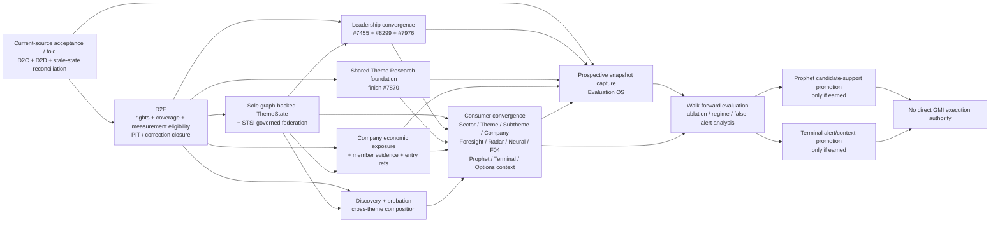
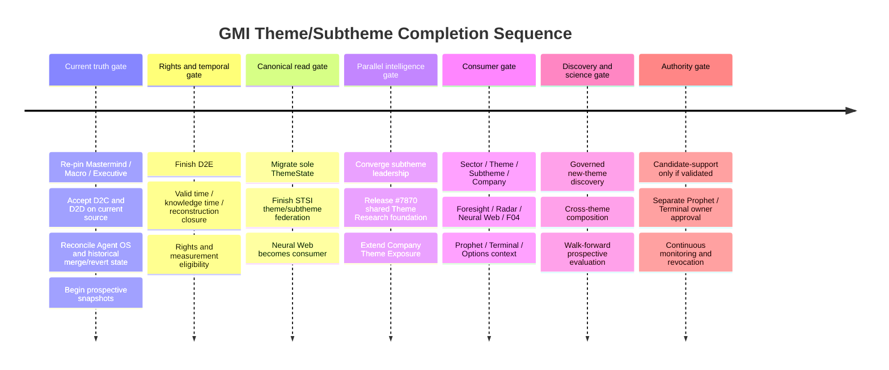

# GMI Theme/Subtheme Intelligence — Astra CEO Completion Handoff and Revised Master Plan

The fresh normal-Pro current-source audit materially changes the prior plan: **D2C and D2D are no longer build-frontier work, the live Theme Graph substrate is materially ahead of the durable Agent OS workstream record, a real but graph-disconnected `neuralweb.theme_state.v1` predecessor already exists, and several supposedly “future” consumer adapters already have implementation carriers.** The largest remaining architectural gaps are **D2E rights/measurement closure, migration to one graph-backed canonical ThemeState, completion of the STSI/GMI read federation, convergence of the open subtheme-leadership lanes, release of the shared Theme Research foundation in #7870, and extension of Company Theme Exposure from membership projection to evidence-backed economic exposure**. The critical implementation path is therefore **current-source acceptance/fold → D2E → sole ThemeState/STSI federation → parallel leadership/economic/company-exposure completion → consumer convergence → discovery/cross-theme → prospective Evaluation and earned authority promotion**, with prospective capture beginning immediately rather than at the end. Astra should **not** launch another research program or rebuild D2C/D2D; it should run a normal Pro-mode orchestration that re-pins current source, accepts or repairs what already exists, reconciles stale program records, and drives the existing organism through natural refresh, multiple real consumers, browser/machine proof, correction propagation, and prospective Evaluation.

## Current-source audit and corrected capability ledger

### Current truth at the audit boundary

The protected Mastermind procedure source was re-pinned to `mastermindx-market-intelligence/Mastermind@20adcaf65c2dd1bb734ab06e215feb1a0eb65659`; `master` is protected, and this is the same procedure revision used to load the current Sol procedure set. fileciteturn51file0L1-L2

Macro moved during the audit. The last fresh read found `main` at:

`9d3fb88f59af7896d1d6060854a9c8c51af89414`

with parent:

`5f20adbd6be6b136b2efe41585bd4ef964b5bf2e`.

The new tip is a Chronicle/nightly update; the GMI source census was therefore inspected against the immediately preceding GMI-relevant tree as well as the new current tip. fileciteturn48file0L1-L12

PR #8324 remains **open, Draft, unmerged**, with head `3a8c71456e44e32d597ba648e372a08416dbaa6f`; its own body correctly says it is research/plan authority only and does **not** establish implementation, deployment, production proof, or predictive validation. fileciteturn49file0L2-L16 The correct Astra posture is therefore: **consume #8324, but do not execute it mechanically**.

The most important program-control inconsistency is confirmed. `WS:GMI-THEME-GRAPH` still carries historical D2C/D2D TODO state even though implementation carriers subsequently advanced and, in D2D's case, actually merged. fileciteturn13file0L2-L2 That is not merely documentation untidiness: it demonstrates why Astra must reconcile **current code + current PR state + generated artifacts + real consumers** before treating Agent OS status text as execution truth.

The current Theme Graph substrate itself is not hypothetical. The repository contains the materialized node, edge, evidence, lifecycle, identity-resolution and capability families under `data/theme_graph/`, and the materializer explicitly preserves append-only belief/history semantics rather than inventing direct company→canonical-theme links without evidence. fileciteturn34file0L1-L10 fileciteturn32file0L1-L2

At the same time, `engine/neuralweb/thematic_state.py` remains a real incumbent thematic-state producer with its own state/history semantics and all decision-authority flags withheld. Crucially, that producer composes legacy/specialist observations rather than reading canonical Theme Graph as its semantic backbone. fileciteturn33file0L1-L2 This means the missing capability is **not “build ThemeState from scratch”**; it is **migrate from an incumbent live predecessor to one canonical graph-backed ThemeState without creating a second or third authority**.

Executive OS could not be freshly closed at the end of this audit: its final read returned `backend_unavailable`. Therefore **no current Astra/Executive Job, Attempt, START, worker allocation, or active GMI execution is asserted here**. The first Astra action must re-read Executive OS and treat any unavailable read as an explicit runtime-truth gap, not permission to infer state from GitHub.

### Corrections to the existing #8324 plan

Several corrections are significant enough that Astra should treat them as amendments to Master Plan v2.

| Prior working assumption | Fresh current-source correction | Planning consequence |
|---|---|---|
| D2C is still a TODO frontier | #6809 merged the core PIT membership integration and #7458 merged the evidence-ref repair. #6809 explicitly uses the incumbent PIT owner rather than a second history store. fileciteturn18file0L2-L16 fileciteturn19file0L2-L16 | **Accept/prove D2C; do not rebuild it.** |
| D2D is still open/unmerged | #7462 is now **merged**; current GitHub metadata supersedes its older body text that still says Draft/HOLD. fileciteturn20file0L2-L16 | D2D becomes an **acceptance and consumption** problem, not an implementation-frontier problem. |
| STSI #7577 is still merely an open architectural branch | #7577 is merged; it codifies owner-preserving federation, typed conflicts and the “no universal score” direction. fileciteturn21file0L2-L16 | Reuse STSI architecture; **finish its read/federation implementation** instead of redesigning it. |
| ThemeState is simply missing | `neuralweb.theme_state.v1` is an incumbent producer today. fileciteturn33file0L1-L2 | W3B is a **controlled ownership migration** to graph-backed canonical state. |
| Prophet integration is wholly future work | PR #8240 already implements a research-only Early Leadership evidence compiler combining GMI/theme context with candidate evidence; its decision authorities remain disabled. | Finish the incumbent adapter after canonical state/exposure inputs stabilize; **do not create a new Prophet-GMI adapter**. |
| Company Theme Exposure is already economic-exposure intelligence | The present implementation is primarily a projection of active membership/crosswalk/ThemeState context; earlier source-family census material also found builder/publisher code without a clearly established natural DAG/current artifact path. fileciteturn52file2L33-L50 | Extend the incumbent owner into economic exposure; **do not create another exposure database**. |
| A historical merge means a capability still exists on current main | Robotics #7908 historically merged, but later recovery records show #8013 reverted it after post-merge CI exposed unresolved shared imports and missing test enrollment. The historical merge itself is real. fileciteturn56file0L2-L16 | Astra must census **current source**, not count old merges. Robotics resumes through its recovery/re-land authority, not by re-cherry-picking #7908. |
| #7870 is one sector vertical among many | Current sector programs repeatedly identify #7870's shared Theme Research shell/registry/mount as a dependency; #7891, Energy, Finance, Industrials and the Robotics recovery all depend on it. #7891 explicitly consumes its shared curation/mount rather than duplicating them. fileciteturn54file0L2-L16 | #7870 should be promoted to a **program-level parallel critical path**, not left as “later Semiconductor work.” |

### Corrected capability ledger

Legend: **Y** = yes/proven for that column; **P** = partial/bounded; **N** = no; **?** = current proof unresolved; **—** = not applicable. “Published” means an actual machine/product publication path, not simply code committed to GitHub.

| GMI capability | Truth state | Designed | Implemented | Merged | Published | Naturally refreshed | PIT-safe | Real consumer | User-visible | Production-proven | Prospectively evaluated |
|---|---|---:|---:|---:|---:|---:|---:|---:|---:|---:|---:|
| Theme Graph semantic substrate | **PROVEN_LIVE** | Y | Y | Y | Y | Y | P | Y | P | Y | N |
| Finviz/THS source-local theme plane / W3A | **PROVEN_LIVE** internally | Y | Y | Y | P | Y | P | Y | Y through incumbent projections | Y internally | N |
| D2C PIT membership/history | **BUILT_NOT_PROVEN** | Y | Y | Y | Y internally | P | Y by contract | Y | P | P | N |
| D2C evidence-ref/parquet repair | **BUILT_NOT_PROVEN** | Y | Y | Y | Y through graph | P | Y | Y | N | P | N |
| D2D ontology/history/evidence readers | **BUILT_NOT_PROVEN** | Y | Y | Y | code/read contracts Y | — | Y by as-of/read contract | P | N | N | — |
| D2E rights / coverage / measurement eligibility | **PARTIAL** | Y | P | P | P | P | P | Y | P | N as complete gate | N |
| Probation/adjudication/canonicalization | **PARTIAL** | Y | P | P | P | P | P | P | P | N end-to-end | N |
| Legacy `neuralweb.theme_state.v1` | **PROVEN_LIVE** predecessor | Y | Y | Y | Y | Y | P | Y | Y | Y | N |
| Sole graph-backed canonical GMI ThemeState | **NOT_BUILT** as final authority | Y | N | N | N | N | N | N | N | N | N |
| Theme Intelligence semantic consumer #7526 | **BUILT_NOT_PROVEN** | Y | Y | Y | P | P | P | Y | P | N end-to-end | N |
| STSI architecture #7577 | **SPEC_ONLY** as architecture | Y | — | Y as docs/spec | — | — | — | — | — | — | — |
| Governed STSI dossier contract #7777 | **PARTIAL** | Y | Y | Y | P | P | P | P | P | P | N |
| Focused Sector Intelligence publisher #7211 | **PROVEN_LIVE** | Y | Y | Y | Y | Y | P | Y | Y | Y | — |
| Closed-session subtheme leadership #7455 | **BUILT_NOT_PROVEN** | Y | Y | N | N | N | **N for current-membership historical windows** | P | P | N | N |
| Subtheme missingness/qualification #8299 | **BUILT_NOT_PROVEN** | Y | Y | N | N | N | N for full historical replay | P | P | N | N |
| Finviz repricing/participation/durability #7976 | **BUILT_NOT_PROVEN** | Y | Y | N | incumbent heatmap path P | P | P harness; real replay incomplete | Y | Y | N | N |
| Member evidence #7252 | **BUILT_NOT_PROVEN** | Y | Y | N | P | N | P | P | P | N | N |
| Entry context #7508 | **BUILT_NOT_PROVEN** | Y | Y | N | P | N | P | P | P | N | N |
| Theme Atlas #7283 | **BUILT_NOT_PROVEN** projection | Y | Y | N | N | N | P | N | candidate UI | N | — |
| Shared economic Theme Research foundation #7870/#7886 | **PARTIAL** | Y | P | N for #7870 | N | N | P | domain branches | N as general system | N | N |
| P&G/private economic source seam #7905 | **BUILT_NOT_PROVEN** | Y | Y | Y | N as user product | N | P | downstream domain program | N | source-level proof only | N |
| Company Theme Exposure | **DARK_OR_DISCONNECTED** for intended GMI role | Y | Y | Y | ? | ? | P | P | P | N | N |
| MarketOntology/F04 GMI exposure composer #6929 | **BUILT_NOT_PROVEN** | Y | Y | Y | pure read, no independent artifact | — | Y as-of by design | Y research consumer | P | N | N |
| Prophet Early Leadership evidence adapter #8240 | **BUILT_NOT_PROVEN** | Y | Y | N | N | N | P | research-only | N | N | N |
| Canonical GMI → Terminal context interface | **NOT_BUILT** as a governed interface | Y conceptually | N | N | N | N | N | N | N | N | N |
| Theme/subtheme prospective Evaluation program | **PARTIAL** | Y | P | P | research | P | P | research owners | N | N | **P, not promotion-grade** |
| GMI ability to directly alter Prophet rank/gate | **REJECTED_BY_DESIGN** until separately promoted | Y prohibition | N | — | — | — | — | — | — | — | N |
| GMI direct execution/trading authority | **REJECTED_BY_DESIGN** | Y prohibition | N | — | — | — | — | — | — | — | — |

Two distinctions matter most in this ledger.

First, **“merged” is deliberately not synonymous with `PROVEN_LIVE`**. #6809 merged a credible PIT implementation and #7462 merged real D2D readers, but #6809 itself explicitly separated merge from a later natural-production proof. fileciteturn18file0L2-L16

Second, some old systems are **genuinely live but architecturally wrong as final owners**. That is exactly the situation with Neural Web thematic state: the migration must preserve whatever production value it already provides while eliminating its status as an independent thematic truth producer.

## Carrier disposition and canonical architectural ruling

### Existing-carrier disposition

The table below is the handoff rule Astra should use to prevent duplicate branches and “helpful” rebuilds.

| Carrier | Current-source interpretation | Disposition | Astra action |
|---|---|---|---|
| [#6522](https://github.com/mastermindx-market-intelligence/macro/pull/6522) | Merged finish-and-fold/ownership law; old dependency sequence is stale. fileciteturn12file0L2-L16 | **KEEP + SUPERSEDE sequence** | Preserve ownership/no-duplicate decisions; replace D2C/D2D TODO sequencing with current dependency graph. |
| [#5718](https://github.com/mastermindx-market-intelligence/macro/pull/5718) | Merged W3A local-theme plane; preserves local-vs-canonical distinction. fileciteturn17file0L2-L16 | **KEEP / DO-NOT-DUPLICATE** | Treat as incumbent local-source substrate. |
| [#6809](https://github.com/mastermindx-market-intelligence/macro/pull/6809) | Merged D2C PIT implementation. fileciteturn18file0L2-L16 | **KEEP + FINISH acceptance / DO-NOT-REDO** | Re-run current-main acceptance and natural source-change/correction proof. |
| [#7458](https://github.com/mastermindx-market-intelligence/macro/pull/7458) | Merged D2C evidence-ref repair. fileciteturn19file0L2-L16 | **KEEP / DO-NOT-REDO** | Include its regression cases in D2C acceptance. |
| [#7462](https://github.com/mastermindx-market-intelligence/macro/pull/7462) | **Merged** D2D reader/query tooling despite stale Draft/HOLD prose in body. fileciteturn20file0L2-L16 | **KEEP + FINISH acceptance** | Prove strict/current readers, then update Agent OS from TODO. |
| [#7577](https://github.com/mastermindx-market-intelligence/macro/pull/7577) | Merged STSI architecture. fileciteturn21file0L2-L16 | **KEEP / MERGE INTO canonical read architecture** | Do not create “STSI v2”; implement the owner-preserving federation it specifies. |
| [#7211](https://github.com/mastermindx-market-intelligence/macro/pull/7211) | Merged focused Sector Intelligence publication path. fileciteturn22file0L2-L16 | **KEEP / DO-NOT-DUPLICATE publisher** | All new dossier projections flow through incumbent publication machinery where applicable. |
| [#7526](https://github.com/mastermindx-market-intelligence/macro/pull/7526) | Merged specialist Theme Intelligence semantics; explicitly not canonical ThemeState. fileciteturn23file0L2-L16 | **KEEP + MERGE AS OBSERVATION** | Feed canonical state/read model; do not elevate to a second ThemeState. |
| [#7777](https://github.com/mastermindx-market-intelligence/macro/pull/7777) | Merged governed STSI dossier contract, conflict/provenance/null semantics. fileciteturn24file0L2-L16 | **KEEP + FINISH** | Extend from sector-focused governed read model to canonical theme/subtheme dossier projections. |
| [#7455](https://github.com/mastermindx-market-intelligence/macro/pull/7455) | Open subtheme leadership implementation; current membership historical windows explicitly not PIT. fileciteturn25file0L2-L16 | **FINISH + MERGE WITH #8299/#7976 semantics** | One observation family, independent dimensions, PIT qualification before evaluation claims. |
| [#8299](https://github.com/mastermindx-market-intelligence/macro/pull/8299) | Open missingness/qualification repair; strong null semantics, incomplete real historical qualification. fileciteturn26file0L2-L16 | **FINISH + MERGE** | Make its “unavailable ≠ weak” law binding on all leadership consumers. |
| [#7976](https://github.com/mastermindx-market-intelligence/macro/pull/7976) | Open source-local repricing/participation/durability/leader-handoff family. fileciteturn27file0L2-L16 | **FINISH + MERGE** | Retain as source-local evidence where appropriate; do not silently canonicalize Finviz concepts. |
| [#7252](https://github.com/mastermindx-market-intelligence/macro/pull/7252) | Open member-evidence carrier. fileciteturn28file0L2-L16 | **FINISH** | Make member evidence a referenced specialist observation in company/subtheme dossiers. |
| [#7508](https://github.com/mastermindx-market-intelligence/macro/pull/7508) | Open entry-context specialist. fileciteturn29file0L2-L16 | **KEEP + FINISH** | ThemeState references it; never owns entry authority. |
| [#7283](https://github.com/mastermindx-market-intelligence/macro/pull/7283) | Theme Atlas UI/projection. fileciteturn30file0L2-L16 | **KEEP AS PROJECTION** | Rewire to canonical read architecture; do not make Atlas another thematic truth owner. |
| [#7886](https://github.com/mastermindx-market-intelligence/macro/pull/7886) | Thematic-research coordination carrier; partial program, not runtime. fileciteturn31file0L2-L16 | **KEEP + FOLD** | Retain decisions/checkpoints; runtime authority resides in shared foundation and domain owners. |
| [#7870](https://github.com/mastermindx-market-intelligence/macro/pull/7870) | Open shared Theme Research foundation + Semiconductor vertical; current shared-kernel extraction and CI closure remain unfinished. | **FINISH — HIGH PRIORITY / DO-NOT-REPLACE** | Complete same-carrier shared-kernel extraction, fix its owned CI closure, current-base composition, independent review, merge/release. |
| [#7749](https://github.com/mastermindx-market-intelligence/macro/issues/7749) | Problem/recovery carrier for CPU-memory/subtheme leadership. | **KEEP problem statement + SUPERSEDE roadmap** | Close only after unified leadership system is accepted; do not treat issue sequencing as current architecture. |
| #7664 | Theme visibility/state consolidation carrier with known release-path truth defects found in the broader census. | **FINISH/REPAIR or SUPERSEDE its renderer; DO-NOT-DUPLICATE state** | Preserve useful projection behavior, but route through canonical read contract. |
| Evaluation carrier #7453 | Existing theme-intelligence evaluation work exists. | **KEEP + FINISH** | Fold into Evaluation OS prospective program; no second evaluation plane. |
| [#6929](https://github.com/mastermindx-market-intelligence/macro/pull/6929) | Merged MarketOntology/F04 shock→theme→company composer, read-only and authority-capped. fileciteturn53file0L2-L16 | **KEEP / DO-NOT-DUPLICATE** | Use as incumbent cross-domain projection interface; do not create another relationship graph. |
| #8240 | Open Prophet Early Leadership research compiler; all decision authorities disabled. | **KEEP + FINISH** | Rebind to final ThemeState/exposure contracts, then evaluate prospectively. Never start a second Prophet-theme adapter. |
| [#7891](https://github.com/mastermindx-market-intelligence/macro/pull/7891) | Open Technology ex-Semis domain vertical; explicitly consumes #7870 shared seams. fileciteturn54file0L2-L16 | **KEEP DOMAIN-OWNED + FINISH AFTER #7870** | Do not generalize Technology economics into the common kernel. |
| [#7905](https://github.com/mastermindx-market-intelligence/macro/pull/7905) | Merged P&G/private source envelope; source-level acceptance, not end-to-end thematic product. fileciteturn55file0L2-L16 | **KEEP / DO-NOT-GENERALIZE** | Consume from Consumer domain; common foundation sees normalized evidence, not sector-specific parser logic. |
| [#7908](https://github.com/mastermindx-market-intelligence/macro/pull/7908) | Historical Robotics merge subsequently reverted by #8013. fileciteturn56file0L2-L16 | **ARCHIVE HISTORICAL IMPLEMENTATION / DO-NOT-CHERRYPICK** | Resume via current Robotics recovery authority #8085 after #7870; include required CI/restart enrollment. |
| #8085 | Current durable Robotics recovery/re-land law after revert. | **KEEP** | Treat as current Robotics continuity authority, not #7908's historical merged body. |
| #8002 | Energy nuclear vertical stacked on #7870. | **KEEP DOMAIN-OWNED + FINISH AFTER FOUNDATION** | Preserve Energy-specific economics. |
| #7669 | Incumbent recommendation/entry explanation carrier. | **KEEP SPECIALIST OWNER** | Canonical dossiers reference its entry/recommendation result; ThemeState does not reproduce the policy. |

### Canonical architecture after the audit

The architecture should now be treated as **an ownership-preserving composition**, not a new stack:

```text
Data OS identity
      │
      ▼
source-local concepts + source memberships
Finviz / THS / curated / future vendors
      │
      ▼
GMI Theme Graph
local concepts ─ probation/adjudication ─ canonical themes
      │                         │
      │                         ├── rights / capability / measurement eligibility
      │                         ├── PIT membership / belief / corrections
      │                         └── provenance / evidence
      │
      ├──────── specialist observations ────────┐
      │                                         │
      │  leadership / breadth / concentration   │
      │  economics / fundamentals / revisions  │
      │  company exposure / member evidence     │
      │  macro / events / options / entry       │
      │                                         │
      ▼                                         │
Canonical ThemeState  ◄─────────────────────────┘
(one owner, named dimensions, abstention,
 references to specialist evidence)
      │
      ▼
STSI / GMI governed read federation
      │
      ├── Sector Central / sector detail
      ├── subsector / Confluence
      ├── Theme Tracker / theme detail
      ├── subtheme dossier
      ├── Company
      ├── Foresight / Radar
      ├── Neural Web
      ├── MarketOntology/F04
      ├── Prophet research context
      ├── Terminal context
      └── Options references
      │
      ▼
Evaluation OS
prospective snapshots → validation → earned promotion
```

The key ownership rulings are:

**Identity stays with Data OS.** GMI stores theme semantics and relationship receipts, not another issuer/security master.

**Source-local theme identity stays source-local until adjudicated.** A Finviz or THS label can remain unmapped forever. W3A already established the correct basic direction; do not destroy it by normalizing every plausible label into Mastermind vocabulary. fileciteturn17file0L2-L16

**PIT membership stays with the incumbent PIT/Theme Graph history path.** D2C must be accepted and repaired if necessary, not replaced.

**ThemeState remains a valid architectural goal, but as synthesis rather than a super-score.** It should own the current canonical thematic interpretation and named state dimensions; it should reference, not recreate, specialist-owned fundamentals, revisions, options, entry, company intelligence and economic facts.

**STSI becomes the read federation, not another source of truth.** #7577 and #7777 already contain the right core principle: heterogeneous owners can disagree without being averaged into a universal score. fileciteturn21file0L2-L16 fileciteturn24file0L2-L16

**#7211 remains the publication seam where that publisher already owns the product family.** New GMI work should not create another “theme publisher.” fileciteturn22file0L2-L16

**#7870 should own only a small shared economic-research kernel.** The common grammar should be:

`economic mechanism → business/value-chain role → operating evidence → earnings/cash-flow transmission → expectations/revisions → valuation/required return → price recognition`

Everything that gives Semiconductor, Energy, Finance, Consumer, Healthcare or Industrials its actual economics remains domain-owned.

**Company Theme Exposure must be extended, not cloned.** Today it is too close to “member of theme”; the final incumbent should support time-varying direct/proxy/value-chain economic exposure with evidence and magnitude basis.

**MarketOntology/F04 remains the cross-domain projection/composition owner.** #6929 already deliberately refuses to originate ranking or causal certainty. fileciteturn53file0L2-L16

## Revised dependency-ordered Master Plan

### Execution waves

| Wave | Owner / principal | Required work | Acceptance tests and proof | Consumer capability unlocked |
|---|---|---|---|---|
| **Current-truth acceptance and fold** | Astra orchestration + GMI Theme Graph owners + Agent OS owner | Re-pin current procedure, Macro main, Executive OS; accept D2C #6809/#7458 and D2D #7462 on **current main**; census all current ThemeState producers/readers; reconcile merge/revert history; update stale Agent OS only after evidence; begin immutable prospective snapshots immediately. | Current-main D2C/D2D suites; strict reader corruption/missing-column failures; as-of and knowledge-cutoff tests; removal/reappearance/correction fixture; current Graph build twice with deterministic/no-op second run; exact active PR heads; Executive state read. | Trustworthy program state; eliminates duplicate D2C/D2D work; Evaluation can start capturing real pre-promotion observations. |
| **Rights, PIT and measurement closure** | GMI rights/capability owner + source owners | Finish D2E: separate source rights, internal computation rights, public-display rights, measurement eligibility, canonicalization eligibility and coverage. Close remaining valid-time/knowledge-time/reconstruction pathways. | Unknown vendor fails closed; rights-denied source cannot leak through canonical or dossier output; observed vs reconstructed era tests; correction and first-known-time tests; current-roster backtest guard; typed ineligibility reasons. | Safe theme/subtheme measurements and public/internal separation; canonical state can be built without accidental rights leakage. |
| **Sole ThemeState and STSI federation** | GMI ThemeState owner + Neural Web owner + STSI/Sector Intelligence | Define canonical ThemeState contract; field-by-field migrate from `neuralweb.theme_state.v1`; implement dual-read comparison but never dual authority; extend #7777 governed read model to canonical theme/subtheme; implement freshness/conflict/coverage synthesis; repair/supersede #7664's parallel state reader; cut Neural Web over from producer to consumer. | Same-input predecessor-vs-canonical comparison; canonical state includes Graph identity/PIT receipt; null/stale/conflict tests; reconstruction-era abstention; two independent machine readers receive same canonical state; cutover test proves old producer no longer owns truth; no duplicate writer. | One answer for Theme Tracker, Sector Central, Neural Web and later consumers; cross-page contradiction grammar becomes enforceable. |
| **Leadership convergence** | Subtheme/Sector Intelligence owner | Reconcile #7455, #8299 and #7976. Preserve separate strength, acceleration, persistence, participation, concentration and leader-handoff observations. Make local-source versus canonical scope explicit. Do not fuse them into a universal score. | PIT-qualified membership fixture; sparse/cohort/concentration/null tests; equal/cap/median consistency; parent-relative tests; current-membership historical calculation must carry non-PIT warning; mutation tests for missingness; real ordinary-refresh receipt. | “What is leading?”, “is it broad?”, “is leadership transferring?”, “is child strength ahead of parent?” across theme/subtheme dossiers. |
| **Economic Theme Research foundation** | #7870 owner + domain owners | Complete #7870's bounded shared-kernel extraction and CI closure on the same carrier; merge/release it; fold #7886 coordination into the shared foundation; then unblock domain verticals such as #7891 and #8002. Prove common grammar on at least two materially dissimilar domains. | Shared shell does not eagerly import one vertical; exact dispatch; unknown vertical fails closed; malformed time/ref inputs refuse; generation parity; no copied domain semantics; current-base CI; two-domain conformance with domain-specific fields retained. | Theme/subtheme dossiers can explain **why economically**, not merely price movement. Multiple stalled sector programs unblock simultaneously. |
| **Company exposure and member intelligence** | Company Theme Exposure + Company Intelligence owners | Extend existing exposure owner from member-of projection to direct/proxy/value-chain/time-varying exposure; integrate #7252 member evidence and #7508 entry references; preserve issuer/security identity ownership. | Theme→company and company→theme symmetry; valid/knowledge time; direct vs proxy; positive/negative exposure; source evidence; missing magnitude ≠ zero; one issuer across multiple themes; ticker/security change; exposure revision/correction. | Theme → genuine expressions → economic roles → company evidence → entry context becomes one coherent chain. |
| **Consumer convergence** | STSI/read publisher + each consumer owner | Project the same governed read model into Sector Central, sector/subsector pages, Theme Tracker, theme/subtheme dossiers, Company, Foresight, Radar, Neural Web, MarketOntology, Prophet #8240, Terminal and Options references. Keep #7211 as incumbent publisher. | One fresh source change propagates naturally to at least two human surfaces and two machine consumers; correction/removal also propagates; browser proof desktop/mobile and EN/ZH where required; freshness/provenance visible; conflict examples render correctly; no consumer silently computes a rival ThemeState. | User can move Market → Sector → Subsector → Theme → Subtheme → Company → evidence/entry without manually reconciling dashboards. |
| **Discovery and cross-theme intelligence** | GMI ontology/probation + MarketOntology/K3-D owners | Add governed candidate discovery over existing sources; discovery→research→probation→adjudication→canonical/local/reject. Compose overlap/transmission through incumbent graph/ontology owners. | LLM/embedding/price cluster cannot mint canonical theme; alias/polyhierarchy tests; unmapped local concept remains legal; obsolete/merged theme history preserved; membership/similarity/co-movement/exposure/transmission types remain distinct; causal hypothesis never implied by graph proximity. | GMI is not frozen to today's vendor taxonomy and can expose overlap/second-order relationships safely. |
| **Prospective Evaluation and earned promotion** | Evaluation OS + Prophet/Terminal owners | Continue snapshots begun in the first wave; pre-register feature families, horizons and outcomes; perform walk-forward/ablation/regime/coverage analyses; promote only if evidence earns it. | True PIT membership and identity; purging/embargo when labels overlap; simple baselines; multiple horizons; false alerts; detection lag; turnover/adverse excursion; calibration; correction sensitivity; leave-family-out ablation; no single-campaign validation. | Descriptive intelligence may become candidate support; any ranking, alert or gating influence is evidence-gated and reversible. |

### Why this order is different from `D2C + D2D → D2E → W3B → W3C`

The old sequence was sensible when D2C and D2D were actually missing. It is now stale.

The revised critical frontier is:

```text
D2C acceptance/fold
        +
D2D acceptance/fold
        ↓
D2E rights / coverage / measurement eligibility
        ↓
canonical ThemeState migration + STSI read federation
        ↓
leadership / economic research / company exposure convergence
        ↓
multi-consumer product integration
        ↓
prospective Evaluation and earned authority
```

The **economic Theme Research foundation #7870 is also a parallel critical path**. It does not need to wait until every ThemeState product consumer has migrated, provided its ownership contract is frozen, because numerous existing domain programs are already blocked on that shared foundation. Delaying it until the end would unnecessarily keep Energy, Technology, Finance, Industrials and Robotics work waiting.

Prospective capture is another parallel lane: it starts **before** the intelligence system is polished. Otherwise Mastermind will finish the UI and then discover it has no uncontaminated forward record with which to answer whether subtheme acceleration or economic confirmation mattered.

## Critical-path capability graph and timeline

### Dependency graph



The critical path to a coherent product is **A → B → C → U**. Leadership, economics and company exposure can and should run in parallel once the contracts they consume are stable, but those lanes become part of the overall definition of done before the GMI program is closed.

### Program timeline by gate rather than calendar promise



### Canonical ThemeState contract

Astra should retain the sole-ThemeState architecture, but **ThemeState must not become “the GMI score.”**

It should directly own:

| ThemeState-owned dimension | Meaning |
|---|---|
| `identity` | Canonical theme ID, ontology revision, aliases and scope. |
| `as_of / knowledge_cutoff` | What Mastermind could actually have known and when. |
| `measurement_eligibility` | Whether a state is lawful/measurable at all. |
| `lifecycle` | Emerging / established / mature / deteriorating / obsolete only where evidenced. |
| `market_leadership` | Synthesized interpretation of specialist leadership observations, not their raw calculations. |
| `participation` | Broad/narrow/insufficient with coverage receipt. |
| `persistence` | Whether observed strength has persisted across qualified windows. |
| `concentration` | Cohort/contribution concentration and sparse-cohort warning. |
| `economic_thesis_condition` | Improving / intact / weakening / conflicting / unavailable based on referenced evidence. |
| `expectation_change` | Direction/availability of revisions or expectation evidence. |
| `price_recognition` | Not recognized / emerging / recognized / extended only where specialist evidence supports it. |
| `crowding_attention` | Specialist-supplied context, never inferred from a single options/attention input. |
| `risk_deterioration` | Named deterioration observations with evidence. |
| `freshness` | Observation age and stale-source status. |
| `evidence_sufficiency` | Complete / partial / sparse / unavailable / rights-suppressed. |
| `conflicts` | Typed disagreements by scope, timeframe, freshness, coverage or authority. |
| `watch_conditions` | What future observations would strengthen/weaken the present interpretation. |

It should **reference rather than author** entry state, options, company fundamentals, earnings revisions, macro, catalysts, sector-specific operating facts and tactical execution state.

Required abstention states should include `INSUFFICIENT_DATA`, `SEMANTIC_ONLY`, `SPARSE_COHORT`, `CONCENTRATED_COHORT`, `STALE_SOURCE`, `CONFLICTING_EVIDENCE`, `RECONSTRUCTED_HISTORY`, `UNMAPPED_LOCAL_CONCEPT`, `RIGHTS_RESTRICTED`, `MEASUREMENT_INELIGIBLE` and specialist evidence unavailable.

That makes interpretations such as these native rather than contradictory:

> **Parent sector mixed; Memory subtheme accelerating with widening participation.**

> **Economic thesis improving; current entry extended.**

> **Price leadership broad; fundamental confirmation still insufficient.**

> **Parent theme strong; internal participation narrowing and concentration rising.**

## Evaluation and authority-promotion framework

### Promotion ladder

```text
DESCRIPTIVE
    ↓
RESEARCH
    ↓
PROSPECTIVELY_VALIDATED_EVIDENCE
    ↓
CANDIDATE_SUPPORT
    ↓
DECISION_BEARING_AUTHORITY
    ↓
RETAINED_AUTHORITY
```

**Descriptive** requires deterministic calculations, canonical identity, valid source clocks, rights compliance, explicit missingness, provenance and no lookahead.

**Research** additionally requires a predeclared hypothesis, intended outcome, horizon, eligible universe, frozen feature version and PIT snapshot. A compelling retrospective Semiconductor example is not sufficient.

**Prospectively validated evidence** requires repeated walk-forward evidence against simple baselines across multiple independent theme families and regimes, including negative/null results, ablations and correction sensitivity.

**Candidate support** means a feature may provide bounded evidence to Prophet or another decision owner. It still does not become a hidden score. For Prophet, promotion should require same-population incremental value against incumbent candidate context, stable performance by coverage/regime strata, tolerable turnover/adverse-excursion behavior, no material subgroup harm and a clear falsifier.

**Decision-bearing authority** requires a separate Prophet/Terminal owner decision, shadow-live prospective evidence, exact rollback semantics and explicit ongoing monitoring. GMI never self-promotes its own feature.

**Retained authority** requires the evidence to continue holding. Decay, distribution shift, data degradation or calibration failure must permit demotion.

### Prospective evaluation design

The capture schema should include at least:

`feature_version`  
`theme_id / local_concept_id / subtheme_id`  
`source_membership_vintage`  
`identity_revision`  
`as_of`  
`knowledge_cutoff`  
`valid_time`  
`observed_vs_reconstructed`  
`coverage`  
`measurement_eligibility`  
`rights_state`  
`regime`  
`leadership dimensions`  
`economic evidence state`  
`company exposure state`  
`conflict state`  
`intended use`  
`forward outcome definitions`

Evaluation should then use **walk-forward windows, purging/embargo where overlapping outcomes require it, multiple horizons, regime segmentation, source/cohort-size strata, breadth and concentration strata, newly created versus mature themes, leave-one-family-out ablations, false-alert counts, detection lag, turnover, adverse excursion/drawdown where relevant, calibration and correction/revision sensitivity**.

The evaluation units must remain distinct:

| Domain | Appropriate outcome question |
|---|---|
| Sector | Does the sector observation add information to sector-level future behavior versus sector baselines? |
| Canonical theme | Does canonical thematic state add information to the canonical PIT cohort? |
| Local Finviz/THS subtheme | Does the source-local observation have forward value for that source-local PIT cohort? |
| Synthetic/curated basket | Does the basket observation work under that basket's own membership/weight history? |
| Company exposure | Does economic exposure help distinguish member outcomes conditional on theme state? |
| Prophet candidate support | Does adding GMI evidence improve the incumbent candidate process on the same eligible population? |
| Terminal context | Does the thematic context improve timely detection or reduce false alerts without duplicating execution logic? |

The first major leadership hypothesis should be expressed narrowly:

> **Qualified child/subtheme acceleration accompanied by participation expansion can sometimes improve detection of a developing campaign before the parent theme or sector becomes comparably strong.**

That hypothesis should be tested against independent baselines, not encoded as a score first.

Useful predeclared interactions include:

`economic improvement + early relative strength`  
`subtheme acceleration + expanding participation`  
`theme strength + company earnings revisions`  
`price leadership + independent options confirmation`  
`child acceleration + weak/mixed parent`  
`strong parent + narrowing breadth`  
`economic improvement + limited price recognition`  
`rising crowding + narrowing breadth`  
`leader failure + options deterioration`  
`fresh catalyst + cross-member synchronization`

These are **hypotheses to test**, not permission to mint interaction weights.

For Terminal, descriptive theme/subtheme context can arrive earlier than Prophet ranking authority. But any GMI-driven alert escalation, routing preference or suppression policy should first demonstrate **freshness/latency integrity, materially useful detection lag, acceptable false-alert burden and incremental value over Terminal's own tactical measures**. Execution remains Terminal-owned.

## Astra CEO copy-paste handoff prompt

The prompt below is the recommended handoff. It is intentionally shorter than the research package because Astra's job is now **orchestration and completion**, not rediscovery.

```text
ASTRA CEO COMMISSION — COMPLETE GMI THEME/SUBTHEME INTELLIGENCE END TO END

Run this as a NORMAL PRO-MODE Astra CEO/orchestration program.

DO NOT launch another Deep Research run.
DO NOT treat PR #8324, historical handoffs, old PR bodies or stale Agent OS TODOs as current authority.
PR #8324 is evidence and planning input to audit, correct and execute.

MISSION

Complete Mastermind GMI Theme/Subtheme Intelligence end to end across:

market
→ sector
→ subsector/group
→ canonical theme
→ source-local theme/subtheme
→ basket/expression
→ company/issuer
→ tradable security

The finished system must be a major intelligence layer, not a taxonomy or standalone Theme Tracker feature.

It must:
- distinguish canonical Mastermind themes from source-local Finviz/THS/vendor concepts;
- preserve point-in-time membership, identity, source clocks and corrections;
- detect qualified subtheme leadership, breadth, acceleration, concentration and leadership transfer;
- connect price behavior to economic/fundamental evidence;
- understand company economic exposure rather than only MEMBER_OF;
- synthesize conflicts honestly;
- distribute one owner-backed read model to Sector, Theme, Subtheme, Company, Foresight, Radar, Neural Web, MarketOntology/F04, Prophet, Terminal and Options;
- record prospective evidence before any feature earns decision authority.

SOURCE LAW — DO THIS FIRST

1. Re-read protected:
   mastermindx-market-intelligence/Mastermind
   docs/sol_skills/INDEX.md

2. Pin current protected master SHA.

3. Load all currently enrolled execution/recovery/reconciliation procedures from the SAME SHA.

4. Re-read current Macro main SHA.

5. Re-read Executive OS runtime state.
   If Executive is unavailable, record runtime truth as UNVERIFIED.
   Do not fabricate a Job, Attempt, START, worker assignment or completion state.

6. Re-read current Agent OS records and current GitHub state for every relevant carrier.

The audit baseline observed on 2026-10-03 was:
- Mastermind protected master:
  20adcaf65c2dd1bb734ab06e215feb1a0eb65659
- Macro main later advanced to:
  9d3fb88f59af7896d1d6060854a9c8c51af89414
- immediately preceding Macro parent:
  5f20adbd6be6b136b2efe41585bd4ef964b5bf2e
- PR #8324 head:
  3a8c71456e44e32d597ba648e372a08416dbaa6f

These SHAs are NOT authority for your session.
Repin them because current source may have moved.

CURRENT AUDIT FINDINGS TO VERIFY, NOT BLINDLY TRUST

1. WS:GMI-THEME-GRAPH is stale:
   it still describes D2C/D2D as TODO even though their implementation carriers advanced.

2. D2C:
   #6809 is merged.
   #7458 evidence-ref repair is merged.
   Do not rebuild D2C.
   Perform current-main acceptance and natural-refresh/correction proof.

3. D2D:
   #7462 is now merged even though older PR-body prose still describes Draft/HOLD state.
   Treat D2D as acceptance/consumption work unless current source disproves that.

4. STSI:
   #7577 architecture is merged.
   #7777 governed dossier contract is merged.
   #7211 is the incumbent focused Sector Intelligence publication mechanism.
   Reuse these; do not create STSI v2 or another publisher.

5. ThemeState:
   a real incumbent `neuralweb.theme_state.v1` producer exists.
   It is not the final graph-backed canonical GMI owner.
   W3B must therefore be a controlled migration:
       incumbent ThemeState
       → graph-backed sole canonical ThemeState
       → Neural Web becomes a reader/consumer.
   Never operate two production ThemeState authorities indefinitely.

6. Subtheme leadership:
   #7455, #8299 and #7976 contain substantial open implementation.
   Converge them.
   Do not replace them with one giant weighted score.
   Keep strength, acceleration, persistence, participation,
   concentration and leadership-handoff dimensions independent.

7. Economic Theme Research:
   #7870 is a major shared-foundation bottleneck for several sector programs.
   Finish its shared-kernel extraction and CI/release work on the incumbent carrier.
   Preserve domain-specific semantics in Energy, Finance, Semiconductor,
   Industrials, Consumer, Healthcare, Technology, etc.

8. Company Theme Exposure:
   an incumbent owner exists, but current capability is still too close to
   membership/crosswalk projection.
   Extend it to evidence-backed economic exposure.
   Do not create a second exposure database.

9. MarketOntology/F04:
   #6929 already supplies a read-only GMI exposure composer.
   Preserve MarketOntology/F04 and K3-D ownership.
   Do not create another cross-theme/causal graph.

10. Prophet:
    #8240 already contains an Early Leadership research adapter.
    Finish/rebind the incumbent adapter after canonical ThemeState and exposure stabilize.
    All ranking/gating authority remains FALSE until prospective Evaluation earns promotion.

11. Robotics:
    #7908 historically merged but was later reverted by #8013.
    Use current recovery authority #8085 and current source.
    Do not equate the historical merge with current implementation and do not naïvely re-cherry-pick it.

PROGRAM ORDER

WAVE A — CURRENT-TRUTH ACCEPTANCE / FOLD

- Accept D2C and D2D on current main.
- Reconcile all current PR heads, merged/reverted code and current artifacts.
- Census every ThemeState producer and reader.
- Reconcile Agent OS only AFTER implementation truth is established.
- Start prospective feature/state snapshot capture NOW through Evaluation OS.
- Do not rebuild D2C/D2D merely because Agent OS is stale.

Exit requires:
- current-main tests;
- strict-reader failures for corrupt/missing inputs;
- as-of / knowledge-time proof;
- removal/reappearance/correction cases;
- natural graph build/current metadata proof;
- repeat/no-op behavior;
- exact current carrier ledger;
- updated Agent OS with no false TODO closure.

WAVE B — D2E RIGHTS / COVERAGE / MEASUREMENT ELIGIBILITY

Finish the existing rights/capability plane.

Explicitly separate:
- source right;
- internal-computation right;
- public-display/redistribution right;
- canonicalization eligibility;
- measurement eligibility;
- data coverage.

Finish:
- valid time;
- source observation/publication time;
- Mastermind first-known time;
- correction/supersession time;
- observed versus reconstructed history.

Current-roster history must never silently pass as PIT.

WAVE C — SOLE THEMESTATE + STSI FEDERATION

Build the final canonical graph-backed ThemeState by MIGRATING the incumbent,
not creating another parallel producer.

ThemeState is synthesis, not a universal score.

It may own named dimensions:
- lifecycle;
- leadership;
- participation;
- persistence;
- concentration;
- economic thesis condition;
- expectation change;
- price recognition;
- crowding/attention context;
- deterioration/risk;
- freshness;
- evidence sufficiency;
- conflicts;
- watch conditions.

It REFERENCES specialist-owned:
- fundamentals;
- revisions;
- macro;
- catalysts/events;
- options;
- entry;
- company intelligence;
- domain economics.

Required abstentions include:
INSUFFICIENT_DATA
SEMANTIC_ONLY
SPARSE_COHORT
CONCENTRATED_COHORT
STALE_SOURCE
CONFLICTING_EVIDENCE
RECONSTRUCTED_HISTORY
UNMAPPED_LOCAL_CONCEPT
RIGHTS_RESTRICTED
MEASUREMENT_INELIGIBLE

Extend #7777/STSI into the single governed Theme/Subtheme read federation.
Migrate Neural Web and parallel readers onto it.
Repair or retire parallel thematic-state consumers rather than preserving contradictory truth.

WAVE D — PARALLEL INTELLIGENCE COMPLETION

D1: SUBTHEME LEADERSHIP
Converge #7455 + #8299 + #7976.
Retain independent observations:
- strength;
- acceleration;
- persistence;
- participation;
- concentration;
- dispersion;
- parent-relative leadership;
- leadership retention/handoff;
- coverage/freshness.

Do not build a giant score.

D2: ECONOMIC THEME RESEARCH
Finish #7870.
Shared kernel owns only common evidence/query/time/provenance mechanics and the small grammar:

economic mechanism
→ business/value-chain role
→ operating evidence
→ earnings/cash-flow transmission
→ expectations/revisions
→ valuation/required return
→ price recognition

Prove the common kernel on at least two materially different domains.
Keep actual economic semantics domain-owned.

D3: COMPANY EXPOSURE
Extend incumbent Company Theme Exposure / Company Intelligence.

Support:
- direct revenue exposure;
- profit exposure;
- capex exposure;
- customer/supplier exposure;
- enabling/infrastructure role;
- beneficiary/negative/substitution exposure;
- primary/secondary;
- direct/proxy;
- product/geography;
- current/projected;
- evidence/confidence basis;
- valid time / knowledge time.

Integrate member evidence and entry references without moving entry authority into GMI.

WAVE E — CONSUMER CONVERGENCE

Project the SAME owner-backed intelligence into:
- Sector Central;
- sector detail;
- subsector / Confluence;
- Theme Tracker / State of Themes;
- theme detail;
- first-class subtheme dossier;
- Company;
- Foresight;
- Divergence Radar;
- Neural Web;
- MarketOntology/F04;
- Prophet research context;
- Terminal context;
- Options evidence references.

Do not duplicate state independently on every page.

Conflict grammar must distinguish:
- timeframe;
- scope;
- freshness;
- coverage;
- authority;
- genuine fresh conflict;
- unavailable evidence.

The user should see:
“Sector mixed; Memory subtheme accelerating.”
“Economic thesis improving; entry extended.”
“Price leadership strong; fundamental evidence weak.”
not competing dashboard labels with no explanation.

WAVE F — DISCOVERY + CROSS-THEME

Implement:
discovery
→ research
→ probation
→ adjudication
→ canonicalize / remain local / merge / reject.

An LLM, embedding cluster, price cluster or vendor label may PROPOSE.
It may never mint canonical vocabulary automatically.

Preserve distinct relation types:
membership
similarity
co-movement
exposure
shared driver
economic transmission
causal hypothesis.

Never infer causality from graph proximity or shared membership.

WAVE G — PROSPECTIVE EVALUATION AND EARNED PROMOTION

Evaluation OS remains authority.

Capture immutable feature/state snapshots with:
- feature version;
- identity revision;
- membership vintage;
- as-of;
- knowledge cutoff;
- observed/reconstructed status;
- coverage;
- eligibility;
- regime;
- intended use;
- forward outcome definition.

Evaluate:
- walk-forward;
- purged/embargoed labels where needed;
- multiple horizons;
- simple baselines;
- regime segmentation;
- breadth/concentration strata;
- new vs mature themes;
- leave-feature-family-out ablations;
- false alerts;
- detection lag;
- turnover;
- adverse excursion/drawdown where relevant;
- calibration;
- correction sensitivity.

Promotion ladder:
DESCRIPTIVE
→ RESEARCH
→ PROSPECTIVELY_VALIDATED_EVIDENCE
→ CANDIDATE_SUPPORT
→ DECISION_BEARING_AUTHORITY
→ RETAINED_AUTHORITY

No GMI feature changes Prophet ranking/gating or Terminal execution policy merely because it appears useful.
Those owners must separately approve any promotion on prospective evidence.

NON-NEGOTIABLE OWNERSHIP FENCES

No second:
- graph;
- identity master;
- membership-history store;
- ThemeState;
- event ledger;
- publisher;
- ranking authority;
- options engine;
- evaluation plane;
- runtime/control plane.

No consumer may silently become a new thematic truth owner.

No current local/vendor theme becomes canonical solely by label similarity.

No reconstruction-era history may be used as prospective evidence without explicit qualification.

No price-only thematic strength may be represented as economic thesis confirmation.

No options-flow observation may become bullish thematic truth by itself.

No merge, CI green, schema, fixture, screenshot or static page counts as end-to-end completion.

PROGRAM DEFINITION OF DONE

Do not close GMI until all of the following are true:

1. Current canonical identity, local concept, PIT membership, rights, eligibility and provenance paths are accepted on current source.

2. Exactly one canonical graph-backed ThemeState owns thematic state.

3. STSI/GMI provides one governed theme/subtheme read model with typed conflicts, freshness, evidence and abstention.

4. Subtheme leadership is naturally refreshed and preserves independent strength/acceleration/persistence/participation/concentration dimensions.

5. Economic thematic intelligence works through the shared kernel in multiple dissimilar domains without forcing one sector's economics on another.

6. Company Theme Exposure expresses evidence-backed economic roles and changes over time.

7. Source-local and canonical concepts remain distinguishable.

8. At least the required human surfaces and machine consumers read the same owner-backed state.

9. A real new observation naturally propagates producer → canonical state/read model → multiple consumers.

10. A real correction/removal also propagates end to end.

11. Browser proof covers required desktop/mobile and EN/ZH surfaces under current product law.

12. Machine consumers prove current contracts and provenance.

13. Prospective Evaluation capture is live and has produced its first governed forward report.

14. Prophet/Terminal decision authority remains unchanged unless separately promoted by their owners using sufficient prospective evidence.

15. Stale Agent OS/project records, orphaned PRs and superseded carriers are reconciled or closed.

16. The final program closeout can demonstrate:

source producer
→ PIT/canonical graph
→ sole ThemeState
→ governed read federation
→ multiple machine + human consumers
→ natural refresh
→ correction propagation
→ production/browser proof
→ prospective Evaluation.

FIRST EXECUTION EDGE

Start with WAVE A.

Do NOT start by rebuilding D2C or D2D.
Do NOT start another broad research program.
Do NOT start by redesigning Theme Tracker.

First establish current-source acceptance and the real frontier.

Then finish D2E and the sole ThemeState/read-federation migration while #7870 shared-foundation work proceeds in parallel.

Keep running until the program-level Definition of Done is actually satisfied.

Your final return must include:
- exact current procedure and Macro SHAs;
- corrected capability ledger;
- current PR/carrier dispositions;
- merged/closed/superseded carriers;
- current Agent OS reconciliation;
- tests and CI evidence;
- natural refresh and correction receipts;
- production machine-consumer proof;
- browser proof;
- Evaluation OS prospective capture proof;
- remaining authority holds;
- explicit MISSION_COMPLETE true/false with falsifiable reasons.
```

## One-page Astra execution checklist and program definition of done

### Start and source reconciliation

| Check | Required result |
|---|---|
| ☐ Re-pin protected Mastermind `master` and load same-SHA procedures | Exact SHA recorded; no mixed-procedure load. |
| ☐ Re-read current Macro `main` | Exact SHA recorded; no execution against the October 3 audit SHA by assumption. |
| ☐ Re-read Executive OS | Current Jobs/Attempts/worker state known, or explicitly `UNVERIFIED/backend unavailable`. |
| ☐ Read `WS:GMI-THEME-GRAPH` and successor records | Stale TODOs identified but not “fixed” before source proof. |
| ☐ Read #8324 and current heads of all active carriers | Research treated as evidence, not execution truth. |
| ☐ Build current merge/revert ledger | Historical merges such as Robotics cannot masquerade as present source. |
| ☐ Freeze ownership map | No second graph, identity, membership, ThemeState, publisher, ranker, options engine or Evaluation plane. |

### Acceptance and core closure

| Check | Proof Astra must retain |
|---|---|
| ☐ D2C acceptance | Current-main PIT tests; valid/knowledge clocks; remove/reappear/correction; source evidence refs; no current fallback/backdating. |
| ☐ D2D acceptance | Strict missing/corrupt reads; exact IDs; as-of reads; source-local unmapped concepts allowed; no graph writes from research tooling. |
| ☐ Natural graph refresh | Ordinary producer run advances current metadata when inputs change; second unchanged run is deterministic/no-op where intended. |
| ☐ Agent OS reconciliation | D2C/D2D stale TODOs and obsolete counts corrected only after current-source acceptance. |
| ☐ D2E | Rights, public/internal use, coverage, canonicalization eligibility and measurement eligibility separately typed. |
| ☐ Temporal law | Valid time, first-known time, source observation time, correction time, observed/reconstructed era carried through historical reads. |

### ThemeState and read federation

| Check | Required result |
|---|---|
| ☐ Inventory all ThemeState producers/readers | No hidden parallel thematic-state authority left. |
| ☐ Migration map | Every incumbent `neuralweb.theme_state.v1` field is kept, remapped, referenced or explicitly retired. |
| ☐ Canonical ThemeState | Graph identity/PIT/provenance receipt and named dimensions; no universal score. |
| ☐ Dual-read comparison | Temporary migration proof only; not permanent dual authority. |
| ☐ Neural Web cutover | Neural Web consumes canonical state rather than independently authoring it. |
| ☐ STSI federation | Theme and subtheme dossiers expose evidence, freshness, conflicts, coverage and typed nulls. |
| ☐ #7664 reconciliation | Repair its consumer truth defects or supersede its read projection; do not keep competing state semantics. |

### Specialist intelligence

| Check | Required result |
|---|---|
| ☐ Leadership | #7455/#8299/#7976 semantics converged; independent dimensions; PIT/coverage warnings; natural refresh. |
| ☐ Economic research | #7870 shared kernel released; two dissimilar domain proofs; domain semantics remain domain-owned. |
| ☐ Company exposure | Direct/proxy/value-chain/time-varying evidence; theme↔company symmetry; issuer/security identity preserved. |
| ☐ Member evidence | #7252-equivalent evidence available from theme/subtheme/company journey. |
| ☐ Entry | Entry remains specialist-owned and is referenced, never synthesized into thematic strength. |

### Consumers and product proof

| Check | Required result |
|---|---|
| ☐ Sector Central | Reads governed federation. |
| ☐ Sector/subsector | Shows parent/child state and internal leadership. |
| ☐ Theme Tracker / theme detail | Reads sole canonical state; no independent theme interpretation. |
| ☐ First-class subtheme dossier | Answers strength, acceleration, breadth, concentration, evidence, conflicts and watch conditions. |
| ☐ Company | Shows actual economic exposure role and related thematic state. |
| ☐ Foresight / Radar | Consume contextual state without becoming thematic authorities. |
| ☐ Neural Web / F04 | Consume canonical representations and typed relationships. |
| ☐ Prophet | Existing research adapter rebased to canonical sources; all decision authority remains off pending Evaluation. |
| ☐ Terminal | Receives bounded live thematic context; execution remains Terminal-owned. |
| ☐ Options | Specialist evidence references only; no duplicate options engine. |
| ☐ Browser proof | Current data, desktop/mobile, EN/ZH/current product requirements, real navigation. |
| ☐ Natural propagation | One ordinary new observation reaches at least two human surfaces and two machine consumers. |
| ☐ Correction propagation | One correction/removal reaches those consumers without manual rebuild or stale contradictory page state. |

### Evaluation and promotion

| Check | Required result |
|---|---|
| ☐ Prospective snapshots begin in the first wave | No waiting until feature design is finalized. |
| ☐ PIT membership + identity vintage recorded | Historical evaluation cannot use current rosters silently. |
| ☐ Hypotheses/horizons predeclared | CPU/Memory retrospective success cannot define the test after the fact. |
| ☐ Walk-forward + simple baselines | Incremental usefulness measured honestly. |
| ☐ Regime/coverage/breadth/concentration strata | Feature is not “validated” by one favorable regime or large cohort. |
| ☐ Ablations | Each evidence family must demonstrate what, if anything, it adds. |
| ☐ False-alert/detection-lag analysis | Especially required before alerts or Terminal influence. |
| ☐ Prophet promotion evidence | Same-population incremental value, calibration/stability, owner approval. |
| ☐ Reversible authority | Promotion includes monitoring, demotion and rollback. |

### Final program definition of done

**GMI Theme/Subtheme Intelligence is complete only when it can demonstrate a real, repeatable chain:**

```text
source observation
    ↓
point-in-time identity + membership
    ↓
rights / eligibility / provenance
    ↓
local-vs-canonical ontology
    ↓
specialist leadership + economics + company exposure
    ↓
one canonical ThemeState
    ↓
one governed STSI/GMI read federation
    ↓
multiple human and machine consumers
    ↓
ordinary natural refresh
    ↓
ordinary correction/removal propagation
    ↓
browser + machine production proof
    ↓
prospective Evaluation
    ↓
earned, separately approved authority where justified
```

“Code merged,” “CI green,” “Theme Tracker improved,” “one Semiconductor campaign looks convincing,” “a static page renders,” and “a new score exists” are all explicitly **insufficient**.

The immediate Astra decision is therefore unambiguous: **begin with current-source acceptance/fold, prove D2C and D2D rather than restarting them, close D2E, establish the sole graph-backed ThemeState and STSI federation, and in parallel finish #7870 because it is already blocking multiple economic-intelligence verticals.** From there, converge the existing leadership lanes and incumbent company-exposure owner, migrate the consumers onto one governed read architecture, and let prospective Evaluation—not architectural enthusiasm—decide whether any resulting GMI observation ever earns Prophet or Terminal decision weight.