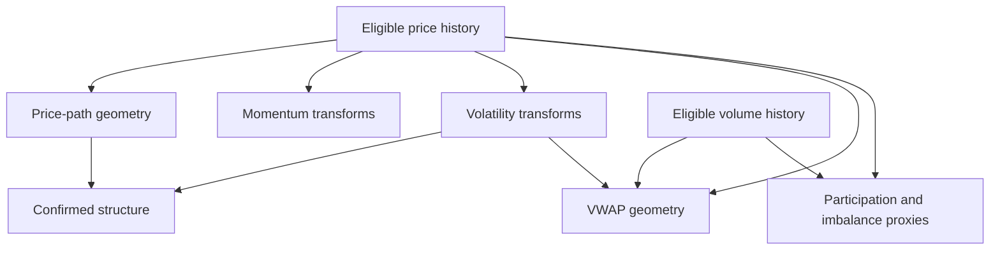

# 07 — Feature dependencies, qualification and ablation

**Status:** execution-grade research draft for incumbent-owner ratification. No feature pipeline, market experiment, model, production repair or schema amendment was implemented by this commission. Proposed feature IDs below are specifications, not installed registry entries. Chapter 04 owns clock/source mode, chapter 06 owns labels, chapter 08 owns models, and chapter 09 owns splits, trial budgets and promotion criteria.

**Decision:** reuse Terminal's existing arithmetic, shared suite producers and confirmation-time contracts through the incumbent research/data owners. Admit each exact implementation and source mode separately. A chart indicator is neither an independent information source nor automatically a historically available research feature. The first proposed proof domain remains `PRICE_L30M_30M_v1`: qualified completed one-minute RTH bars at five-minute landmarks, complete prior and future 30-minute windows, and the exact materiality convention in chapter 06. Its data admission remains pending; five-minute files cannot substitute for that one-minute label.

## 1. Evidence and version boundary

The static Terminal census is pinned to protected master `ad36a332cd4b53af1d917a94f6fb3a10e27dad84`, rechecked on 2026-10-06 at 23:24 UTC. [Appendix: Terminal primitive matrix](appendices/TERMINAL_PRIMITIVE_MATRIX.md) preserves **40 exact implementation variants**, F01–F40, with formula/defaults, timeframe, session behavior, causality/emission, research status, historical coverage, incremental evidence and concrete reuse. Its [machine-readable form](appendices/TERMINAL_PRIMITIVE_MATRIX.json) preserves the same rows and Txx source IDs, with exact source anchors.

All forty rows remain `BUILT_NOT_PROVEN`, descriptive/proxy-only, or otherwise conditional on the stated admission gate. No inspected primitive establishes conditional out-of-sample incremental value for this commission's target. `UNKNOWN` is the evidence result, not a neutral predictive value. Published or inherited results elsewhere in the estate retain their original target, population and source limitations.

The source/coverage ceiling matters before feature choice. The inspected extended candle path admits 04:00–20:00 ET, while an overnight quote path is separate; seconds are a short zoom lane rather than deep history. The inherited Oct 2 inventory contains uneven five-minute/hourly history without historical per-observation availability or PIT membership proof. Therefore economic-day/overnight features, native microstructure and a one-minute archive are **not established by that inventory**. The existing qualifier can distinguish corrected from as-observed inputs; a consumer must not upgrade a whole feature vector to its strongest dependency's mode. [T01–T08]

## 2. Dependency families: transformations versus added observations

Use eleven explicit families: `PRICE_PATH`, `VWAP_GEOMETRY`, `VOLATILITY`, `MOMENTUM_DERIVED`, `STRUCTURE`, `VOLUME_PARTICIPATION`, `MICROSTRUCTURE`, `RELATIVE_CONTEXT`, `OPTIONS_POSITIONING`, `CATALYST`, and `EXECUTION`. Clock, identity, adjustment, source health and coverage are mandatory dependencies and controls. They are not free confirmations of a market thesis.

This DAG shows the most easily double-counted price/volume relationships. The complete family table follows; a dependency arrow means the child cannot exist independently of the parent, not that the parent causes a future return.

| Family | Primitive inputs and dependencies | Information interpretation / Terminal reuse |
|---|---|---|
| PRICE_PATH | Qualified price path, elapsed time and fixed causal references. | Same underlying price observations transformed into distances/shape; F07–F10 and F18–F19 supply pieces. |
| VWAP_GEOMETRY | Price **and volume**, declared reset/anchor; volatility additionally enters sigma/ATR distances. | Adds volume to a price-only model, but distance, band and z-distance share a center; F01, F11–F13. |
| VOLATILITY | Price changes/ranges and training-only scale estimates. | Different price-path representation, not an independent tape; F04–F05, F09–F10, F29–F32. |
| MOMENTUM_DERIVED | Price history, smoothing and optional volatility normalization. | RSI, stochastic, MACD and derivatives overlap heavily; F14–F17, F33–F35, F37. |
| STRUCTURE | Price pivots/thresholds, confirmation lag; often ATR and sometimes volume. | Events summarize price/volume geometry; they do not observe institutional intent; F18–F28. |
| VOLUME_PARTICIPATION | Eligible volume/trade counts, price direction/location for signed proxies, prior same-slot baseline. | Volume is an additional observation to OHLC price. Multiple volume transforms share it; F03, F06, F13, F28, F36. |
| MICROSTRUCTURE | Qualified synchronous bid/ask/size, maintained book and/or sequenced trades. | Adds observations absent from OHLCV. CVD approximations and drawn liquidity pools cannot substitute; current input qualification is unestablished here. |
| RELATIVE_CONTEXT | Own path plus contemporaneous benchmark/peer paths and then-known membership/beta. | Other instruments add context; several residuals still share one market factor. Existing F39 views have different definitions. |
| OPTIONS_POSITIONING | Option quotes/trades/OI/contract definitions, sensitivity model and underlying price. | Additional option observations with their own source dates and assumptions; price-normalized distances retain price dependency. F40 is a qualified display starting point. |
| CATALYST | Dated scheduled events, publication/receipt evidence, issuer/market identity and coverage status. | Additional event information; unknown coverage is not absence of a catalyst. Existing Radar remains catalyst/episode consumer. |
| EXECUTION | Reachable quote side, size, market status, route, latency and fee model; volatility may scale cost. | Feasibility and cost of an action, distinct from prediction. Existing OHLCV cannot establish fills or accessible depth. |

Store the transitive dependency closure with each definition. A dashboard containing RSI, Trend Engine and EMA votes cannot be called three new sources. Product explanations may say “price momentum and volume participation agree”; they must not count five correlated transforms as five independent confirmations. No composite indicator count becomes a confidence probability.

## 3. Proposed feature descriptor and availability contract

A feature definition belongs in the **existing experiment/species and dataset lineage**, referenced by the accepted owner. The following descriptor is a draft of required semantics, not a new feature store or a field to insert into Radar's strict episode schema.

| Descriptor group | Required fields and rule |
|---|---|
| Identity/version | `feature_id`, family, formula version, Terminal source pin/path where reused, producer version, explicit parameters, dependency IDs, deterministic formula digest. Cosmetic label changes do not change math identity. |
| Subject | Canonical security, economic day, venue/session, landmark and typed native episode/candidate relation where applicable. No ticker-only cross-owner join or fabricated episode ID. |
| Measurement | Value type, units, signedness, price/volume basis, adjustment vintage, normalization method, missing reason; vectors declare ordered components. |
| Grain/window | Native observation grain, aggregation contract, window in elapsed time or bars explicitly, reset policy, anchor identity and confirmation rule. `20 bars` never silently means `20 minutes`. |
| Time | Decision cutoff, last input event end, latest evidenced source-known time, anchor/confirmation-known time, feature computation completion, publication and consumer receipt separately. |
| Evidence mode | Chapter 04's `TRUE_POINT_IN_TIME`, `RECONSTRUCTED_CAUSAL` or `FINAL_VINTAGE_RETROSPECTIVE`; assumptions and permitted claims propagate through the dependency graph. |
| Support | Observed/required intervals, distinct baseline sessions, valid benchmark pairs, source continuity, minimum support, coverage mask and rejection reason. Zero activity requires observed coverage; it is not missing data filled with zero. |
| Admission | Static audit result, causal acceptance receipt, historical source manifest, fitted-transform/calibration manifest where relevant, experiment/trial ID and incremental-evidence status. |

For actual PIT computation, every dependency and required confirmation must be usable by cutoff t; the resulting feature cannot be usable before computation completes. Record source-known-through and actual completion separately. A reconstructed replay may use a **separately named assumed-availability time** derived from a frozen latency policy; never write that assumption into an observed receipt field. Physical research runtime today is recorded as runtime, not pretended historical delivery.

Observation failures return null plus a typed reason, such as `INSUFFICIENT_WARMUP`, `SESSION_UNSUPPORTED`, `BASELINE_INCOMPLETE`, `SOURCE_GAP`, `STALE_WITHOUT_CONTINUITY`, `ANCHOR_NOT_YET_CONFIRMED`, `PIT_UNAVAILABLE`, `ADJUSTMENT_AMBIGUOUS`, `MEMBERSHIP_UNKNOWN` or `EXECUTION_SIZE_UNSUPPORTED`. An inferred/default neutral 0 or 50 cannot cross this gate as an observed feature. Availability may differ by family; a qualified price-only model remains a distinct available variant when an option or book family is absent.

## 4. Complete candidate tensor

The formulas here define **proposed research candidates**, version family `llr24.features.v0-draft`. They are not claims that Terminal implements every field. The appendix is authoritative for the forty **existing** formula versions. All incremental evidence below is `UNKNOWN` until chapter 09's paired evaluation; all historical support is per security/session/window/source mode, never inferred from feature existence.

Let P_t be the specified qualified price basis, not a mixture of close, bid and offer. Let W be a fully observed trailing elapsed-time window; L_W/H_W its causal low/high; r_W=log(P_t/P_(t−W)). Define scale a_t from the frozen trailing ATR/range convention, with zero/unsupported scale unavailable rather than silently replaced. An initial price-only feature uses no spread, consistent with chapter 06. Quote-based variants receive different IDs.

### 4.1 Price, VWAP, volatility and momentum

| Candidate bundle | Proposed formulas / frozen choices | Grain, session, known-at and history gate |
|---|---|---|
| P01 low/high distances | `(P_t−L)/P_t` and `(H−P_t)/P_t`, also divided by a_t as separately named variants. L/H may be trailing 5/15/30/60m or a separately admitted rolling24H window, current segment-so-far, economic-day-so-far, PDL/PDH or PWL/PWH. | Completed 1m initial grain; precise basis and elapsed-time window. Full-day **final** extremes are outcomes and prohibited inputs. Whole-day-so-far requires admitted overnight coverage; PDL/PWL require completed, known prior periods. F07–F08 references are not calendar authority. |
| P02 undercut/reclaim/drawdown | Undercut `(fixed_reference−current_low)/a_t`; reclaim `(P_t−fixed_reference)/a_t`; drawdown `P_t/H_W−1`. Fixed reference records source, creation and expiry; undercut magnitude alone has no bullish interpretation. | Reference frozen before event assessment. Current state may evolve, but an earlier emitted reference/value is immutable. Initial target reference is the exact L₀ in chapter 06. |
| P03 velocity/acceleration/curvature | Velocity `r_W/W`; acceleration is successive causal velocity difference divided by elapsed time; curvature uses a backward-only quadratic fit on log price over registered W. Use W=5/15/30m first; 60m is a separately budgeted support extension. | No centered smoothers or future padding. Missing intervals invalidate a required continuous window. Longer-window arms must report the change in eligible landmarks and use matched comparison. |
| P04 candle geometry | Body `(C−O)/(H−L)`; close location `(2C−H−L)/(H−L)`; lower wick `(min(O,C)−L)/(H−L)`; upper wick `(H−max(O,C))/(H−L)`. Zero-range status is separate. | Completed bar only; signed body/close-location and unsigned wick fractions. Preserve native grain because aggregation changes shape. |
| P05 failure/higher-low geometry | Known prior support undercut then causal close reclaim; higher low compares successive **confirmed** lows; record undercut size, confirmation delay, support distance and time since event. | Choose either chapter 06's fixed two-completed-minute reclaim rule or an explicitly named suite rule. Do not blend their clocks. SFP/pivot requirements are F18–F20. |
| W01 reset VWAP | `sum(V×TP)/sum(V)`, TP=(H+L+C)/3, with separate economic-day, overnight, PRE, RTH and AH reset IDs. Weighted sigma from the same admitted observations. | OHLCV version is a bar approximation, distinct from trade-price VWAP. Current F01 resets display calendar day, not economic day, and does not stop at16:00. Unsupported segments stay unavailable. [T15] |
| W02 anchored VWAP | Same arithmetic from an explicit numeric/source anchor; low anchor uses declared confirmation rule, catalyst anchor uses first admitted bar after **known publication**, not hindsight event timestamp. Auto-selected as-of low/volume anchor is a separate endpoint-only variant. | Store anchor identity and known time. Future-confirmed low may be drawn earlier but first usable only on confirmation. Vol-spike is not an earnings timestamp. F11–F12. |
| W03 distance/reclaim/hold | Signed `(P_t−VWAP)/P_t`, sigma-distance where sigma>0, close-cross event and elapsed confirmed hold time above/below the fixed/causally evolving center under a named rule. | VWAP distance/band/z-distance share a family. Hold time uses only elapsed known observations, never future persistence. Gaps interrupt a required continuous hold. |
| V01 realized volatility/ATR | Sum of squared completed log returns over W (and its square root); optionally sample SD with divisor N−1 as a different feature. ATR uses frozen Wilder seed/length from F10; raw range H_W−L is separate. | W=5/15/30m initially; unannualized units explicit. Daily ATR14, intraday ATR14-bars and DayStats' short-history average TR are different. F09 is not automatically Wilder ATR14. |
| V02 range/width/squeeze/shock | Range-so-far divided by a known prior baseline; BB/KC widths normalized by center or a_t; TTM exact F04; expansion is trailing width change; shock is signed return divided by a prior-only scale, with absolute amplitude separate. | Freeze BB population/sample SD and KC center/TR conventions. No final-day range denominator. Different session and time-slot scales require adequate **prior** sessions, not future sessions or pooled final-window statistics. |
| MOM01 oscillator levels/dynamics | Exact RSI/price stochastic/true StochRSI/MACD variants; first and second backward differences, slope per elapsed minute, line-minus-signal, extreme-duration and threshold-to-extremum turn speed after confirmation. | Exact input grain and warmup. Pre-register thresholds; do not retrospectively start a duration at the final plotted trough. F14–F17/F33–F35 retain distinct identities. |
| MOM02 divergence | Shared oscillator-pivot regular/hidden divergence from F37; signed price and oscillator differences and their span can accompany the categorical event. | Earliest usable at second pivot's confirmation, not pivot anchor. Price-pivot and oscillator-pivot divergences are distinct hypotheses. |

### 4.2 Structure and participation

| Candidate bundle | Definition and reuse | Qualification |
|---|---|---|
| S01 structure events/state | F18–F27 confirmed pivots, BOS, CHoCH, CISD, SFP, default volume/price-action order blocks, FVG, SR clusters, premium/discount and pattern geometry. Record event type/direction, reference, distance, age, confirmedAt and invalidation state. | Events and final drawings are different objects. Keep failures and dated invalidations. Optional OB peak is excluded as currently stamped; no product repair is authorized. Freeze ATR/volume dependencies and mitigation rule. |
| S02 profile/POC/VA reaction | F13 prior-window rolling POC or a stored then-known profile snapshot; signed distance to POC/VAH/VAL; touch, cross, reclaim and elapsed hold measured against that snapshot. | Bar profile allocates volume heuristically across/at price; it is not actual volume-at-price tape. Exclude F28's retrospectively scanned final-POC event series. Profile bounds/anchor/metric and bin count are versioned. |
| Q01 slot/cumulative RVOL | Current slot volume / mean same-slot volume from prior admitted sessions, and cumulative equivalent. Initial baseline10 prior sessions with at least3 **qualified complete** sessions; record actual support and policy for sparse slots. | F03's complete historical array is not prefix-causal. Reuse arithmetic only through independently computed as-of endpoints and prior-only baselines. No after-hours contribution is silently labeled RTH. |
| Q02 climax/decay/reclaim participation | Climax is high prior-only volume percentile **plus separately signed price movement**; post-climax decay is trailing volume divided by frozen climax/reference volume; reclaim participation is volume through confirmed reclaim relative to same-slot baseline. | High volume alone is unsigned. Climax selection must be causal; no final-session maximum used as an earlier anchor. Minimum percentile sample and incomplete-bar rejection are frozen. |
| Q03 volume imbalance | Preserve F06 day-reset close-location-volume sum and F36 cumulative/demeaned normalized proxy as separate names. Actual signed trade sum and aggressor balance belong to MICROSTRUCTURE. | Name surrogate `ohlcv_close_location_imbalance`, never measured aggressor delta. Zero-range fallback, normalization window and calendar reset are part of version. |

### 4.3 True microstructure, relative context, options, catalysts and execution

| Candidate bundle | Proposed definition / information | Required native support and limits |
|---|---|---|
| U01 spread/depth/microprice | Spread=a−b and spread/mid; same-slot prior-session spread percentile. Queue/depth imbalance `(Q_bid−Q_ask)/(Q_bid+Q_ask)` for declared level/depth window. Microprice `(a×Q_bid+b×Q_ask)/(Q_bid+Q_ask)` minus midpoint. | Simultaneous valid prices/sizes in one declared venue/consolidation scope, locked/crossed policy, continuity and receipt clocks. Depth levels are not silently equated with accessible consolidated liquidity. No qualified history established by Terminal OHLCV. |
| U02 OFI/order activity | At successive best quotes, bid contribution is `1[b_n≥b_prev]Qb_n−1[b_n≤b_prev]Qb_prev`; ask contribution is `−1[a_n≤a_prev]Qa_n+1[a_n≥a_prev]Qa_prev`; sum over a declared window. Signed trades sum direction×size under supplied/qualified side convention. | Sequenced L1 quote changes or richer maintained book; no calculation from OHLCV. Inferred trade-side classification carries method/error status separately from observed side. Auction messages are a distinct event class. |
| U03 replenish/withdraw/rates/age | Additions/cancellations/executions at declared levels; recovered displayed size after consumption; count quote/trade events per observed elapsed second. Keep last-update age, heartbeat age and gap/reconnect state separately. | Event semantics needed to distinguish withdrawal from execution. Without order events, aggregate-size changes are only a proxy. Quiet unchanged valid quotes differ from stale snapshots without continuity. No invented zero rates during a gap. |
| R01 market/sector residuals | Own log return minus β×benchmark log return at common endpoints; β from a separately frozen prior-only estimator. Candidate β baseline uses60 completed paired prior RTH daily returns, no future fitting. SPY, QQQ, sector, ES/NQ and theme/industry variants remain distinct. | Matched clocks/known time, corporate-action/roll basis, security mapping and benchmark coverage. Futures clocks differ from equities. Zero benchmark variance or insufficient pairs makes β unavailable. Preserve prior failed residual-reset mechanisms; this is a new test only if independently registered. |
| R02 breadth/recovery/leader state | Fraction of then-known peers above a fixed causal reference/reclaim; median peer return, rank of own residual and change in breadth across registered W. | Freeze as-of membership, weighting and minimum cohort support. F39 heatmap means change versus current universe mean; sector map consumes21/63-session ratios, not this tactical residual. No survivor basket or wrong-time peer join. |
| O01 positioning geometry | Admitted underlying-root OI/strike/expiry concentration, absolute gamma, separately signed gamma/flip/walls, delta/charm/vanna, 0DTE share, expiry/OPEX state and distance to dated levels. | Use existing option owners/units/contract definitions. OI stock and intraday volume flow are different; preserve each contributor's source-known time, as-of and age. Signed dealer exposure requires an explicit sign/position assumption. F40 supplies display qualification, not measured dealer inventory. |
| O02 option prices/flow | IV level/change, skew, term structure, expected-move scale and intraday option volume/qualified signed flow; compare index and single-name support separately. | IV and sensitivities depend on pricing/input conventions; record model/version, units, stale legs and liquidity. Do not let a fresh underlying refresh relabel yesterday's OI or stale skew as current. No unverified “dealer hedging pressure” from signed aggregate alone. |
| C01 catalyst state | Typed issuer/market news, scheduled earnings/macro release, unexpected event, time since known publication, time to a known schedule; event importance/coverage remains qualified. | Preserve `NO_QUALIFIED_EVENT_OBSERVED`, `COVERAGE_UNAVAILABLE`, scheduled and unexpected states. Publication, vendor receipt and corrected event time differ. A later classification cannot be backdated; unknown is not “technical move.” |
| C02 regime/status | Prior-only volatility/trend regime, contemporaneous index shock, halt/LULD and auction state from a qualified status source. | Realized future regime is a label, not input. A halt spanning a session boundary stays a halt; future end time is unavailable until observed. Scheduled session metadata uses then-effective calendar version. |
| E01 execution/actionability | Reachable spread, available size at proposed q, source-supported slippage/fees/latency, execution cost divided by causal volatility, and an explicitly defined overnight liquidity category. | Chapter06's initial benchmark q=100 and cash/fee conventions govern. L1 insufficient size is unavailable, not a guessed L2 sweep. Touch is not passive fill. Liquidity category is a transparent feasibility summary, not calibrated price prediction. |

Options/catalysts/microstructure remain conditional extensions until their own data and evidence gates pass. This tensor describes the question space; it does not authorize collecting every feed or fitting every interaction.

## 5. Signedness and semantic traps

| Quantity | Required interpretation |
|---|---|
| Return, velocity, MACD/slope, close location | Signed in a declared price direction and units. Chart color/localization never changes the numeric sign. Bottom and top models need separate symmetry tests; a negated bottom score is not accepted exit intelligence. |
| ATR, realized volatility, ADX, range, total volume, RVOL, absolute gamma | Unsigned magnitude/activity. Large values do not identify bullish direction. DI+/DI−, price sign and signed exposures remain separate fields. |
| RSI/Stoch bounded levels | A high/low oscillator level is not a probability. Level, slope, acceleration, time in extreme and divergence have different definitions and dependencies. |
| VWAP distance / sigma distance | Signed distance to the same underlying center; neither is independent support from its band. A zero denominator is unsupported, not an extreme score. |
| Volume delta / CVD | F06/F36 are OHLCV approximations. Actual trade-side signed volume needs native evidence; cancel/order flow and trade flow are also distinct. |
| Options exposure | Absolute concentration is unsigned; signed gamma/charm/vanna needs declared model, sensitivity units and dealer-position assumption. Summing incompatible units is prohibited. |
| Spread/cost/executable return | Spread is an execution cost magnitude under a valid quote; fee/rebate conventions are explicit. Buy at reachable offer and sell at reachable bid under chapter06; no midpoint fill assumption or double-charged fees. |

**Naming lock:** classic registry key `stochrsi` deliberately means price stochastic14/3/3. Classic `macd` is MACD-RSI: RSI14, EMA14−EMA60, signalEMA5. Premium MACDX is default price EMA10−EMA20, trailing-max-absolute250 normalization, then signalEMA9 on the normalized line. Technical summary has conventional MACD12/26/9 and true StochRSI. Classic flat RSI can return100; suite flat RSI returns50. These must have different feature IDs. [T22–T25; T31; T47–T48]

## 6. Static causal hazards and admission witnesses

The findings below are **STATIC_CODE_FINDING**, not demonstrated live incidents. A product renderer may legitimately draw earlier geometry after confirmation. Research must preserve when that information became available. No production repair is proposed here.

| Finding | Minimal analytical witness / current behavior | Required research disposition |
|---|---|---|
| RVOL | With baseline3, session volumes10,10,10,100 at one slot yield prior baseline10. Appending another session changes prior baseline to40 and rewrites the earlier session's RVOL from1 to0.25. | Full historical array fails prefix invariance. Compute/store each cutoff's endpoint from that cutoff's qualified prior sessions. [T15] |
| Automatic AVWAP | Lows10,9 choose second anchor; appending low8 moves anchor and makes the old second value null. Final-window max-volume anchor has the same issue. | Fixed declared anchor or separately named as-of endpoint variant. Never export retrospectively redrawn series as past knowledge. [T20] |
| Optional OB peak | Candidate volume100 plus future volume50 permits peak; future150 does not. Code reads i+1 but creation is stamped i with no confirmedAt. | Exclude this optional method as currently stamped. Default volume/price-action methods are separately reviewed, not implicated by this explicit next-bar comparison. [T36] |
| Money-flow-profile touches | Future high-volume bar changes final POC/bins; the scan can add/remove an earlier historical touch against that changed threshold. | Use then-known snapshots or genuine prior-window rolling POC; exclude the final-POC historical event series. [T42; T20] |
| Trend autoOpt | Future bars change best sensitivity over final2000 bars, then redraw earlier state. | Default OFF fixed parameters only; chronological parameter selection is a separately budgeted experiment. [T43] |
| Pivots/divergence/OR | Right-wing5 pivot at i is unavailable until i+5; final fifteen-minute OR includes highs not known at its09:30 left edge. | Preserve anchor and confirmation/end times. No straddling coarse bar for an exact window. [T29; T32–T33; T15] |
| Rendering and grouping | SFP defaults hide invalid patterns; swing geometry may replace earlier extremes. Synthetic2x/4x groups start at array index0 and can shift when history prefix changes. | Train on retained dated state/events; use canonical timestamp/session aggregation rather than array position. [T34–T35; T53] |
| Session/normalization | Session VWAP/CVD reset calendar display date; RVOL omits pre-open but has no explicit16:00 stop. Percentile warmup can emit50 and normalization can emit0 for unsupported inputs. | Chapter04 clock adapter plus explicit warmup/support mask; no direct substitution of UTC into legacy display-epoch helpers. [T14–T16; T31] |

## 7. Required acceptance cases and shared factory reuse

Later implementation must produce the following receipts before a feature becomes admitted. This is a test specification; the tests were **not run** by this commission.

1. **Future-bar/prefix case:** at each representative cutoff, compute solely from its admissible prefix; append or perturb later prices, volume, events, calendar updates and source revisions. Previously emitted values, anchors, confirmations, availability and dependency-prefix IDs must not change. An as-of endpoint wrapper is evaluated as such, not by pretending its renderer's full past array is causal.
2. **Correction case:** append late/correct/cancel records with receipt after cutoff. PIT output must retain original known state. A corrected-vintage rerun has a new source mode/vintage and cannot overwrite that result.
3. **Boundary/grain case:** ordinary/holiday/early-close/DST/economic-day transitions, midnight, delayed auction and halt; bar end versus start, window straddling, truncated first session and missing slot. Expected membership comes from chapter04's owner. No 20:00 reset or overnight support is invented by concatenation.
4. **Normalization case:** add a future complete session and verify unchanged prior RVOL/spread percentiles, beta, scalers and universe weights. Inspect minimum-support, flat-series and zero-denominator behavior. Fitted transforms read training data only.
5. **Anchor/event case:** counterexamples for peak OB, right-wing pivots, next-bar SFP reclaim, profile migration and catalyst late receipt; event known time is at least its latest confirming dependency. Keep failure/invalidation events after they disappear visually.
6. **Identity/adjustment/universe case:** split/reverse split, dividend or mapping revision, delisting/new member, adjusted option and futures roll. Preserve contemporaneous execution economics and the then-known normalization/membership vintage. Today's survivors cannot define past eligibility.
7. **Outcome-separation case:** feature generation is given no MFE/MAE, final economic-day extrema, future fill, survival result, label or future regime. Lineage validation rejects any outcome-derived dependency, including hidden preprocessing or event anchoring.
8. **Replay parity case:** for available PIT receipts, offline and prospective consumers use the same semantic input prefix and formula version and produce equivalent outputs under frozen numeric precision. Runtime receipt timestamps are compared separately. Without PIT evidence, record `PARITY_UNPROVEN`; reconstructed causality is not observed live parity.

Reuse `intraday_qualification.py` and the Macro-derived session projection for admission; metadata/defaults and shared producer loading in Terminal suites for formula identity; pure math and `SuiteEvent.confirmedAt` for computation/timing; and accepted evidence owners for immutable research rows. The canvas host consumes bars but does not enforce closure/source arrival, so it is not the admission service. Chart object caps, DOM state and screenshots cannot serve as the research event archive. [T06; T08; T26–T30]

The current Radar firewall and exact episode schema prohibit arbitrary probability/confidence/MAE/MFE/feature attachments. Chapter10's joint-owner amendment is required before serving any prediction annotation. Do not place a tensor into `feature_snapshot`, catalyst or health fields. Shared factory reuse is an implementation proposal under the existing owner, not a second detector, clock, event journal, ranking engine or prospective ledger.

## 8. Matched ablation specification

Every arm inherits chapter06's exact target/basis and chapter09's chronological splits, training/calibration separation, purging/embargo, trial register and acceptance bars. The twelve comparisons below are a **staged inventory**, not twelve free fitted configurations plus unlimited tuning. Source-blocked arms stay blocked. The first tournament's twelve-configuration budget in chapter09 includes feature/threshold variants; expanding it requires a pre-outcome registry amendment, never consuming the sealed holdout to choose families.

| Arm | Frozen comparison / purpose |
|---|---|
| A00 incumbent Radar | Existing species/state and candidate availability on the canonical candidate-landmark population. Compare policy precision/coverage and timing; raw categorical states have no Brier score unless a separately trained past-only probability mapping is registered. Do not fabricate Radar IDs for market-grid controls. |
| A01 near-current-low | Fixed causal distance-to-reference rule, plus buy-now/fixed-wait/no-entry policies under common terminal/capital. Threshold references chapter06 or an explicitly registered variant, never best hindsight low. |
| A02 price path | Clock/liquidity B0 and then price-path+volatility B1. This is the main baseline for later families, not a deliberately weak oscillator comparator. |
| A03 VWAP/reclaim | Add admitted W01–W03 to A02; separately test the fixed VWAP/reclaim rule under the same policy ruler. |
| A04 momentum | Add frozen RSI/price stochastic/true StochRSI/MACD identities/dynamics to A02; compare within-family variants without counting each as new information. |
| A05 Terminal technical set | A02 plus all **admitted** day-trade/premium transformations; exact included Fxx IDs and exclusions frozen. Unsafe final-array variants do not become eligible because they are chart defaults. |
| A06 structure-only/addition | Common controls plus S01–S02 for descriptive standalone comparison; also A02+structure to measure conditional increment. Distinguish event tape from final geometry. |
| A07 volume/RVOL | A02+Q01–Q03; track cross-dependent VWAP/profile bundles explicitly. Actual signed trades remain a native-source arm. |
| A08 microstructure | A02+qualified L1; A05+L1; then L1 versus L1+L2/L3 on identical accessible source scope. No synthetic quote book from candles. |
| A09 options | A02+options; A05+options; price+technical+microstructure+options to test residual value after stronger controls. Index and single-name claims separate. |
| A10 relative/catalyst | A02+relative, A02+catalyst and their registered combination. Preserve membership, source-known time and coverage distinctions. |
| A11 full/removal | Full set of admitted families, then one-family removals and prespecified source-closure removals. Execution gating/policies are evaluated separately from prediction feature addition. |

For each arm, freeze learner class, hyperparameter/trial allowance, random seeds, feature preprocessing, target, cost policy and cutoff schedule before evaluation. Refit the learner on each training fold for add/remove comparisons; zeroing a trained input is a sensitivity diagnostic, not the primary ablation. Keep model complexity comparisons separate by holding the input set fixed. Interactions consume trials: start with mechanistic proposals such as reclaim×participation, spread×size, or dated options context×price location, not all pairwise products.

**Two removal operators answer different questions.** `DROP_REPRESENTATION(F)` removes the named outputs and copied/composite descendants, measuring representation redundancy conditional on other admitted evidence. `DROP_SOURCE_CLOSURE(S)` removes a raw source and all descendants, measuring the value of that information source. Removing momentum must remove its copied dashboard/RSI-MACD/divergence contributions; removing volume must also remove volume-derived VWAP, profiles, RVOL, proxy CVD and volume-conditioned blocks. Removing an ATR column while retaining ATR-conditioned structure is not “no volatility information.” Report the exact dependency closure, never silently switch to a different method to preserve a feature.

**Two denominators are mandatory.** First report paired skill/utility differences on the intersection where both arms are computable at the same symbols, dates, landmarks, source vintage, grain and latency. Then report coverage, abstention and policy utility over the full frozen intended population, carrying unavailable/censored outcomes under chapter09. A rich feed cannot earn apparent skill by dropping the opening drive, hard symbols or stale periods. Future coverage used for outcome resolution cannot silently alter past feature eligibility. Repeated landmarks retain their episode/day dependence.

For prediction, use chapter09's proper-score/calibration and support gates. For actionability, use its common-cohort risk, wealth, severe-path and exposure gates with chapter06's execution conventions. The same quote validity, minimum size, latency and fee laws apply to compared policies; optional execution predictors may change the selected action, not redefine which losing cases count. A useful predictor that fails policy gates remains descriptive.

If a family removal has no meaningful degradation within the preregistered practical-equivalence region, call the family **nonessential on this task/cohort**, not universally useless. If a feature fails only one session, do not pool that failure away to claim 24H validity. Choose the simpler admitted representation when performance is practically equivalent, considering source cost, latency, support and stability.

## 9. Negative controls and required experiment outputs

Register a future-independent random factor; a causal donor/permutation control using only earlier eligible days; intentionally wrong-session VWAP; deliberately older-but-known options snapshots; and wrong-sector context under known membership. Match support and transformation scale. None may use future donor data or outcomes. Unexpected stable improvement triggers a pipeline/dependence audit; wrong-session or stale context is not guaranteed economically irrelevant, so a single noisy gain is not by itself proof of leakage. Controls and reruns consume the trial ledger and cannot be used to select a favorable holdout.

Each later experiment must produce: feature-definition/dependency manifest; source/clock/availability coverage by family; causal-case receipts; admitted/excluded Fxx and proposed candidate IDs; training/calibration/test hashes; attempted-trial register; matched and intended-population add/remove tables; per-session/horizon/event support; paired uncertainty and practical-gate result; source-cost/latency/coverage delta; and all failed/abstained strata. Outcomes and immutable pre-outcome predictions remain with their incumbent evidence owners.

**Chapter07 completion ruling:** the feature space and qualification/ablation design are specified. Existing formula reuse is concrete; incremental value, causal adapters, admitted native data, forward rows and accepted product integration remain unproven. No stage is promoted merely by the completeness of this document.

## Txx source key

Txx IDs are preserved from the static Terminal census. Exact pinned paths, line anchors and full-file hashes are embedded in the JSON appendix and listed in the Markdown appendix. Ranges such as T01–T08 refer to those individual registered sources; they are not newly invented source IDs.
