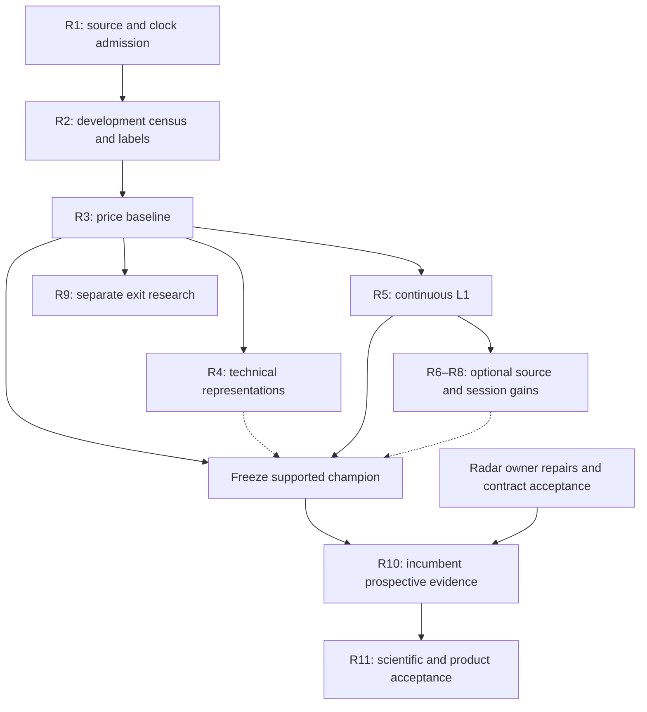

# 16 — End-to-end program masterplan

**Disposition:** execution-grade recommendations within the existing programs. R0's research census is delivered by this package at the recorded source pins. R1–R11 have not been commissioned, dispatched, implemented or accepted by this research session. Wave labels organize this document; they create no new workstream, registry, queue or execution authority.

## 1. Critical path and bounded parallelism

The first useful capability is a trustworthy, narrow RTH forecast of whether an observed local low will be materially breached during the next 30 minutes. The first economically promotable capability additionally needs qualified quotes, paired entry policies and prospective evidence. “All sessions, all heads, all indicators” is not the first release condition.

The dependency order is:

1. **R0 → R1:** preserve the current owner map; qualify source rights, actual coverage, clocks and causal feature inputs. Reserve untouched test dates before any outcome-bearing census.
2. **R1 → R2 → R3:** construct the development-only low/high census and exact labels; run a bounded price/time/volatility tournament. Source/label feasibility can legitimately stop a claim before model fitting.
3. **R3 → R4 and R5:** test accepted technical representations and genuinely additional L1 observations. R4 depends on TOI W1 feature semantics; R5 depends on continuous quote/trade admission. They may share frozen baseline predictions, not silently different cohorts.
4. **R3/R5 → owner-native prediction capture → R10:** a frozen supported candidate enters prospective shadow only after the incumbent W5 evidence seam, source-time receipts and Radar annotation contract are accepted. Current Radar cadence and W5 deficiencies are operational prerequisites, not evidence of alpha. [R05–R11; I784-live; I784-timing]
5. **R10 → R11:** scientific acceptance and real-path product acceptance are independent gates. Product design may run earlier using explicitly hypothetical fixtures; calibrated probability display and any decision effects wait for both gates and separate authority.

R6 depth, R7 options/relative/catalyst context and R8 session specialists are **optional improvements**. A qualified simple RTH model may reach shadow without them. The full 24H claim requires R8's per-session transfer qualification; RTH success alone never supplies it. R9 exits can begin after its bid-side source and baseline prerequisites, without delaying the entry question. TOI Compression Release remains its current first revival vertical; Bottom/Top is the later W8 interface. This package does not reorder that program by fiat. [R03–R04; PR8332]

The optional branch is optional as stated in prose: the champion can freeze from R3/R5 without waiting for R6–R8. R4 is also dispensable if it establishes no useful increment. Research branch names and proposed deliverable names below are illustrative paths under incumbent owners; future owners must check their current carriers before writing them.

The direct R3 path supports a price-only claim; R5 is required for executable/economic claims. Dashed inputs are optional refinements. By default keep the common final holdout sealed through the chosen R3/R4/R5 selection program; intermediate R3 comparisons use development/validation only. If the owner instead adjudicates a standalone R3 result by opening its final test, mark that interval consumed immediately. Later R4/R5 selection and champions then require genuinely fresh final evaluation or the separately frozen prospective trial. Reusing baseline predictions does not refresh inspected outcomes. [chapter09]

## 2. Existing owner repairs that must not become duplicate waves

| Existing carrier | Required continuation | Unlock | Boundary |
|---|---|---|---|
| Radar #8547/#8548 and issue Terminal #784 | Consume existing performance repair result and fresh runtime receipt; prove completed passes fit the accepted cadence and source freshness | Optional inference without worsening a degraded publisher | No new quote daemon, forced pack dispatch or state-file repair |
| Radar W5, `scripts/reconcile_entry_radar.py` | Resolve the recorded `WAITING_FOR_LIVE_SOURCE`, absent spool attachment and zero forward-eligible observations through the existing writer/reader seam | Honest prospective trial accounting | Pack publication and historical replay cannot count as live-forward evidence |
| TOI #7107 W1 | Preserve the active source-custody fix; finish hostile equivalence-group membership tests, numeric Bollinger and original Donchian occurrence semantics; hand native budget to W3 | Shared causal feature semantics | Do not repeat already-accepted Connors/RVOL review or bulk reimplement the factory |
| TOI #7094 W2 | Finish six source-use receipts and early-close geometry qualification | Per-use data/clock admission | Regular 4H parity does not grant early-close or all-panel admission |
| TOI #8332 | Reconcile the Oct5 first-vertical steering with W1/W2 and native trial accounting | Compression Release first; later W8 Bottom/Top | Old ceilings and inherited grids are not additive budgets |
| Radar #7275 D1 | Reuse the held minute resolver where its source/label limitations permit | Deterministic ordered minute fallback | Minute order ambiguity and unproven availability time remain; no duplicate resolver |
| Terminal #784 G8 | Real signed-in row → chart proof, truthful family/state copy and coverage counts | Product projection acceptance | Current generic CANDIDATE copy is not a universally valid reclaim claim |

These are dependencies owned by their current carriers. This research does not take their source leases, launch repair workers, merge their drafts or mark their gates complete. If a carrier has finished when the successor starts, consume the exact acceptance and do not redo it. [R01–R04; PR7094; PR7107; PR7275; PR8332; PR8547; PR8548]

## 3. R0 — Current estate and collision census

- **WAVE_ID:** R0.
- **CAPABILITY_UNLOCKED:** a source-pinned map of current capability, stale claims, active carriers, killed mechanisms and permissible reuse.
- **CANONICAL_OWNER:** existing `WS:LIVE-ENTRY-RADAR` for this research packet, with TOI, Terminal, options and Prophet owners retaining their domains; Principal CEO adjudicates cross-owner questions.
- **REPO:** Macro research packet; read-only Mastermind and Terminal references.
- **SOURCE_PATHS:** `agentos/workstreams/WS-LIVE-ENTRY-RADAR.md`; `agentos/workstreams/WS-TECHNICAL-OPPORTUNITY-INTELLIGENCE.md`; `research/DO_NOT_REBUILD.md`; `engine/entry_radar/`; Terminal `terminal/lib/dislocations/`; exact open carriers in chapter01.
- **INPUT_CONTRACT:** protected same-commit procedure; immutable source bytes; current PR metadata; bounded live-runtime receipts with observation times; historical reports with original experiment identity.
- **OUTPUT_CONTRACT:** chapters00–03, source register, current-collision table, decisions and genuine unknowns; no implied promotion or lease transfer.
- **PREREQUISITES:** access to authorized repositories and commission; satisfied for this research snapshot.
- **RESEARCH/IMPLEMENTATION:** research; completed as a documented census, not an independent live product verification.
- **ALLOWED_EFFECTS:** research documents and their delivery; read-only source/runtime inspection.
- **NON_GOALS:** new workstream, worker dispatch, production repair, trading, procurement or universal live-worker census.
- **ACCEPTANCE:** all material rulings resolve to source/proposal/unknown; current heads supersede stale PR body descriptions; all adjacent ownership is mapped.
- **TESTS:** source-reference resolution, exact variant count, draft-versus-merged/issue distinctions, independent contradiction review and changed-scope head check.
- **REAL_PATH_PROOF:** exact source receipts and bounded runtime receipt E01; production claims are attributed to their owner's receipts. G8 remains open.
- **ROLLBACK:** supersede the research statement with a cited correction; preserve historical snapshot and evidence identity.
- **KILL_CONDITION:** a material source error or current collision invalidates only the affected ruling until reconciled.
- **NEXT_DEPENDENCY:** R1 admission, after successor checks only materially changed sources and current custody.

## 4. R1 — Data and clock qualification

- **WAVE_ID:** R1.
- **CAPABILITY_UNLOCKED:** one explicitly admitted source/session/period and a reproducible causal input contract.
- **CANONICAL_OWNER:** incumbent stocks/quote/history data owners; TOI W2 owns shared research data-clock admission; Radar owns its live pack/spool use; C15 owns options/tape qualification.
- **REPO:** Terminal data plane and Macro research consumers; no standalone data service.
- **SOURCE_PATHS:** Terminal `ingest/intraday_qualification.py`, `scripts/qualify_intraday_research.py`, `terminal/lib/intradaySources.ts`, `terminal/lib/intradayShared.ts`, `hub/lib/`; Macro `engine/entry_radar/vendor_minutes.py`; TOI W2 in #7094; entitlement record D01.
- **INPUT_CONTRACT:** chapter04 event/known/receipt clocks and calendar versions; chapter05 source/rights/bytes manifest; fixed 50-name qualification sample, 20 eligible sessions per available era, plus early-close/DST/holiday/split/gap witnesses. These counts scope a pilot, not statistical power.
- **OUTPUT_CONTRACT:** per-source six-receipt admission matrix; raw/normalized hash witnesses; actual as-of coverage; physical history census; event-rate/storage/throughput measurements; bounded vendor estimate if an authorized quote can be obtained without purchase; exact research evidence mode.
- **PREREQUISITES:** current source custody; existing entitlement confirmation for each endpoint; reserve sealed test interval before outcome inspection.
- **RESEARCH/IMPLEMENTATION:** research qualification initially; any collector changes require a separately authorized bounded implementation packet.
- **ALLOWED_EFFECTS:** later authorized read-only sampling within existing rights and spend ceilings; research receipts; source-cost estimate. No subscription activation.
- **NON_GOALS:** full-market tick download, full L3, changing session calendars globally without owner review, treating indicative quotes as executable prices.
- **ACCEPTANCE:** complete event/source/receive/correction lineage; no silent session gaps; quote continuity distinct from quote update age; source-clock claim matches evidence; qualified versus unqualified uses explicit.
- **TESTS:** DST and early close, previous-evening date ownership, late correction, corporate-action vintage, stale stream, valid quiet book, locked/crossed market, missing size and inaccessible venue.
- **REAL_PATH_PROOF:** retained raw record → normalized observation → as-of read with exact timestamps, plus measured physical store census. A fixture is a logic test; actual source receipts admit a dataset.
- **ROLLBACK:** quarantine the failed source/era/consumer use, retain raw receipts and previous admitted source; no history overwrite.
- **KILL_CONDITION:** rights absent; chronology unrecoverable; unacceptable missingness; unaffordable authorized cost; or source only supports a weaker task than claimed.
- **NEXT_DEPENDENCY:** R2 for admitted price data; R5 for continuous L1; R8 separately for each non-RTH session.

## 5. R2 — Development-only market-wide low/high census

- **WAVE_ID:** R2.
- **CAPABILITY_UNLOCKED:** base rates and uncertainty for where meaningful lows/highs occur, plus label feasibility and event support.
- **CANONICAL_OWNER:** Radar research and existing Evaluation OS, using TOI W2-admitted data; data scientist executes the frozen analysis.
- **REPO:** Macro `research/live_entry_radar/` with incumbent data manifests.
- **SOURCE_PATHS:** chapter06 labels; chapter09 protocol; existing `engine/entry_radar/tactical_research.py`; #7275 minute fallback only within accepted scope; `engine/experiments_registry.py`, `engine/trial_ledger.py`, `engine/qledger.py`.
- **INPUT_CONTRACT:** declared development/previously consumed dates; as-of universe with delistings; security master; qualified bars/trades/quotes; separate price-only and executable cohorts.
- **OUTPUT_CONTRACT:** coverage matrix and exclusions; low/high clock atlas; successive-low/reclaim table; supported quote versus raw-print disagreement; cost-of-waiting frontier; count/power inputs; data and label checksums.
- **PREREQUISITES:** R1; frozen exact target definitions; test manifest reserved before outcomes; DNR comparison accepted.
- **RESEARCH/IMPLEMENTATION:** offline research; no model promotion.
- **ALLOWED_EFFECTS:** offline development labels, plots and immutable research outputs under existing registries.
- **NON_GOALS:** fitting a winner, exploring sealed final-test outcomes, replacing live detector identities or assigning executable meaning to bars.
- **ACCEPTANCE:** all eligible and excluded denominators reported; source gaps distinguished from event absence; event support split by session, security group and source vintage.
- **TESTS:** lower print without reachable ask, unsupported quote flicker, same-minute competing events, post-reclaim re-breach, halt/missingness, split and new/unlisted security.
- **REAL_PATH_PROOF:** several hashed real raw-event windows reproduced to labels, including failures; no browser or live-dispatch proof is required for an offline census.
- **ROLLBACK:** invalidate only labels affected by a changed definition; version the correction and mark viewed dates consumed.
- **KILL_CONDITION:** target not identifiable at available grain or economically material opportunity too rare at the accepted precision/cost.
- **NEXT_DEPENDENCY:** R3; qualified quote labels also enable R5/R9.

## 6. R3 — Price-path baseline

- **WAVE_ID:** R3.
- **CAPABILITY_UNLOCKED:** a measured answer to whether simple causal price/time/volatility predicts `PRICE_L30M_30M_v1` beyond a fixed base rate.
- **CANONICAL_OWNER:** Radar tactical research with Setup Species/Evaluation OS registration; independent scientific reviewer adjudicates.
- **REPO:** Macro research; use existing evaluation and trial-ledger owners.
- **SOURCE_PATHS:** chapters06/08/09; `engine/entry_radar/tactical_research.py`; `engine/species_registry.py`; `engine/experiments_registry.py`; `engine/trial_ledger.py`; `engine/qledger.py`.
- **INPUT_CONTRACT:** R1/R2 admitted manifests; exact minute-grid RTH target; frozen B0 clock/liquidity baseline; small causal price path; chronological train/calibration/validation/final blocks.
- **OUTPUT_CONTRACT:** every trial and prediction; selected B1/one shallow booster; reliability and Brier/log-loss results; cluster uncertainty; missingness bounds; support and cost report; accepted/revise/null disposition.
- **PREREQUISITES:** label identifiability; power-sized independent days; DNR reopen distinction; final-test and analysis-script freeze.
- **RESEARCH/IMPLEMENTATION:** offline research only.
- **ALLOWED_EFFECTS:** maximum twelve preregistered fitted configurations in the first tournament, with all choices logged; zero live decision effects.
- **NON_GOALS:** options, L2/L3, deep model search, opening/close/overnight generalization or economic claims from price-only labels.
- **ACCEPTANCE:** exact chapter09 primary proper-score and calibration gates; report unsupported bins and nulls. Economic acceptance is a separate quote-qualified study.
- **TESTS:** label oracle, future-feature rejection, past-only normalization, overlap purging, day-block shuffle, wait/survival placebo and fitted-preprocessing isolation.
- **REAL_PATH_PROOF:** reproducible immutable dataset → frozen code → out-of-sample predictions → metrics; a trained model or high AUC is insufficient.
- **ROLLBACK:** keep B0/price descriptors, archive failed champion and consumed dates; no post-hoc retuning against the same holdout.
- **KILL_CONDITION:** no stable gain beyond time/location; calibration unsupported; leakage; or benefit entirely explained by confirmation delay.
- **NEXT_DEPENDENCY:** R4/R5; an honestly null R3 can terminate the forecast claim while preserving useful descriptive states.

## 7. R4 — Terminal technical-family ablation

- **WAVE_ID:** R4.
- **CAPABILITY_UNLOCKED:** evidence of which accepted technical representations add information or useful compression beyond the price baseline.
- **CANONICAL_OWNER:** TOI shared primitive/evidence owners; Terminal retains display/render ownership; Radar is a consumer, not a second indicator factory.
- **REPO:** Terminal `terminal/lib/` implementation sources; Macro TOI research and evaluation.
- **SOURCE_PATHS:** chapter07 and the exact F01–F40 appendix; `terminal/lib/indicatorMath.ts`, `intradayMath.ts`, `suites/`, `marketStructure.ts`; TOI #7107/#8332.
- **INPUT_CONTRACT:** W1 semantics and clock-qualified shared representations; R3 frozen predictions; dependency graph with source roots, equivalence groups and known-at times.
- **OUTPUT_CONTRACT:** family-level add/remove experiments; representation versus source-closure ablations; matched and intended-population effects; survivor/redundant/unqualified dispositions; full native trial accounting.
- **PREREQUISITES:** R3; W1 unresolved membership/Bollinger/Donchian fixes and causal tests; no generic 40-indicator confluence score.
- **RESEARCH/IMPLEMENTATION:** research, with separately commissioned shared-factory fixes if required.
- **ALLOWED_EFFECTS:** evaluate accepted primitives and bounded hypotheses within a newly frozen later-wave budget; reuse all first-tournament trial history.
- **NON_GOALS:** copying visual backfills into features, per-indicator free trials, synthetic timeframe groupings by array origin or rebranding a killed OHLCV mechanism.
- **ACCEPTANCE:** practical out-of-sample increment after redundancy controls, source cost and coverage; approximate representatives suffice if practically equivalent under the registered margin.
- **TESTS:** future append, prefix removal, pivot confirmation/anchor split, warmup neutrality, session resets, last-session RVOL leakage and adaptive-parameter history redraw.
- **REAL_PATH_PROOF:** causal shared feature at a recorded time agrees with replay-as-known and its accepted producer; display equivalence alone is not research admission.
- **ROLLBACK:** withdraw the affected feature version; retain valid price baseline and prior evidence; preserve display code unless its owner separately repairs it.
- **KILL_CONDITION:** increment vanishes against price/volatility/time, a causal variant loses the apparent effect, or equivalence cannot be qualified.
- **NEXT_DEPENDENCY:** champion freeze for R10 or R7/R8; a null family is dropped without blocking R5.

## 8. R5 — L1 microstructure

- **WAVE_ID:** R5.
- **CAPABILITY_UNLOCKED:** execution-aware low/path labels and a direct test of added trades/quotes beyond bar transformations.
- **CANONICAL_OWNER:** incumbent quote/tape data owners with C15 source-qualification reuse; Radar research and Evaluation OS own the tactical trial.
- **REPO:** Terminal/Macro source adapters under their current owners; Macro research results.
- **SOURCE_PATHS:** chapter12; `research/market_microstructure/commission15/`; Terminal `hub/lib/quotes.js`, `hub/lib/extfeed.js`; chapter05 source manifest; existing quote consumers.
- **INPUT_CONTRACT:** continuously ordered real bids/asks and displayed sizes, trades, conditions, sequence/gap/status, correction and receipt clocks; no indicative quotes or trade-only NBBO substitution.
- **OUTPUT_CONTRACT:** support-completed quote labels; OFI/queue/spread/resilience features; price versus price+L1 matched experiment; initial common-capital buy-now/wait comparison including no/partial fills, latency and terminal uncertainty.
- **PREREQUISITES:** R1 L1 admission; R2 price-versus-executable discrepancy; R3 baseline; C15 signing limitations preserved.
- **RESEARCH/IMPLEMENTATION:** research; no trading connectivity.
- **ALLOWED_EFFECTS:** bounded already-entitled research collection/analysis after future authorization; both proposed research costs and trial ceilings frozen first.
- **NON_GOALS:** true aggressor/customer/dealer claims from inferred signing, guaranteed fills at top quote, book reconstruction from trade snapshots or neural escalation.
- **ACCEPTANCE:** incremental proper score/calibration and chapter09 economic gates on same candidate capital/horizon; intended-cohort missingness and spread/impact sensitivity reported.
- **TESTS:** quiet valid quote versus disconnected stale stream; support knowability; size/participation cap; partial fill/cash; correction and locked/crossed conditions; unreachable quote; source-gap bounds.
- **REAL_PATH_PROOF:** ordered raw quote/trade receipt → causal feature → qualified policy order simulation → fill evidence → common-terminal wealth; all hypothetical fills labelled simulated.
- **ROLLBACK:** stop optional microstructure annotation and retain price-only scope; keep immutable observations and failed-source diagnosis.
- **KILL_CONDITION:** apparent benefit disappears under realistic latency/spread/fill coverage, rests on unreliable trade signing, or fails the practical-risk objective.
- **NEXT_DEPENDENCY:** supported champion → R10; optional R6/R7 and supported-session R8.

## 9. R6 — L2/L3 challenger

- **WAVE_ID:** R6.
- **CAPABILITY_UNLOCKED:** a measured marginal-value decision for depth/order events.
- **CANONICAL_OWNER:** incumbent market-data/tape owners and Evaluation OS; no new book service without a separately demonstrated owner need.
- **REPO:** existing data adapters and Macro research.
- **SOURCE_PATHS:** chapter05 Tier C; chapter12 source ladder; existing C15 source receipts; any future adapter path must be chosen by its data owner.
- **INPUT_CONTRACT:** matched L1/L2/MBO symbol-date-venue windows; exact depth/event semantics, sequence recovery and rights; same targets, labels and latency.
- **OUTPUT_CONTRACT:** L1 versus L1+depth result with source bytes/cost, reconstruction quality, inference delay and uncertainty; purchase/no-purchase recommendation.
- **PREREQUISITES:** accepted R5 baseline and identified residual mechanism; approved bounded estimate; sufficient matched events. No automatic dependency from vendor availability.
- **RESEARCH/IMPLEMENTATION:** optional bounded research; paid acquisition requires separate authority.
- **ALLOWED_EFFECTS:** a small held-out matched pilot after the cost and data gates; no fleet-wide subscription.
- **NON_GOALS:** full-market L3 archive, hidden-liquidity certainty, queue position from aggregate MBP or assuming MBO is globally consolidated.
- **ACCEPTANCE:** preregistered practical increment beyond L1 survives cost, coverage and delay; data burden fits existing storage and throughput envelope.
- **TESTS:** sequence loss/snapshot recovery, cancel/replenish distinction, venue substitution, matched-coverage selection and source-dependency ablation.
- **REAL_PATH_PROOF:** native sequence reconstructs the witnessed displayed book; forecast gain reproduces on untouched matched windows.
- **ROLLBACK:** cancel future acquisition/retention expansion as permitted, disable optional features and retain the accepted L1 baseline and evaluation artifacts.
- **KILL_CONDITION:** only next-tick discrimination with no target utility; no material increment; inaccessible/expensive feed or reconstruction ambiguity.
- **NEXT_DEPENDENCY:** optional champion refinement; failure does not block R10 or productization of simpler qualified scope.

## 10. R7 — Options, relative and catalyst context

- **WAVE_ID:** R7.
- **CAPABILITY_UNLOCKED:** separation of mechanical price path from source-qualified cross-market and event context.
- **CANONICAL_OWNER:** current options/C15 owners; incumbent catalyst and relative/security-context owners; TOI/Radar consume admitted observations; PTSE/OLI retain their own observational boundaries.
- **REPO:** Macro existing options, catalyst and research modules; Mastermind reference context; Terminal display projection only.
- **SOURCE_PATHS:** `engine/entry_radar/catalyst_context.py`; `research/options_intelligence/2026-10-03/SOURCE_ADMISSION_SPEC.md`; C15 report; `research/options_estate/ptse_options_observation.py`; #8333; `engine/prophet_entry_availability_sources.py`.
- **INPUT_CONTRACT:** as-of sector/peer membership and common clocks; known-at benchmark observations; original catalyst publication/revision timestamps; options positions explicitly observed/estimated/assumed with units and source lineage.
- **OUTPUT_CONTRACT:** options/relative/catalyst separate increments and interactions; source-clock audit; matched versus intended coverage; drift/era tables; concrete null/unsupported results.
- **PREREQUISITES:** R3/R5 comparator; C15/TOI admission; no reuse of consumed options eras as fresh holdout; DNR charm/flow qualifications.
- **RESEARCH/IMPLEMENTATION:** optional research.
- **ALLOWED_EFFECTS:** owner-native observation joins and bounded predeclared experiments; all ranking, sizing and execution authority remains false.
- **NON_GOALS:** public OI as known dealer inventory, earnings/news classified with future reports, B3 IDs relabelled as Radar IDs or duplicate options engine.
- **ACCEPTANCE:** stable increment after price/volatility/time controls, repeated across adequate predeclared eras; uncertainty/support and actual delivery lag included.
- **TESTS:** stale ETF at another session, peer survivorship, future news revision, OI release delay, gamma/vanna/charm unit/sign errors and absence versus unavailable news.
- **REAL_PATH_PROOF:** admitted source observation → original known-at join → reproduced prediction; an attractive narrative does not validate the join.
- **ROLLBACK:** remove optional context from inference while preserving truthful descriptive context and its provenance.
- **KILL_CONDITION:** effect is source leakage, assumed position sign, duplicate price information or a killed mechanism without new evidence.
- **NEXT_DEPENDENCY:** optional R8/champion refinement; no dependency for a simpler RTH shadow.

## 11. R8 — Session and regime specialization

- **WAVE_ID:** R8.
- **CAPABILITY_UNLOCKED:** a qualified supported-session envelope, eventually including overnight and transitions.
- **CANONICAL_OWNER:** data-clock owners plus TOI/Radar scientific owners; calendar changes remain with incumbent session source.
- **REPO:** existing source/feature/evaluation paths; no separate session engine.
- **SOURCE_PATHS:** chapters04/08/09; Terminal `hub/lib/usSession.js`, `terminal/lib/sessionBars.ts`; TOI W2 geometry; admitted BOATS or future exchange-era manifests.
- **INPUT_CONTRACT:** explicit session/calendar/source era, per-session source and label admission, adequate event support, global-model predictions and preregistered interactions.
- **OUTPUT_CONTRACT:** global versus pooled/shrunk versus specialist comparison; support/calibration by session; transition failures and unsupported cohort list; exact 24H product coverage claim.
- **PREREQUISITES:** R1 each session; R3/R5 accepted target basis; enough history/prospective collection. Proposed exchange hours must be confirmed when effective.
- **RESEARCH/IMPLEMENTATION:** research; implementation of specialist routing only after its own gate.
- **ALLOWED_EFFECTS:** bounded comparative study; separate trial budget and fresh evaluation data.
- **NON_GOALS:** simply adding a session flag and declaring 24H, per-ticker winner selection, training deep experts on a handful of overnight events.
- **ACCEPTANCE:** calibration/economic support in every displayed session. A qualified global model may extend its supported envelope without specialist weights. Deploying a specialist additionally requires beating that global comparator by the frozen practical margin; unsupported sessions abstain.
- **TESTS:** DST, holidays, half-days, 20:00–21:00 maintenance era, exchange trade date versus economic date, non-overlapping peer sessions, feed migration and halt resumption.
- **REAL_PATH_PROOF:** real qualified observations from each claimed session and transition, evaluated using original known times and actual consumer latency.
- **ROLLBACK:** restrict the supported-session envelope and display coverage gaps; retain useful daytime scope.
- **KILL_CONDITION:** sparse support, drifting calendar/venue structure, no stable interaction or benefit lost after session base-rate control.
- **NEXT_DEPENDENCY:** scoped R10; a full 24H claim waits for its own prospective transfer gate.

## 12. R9 — Exit and top research

- **WAVE_ID:** R9.
- **CAPABILITY_UNLOCKED:** position-relative giveback, invalidation and continuation-failure evidence independent of entry probabilities.
- **CANONICAL_OWNER:** TOI later W8 Bottom/Top capability, incumbent Radar lifecycle and existing position/portfolio owners; Evaluation OS adjudicates.
- **REPO:** Macro research and Mastermind position interface; Terminal displays accepted context.
- **SOURCE_PATHS:** chapter15; TOI architecture W8; `Mastermind/portfolio/entry_engine.py` and `entry_quality.py` as separate context; incumbent position and Terminal dossier interfaces.
- **INPUT_CONTRACT:** known held-position cohort and entry basis, reachable bid-side source, common evaluation endpoint, frozen hold/exit/invalidation policies and separate consumed-date register.
- **OUTPUT_CONTRACT:** high-survival/giveback/path heads; common-terminal wealth and avoided-drawdown versus forgone-upside frontier; explicit fills/fees and invalidation reasons.
- **PREREQUISITES:** bid-side R1/R5 admission, R3 baseline methods and independent trial/support accounting; no need to wait for optional depth. The incumbent TOI workstream makes W8 depend on W7. Early offline R9 analysis therefore requires owner acceptance as precursor/cross-cutting research; actual W8 admission/delivery waits for W7 or an explicit owner-accepted dependency amendment. [R03]
- **RESEARCH/IMPLEMENTATION:** separate research family; no autonomous selling.
- **ALLOWED_EFFECTS:** offline counterfactual evaluation and later separately authorized shadow.
- **NON_GOALS:** invert a low probability into a sell signal; use unknown short borrow; silently replace portfolio exit rules.
- **ACCEPTANCE:** its own preregistered economic and calibration gates versus incumbent/simple held-position policies; downside improvement and foregone upside both reported.
- **TESTS:** partial sale/cash, gap through stop, adverse selection, target-before-invalidation ordering, fees once, held-cohort selection and news correction.
- **REAL_PATH_PROOF:** actual qualified quote history → counterfactual exit simulation → common wealth path; every fill is labelled simulated unless an authorized real fill record exists.
- **ROLLBACK:** remove advisory exit annotation; retain original position and portfolio behavior and evidence history.
- **KILL_CONDITION:** performance exists only on entry-selected winners, unrealistic stop fills or unmeasured upside sacrifice.
- **NEXT_DEPENDENCY:** a separate R10/R11 exit acceptance; entry acceptance grants none of it.

## 13. R10 — Prospective shadow

- **WAVE_ID:** R10.
- **CAPABILITY_UNLOCKED:** immutable live-forward forecasts and outcomes on the actual supported source/clock path.
- **CANONICAL_OWNER:** Radar producer and W5 evidence seam; Evaluation OS trial/outcome owners; TOI supplies accepted primitives; independent scientific review.
- **REPO:** Macro existing Radar/evaluation pipeline and accepted optional product projection; no second prediction ledger.
- **SOURCE_PATHS:** `engine/entry_radar/live_eval.py`, `live_ledger.py`, `spool.py`; `scripts/reconcile_entry_radar.py`; `research/live_entry_radar/W5_FORWARD_EVIDENCE_PREREG.md`; owner-accepted amendment to the currently strict firewall.
- **INPUT_CONTRACT:** frozen model/calibration/label/source/feature versions; source support envelope; original candidate identity; actual known/published timestamps; predetermined schedule and missing-prediction accounting.
- **OUTPUT_CONTRACT:** durable forecast receipts before outcome windows; joined outcomes and source gaps; delivery latency, calibration, policy utility and support after at least60 eligible sessions AND the frozen event requirement.
- **PREREQUISITES:** R3/R5 accepted scope; current Radar repairs; actual W5 writer-reader attachment; owner-accepted annotation and evidence-capture amendment; exact operational decision-time labels qualified independently of the first offline minute target.
- **RESEARCH/IMPLEMENTATION:** future separately authorized shadow implementation and research. No production probability activation by this report.
- **ALLOWED_EFFECTS:** shadow evidence capture only within the later granted contract; scores cannot affect candidate creation, ordering, ranking, sizing or execution.
- **NON_GOALS:** retrospectively reconstruct forecasts, count spool backfills as forward observations, hide probability fields inside `feature_snapshot`, rewrite old predictions or automatically retrain.
- **ACCEPTANCE:** complete expected-versus-produced denominator, original known-time and exact-version parity, independent scientific chapter09 gates; no promotion from elapsed days alone.
- **TESTS:** crash/retry/idempotency, late/missed inference, stale input, unknown model version, correction after forecast, state invalidation, duplicate event and forbidden-field rejection.
- **REAL_PATH_PROOF:** real market data → canonical producer → causal inference → immutable incumbent evidence receipt → observed outcome → reconciled evaluation. Optional display proof is separate and does not prove scientific skill.
- **ROLLBACK:** stop optional inference publication/capture through its accepted owner switch; preserve prior predictions/outcomes and canonical Radar operation. Rollback is versioned, not erasure.
- **KILL_CONDITION:** forecast emitted after outcome knowledge; unsupported source/calibration; utility gate fails; leakage; unexplained missing observations or interference with Radar's cadence.
- **NEXT_DEPENDENCY:** R11 only for scientifically supported scope and separately authorized product effects.

## 14. R11 — Productization

- **WAVE_ID:** R11.
- **CAPABILITY_UNLOCKED:** clear tactical decision support in existing Terminal surfaces with verifiable evidence and uncertainty.
- **CANONICAL_OWNER:** Terminal frontend/product owner; Radar owns episode projection; TOI/Evaluation OS own semantics and evidence; Prophet retains all selection/ranking/sizing authority.
- **REPO:** Terminal plus accepted Macro payload projection.
- **SOURCE_PATHS:** `terminal/components/dislocations/DislocationsView.tsx`, `terminal/app/api/v1/dislocations/route.ts`, `terminal/lib/dislocations/`; incumbent chart, replay, watchlist, dossier and `suiteAlerts.ts`; chapter13 design packet.
- **INPUT_CONTRACT:** frozen representative payloads for healthy/stale/unavailable/partial/invalidated/expired/no-opportunity, RTH/overnight and calibrated/unestimated states; exact episode and prediction known times; independent scientific acceptance.
- **OUTPUT_CONTRACT:** accepted Paper/Figma design and implementation in existing surfaces; evidence drawer and chart marks; replay-as-known; real signed-in journey receipts at1440px and390px, dark/light and EN/ZH.
- **PREREQUISITES:** R10 for probabilities; existing #784 G8 acceptance and collision reconciliation; separately commissioned design/build/release authority. Truthful descriptive improvements may be considered separately by their owners.
- **RESEARCH/IMPLEMENTATION:** later design and implementation; this commission delivers its specification only.
- **ALLOWED_EFFECTS:** only separately approved display/alert effects; alert opt-in and incumbent transport required; a product acceptance does not authorize trades.
- **NON_GOALS:** new top-level tactical terminal, universal score, browser-local signal authority, duplicated replay, automatic buy/sell, or uncalibrated precision.
- **ACCEPTANCE:** all four chapter13 journeys answer what happened, changed, supports/contradicts, strengthens/invalidates, freshness and unknowns; supported probabilities disclose target/horizon/cohort; filter/cap counts stay truthful.
- **TESTS:** route auth/private cache, mobile overflow/accessibility, bilingual/theme parity, actual row→correct5m chart/time, stale/partial source, no opportunity versus unavailable and alert watermark deduplication.
- **REAL_PATH_PROOF:** signed-in real payload → route → scanner/watchlist → symbol chart → evidence → replay, including adverse/degraded states; screenshots alone without source identity are insufficient.
- **ROLLBACK:** disable only the optional accepted annotation/UI surface through existing release controls; retain canonical episodes, chart data and prior evidence.
- **KILL_CONDITION:** unsupported probability, misleading CANDIDATE copy, client-computed authority, inaccessible source state, wrong known-time replay or regressions to incumbent route/chart behavior.
- **NEXT_DEPENDENCY:** owner-approved limited release and monitoring, then a separately commissioned scope expansion; no autonomous continuation into trading.

## 15. Role routing, collision management and stop rules

| Role | Best assignment | Evidence required on return |
|---|---|---|
| Principal CEO reasoning | Resolve target/owner conflicts, ratify practical gates, adjudicate source and scientific findings | Cited decision with accepted scope and exact remaining gate; no delegation of final judgment |
| Research specialist | One bounded literature or source-method gap | Original source, exact horizon/universe, applicability and falsifier |
| Data scientist | R2/R3/R4/R5/R7/R8/R9 experiments under frozen contracts | All trials/predictions/denominators, scripts and manifests, uncertainty, negative findings |
| Backend/data worker | R1 source receipts; shared causal features; later R10 owner-native capture | Raw-to-normalized witnesses, causal tests, cost/throughput and exact changed paths |
| Frontend/product worker | R11 accepted design and existing-surface implementation | Representative payload mapping plus real signed-in journeys and degraded cases |
| Independent reviewer | Leakage, dependence, economic math, source rights, ownership and UI truth | Material falsifier cases; accept/revise/kill with source identity |
| Production verifier | Existing Radar cadence/W5/G8 and later R10/R11 real path | Original producer/consumer timestamps and exact deployed identities; no statistical promotion claim |

Route bounded extraction, coding and validation to the least-scarce currently capable worker through the incumbent runtime policy. Use principal reasoning where cross-owner or scientific judgment is needed. Read current routing policy when executing; this report does not freeze a provider/model entitlement or create child jobs. A quiet or old workstream claim is not proof a source writer is gone. Check actual open carrier, workspace custody and pending effects once at pickup, then use the incumbent recovery path if necessary. Unknown source custody permits independent research, not overwriting that carrier.

Each future return must state: completed capability; exact source/model/data/version; attempted and accepted effects; verification; unresolved limits; next dependency; do-not-redo entries. A passed unit test does not confer source admission. A successful download does not confer point-in-time truth. A merged PR does not confer production proof. A calibrated forecast does not confer trading utility. A research recommendation does not confer deployment authority.

**Resource decision:** invest first in admitted clocks and modest continuous L1, then simple baselines and shared causal feature reuse. Stop optional depth/neural/session branches as soon as their frozen falsifier is met. Complete the supported narrow path rather than making its delivery wait for an expensive universal solution. [chapters02–12]
