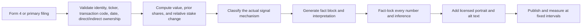

# Macro/Markets LLM Content Strategy: Screenshot Case Studies

## Scope and data cautions

This pack transcribes and analyzes 23 X posts shown in 17 screenshots supplied on July 28, 2026. It contains an 18-post breaking/news sample and a five-post insider-buy series. The screenshots do not show post URLs, complete absolute publication dates, follower counts, bookmarks, link clicks, or final lifetime metrics. The underlying news and transaction claims have not been independently verified.

Metric snapshots range from 16 minutes to 11 hours after publication. Counts abbreviated as `K` are approximate. “Visible interaction rate” is:

`(replies + reposts + likes) / views`

It is a descriptive comparison, not a causal measure of copy quality. Account size, audience fit, publication time, topic, post age, and distribution history are major confounders. When a screenshot shows an interaction icon without a count, the metric is recorded as “not displayed” rather than silently assumed to be zero; the resulting interaction totals and rates are lower bounds.

## Extracted corpus

### 1. tradfi news — space-industry environmental reviews

- Handle/time shown: `@tradfi · 2h`
- Copy:

> *TRUMP ADMINISTRATION MOVES TO SPARE SPACE COMPANIES FROM ENVIRONMENTAL REVIEWS -- WSJ
>
> *PROPOSAL AIMS TO ACCELERATE LAUNCH APPROVALS AS ANNUAL COMMERCIAL FLIGHTS ARE PROJECTED TO EXCEED 500
>
> *COMPANIES INCLUDING SPACEX, ROCKET LAB, BLUE ORIGIN, AND STOKE SPACE STAND TO BENEFIT
>
> #SPCX #RKLB #ASTS

- Snapshot: 4 replies; 5 reposts; 46 likes; 6.4K views
- Visible interactions/rate: 55 / about 0.86%
- Format tags: `wire-flash`, `policy`, `space`, `named-beneficiaries`, `hashtags`

### 2. Walter Bloomberg — China robot and inverter ban explainer

- Handle/time shown: `@DeItaone · 3h`
- Copy:

> TRUMP TO BAN CHINESE ROBOTS, POWER INVERTERS
>
> The Trump administration is set to ban imports of new Chinese humanoid robots, quadruped robots, and connected power inverters.
>
> The move aims to protect the U.S. AI supply chain from cybersecurity and national security risks while encouraging manufacturers to shift production to the U.S. amid growing demand for AI infrastructure.

- Snapshot: 60 replies; 126 reposts; 575 likes; 153K views
- Visible interactions/rate: 761 / about 0.50%
- Format tags: `headline-plus-context`, `policy`, `AI-infrastructure`, `why-it-matters`

### 3. The Hormuz Letter — China/Houthi tanker-passage explainer

- Handle/time shown: `@HormuzLetter · 3h`; Open Square Capital reposted
- Copy:

> BREAKING: China has directly negotiated with Yemen's Houthis to enable Chinese tankers exclusive preferences for safe passage through the Bab el-Mandeb after the Houthi maritime blockade against Saudi Arabia, with Chinese officials clearing each vessel individually with the Houthis and both sides informing Iran of their actions, per Reuters citing 6 sources including a senior Iranian official.
>
> At least 4 tankers have already loaded Saudi crude bound for China and transited the Bab el-Mandeb since the Houthi restrictions were announced.
>
> China is seeking to plug the supply gap caused by Iran's effective Hormuz closure by keeping oil exports flowing from Saudi Arabia's Red Sea terminals, principally Yanbu.

- Snapshot: 43 replies; 308 reposts; 1.6K likes; 78K views
- Visible interactions/rate: about 1,951 / about 2.50%
- Format tags: `breaking`, `deep-brief`, `energy`, `geopolitics`, `numbers`, `mechanism`, `attribution`

### 4. First Squawk — U.S. official on Hormuz demands

- Handle/time shown: `@FirstSquawk · 2h`
- Copy:

> US OFFICIAL: IRAN 'OVERREACHING' WITH HORMUZ DEMANDS BEING RIGHTLY REJECTED BY OMAN, US, INTERNATIONAL COMMUNITY, SAYS DEAL DISCUSSED IS A 'COORDINATION DEAL' WITH NO TOLLS OR FEES

- Snapshot: 11 replies; 26 reposts; 155 likes; 54K views
- Visible interactions/rate: 192 / about 0.36%
- Format tags: `wire-flash`, `official-quote`, `geopolitics`, `all-caps`

### 5. Walter Bloomberg — China robot and inverter ban flash

- Handle/time shown: `@DeItaone · 4h`
- Copy:

> TRUMP ADMINISTRATION PLANS ON TUESDAY TO ROLL OUT BANS ON FOREIGN IMPORTS OF NEW MODELS OF ROBOTS AND INVERTERS, TARGETING CHINA — U.S. OFFICIALS

- Snapshot: 48 replies; 91 reposts; 615 likes; 165K views
- Visible interactions/rate: 754 / about 0.46%
- Format tags: `wire-flash`, `policy`, `AI-infrastructure`, `attribution`, `all-caps`

### 6. Evan — reported Iran missile launch

- Handle/time shown: `@StockMKTNewz · 17m`
- Copy:

> IRAN REPORTEDLY LAUNCHES MISSILES AT AMERICAN BASE IN JORDAN
> - Axios

- Snapshot: 25 replies; 18 reposts; 84 likes; 14K views
- Visible interactions/rate: 127 / about 0.91%
- Format tags: `breaking`, `geopolitics`, `source-attribution`, `all-caps`

### 7. FinancialJuice — reported Iran missile launch

- Handle/time shown: `@financialjuice · 29m`
- Copy:

> Iran fires ballistic missiles at U.S. base in Jordan: Axios

- Snapshot: 1 reply; 13 reposts; 55 likes; 27K views
- Visible interactions/rate: 69 / about 0.26%
- Format tags: `wire-flash`, `geopolitics`, `source-attribution`, `sentence-case`

### 8. zerohedge — potential Edged sale

- Handle/time shown: `@zerohedge · 5h`
- Copy:

> KOCH SAID TO WEIGH $15 BILLION SALE OF DATA-CENTER PLAYER EDGED

- Snapshot: 8 replies; 6 reposts; 140 likes; 81K views
- Visible interactions/rate: 154 / about 0.19%
- Format tags: `deal-rumor`, `data-centers`, `number`, `all-caps`

### 9. Polymarket — OpenAI frontier-development mechanisms

- Handle/time shown: `@Polymarket · 1h`
- Copy:

> BREAKING: OpenAI announces efforts to develop mechanisms that could slow frontier AI development if progress accelerates too quickly.

- Snapshot: 56 replies; 33 reposts; 272 likes; 55K views
- Visible interactions/rate: 361 / about 0.66%
- Format tags: `breaking`, `AI`, `institutional-action`, `sentence-case`

### 10. Watcher.Guru — Russian crypto-trading regulations

- Handle/time shown: `@WatcherGuru · 8h`
- Copy:

> JUST IN: 🇷🇺 Russia publishes draft regulations to establish 'organized' crypto trading.

- Snapshot: 231 replies; 453 reposts; 3.3K likes; 437K views
- Visible interactions/rate: about 3,984 / about 0.91%
- Format tags: `just-in`, `crypto`, `regulation`, `flag`, `sentence-case`

### 11. BRICS News — reported Houthi tanker strike

- Handle/time shown: `@BRICSinfo · 4h`
- Copy:

> JUST IN: 🇾🇪 Yemeni Houthis strike another Saudi oil tanker.

- Snapshot: 64 replies; 402 reposts; 3.8K likes; 127K views
- Visible interactions/rate: about 4,266 / about 3.36%
- Format tags: `just-in`, `geopolitics`, `energy`, `flag`, `sentence-case`

### 12. tradfi news — U.S. official on Hormuz demands

- Handle/time shown: `@tradfi · 2h`
- Copy:

> *IRAN IS OVER REACHING WITH DEMANDS THAT OMAN, THE UNITED STATES, AND THE INTERNATIONAL COMMUNITY ARE RIGHTLY REJECTING ON STRAIT OF HORMUZ -U.S. OFFICIAL

- Snapshot: 2 replies; repost count not displayed; 29 likes; 4.4K views
- Visible interactions/rate: at least 31 / at least 0.70%
- Format tags: `wire-flash`, `official-quote`, `geopolitics`, `all-caps`

### 13. Polymarket — crypto hedge-fund founder sentenced

- Handle/time shown: `@Polymarket · 6h`
- Copy:

> JUST IN: Crypto hedge fund founder Justin Ryan Schmidt sentenced to 37 months in prison for tax evasion.

- Snapshot: 54 replies; 48 reposts; 333 likes; 65K views
- Visible interactions/rate: 435 / about 0.67%
- Format tags: `just-in`, `crypto`, `legal`, `named-person`, `number`

### 14. The Wolf Of All Streets — X Money launch

- Handle/time shown: `@scottmelker · 2h`
- Copy:

> X OFFICIALLY LAUNCHES X MONEY FOR US PREMIUM AND PREMIUM+ SUBSCRIBERS, WITH A DIGITAL WALLET, PEER-TO-PEER PAYMENTS AND APPLE WALLET SUPPORT

- Snapshot: 14 replies; 3 reposts; 49 likes; 14K views
- Visible interactions/rate: 66 / about 0.47%
- Format tags: `product-launch`, `fintech`, `feature-list`, `all-caps`

### 15. R A W S A L E R T S — Iran missile launch

- Handle/time shown: `@rawsalerts · 16m`
- Copy:

> 🚨 #BREAKING: U.S. official announces Iran launched ballistic missiles toward a U.S. base in Jordan.

- Snapshot: 40 replies; 54 reposts; 388 likes; 28K views
- Visible interactions/rate: 482 / about 1.72%
- Format tags: `breaking`, `geopolitics`, `official-attribution`, `alert-emoji`, `sentence-case`

### 16. Evan — China robot and inverter ban

- Handle/time shown: `@StockMKTNewz · 3h`
- Copy:

> The 🇺🇸 Trump administration reportedly plans to unveil new bans that target imports of the latest Chinese robots and power inverters - Reuters

- Snapshot: 17 replies; 10 reposts; 116 likes; 48K views
- Visible interactions/rate: 143 / about 0.30%
- Format tags: `policy`, `AI-infrastructure`, `source-attribution`, `flag`, `sentence-case`

### 17. Walter Bloomberg — Tesla power contract

- Handle/time shown: `@DeItaone · 11h`
- Copy:

> $TSLA - TESLA TO BUY POWER FROM KKR-BACKED ARIZONA SOLAR, BATTERY PLANT

- Embedded card shown: Tesla Inc; TSLA $307.44; -0.58%
- Snapshot: 44 replies; 32 reposts; 468 likes; 177K views
- Visible interactions/rate: 544 / about 0.31%
- Format tags: `corporate-catalyst`, `energy`, `cashtag`, `embedded-market-card`, `all-caps`

### 18. Polymarket — potential Bloomberg IPO

- Handle/time shown: `@Polymarket · 3h`
- Copy:

> JUST IN: Bloomberg is reportedly considering a potential IPO.

- Snapshot: 51 replies; 30 reposts; 391 likes; 55K views
- Visible interactions/rate: 472 / about 0.86%
- Format tags: `just-in`, `deal-rumor`, `reportedly`, `sentence-case`

### 19. Insider Stock Picks — Rhinebeck Bancorp insider buy

- Handle/date shown: `@invstockpicks · Jul 25`
- Copy:

> $RBKB just flashed an insider signal.
>
> Nancy Koskey Patzwahl bought:
>
> • 25,000 shares  
> • $299K invested  
> • Avg. price: $11.94
>
> She now owns 27,270 shares.
>
> When an insider nearly doubles down with personal capital, it's a move worth paying attention to.
>
> ↳ Nancy Koskey Patzwahl  
> ↳ Rhinebeck Bancorp Inc
>
> $RBKB #InsiderBuying #Stocks #Investing

- Media: large portrait of the named person
- Snapshot: 1 reply; repost count not displayed; 8 likes; 366 views
- Visible interactions/rate: at least 9 / at least 2.46%
- Derived from displayed figures: prior holding about 2,270 shares; increase about 1,101%; post-purchase holding about 12 times the prior holding
- Format tags: `insider-signal`, `cashtag`, `fact-block`, `ownership-context`, `interpretive-bridge`, `portrait`

### 20. Insider Stock Picks — TOI insider buy

- Handle/date shown: `@invstockpicks · Jul 23`
- Copy visible before truncation:

> $TOI just flashed an insider signal.
>
> Jorey Chernett bought:
>
> • 18,000 shares  
> • $94.9K invested  
> • Avg. price: $5.27
>
> He now owns 10.65M shares.
>
> When an insider with an already massive stake keeps adding, it's a sign of continued conviction. I'm paying attention.
>
> ↳ Jorey

- Screenshot note: remaining copy is hidden behind “Show more”
- Media: large portrait of the named person
- Snapshot: reply and repost counts not displayed; 4 likes; 155 views
- Visible interactions/rate: at least 4 / at least 2.58%
- Derived from rounded displayed figures: prior holding about 10.632M shares; increase about 0.17%
- Format tags: `insider-signal`, `cashtag`, `fact-block`, `ownership-context`, `interpretive-bridge`, `portrait`

### 21. Insider Stock Picks — PBLS insider buy

- Handle/date shown: `@invstockpicks · Jul 23`
- Copy visible before truncation:

> $PBLS just flashed an insider signal.
>
> Jake Simson bought:
>
> • 244,593 shares  
> • $6.92M invested  
> • Avg. price: $28.29
>
> He now owns 29.18M shares.
>
> A nearly $7M insider purchase from someone already holding a massive stake isn't something I ignore. This one deserves a closer

- Screenshot note: remaining copy is hidden behind “Show more”
- Media: large portrait of the named person
- Snapshot: reply and repost counts not displayed; 2 likes; 199 views
- Visible interactions/rate: at least 2 / at least 1.01%
- Derived from rounded displayed figures: prior holding about 28.935M shares; increase about 0.85%
- Format tags: `insider-signal`, `cashtag`, `fact-block`, `ownership-context`, `interpretive-bridge`, `portrait`

### 22. Insider Stock Picks — FuelCell Energy insider buy

- Handle/date shown: `@invstockpicks · Jul 21`
- Copy visible before truncation:

> $FCEL just flashed an insider signal.
>
> John Livingston bought:
>
> • 26,343 shares  
> • $495K invested  
> • Avg. price: $18.79
>
> This is his first disclosed position, now totaling 26,343 shares.
>
> People closest to the business don't buy with their own money without conviction. This one

- Screenshot note: remaining copy is hidden behind “Show more”
- Media: large portrait of the named person
- Snapshot: 1 reply; repost count not displayed; 2 likes; 170 views
- Visible interactions/rate: at least 3 / at least 1.76%
- Derived from displayed figures: new disclosed position; purchase value about $495K
- Format tags: `insider-signal`, `cashtag`, `fact-block`, `new-position`, `interpretive-bridge`, `portrait`

### 23. Insider Stock Picks — Elevance Health CEO buy

- Handle/date shown: `@invstockpicks · Jul 21`
- Copy visible before truncation:

> $ELV just flashed an insider signal.
>
> CEO Gail Boudreaux bought:
>
> • 2,725 shares  
> • $1.00M invested  
> • Avg. price: $367.79
>
> She now owns 172,036 shares.
>
> A seven-figure purchase from a CEO is never random. When leaders commit more of their own capital, I pay attention.
>
> ↳ Gail

- Screenshot note: remaining copy is hidden behind “Show more”
- Media: large portrait of the named person
- Snapshot: reply and repost counts not displayed; 1 like; 170 views
- Visible interactions/rate: at least 1 / at least 0.59%
- Derived from displayed figures: prior holding about 169,311 shares; increase about 1.61%
- Format tags: `insider-signal`, `cashtag`, `fact-block`, `CEO`, `ownership-context`, `interpretive-bridge`, `portrait`

## Breaking/news sample: performance ranking by visible interaction rate

| Rank | Post | Views | Visible interactions | Rate |
|---:|---|---:|---:|---:|
| 1 | BRICS News — Houthi tanker strike | 127K | about 4,266 | about 3.36% |
| 2 | Hormuz Letter — China/Houthi passage | 78K | about 1,951 | about 2.50% |
| 3 | RAWSALERTS — Iran/Jordan | 28K | 482 | about 1.72% |
| 4 | Evan — Iran/Jordan | 14K | 127 | about 0.91% |
| 5 | Watcher.Guru — Russia crypto rules | 437K | about 3,984 | about 0.91% |
| 6 | tradfi news — space reviews | 6.4K | 55 | about 0.86% |
| 7 | Polymarket — Bloomberg IPO | 55K | 472 | about 0.86% |
| 8 | tradfi news — Hormuz demands | 4.4K | at least 31 | at least 0.70% |
| 9 | Polymarket — Schmidt sentence | 65K | 435 | about 0.67% |
| 10 | Polymarket — OpenAI mechanisms | 55K | 361 | about 0.66% |
| 11 | Walter — China robots explainer | 153K | 761 | about 0.50% |
| 12 | Wolf — X Money | 14K | 66 | about 0.47% |
| 13 | Walter — China robot-ban flash | 165K | 754 | about 0.46% |
| 14 | First Squawk — Hormuz demands | 54K | 192 | about 0.36% |
| 15 | Walter — Tesla power contract | 177K | 544 | about 0.31% |
| 16 | Evan — China robots | 48K | 143 | about 0.30% |
| 17 | FinancialJuice — Iran/Jordan | 27K | 69 | about 0.26% |
| 18 | zerohedge — Edged sale | 81K | 154 | about 0.19% |

## Strongest controlled comparisons

### A. Same account and story: Walter Bloomberg robot-ban flash vs explainer

The one-line flash reached 165K views and 754 visible interactions (about 0.46%). The contextual version reached 153K views and 761 interactions (about 0.50%).

- The flash produced about 8% more views.
- The explainer produced nearly the same absolute interactions on fewer views, for about 9% better interaction efficiency.
- The explainer’s repost/view ratio was about 49% higher than the flash’s.
- Working interpretation: use the flash to win speed and initial reach, then use a concise “why it matters” layer to improve redistribution and informational value.

### B. Same event and similar age: Iran missiles toward a U.S. base in Jordan

| Packaging | Age | Views | Interactions | Rate |
|---|---:|---:|---:|---:|
| RAWSALERTS: `🚨 #BREAKING` + official attribution | 16m | 28K | 482 | 1.72% |
| Evan: all-caps + `REPORTEDLY` + Axios | 17m | 14K | 127 | 0.91% |
| FinancialJuice: plain sentence + Axios | 29m | 27K | 69 | 0.26% |

RAWSALERTS generated about seven times the interactions of FinancialJuice at nearly the same view count. The strongest package combines urgency, a named authority, a precise action, and a specific location. This does not prove the emoji or `#BREAKING` caused the lift; account/audience effects remain material.

### C. Same official position: Iran “overreaching” on Hormuz

First Squawk carried more detail and reached 54K views; tradfi news carried a shorter version and reached 4.4K. The large reach gap is most plausibly dominated by account distribution. The smaller post’s interaction rate is a lower-bound 0.70% versus 0.36%, illustrating why raw reach and rate must be kept separate.

## Strategy conclusions

1. **Consequence plus specificity is the strongest recurring pattern.** The best performers name the actor, action, affected asset or location, and immediate consequence: Houthis + strike + Saudi oil tanker; China + negotiated passage + four tankers + Yanbu.
2. **Brevity is useful, but information density matters more.** Both the shortest alert and the longest explainer occupy the top two efficiency slots. The common factor is high consequence delivered without generic filler.
3. **A mechanism makes context worth reposting.** The Hormuz Letter does not merely report an event; it explains the route, the supply gap, the vessel-clearance process, and the relevant terminal. That creates reusable intelligence.
4. **“BREAKING” and “JUST IN” are routing labels, not sufficient hooks.** They work when followed immediately by a consequential fact. They should be reserved for genuinely new, time-sensitive information.
5. **All caps is not a reliable performance lever.** Strong and weak examples appear in both all caps and sentence case. Sentence case is the safer default for clarity; use wire-style caps only when it is part of the account’s established voice.
6. **Attribution should sit inside the first sentence.** `U.S. official`, `Reuters`, `Axios`, and `reportedly` communicate epistemic status without requiring a second paragraph.
7. **Numbers and proper nouns increase perceived substance.** `$15 billion`, `37 months`, `500 flights`, `4 tankers`, `Bab el-Mandeb`, and `Yanbu` make a post concrete. The model must never invent these details.
8. **Flags, emojis, hashtags, and cashtags should encode information.** One country flag, one alert marker, or a small set of directly affected tickers can aid scanning. Decorative piles add noise.
9. **Reach and interaction efficiency are different objectives.** The Tesla item has 177K views but a 0.31% visible interaction rate; the Hormuz deep brief has less than half the views but roughly eight times the rate.
10. **Use a two-step publishing system.** Publish a verified detection alert quickly, then a contextual brief explaining mechanism, market transmission, and affected assets. Do not overload the first post while facts are still moving.

## Claude-ready operating prompt

```text
You are the macro/markets breaking-news editor for [BRAND].

Your job is to turn a supplied, attributed fact set into accurate, high-information
social copy. Never invent a fact, number, quote, ticker, source, motive, or market
reaction. Preserve uncertainty: use “reportedly,” “according to [source],” or
“[official] says” when the input is not a confirmed primary statement.

For each event, return:

1. ALERT — one sentence, normally <= 180 characters:
   [urgency label only if justified] + [actor] + [action] + [object/location] +
   [source or confidence qualifier].

2. CONTEXT — two short paragraphs:
   paragraph 1 states the event and the most concrete supporting detail;
   paragraph 2 explains the causal mechanism and why it matters.

3. MARKET MAP — up to three bullets:
   - directly affected asset, sector, route, or company;
   - second-order transmission channel;
   - what confirmation or next event to watch.

4. HEADLINE VARIANTS — three alternatives:
   A. neutral wire style;
   B. consequence-led;
   C. market-led.

Rules:
- Lead with a concrete noun and verb; remove throat-clearing.
- Put attribution in the first sentence.
- Use sentence case by default.
- Use “BREAKING” or “JUST IN” only for genuinely new, time-sensitive facts.
- Use at most one functional emoji/flag and only directly relevant hashtags/tickers.
- Do not convert correlation, plans, consideration, or allegations into completed facts.
- Do not state a market implication as certain; label it “may,” “could,” or “watch.”
- If the input is insufficient, output NEEDS VERIFICATION and list the missing facts.
- Before finalizing, score the draft 0–2 for novelty, consequence, specificity,
  attribution, and scanability. Rewrite once if the total is below 8/10.

Input:
SOURCE:
CONFIRMATION LEVEL:
EVENT TIME:
ACTOR:
ACTION:
OBJECT/LOCATION:
NUMBERS:
WHY IT MATTERS:
AFFECTED ASSETS/TICKERS:
KNOWN UNCERTAINTIES:
```

## Insider-signal post family

### Observed performance

The five posts have a median of 170 views and an average of 212 views. Together they show at least 19 visible interactions on 1,060 views, a lower-bound rate of about 1.79%. The sample is extremely small, interaction counts are partly undisplayed, and the posts were captured on different dates. It is useful for studying format, not for declaring the format successful.

| Ticker | Views | Visible interactions | Lower-bound rate | Purchase | Approx. increase vs prior holding |
|---|---:|---:|---:|---:|---:|
| `$RBKB` | 366 | at least 9 | at least 2.46% | $298.5K | 1,101% |
| `$TOI` | 155 | at least 4 | at least 2.58% | $94.9K | 0.17% |
| `$PBLS` | 199 | at least 2 | at least 1.01% | $6.92M | 0.85% |
| `$FCEL` | 170 | at least 3 | at least 1.76% | $495.0K | New position |
| `$ELV` | 170 | at least 1 | at least 0.59% | $1.002M | 1.61% |

The RBKB post generated the most views and likes. Its underlying fact pattern is also the most distinctive: the displayed figures imply the insider moved from roughly 2,270 to 27,270 shares, or about 12 times the prior holding. The phrase “nearly doubles down” obscures that stronger, calculable fact.

### Style fingerprint

This is a **serialized signal card** rather than a wire alert. Every post uses nearly the same cadence:

1. **Investable hook:** cashtag first, followed by “just flashed an insider signal.”
2. **Human actor:** full name, sometimes role, plus the direct verb `bought`.
3. **Evidence block:** shares, approximate dollars invested, and average price.
4. **Ownership baseline:** post-transaction shares or “first disclosed position.”
5. **Interpretive bridge:** a one- or two-sentence claim about conviction or attention.
6. **Identity reinforcement:** person and company labels.
7. **Human visual:** a large portrait that turns an abstract filing into a person-led story.
8. **Discovery metadata:** ticker and broad hashtags.

The voice is direct, confident, lightly personal, and deliberately repetitive. Phrases such as “I’m paying attention” create an editorial persona. The repetition also trains readers to recognize the series quickly.

### Attention and persuasion mechanism

| Layer | Reader effect | What the model should do |
|---|---|---|
| Cashtag + signal phrase | Immediate relevance and urgency | Lead with one verified ticker and the transaction type |
| Insider’s name/title | Adds authority and “skin in the game” | Use the exact filed name and role |
| Three-number block | Creates scanability and evidentiary weight | Show shares, computed value, and weighted average price |
| Post-buy ownership | Supplies a baseline | Compute prior shares and percentage increase |
| Interpretation | Converts data into a reason to care | Name the actual mechanism: new position, material stake increase, repeat buy, or cluster buy |
| Portrait | Humanizes the filing and stops the scroll | Use a licensed, correctly identified image and useful alt text |
| Repeated template | Builds series recognition | Keep the skeleton stable while varying the analysis |

The core psychological mechanism is **costly action by an informed participant**: a reader may treat an insider committing personal capital as a signal of confidence. The post then reduces cognitive load by converting a filing into three numbers and one interpretation. That is a useful editorial frame, but it is not proof of motive, valuation, or future returns.

### Where the observed style is weak

1. **Absolute dollars can mislead.** A $6.92M purchase sounds more important than a $299K purchase, but the displayed PBLS figures imply only about a 0.85% addition to an already large holding; RBKB implies an increase of roughly 1,101%.
2. **Generic conviction language discards the best fact.** “I’m paying attention” repeats across examples without explaining why one transaction is more significant than another.
3. **Certainty is overstated.** “Never random” and “don’t buy ... without conviction” infer motive. A filing proves the transaction, not the insider’s private reasoning.
4. **The hook is vague.** “Flashed an insider signal” is recognizable branding, but “CEO open-market purchase” is more informative.
5. **Source evidence is absent from the visible copy.** A filing link, filing date, transaction code, and direct/indirect ownership status would make the post more trustworthy.
6. **Portraits can overpower the data.** They consume most of the vertical space and require identity checks, rights clearance, and alt text.
7. **Broad hashtags add little analytical value.** Prefer the cashtag and, at most, one specific category tag.

### Signal calculation framework

The model should never judge significance from purchase value alone. Compute:

```text
purchase_value = purchased_shares × weighted_average_price
prior_shares = post_transaction_shares − purchased_shares
relative_stake_increase_pct = purchased_shares ÷ prior_shares × 100
```

If post-transaction holdings are rounded, label the derived change approximate. If prior shares are zero, classify the transaction as a new disclosed position instead of calculating a percentage.

Then assess six dimensions separately:

- **Transaction integrity:** open-market purchase versus grant, award, option exercise, conversion, or transfer.
- **Relative size:** change versus the insider’s prior disclosed holding.
- **Absolute size:** personal capital committed in dollars.
- **Role:** CEO/CFO, operating executive, director, or 10% owner.
- **Pattern:** first purchase, repeat purchase, or multiple insiders buying.
- **Context:** timing versus price drawdown, earnings, guidance, or a material event—only when verified.

This produces a defensible mechanism sentence. Examples:

- `new disclosed position` → “This establishes a new disclosed stake.”
- `material relative increase` → “The purchase increased disclosed ownership by approximately X%.”
- `repeat purchase` → “This is the insider’s Nth verified open-market purchase in [period].”
- `cluster buying` → “N insiders bought shares within [verified window].”
- `small addition to large stake` → “The dollar amount is large, but it increased the prior holding by only about X%.”

### Creation workflow



1. **Ingest the primary record.** Capture issuer, ticker, insider, title, transaction date, filing date, transaction code, shares, price, post-transaction ownership, direct/indirect ownership, and any Rule 10b5-1 indication.
2. **Validate the event.** Confirm it is a purchase rather than compensation, an exercise, an award, a conversion, or an internal transfer. Check amended filings.
3. **Calculate the missing baseline.** Derive purchase value, prior shares, and relative stake increase; preserve the precision of the source.
4. **Choose the mechanism.** New position, material addition, repeat buy, cluster buy, or small addition to a large holding.
5. **Generate from locked facts.** Claude may change wording, but not names, figures, transaction type, or uncertainty.
6. **Run an inference audit.** Remove unsupported claims about conviction, undervaluation, inside knowledge, or future price performance.
7. **Prepare media.** Confirm the portrait matches the insider, clear usage rights, crop consistently, and provide descriptive alt text.
8. **Measure consistently.** Capture views and interactions at 15 minutes, 1 hour, 4 hours, and 24 hours; normalize by followers and views.

### Recommended post template

```text
$[TICKER] insider purchase:

[ROLE] [FULL NAME] bought:

• [SHARES] shares
• approximately $[VALUE] invested
• weighted average price: $[PRICE]

Post-transaction ownership: [AFTER] shares.
[Prior stake/relative-change sentence.]

Why it matters: [one verified mechanism—new stake, material increase,
repeat purchase, cluster buying, or small addition to a large stake].

Source: [PRIMARY FILING], filed [DATE].
[Optional: one cashtag and one specific category tag]
```

For this series, the invariant skeleton should remain recognizable. The **interpretive sentence must be transaction-specific**; it should not default to “I’m paying attention.”

### Worked rewrite based on the RBKB screenshot

This example uses only the screenshot’s figures and still requires primary-filing verification before publication:

> $RBKB insider purchase:
>
> Nancy Koskey Patzwahl bought 25,000 shares at an average $11.94, an investment of approximately $298,500.
>
> She now owns 27,270 shares—up from roughly 2,270 before the purchase. That is about a 12× increase in her disclosed holding.
>
> Why it matters: the relative increase in ownership is more notable than the dollar amount alone.
>
> Source: verify against the relevant primary filing before publication.

### Claude-ready insider-signal prompt

```text
You are the insider-transactions editor for [BRAND].

Create an accurate, concise social post from a verified primary filing. Treat all
input facts as locked. You may calculate derived fields, but you may not invent or
infer an insider’s motive, company outlook, valuation, or future stock performance.

First validate:
- Is this an open-market purchase? Identify the transaction code.
- Is ownership direct or indirect?
- Is the filing original or amended?
- Does the filing indicate a Rule 10b5-1 plan?
- Do shares × weighted average price reconcile with the stated purchase value?
- Do post-transaction shares reconcile with prior shares plus the purchase?

Calculate:
purchase_value = shares × weighted_average_price
prior_shares = post_transaction_shares − purchased_shares
relative_stake_increase_pct = purchased_shares ÷ prior_shares × 100

Classify the mechanism as one of:
NEW_POSITION, MATERIAL_ADDITION, REPEAT_BUY, CLUSTER_BUY,
SMALL_ADDITION_TO_LARGE_STAKE, or NEEDS_REVIEW.

Return:
1. VERIFICATION — pass/fail plus any discrepancy.
2. DERIVED DATA — value, prior shares, relative increase, and precision caveats.
3. POST — ticker-led hook, three-line fact block, ownership context, one
   mechanism-specific “why it matters” sentence, and primary source.
4. SHORT VARIANT — <= 220 characters.
5. ALT TEXT — neutral description of the media.
6. RISK FLAGS — unsupported inference, identity uncertainty, image rights,
   rounded holdings, or missing filing fields.

Style:
- Sentence case; short paragraphs; one idea per line.
- Use the exact full name and title from the filing.
- Prefer “bought” and “open-market purchase” over vague signal language.
- Use approximate qualifiers when source figures are rounded.
- One cashtag; no more than one specific hashtag.
- Never say “never random,” “proof of conviction,” “undervalued,” or equivalent.
- If primary verification fails, output DO NOT PUBLISH.

Input:
ISSUER:
TICKER:
PRIMARY_FILING_URL:
FILING_DATE:
TRANSACTION_DATE:
INSIDER_NAME:
INSIDER_TITLE:
TRANSACTION_CODE:
SHARES_PURCHASED:
WEIGHTED_AVERAGE_PRICE:
POST_TRANSACTION_SHARES:
OWNERSHIP_TYPE:
RULE_10B5_1_STATUS:
PRIOR_VERIFIED_PURCHASES:
OTHER_INSIDERS_BUYING:
IMAGE_SOURCE_AND_RIGHTS:
```

## Recommended measurement schema for future cases

To train or evaluate the strategy more credibly, capture:

- post URL and exact text;
- account and follower count at capture;
- exact publication and capture timestamps;
- source/confirmation level;
- for insider posts: filing URL, transaction code, filing/transaction dates, ownership type, Rule 10b5-1 status, prior shares, and derived stake increase;
- replies, reposts, likes, bookmarks, views, link clicks, and profile visits;
- media type and whether a quote-post/repost seeded distribution;
- topic and format tags;
- post edits or follow-up corrections.

Optimize primarily for repost/view rate when the goal is distribution, click/view rate when the goal is traffic, and qualified conversion when the goal is product use. Raw likes should not be the sole reward signal.
