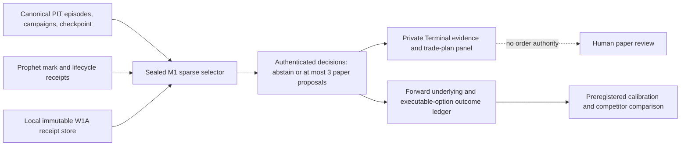

# Options sparse selector — project and operational handoff

Date: 2026-08-15

Status: **operational canary installed and recurring; first RTH generation and full proposal system are not complete**

Canonical runbook: `docs/runbooks/OPTIONS_SPARSE_SELECTOR.md`

Frozen method: `research/options_estate/OPTIONS_SPARSE_SELECTOR_PREREG.md`

## 0. Executive verdict

This project is not fully complete.

The difficult foundation is complete: canonical campaign sources, an
authenticated and restart-safe sparse selector, compact W1A evidence receipts,
bounded transition mechanics, a sealed target-host runtime, and a private
five-minute scheduler are merged. The M1 operational service is installed and
healthy in its deliberately weak mode.

The canary has not yet crossed its first eligible NYSE RTH boundary. Therefore
it has not read and pinned its first source epoch, created the durable selector
root, advanced an audit generation, settled a manifest, written a decision, or
proved its terminal halt. Proposal capability is structurally false because the
M1 has no local W1A receipt store and both the core and runner reject W1A in this
activation.

The honest description is:

> The selector is operationally installed as a bounded paper-only abstention
> canary. It is not yet an accepted RTH canary and it is not yet a complete
> options-aware paper proposal product.

## 1. What exists now

### 1.1 Canonical campaign and outcome plane

At the M1 source census commit
`576ce390092192b4270ae53a4d3b91713e7e374d`, the campaign checkpoint is the
following. Its Git blob `c586bcde4f259a498f71645add23ff2889b47026`
remained byte-identical at the later handoff base
`9c9cb599be22dfd0744ed159c783ce4107f1dded`:

- checkpoint: `ocp_5909daa5878a01a2d0b09143`;
- 1,146 campaign revisions;
- 2,947 campaign outcomes;
- 657 `retrospective_context` campaigns;
- 489 `prospective_after_rule_freeze` campaigns;
- every campaign disposition is `abstain`;
- 407 prospective `h60` outcomes, 421 prospective `eod` outcomes, and 421
  prospective `1d` outcomes;
- zero prospective `3d`, `5d`, or `10d` outcomes;
- all 2,947 option outcome legs are `unavailable` because the executable NBBO
  quote path is absent; and
- every campaign/outcome training and authority bit remains false.

The source files are:

- `data/options_signal_campaign/campaigns.jsonl`;
- `data/options_signal_campaign/outcomes.jsonl`;
- `data/options_signal_campaign/checkpoint.json`;
- `data/options_signal_episode/episodes.jsonl`;
- `data/options_signal_episode/outcomes_h60.jsonl`; and
- `data/options_signal_episode/outcomes_session.jsonl`.

These are a deterministic research census and outcome ledger, not a ranking or
trading system.

### 1.2 Selector core

`engine/options_sparse_selector.py` contains the merged selector and recovery
engine:

- runtime carrier is armed: `SELECTOR_RUNTIME_ARMED = True`;
- proposals are closed: `SELECTOR_PROPOSALS_ARMED = False`;
- public `plan_cycle` and `commit_cycle` remain inert;
- the reviewed `advance` carrier is the only production mutation path;
- a W1A root is rejected before authority while proposals are closed;
- any planned non-abstention decision or nonzero proposal cycle is rejected
  before WAL authority;
- each transition is bounded by 1,024 immutable objects and a 4 MiB
  intent/body/seal footprint;
- restart uses receipt-only WAL, deterministic immutable prestage, exact seal
  recovery, and no-replace publication;
- producer evidence is captured under anchored roots and exact lock order;
- lifecycle occurrence replay is cold-boot and incremental, with deep
  authentication before use;
- compact W1A source receipts rehydrate the exact historical publication rather
  than embedding multi-megabyte reference sets; and
- the latent full-mode rule is at most three private paper proposals per NYSE
  session, with deterministic abstention beyond the cap.

The core merged in PR #5656 (`34b64a1160badf5354479992a593ecb189518089`).
PR #5655 (`c87946fe403926207f4865728249ef42221fa678`) made the
integrated CI surface green. The hosted selector pack later proved 144 runtime
and private-auth tests plus the separate 4,096-candidate full-drain benchmark.

Performance nuance: the 4,096 benchmark passed functionally in CI, but its
external pytest wall was about 325 seconds. The final local exact gate was under
240 seconds. Do not treat this as ample production headroom for W1A-enabled full
mode; the current 235-second operational watchdog and a real target-host source
read need a new acceptance measurement.

### 1.3 Operational carrier

The operational activation merged through:

| PR | Merge SHA | Purpose |
|---|---|---|
| #5694 | `09f6c67ecb647722b5bf5eceeaa5de186c0ce176` | Arm the bounded, proposal-disabled M1 canary |
| #5695 | `27ac18410c878c69ffecd3cb535b54065c87ace4` | Repair Synapse documentation/evidence receipts displaced by activation |
| #5696 | `b24d2d65da0aa16aea986ab6afb7d2f73600fda5` | Replace the failed v1 sealed runtime with reviewed v2 native-mode semantics |
| #5701 | `e5e85d6047e85041bcb2a3b3cef9513e717e6672` | Prove the delayed-import isolation exception without weakening the global pinning ratchet |

The exact operating contract is:

- host: `Mac13,1`, `arm64`, local Theta at `127.0.0.1:25503`;
- launchd label: `com.mastermind.optionssparseselector`;
- cadence: 300 seconds, no `RunAtLoad`, no kickstart acceptance;
- per-fire watchdog: 235 seconds;
- activation expiry: `2026-08-21T20:00:00Z`;
- maximum generations: 128;
- halt: after the first decision-bearing manifest;
- W1A root: exactly null;
- proposal capability: exactly false;
- no handoff consumer; and
- no issue, public-pick, select, size, trade, or training authority.

### 1.4 Installed-release drift — reconcile before any next activation

The M1 sealed code release is
`85d4a23602fdc9d3fdf228c4772637c40f90edbe`. It contains the #5694
activation and #5696 runtime-v2 repair, but it is **not** a descendant of these
later hardening merges:

- #5701 / `e5e85d6047e85041bcb2a3b3cef9513e717e6672`: delayed-import isolation
  proof. This merge changed the import-pinning test rather than the installed
  runner bytes, but it is still part of the current governance receipt;
- #5708 / `ba7d84b3ce100c55bda66ecb8a218b1f0092a137`: sealed-runtime import-pin
  precedence; and
- #5702 / `b9d4e51188867bd0c6da0b28adfd4843d7890ca5`: self-relative
  `EXPECTED_REPO_ROOT` derived from the runner's `__file__`.

The old absolute expected repository root happens to equal the current
dedicated checkout path, so this census does **not** prove an active wrong-root
defect. It does prove release drift. Call the current M1 lane installed and
bounded, not current-main hardened.

Before any replacement activation, W1A enablement, or long-lived continuous
mode, reconcile this deliberately: boot out the label, preserve the v2 runtime
and ops roots, build a new versioned sealed runtime from one reviewed current
merge, rebind all source hashes and plist receipts, and bootstrap normally. Do
not mutate the 8,007-file v2 closure in place merely to catch up.

## 2. Exact M1 checkpoint

Fresh read-only census at `2026-08-15T10:08:49Z`:

| Item | Exact state |
|---|---|
| Host | `Mac13,1`, `arm64` |
| Loaded label | `gui/501/com.mastermind.optionssparseselector` |
| Launchd state | loaded, idle between fires, `runs = 124`, `last exit code = 0` |
| Interval | 300 seconds |
| Installed code release | `85d4a23602fdc9d3fdf228c4772637c40f90edbe` |
| Latest fetched source ref | `576ce390092192b4270ae53a4d3b91713e7e374d` |
| Latest status | `SKIPPED / NON_NYSE_SESSION` at `2026-08-15T10:05:47.190933Z` |
| Status SHA-256 | `d986e0f9b379c598b2a0cb39c88cc0be3801172beeb8524e7578e6c0fd3dcdf0` |
| Proposal capability | `false` |
| W1A | `null` |
| Authority | every recorded bit false |
| Selector/source/slot/transition | all null in status |
| Durable selector root | absent |
| Slot claim / transitions / halt | absent |
| Launchd stderr | 0 bytes |
| Private disk free | 176,236,650,496 bytes, approximately 164.13 GiB |

The code release is intentionally sealed at `85d4a236...`; the runner may fetch
a later `origin/main` only to bind a fresh source epoch. While a source epoch is
active, subsequent transitions reuse its exact authenticated ancestor rather
than mixing source commits.

### 2.1 Fixed paths and immutable identities

| Role | Path / receipt |
|---|---|
| Dedicated checkout | `/Users/chriswong/options-sparse-selector-ops-wt` |
| Durable selector root | `/Users/chriswong/.mastermind_private/options_sparse_selector_v1` |
| Active sealed runtime | `/Users/chriswong/.mastermind_private/options_sparse_selector_runtime_v2` |
| Active operational receipts | `/Users/chriswong/.mastermind_private/options_sparse_selector_ops_v2` |
| Mark evidence | `/Users/chriswong/.mastermind_private/prophet_option_mark_observations_v1` |
| Lifecycle evidence | `/Users/chriswong/.mastermind_private/prophet_option_shadow_lifecycle_v1` |
| Installed plist | `/Users/chriswong/Library/LaunchAgents/com.mastermind.optionssparseselector.plist` |
| Runtime manifest SHA-256 | `87e8ed7975f2f01b7748c8a7785304deb2144083e45232ebadeb3079b3094b5e` |
| Runtime closure | 8,007 files, 294,750,046 bytes, 197 native files |
| Plist SHA-256 | `d0ed08ea2363a41b837bb56a9ce9e8abc40cc6c4ae74e83193a6cc2075a6234f` |

All private parents and runtime/ops roots are mode `0700`; the installed plist is
mode `0600`. The durable selector root is absent only because no eligible RTH
transition has occurred. Once created, it is the final root and must never be
deleted or reinitialized.

### 2.2 v1 incident and recoverable archive

The first v1 operational fire failed closed before reading source, claiming a
slot, sealing a WAL, or creating selector state. Seven carrier-sealed PyArrow
native libraries were correctly non-executable `0444`; the v1 runner
incorrectly required every native file to be `0555`. The v2 carrier preserves
Python as `0555` while admitting only sealed native modes `0444` or `0555`.

Retain these incident roots unchanged:

- `/Users/chriswong/.mastermind_private/options_sparse_selector_runtime_v1`;
- `/Users/chriswong/.mastermind_private/options_sparse_selector_ops_v1`.

Two unrelated orphaned live-flow worktrees were moved—not deleted—to external
recoverable storage:

- `/Volumes/STORAGE/macro-ops-archives/liveflow-ops-wt.orphaned-20260809T093547Z`;
- `/Volumes/STORAGE/macro-ops-archives/liveflow-ops-wt.orphaned-20260810T205125Z`.

Legacy PID `32777` is still running
`python -m scripts.live_flow_poller --rth-only`. It is not owned by this
selector activation. Do not terminate, reparent, or use it as selector evidence
without a separate live-flow ownership audit.

## 3. Deployment and verification state

- PR #5701's full scoped run `31853634154` is terminal success: plan, four
  packs, and aggregate gate all passed.
- The exact import-isolation owner passed both the four-test logging/warnings
  ratchet and the seven-test file-path import-pinning suite.
- Activation render run `31848697762` completed successfully at
  `2026-08-15T02:31:52Z`.
- At `2026-08-15T10:19:33Z`, `origin/main` and both production `/api/health`
  fields (`commit` and `checkout`) were exactly
  `9c9cb599be22dfd0744ed159c783ce4107f1dded`. This is a timestamped census,
  not a claim that the high-velocity ref will remain there.
- The public app-process `commit` field is a separate identity and is not M1
  selector proof. M1 launchd/status/store receipts are authoritative for the
  canary.

## 4. What is truly armed

| Capability | Current truth |
|---|---|
| Recurring M1 launch | Armed and observed |
| Sealed interpreter/import closure | Installed and re-attested each fire |
| Source fetch and exact Git-blob pin | Enabled only for an eligible fresh epoch |
| Mark/lifecycle evidence capture | Configured and authenticated when selector work begins |
| Selector source audit/merge/replay | Armed within RTH/expiry/generation bounds |
| Abstention decision settlement | Armed; first settled manifest closes the canary |
| W1A evidence input | Structurally null/forbidden |
| Private proposals | Structurally false in core and runner |
| Public plan/commit APIs | Inert |
| Handoff consumer | None |
| Public pick / publication | False |
| Ranking / scoring / sizing | No authority |
| Training / Prophet / Neural Web feed | False |
| Order routing / trading | False |

The current service can accrue a denominator and honest abstentions. It cannot
produce a usable options proposal, public signal, model-training row, or trade.

## 5. Remaining work, in realistic order

### P0 — finish the bounded RTH canary

This is the only currently authorized operational work.

1. Let the ordinary 300-second launchd fire run in the next eligible NYSE RTH.
   Do not kickstart it.
2. Confirm the first fire creates
   `/Users/chriswong/.mastermind_private/options_sparse_selector_v1` and one
   exact slot/transition receipt with no proposal authority.
3. Follow one generation per normal fire. The current source size was estimated
   to require at least roughly 24 source-audit/merge transitions before READY,
   before any evidence replay or settlement transitions. Treat that as planning
   guidance, not a completion promise.
4. For every head, authenticate the store and require exact monotone source,
   mark, lifecycle, ledger, and occurrence receipts. Any stuck WAL, root/lock
   drift, disk-floor failure, nonzero proposal count, or non-false authority is
   a stop condition.
5. When the first manifest settles, accept 1–128 decisions—not necessarily one
   row—but require every action to be `abstain` and include the expected
   `KONSEKI_CONTEXT_RECEIPT_MISSING_OR_MISMATCHED` reason.
6. Require a durable authenticated halt receipt. A later normal invocation must
   leave the selector HEAD and immutable object census unchanged.
7. If `2026-08-21T20:00:00Z` arrives first, boot out and retain all evidence.
   Any extension needs a new reviewed activation version; never edit the expiry
   or reset the root in place.

### P1 — create a lawful local W1A receipt plane

The compact W1A reader is implemented, but the operational source is missing.
The current trusted Market Memory store is VPS-local at
`/var/lib/macro-market-memory/public/trusted-v1`; there is no reviewed immutable
export/sync adapter to the M1.

A valid next version must:

1. define the Mac-local private receipt root and its exact ownership/mode/path;
2. transfer or reproduce immutable historical HEAD, audit, and reference-set
   objects without converting mutable current HEAD into historical truth;
3. anchor every read through persistent no-symlink directory descriptors and
   the producer's existing publication lock;
4. persist and enforce a monotone publication high-water across generations;
5. bind source path, full canonical HEAD, audit/ref hashes, descriptor order,
   owner identity, requested-as-of semantics, and false authority;
6. prove recovery from an old publication after current HEAD advances;
7. fail closed if historical objects disappear, a root is swapped, a manifest
   descriptor is omitted/substituted, or W1A rolls back;
8. run a real 5–8 MiB / 4,096-reference source test without embedding the full
   upstream object in the selector transition; and
9. pass the full target-host transition under the 235-second operational
   watchdog with safe margin, not merely a functional hosted-CI pass.

Only then should a new activation version consider
`SELECTOR_PROPOSALS_ARMED = True`. That change must remain paper-only and must
not imply trading authority.

### P2 — make the outcome ledger decision-grade

The current prospective sample is too young and lacks executable option marks.

Required:

- accrue prospective `3d`, `5d`, and `10d` outcomes naturally;
- add a point-in-time executable NBBO quote path for option returns, MFE, MAE,
  spreads, and availability;
- distinguish unavailable evidence from a losing outcome;
- preserve original observation time, quote time, publication time, and source
  commit;
- compare the sparse selector against price/volume-only and simpler options
  baselines;
- include after-spread/after-cost paper economics;
- validate subscribed competitor calls without copying their language or
  treating selected anecdotes as a cohort; and
- keep training, ranking, and promotion false until a new preregistered
  prospective gate is satisfied.

### P3 — add the private product surface

There is no consumer today. The intended product is not another broad options
dashboard. It is a sparse, explainable paper decision surface.

The smallest useful private Terminal surface should show:

- service/RTH/source/evidence freshness and the exact decision timestamp;
- zero to three proposals, plus the count and reasons for all abstentions;
- ticker, underlying price, contract/expiry/strike/right, quote/spread, IV and
  options-structure context when available;
- mark/lifecycle and W1A receipt status;
- the rule that passed or failed, uncertainty, invalidation level, and paper
  trade-plan horizon;
- later underlying and option outcomes linked back to the immutable decision;
  and
- explicit badges for `paper only`, `no order`, and `no training authority`.

The consumer should read an authenticated private handoff, never call the
selector's mutation API, and never turn a proposal into an order. Publication,
notifications, and any broker/execution integration are separate authority
decisions.

## 6. Envisioned final system



The desired end state is a quiet system that usually abstains. During RTH it
reads one coherent point-in-time source/evidence boundary, emits at most three
private paper proposals only when every required leg is complete, explains why
all other candidates failed, and later grades the exact immutable decisions.
It does not rank the whole market, hide null evidence, fabricate dealer intent,
publish picks, train Prophet, size positions, or route trades.

Success should look like:

- a long-lived, recoverable M1 service with a small deterministic state root;
- zero ambiguous current-vs-historical source reads;
- complete receipts for every input and decision;
- a sparse Terminal surface rather than a high-churn alert stream;
- enough prospective mature outcomes to state where options evidence adds
  incremental value and where it does not; and
- a paper-only authority boundary that remains false for trading unless an
  entirely separate future program earns it.

## 7. Automation and monitoring handoff

Codex heartbeat:

- automation id: `sparse-selector-canary-acceptance`;
- task/thread id: `019fe425-4fe3-7050-be17-2b1fadc704f9`;
- status: active;
- schedule: weekdays at 25 and 55 minutes past each hour from 06:00 through
  13:59 America/Vancouver time;
- behavior: read-only inspection of the M1 launchd/status/store and the already
  completed render; no kickstart, fetch on the M1, manual advance, edit,
  deletion, or daily action; and
- stop condition: first decision-bearing generation is durably authenticated,
  every decision is the expected missing-W1A abstention, a halt receipt exists,
  and a later fire proves no further HEAD advance. Any authority/error drift is
  an immediate failure report.

Disable this heartbeat when either the success condition is proven or the
activation expires and the service is booted out.

## 8. Parallel masterplan track

This handoff is the activation-side source of truth. A sibling options
masterplan task is consolidating the broader research and Terminal program.

Its reported state, not changed by this handoff:

- #5596, #5588, and #5647 were manually merged while blocked;
- #5662's remote head is obsolete and its local follow-up still needs
  house-law registry and deterministic system-map baseline closure; and
- the Terminal masterplan ledger draft is uncommitted under the separate
  charting-app worktree
  `charting-app/.claude/worktrees/options-masterplan-ledger-20260814`.

Do not edit either sibling worktree from this stream. The successor handoff may
cite this file for selector activation facts and retain the sibling ledger for
the broader product/research roadmap.

## 9. First commands for the next session

Start read-only. Do not run the selector manually.

```sh
git fetch --prune origin main
git show origin/main:research/options_estate/OPTIONS_SPARSE_SELECTOR_ACTIVATION_HANDOFF_2026-08-15.md
ssh m1 '/bin/launchctl print gui/501/com.mastermind.optionssparseselector'
ssh m1 '/Users/chriswong/.mastermind_private/options_sparse_selector_runtime_v2/runtime/bin/python3.12 -I -S -B /Users/chriswong/options-sparse-selector-ops-wt/scripts/run_options_sparse_selector.py --status'
```

Then check, in order:

1. current time and whether NYSE RTH is eligible;
2. launchd run count and last exit;
3. `status.json`, stderr size, disk floor, and exact installed/runtime/plist
   hashes;
4. whether selector root, slot claim, immutable transition, or halt now exists;
5. store authentication and source/evidence ancestry if a head exists; and
6. automation `sparse-selector-canary-acceptance` before creating any duplicate
   monitor.

If the selector has not advanced because it is outside RTH, that is normal. If
it has advanced, do not summarize only the latest HEAD—walk the immutable
transition receipts and prove the acceptance conditions above.

## 10. One-sentence continuation brief

> Preserve the installed proposal-disabled M1 canary, prove its first natural
> RTH abstention-and-halt sequence without manual intervention, then treat local
> W1A, executable-NBBO outcomes, and a private Terminal consumer as three
> separately reviewed gates—not as reasons to weaken the current authority
> boundary.
