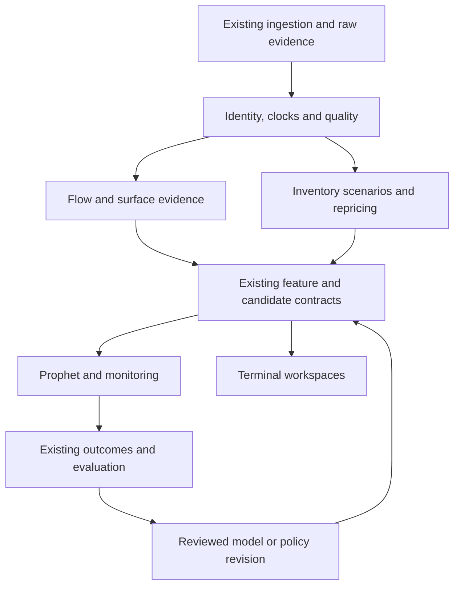

# Options Intelligence: executive research plan

**Commission:** `options-intelligence-deep-research-20261003-astra-001`  
**Principal:** Astra Meta-CEO, acting on the Chairman's October 3 instruction.  
**Carrier:** [Macro draft PR #8321](https://github.com/mastermindx-market-intelligence/macro/pull/8321).  
**Status:** Research and architecture specification. No predictive feature has earned new production authority through this work.

## 1. Executive decision

Build an options evidence layer that answers specific questions about an existing investment thesis, its risk, its timing and its possible expression. Evaluate each answer against the information Mastermind already has. Preserve distinct channels for informed trading, priced uncertainty, conditional hedging mechanics and execution quality. A large combined options score would hide their different horizons, assumptions and failure modes.

The system should be able to say all of the following coherently: an unusual event deserves investigation; its transaction intent remains unknown; the options market prices an expensive downside tail; a stated inventory scenario implies procyclical hedge demand; and the selected option is too costly or illiquid to express the thesis. None implies the others. Predicting actual price amplification also needs an impact/liquidity model or separately identified empirical evidence.

This is an extension of the existing program. Merged C0 [#6604](https://github.com/mastermindx-market-intelligence/macro/pull/6604) already consolidated the owners. Terminal [#599](https://github.com/mastermindx-market-intelligence/mastermind-terminal/issues/599) has an active implementation principal. The research package supplies evidence, falsifiable definitions and acceptance requirements to that program; it does not commission competing collectors, stores, candidate lifecycles or release workers. The next implementation handoff to Fable is conditional on the readiness packet in [ROADMAP_AND_HANDOFF.md](ROADMAP_AND_HANDOFF.md).

## 2. What changed after research

| Finding | Evidence and limits | Decision |
|---|---|---|
| Current implementation is much further along than the original brief implies | Pinned [Terminal census](options-terminal-census.md), current PR metadata and owner receipts; source and owner-reported deployment are distinguished | Finish current source integrity and consumer work through incumbent carriers. |
| Measured NBBO investigation is deployed, with stale source data in its latest inspected receipt | Terminal #667's October 3 08:10 UTC receipt reports a049d46f and September 25 events; this is UI-path evidence, not fresh capture | Freshness/recovery remains a concrete integration dependency, owned by the existing M1 producer. |
| Historical results do not establish durable alpha | The completed October 2 study evaluates 60 cells, with three BH rejections at 10% within the registered run and none repeating across all three eras | Preserve that study; improve identification, PIT and incremental evaluation. Do not repeat the same retrospective under a new name. |
| Headline opening-flow research needs classified exchange data | [Literature L02/L05](options-literature.md): actual opening/closing and participant categories; public signing is a proxy | Prohibit an “opening buyer” claim from ask-side volume or next-day OI alone. |
| Relative call/put IV can encode borrow costs | Published 2025 L17 reports predictability falling by at least two-thirds after removing high-fee stocks; current final tables remain an access gap | Borrow-conditioned and missing-borrow sensitivity tests are required. |
| Customer liquidity provision breaks a common dealer inference | SEC DERA L16 documents passive customer participation and sequencing issues | “Aggressor” and “customer” are different variables. Opposite aggressor is not automatically dealer inventory. |
| 0DTE findings concern different questions and paper versions | L13–L15 distinguish fresh trading, expiration presence and previously accumulated inventory; L14 subsumes two older papers | Test the mechanisms separately. Do not count overlapping manuscripts as independent replications. |
| Vendor capabilities have advanced | [Theta audit](options-thetadata.md): direct Python query client, binomial Greeks and sparse minute quote files now documented | Qualify useful additions behind the existing adapter. Preserve streaming ownership and compare normalized behavior before migration. |
| The final-hour Greek problem is joint model identification | [Synthetic witness](options-theta-tte-study.py): refitting IV under a time floor can preserve gamma while changing other sensitivities | Test mark, IV inversion, TTE, model and Greeks together. No universal gamma multiplier. |
| Competitor features are product evidence, not proof of forecasting skill | [Competitor report](options-competitors.md), 36 primary sources | Borrow strong provenance and investigation patterns; require independent evaluation of predictive claims. |

The October 2 result is not evidence that options can never help. It limits claims about the specific tested historical constructions. A warning that reduces adverse excursions, a better volatility forecast and a cheaper option expression can each have value without delivering a standalone directional portfolio.

## 3. Objectives and explicit non-objectives

The research objective is incremental decision value at a specified horizon. The practical product objectives are reliable observation, understandable uncertainty, disciplined candidate monitoring, and executable expression research. Scientific success requires results that survive time, confounders and realistic costs; delivery success also includes identifying and retiring misleading features.

This commission does not grant a new trading policy, activate the current candidate composer, revive previously rejected production scores, or change production publication. Research-only revival is already authorized by [DEC-OPTIONS-HISTORICAL-REVIVAL-RESEARCH-ONLY](../../../agentos/decisions/DEC-OPTIONS-HISTORICAL-REVIVAL-RESEARCH-ONLY.md). Old nulls remain part of the evidence. Features derived from them need a specific new hypothesis and a separately registered test.

Every proposed feature must identify its question, observable inputs, units, availability rule, horizon, confounders, comparison and kill condition. [The catalogue](options-signal-catalog.md) supplies 40 candidates. It is a research search space; the first pilot admits only six families.

## 4. The six-family pilot

“Tier One” here means first to qualify and evaluate. It does not mean that these features are already validated for production scoring.

| Family | Question | Initial consumer | Primary empirical target | Main challenge |
|---|---|---|---|---|
| P1. Unusual activity with execution-quality context | Is there unusual, well-observed activity worth investigation? | Flow Desk and candidate review queue | Proposed OIF01 next-30-minute range forecast; discovery utility separately | Intraday seasonality, event activity, repeated counting and coverage selection |
| P2. Signed dollar-delta flow with ambiguity retained | Does classified net directional exposure add information? | Research-only candidate support/counterevidence | Proposed OIF04 next-30-minute residual-return forecast | Aggressor error, package legs, carry trades and endogenous price response |
| P3. ATM IV minus square-root physical-variance forecast | Does relative implied/physical uncertainty add information? | Risk state and expression comparison | Proposed OIF19 matched-20-session variance forecast; expression utility separately | Volatility/variance units, jumps, event premia, positive forecast mapping and leakage |
| P4. Carry-aware matched call/put relative pricing | Does residual relative pricing add thesis information? | Deterioration/support research | Proposed OIF22 five-session return after a one-session skip | Borrow costs, dividends, exercise, stale asynchronous quotes and old nulls |
| P5. Conditional hedge stress under explicit inventories | How sensitive is a hypothetical inventory to spot, IV and time? | Exposure/Structure scenarios | Numerical correctness first; proposed next-10-minute variance test later | Unknown dealer inventory, surface dynamics and nonlinear expiry behavior |
| P6. Executable contract quality | Is a particular expression observable, affordable and consistent with the thesis horizon? | Existing Issue Desk and Payoff/Plan work | Quote qualification, cost model calibration and exact-option utility | Spread, latency, fills, exercise, financing and missing exits |

P1 and P6 can produce useful observational tools before directional alpha is established. P5 can produce an honest scenario tool before a dealer-position inference is established. Any candidate rank, gate, alert policy or size change needs a separate validated use and authority gate.

These proposed primary horizons now match the catalogue. They are design selections to freeze with the empirical packet, not accepted study results. The 20-session OIF19 feature is a volatility-unit residual against the square root of a variance forecast; it is not expected realized volatility. OIF20's variance-unit residual is a separately queued variant. A possibly negative residual cannot itself be scored by a variance-forecast loss.

The pilot should first use a bounded universe with demonstrable natural-session coverage, selected before examining outcomes. SPY/QQQ/IWM and a frozen liquid single-name panel are candidate cohorts, subject to actual source qualification. SPX/SPXW require separate index-underlying, exercise and settlement contracts. Do not pool them with physical-delivery equity options merely because their field names match. Universe membership, delistings, symbol changes and missing observations must be auditable.

## 5. Architecture inside existing owners

This diagram groups analytical responsibilities, not proposed services. The existing source adapters, parquet/artifact owners, candidate records, outcome receipts and evaluation pipeline remain authoritative. Reuse current flow → package → positioning → candidate → outcome → calibration identities. A feature records those references and the versioned transformation; it does not create a parallel event ledger.

| Existing owner | Responsibility in this commission |
|---|---|
| `WS:ADVANCED-DATA-OPTIONS` | Placement/admission, historical and current source capability, contract reference data and existing storage routes |
| `WS:INTRADAY-FLOW-P0-RECOVERY` | Natural-session capture, signing/condition/correction quality, measured NBBO and publication integrity |
| `WS:OPTIONS-ALPHA-INTELLIGENCE-RECOVERY` | Existing candidate lifecycle, operator research workflow, outcomes, option-expression and incremental candidate evaluation |
| `WS:OPTIONS-CONTEXT-AUDIT-PREREG-V2` | Historical hypotheses, null preservation, registered context studies and interaction tests |

Terminal #599 is the active implementation coordination carrier, with #603/#723 preserving workbench and integration continuity. Macro analytical producers own economic calculations; Terminal owns faithful presentation and interaction. Browser-side heuristics should not quietly become a second scientific implementation.

## 6. Information and mechanical channels

### Informed activity and relative pricing

Treat trades, quotes and exchange messages as observations. Trade direction is an inference unless actually classified. Opening/closing, participant type and package membership each require their own evidence. An inferred buy call has positive option delta, but may be a closing hedge, one leg of a spread or part of a stock-option package. Its economic thesis is not uniquely determined.

The feature set can nevertheless test whether carefully classified, sufficiently covered signed flow improves both an explicitly options-free research comparator and the actual incumbent model. The census identifies a source-wired GEX path in Prophet C1 fusion, so today's Prophet must not casually be called price-only. Evaluate raw and high-quality subsets together so that abstention cannot hide a poor coverage/accuracy tradeoff. Features derived from quote changes must compete with synchronized stock returns; a stale option quote reacting to an already-observed stock move is not leading information.

Surface signals require coherent forwards, carry, exercise and quote times. IV spread, skew, term slope, risk reversals, butterflies, implied variance and tail prices answer different questions. Tail insurance prices describe the risk-neutral distribution and compensation for risk; physical crash probabilities require separate calibration. Event-spanning variance measures should use the event schedule available at decision time.

### Conditional hedging and positioning

OI is unsigned outstanding inventory. The conventional call-positive/put-negative GEX map is a declared sign scenario. Public flow can inform possible inventory changes, but without participant and opening/closing data it cannot identify the full dealer book. Report starting inventory assumptions separately from intraday flow increments, and stress plausible sign allocations and coverage.

Scenario hedge demand is a change in the whole assumed book's delta after repricing under a stated spot/volatility/time path. Summing snapshot Greeks across contract strikes describes an exposure distribution; it does not by itself calculate how the whole book changes when spot travels. Current Terminal `hedgeProfile` therefore needs the discriminating mathematical review in this package before its interpretation is extended. Macro already has a spot-repriced gamma-profile kernel; extend accepted economics through the incumbent producer instead of duplicating it in the client.

The scenario layer must expose linear approximation error against repricing, partial versus complete coverage, multiple zero crossings, the actual sign of gamma at spot, and behavior across expiry. A nearest gamma flip is a level, not a universal rule that the regime is long above and short below.

## 7. 0DTE as a separate scientific lane

0DTE contracts compress several risks into short intervals: quote and underlying latency, discreteness, expiry/fixing conventions, rapidly changing sensitivities, surface extrapolation and order-book capacity. A feature useful over ten minutes should not influence a five-day candidate with an unchanged coefficient.

Use contract-specific `last_tradable_at`, economic payoff-fixing rule/status, exercise cutoff and settlement payment date. Standard AM-SPX fixing depends on constituent opens and is not one universal instant; document the rule and uncertainty. Compute exact remaining model time only where the economic clock supports it. Expired or indeterminate cases have explicit states, not an arbitrary positive TTE presented as precision.

Test at 3,601/3,600/3,599/1,800/900/300/60/1 seconds, both fixed-volatility and refitted-volatility. Include calls/puts, ATM and wings, early exercise/dividends, half days and adjusted deliverables. Evaluate price/IV/Greek consistency, convergence, finite differences and underlying-feed differences. The reference witness supplies a limited mathematical example; it does not replace real source parity tests.

For research endpoints, separate opening inventory, new same-day activity and expiration availability. Condition on time of day, event windows, volatility, liquidity and inventory scenarios. Evaluate realized variance/range, adverse excursion, breakout continuation and reversion independently. Include the same-time underlying/technical baseline and avoid using future quotes supplied alongside a trade as decision-time evidence.

## 8. Prophet and Terminal behavior

Before admission, options may add a research evidence block: support, counterevidence, volatility/tail state, scenario sensitivity and available expressions. Each has a horizon, evidence references and explicit unknowns. A missing options chain should not automatically penalize an otherwise eligible underlying thesis; measure coverage policy separately.

After admission, compare current evidence with the frozen candidate snapshot through the existing lifecycle. Ask whether activity persists or reverses, whether surface/carry changes contradict the thesis, whether adverse-move risk rises, whether catalysts change, and whether the chosen expression still fits. An expired option can invalidate that expression without falsifying the underlying thesis. A stale source can invalidate a monitoring observation without creating a bearish signal.

Use calibrated predictive outputs only after evaluation. A proposed `options_support_score` remains null until it has a defined target/horizon and an out-of-time calibration receipt. No addition of unlike standardized indicators can earn a probability label. [CONTRACTS.md](CONTRACTS.md) specifies the additive block, quality decomposition and consumer behavior.

Terminal should make provenance visible where it affects decisions: observed versus inferred versus scenario, source/effective/availability times, coverage, quote age, contract identity, and forecast horizon. Flow investigation, inventory scenarios, observed historical surfaces and payoff planning remain distinct views linked by exact evidence identity. Missing surface cells must remain missing; changing the root/session/revision must not leave old evidence looking current. Existing release carriers already cover much of this work.

## 9. Evaluation, graduation and stopping

[RESEARCH_PROTOCOL.md](RESEARCH_PROTOCOL.md) is the proposed research contract. It distinguishes observation qualification, mathematical correctness, association, out-of-time incremental prediction, calibrated decision utility and executable option economics. A pass at one level does not imply the next.

Each pilot family gets one registered primary endpoint/horizon, the actual incumbent baseline and its options-augmented comparison, plus an audited options-free comparator and fixed diagnostics. Freeze inputs, splits, transformations, costs and multiplicity accounting before outcome inspection. Compare on a common eligible population and report the broader coverage/selection impact separately. Use dependence-aware uncertainty and require all training, tuning and calibration labels to mature before the test-model freeze. Preserve failed variants and negative results.

Kill or downgrade a feature when its claimed input is unobservable, its result disappears after a necessary confounder/latency/cost correction, its sign or calibration fails across regimes, or its operational burden exceeds demonstrated utility. Reclassify useful descriptive displays honestly. A negative study that prevents false confidence is a successful research deliverable.

The first Fable handoff can implement qualified data contracts, numerical references and observation-only UI corrections once scoped against the active owners. Predictive policy and automated actions require their own completed evidence gates. [ROADMAP_AND_HANDOFF.md](ROADMAP_AND_HANDOFF.md) names dependencies, concrete work packets and the continuation frontier.

## 10. Build now, research next, reject or defer

### BUILD NOW — through current implementation owners

- Preserve and expose exact source/contract/quote clocks, correction identity, coverage and unknown states in current ingestion and consumers.
- Distinguish measured NBBO evidence from categorical chain proxies and legacy attention scores; correct mathematically false hedge/flip interpretations using the supplied witnesses.
- Qualify the existing candidate/consumer and outcome contracts, preserve their authority flags, and finish active identity, null-handling, replay and expression-review work.
- Add source-linked observational and scenario tools where the evidence and accepted data already support the stated meaning. Treat readiness of source data as a real dependency.

### RESEARCH NEXT

- Six pilot families with a frozen universe, endpoint, existing-model comparison, coverage policy and independent labels.
- Borrow/event-conditioned IV spread and skew; rigorously signed delta flow with package ambiguity; implied/physical variance forecasts.
- Exact-time 0DTE model parity, inventory sensitivity and prospective range/risk tests.
- Calibrated monitoring/false-veto utility and exact-option economics using separate observed-fill evidence where required.

### DO NOT BUILD YET / REJECT THE CLAIM

- Generic bullish/bearish options super-scores, volume>OI as known opening flow, every ask print as an institutional purchase, and opposite aggressor as observed dealer inventory.
- A universal time-floor gamma multiplier, cumulative contract-strike sensitivities presented as finite spot-travel hedge trades, and nearest-flip location presented as sufficient to determine regime.
- Risk-neutral tail prices as physical crash probabilities; scenario hedges as proven market impact; underlying returns or expiry payoff diagrams as executable option P&L.
- A duplicate collector/store/lifecycle, a second implementation of the same active carrier, or automatic rank/gate/size/alerts before their specified evidence and authority gates.

Rejecting a claim does not require discarding the underlying observation. A volume/OI ratio can remain an attention feature, and a strike sensitivity can remain a distribution display, if the name and evaluation match what it actually measures.
