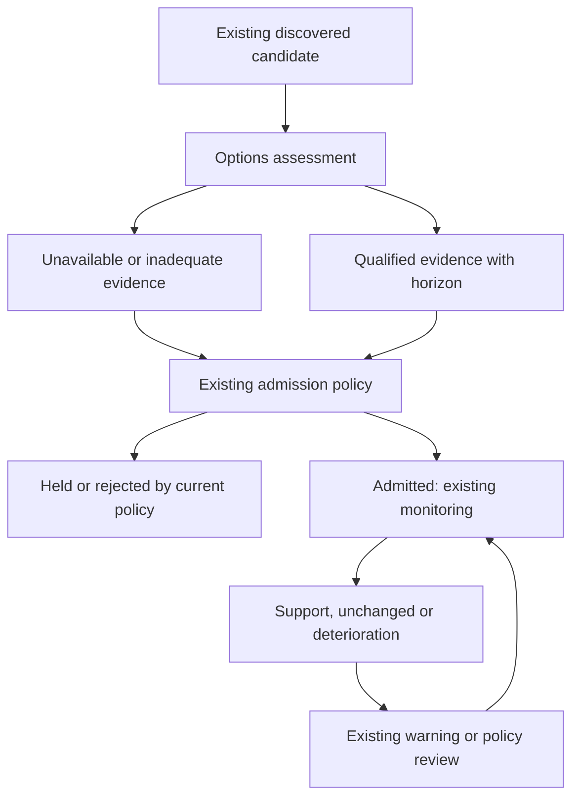

# Shared ontology, candidate behavior and Terminal product design

This is a proposed semantic contract across existing Macro producers, candidate/outcome records, APIs, Terminal and reasoning consumers. It adds no store or lifecycle. Source facts come from the [Macro census](options-macro-census.md), [Terminal census](options-terminal-census.md), [primary literature](options-literature.md) and [competitor evidence](options-competitors.md). Analytical formulas and clock/authority rules are in [CONTRACTS.md](CONTRACTS.md).

## 1. Canonical meanings

| Term | Meaning | Must not imply |
|---|---|---|
| Observed trade | A qualified source print with identity, conditions, clocks and correction state | Customer identity, opening intent or a complete strategy |
| Quote location | Trade price relative to an eligible bid/ask | A calibrated aggressor probability or bullish conviction |
| Inferred aggressor | A model/rule estimate of active buy/sell side, with coverage and ambiguity | That the active side is a customer or the passive side a dealer |
| Classified participant transaction | Side/capacity/open-close fields supplied by a scoped labelled source | Equivalent coverage across other venues or participants |
| Package hypothesis | Source-linked possible multi-leg/stock-option structure, with alternatives | Confirmed strategy from time proximity alone |
| Attention feature | Unusual activity normalized against a time-available reference population | Forward alpha, direction or calibrated confidence |
| Signed flow | Qualified signed premium/delta/vega under an explicit inference method | Observed net positions or new opening capital |
| OI state/change | Outstanding contracts effective at a specified closing session, available later | Same-day opening/closing allocation or dealer ownership |
| Relative pricing | Matched option pricing/IV after stated carry/exercise/input assumptions | Private information unaffected by borrow/dividend frictions |
| Implied distribution | Risk-neutral prices/distribution derived under stated assumptions | Physical forecast probabilities |
| Physical risk forecast | Forecast of realized variance, range, tail event or excursion with a target/horizon | A market price of insurance or an uncalibrated tail score |
| Position scenario | Explicit signed inventory assumption and scope | The actual dealer book |
| Exposure sensitivity | Derivative of portfolio value/delta under frozen inputs and declared units | Finite-move hedge transactions or actual future trading |
| Conditional hedge change | Repriced change in the hedge of a stated book for a specified scenario | Expected market order flow without an identified inventory/dynamics model |
| Gamma crossing | Root of the chosen book's spot-dependent net gamma curve, with orientation/domain | A universal support/resistance or long-above/short-below rule |
| Strike concentration/wall | Registered concentration of OI, volume or sensitivity at contract strikes | An inevitable price barrier or dealer defense |
| Candidate support | Evidence about one specified thesis target/horizon relative to its baseline | A universal summed options score |
| Counterevidence | Qualified observation or validated forecast that challenges a specified thesis component | Automatic rejection or a new tactical event |
| Expression suitability | Contract/strategy fit to horizon, risk, costs, liquidity and exercise conditions | A directional thesis or assured fill |
| Outcome | Mature label with defined target, prices, cost assumptions and data revision | Underlying returns substituted for option profits |
| Calibrated confidence | Out-of-time mapping to a specified predictive probability or interval | Data completeness, model-fit error or inventory-sign imbalance |

Every reasoning summary should retain evidence class, horizon, data age and material unknowns. For example: “classified positive delta-equivalent flow over 30 minutes, 62% premium coverage; package intent unknown” is an admissible observation. “Institutions are opening bullish positions” needs additional participant/open-close evidence. Omit invented precision when calibration is unavailable.

The source names `ask_share`, `score`, `gamma_regime`, `confidence` and `VRP` require provenance-aware interpretation. Existing similarly named fields do not become interchangeable through the ontology. Migration needs explicit producers/consumers and versioned compatibility; the current strict candidate schema rejects undeclared fields.

## 2. Candidate assessment overlay

The diagram describes decision semantics and permitted integration points. It is **not a new operational state machine or a serialization enum**. Existing Macro formation, revision, issue/review, monitoring and outcome owners retain their IDs and transitions.

| Lifecycle point | Options question and record | Allowed treatment before predictive qualification | Later action requiring a separate gate |
|---|---|---|---|
| Discovery | Is activity unusually large and sufficiently observed? | Attention/investigation evidence with explicit capacity and coverage | Options-originated candidate or rank change |
| Pre-admission | What supports/challenges thesis direction, risk and timing? | Attach separate evidence classes and unavailable states under accepted schema | Calibrated confidence change or predictive veto |
| Expression review | Does a specific contract fit the thesis and have usable quotes? | Existing operator research review; report invalid/expired/unobservable expressions | Automatic contract choice, issue, trade or size |
| Admission snapshot | Which exact evidence was available then? | Preserve current source/formation/candidate revision and authority | No extra policy action follows from saving evidence |
| Monitoring | Has qualified evidence changed relative to admission? | Source-linked observation history; stale versus genuine reversal distinct | Automatic upgrade/downgrade, warning or thesis-risk event |
| Maturity/outcome | What happened to the underlying thesis and the selected expression? | Existing immature/missing/evaluable outcome states and independent labels | Option-P&L claims beyond the accepted ruler or feedback/training |
| Evaluation | Did options improve the incumbent decision? | Frozen baseline comparison, nulls, calibration and costs | Production model/policy promotion |

For an admitted long underlying thesis, increasing downside-insurance prices might signal risk, a known event premium or borrow/carry distortion. A short-gamma scenario might describe amplification without specifying direction. Positive signed delta might arise from a hedged package. Present these separately and let validated target-specific evidence govern any later policy change.

Unknown source quality should withhold an options observation; it should not be converted into bearish evidence. A hard contract failure can invalidate the option expression while leaving the underlying thesis eligible. A true predictive veto requires demonstrated incremental decision utility, calibrated false-veto cost and explicit authority. The inactive candidate feed currently fixes all 15 authority fields false; this specification does not change that boundary.

## 3. Terminal surfaces should answer questions

The current product already has seven top-level categories, fourteen pane mounts and additional active work. Retain that investment and improve the meaning and coherence of its outputs. The table maps jobs onto existing surfaces; it is not a request to add a tab for every feature.

| User question | Existing home | Proposed information and interaction | Acceptance focus |
|---|---|---|---|
| What deserves investigation now? | Command/Flow Desk | Activity versus normal, observed premium/contract count, source age/coverage, reason for attention | Heuristic attention tiers not called probabilities; stale source visible |
| What happened in the actual observations? | Tape/Timeline/Ticker Drill and measured Alpha investigation | Exact event/contract/quote evidence, sign method, conditions, package alternatives, correction history | Same identity into inspector; no ticker-only evidence joins |
| Where is activity concentrated? | Chain Heatmap/Surface | Volume/premium/observed quote-location layers; categorical proxy separately named | Empty versus zero and measured versus inferred preserved |
| What outstanding structure exists? | Structure/OI ladder/change | OI effective session and availability, concentrations, changes, contract coverage | No volume>OI opening claim; corporate actions/session transitions qualified |
| Which assumptions drive exposure? | Exposure/GEX/Positioning | Assumed book, Greeks, coverage, multiple crossings, local sign, scenario sensitivity | Actual source/data times; partial Greeks and inventory assumptions visible |
| What could happen over the final hour? | Existing 0DTE/Near-Expiry and scenario views | Exact economic clock, conditional repricing, source latency, scenario ranges and failure state | See dedicated [near-expiry specification](options-near-expiry-spec.md); no unsupported probability |
| What uncertainty is priced? | Volatility/Skew/Term Structure | Matched tenor/forward, surface quality, event/borrow context, priced versus forecast variance | Null-safe parsing; real spot/forward anchor; unit and horizon reconciliation |
| Does this evidence change the candidate? | Prophet/Options Alpha | Admission snapshot versus latest qualified evidence; support/counterevidence/risk/expression blocks | Explicit baseline/horizon; authority remains inherited; strict schema migration |
| How can I express the thesis? | Existing Issue Desk/Payoff Lab/Plan work | Exact contracts, quote age/spread, costs, expiry/exercise, scenario payoff and pre-expiry mark distinction | Reuse #781/#769/#723 design; manual expiry chart is not live execution evidence |
| Why was I warned? | Existing alert framework and candidate timeline | Observation, source quality, predictive model and decision reason distinguished; linked evidence | Dedup/cooldown not called statistical validation; explain stale/unknown state |
| What did we know then? | Existing replay plus linked inspectors | Root/session/artifact revision, available-at cut, original unknowns and corrections | Exact cross-pane identity; observed history separate from hypothetical futures |
| Did the feature work? | Existing evaluation report/Statistics gate | Out-of-time incremental effect, calibration, costs, coverage, regimes and failures | No placeholder or instrumentation counted as completed science |

The summary surface should show a small number of decision-relevant statements, each expandable to evidence. Suggested order: data health; unusual observed activity; qualified thesis support/counterevidence; priced risk; conditional mechanics; expression constraints. A stale frame should remain understandable without needing the user to infer that a network connection or fresh page load says nothing about market freshness.

Cross-pane interaction carries root, session, selected contract when applicable, artifact revision and replay cursor. Reset or withhold mismatched responses when any identity changes. Reuse current cache/broadcast/replay owners; fix current gaps rather than adding an independent synchronization bus. Existing #608 repairs are retained; unknown-cell and per-minute/off-open semantics need their own current-source acceptance.

## 4. Competitive gap matrix

This matrix summarizes public product documentation in the [competitor report](options-competitors.md) and current source/owner evidence in the censuses. “Documented” means advertised/described, not independently verified end-to-end. “Not established” means the inspected sources do not prove the capability or result; it is not a claim that a competitor cannot offer it.

| Capability | Mastermind at census | SpotGamma | LiveVol / Trade Alert | OptionMetrics | Unusual Whales | ORATS / other benchmarks | Proposed Mastermind |
|---|---|---|---|---|---|---|---|
| Trade/quote investigation | Measured NBBO path deployed with stale-source receipt; legacy flow also exists | HIRO/TRACE documented analytics | Trade, quote and structure investigation documented; Trade Alert says it will cease | TradeFlow aggregates and trade-code/venue context documented | Flow filters and trade-side caveats documented | SpiderRock describes detailed timing/sign/error records | Qualified natural-session evidence with exact downstream identity |
| Package/participant interpretation | Sweep/proxy and package research; actual intent generally unknown | Proprietary interpretation | Multi-leg/context tools documented | Proxy classifications; scope-specific datasets | Product acknowledges spread/hedge ambiguity | Cboe C1 labelled executions offer a scoped validation source | Calibrated inference/abstention with exchange-scope labels where acquired |
| Dealer scenarios | Existing assumed-sign GEX and scenario UI; mathematical issues identified | Proprietary dealer-position models | Exposure tools within broader analytics | Research inputs; no observed whole dealer book established | GEX/OI metrics documented | SqueezeMetrics conventions differ; SpiderRock risk models | Repriced conditional books, assumption dispersion, explicit claim ceiling |
| Surfaces, events, carry | Existing IV/skew/term/RV; current integrity and provenance gaps | Volatility context | Historical IV/volatility analytics | Historical surfaces/Greeks and research datasets | IV/OI/event filters | ORATS fit/surface/dividend/earnings and strategy tools | Matched clocks/tenors, borrow/event controls and exact model lineage |
| Historical research | Existing 60-cell study and null record | Public research/product methods vary | Historical analytics/data | Core research dataset role | Historical flow/product analytics | ORATS backtesting; SpiderRock/BMLL records | Frozen PIT/availability class, baseline attribution and failed variants retained |
| Candidate lifecycle and context | Prophet, Alpha shadow, Issue Desk, outcome owners; predictive authority restricted | Cross-system Mastermind integration not established | Same | Same | Same | Strategy tools differ from Mastermind's current lifecycle | Price/regime/catalyst plus options evidence from admission through outcome |
| Exact-option economics | Preregistered ruler and active fixture evaluator; no new P&L authority | Product-specific strategies | Portfolio/strategy analytics documented | Data inputs, not assured fills | Trade analysis, not validated Mastermind economics | ORATS is a strong cost/backtest comparison; execution claims need validation | Exact selection/quotes/costs/expiry with missingness and observed-versus-simulated scope |
| Incremental decision advantage | Not established by current evidence | Not assessed by this commission | Not assessed | Not assessed | Not assessed | Not assessed | Primary research objective; evidence must demonstrate improvement over incumbent baseline |

The plausible advantage is the integrated candidate lifecycle: compare options observations with a known thesis, existing price/regime/catalyst context and later outcomes. The source estate makes that integration feasible. The academic/product evidence does **not** establish that Mastermind already outperforms standalone tools, or that simply combining them will do so. Incremental, out-of-time decision utility is the test.

Cboe's labelled C1 data is a potential bounded validation purchase, not an acquired dataset or complete-market truth. ORATS can inform model/cost comparisons; SpiderRock's provenance schema is a useful design reference. Replicating proprietary dealer inventories from ordinary public data is not a credible near-term promise.

## 5. Product acceptance journey

A research-qualified vertical slice begins with a naturally captured event or snapshot whose source and availability are evidenced. The user opens a root/contract, sees the observed activity and quality, inspects quote and package uncertainty, compares the candidate's admission evidence with the current qualified context, and opens an explicitly simulated or reviewed expression if available. Later the same IDs lead to the mature outcome and evaluation. Unknown/stale/excluded paths are part of the journey.

Success is that the user can answer what happened, what is inferred, what might matter for this thesis/horizon, what cannot be concluded, and which exact evidence supports the answer. More metrics on a page are not an acceptance criterion.
