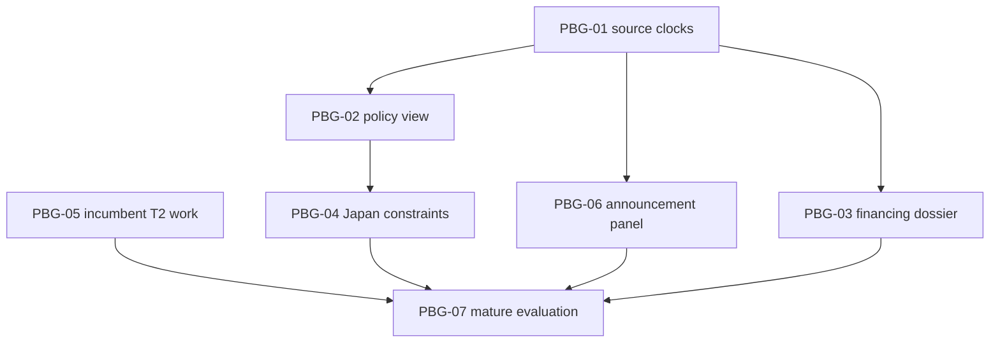

# PB-G — Build roadmap

**Status: proposed and unlaunched.** This is the dependency order for separately authorized work, not a dispatch or release decision. It does not transfer custody from any incumbent. The bounded PB-G research commission ends with this packet.

## 1. Product choice and sequence

Build the ability to inspect policy and company evidence before attempting to infer hidden intent or improve investment decisions. The first capability corrects a concrete source-clock loss; the next two make the surviving research useful to a person reading Policy Watch or a company dossier. No return establishes the predictive edge needed for rank, entry, sizing or live-alert changes.

| Order / ID | Independently useful capability | Existing owner and consumer | Why this position | Dependency / acceptance boundary |
|---|---|---|---|---|
| 1 / **PBG-01** | Carry source vintage, source-family coverage and observation clocks through the current policy brief and future thesis rows | Policy Intent and current Policy Watch; Data OS supplies temporal law | A newer synthesis currently loses the gathered policy-evidence date. Fixing this prevents false currency in every dependent view | Exact-path custody and versioned owner contract; source-qualified output plus normal-path proof |
| 2 / **PBG-02** | Inspect words, actions, legal state, alternatives, constraints, beneficiaries and what would change a policy view | Existing Policy Watch page; existing lifecycle and context-only Intel Hub facet | Delivers the policy product without claiming forecast superiority | PBG-01 admitted; factual state remains owned; no second timeline store |
| 3 / **PBG-03** | Follow financing/support commitments to execution, cash, obligations and counterexamples in a company dossier | Company Intelligence, capital structure/CCW and GovRev; current dossier/continuation consumer | Typed financing facts are useful despite unresolved aggregate causal claims | Existing owner contracts and clock interfaces accepted; separate unsupported-instrument admission; Terminal receiving path verified before any Terminal completion claim |
| 4 / PBG-04 | Inspect the U.S.–Japan constraint set by actor and instrument, with measured rate/FX context | Policy Intent/Policy Watch country projection and RIC | A bounded research view is justified; control, veto and causal share are not | PBG-01 and PBG-02 projection pattern; current international-source ownership established |
| Incumbent / PBG-05 | Preserve PB-D's actual event-quality question at the existing prospective implementation boundary | Incumbent [#8576](https://github.com/mastermindx-market-intelligence/macro/pull/8576), Company events, qbus, Prophet and evaluation owner | Work is already occupied; this is a precision and admission handoff | Reconcile incumbent exact head and source paths. No parallel quality store, cohort or evaluator; enrollment remains separately authorized |
| Later / PBG-06 | Inspect an outcome-blind, coverage-qualified strategic-announcement panel | Existing official/news sources, qbus and Company event workspace; research consumer | Current panel cannot identify a market-support mechanism or freely timed population | Source/root/role/clock acceptance, complete inclusion denominator and frozen future protocol; no activation in PB-G |
| Last / PBG-07 | Judge mature evidence with comparable model inputs, dependence-aware estimates and explicit promotion limits | Existing research evaluation owner, consuming source-bound frozen cohorts | Evaluation should answer the original question rather than promote selected discovery counts | Accepted evaluation contract before enrollment; outcomes only after maturity; independent review and separate authority decision afterward |

Priority is qualitative expected user value and dependency reduction, not an invented estimate of returns, effort or dates. PBG-03 may proceed alongside the display work once its own source/clock contract is accepted because it changes different owner paths. PBG-01 and PBG-02 touch the same policy producer and must remain sequential. PBG-05 follows its incumbent's authorized plan independently; PB-G neither starts nor stops that operation.

## 2. Dependency structure

These are future commission dependencies, not proposed data ownership or an executable orchestration graph. PBG-07 can freeze methodology before other builds finish, but cannot evaluate outcomes that do not exist or activate a cohort.

## 3. What is deliberately held

| Unresolved item | Missing discriminating evidence | Current treatment |
|---|---|---|
| Rich M2 superiority | Comparable predictions, equally informed institutional benchmark and ablations | Freeze a new experiment; retain old M2 as M2-min and all historical bytes |
| Strategic preference for a restrictive regime | Feasible alternatives and behavioral predictions that distinguish preference from inflation/institutional constraints | Display instrument decisions and alternatives; no latent-motive score |
| U.S. causal control of BOJ/MOF | An identified changed decision or timing counterfactual, separated by instrument | Conditional constraint view only; no control/permanent-veto classification |
| Causal two-speed cost of capital | Comparable all-in cost, support exposure and counterfactual financing | Typed terms and observed credit conditions; no causal discount |
| AI industry dependence/unwind | Consistent entity perimeter, realized cash tracing and an industry denominator | Preserve conditional commitments, actual cash and counterexamples; reject inevitable-unwind assertion |
| T2 quality interaction | Prospectively frozen materiality/roots, known absence, cut-time source receipt, complete controls and mature independent breadth | Research-only incumbent interface; no entry/rank changes |
| Announcement orchestration | Source coverage, scheduling/role information, valid market-stress timing and adjusted returns | Future design only; no positive-sentiment coordination proxy |
| Election optionality / geopolitical origin | A discriminating actor/time-specific design and evidence | Lower-priority design work only; not a hidden-intent classification product |

The detailed experimental amendments are in [the baseline](PB_G_POLICY_BEHAVIOR_BASELINE.md). Claim-level conditions for changing a view are in [the ledger](PB_G_CLAIM_LEDGER.json).

## 4. Admission and stopping discipline

A later owner starts with the exact handoff and shared conditions in [the implementation index](PB_G_IMPLEMENTATION_HANDOFF_INDEX.md). It must re-read current protected procedure, current source and actual path custody. An open PR is a collision signal, not proof of a live lease or permission to modify it. A research proposal on an unmerged branch is evidence to assess, not accepted source law.

Source acceptance, implementation, production-path proof, study enrollment, research acceptance and investment authority are distinct decisions. Passing a deterministic adapter test does not validate a hypothesis. A positive prospective study permits a bounded review of that estimand; it does not automatically authorize another consumer.

Each build stops when its exact capability and failure behavior have been demonstrated on the declared consumer path, or when a specific missing owner contract prevents that proof. Do not grow an intake adapter into a new event system, turn a display into a scoring engine, or treat an n-floor as a promotion rule.

## 5. Roadmap source basis

The source-clock defect and existing UI labels are grounded in [Policy Intent](https://github.com/mastermindx-market-intelligence/macro/blob/c6c0ab36cdbf31f74a20f5ebf9304dd3fd920b05/engine/policy_intent_desk.py) and [Policy Watch builder](https://github.com/mastermindx-market-intelligence/macro/blob/c6c0ab36cdbf31f74a20f5ebf9304dd3fd920b05/scripts/build_policy_watch.py). Company identity/corrections are grounded in [event workspace](https://github.com/mastermindx-market-intelligence/macro/blob/c6c0ab36cdbf31f74a20f5ebf9304dd3fd920b05/engine/company_intelligence/event_workspace.py), financing in [capital-structure projection](https://github.com/mastermindx-market-intelligence/macro/blob/c6c0ab36cdbf31f74a20f5ebf9304dd3fd920b05/engine/capital_structure/projection.py), and support amounts in [GovRev amount semantics](https://github.com/mastermindx-market-intelligence/macro/blob/c6c0ab36cdbf31f74a20f5ebf9304dd3fd920b05/engine/government_revenue/amount_semantics.py). The [architecture freeze](PB_G_ARCHITECTURE_FREEZE.md), [no-duplication map](PB_G_NO_DUPLICATION_MAP.md) and [source manifest](PB_G_SOURCE_MANIFEST.json) retain the exact inspected revisions, held dependencies and live-proof limitations.

