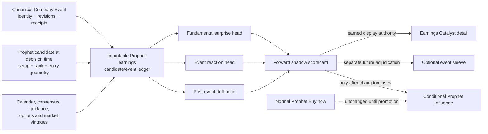

# US Prophet user-first board and earnings-catalyst handoff

**Status cutoff:** 2026-08-15, from `origin/main` at `9c9cb599be22db713422f330c3684f8f22c54c96`

**Scope:** the user-facing US Prophet board, the fresh-entry earnings holdout, and the proposed earnings-event intelligence that may eventually become a separately governed catalyst product.

**Cold-start purpose:** a competent new session should be able to identify what is live, what is only research or display context, what is not built, and the next lawful implementation slice without reconstructing the August 10-15 history from chat logs.

**Canonical status for this project:** this file. It does not supersede the evidence in [`EARNINGS_CATALYST_LOBE_ASSESSMENT_2026-08-10.md`](./EARNINGS_CATALYST_LOBE_ASSESSMENT_2026-08-10.md), the company-event architecture docket, or active Agent OS workstreams. It reconciles them for this narrow project.

---

## 0. Executive verdict

The user-facing repair is complete and live. The predictive earnings-catalyst product is not built.

| Question | Current answer |
|---|---|
| Is the stale `Themes in favour` strip still in the Prophet action container? | **No.** It was removed. |
| Is the rotation essay still above the board? | **No.** It was removed. |
| Are pre-earnings setups hidden? | **No.** They remain linked under **Earnings watch**. |
| Are those names ranked as ordinary `Buy now` entries through the report date? | **No.** The three-trading-day fresh-entry holdout remains. |
| Does earnings affect active positions? | **No.** Launched/intact/broken HOLD states are not re-suppressed. |
| Does stale or missing calendar data block names? | **No.** The gate fails open and emits staleness diagnostics. |
| Does `engine/earnings_catalyst.py` predict beats or stock reactions? | **No.** Despite its name, it is display-tier date/reaction math only. |
| Is there a point-in-time Prophet earnings candidate/event/outcome ledger? | **No.** This is the first real missing foundation. |
| Is there a model for fundamental surprise, event reaction, or post-event drift? | **No.** None of the three heads exists. |
| Is there an earnings event sleeve? | **No.** No score, sizing contract, track record, or promotion decision exists. |
| Should the present earnings holdout be lifted now? | **No.** House evidence supports caution and does not support the informed-buying shortcut. |

The realistic project is therefore not another copy pass and not an immediate model. It is an accountable measurement loop:

1. bind every earnings-window Prophet candidate to the canonical company event;
2. record exactly what was knowable when the candidate appeared;
3. advance event and counterfactual outcomes nightly;
4. benchmark three separate forecasting targets;
5. run them in shadow long enough to earn or fail authority;
6. only then add a display product or optional event sleeve.

---

## 1. What users have now

### 1.1 The current Prophet board contract

The main board remains an action surface. The order is intentionally:

1. actionable Prophet cards;
2. the compact `Passed on tonight` accounting shelf when applicable;
3. a compact **Earnings watch** row for setup candidates held out by the earnings window;
4. lower-priority history/context lanes.

The Earnings watch row says, in plain language:

> The setups are still there, but earnings can reprice them fast. Prophet waits through the report date.

Every ticker remains linked to its dossier. Held-out tickers are excluded from the other fresh-trigger list so the page does not show the same candidate twice.

The removed material must stay removed from this action container:

- `Themes in favour`, especially age-heavy entries such as `turned 90d ago`;
- the verbose GICS rotation essay and its machine-written tooltip;
- `setups suppressed today` language, which described an internal mechanism rather than helping a user decide what to do;
- technical paragraphs whose detail belongs in a tooltip, dossier, methodology page, or research artifact.

The relevant source is [`templates/dashboard.html.j2`](../../templates/dashboard.html.j2). The generated production page is `site/us_stocks.html`; do not mistake the template for live proof.

### 1.2 Live proof snapshot

The original UI release was PR [#5316](https://github.com/mastermindx-market-intelligence/macro/pull/5316), squash-merged at `e1129d9e9978c0e717dbb8734e7d622151f653a8`. Its exact render was Actions run [31465870115](https://github.com/mastermindx-market-intelligence/macro/actions/runs/31465870115), which published `03743d9c26a542a5e73127d72e56207caea891ee`.

Re-verified on 2026-08-15:

- production health returned `status=ok`, server commit `846c6733043`, checkout `576ce390092`;
- the cache-busted live page contained `Earnings watch` once;
- it contained `waits through the report date` once;
- it contained zero instances of `Themes in favour`;
- it contained zero instances of `setups suppressed today`.

These hashes are a snapshot, not a permanent pin. A new session must re-fetch `origin/main`, call `https://mastermind-x.com/api/health`, and inspect a cache-busted live page before claiming current production state.

---

## 2. What has been done

### 2.1 Page-wide human-copy cleanup

PR #5316 did more than replace the three strings in the screenshots:

- removed the stale themes strip;
- removed the rotation donor banner;
- removed the top-level suppressed-earnings banner;
- added the linked Earnings watch row below the action cards;
- clarified the through-report-date behavior;
- prevented held tickers from duplicating in the fresh-trigger lane;
- added an honest all-held empty state;
- simplified nearby labels, tooltips, fallback copy, evidence chips, footnotes, risk copy, and Theme Tape help text;
- removed the dead preview adapter for the deleted themes mini-strip;
- verified desktop and mobile EN/ZH compositions with no horizontal overflow.

The release passed 246 targeted/adjacent tests, all 12 CI packs, fences, unrun-test audit, title-i18n, filing-term, and exact-head render checks before merge.

### 2.2 Earnings-window evidence was adjudicated

The decision was not made from the UI complaint alone.

The preregistered broad comparison in [`research/entry_stack/W1_SEV_REPORT.md`](../entry_stack/W1_SEV_REPORT.md) covered 57,595 gradable fires. At the three-trading-day window:

- treatment: 4,332 rows;
- controls: 53,263 rows;
- five-session stop risk: **+8.7 percentage points**, 95% CI **+7.8 to +9.9 points**;
- direction: stable across all four reported eras;
- veto volume: 6.0%, inside the 10% budget;
- no detected 21- or 63-session adverse-excursion difference.

The study closest to the proposed informed-buying hypothesis, [`EARNINGS_IGNITION_MEASUREMENT_2026-08-08.md`](./EARNINGS_IGNITION_MEASUREMENT_2026-08-08.md), found:

- pre-report Prophet-style confluence: mean event reaction **+0.047%**, `n=726`, 95% CI **-0.32% to +0.42%**;
- other covered reports: mean reaction **+0.352%**, `n=9,497`;
- difference: **-0.305 percentage points**, 95% CI **-0.690 to +0.079**;
- negative event reactions: **357 of 726**, or 49.2%;
- five-session losers at the same quality label: `take` 10.2% versus 3.3%, `block` 35.4% versus 21.1%.

This supports a narrow conclusion: keep the current discontinuity holdout. It does not prove earnings-window companies lack upside, and it does not close the search for a real catalyst signal.

Limitations remain binding:

- the broad historical study anchored events on Item 2.02 filing dates rather than the live scheduled-event feed;
- source panels carry survivorship warnings;
- the null event-reaction difference cannot rule out a smaller edge below detection power;
- historical replay is not a substitute for a production-calendar forward ledger.

### 2.3 The existing gate was preserved and made auditable

[`engine/earnings_blackout.py`](../../engine/earnings_blackout.py) remains the one fresh-entry earnings authority:

- `in_blackout` when a fresh row has `0 <= trading_days_to_report <= 3`;
- passed dates never veto;
- stale/missing/unparseable data fails open;
- `next_date` controls the verdict; `next_time` is display context only;
- the store is `data/earnings/earnings.parquet`;
- the module does not read Item 2.02 filing dates for the live decision.

[`scripts/build_stock_library.py`](../../scripts/build_stock_library.py) applies the gate only to fresh-buy and recovery candidates, attaches `event_blackout` rejection receipts, preserves active HOLD states, and emits the `earnings_blackout_note` consumed by the board.

### 2.4 Display-tier earnings context already exists

[`engine/earnings_catalyst.py`](../../engine/earnings_catalyst.py) is already shipped. Its current name is easy to misread.

It provides only:

- a holiday-exact `days_to_report`;
- `reports_within_7` and the current 14-session glance chip window;
- explicit stale/null semantics;
- bilingual `Reports today / tomorrow / in N d` chip text;
- a deterministic post-report day-0 move from closes;
- no I/O and no model.

Its own contract says it cannot gate, rank, size, filter, or veto. It is not the predictive catalyst lobe proposed in this handoff. Do not silently expand this module into one; use a clearly separate forecast/ledger namespace on the canonical event spine.

### 2.5 The company-event identity spine exists

Do not invent another event identity or transcript pipeline.

Reusable foundation under [`engine/company_intelligence/`](../../engine/company_intelligence/):

- `events.py`: issuer-keyed, correction-stable `company_event.v1` and point-in-time lifecycle transitions;
- `event_id_adapter.py`: aliases existing `cie_...` and `TICKER/YYYYQn` identities to one canonical issuer event;
- `identity.py`: point-in-time issuer/listing resolution;
- `documents.py`: source/document revisions;
- `resolution.py`: event resolution;
- `contracts.py`: deterministic context and manifest contracts;
- `health.py`: status and completeness semantics;
- `views.py`: bounded context projections.

The canonical earnings event has a readable issuer/fiscal identity such as `evt_cik0000320193_2026q3_results`. The proposed ledger should reference that ID and its correction lineage, not copy event facts into a parallel knowledge base.

### 2.6 The old earnings-score split brain was fenced, not reborn

The legacy Stage-2 × earnings-call construction still exists as a historically promoted leash mechanism. Its maturity clock is frozen by `DNR:HOLD-PSQ-TILT-CLOCK` because the required 0-100 `earnings_call_sent` source is gitignored, undeployed, and has accrued no lawful forward cohort.

The repository now separates production primitives in `engine/prophet_stage_inputs.py` from the research harness `engine/prophet_stage_fusion.py`, and tests pin the source/scale contract.

Do not:

- repoint the 0-100 `EC_SENT_GATE=24` at `data/earnings_calls/scores.parquet`, whose `sentiment` is on a different -1..1 scale;
- treat source-availability disclosure as eligibility;
- remove or reactivate the legacy leash without an operator decision;
- reuse this starved construction as the new catalyst lobe.

### 2.7 Adjacent Prophet programs have advanced

These are important context, not work to absorb into this project:

- **Conditional Fusion** — `WS:PROPHET-CONDITIONAL-FUSION` has built its research machinery through PR-2. The current honest result is refusal to fit on only 24 graded dates; 67 more dates are needed for the frozen fold law. No live ranking change was earned. Next is prospective PR-3 shadow scoring. If the earnings lobe later produces lawful features, Conditional Fusion is one possible promotion consumer; it is not permission to skip the lobe's own ledger.
- **US availability** — `WS:PROPHET-US-AVAILABILITY` hardened rescue and nightly-liveness behavior. PR #5723 separated the EDT and EST-guard cron concurrency groups. The first real scheduled-pair proof and Conditional Fusion §13.0 fresh-accrual closure remained open at this cutoff.
- **Live Entry Radar** — `DEC:LER-SEPARATE-SYSTEM-NOT-PROPHET-CHANGE` keeps early-entry formation separate from Prophet conviction and safe-timing confluence. Earnings-event research must not become a back door for changing Radar or weakening Prophet's measured gate.

---

## 3. Current architecture and authority map

| Component | Current role | Authority now | Rule for the next session |
|---|---|---|---|
| `data/earnings/earnings.parquet` | Scheduled earnings calendar and surprise history used by current board machinery | Source data | Check freshness and correction behavior; do not treat it as a complete point-in-time research ledger. |
| `engine/earnings_blackout.py` | T-3 through report-date fresh-entry holdout | **Gate authority**, narrow and fail-open | Preserve behavior unless a separately preregistered promotion adjudication changes it. |
| `scripts/build_stock_library.py` | Applies gate, records rejection reason, emits Earnings watch payload | Production builder | A future candidate recorder may observe this seam, but must not mutate board membership in its first wave. |
| `templates/dashboard.html.j2` | User-facing Prophet board and Earnings watch row | Display | Keep primary copy short; technical detail belongs behind disclosure. |
| `engine/earnings_catalyst.py` | Countdown/chip/reaction display math | **Display only** | Do not convert in place into a predictor. |
| `engine/company_intelligence/*` | Canonical issuer event, source revisions, identity, exact evidence, context projection | Context only | Reuse event IDs, correction lineage, and receipts. No parallel event spine. |
| `data/prophet/ledger.jsonl` and plan files | Official Prophet plan history | Official immutable record | Never rewrite historical rows to simulate an earnings experiment. |
| future earnings candidate/outcome ledger | Counterfactual research clock | Does not exist | Build append-only, PIT, nightly-advanced, and separate from the official plan ledger. |
| future earnings forecast heads | Surprise, reaction, drift probabilities | Does not exist | Shadow first. No board, rank, size, or gate effect. |
| Prophet Conditional Fusion | Champion/challenger meta-ranking arena | Research/shadow only today | May consume a matured event feature only through its frozen promotion law. |
| optional event sleeve | Explicit earnings-gap-risk trade contract | Does not exist | Must remain visibly separate from normal `Buy now` and earn its own sizing/risk budget. |

Two governance statements must be read together:

1. `DNR:KILL-CALENDAR-GATED-RISK` forbids turning a calendar window by itself into a market-risk sizing leg.
2. `DEC:PROPHET-ZERO-AUTHORITY-SUPERSEDED-BY-EARNED-CONDITIONAL-AUTHORITY` permits an unvalidated feature or model to earn conditional authority through the frozen arena; it grants no automatic authority and does not revive an unconditional composite.

An issuer-level event forecast may be researched. A date on the calendar is not a forecast.

---

## 4. What is not built

The following artifacts do not exist at this cutoff:

- an immutable row for every Prophet candidate that entered the T-3 earnings window;
- a stable join from that row to the canonical `company_event.v1` ID and correction lineage;
- decision-time calendar vintage, consensus vintage, dispersion, guidance, options-implied move, source availability, and Prophet component snapshot in one contract;
- an explicit cohort field such as `normal_entry`, `earnings_watch`, or future `event_sleeve`;
- a counterfactual normal-entry result for held-out candidates;
- a nightly-only event/outcome advancer;
- first-tradable-price, event gap, event-day excess return, H5/H10/H21, MFE/MAE, implied-move exceedance, and setup-survival outcomes on one ledger;
- a frozen point-in-time feature manifest;
- consensus-only, revision-only, implied-move, and base-rate benchmarks;
- calibrated fundamental-surprise, event-reaction, or post-event-drift heads;
- a forward scorecard by era, sector, market cap, report time, or data-availability state;
- a display-approved event probability card;
- an optional event sleeve, sizing law, gap-risk budget, or audited track record;
- evidence that the normal Prophet holdout should be relaxed.

Historical studies and current display chips are not substitutes for these missing pieces.

---

## 5. The product decision that remains in force

### Keep the gate, keep the names

Normal Prophet and an earnings event trade are different contracts:

1. **Normal Prophet entry:** the setup and timing are actionable under ordinary price continuity.
2. **Earnings event trade:** the user deliberately accepts gap risk because there is an explicit, separately measured view on the report, expectations, and likely reaction.

Until the second contract exists, pre-earnings names belong in Earnings watch rather than `Buy now`.

This is not permanent timidity. It is the cleanest way to preserve the current product while creating an opportunity set that can be measured honestly.

### The informed-buying intuition stays a hypothesis

Pre-report momentum may sometimes reflect informed or better-informed buying. The present Prophet signal did not identify those cases reliably in the historical event study. Treat price strength, volume behavior, options texture, short interest, and institutional context as candidate features only when their point-in-time provenance is clean.

Never turn `curling upward before earnings` into `somebody knows` in user copy, research labels, or model ground truth.

---

## 6. Realistic remaining work

The engineering can be built in several short waves. The evidence clock cannot be compressed by coding faster.

| Wave | Deliverable | Rough engineering scope | Evidence gate |
|---|---|---|---|
| 0 | Current-state contract freeze | 1 focused session/PR | Confirm canonical event ID, active-path ownership, data vintages, and no duplicate open lane. |
| 1 | Candidate/event ledger | 2-4 focused sessions/PRs | Every earnings-window candidate writes exactly one idempotent row with decision-time facts and cohort. |
| 2 | Nightly outcome and counterfactual advancer | 2-4 focused sessions/PRs | Outcomes mature without overwrites; held-out versus normal-entry counterfactual remains auditable. |
| 3 | Baseline docket and feature manifest | 2-3 research sessions | Freeze targets, availability rules, benchmarks, splits, costs, and missingness before viewing model outcomes. |
| 4 | Shadow baseline forecasts | 3-5 focused sessions/PRs | Calibration and ranking beat simple benchmarks on historical PIT replay without leakage; still no authority. |
| 5 | Prospective shadow race | Mostly evidence time | At least one meaningful earnings season; preferably two across different tape regimes. Print coverage and abstentions. |
| 6 | Display-only catalyst view | 2-3 product sessions after evidence | Only calibrated probabilities/reasons with exact receipts; no change to normal Prophet. |
| 7 | Optional event sleeve adjudication | Separate program decision | Preregistered forward comparison clears costs, gap slippage, calibration, era/sector stability, and risk budget. |
| 8 | Possible normal-Prophet influence | Last, not assumed | Challenger beats champion under the Conditional Fusion promotion gate and receives explicit operator/CEO adjudication. |

The likely code effort is weeks of narrow PRs, not months. The honest promotion clock is at least one to two earnings quarters. A historical backfill can debug and reject bad constructions; it cannot by itself earn live authority.

### 6.1 Wave 0: the next session's actual starting job

Do **not** start with a model or UI.

Start with a contract-and-writer PR whose entire purpose is to create the forward clock.

Required design decisions:

1. **Identity:** reference `engine.company_intelligence.events.canonical_event_id`; never mint a parallel ticker/date event key.
2. **Candidate identity:** deterministic from canonical event ID, ticker/listing identity, Prophet candidate/plan identity, decision session, and Prophet version.
3. **Chronology:** record `known_at`, `source_available_at`, calendar vintage, and candidate timestamp separately.
4. **Correction:** never mutate an earlier decision-time fact. Append a correction/supersession record tied to the same canonical event.
5. **Cohort:** at minimum `normal_entry` and `earnings_watch`; reserve `event_sleeve` but emit none.
6. **Authority:** the entire contract is `research_shadow`; all permissions to rank, size, gate, originate, or escalate are false.
7. **Idempotence:** rerunning the same nightly decision emits no duplicate candidate.
8. **Missingness:** an unavailable value is null with a typed availability reason, never a favorable imputation.

Minimum row contents:

- canonical event ID and aliases;
- ticker, issuer/company ID, fiscal period, scheduled report date/time, calendar vintage;
- candidate/plan ID, board session, candidate timestamp, Prophet version and lane;
- rank, stage, entry range, price basis, current gate verdict, and setup components as known then;
- consensus EPS/revenue values and vintages when genuinely available;
- guidance/revision/dispersion fields only when basis and period are comparable;
- options-implied move/skew only when the source was available point in time;
- source timestamps, freshness, coverage, and receipt references;
- cohort and explicit zero-authority permissions.

Acceptance tests for Wave 0/1:

- correction-stable event identity;
- share classes do not duplicate the issuer event;
- same input rerun is byte/idempotence stable;
- rescheduled event preserves identity and appends chronology;
- unavailable/stale calendar records do not fabricate a known date;
- a row cannot claim a source before `source_available_at`;
- active HOLD behavior and the existing board gate are byte/behavior unchanged;
- no official `data/prophet/ledger.jsonl` row is rewritten;
- changed tests are registered in `.github/ci/legacy-jobs.yml` and pass the unrun-test audit.

The exact storage path should be frozen only after the active-build/producer audit. The intended shape is a small research namespace referencing canonical events, not another company-event store. A defensible candidate is `data/research/prophet_earnings_event/` with separate append-only candidate, correction, and outcome artifacts, but do not create it if a current company-event or Evaluation OS registry already owns the same record class.

### 6.2 Wave 2: advance outcomes nightly

Nightly must be the sole outcome advancer. Intraday lanes may read but must discard `data/` writes.

Outcomes should include:

- prior regular-session close;
- first tradable post-report price and close;
- event gap and event-day excess return;
- whether realized movement exceeded the point-in-time implied move;
- H5, H10, and H21 excess returns;
- MFE and MAE;
- original setup survival;
- the counterfactual result of taking the normal entry despite the holdout;
- source/correction state used for grading.

Use append-only maturation records or a correction ledger. Do not replace a partially matured row with the latest truth and erase what was known earlier.

### 6.3 Wave 3/4: three heads, not one magic score

The forecast program must keep three targets separate:

1. **Fundamental surprise** — probabilities of EPS, revenue, margins, important KPIs, and guidance beating/meeting/missing decision-time expectations.
2. **Event reaction** — probability and size of the first tradable reaction, including implied-move exceedance.
3. **Post-event drift** — direction and risk over H5/H10/H21 after the initial reaction.

A company can beat EPS and fall because expectations, guidance, mix, valuation, or positioning disappoint. Collapsing these targets would recreate the semantic error the project is meant to fix.

Required modeling law:

- walk-forward, purged time splits;
- issuer/share-class grouping;
- point-in-time inputs only;
- calibration as well as ranking;
- explicit abstention on missing or stale critical inputs;
- consensus-only, revision-only, implied-move, and base-rate comparators;
- results by era, sector, market-cap band, report timing, and availability state;
- transaction costs, gap slippage, and the untradeable after-hours interval;
- no random shuffle across adjacent quarters;
- no model-first user copy and no hidden composite.

### 6.4 Promotion ladder

1. **Shadow:** forecasts and outcomes only. No user UI or Prophet effect.
2. **Display:** calibrated probabilities, expected ranges, abstentions, and cited reasons. No rank, gate, or sizing effect.
3. **Optional event sleeve:** separately labeled trade contract, sizing law, gap-risk budget, and track record.
4. **Normal Prophet influence:** only through a preregistered champion/challenger promotion that survives the Conditional Fusion and authority-ledger process.

A null blocks promotion, not infrastructure. A failed model remains useful evidence and should stay in the scorecard.

---

## 7. Envisioned final system

### 7.1 Data and authority flow



### 7.2 What the board should look like

The primary `us_stocks.html` composition should stay quiet and action-first.

**Above the fold:**

- normal Prophet action cards remain the visual hero;
- no themes ticker, stale rotation strip, research jargon, model essay, or giant event dashboard competes with the cards;
- current setup/risk/action copy stays in plain words.

**Immediately below the cards:**

- `Earnings watch` remains a compact row when no event model has display authority;
- each name shows ticker, report timing when fresh, and the plain stance `setup held for earnings`;
- stale or unknown calendars say so rather than printing a confident countdown;
- clicking the name opens the canonical dossier/event evidence, not a tooltip novel.

**After the lobe earns display authority:**

- the row may expand into a small, clearly labeled **Earnings Catalyst** disclosure or drawer;
- show the three answers separately: expected fundamental surprise, likely first reaction/range, and post-event drift/risk;
- show calibrated probability or range, sample/coverage state, and `score withheld` when inputs are insufficient;
- show options-implied move beside the reaction range only when the point-in-time source exists;
- every reason links to an exact event/filing/release/transcript receipt;
- use short human sentences, not generated analytical paragraphs;
- preserve EN/ZH, dark/light, keyboard/focus, 200% zoom, reduced motion, and 390/820/1440 compositions.

**If an optional event sleeve is ever promoted:**

- it is a separate lane labeled as an earnings event trade, never smuggled into normal `Buy now`;
- it prints event timing, entry basis, gap-risk budget, invalidation, expected range, and the sleeve's own forward track record;
- the normal Prophet card may link to it but must not merge the two trade contracts visually or semantically.

### 7.3 What the finished backend contains

- one canonical correction-stable company event;
- one immutable decision-time candidate row per eligible Prophet setup;
- one nightly-matured outcome and counterfactual chronology;
- three separately evaluated forecast heads;
- versioned feature manifests and benchmark dockets;
- a visible forward scorecard including nulls, abstentions, coverage, and calibration;
- exact source receipts and correction replay;
- a typed authority state for every output;
- a promotion history that says why display, sleeve, or Prophet influence was granted or refused;
- last-good behavior and health states for stale, partial, empty, corrected, and provider-down inputs.

Definition of complete is not `the model runs`. Complete means a correction can replay through the event, features, forecast, scorecard, dossier, and any user-facing derivative without losing identity or overstating what was knowable.

---

## 8. Do not redo or collapse these boundaries

- Do not restore the deleted stale themes/rotation copy to the Prophet action container.
- Do not hide earnings-window candidates again.
- Do not lift the T-3 gate from intuition, one winning example, or a literature citation.
- Do not claim pre-report momentum proves informed buying.
- Do not convert `engine/earnings_catalyst.py` in place into the predictive lobe.
- Do not build another transcript, release, filing, or event identity system.
- Do not duplicate event facts in the research ledger; reference canonical IDs and receipts.
- Do not rewrite the official Prophet ledger for a backtest.
- Do not repoint the legacy 0-100 earnings-call gate at a -1..1 sentiment artifact.
- Do not let a calendar window become a risk-sizing leg (`DNR:KILL-CALENDAR-GATED-RISK`).
- Do not create an unconditional additive intelligence composite; earned conditional authority is not free authority.
- Do not fit Conditional Fusion in-sample when its fold law refuses the frame.
- Do not change Live Entry Radar or normal Prophet entry logic as part of the ledger wave.
- Do not start user-facing probability copy before calibration and display authority exist.

---

## 9. Cold-start checklist for the next session

Read, in order:

1. `AGENTS.md` and `CLAUDE.md` in full;
2. this handoff;
3. [`EARNINGS_CATALYST_LOBE_ASSESSMENT_2026-08-10.md`](./EARNINGS_CATALYST_LOBE_ASSESSMENT_2026-08-10.md);
4. [`research/entry_stack/W1_SEV_REPORT.md`](../entry_stack/W1_SEV_REPORT.md);
5. [`EARNINGS_IGNITION_MEASUREMENT_2026-08-08.md`](./EARNINGS_IGNITION_MEASUREMENT_2026-08-08.md);
6. `research/EARNINGS_COMPANY_EVENT_SUITE_REMAINING_BUILD_HANDOFF_FOR_CLAUDE_2026-08-06.md`, using it for the one-spine/no-rebuild law rather than trusting its old status table;
7. `engine/company_intelligence/events.py`, `event_id_adapter.py`, and `documents.py`;
8. `engine/earnings_blackout.py`, `engine/earnings_catalyst.py`, and the earnings-gate block in `scripts/build_stock_library.py`;
9. `agentos/handoffs/PROPHET-CONDITIONAL-FUSION-2026-08-15.md` and `agentos/handoffs/PROPHET-US-AVAILABILITY-2026-08-15.md`;
10. `docs/PROJECT_ACTIVE_BUILD_MAP.md`, `docs/ACTIVE_BUILD_MAP.md`, and `research/DO_NOT_REBUILD.md` for current ownership/collisions.

Then verify current state rather than inheriting this cutoff:

```bash
git fetch origin main
git rev-parse origin/main
curl -fsSL 'https://mastermind-x.com/api/health?proof=prophet-earnings-handoff'
curl -fsSL 'https://mastermind-x.com/us_stocks.html?proof=prophet-earnings-handoff' \
  | grep -E 'Earnings watch|Themes in favour|setups suppressed today'
```

Before writing:

- create a fresh full or correctly sparse `.claude/worktrees/...` checkout on a `claude/...` branch;
- inspect current open PRs and active path ownership;
- confirm the company-event spine still owns canonical event identity;
- confirm no newer handoff supersedes the Conditional Fusion or availability records;
- define the ledger contract and acceptance tests before touching the live gate;
- keep the first PR producer-only and zero-authority;
- complete commit, push, PR, concluded CI, squash merge, covering deploy/render where required, production health, and live/artifact proof in the same session.

---

## 10. One-sentence handoff

US Prophet is now user-friendly and honest about earnings risk; the next project is to make every held-out earnings setup an immutable, forward-graded research event so a three-headed catalyst system can earn—rather than assume—the right to appear, trade, or influence Prophet.
