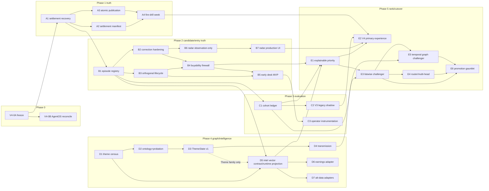

# PROPHET US V4 — WAVE GRAPH AND MERGE ORDER (V4-0A)

**Pinned execution main:** `fc0557bb0873` (2026-08-17) · **Program:** `WS:PROPHET-US-V4-RECOVERY`
**Source of wave definitions:** masterplan §21 (missions/acceptance live there; this doc owns dependencies, merge order, and path ownership).
**Numbering is the V4 integration program's own** — it never renames sibling workstream wave IDs (Radar W0–W9, Fusion PR-3x, GMI W3x, EIOS E0–E2 keep their identities).

## 0. Standing merge-order law

1. **One independently useful capability per PR** (law 23). A wave may span multiple PRs; a PR never spans waves.
2. **No two lanes edit the same canonical authority without a written ruling appended to this file** (masterplan §20.3). Path ownership below is that ruling's baseline.
3. **Sibling-workstream boundaries are hard:** Conditional Fusion PR-3B→3D files are out of bounds for every V4 wave (V4-E1 rebases onto the *accepted* registry afterward); Live Entry Radar remains the expert-event producer; GMI owns the graph; EIOS owns earnings; Stock Identity owns identity epochs; the availability workstream's rescue plane is reconciled with, never duplicated.
4. Every wave handoff uses the masterplan §28 format with acceptance gates inline at §0 of the handoff (fleet spawn-handoff law).
5. A wave is DONE only at merged + production-verified (fleet ship-loop law); "built, staged, unproven" states must be recorded as such in `WS-PROPHET-US-V4-RECOVERY.md`.

## 1. Critical paths (frozen from masterplan §22, reconciled by Cell F 2026-08-23)

```
Product:      A1 → A2/A3 → B1 → B3 → B4 → B5 → B6/B7 → C1/C2 → E1 → E2
Theme graph:  D1 → D2 → D3 → D4
D5 contract:  D1 → D5 semantic architecture (research/spec only)
D5 runtime:   A1 acceptance/adoption → B1 canonical candidate episode → D5 runtime → E1
Theme in D5:  D3 canonical ThemeState + lawful adapter → theme.theme_state family may appear
Earnings:     EIOS stable event workspace → D6 thin adapter (after runtime D5 substrate exists)
Fusion:       PR-3B → 3D (external) → E1 consumes accepted registry
```

V4 must not wait for every lobe. D5 may exist with only implemented/admissible families, but **an unbuilt adapter emits no family envelope**; adapter readiness is control metadata, not episode evidence. E1 may launch only after its listed runtime dependencies and may consume only accepted Fusion-bound members; missing/unbuilt families abstain rather than becoming zero.



(B1 starts once A1 is accepted/adopted — A2/A3 continue in parallel on the publication plane, which B1 never touches. D1 was enough to freeze D5 **semantics**. The new B1→D5 edge is the runtime identity gate: D5 never invents an episode. The dashed D3→D5 edge applies only to the Theme family; until canonical GMI ThemeState and its adapter exist, no `theme.theme_state` family envelope is emitted. A4 gates only E2.)

## 2. The 29 waves

Legend: **Deps** = must be merged first (external deps in *italics*). **Paths** = files/dirs the wave owns while active. Missions and acceptance criteria: masterplan §21 (not restated).

### Phase 0 — freeze and reconcile
| Wave | Deps | Owned paths | Status |
|---|---|---|---|
| **V4-0A** estate archaeology + architecture freeze | — | `research/prophet_v4/**`, `agentos/workstreams/WS-PROPHET-US-V4-RECOVERY.md` | **THIS PR** |
| **V4-0B** AgentOS reconciliation (records only) | 0A | `agentos/workstreams/{WS-PROPHET-US-AVAILABILITY,WS-LIVE-ENTRY-RADAR,WS-GMI-THEME-GRAPH,WS-EARNINGS-INTELLIGENCE-OS,WS-PROPHET-CONDITIONAL-FUSION,WS-STOCK-IDENTITY}.md` status fields + handoffs | NOT STARTED |

### Phase 1 — truth and availability (Lane A)
| Wave | Deps | Owned paths | Status |
|---|---|---|---|
| **V4-A1** Aug-14 + current-session settlement recovery | 0A | `daily.yml` Prophet steps, `scripts/build_prophet.py` checkpoint plumbing, `scripts/prophet_rescue.py`/`check_nightly_liveness.py` only if the root cause lives there (`V4_A1_AVAILABILITY_RECOVERY_HANDOFF.md` §3) | NEXT (handoff in this packet) |
| **V4-A2** canonical settlement manifest | A1 | new manifest module + schema (minted at handoff); `scripts/prophet_rescue.py` + `scripts/check_nightly_liveness.py` read paths | NOT STARTED |
| **V4-A3** atomic publication + split-brain fence | A1 | `daily.yml` publish/upload steps, `scripts/ci/push_retry.sh` interface, bundle-ID stamping in `scripts/build_prophet.py` | NOT STARTED |
| **V4-A4** availability fire-drill week | A2, A3 | drill scripts + receipts only | NOT STARTED |

### Phase 2 — candidate and entry truth (Lanes B/C)
| Wave | Deps | Owned paths | Status |
|---|---|---|---|
| **V4-B1** canonical candidate episode registry | A1 | new episode module + store (minted at handoff; extends the candidate-store plane, consumes `mastermind.entry_event.v1` + TURN WATCH triggers read-only; **reconciles-not-rebuilds `engine/prophet_doors.py` preregistered doors and the Radar runtime ledger — freeze §3; join-key ruling required first**) | NOT STARTED |
| **V4-B2** entry-event correction hardening (B-15…B-19) | B1 | `engine/us_early_turn.py`, its `engine/prophet_bridge.py` wiring (`:4262,:4278,:4410-4412,:4490` at pin), manifest/roster tests — **joint with WS:PROPHET-US-ENTRY-TIMING (§4.1)** | NOT STARTED |
| **V4-B3** orthogonal lifecycle contract | B1 | server state fields (bridge/board-rank stage vocab: `engine/us_board_rank.py:418-448`, `engine/prophet_bridge.py` status vocab), `templates/dashboard.html.j2` prophet stage plumbing, retires the four-way split per MP-1 | NOT STARTED |
| **V4-B4** deterministic buyability/chase firewall | B2, B3 | new availability engine module + mutation tests (minted at handoff) — **must explicitly reconcile-or-supersede `engine/entry_signal.py` (`assess()` buy_zone/chase_above/stop/null_reason — the existing per-ticker availability semantics) and `engine/prophet_live/live_states.py` (5-min predecessor: state its retirement or coexistence fence, incl. its hysteresis and unknown-vs-dark distinction); joint with WS:PROPHET-US-ENTRY-TIMING (§4.1)** | NOT STARTED |
| **V4-B5A** Prophet Operator Lab (observational; LAB-0 recut 2026-08-18, ruling 14) | R-LAB-1 (*Radar W4.1*), P-LAB-API, D-LAB-R5 RIG, P-MP1-SHELL — **no B3/B4 dependency**; zero Prophet authority | `templates/dashboard.html.j2` prophet section per MP-1 + LIVE\|LAB additions; new Lab API module (minted at handoff); `research/prophet_v4/LAB0_B5_RECUT_OPERATOR_LAB_2026-08-18.md` governs | IN PROGRESS (LAB-0 records merged) |
| **V4-B5B** authoritative Early Entry Desk MVP (adopts B5A plumbing) | B3, B4 (unchanged) | `templates/dashboard.html.j2` prophet section per MP-1 + `mockups/refs/institutionalize/us_stocks/` refs; TURN WATCH consumption (`site/turn_watch/turn_watch.json` read-only) | NOT STARTED |
| **V4-B6** Radar observation-only activation | B2; *Radar W4 staged (merged)* | Radar activation config + receipts only (`/etc/macro-live.env` arm via operator; Radar WS owns detectors) | NOT STARTED |
| **V4-B7** Radar production UI + Prophet integration | B6; *Radar W6+W8 or Radar-side waiver (§4.3)* | `templates/entry_radar.html.j2` + `site/entry_radar.html` — **Radar-owned paths; executes as Radar W9 under §4.3** (#5737 reference input only) | NOT STARTED |

### Phase 3 — evaluation and learning plane (Lane F)
| Wave | Deps | Owned paths | Status |
|---|---|---|---|
| **V4-C1** cohort-separated all-candidate ledger | B1 | new cohort projection over `data/us_prophet_rank/` + QLedger claim wiring (`engine/qledger.py` consumed, never modified; control leg MUST be populated or control-matching not claimed) | NOT STARTED |
| **V4-C2** V3 legacy shadow | C1 | new `us_prophet_v3_legacy_shadow` definition module + stores, following the two-grain precedent (paired-row board grain; keyed-parts plan grain) | NOT STARTED (activates at cutover) |
| **V4-C3** operator decision instrumentation | B5 | new episode-keyed action store + API (minted at handoff) | NOT STARTED |

### Phase 4 — theme graph and broad intelligence (Lanes D/E)
| Wave | Deps | Owned paths | Status |
|---|---|---|---|
| **V4-D1** theme-source and identity census | 0A | docs + registries only | NOT STARTED |
| **V4-D2** canonical ontology + probation mapping | D1 | GMI-owned graph stores, `config/theme_crosswalk.yml` (executed in/with GMI lane) | NOT STARTED |
| **V4-D3** ThemeState v1 | D2 | GMI-owned (dynamic state layer = GMI W3B territory; merge-order ruling required before start) | NOT STARTED |
| **V4-D4** peer and transmission features | D3 | GMI-owned | NOT STARTED |
| **V4-D5** V4 intelligence-vector contract/runtime projection | **B1 for runtime**; D1 was sufficient for contract research; D3 only gates the Theme family | current MAS-122 work is records/research only; future runtime owns a new bounded D5 projection/emitter surface minted at implementation. **`engine/us_context_vector.py` is read/reference-only and is not a D5-owned mutation path.** | SPEC ONLY / runtime BLOCKED ON B1 |
| **V4-D6** earnings adapter | D5 runtime substrate; *EIOS stable contract* | thin adapter only | BLOCKED ON D5/B1 + OWNER CONTRACT |
| **V4-D7** alt-data family adapters | D5 runtime substrate | one adapter per family | NOT STARTED |

### Phase 5 — ranking and product cutover (Lanes G/H)
| Wave | Deps | Owned paths | Status |
|---|---|---|---|
| **V4-E1** explainable deterministic V4 priority | B4, C1, runtime D5; *Fusion PR-3B/3D accepted registry* | Fusion registry extension (post-acceptance), V4 rank projection; deterministic baseline is frozen in `flagship_cells/CELL_F_D5_CANDIDATE_REFERENCE_COMPOSITIONS_AND_E1_BASELINE_2026-08-23.md` | NOT STARTED |
| **V4-E2** Prophet V4 primary experience (cutover) | E1, B7, C2, A4 | Prophet product shell (`templates/dashboard.html.j2` prophet views or successor templates per MP-1), rollback switch, `premiumdata/us_stocks.json` server-side withholding (closes the anon leak at the latest here) | NOT STARTED |
| **V4-E3** listwise ranker challenger | C1, E1 | research + shadow lane only | NOT STARTED |
| **V4-E4** conditional router/multi-head challenger | E3; *Stock Identity interfaces* | shadow lane only | NOT STARTED |
| **V4-E5** temporal heterogeneous graph challenger | D4, E3 | shadow lane only | NOT STARTED |
| **V4-E6** promotion gauntlet + V3 retirement ruling | E3–E5 forward evidence | ruling docs + ledger | NOT STARTED |

## 3. Lane concurrency rules

- After 0A/0B: **Lane A (A1–A4) runs first and alone on the publication plane.** Nothing else touches publication paths until A3 merges.
- B-lane and D-lane research may run concurrently when paths are disjoint. **Runtime D5 is not independent of B1:** the D5 envelope is episode-scoped and cannot mint or borrow a lifecycle. C1 may start as soon as B1 merges.
- D2–D4 execute inside/with the GMI workstream (graph owner). Before D3 starts, a one-paragraph merge-order ruling must be appended here naming whether GMI W3B ships it or a V4 builder ships it under GMI review — the two must not both build ThemeState.
- A source family does not appear in runtime D5 until its canonical owner contract and D5 adapter exist. An unbuilt adapter emits **no family envelope**; `ACCRUING` may describe readiness outside the evidence envelope, not a synthetic episode family.
- **MP-1 rule (B3/B5/E2):** the page migration executes against `research/migration_packets/MP-1-prophet-board.md` (gates G-A/G-B/G-C satisfied at pin) mapped onto the four V4 state fields — freeze §12.4. The B5 handoff must confirm R3/R4 reference currency with the design authority and re-check the population re-source against `DNR:KILL-PROPHET-POP-MERGE` before executing it. No V4 wave re-designs what MP-1 already ratified without design-authority sign-off.
- E-lane opens only when its listed deps are merged; E3–E5 are shadow-only and may never edit production ordering paths.
- Model-routing law applies to every wave: sonnet `builder` builds, opus `reviewer` reviews, design surfaces via `designer`/main loop; every spawn carries explicit routing.

## 4. Appended merge-order rulings

**2026-08-17 (V4-0A, from adversarial review — these rulings exist because six wave paths collide with REGISTERED `owns_paths` of active workstreams, and the AgentOS collision detector only sees declared `owns_paths`):**

1. **B2/B3/B4 × `WS:PROPHET-US-ENTRY-TIMING`** (registered owner of `engine/prophet_*.py`, same p0): these waves execute as **joint work under that workstream's ownership** — each wave's PR updates WS-PROPHET-US-ENTRY-TIMING (or records its concurrence), and `WS:PROPHET-US-V4-RECOVERY.depends_on` now lists it. No V4 wave touches `engine/prophet_*.py` without this pairing.
2. **A1/A2 × `WS:PROPHET-US-AVAILABILITY`** (registered owner of `scripts/prophet_rescue.py` + rescue lane; de-facto owner of `scripts/check_nightly_liveness.py` per its 08-15 handoff): A-lane waves touch those files only as that workstream's continuation — the A1/A2 sessions update its record in the same PR. A1's handoff §3 is amended accordingly (no unilateral freeze of a sibling's files).
3. **B6/B7 × `WS:LIVE-ENTRY-RADAR`** (registered owner of `engine/entry_radar/`, `templates/entry_radar.html.j2`, `site/entry_radar.html`): B6 changes NO Radar-owned file (activation = operator env arm + receipts only); B7 builds the production UI **as Radar's W9 under Radar's ownership** — and inherits Radar's own dependency law: W9 `depends_on: [W4, W6, W8]`, so **B7 additionally depends on Radar W6 (research priority) and W8 (reference) or an explicit Radar-side ruling waiving them**. `scripts/reconcile_entry_radar.py` is treated as Radar-owned even though its `owns_paths` prefix misses it (gap flagged to V4-0B).
4. **E1 × `WS:PROPHET-CONDITIONAL-FUSION`**: E1 executes as a Fusion-registry EXTENSION inside that workstream's ownership after PR-3D acceptance — never as a parallel edit. **E1 additionally requires an explicit DNR adjudication before spawn** (freeze §12.7): `DNR:KILL-FUSED-COMPOSITE` Amendment 3 currently licenses exactly one construction (the Fusion challenger under the Fusion masterplan); V4-E1 must either be adjudicated as that same construction's lineage or obtain a further amendment. Silence does not clear it.
5. **0B × `WS:AGENT-OS`** (`agentos/**`): records-only edits are that plane's normal operation; 0B coordinates by citing this ruling, and edits only the six named sibling records + its own.
6. **D3 (ThemeState) × `WS:GMI-THEME-GRAPH`** (ruling still REQUIRED before D3 starts, per §3): additionally, GMI masterplan G0.11 fences ThemeState from "any ordering path" — before E1 may include the theme family in RANK (not display), a GMI-side ruling must supersede/scope G0.11 for the V4 intelligence vector. Until then the theme family is display/context only.
7. **Nightly-advancer law (B1/B4/C-lane stores):** every V4 durable store (episode registry, availability artifacts, cohort ledgers) advances **nightly-only** per house ledger law; intraday passes (Radar 5-min, live states) are display-plane and discard `data/` writes. The lawful precedent is Radar's append-only events reconciled by `scripts/reconcile_entry_radar.py --nightly`.
8. **Path visibility:** as each wave starts, its owned paths are promoted into `WS-PROPHET-US-V4-RECOVERY.md:owns_paths` (or the partner workstream's), so `scripts/agentos.py`'s collision detector can actually see them — a markdown table is invisible to it.
9. **DNR confrontation gate:** every V4 wave handoff greps `research/DO_NOT_REBUILD.md` for engaged rows and confronts them **by name** (masterplan §28 format gains this line). Freeze §13's reject list is a summary, NOT a substitute for the registry.

**2026-08-18 (V4-0B, Sol handoff — supersedes the original 0B breadth and the 0A-era A-lane sequencing):**

10. **0B scope narrowed:** because active sibling sessions own the outage/CI work, V4-0B does NOT edit sibling workstream records (the 0A-era charter allowing evidence-proven sibling fixes is superseded for this wave). 0B reconciles **V4's view** only, in five files; sibling staleness is recorded in `POST_0A_RECONCILIATION_2026-08-17.md` and routed to the owner.
11. **A1 is acceptance-by-adoption, not a V4 spawn:** active Availability/outage sessions own the implementation (incident receipt #5742). `V4_A1_AVAILABILITY_RECOVERY_HANDOFF.md` is retained as the **acceptance contract** Sol reviews the sibling return against — never a command to spawn a competing session. A1 closes only on Sol's acceptance. A2/A3 are **adopt-first**: before either spawns, map the accepted sibling return onto their gates; only the unresolved delta may become a V4 wave.
12. **Next authorized independent V4 session = D1** (theme-source and identity census; docs/registry work, disjoint from the publication incident, does not depend on A1). D1 starts in a fresh session, never inside 0B. D3 remains gated on the GMI merge-order ruling (§4.6).

**2026-08-18 (V4-D1):**

13. **The §4.6 ThemeState ruling now has a census-grounded RECOMMENDATION** (`research/prophet_v4/D1_D3_W3B_MERGE_ORDER_RECOMMENDATION.md`, pending Sol+GMI adjudication): GMI W3B writes `theme_state/v1` AFTER d2's identity/membership repair; V4-d3 becomes the consumption-contract wave; W3B's charter reconciles the pre-existing neuralweb `thematic_state` lineage; path prohibitions enumerated in the doc. The original d5 clause allowed contract research post-D1; its implementation tactic is superseded by ruling 14 below.

**2026-08-23 (MAS-122 / Cell F reconciliation):**

14. **D5 semantics vs runtime are separate gates.** D1 was sufficient to freeze the D5 semantic contract, but runtime `prophet.intelligence_vector/v1` requires the owner-issued canonical B1 `prophet.candidate_episode/v1` after A1 acceptance/adoption. D5 never invents a ticker/date lifecycle and never aliases Entry Radar `mastermind.live_entry_episode.v1`. The old `engine/us_context_vector.py` extension path is deleted from D5 ownership: Context Vector is preserved unchanged and referenced read-only. An unbuilt adapter emits no family envelope; specifically, Theme emits no `theme.theme_state` envelope until canonical GMI ThemeState plus a lawful D5 adapter exist. Detailed ruling: `D1_D5_READINESS_RULING.md` and the Cell F contract/amendments.
15. **E1 deterministic consumption boundary.** D5 itself remains zero-authority. E1 may consume only decision-admissible owner-native observations explicitly bound to accepted Conditional Fusion members/versions, under Fusion's anti-double-count, PIT, coverage, staleness, era and member-method law. Missing/not-covered/unbuilt/right-blocked/stale evidence abstains rather than becoming zero; measured neutral is eligible only when positively measured under the registered member contract. Semantic heads, family/root/provider counts, dependence-group counts, coverage itself, explanations and unregistered/model outputs do not rank. E1 ranks only inside the B4 availability lane. The exact research baseline and eight candidate reference compositions are frozen in `flagship_cells/CELL_F_D5_CANDIDATE_REFERENCE_COMPOSITIONS_AND_E1_BASELINE_2026-08-23.md`. No runtime or ranking change is authorized by this record amendment.
