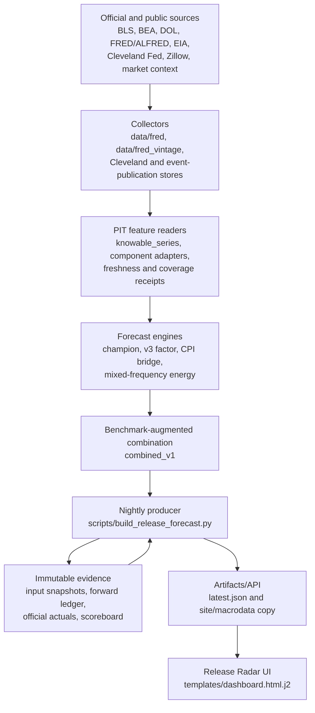
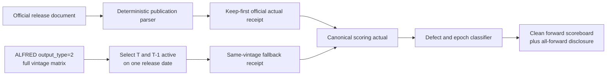

# Release Radar inflation intelligence: forensic audit and build plan

Date: 2026-08-09
Status: Wave 1 correctness substrate implemented; model promotion withheld
Authority: display/context only; no ranking, gating, sizing, Prophet, CIO, or trading authority

## Executive conclusion

Release Radar was not a naive one-formula prototype. Before this audit it already had:

- a nightly release calendar and point-in-time feature store;
- CPI headline/core, PPI, PCE, NFP, and claims target families;
- champion, factor, component-bridge, and mixed-frequency energy models;
- public Cleveland Fed and prediction-market benchmarks;
- forecast quantiles, T-1 snapshots, an append-only forward ledger, a scoreboard,
  forecast-evolution history, and a mature UI;
- deterministic official-release parsers and a live publication watcher.

The highest-value upgrade was therefore not another algorithm. It was repairing the
truth layer beneath every algorithm.

The audit found that legacy CPI, PPI, PCE, and NFP targets were formed by differencing
the first-ever observation for each period across different ALFRED vintages. That is
not the value published in one release. It is especially unsafe around annual CPI
seasonal-factor revisions, when the prior-month denominator can change. The same
defect also made some model comparisons mixed-basis: an official or Cleveland MoM
print could be compared with a synthetic cross-vintage target.

Wave 1 therefore adds canonical same-release-vintage target reconstruction, durable
official first-print receipts, defect-aware evaluation, immutable model/target epochs,
end-to-end input hashes, and a persistent inflation-intelligence state artifact. It
does **not** retune the champion, promote a challenger, claim consensus-beating skill,
or grant downstream signal authority. Those decisions require a new coherent-target
training epoch and enough genuine forward observations.

## Architecture map: observed system



The new target flow is deliberately separate from the broad feature-vintage flow:



## Existing-system classification

| Subsystem | Ruling | Reason |
|---|---|---|
| Release calendar, countdowns, UI | KEEP | Mature product surface; not the intelligence bottleneck. |
| Append-only forecast ledger | KEEP + IMPROVE | Correct architecture; now receives hashes, epochs, code receipts, and canonical actual metadata. |
| Frozen T-1 input snapshots | KEEP + IMPROVE | Correct evidence primitive; input hashes were dropped by producer plumbing and are now preserved. |
| Official release parsers/watcher | KEEP + CONNECT | Strong deterministic parsers existed, but the live sidecar did not feed the research ledger. |
| ALFRED broad PIT feature store | KEEP | Useful for available-at-time features; it is not sufficient by itself for coherent target truth. |
| Cross-vintage target construction | REPLACE FOR NEW EPOCHS | It does not reconstruct the released print. Historical rows remain immutable and are classified. |
| Champion coefficients and legacy backtests | QUARANTINE | Do not silently rewrite. Retrain as a new model/target epoch after canonical history exists. |
| CPI bridge | KEEP AS KILLED/EXPERIMENTAL | Useful decomposition scaffold, but several legs are revision optimistic and the current scope/weight contract is not release-replication quality. |
| `combined_v1` | KEEP ID, DO NOT PROMOTE | It includes Cleveland, so it is benchmark-augmented rather than an independent “ours” model. |
| Cleveland nowcast | KEEP AS BENCHMARK | Public, frequent, and methodologically useful; never count it as independent internal alpha. |
| Street consensus | UNKNOWN / UNAVAILABLE | No licensed, time-stamped consensus history is currently present. Probability-vs-consensus claims remain withheld. |
| Neural Web / Prophet use | CONTEXT ONLY | Identity and freshness are not evidence of predictive edge. |

## Critical forensic findings

### 1. Legacy targets were not official first prints

`engine/release_forecast.py` selected the earliest known level independently for
each observation period, then applied `pct_change()` or `diff()`. The producer's
release-day fallback repeated that basis. Because T and T-1 came from different
real-time vintages, annual seasonal revisions or benchmarking could create a target
that no agency ever published.

The defect is observable, not theoretical. Repository diagnostics produced a -899
thousand synthetic PAYEMS change for one recent release while the coherent-vintage
path produced a radically different result. The corresponding live NFP receipt was
not accepted as truth: its reference period was malformed and its observation clock
preceded the claimed source-release clock, so it was removed and scoring now fails
closed. CPI cross-vintage latent changes can sometimes round to the same one-decimal
number BLS published; that coincidence does not make the independently selected
denominators a valid release-time contract.

Contract now enforced for all new target receipts:

```text
release vintage v = the exact agency/FRED real-time date
target period      = T
prior period       = T-1
current level      = value(T) active on v
prior level        = value(T-1) active on v

price latent MoM   = 100 * (current / prior - 1)
published proxy    = conventional half-up rounding to 0.1 percentage point
PAYEMS change      = current - prior, in thousands
```

If either level is absent in that release vintage, reconstruction fails closed. There
is no cross-vintage substitution.

This matches the purpose of ALFRED real-time periods: they describe when information
was known and when it changed ([ALFRED real-time-period documentation](https://fred.stlouisfed.org/docs/api/fred/realtime_period.html)). It also matters because BLS recalculates CPI seasonal factors annually and can revise five years of seasonally adjusted indexes ([BLS seasonal-adjustment documentation](https://www.bls.gov/cpi/seasonal-adjustment/)).

### 2. Official actuals existed but were not durable scoring inputs

The live watcher already emits source URL, source/content SHA-256, parser version,
first-seen/observed/verified timestamps, and parsed metrics. It intentionally did not
write the research data directory. Release Radar therefore fell back to ALFRED and
could remain past-due/unscored when credentials or same-night publication timing failed.

Wave 1 adds a one-way reconciler:

- binds CPI/PPI/NFP to BLS, PCE to BEA, and claims to DOL with allowlisted HTTPS
  hosts and parser/source contracts;
- validates event type, explicitly parsed reference period, metric, numeric unit,
  SHA-256, timezone-aware clocks, and source-release → observed → verified ordering;
- scales persons to thousands for NFP/claims;
- appends a keep-first `release_actual.v1` receipt;
- preserves later differing facts as non-scoring `correction_candidate` rows;
- makes the producer prefer the official published metric, then a same-vintage ALFRED
  reconstruction, then a clearly labelled legacy operational fallback.

### 3. Input hashes were calculated but lost

The champion, factor, and mixed-frequency engines calculated deterministic input
hashes, but the producer omitted the value while building the public item. That left
every committed snapshot with an empty hash and every projection row without its
engine receipt.

Wave 1 carries hashes through engine → item → snapshot → ledger. Bridge projections
receive a deterministic receipt over their component inputs. Combined projections
receive a receipt over named parent input hashes and weights. This changes
evidence, not the historical forecast number.

### 4. Known defects did not affect evaluation

`defect_notices.json` was previously copied into the scoreboard as prose while all
scored rows still entered MAE, maturity, and ensemble weighting. That allowed a known
defective row to influence `combined_v1`, even though only one CPI print had accrued.

New rows freeze:

- `model_epoch`;
- `target_epoch`;
- `code_receipt`;
- exact actual basis/source receipt;
- evaluation status and matched defect IDs.

The primary scoreboard and ensemble evidence use only clean, comparable rows. If a
better actual receipt arrives, the producer appends an immutable superseding score
receipt; one canonical score per frozen prediction is then selected consistently for
the scoreboard, ensemble weights, and maturity. `all_forward` still reports the
immutable full receipt stream and excluded counts. Nothing is silently rewritten.

### 5. Two source-scope/unit errors were material

The Atlanta Fed sticky/flexible series stored in the repository are monthly percent
changes, not already annualized rates. The new lobe compounds consecutive monthly
changes exactly for trailing 3m/6m annualization. The source units are explicit on the
[Sticky CPI](https://fred.stlouisfed.org/series/STICKCPIM157SFRBATL) and
[Flexible CPI](https://fred.stlouisfed.org/series/FLEXCPIM157SFRBATL) pages.

The bridge's `CUSR0000SASLE` leg is officially **Services Less Energy Services**, not
core services ex shelter ([FRED/BLS series identity](https://fred.stlouisfed.org/data/CUSR0000SASLE)). It includes shelter. The stable historical block ID remains so
append-only rows do not change identity, but new provenance carries an explicit scope
mismatch. A genuine ex-shelter reconstruction is required before this leg can support
a promoted bridge.

### 6. Fixed annual relative importance is only an approximation

The current bridge starts with December 2025 relative-importance values. BLS explains
that relative importance changes as component indexes advance and publishes monthly
relative importance in release tables; beginning-period weights are required for
contribution calculations ([BLS relative-importance guidance](https://www.bls.gov/cpi/tables/relative-importance/)). BLS also calculates the CPI across thousands of item-area
cells using lower- and upper-level aggregation, quality adjustment, imputation, and
seasonal adjustment—not a flat weighted average of a handful of proxies
([BLS CPI calculation methodology](https://www.bls.gov/opub/hom/cpi/calculation.htm)).

The existing bridge remains a display-only challenger until it ingests monthly release
table weights/effects and its component denominator is rebuilt consistently.

### 7. CPI-family market context needed target identity

The legacy prediction-market taxonomy used one `cpi_print` event key for both headline
and core CPI. A live core-CPI contract could therefore appear as headline context. The
reader now requires both a secondary title/target match and an explicit metric basis:
a title containing “Core CPI” can only attach to core, and only MoM contracts can
provide MoM context. Core/headline, MoM/YoY, or ambiguous mismatches fail closed to
null rather than borrowing another target's distribution.

## The two-system inflation architecture

### System A: inflation state

Question: **What is the current direction and composition of consumer-price pressure?**

The new `inflation_intelligence.v1` artifact keeps:

- released headline/core CPI levels and MoM/YoY;
- exact 3m/6m annualized rates and acceleration;
- sticky/flexible underlying proxies with correct units;
- component proxy status, missing/revision-optimistic legs, and coverage;
- explicit source freshness and latest-revision basis;
- a separate current-month proxy-pressure block.

This is not labelled “current CPI.” It is not an official observation and cannot be
used to manufacture a BLS actual.

### System B: BLS print replication

Question: **What seasonally adjusted number will BLS publish next?**

This system uses BLS target definitions, release-date vintages, monthly relative
importance/effects, publication rounding, component lags, and frozen forecast receipts.
It exposes headline/core points and intervals, decomposition, coverage, forecast
evolution, and benchmark comparisons.

System A can supply features to System B only after a feature's timing, revision,
frequency, transform, and economic mapping are declared. It never becomes the target.

## Wave 1 implementation

### Canonical target truth

- `engine/release_target_truth.py`
- `scripts/collect_release_target_vintages.py`
- `data/fred_vintage/release_targets/manifest.json` plus per-series parquets at runtime

Supported series: CPIAUCSL, CPILFESL, PCEPI, PCEPILFE, PPIFIS, PPIFES, PAYEMS.

### Official actual ledger

- `engine/release_actuals.py`
- `scripts/reconcile_release_actuals.py`
- `data/release_forecast/official_actuals.jsonl`

The seed ledger contains only receipts that pass the current BLS/BEA/DOL source,
period, parser, unit, and timestamp-causality contracts. Nightly reconciliation keeps
it advancing without giving the live watcher write authority over model data. A
previous malformed NFP receipt was deliberately removed rather than guessed into a
reference period.

### Honest evaluation and provenance

- structured selectors in `data/release_forecast/defect_notices.json`;
- `engine/release_defects.py`;
- defect-aware scoreboard, ensemble evidence, and maturity counts;
- engine/snapshot/ledger/combined input-receipt hashing;
- headline/core market-context identity checks;
- immutable model/target epochs and code receipts on new rows;
- explicit `primary_forecast_basis` disclosing that `combined_v1` is
  benchmark-augmented.

The Release Radar card now labels that basis “Model + benchmark blend,” names
Cleveland when present, and suppresses expectation/skew/surprise context when its
basis does not match the displayed point. Legacy champion-only artifacts retain the
original “ours” label.

### Persistent inflation context

- `engine/inflation_intelligence.py`;
- `scripts/build_inflation_intelligence.py`;
- `data/release_forecast/inflation_intelligence.json`;
- additive, null-safe Neural Web context plumbing;
- nightly scheduling after Release Radar and before downstream context joins.

The existing Macro Signals “Inflation right now” display also now reads the raw
monthly Atlanta Fed series and compounds complete, consecutive 3-month windows. It no
longer annualizes a business-day-forward-filled feature frame or displays a monthly
percent change as though it were an annual rate.

Every authority flag is false. The artifact may describe and answer context questions;
it may not rank, score, gate, size, escalate, or trade.

Wave 1 deliberately leaves every forecast point and fitted coefficient unchanged.
The coherent target store is used for truth and future scoring substrate; refitting a
new shadow slug requires historical backfill, parity evidence, and a separately frozen
target epoch.

## Data-source inventory and acquisition policy

| Domain | Current/near-term source | Class | Use | Important limitation |
|---|---|---|---|---|
| Official CPI targets/components | BLS releases and supplemental XLSX | Free official download | Target truth, monthly RI/effects, decompositions | Archived supplemental files can themselves reflect later revisions; freeze source bytes when observed. |
| Full revision history | ALFRED output_type=2 | Free public API/key | Same-release target fallback, revision research | API vintage is a proxy for release truth; official text remains preferred. |
| Headline/core benchmark | Cleveland Fed nowcast | Free public | External benchmark, forecast path | Not independent internal evidence; core changes infrequently by design. |
| Energy | EIA gasoline/natural gas/electricity, oil | Free public API/download | High-frequency mapped components | Retail-to-CPI seasonal/tax/geographic mapping required. |
| Shelter | BLS rent/OER, existing Zillow store | Existing + free/public | Lagged shelter state/forecast | Market rent today is not BLS shelter today; vintage and lag model required. |
| Vehicles | BLS components plus legally available wholesale/retail series | Mixed | Used/new vehicle component models | Commercial feeds require explicit license and historical snapshots. |
| Food | BLS food/food-at-home, PPI pipelines | Free public | Structural/pipeline features | Producer-to-consumer pass-through is time varying. |
| Airfare/hotels/insurance | BLS components first | Free public | Released state and autoregressive baseline | High-frequency alternatives need representativeness and licensing audits. |
| Street consensus | No licensed store observed | Unavailable today | Surprise delta/probabilities | Do not scrape or fabricate. Acquire a licensed, timestamped source before use. |
| Alternative real-time prices | Provider-specific | Unknown/mixed | System A research only at first | Legal access, sampling, revisions, and coverage must be evidenced per provider. |

The public [Truflation US methodology](https://api.truflation.com/api/v1/docs/truflation_inflation_index_methodology.pdf) is useful as a clean-room design reference for source breadth, frequency, and category mapping. It is not permission to copy proprietary code, data, weights, or licensed feeds.

## Model development plan

### Wave 2: historical truth backfill and parity

1. Archive source bytes and hashes for historical BLS CPI release pages and monthly
   supplemental tables ([BLS supplemental-file archive](https://www.bls.gov/cpi/tables/supplemental-files/home.htm)).
2. Reconstruct official published headline/core MoM, YoY, RI, and effects with explicit
   original-release versus later-revision labels.
3. Compare official metrics with same-vintage ALFRED proxies; investigate every mismatch.
4. Create `target_epoch=official_first_print_v1` only after parity fixtures cover annual
   seasonal revisions, January boundaries, missing periods, and rounding.
5. Do not mutate legacy rows or model slugs.

Exit gate: deterministic parity on a preregistered sample across ordinary and annual
revision months, with all disagreements adjudicated.

#### Wave 2A implementation checkpoint — 2026-08-10

The first bounded truth cohort is now implemented as a shadow substrate, not a model
promotion:

- all seven retained ALFRED `output_type=2` matrices are sealed by exact byte length
  and SHA-256 under one completed manifest without pretending the seal was a fresh
  collection;
- a frozen 15-case CPI panel retains fourteen official BLS Table 1 workbooks plus the
  exact BLS archive-page bytes proving that October 2025 was not published;
- the panel spans legacy XLS and XLSX formats, five January/annual seasonal-revision
  boundaries, pandemic and high-inflation regimes, delayed publication, and
  negative/zero headline or core prints;
- the candidate `alfred_same_release_vintage_proxy_v1` history contains 353 headline
  and 353 core targets from December 1996 through June 2026, with October 2025 absent
  and November 2025 rejected because the unpublished prior month leaves no coherent
  denominator; and
- all 28 published headline/core comparisons in the preregistered panel match the
  one-decimal values in the retained BLS archive release editions exactly.

The ordered receipt corpus, retained source objects, preregistration, ALFRED cohort,
history and parity report are bound into a completion manifest written last. Missing,
extra, reordered, tampered or unretained evidence fails closed. Passing this bounded
gate admits only the ALFRED proxy target epoch as a candidate for future research.
`official_first_print_v1` remains withheld; no champion coefficient, combined weight,
probability, accuracy claim or downstream authority changes in Wave 2A.

The historical downloads are not labeled proven first-published bytes. The
[BLS supplemental-file archive](https://www.bls.gov/cpi/tables/supplemental-files/home.htm)
notes that archived files may have been revised in later editions, so every receipt
marks first-print status unverified. A true official first-print epoch still requires
contemporaneous or independently timestamped historical source copies and
[BLS errata](https://www.bls.gov/errata/) adjudication.

### Wave 3: BLS-consistent CPI component bridge

1. Ingest monthly Table 6 relative importance and published effects.
2. Define a non-overlapping headline/core component tree with numerator and denominator
   contracts.
3. Replace the false services-ex-shelter proxy with a reproducible component aggregate.
4. Estimate shelter/OER lags on vintage-safe data; keep market-rent proxies separate.
5. Add gasoline, electricity, utility gas, food-at-home, used/new vehicles, airfare,
   motor insurance, medical care, apparel, recreation, education/communication, and
   residual blocks as evidence permits.
6. Every component emits source timestamps, transform, lag, weight, contribution,
   uncertainty, missingness, and revision status.

Exit gate: the bridge exactly reconciles its declared denominator and historical
published effects within a frozen tolerance. No “fully modelled” claim when residual or
scope-mismatched shares remain.

### Wave 4: coherent-target shadow models

Start simple and preregister each candidate:

- persistence and trailing means;
- structural component aggregation;
- regularized autoregression/Elastic Net;
- mixed-frequency regression for high-frequency mapped components;
- small dynamic-factor/state-space models;
- tree models only if their time-series cross-validation is stable.

Use expanding/rolling release-date splits, publication-time feature cutoffs, embargoes
around revised data, and regime-stratified reporting. Complex models receive zero live
weight until they beat simple baselines out of sample.

Exit gate: enough clean forward releases for stable MAE/bias/interval calibration. A
minimum count alone is not sufficient; the evidence must span multiple regimes and
release horizons.

### Wave 5: earned ensemble and uncertainty

1. Introduce a new `internal_ensemble_v1` containing only Mastermind models.
2. Keep Cleveland and future licensed consensus outside it as benchmarks.
3. Learn weights from clean, same-target-epoch forward errors with shrinkage toward
   equal weighting at low sample sizes.
4. Calibrate intervals by horizon and target; report empirical coverage and sharpness.
5. Derive surprise probabilities only when a timestamped consensus from the same cutoff
   exists.

Exit gate: the ensemble improves a preregistered primary loss without degrading
calibration, and no benchmark is presented as internal alpha.

### Wave 6: forecast evolution and autonomous monitoring

For T-30, T-21, T-14, T-7, T-5, T-3, T-1, and release morning:

- freeze forecast and model/target/code epochs;
- freeze every input receipt and data-completeness measure;
- explain revisions as component/data arrivals, never generated narrative first;
- alarm on missing official captures, stale inputs, target mismatches, hash gaps,
  anomalous revisions, or coverage collapse;
- generate postmortems automatically, but require deterministic claims from the ledger.

### Wave 7: market transmission, only after forecast validation

Estimate event-study response distributions for 2Y/10Y yields, DXY, gold, Nasdaq, and
sectors conditional on the **realized surprise**, current rate pricing, Fed regime,
volatility, positioning, and pre-release move. Keep this a separate scored model.

No transmission output may feed Prophet/CIO until both the release forecast and the
conditional response model pass their own forward gates. Forecast identity alone is
not a signal.

## Claim gates

The following statements are currently prohibited:

- “more accurate than consensus”;
- “beats Cleveland”;
- “institutional-grade accuracy”;
- high/medium confidence inferred only from data completeness;
- calibrated probability above/below consensus without consensus and calibration data;
- independent “OURS” for an estimate that includes Cleveland;
- true core-services-ex-shelter from CUSR0000SASLE;
- current CPI for a high-frequency proxy-pressure estimate.

Permitted current statement:

> Release Radar is a display-only experimental nowcasting system with immutable
> forecast receipts, canonical actual ingestion, and a clean forward evaluation epoch
> now accruing. Historical legacy scores are disclosed separately and do not establish
> predictive skill.

## Definition of success

The machine becomes trustworthy in this order:

1. target identity is exact;
2. information timing is point-in-time correct;
3. forecasts and actuals are immutable and reproducible;
4. component mappings reconcile;
5. uncertainty is empirically calibrated;
6. simple baselines are beaten out of sample;
7. an internal ensemble earns weight;
8. surprise probabilities become licensed and calibrated;
9. market transmission earns a separate forward record;
10. only then can any downstream decision-support authority be considered.

That sequence turns the visible Release Radar card into the tip of a defensible
evidence system without pretending that more model complexity can repair incorrect
targets.
