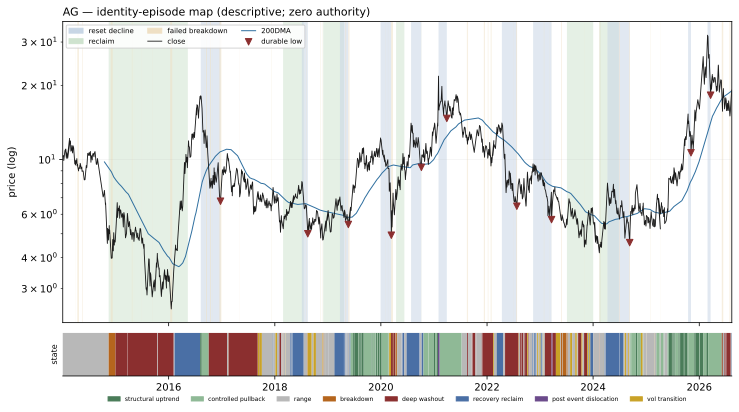

# AG — Identity Atlas v0 dossier

Descriptive behavioral read. **Zero authority**: nothing on this page ranks, sizes, gates, originates a signal, or escalates. No expert content exists in W1 by law. Episode *resolutions* use future data by design — they are a research-time labeling instrument, never a live surface.

## Identity

| field | value |
|---|---|
| pilot role | miner neighborhood probe |
| price plane | `baskets_ohlcv_v1` |
| first print | 2014-01-02 |
| last print | 2026-08-13 |
| sessions | 3172 |
| `open` available | True |
| sector stratum | UNKNOWN |
| cap stratum | adv3 (dollar-ADV tercile **proxy** — no per-name cap store is tracked) |
| vol stratum | vol3 |
| epoch key | `epoch_0` (listing-to-date; epoch detector: none/provisional) |
| tape ended | False |
| terminated reason | right_censored_at_asof (tape active through asof) |

**Survivor-only cohort:** the allowed price planes retain no ceased tapes; no dead name could be included (registration §2). Any cohort comparison this name appears in is a comparison among survivors and cannot name who is missing.

### Ticker-identity hygiene (§9.6)

No reused-ticker, rename, fixup, or delisting flag on this symbol.

**First-print sanity:** `PREDATES_CALENDAR` — first print 2014-01-02 predates the deal calendar's earliest priced date (2024-12-03)

## Behavioral fingerprint v0 (snapshot at asof)

Percentiles are PIT ranks against the contemporaneous evaluated universe. `—` is a coverage mask (the value is unavailable, which is not a low rank). `unstable` marks an adjacent-window quartile jump: the windows disagree, so the number is reported flagged rather than averaged into a clean-looking one.

### Metric block

The only block any future distance or map may read. Label-free by construction: no sector, industry, cap bucket, plane, or basket member here, and no gap-family member (the gap family is structurally unavailable on the open-less curated plane, so the plane law excludes it from this block universe-wide).

| feature | family | raw | universe pct | covered | unstable |
|---|---|---:|---:|:--:|:--:|
| `f1_kaufman_er_63` | F1 | 0.1282 | 53.8 | yes |  |
| `f1_kaufman_er_126` | F1 | 0.0519 | 35.8 | yes |  |
| `f1_kaufman_er_252` | F1 | 0.0599 | 47.1 | yes |  |
| `f1_logprice_r2_126` | F1 | 0.6632 | 71.0 | yes |  |
| `f1_logprice_r2_252` | F1 | 0.4015 | 41.2 | yes |  |
| `f1_share_above_50dma_252` | F1 | 0.5754 | 51.0 | yes |  |
| `f1_share_above_200dma_252` | F1 | 0.8294 | 68.8 | yes |  |
| `f1_new_high_cadence_252` | F1 | 0.1230 | 87.7 | yes |  |
| `f1_new_high_cadence_756` | F1 | 0.0503 | 61.9 | yes |  |
| `f2_drawdown_median_756` | F2 | 0.0611 | 76.6 | yes |  |
| `f2_drawdown_p90_756` | F2 | 0.3037 | 81.6 | yes |  |
| `f2_resets_per_year_15pct` | F2 | 2.0000 | 93.1 | yes |  |
| `f2_resets_per_year_30pct` | F2 | 1.3333 | 97.9 | yes |  |
| `f2_time_under_water_median_756` | F2 | 6.0000 | 55.4 | yes |  |
| `f2_ulcer_126` | F2 | 38.0830 | 85.3 | yes |  |
| `f2_ulcer_252` | F2 | 28.0792 | 63.5 | yes |  |
| `f3_post_trough_63d_atr_median` | F3 | 4.0812 | 45.6 | yes |  |
| `f3_time_to_50pct_retrace_median` | F3 | 44.0000 | 85.9 | yes |  |
| `f4_ar1_daily_252` | F4 | 0.0991 | 95.9 | yes |  |
| `f4_ar1_weekly_756` | F4 | -0.0660 | 31.6 | yes |  |
| `f4_variance_ratio_k5_756` | F4 | 1.1044 | 93.3 | yes |  |
| `f4_variance_ratio_k20_756` | F4 | 0.8573 | 47.4 | yes |  |
| `f4_mr_half_life_252` | F4 | 34.2381 | 43.1 | yes |  |
| `f4_oscillator_dwell_extreme_252` | F4 | 2.5000 | 29.0 | yes |  |
| `f5_realized_vol_21` | F5 | 59.0118 | 66.3 | yes |  |
| `f5_realized_vol_63` | F5 | 70.9519 | 76.9 | yes |  |
| `f5_realized_vol_252` | F5 | 75.4629 | 81.1 | yes |  |
| `f5_vol_of_vol_252` | F5 | 17.4820 | 65.9 | yes |  |
| `f5_acf_abs_ret_1_252` | F5 | -0.0004 | 17.5 | yes |  |
| `f5_natr_regime_spread_252` | F5 | 1.3872 | 67.6 | yes |  |
| `f7_atr_dist_20dma_252` | F7 | 0.4739 | 74.8 | yes |  |
| `f7_atr_dist_50dma_252` | F7 | 0.8999 | 67.2 | yes |  |
| `f7_atr_dist_200dma_252` | F7 | 4.3569 | 82.5 | yes |  |
| `f7_cross_freq_50dma_252` | F7 | 0.0556 | 28.5 | yes |  |
| `f7_cross_freq_200dma_252` | F7 | 0.0198 | 38.2 | yes |  |
| `f7_dwell_run_above_50dma_252` | F7 | 18.1250 | 66.6 | yes |  |
| `f7_dwell_run_above_200dma_252` | F7 | 69.6667 | 74.6 | yes |  |
| `f7_bounce_rate_50dma_756` | F7 | 0.3667 | 20.3 | yes |  |
| `f8_detrended_acf_peak_1260` | F8 | 0.4348 | 91.5 | yes |  |
| `f8_detrended_acf_peak_lag_1260` | F8 | 126.0000 | 30.9 | yes |  |
| `f8_detrended_acf_peak_sharpness_1260` | F8 | 2.8346 | 85.2 | yes |  |
| `f8_swing_period_median_756` | F8 | 15.0000 | 14.8 | yes |  |
| `f8_swing_period_median_1260` | F8 | 16.0000 | 15.7 | yes |  |
| `f9_beta_univ_ew_252` | F9 | 1.8255 | 89.5 | yes |  |
| `f9_beta_univ_ew_756` | F9 | 1.1693 | 70.0 | yes |  |
| `f9_idio_share_252` | F9 | 0.8107 | 28.9 | yes |  |
| `f9_idio_share_756` | F9 | 0.8663 | 62.4 | yes |  |
| `f10_dollar_adv_63` | F10 | 1.934e+08 | 81.2 | yes |  |
| `f10_dollar_adv_252` | F10 | 2.820e+08 | 86.5 | yes |  |
| `f10_turnover_proxy_252` | F10 | 0.5685 | 4.0 | yes |  |
| `f10_amihud_252` | F10 | 0.0000 | 21.9 | yes |  |
| `f10_cs_spread_252` | F10 | 0.0103 | 58.9 | yes |  |

### Diagnostic block

Census and baseline use only — never a distance input, never a map input.

| feature | raw | universe pct | covered |
|---|---:|---:|:--:|
| `d_sector` | — | — | no |
| `d_industry` | UNKNOWN | — | yes |
| `d_cap_bucket` | — | — | no |
| `d_market_cap_b` | — | — | no |
| `d_price_plane_id` | baskets_ohlcv_v1 | — | yes |
| `d_listing_venue_class` | — | — | no |
| `d_f6_gap_share_252` | 0.6656 | 98.0 | yes |
| `d_f6_event_gap_contrib_252` | 0.0705 | 60.9 | yes |
| `d_f6_gap_fill_rate_252` | 0.4759 | 25.5 | yes |
| `d_close_jump_freq_252` | 0.0278 | 51.1 | yes |
| `d_close_jump_drift5_252` | 0.2053 | 56.6 | yes |

## Identity-episode catalog

Built with no expert event anywhere in its construction. Censored episodes are kept: a decline that never prints a durable low is the case that would otherwise silently disappear from every downstream count.

| type | tier | start | anchor | end | depth % | depth ATR | sessions | resolution | censored |
|---|---:|---|---|---|---:|---:|---:|---|:--:|
| failed_breakdown | 3 | 2014-03-31 | 2014-03-31 | 2014-04-01 | 1.0 | 0.20 | 1 | recovered | no |
| failed_breakdown | 3 | 2014-04-11 | 2014-04-11 | 2014-04-14 | 0.7 | 0.15 | 1 | recovered | no |
| failed_breakdown | 3 | 2014-04-15 | 2014-04-21 | 2014-04-23 | 4.7 | 0.98 | 5 | recovered | no |
| failed_breakdown | 3 | 2014-05-15 | 2014-05-15 | 2014-05-19 | 0.4 | 0.12 | 2 | recovered | no |
| reclaim | 1 | 2014-11-14 | 2016-02-11 | 2016-05-12 | 67.4 | 19.89 | 311 | held | no |
| failed_breakdown | 3 | 2014-11-28 | 2014-12-02 | 2014-12-12 | 13.0 | 1.56 | 10 | recovered | no |
| failed_breakdown | 3 | 2015-04-22 | 2015-04-22 | 2015-04-23 | 0.6 | 0.11 | 1 | recovered | no |
| failed_breakdown | 3 | 2015-04-24 | 2015-04-24 | 2015-04-27 | 0.8 | 0.16 | 1 | recovered | no |
| failed_breakdown | 3 | 2015-05-07 | 2015-05-07 | 2015-05-08 | 1.9 | 0.36 | 1 | recovered | no |
| failed_breakdown | 3 | 2015-07-01 | 2015-07-01 | 2015-07-02 | 1.7 | 0.41 | 1 | recovered | no |
| failed_breakdown | 3 | 2015-09-10 | 2015-09-10 | 2015-09-11 | 1.7 | 0.19 | 1 | recovered | no |
| failed_breakdown | 3 | 2016-01-12 | 2016-01-19 | 2016-01-26 | 11.0 | 1.64 | 9 | recovered | no |
| reset_decline | 1 | 2016-08-09 | 2016-12-23 | 2016-12-23 | 62.7 | 13.30 | 96 | durable_low | no |
| failed_breakdown | 3 | 2016-09-01 | 2016-09-01 | 2016-09-02 | 1.9 | 0.25 | 1 | recovered | no |
| failed_breakdown | 3 | 2016-09-15 | 2016-09-16 | 2016-09-21 | 3.9 | 0.54 | 4 | recovered | no |
| failed_breakdown | 3 | 2016-10-11 | 2016-10-11 | 2016-10-18 | 4.7 | 0.52 | 5 | recovered | no |
| failed_breakdown | 3 | 2016-10-27 | 2016-10-27 | 2016-10-28 | 0.1 | 0.02 | 1 | recovered | no |
| failed_breakdown | 3 | 2016-12-15 | 2016-12-23 | 2016-12-29 | 11.4 | 1.46 | 9 | recovered | no |
| failed_breakdown | 3 | 2017-05-04 | 2017-05-04 | 2017-05-05 | 1.0 | 0.20 | 1 | recovered | no |
| failed_breakdown | 3 | 2017-12-06 | 2017-12-07 | 2017-12-08 | 2.8 | 0.82 | 2 | recovered | no |
| reclaim | 2 | 2018-02-27 | 2018-05-02 | 2018-07-19 | 43.2 | 13.64 | 45 | failed | no |
| reset_decline | 3 | 2018-07-06 | 2018-08-16 | 2018-08-16 | 38.6 | 13.28 | 29 | durable_low | no |
| failed_breakdown | 3 | 2018-07-23 | 2018-07-23 | 2018-07-24 | 1.2 | 0.28 | 1 | recovered | no |
| failed_breakdown | 3 | 2018-08-07 | 2018-08-08 | 2018-08-09 | 0.8 | 0.21 | 2 | recovered | no |
| failed_breakdown | 3 | 2018-11-12 | 2018-11-13 | 2018-11-15 | 6.9 | 1.36 | 3 | recovered | no |
| failed_breakdown | 3 | 2018-11-26 | 2018-11-27 | 2018-11-28 | 1.8 | 0.31 | 2 | recovered | no |
| reclaim | 2 | 2018-11-30 | 2019-02-15 | 2019-04-22 | 41.9 | 12.38 | 51 | failed | no |
| reset_decline | 2 | 2019-03-25 | 2019-05-22 | 2019-05-22 | 22.7 | 6.08 | 41 | durable_low | no |
| failed_breakdown | 3 | 2019-05-02 | 2019-05-02 | 2019-05-07 | 2.0 | 0.51 | 3 | recovered | no |
| failed_breakdown | 3 | 2019-05-22 | 2019-05-22 | 2019-05-30 | 3.7 | 1.01 | 5 | recovered | no |
| reset_decline | 2 | 2019-12-30 | 2020-03-13 | 2020-03-13 | 59.7 | 15.62 | 51 | durable_low | no |
| failed_breakdown | 3 | 2020-02-04 | 2020-02-04 | 2020-02-05 | 1.8 | 0.37 | 1 | recovered | no |
| failed_breakdown | 3 | 2020-02-19 | 2020-02-19 | 2020-02-20 | 2.1 | 0.48 | 1 | recovered | no |
| failed_breakdown | 3 | 2020-03-12 | 2020-03-13 | 2020-03-24 | 23.9 | 2.50 | 8 | recovered | no |
| reclaim | 3 | 2020-04-15 | 2020-05-29 | 2020-06-11 | 43.8 | 6.83 | 31 | failed | no |
| reset_decline | 2 | 2020-07-27 | 2020-10-06 | 2020-10-06 | 33.8 | 6.75 | 50 | durable_low | no |
| failed_breakdown | 3 | 2020-10-06 | 2020-10-06 | 2020-10-07 | 0.9 | 0.15 | 1 | recovered | no |
| reset_decline | 2 | 2021-02-01 | 2021-03-30 | 2021-03-30 | 32.6 | 6.34 | 40 | durable_low | no |
| failed_breakdown | 3 | 2021-08-09 | 2021-08-09 | 2021-08-10 | 0.1 | 0.02 | 1 | recovered | no |
| failed_breakdown | 3 | 2021-08-17 | 2021-08-19 | 2021-08-23 | 6.1 | 1.37 | 4 | recovered | no |
| failed_breakdown | 3 | 2021-12-10 | 2021-12-15 | 2021-12-17 | 4.5 | 0.83 | 5 | recovered | no |
| failed_breakdown | 3 | 2022-01-06 | 2022-01-06 | 2022-01-10 | 0.9 | 0.18 | 2 | recovered | no |
| failed_breakdown | 3 | 2022-01-26 | 2022-01-28 | 2022-02-01 | 7.0 | 1.24 | 4 | recovered | no |
| reset_decline | 1 | 2022-04-13 | 2022-07-25 | 2022-07-25 | 54.1 | 12.76 | 69 | durable_low | no |
| failed_breakdown | 3 | 2022-06-30 | 2022-06-30 | 2022-07-01 | 3.3 | 0.49 | 1 | recovered | no |
| failed_breakdown | 3 | 2022-07-21 | 2022-07-25 | 2022-07-27 | 4.0 | 0.58 | 4 | recovered | no |
| reset_decline | 1 | 2022-11-14 | 2023-03-21 | 2023-03-21 | 40.6 | 7.12 | 86 | durable_low | no |
| failed_breakdown | 3 | 2023-01-23 | 2023-01-23 | 2023-01-24 | 1.7 | 0.35 | 1 | recovered | no |
| failed_breakdown | 3 | 2023-01-30 | 2023-01-30 | 2023-02-01 | 0.4 | 0.08 | 2 | recovered | no |
| failed_breakdown | 3 | 2023-03-08 | 2023-03-08 | 2023-03-09 | 0.7 | 0.14 | 1 | recovered | no |
| failed_breakdown | 3 | 2023-03-21 | 2023-03-21 | 2023-03-22 | 2.9 | 0.51 | 1 | recovered | no |
| failed_breakdown | 3 | 2023-05-26 | 2023-05-30 | 2023-05-31 | 0.9 | 0.23 | 2 | recovered | no |
| reclaim | 1 | 2023-07-05 | 2023-12-13 | 2024-01-02 | 43.2 | 23.07 | 113 | failed | no |
| failed_breakdown | 3 | 2023-11-02 | 2023-11-02 | 2023-11-03 | 8.2 | 1.63 | 1 | recovered | no |
| failed_breakdown | 3 | 2024-02-13 | 2024-02-13 | 2024-02-23 | 8.1 | 1.66 | 7 | recovered | no |
| reclaim | 3 | 2024-02-14 | 2024-03-27 | 2024-06-27 | 44.8 | 14.69 | 29 | held | no |
| reset_decline | 1 | 2024-04-09 | 2024-09-09 | 2024-09-09 | 42.7 | 9.31 | 105 | durable_low | no |
| failed_breakdown | 3 | 2024-06-28 | 2024-07-01 | 2024-07-03 | 3.0 | 0.64 | 3 | recovered | no |
| failed_breakdown | 3 | 2024-09-06 | 2024-09-09 | 2024-09-11 | 4.1 | 0.72 | 3 | recovered | no |
| failed_breakdown | 3 | 2025-01-27 | 2025-01-27 | 2025-01-29 | 2.2 | 0.40 | 2 | recovered | no |
| failed_breakdown | 3 | 2025-04-08 | 2025-04-08 | 2025-04-09 | 0.5 | 0.06 | 1 | recovered | no |
| reset_decline | 3 | 2025-10-16 | 2025-11-05 | 2025-11-05 | 30.4 | 5.48 | 14 | durable_low | no |
| reset_decline | 3 | 2026-02-27 | 2026-03-20 | 2026-03-20 | 42.9 | 7.08 | 15 | durable_low | no |
| failed_breakdown | 3 | 2026-06-05 | 2026-06-10 | 2026-06-15 | 13.9 | 2.08 | 6 | recovered | no |
| failed_breakdown | 3 | 2026-07-28 | 2026-07-31 | 2026-08-04 | 4.3 | 0.69 | 5 | recovered | no |

**65 episodes**, 0 censored; by type {'failed_breakdown': 48, 'reset_decline': 11, 'reclaim': 6}; by tier {3: 53, 1: 6, 2: 6}.

## State shares by year

Eight mutually-exclusive bars-only states, first-match-wins precedence. Gap basis on this plane: `open_vs_prev_close` — a close-to-close proxy absorbs the whole session's move, not just the overnight jump, so cross-plane comparisons of the dislocation share carry that caveat.

| year | post event dislocation | deep washout | breakdown | recovery reclaim | controlled pullback | structural uptrend | vol transition | range |
|---:|---:|---:|---:|---:|---:|---:|---:|---:|
| 2014 | 0% | 0% | 12% | 0% | 0% | 0% | 0% | 87% |
| 2015 | 0% | 99% | 0% | 0% | 0% | 0% | 0% | 1% |
| 2016 | 0% | 34% | 0% | 49% | 13% | 3% | 0% | 1% |
| 2017 | 0% | 65% | 0% | 2% | 0% | 0% | 8% | 25% |
| 2018 | 0% | 3% | 3% | 24% | 0% | 0% | 17% | 53% |
| 2019 | 0% | 0% | 0% | 24% | 29% | 29% | 0% | 18% |
| 2020 | 0% | 7% | 2% | 32% | 32% | 2% | 5% | 20% |
| 2021 | 3% | 18% | 0% | 0% | 44% | 4% | 0% | 31% |
| 2022 | 0% | 47% | 1% | 17% | 0% | 0% | 7% | 27% |
| 2023 | 2% | 32% | 11% | 8% | 0% | 0% | 24% | 23% |
| 2024 | 0% | 0% | 0% | 35% | 19% | 3% | 8% | 35% |
| 2025 | 0% | 0% | 0% | 0% | 38% | 36% | 1% | 25% |
| 2026 | 0% | 23% | 0% | 3% | 52% | 17% | 1% | 5% |

## Episode map

Log price with the 200DMA, episode spans shaded by type, durable lows marked, and the daily state strip beneath. On histories longer than 5,000 sessions the two price LINES are drawn at weekly resolution for legibility and file size; spans, markers and the state strip stay daily.

---

Constants: `77e111c11672524c826948455a8c2ea5b812cdddb3f0d9dac1807b253604e9d0` · fingerprint spec: `0e3457b11f41452e1c3efac3858196f5f42b573d1961b798ea581e1590b33187` · partition: `a546c64983431f0afca01cfd9aacc230ef3bed875520c44898090520cf98164a` · asof 2026-08-13
