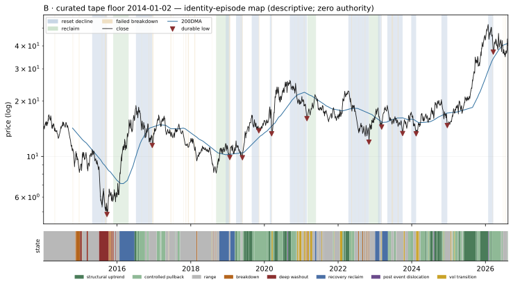

# B — Identity Atlas v0 dossier (W1-A1 addendum)

Descriptive behavioral read. **Zero authority**: nothing on this page ranks, sizes, gates, originates a signal, or escalates. No expert content exists in W1 by law. Episode *resolutions* use future data by design — they are a research-time labeling instrument, never a live surface.

**Registered W1-A1 addendum (2026-08-14).** This is the design-touched Barrick Mining Corporation instrument (EDGAR CIK 756894), added as the effective miner probe after the sealed W1 `GOLD` row was verified as Gold.com/A-Mark dealer behavior. It is an additive dossier, not a retroactive substitution: B remains outside the frozen W1 universe, pilot manifest, blind arm, sealed calibration partition, every future blind extension, and every confirmatory grade. Percentiles are a B-only hypothetical insertion into the frozen 2,780-name W1 reference; no existing rank changed. Frozen UNIV_EW includes GOLD's dealer context as one small component and is retained only for comparability, never as miner evidence. The curated `baskets_ohlcv_v1` tape begins **2014-01-02**; that is a data floor, not Barrick's birth, and it cannot cover the pre-2014 portion of the 2011-2015 gold bear.

## Identity

| field | value |
|---|---|
| pilot role | miner neighborhood probe — Barrick Mining (W1-A1 amendment; outside the sealed W1 pilot) |
| price plane | `baskets_ohlcv_v1` |
| first print | 2014-01-02 |
| last print | 2026-08-13 |
| sessions | 3172 |
| `open` available | True |
| sector stratum | NOT_STRATIFIED — absent from frozen W1 snapshot |
| cap stratum | NOT_STRATIFIED (dollar-ADV tercile **proxy** — no per-name cap store is tracked) |
| vol stratum | NOT_STRATIFIED |
| epoch key | `epoch_0` (listing-to-date; epoch detector: none/provisional) |
| tape ended | False |
| terminated reason | right_censored_at_asof (tape active through asof) |

**Survivor-only cohort:** the allowed price planes retain no ceased tapes; no dead name could be included (registration §2). Any cohort comparison this name appears in is a comparison among survivors and cannot name who is missing.

### Ticker-identity hygiene (§9.6)

| flag | resolution |
|---|---|
| `lineage_receipt` | Barrick Mining Corporation, EDGAR CIK 756894; NYSE B since 2025-05-09. The curated B tape is the registered W1-A1 input. Retired NYSE GOLD is now Gold.com/A-Mark and is a different instrument. |

**First-print sanity:** `PREDATES_CALENDAR` — first print 2014-01-02 predates the deal calendar's earliest priced date (2024-12-03)

## Behavioral fingerprint v0 (snapshot at asof)

Percentiles are B's hypothetical insertion ranks against the frozen 2,780-name W1 reference; only B was ranked and no W1 row was recomputed or rewritten. `—` is a coverage mask (the value is unavailable, which is not a low rank). `unstable` marks an adjacent-window quartile jump: the windows disagree, so the number is reported flagged rather than averaged into a clean-looking one.

### Metric block

The only block any future distance or map may read. Label-free by construction: no sector, industry, cap bucket, plane, or basket member here, and no gap-family member (the gap family is structurally unavailable on the open-less curated plane, so the plane law excludes it from this block universe-wide).

| feature | family | raw | universe pct | covered | unstable |
|---|---|---:|---:|:--:|:--:|
| `f1_kaufman_er_63` | F1 | 0.0618 | 29.2 | yes |  |
| `f1_kaufman_er_126` | F1 | 0.0489 | 34.3 | yes |  |
| `f1_kaufman_er_252` | F1 | 0.0797 | 60.4 | yes |  |
| `f1_logprice_r2_126` | F1 | 0.4550 | 51.0 | yes |  |
| `f1_logprice_r2_252` | F1 | 0.2613 | 29.8 | yes |  |
| `f1_share_above_50dma_252` | F1 | 0.6270 | 62.6 | yes |  |
| `f1_share_above_200dma_252` | F1 | 0.8373 | 69.7 | yes |  |
| `f1_new_high_cadence_252` | F1 | 0.1825 | 97.6 | yes |  |
| `f1_new_high_cadence_756` | F1 | 0.0886 | 89.3 | yes |  |
| `f2_drawdown_median_756` | F2 | 0.0294 | 42.4 | yes |  |
| `f2_drawdown_p90_756` | F2 | 0.1247 | 34.3 | yes |  |
| `f2_resets_per_year_15pct` | F2 | 1.0000 | 66.8 | yes |  |
| `f2_resets_per_year_30pct` | F2 | 0.0000 | 24.4 | yes |  |
| `f2_time_under_water_median_756` | F2 | 5.0000 | 40.0 | yes |  |
| `f2_ulcer_126` | F2 | 22.6139 | 62.4 | yes |  |
| `f2_ulcer_252` | F2 | 16.5638 | 38.5 | yes |  |
| `f3_post_trough_63d_atr_median` | F3 | 7.4509 | 93.5 | yes |  |
| `f3_time_to_50pct_retrace_median` | F3 | 32.0000 | 72.4 | yes |  |
| `f4_ar1_daily_252` | F4 | -0.0014 | 65.6 | yes |  |
| `f4_ar1_weekly_756` | F4 | -0.1300 | 12.3 | yes |  |
| `f4_variance_ratio_k5_756` | F4 | 1.0214 | 77.8 | yes |  |
| `f4_variance_ratio_k20_756` | F4 | 0.8710 | 50.5 | yes |  |
| `f4_mr_half_life_252` | F4 | 22.7052 | 24.9 | yes |  |
| `f4_oscillator_dwell_extreme_252` | F4 | 4.9091 | 82.8 | yes |  |
| `f5_realized_vol_21` | F5 | 48.7739 | 54.0 | yes |  |
| `f5_realized_vol_63` | F5 | 48.9557 | 53.1 | yes |  |
| `f5_realized_vol_252` | F5 | 47.9210 | 51.7 | yes |  |
| `f5_vol_of_vol_252` | F5 | 10.4824 | 37.8 | yes |  |
| `f5_acf_abs_ret_1_252` | F5 | 0.0089 | 20.6 | yes |  |
| `f5_natr_regime_spread_252` | F5 | 1.0684 | 53.2 | yes |  |
| `f7_atr_dist_20dma_252` | F7 | 0.7862 | 95.0 | yes |  |
| `f7_atr_dist_50dma_252` | F7 | 1.7147 | 92.0 | yes |  |
| `f7_atr_dist_200dma_252` | F7 | 6.2559 | 95.0 | yes |  |
| `f7_cross_freq_50dma_252` | F7 | 0.0556 | 28.5 | yes |  |
| `f7_cross_freq_200dma_252` | F7 | 0.0198 | 38.2 | yes |  |
| `f7_dwell_run_above_50dma_252` | F7 | 19.7500 | 73.2 | yes |  |
| `f7_dwell_run_above_200dma_252` | F7 | 70.3333 | 74.9 | yes |  |
| `f7_bounce_rate_50dma_756` | F7 | 0.5676 | 62.9 | yes |  |
| `f8_detrended_acf_peak_1260` | F8 | 0.3481 | 77.1 | yes |  |
| `f8_detrended_acf_peak_lag_1260` | F8 | 126.0000 | 30.9 | yes |  |
| `f8_detrended_acf_peak_sharpness_1260` | F8 | 3.1114 | 92.5 | yes |  |
| `f8_swing_period_median_756` | F8 | 33.0000 | 45.8 | yes |  |
| `f8_swing_period_median_1260` | F8 | 37.0000 | 51.8 | yes |  |
| `f9_beta_univ_ew_252` | F9 | 1.0890 | 62.5 | yes | **unstable** |
| `f9_beta_univ_ew_756` | F9 | 0.6260 | 20.7 | yes | **unstable** |
| `f9_idio_share_252` | F9 | 0.8329 | 35.7 | yes |  |
| `f9_idio_share_756` | F9 | 0.8893 | 71.0 | yes |  |
| `f10_dollar_adv_63` | F10 | 4.278e+08 | 90.5 | yes |  |
| `f10_dollar_adv_252` | F10 | 5.373e+08 | 93.2 | yes |  |
| `f10_turnover_proxy_252` | F10 | 0.6594 | 8.7 | yes |  |
| `f10_amihud_252` | F10 | 0.0000 | 10.7 | yes |  |
| `f10_cs_spread_252` | F10 | 0.0062 | 21.8 | yes |  |

### Diagnostic block

Census and baseline use only — never a distance input, never a map input.

| feature | raw | universe pct | covered |
|---|---:|---:|:--:|
| `d_sector` | — | — | no |
| `d_industry` | UNKNOWN | — | yes |
| `d_cap_bucket` | — | — | no |
| `d_market_cap_b` | — | — | no |
| `d_price_plane_id` | baskets_ohlcv_v1 | — | yes |
| `d_listing_venue_class` | — | — | no |
| `d_f6_gap_share_252` | 0.6731 | 98.1 | yes |
| `d_f6_event_gap_contrib_252` | 0.0681 | 57.7 | yes |
| `d_f6_gap_fill_rate_252` | 0.3286 | 4.0 | yes |
| `d_close_jump_freq_252` | 0.0437 | 94.8 | yes |
| `d_close_jump_drift5_252` | -0.1878 | 30.8 | yes |

## Identity-episode catalog

Built with no expert event anywhere in its construction. Censored episodes are kept: a decline that never prints a durable low is the case that would otherwise silently disappear from every downstream count.

| type | tier | start | anchor | end | depth % | depth ATR | sessions | resolution | censored |
|---|---:|---|---|---|---:|---:|---:|---|:--:|
| failed_breakdown | 3 | 2014-04-21 | 2014-04-21 | 2014-04-25 | 3.1 | 0.99 | 4 | recovered | no |
| failed_breakdown | 3 | 2014-05-01 | 2014-05-01 | 2014-05-02 | 1.0 | 0.32 | 1 | recovered | no |
| failed_breakdown | 3 | 2014-10-17 | 2014-10-17 | 2014-10-20 | 0.3 | 0.08 | 1 | recovered | no |
| failed_breakdown | 3 | 2014-10-22 | 2014-10-22 | 2014-10-23 | 0.1 | 0.04 | 1 | recovered | no |
| failed_breakdown | 3 | 2014-10-27 | 2014-10-27 | 2014-10-28 | 0.7 | 0.20 | 1 | recovered | no |
| failed_breakdown | 3 | 2014-12-15 | 2014-12-16 | 2014-12-18 | 5.6 | 1.03 | 3 | recovered | no |
| failed_breakdown | 3 | 2014-12-23 | 2014-12-23 | 2014-12-26 | 1.5 | 0.26 | 2 | recovered | no |
| reset_decline | 1 | 2015-04-29 | 2015-09-23 | 2015-09-23 | 55.7 | 15.32 | 102 | durable_low | no |
| failed_breakdown | 3 | 2015-08-03 | 2015-08-05 | 2015-08-07 | 5.1 | 0.82 | 4 | recovered | no |
| failed_breakdown | 3 | 2015-09-03 | 2015-09-10 | 2015-09-16 | 4.8 | 0.66 | 8 | recovered | no |
| failed_breakdown | 3 | 2015-09-22 | 2015-09-23 | 2015-09-24 | 4.3 | 0.69 | 2 | recovered | no |
| reclaim | 2 | 2015-11-24 | 2016-01-25 | 2016-04-25 | 45.0 | 15.57 | 40 | held | no |
| reset_decline | 1 | 2016-07-06 | 2016-12-15 | 2016-12-15 | 39.4 | 10.23 | 114 | durable_low | no |
| failed_breakdown | 3 | 2016-08-30 | 2016-08-31 | 2016-09-02 | 6.3 | 1.49 | 3 | recovered | no |
| failed_breakdown | 3 | 2016-11-11 | 2016-11-14 | 2016-11-15 | 5.2 | 0.92 | 2 | recovered | no |
| failed_breakdown | 3 | 2016-11-23 | 2016-11-23 | 2016-11-25 | 0.1 | 0.01 | 1 | recovered | no |
| failed_breakdown | 3 | 2016-12-15 | 2016-12-15 | 2016-12-27 | 4.2 | 0.85 | 7 | recovered | no |
| failed_breakdown | 3 | 2017-06-14 | 2017-06-20 | 2017-06-22 | 2.4 | 0.97 | 6 | recovered | no |
| failed_breakdown | 3 | 2017-07-07 | 2017-07-07 | 2017-07-10 | 1.5 | 0.60 | 1 | recovered | no |
| failed_breakdown | 3 | 2017-10-20 | 2017-10-20 | 2017-10-23 | 0.4 | 0.21 | 1 | recovered | no |
| failed_breakdown | 3 | 2017-11-10 | 2017-11-13 | 2017-11-14 | 0.3 | 0.13 | 2 | recovered | no |
| failed_breakdown | 3 | 2017-11-16 | 2017-11-16 | 2017-11-17 | 0.2 | 0.11 | 1 | recovered | no |
| failed_breakdown | 3 | 2017-11-20 | 2017-11-20 | 2017-11-21 | 0.1 | 0.07 | 1 | recovered | no |
| failed_breakdown | 3 | 2017-11-30 | 2017-11-30 | 2017-12-01 | 0.7 | 0.36 | 1 | recovered | no |
| failed_breakdown | 3 | 2017-12-05 | 2017-12-06 | 2017-12-13 | 1.7 | 0.78 | 6 | recovered | no |
| failed_breakdown | 3 | 2018-02-06 | 2018-02-09 | 2018-02-14 | 3.6 | 1.22 | 6 | recovered | no |
| failed_breakdown | 3 | 2018-08-01 | 2018-08-02 | 2018-08-03 | 1.4 | 0.52 | 2 | recovered | no |
| failed_breakdown | 3 | 2018-09-10 | 2018-09-10 | 2018-09-12 | 0.7 | 0.24 | 2 | recovered | no |
| reclaim | 3 | 2018-09-10 | 2018-10-11 | 2019-01-14 | 44.7 | 26.45 | 23 | held | no |
| reset_decline | 3 | 2018-12-13 | 2019-01-23 | 2019-01-23 | 16.2 | 5.47 | 26 | durable_low | no |
| failed_breakdown | 3 | 2019-01-14 | 2019-01-23 | 2019-01-28 | 4.6 | 1.19 | 9 | recovered | no |
| reset_decline | 3 | 2019-03-26 | 2019-05-28 | 2019-05-28 | 19.0 | 6.90 | 43 | durable_low | no |
| failed_breakdown | 3 | 2019-05-10 | 2019-05-10 | 2019-05-13 | 2.5 | 0.93 | 1 | recovered | no |
| failed_breakdown | 3 | 2019-05-22 | 2019-05-28 | 2019-05-31 | 2.2 | 0.81 | 6 | recovered | no |
| reset_decline | 3 | 2019-08-28 | 2019-11-07 | 2019-11-07 | 17.8 | 6.64 | 50 | durable_low | no |
| failed_breakdown | 3 | 2019-11-05 | 2019-11-05 | 2019-11-06 | 0.2 | 0.06 | 1 | recovered | no |
| failed_breakdown | 3 | 2019-11-07 | 2019-11-07 | 2019-11-13 | 1.1 | 0.35 | 4 | recovered | no |
| reset_decline | 3 | 2020-02-24 | 2020-03-13 | 2020-03-13 | 28.6 | 11.37 | 14 | durable_low | no |
| failed_breakdown | 3 | 2020-03-12 | 2020-03-13 | 2020-03-17 | 9.6 | 1.72 | 3 | recovered | no |
| reset_decline | 1 | 2020-09-09 | 2021-02-26 | 2021-02-26 | 38.2 | 9.59 | 117 | durable_low | no |
| failed_breakdown | 3 | 2020-10-28 | 2020-10-28 | 2020-10-29 | 0.7 | 0.26 | 1 | recovered | no |
| failed_breakdown | 3 | 2020-11-27 | 2020-11-27 | 2020-11-30 | 0.0 | 0.01 | 1 | recovered | no |
| failed_breakdown | 3 | 2020-12-14 | 2020-12-14 | 2020-12-15 | 1.1 | 0.36 | 1 | recovered | no |
| failed_breakdown | 3 | 2021-01-27 | 2021-01-27 | 2021-02-01 | 2.0 | 0.74 | 3 | recovered | no |
| reclaim | 2 | 2021-03-03 | 2021-05-17 | 2021-05-27 | 35.4 | 15.77 | 52 | failed | no |
| reset_decline | 1 | 2022-04-13 | 2022-11-03 | 2022-11-03 | 47.6 | 17.11 | 141 | durable_low | no |
| failed_breakdown | 3 | 2022-05-12 | 2022-05-18 | 2022-05-19 | 4.1 | 1.11 | 5 | recovered | no |
| failed_breakdown | 3 | 2022-06-14 | 2022-06-14 | 2022-06-16 | 0.5 | 0.14 | 2 | recovered | no |
| failed_breakdown | 3 | 2022-07-25 | 2022-07-25 | 2022-07-27 | 2.7 | 0.66 | 2 | recovered | no |
| failed_breakdown | 3 | 2022-09-01 | 2022-09-01 | 2022-09-02 | 0.9 | 0.26 | 1 | recovered | no |
| failed_breakdown | 3 | 2022-09-23 | 2022-09-27 | 2022-09-28 | 3.4 | 0.96 | 3 | recovered | no |
| failed_breakdown | 3 | 2022-11-03 | 2022-11-03 | 2022-11-04 | 7.1 | 1.90 | 1 | recovered | no |
| reclaim | 2 | 2022-11-04 | 2023-01-03 | 2023-02-16 | 43.2 | 18.51 | 39 | failed | no |
| reset_decline | 3 | 2023-02-01 | 2023-03-09 | 2023-03-09 | 21.5 | 8.14 | 25 | durable_low | no |
| failed_breakdown | 3 | 2023-03-07 | 2023-03-09 | 2023-03-10 | 2.1 | 0.75 | 3 | recovered | no |
| reset_decline | 2 | 2023-05-04 | 2023-10-03 | 2023-10-03 | 29.7 | 12.41 | 104 | durable_low | no |
| failed_breakdown | 3 | 2023-06-15 | 2023-06-20 | 2023-06-30 | 4.4 | 1.86 | 10 | recovered | no |
| failed_breakdown | 3 | 2023-08-15 | 2023-08-18 | 2023-08-23 | 2.7 | 1.20 | 6 | recovered | no |
| reset_decline | 3 | 2023-12-27 | 2024-02-14 | 2024-02-14 | 23.9 | 10.23 | 33 | durable_low | no |
| reset_decline | 2 | 2024-10-22 | 2024-12-19 | 2024-12-19 | 27.7 | 11.04 | 41 | durable_low | no |
| reset_decline | 2 | 2026-01-28 | 2026-03-20 | 2026-03-20 | 29.3 | 9.43 | 36 | durable_low | no |
| failed_breakdown | 3 | 2026-03-13 | 2026-03-13 | 2026-03-16 | 0.5 | 0.11 | 1 | recovered | no |
| failed_breakdown | 3 | 2026-06-24 | 2026-06-24 | 2026-06-26 | 2.0 | 0.40 | 2 | recovered | no |
| failed_breakdown | 3 | 2026-07-01 | 2026-07-01 | 2026-07-02 | 0.0 | 0.01 | 1 | recovered | no |
| failed_breakdown | 3 | 2026-07-08 | 2026-07-08 | 2026-07-09 | 1.9 | 0.43 | 1 | recovered | no |
| failed_breakdown | 3 | 2026-07-16 | 2026-07-16 | 2026-07-21 | 2.5 | 0.59 | 3 | recovered | no |

**66 episodes**, 0 censored; by type {'failed_breakdown': 49, 'reset_decline': 13, 'reclaim': 4}; by tier {3: 56, 2: 6, 1: 4}.

## State shares by year

Eight mutually-exclusive bars-only states, first-match-wins precedence. Gap basis on this plane: `open_vs_prev_close` — the opening print is compared with the previous close, isolating the overnight jump.

| year | post event dislocation | deep washout | breakdown | recovery reclaim | controlled pullback | structural uptrend | vol transition | range |
|---:|---:|---:|---:|---:|---:|---:|---:|---:|
| 2014 | 0% | 0% | 12% | 0% | 0% | 0% | 0% | 88% |
| 2015 | 0% | 41% | 7% | 0% | 0% | 0% | 0% | 52% |
| 2016 | 0% | 0% | 0% | 41% | 27% | 7% | 0% | 25% |
| 2017 | 0% | 0% | 0% | 0% | 29% | 0% | 1% | 70% |
| 2018 | 0% | 1% | 4% | 22% | 0% | 0% | 1% | 72% |
| 2019 | 0% | 0% | 0% | 17% | 49% | 27% | 0% | 8% |
| 2020 | 2% | 0% | 0% | 0% | 49% | 34% | 11% | 3% |
| 2021 | 0% | 0% | 2% | 4% | 2% | 0% | 18% | 73% |
| 2022 | 0% | 0% | 9% | 0% | 18% | 14% | 7% | 51% |
| 2023 | 0% | 0% | 0% | 29% | 21% | 1% | 5% | 44% |
| 2024 | 2% | 0% | 0% | 0% | 34% | 31% | 10% | 23% |
| 2025 | 0% | 0% | 0% | 0% | 30% | 54% | 4% | 12% |
| 2026 | 3% | 0% | 0% | 0% | 55% | 15% | 0% | 27% |

## Episode map

Log price with the 200DMA, episode spans shaded by type, durable lows marked, and the daily state strip beneath. On histories longer than 5,000 sessions the two price LINES are drawn at weekly resolution for legibility and file size; spans, markers and the state strip stay daily.

---

Constants: `77e111c11672524c826948455a8c2ea5b812cdddb3f0d9dac1807b253604e9d0` · fingerprint spec: `0e3457b11f41452e1c3efac3858196f5f42b573d1961b798ea581e1590b33187` · partition: `a546c64983431f0afca01cfd9aacc230ef3bed875520c44898090520cf98164a` · asof 2026-08-13
