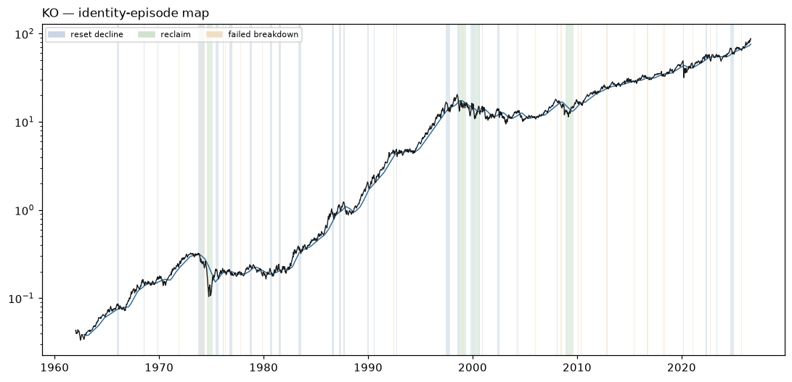

# KO — Identity Atlas v0 dossier

Descriptive behavioral read. **Zero authority**: nothing on this page ranks, sizes, gates, originates a signal, or escalates. No expert content exists in W1 by law. Episode *resolutions* use future data by design — they are a research-time labeling instrument, never a live surface.

## Identity

| field | value |
|---|---|
| pilot role | operator core |
| price plane | `stocks_tr_v1` |
| first print | 1962-01-02 |
| last print | 2026-08-13 |
| sessions | 16262 |
| `open` available | False |
| sector stratum | Consumer Staples |
| cap stratum | adv3 (dollar-ADV tercile **proxy** — no per-name cap store is tracked) |
| vol stratum | vol1 |
| epoch key | `epoch_0` (listing-to-date; epoch detector: none/provisional) |
| tape ended | False |
| terminated reason | right_censored_at_asof (tape active through asof) |

**Survivor-only cohort:** the allowed price planes retain no ceased tapes; no dead name could be included (registration §2). Any cohort comparison this name appears in is a comparison among survivors and cannot name who is missing.

### Ticker-identity hygiene (§9.6)

No reused-ticker, rename, fixup, or delisting flag on this symbol.

**First-print sanity:** `PREDATES_CALENDAR` — first print 1962-01-02 predates the deal calendar's earliest priced date (2024-12-03)

## Behavioral fingerprint v0 (snapshot at asof)

Percentiles are PIT ranks against the contemporaneous evaluated universe. `—` is a coverage mask (the value is unavailable, which is not a low rank). `unstable` marks an adjacent-window quartile jump: the windows disagree, so the number is reported flagged rather than averaged into a clean-looking one.

### Metric block

The only block any future distance or map may read. Label-free by construction: no sector, industry, cap bucket, plane, or basket member here, and no gap-family member (the gap family is structurally unavailable on the open-less curated plane, so the plane law excludes it from this block universe-wide).

| feature | family | raw | universe pct | covered | unstable |
|---|---|---:|---:|:--:|:--:|
| `f1_kaufman_er_63` | F1 | 0.1368 | 56.7 | yes |  |
| `f1_kaufman_er_126` | F1 | 0.1040 | 65.1 | yes |  |
| `f1_kaufman_er_252` | F1 | 0.1146 | 79.1 | yes |  |
| `f1_logprice_r2_126` | F1 | 0.6388 | 67.9 | yes |  |
| `f1_logprice_r2_252` | F1 | 0.8890 | 94.0 | yes |  |
| `f1_share_above_50dma_252` | F1 | 0.7063 | 77.7 | yes |  |
| `f1_share_above_200dma_252` | F1 | 0.8730 | 74.0 | yes |  |
| `f1_new_high_cadence_252` | F1 | 0.0913 | 77.2 | yes |  |
| `f1_new_high_cadence_756` | F1 | 0.0741 | 81.8 | yes |  |
| `f2_drawdown_median_756` | F2 | 0.0213 | 25.8 | yes |  |
| `f2_drawdown_p90_756` | F2 | 0.0743 | 13.2 | yes |  |
| `f2_resets_per_year_15pct` | F2 | 0.3333 | 26.3 | yes |  |
| `f2_resets_per_year_30pct` | F2 | 0.0000 | 24.4 | yes |  |
| `f2_time_under_water_median_756` | F2 | 7.0000 | 66.2 | yes |  |
| `f2_ulcer_126` | F2 | 3.8543 | 2.9 | yes |  |
| `f2_ulcer_252` | F2 | 4.6422 | 2.3 | yes |  |
| `f3_post_trough_63d_atr_median` | F3 | 3.9986 | 44.0 | yes |  |
| `f3_time_to_50pct_retrace_median` | F3 | 18.0000 | 27.9 | yes |  |
| `f4_ar1_daily_252` | F4 | -0.0555 | 38.1 | yes |  |
| `f4_ar1_weekly_756` | F4 | 0.0101 | 65.1 | yes |  |
| `f4_variance_ratio_k5_756` | F4 | 0.9461 | 47.7 | yes |  |
| `f4_variance_ratio_k20_756` | F4 | 0.9139 | 60.7 | yes |  |
| `f4_mr_half_life_252` | F4 | 224.8464 | 92.1 | yes |  |
| `f4_oscillator_dwell_extreme_252` | F4 | 3.1667 | 49.9 | yes |  |
| `f5_realized_vol_21` | F5 | 26.8608 | 19.4 | yes |  |
| `f5_realized_vol_63` | F5 | 23.6462 | 12.2 | yes |  |
| `f5_realized_vol_252` | F5 | 18.4365 | 1.4 | yes |  |
| `f5_vol_of_vol_252` | F5 | 4.7156 | 7.6 | yes |  |
| `f5_acf_abs_ret_1_252` | F5 | 0.0754 | 51.0 | yes |  |
| `f5_natr_regime_spread_252` | F5 | 0.3385 | 3.6 | yes |  |
| `f7_atr_dist_20dma_252` | F7 | 0.5137 | 78.2 | yes |  |
| `f7_atr_dist_50dma_252` | F7 | 1.1596 | 76.5 | yes |  |
| `f7_atr_dist_200dma_252` | F7 | 3.4988 | 74.0 | yes |  |
| `f7_cross_freq_50dma_252` | F7 | 0.0794 | 61.3 | yes |  |
| `f7_cross_freq_200dma_252` | F7 | 0.0397 | 65.4 | yes |  |
| `f7_dwell_run_above_50dma_252` | F7 | 16.1818 | 58.4 | yes |  |
| `f7_dwell_run_above_200dma_252` | F7 | 36.6667 | 55.6 | yes |  |
| `f7_bounce_rate_50dma_756` | F7 | 0.4884 | 43.2 | yes |  |
| `f8_detrended_acf_peak_1260` | F8 | 0.1088 | 8.9 | yes |  |
| `f8_detrended_acf_peak_lag_1260` | F8 | 161.0000 | 63.7 | yes |  |
| `f8_detrended_acf_peak_sharpness_1260` | F8 | 2.2051 | 50.8 | yes |  |
| `f8_swing_period_median_756` | F8 | 157.0000 | 96.3 | yes |  |
| `f8_swing_period_median_1260` | F8 | 128.5000 | 97.8 | yes |  |
| `f9_beta_univ_ew_252` | F9 | -0.0994 | 1.2 | yes |  |
| `f9_beta_univ_ew_756` | F9 | 0.0294 | 0.4 | yes |  |
| `f9_idio_share_252` | F9 | 0.9906 | 93.8 | yes |  |
| `f9_idio_share_756` | F9 | 0.9986 | 99.8 | yes |  |
| `f10_dollar_adv_63` | F10 | 1.335e+09 | 97.2 | yes |  |
| `f10_dollar_adv_252` | F10 | 1.151e+09 | 97.3 | yes |  |
| `f10_turnover_proxy_252` | F10 | 1.0054 | 48.7 | yes |  |
| `f10_amihud_252` | F10 | 0.0000 | 1.0 | yes |  |
| `f10_cs_spread_252` | F10 | 0.0035 | 0.7 | yes |  |

### Diagnostic block

Census and baseline use only — never a distance input, never a map input.

| feature | raw | universe pct | covered |
|---|---:|---:|:--:|
| `d_sector` | — | — | no |
| `d_industry` | UNKNOWN | — | yes |
| `d_cap_bucket` | — | — | no |
| `d_market_cap_b` | — | — | no |
| `d_price_plane_id` | stocks_tr_v1 | — | yes |
| `d_listing_venue_class` | — | — | no |
| `d_f6_gap_share_252` | — | — | no |
| `d_f6_event_gap_contrib_252` | — | — | no |
| `d_f6_gap_fill_rate_252` | — | — | no |
| `d_close_jump_freq_252` | 0.0317 | 68.3 | yes |
| `d_close_jump_drift5_252` | 0.1996 | 56.0 | yes |

## Identity-episode catalog

Built with no expert event anywhere in its construction. Censored episodes are kept: a decline that never prints a durable low is the case that would otherwise silently disappear from every downstream count.

| type | tier | start | anchor | end | depth % | depth ATR | sessions | resolution | censored |
|---|---:|---|---|---|---:|---:|---:|---|:--:|
| failed_breakdown | 3 | 1962-05-11 | 1962-05-14 | 1962-05-16 | 4.9 | 2.49 | 3 | recovered | no |
| failed_breakdown | 3 | 1962-06-22 | 1962-06-27 | 1962-06-28 | 2.9 | 0.87 | 4 | recovered | no |
| failed_breakdown | 3 | 1962-10-01 | 1962-10-01 | 1962-10-02 | 0.1 | 0.06 | 1 | recovered | no |
| failed_breakdown | 3 | 1962-10-19 | 1962-10-23 | 1962-10-29 | 4.0 | 2.61 | 6 | recovered | no |
| failed_breakdown | 3 | 1964-10-12 | 1964-10-13 | 1964-10-14 | 0.8 | 0.83 | 2 | recovered | no |
| failed_breakdown | 3 | 1964-10-15 | 1964-10-15 | 1964-10-16 | 0.6 | 0.59 | 1 | recovered | no |
| failed_breakdown | 3 | 1964-10-21 | 1964-10-21 | 1964-10-22 | 0.2 | 0.18 | 1 | recovered | no |
| failed_breakdown | 3 | 1965-07-21 | 1965-07-21 | 1965-07-22 | 0.3 | 0.21 | 1 | recovered | no |
| reset_decline | 3 | 1965-12-27 | 1966-03-02 | 1966-03-02 | 15.8 | 14.25 | 46 | durable_low | no |
| failed_breakdown | 3 | 1966-06-15 | 1966-06-17 | 1966-06-21 | 1.0 | 0.71 | 4 | recovered | no |
| failed_breakdown | 3 | 1966-06-27 | 1966-06-28 | 1966-07-01 | 2.5 | 1.71 | 4 | recovered | no |
| failed_breakdown | 3 | 1966-08-29 | 1966-08-30 | 1966-08-31 | 1.5 | 1.03 | 2 | recovered | no |
| failed_breakdown | 3 | 1967-08-25 | 1967-08-25 | 1967-08-28 | 0.4 | 0.27 | 1 | recovered | no |
| reset_decline | 3 | 1968-07-08 | 1968-08-09 | 1968-08-09 | 14.4 | 6.73 | 19 | durable_low | no |
| failed_breakdown | 3 | 1969-02-05 | 1969-02-05 | 1969-02-06 | 0.7 | 0.36 | 1 | recovered | no |
| failed_breakdown | 3 | 1969-02-20 | 1969-02-24 | 1969-03-03 | 4.3 | 3.11 | 6 | recovered | no |
| failed_breakdown | 3 | 1969-07-28 | 1969-07-28 | 1969-08-01 | 4.2 | 2.28 | 4 | recovered | no |
| reset_decline | 3 | 1969-11-11 | 1969-11-28 | 1969-11-28 | 9.9 | 6.57 | 12 | durable_low | no |
| failed_breakdown | 3 | 1970-03-23 | 1970-03-23 | 1970-03-24 | 0.3 | 0.24 | 1 | recovered | no |
| failed_breakdown | 3 | 1970-04-06 | 1970-04-06 | 1970-04-07 | 0.3 | 0.24 | 1 | recovered | no |
| failed_breakdown | 3 | 1970-05-20 | 1970-05-25 | 1970-05-28 | 7.1 | 2.94 | 6 | recovered | no |
| failed_breakdown | 3 | 1971-11-19 | 1971-11-22 | 1971-11-26 | 1.2 | 0.83 | 4 | recovered | no |
| failed_breakdown | 3 | 1972-09-18 | 1972-09-18 | 1972-09-20 | 0.6 | 0.59 | 2 | recovered | no |
| failed_breakdown | 3 | 1973-02-26 | 1973-02-27 | 1973-03-02 | 3.6 | 3.38 | 4 | recovered | no |
| failed_breakdown | 3 | 1973-04-24 | 1973-04-25 | 1973-04-26 | 1.3 | 1.03 | 2 | recovered | no |
| failed_breakdown | 3 | 1973-05-07 | 1973-05-07 | 1973-05-08 | 0.2 | 0.13 | 1 | recovered | no |
| failed_breakdown | 3 | 1973-05-11 | 1973-05-21 | 1973-05-23 | 2.2 | 1.55 | 8 | recovered | no |
| reset_decline | 2 | 1973-09-25 | 1974-05-03 | 1974-05-03 | 32.1 | 25.51 | 153 | durable_low | no |
| failed_breakdown | 3 | 1973-10-04 | 1973-10-04 | 1973-10-05 | 0.1 | 0.09 | 1 | recovered | no |
| failed_breakdown | 3 | 1973-12-06 | 1973-12-06 | 1973-12-10 | 1.0 | 0.47 | 2 | recovered | no |
| failed_breakdown | 3 | 1973-12-12 | 1973-12-24 | 1973-12-27 | 6.5 | 2.68 | 10 | recovered | no |
| failed_breakdown | 3 | 1974-01-09 | 1974-01-10 | 1974-01-14 | 3.2 | 1.21 | 3 | recovered | no |
| failed_breakdown | 3 | 1974-02-11 | 1974-02-12 | 1974-02-21 | 2.2 | 1.03 | 7 | recovered | no |
| failed_breakdown | 3 | 1974-04-02 | 1974-04-02 | 1974-04-03 | 0.0 | 0.00 | 1 | recovered | no |
| failed_breakdown | 3 | 1974-04-05 | 1974-04-08 | 1974-04-09 | 1.9 | 1.00 | 2 | recovered | no |
| failed_breakdown | 3 | 1974-07-16 | 1974-07-16 | 1974-07-17 | 0.1 | 0.02 | 1 | recovered | no |
| failed_breakdown | 3 | 1974-08-02 | 1974-08-05 | 1974-08-07 | 1.9 | 0.58 | 3 | recovered | no |
| reclaim | 1 | 1974-08-08 | 1975-02-12 | 1975-02-21 | 44.7 | 22.65 | 130 | failed | no |
| failed_breakdown | 3 | 1974-08-27 | 1974-09-04 | 1974-09-05 | 5.6 | 1.49 | 6 | recovered | no |
| failed_breakdown | 3 | 1974-09-10 | 1974-09-12 | 1974-09-19 | 6.7 | 1.68 | 7 | recovered | no |
| reset_decline | 2 | 1975-06-06 | 1975-09-17 | 1975-09-17 | 24.4 | 9.78 | 71 | durable_low | no |
| failed_breakdown | 3 | 1975-08-20 | 1975-08-21 | 1975-08-25 | 1.2 | 0.51 | 3 | recovered | no |
| failed_breakdown | 3 | 1975-08-26 | 1975-08-26 | 1975-08-27 | 0.3 | 0.15 | 1 | recovered | no |
| reset_decline | 3 | 1976-01-29 | 1976-02-27 | 1976-02-27 | 9.7 | 4.97 | 20 | durable_low | no |
| failed_breakdown | 3 | 1976-04-29 | 1976-05-03 | 1976-05-07 | 2.1 | 1.11 | 6 | recovered | no |
| failed_breakdown | 3 | 1976-05-14 | 1976-05-17 | 1976-05-19 | 1.1 | 0.60 | 3 | recovered | no |
| failed_breakdown | 3 | 1976-05-21 | 1976-05-24 | 1976-05-28 | 1.7 | 0.99 | 5 | recovered | no |
| failed_breakdown | 3 | 1976-06-02 | 1976-06-07 | 1976-06-10 | 2.5 | 1.55 | 6 | recovered | no |
| reset_decline | 3 | 1976-09-22 | 1976-12-20 | 1976-12-20 | 16.8 | 12.84 | 61 | durable_low | no |
| failed_breakdown | 3 | 1976-12-15 | 1976-12-20 | 1976-12-22 | 3.1 | 1.83 | 5 | recovered | no |
| failed_breakdown | 3 | 1977-03-09 | 1977-03-09 | 1977-03-10 | 0.7 | 0.37 | 1 | recovered | no |
| failed_breakdown | 3 | 1977-05-31 | 1977-05-31 | 1977-06-01 | 0.5 | 0.32 | 1 | recovered | no |
| failed_breakdown | 3 | 1977-10-19 | 1977-10-25 | 1977-10-27 | 2.0 | 1.18 | 6 | recovered | no |
| failed_breakdown | 3 | 1977-11-01 | 1977-11-02 | 1977-11-07 | 4.4 | 2.40 | 4 | recovered | no |
| failed_breakdown | 3 | 1978-01-26 | 1978-01-26 | 1978-01-27 | 0.1 | 0.04 | 1 | recovered | no |
| reset_decline | 3 | 1978-09-12 | 1978-11-14 | 1978-11-14 | 13.3 | 7.54 | 45 | durable_low | no |
| failed_breakdown | 3 | 1978-10-27 | 1978-10-27 | 1978-10-30 | 0.3 | 0.13 | 1 | recovered | no |
| failed_breakdown | 3 | 1978-10-31 | 1978-10-31 | 1978-11-01 | 1.2 | 0.50 | 1 | recovered | no |
| failed_breakdown | 3 | 1978-11-13 | 1978-11-14 | 1978-11-16 | 0.6 | 0.25 | 3 | recovered | no |
| failed_breakdown | 3 | 1979-03-06 | 1979-03-06 | 1979-03-08 | 0.3 | 0.21 | 2 | recovered | no |
| failed_breakdown | 3 | 1979-03-16 | 1979-03-20 | 1979-03-27 | 2.2 | 1.35 | 7 | recovered | no |
| failed_breakdown | 3 | 1979-04-11 | 1979-04-17 | 1979-04-20 | 3.1 | 1.84 | 6 | recovered | no |
| failed_breakdown | 3 | 1979-10-01 | 1979-10-01 | 1979-10-02 | 1.1 | 0.72 | 1 | recovered | no |
| failed_breakdown | 3 | 1979-10-04 | 1979-10-04 | 1979-10-05 | 0.3 | 0.21 | 1 | recovered | no |
| failed_breakdown | 3 | 1979-11-06 | 1979-11-06 | 1979-11-07 | 1.1 | 0.59 | 1 | recovered | no |
| failed_breakdown | 3 | 1979-11-08 | 1979-11-08 | 1979-11-09 | 1.5 | 0.73 | 1 | recovered | no |
| failed_breakdown | 3 | 1979-11-15 | 1979-11-20 | 1979-11-26 | 5.2 | 2.33 | 6 | recovered | no |
| failed_breakdown | 3 | 1980-03-24 | 1980-03-24 | 1980-03-25 | 0.7 | 0.31 | 1 | recovered | no |
| reset_decline | 3 | 1980-08-11 | 1980-11-05 | 1980-11-05 | 19.9 | 10.09 | 60 | durable_low | no |
| failed_breakdown | 3 | 1980-09-29 | 1980-09-29 | 1980-09-30 | 0.4 | 0.17 | 1 | recovered | no |
| failed_breakdown | 3 | 1980-10-16 | 1980-10-16 | 1980-10-17 | 1.2 | 0.53 | 1 | recovered | no |
| reset_decline | 2 | 1981-06-15 | 1981-09-03 | 1981-09-03 | 20.8 | 12.00 | 57 | durable_low | no |
| failed_breakdown | 3 | 1981-07-20 | 1981-07-22 | 1981-07-24 | 2.9 | 1.58 | 4 | recovered | no |
| failed_breakdown | 3 | 1981-08-24 | 1981-08-25 | 1981-08-28 | 1.9 | 1.34 | 4 | recovered | no |
| failed_breakdown | 3 | 1981-09-03 | 1981-09-03 | 1981-09-09 | 1.2 | 0.70 | 3 | recovered | no |
| failed_breakdown | 3 | 1982-02-22 | 1982-02-22 | 1982-02-23 | 1.2 | 0.67 | 1 | recovered | no |
| reset_decline | 3 | 1983-04-22 | 1983-07-29 | 1983-07-29 | 17.8 | 10.50 | 68 | durable_low | no |
| failed_breakdown | 3 | 1983-06-22 | 1983-06-22 | 1983-06-23 | 0.5 | 0.22 | 1 | recovered | no |
| failed_breakdown | 3 | 1983-06-27 | 1983-06-28 | 1983-06-29 | 1.5 | 0.67 | 2 | recovered | no |
| failed_breakdown | 3 | 1983-07-06 | 1983-07-15 | 1983-07-20 | 3.5 | 1.65 | 10 | recovered | no |
| failed_breakdown | 3 | 1983-07-29 | 1983-07-29 | 1983-08-02 | 2.9 | 1.41 | 2 | recovered | no |
| failed_breakdown | 3 | 1984-01-12 | 1984-01-12 | 1984-01-13 | 0.7 | 0.43 | 1 | recovered | no |
| failed_breakdown | 3 | 1985-01-31 | 1985-02-01 | 1985-02-04 | 0.8 | 0.51 | 2 | recovered | no |
| reset_decline | 2 | 1986-07-02 | 1986-09-19 | 1986-09-19 | 24.3 | 11.48 | 55 | durable_low | no |
| failed_breakdown | 3 | 1986-08-28 | 1986-08-28 | 1986-08-29 | 0.4 | 0.15 | 1 | recovered | no |
| failed_breakdown | 3 | 1986-09-02 | 1986-09-05 | 1986-09-09 | 5.0 | 1.75 | 5 | recovered | no |
| reset_decline | 2 | 1987-03-11 | 1987-05-21 | 1987-05-21 | 20.5 | 8.24 | 50 | durable_low | no |
| failed_breakdown | 3 | 1987-05-07 | 1987-05-07 | 1987-05-08 | 0.6 | 0.14 | 1 | recovered | no |
| failed_breakdown | 3 | 1987-05-12 | 1987-05-21 | 1987-05-26 | 5.8 | 1.51 | 9 | recovered | no |
| reset_decline | 2 | 1987-08-25 | 1987-10-19 | 1987-10-19 | 41.2 | 22.28 | 38 | durable_low | no |
| failed_breakdown | 3 | 1987-10-12 | 1987-10-12 | 1987-10-13 | 0.8 | 0.28 | 1 | recovered | no |
| failed_breakdown | 3 | 1988-02-05 | 1988-02-05 | 1988-02-10 | 2.1 | 0.55 | 3 | recovered | no |
| failed_breakdown | 3 | 1988-05-17 | 1988-05-23 | 1988-05-31 | 3.7 | 1.75 | 9 | recovered | no |
| reset_decline | 3 | 1989-12-13 | 1990-01-30 | 1990-01-30 | 17.4 | 11.67 | 32 | durable_low | no |
| reset_decline | 3 | 1990-07-19 | 1990-08-23 | 1990-08-23 | 21.2 | 8.97 | 25 | durable_low | no |
| failed_breakdown | 3 | 1990-08-21 | 1990-08-23 | 1990-08-27 | 9.3 | 3.04 | 4 | recovered | no |
| failed_breakdown | 3 | 1992-06-17 | 1992-06-17 | 1992-06-19 | 1.2 | 0.52 | 2 | recovered | no |
| reset_decline | 3 | 1992-09-18 | 1992-10-12 | 1992-10-12 | 18.1 | 11.23 | 16 | durable_low | no |
| failed_breakdown | 3 | 1993-10-06 | 1993-10-07 | 1993-10-11 | 1.7 | 1.00 | 3 | recovered | no |
| failed_breakdown | 3 | 1993-11-10 | 1993-11-11 | 1993-11-15 | 2.4 | 1.46 | 3 | recovered | no |
| failed_breakdown | 3 | 1994-02-08 | 1994-02-08 | 1994-02-09 | 0.6 | 0.31 | 1 | recovered | no |
| failed_breakdown | 3 | 1994-04-12 | 1994-04-12 | 1994-04-13 | 0.8 | 0.40 | 1 | recovered | no |
| failed_breakdown | 3 | 1994-04-14 | 1994-04-14 | 1994-04-20 | 0.9 | 0.48 | 4 | recovered | no |
| failed_breakdown | 3 | 1995-01-10 | 1995-01-10 | 1995-01-11 | 0.1 | 0.08 | 1 | recovered | no |
| failed_breakdown | 3 | 1996-12-12 | 1996-12-12 | 1996-12-17 | 1.0 | 0.54 | 3 | recovered | no |
| failed_breakdown | 3 | 1997-04-11 | 1997-04-11 | 1997-04-14 | 2.9 | 1.26 | 1 | recovered | no |
| reset_decline | 2 | 1997-06-13 | 1997-10-27 | 1997-10-27 | 25.3 | 13.66 | 94 | durable_low | no |
| failed_breakdown | 3 | 1997-08-27 | 1997-08-29 | 1997-09-02 | 2.4 | 0.87 | 3 | recovered | no |
| failed_breakdown | 3 | 1997-09-11 | 1997-09-11 | 1997-09-15 | 1.8 | 0.67 | 2 | recovered | no |
| failed_breakdown | 3 | 1997-10-24 | 1997-10-27 | 1997-10-28 | 4.6 | 1.68 | 2 | recovered | no |
| reset_decline | 2 | 1998-07-14 | 1998-09-25 | 1998-09-25 | 35.9 | 19.35 | 52 | durable_low | no |
| failed_breakdown | 3 | 1998-08-14 | 1998-08-14 | 1998-08-17 | 0.5 | 0.19 | 1 | recovered | no |
| failed_breakdown | 3 | 1998-09-21 | 1998-09-25 | 1998-10-05 | 7.5 | 1.67 | 10 | recovered | no |
| reclaim | 1 | 1998-10-01 | 1999-04-27 | 1999-05-10 | 35.9 | 12.03 | 142 | failed | no |
| failed_breakdown | 3 | 1999-01-21 | 1999-01-22 | 1999-01-25 | 3.2 | 1.01 | 2 | recovered | no |
| failed_breakdown | 3 | 1999-04-05 | 1999-04-07 | 1999-04-08 | 2.9 | 0.88 | 3 | recovered | no |
| failed_breakdown | 3 | 1999-08-18 | 1999-08-19 | 1999-08-24 | 2.0 | 0.81 | 4 | recovered | no |
| reclaim | 2 | 1999-10-04 | 1999-11-22 | 1999-12-07 | 36.3 | 18.25 | 35 | failed | no |
| reset_decline | 1 | 1999-12-03 | 2000-03-14 | 2000-03-14 | 36.4 | 14.70 | 69 | durable_low | no |
| failed_breakdown | 3 | 2000-02-03 | 2000-02-03 | 2000-02-07 | 2.0 | 0.50 | 2 | recovered | no |
| failed_breakdown | 3 | 2000-02-14 | 2000-02-14 | 2000-02-15 | 2.0 | 0.57 | 1 | recovered | no |
| failed_breakdown | 3 | 2000-03-07 | 2000-03-14 | 2000-03-16 | 10.6 | 2.48 | 7 | recovered | no |
| reclaim | 1 | 2000-03-13 | 2000-06-22 | 2000-08-30 | 37.9 | 11.93 | 71 | failed | no |
| reset_decline | 3 | 2000-08-14 | 2000-09-21 | 2000-09-21 | 21.2 | 8.08 | 27 | durable_low | no |
| failed_breakdown | 3 | 2000-09-14 | 2000-09-15 | 2000-09-18 | 3.2 | 0.91 | 2 | recovered | no |
| failed_breakdown | 3 | 2000-09-20 | 2000-09-21 | 2000-09-22 | 2.5 | 0.66 | 2 | recovered | no |
| reset_decline | 3 | 2000-12-04 | 2000-12-15 | 2000-12-15 | 14.7 | 4.63 | 9 | durable_low | no |
| failed_breakdown | 3 | 2001-03-29 | 2001-03-29 | 2001-03-30 | 0.8 | 0.21 | 1 | recovered | no |
| failed_breakdown | 3 | 2001-04-09 | 2001-04-10 | 2001-04-12 | 2.0 | 0.48 | 3 | recovered | no |
| failed_breakdown | 3 | 2001-06-22 | 2001-06-22 | 2001-06-25 | 1.4 | 0.66 | 1 | recovered | no |
| failed_breakdown | 3 | 2002-01-15 | 2002-01-16 | 2002-01-17 | 0.8 | 0.37 | 2 | recovered | no |
| failed_breakdown | 3 | 2002-01-29 | 2002-01-31 | 2002-02-01 | 0.9 | 0.40 | 3 | recovered | no |
| reset_decline | 2 | 2002-05-02 | 2002-07-23 | 2002-07-23 | 22.4 | 11.56 | 56 | durable_low | no |
| failed_breakdown | 3 | 2002-10-17 | 2002-10-17 | 2002-10-21 | 1.6 | 0.42 | 2 | recovered | no |
| failed_breakdown | 3 | 2002-11-04 | 2002-11-04 | 2002-11-05 | 0.4 | 0.13 | 1 | recovered | no |
| failed_breakdown | 3 | 2002-11-06 | 2002-11-12 | 2002-11-15 | 3.0 | 0.92 | 7 | recovered | no |
| failed_breakdown | 3 | 2002-12-20 | 2002-12-20 | 2002-12-23 | 0.1 | 0.03 | 1 | recovered | no |
| failed_breakdown | 3 | 2002-12-27 | 2002-12-27 | 2003-01-02 | 1.4 | 0.62 | 3 | recovered | no |
| failed_breakdown | 3 | 2003-02-11 | 2003-02-11 | 2003-02-12 | 0.5 | 0.21 | 1 | recovered | no |
| failed_breakdown | 3 | 2003-03-04 | 2003-03-10 | 2003-03-13 | 4.9 | 2.04 | 7 | recovered | no |
| failed_breakdown | 3 | 2004-03-11 | 2004-03-15 | 2004-03-17 | 1.8 | 1.12 | 4 | recovered | no |
| reset_decline | 3 | 2004-04-19 | 2004-05-19 | 2004-05-19 | 6.9 | 5.19 | 22 | durable_low | no |
| failed_breakdown | 3 | 2004-09-10 | 2004-09-10 | 2004-09-14 | 0.2 | 0.13 | 2 | recovered | no |
| failed_breakdown | 3 | 2004-10-13 | 2004-10-25 | 2004-10-27 | 2.5 | 1.56 | 10 | recovered | no |
| failed_breakdown | 3 | 2005-12-12 | 2005-12-13 | 2005-12-19 | 1.0 | 0.88 | 5 | recovered | no |
| failed_breakdown | 3 | 2005-12-28 | 2005-12-30 | 2006-01-05 | 1.6 | 1.43 | 5 | recovered | no |
| failed_breakdown | 3 | 2006-01-20 | 2006-01-20 | 2006-01-23 | 0.5 | 0.47 | 1 | recovered | no |
| failed_breakdown | 3 | 2007-03-02 | 2007-03-02 | 2007-03-06 | 1.1 | 0.84 | 2 | recovered | no |
| reset_decline | 3 | 2008-01-10 | 2008-02-05 | 2008-02-05 | 12.4 | 7.67 | 17 | durable_low | no |
| failed_breakdown | 3 | 2008-01-22 | 2008-01-22 | 2008-01-24 | 1.3 | 0.62 | 2 | recovered | no |
| failed_breakdown | 3 | 2008-01-25 | 2008-01-25 | 2008-01-28 | 0.6 | 0.27 | 1 | recovered | no |
| failed_breakdown | 3 | 2008-01-30 | 2008-01-30 | 2008-01-31 | 1.1 | 0.45 | 1 | recovered | no |
| failed_breakdown | 3 | 2008-02-05 | 2008-02-05 | 2008-02-07 | 0.6 | 0.26 | 2 | recovered | no |
| failed_breakdown | 3 | 2008-06-06 | 2008-06-06 | 2008-06-10 | 0.6 | 0.38 | 2 | recovered | no |
| failed_breakdown | 3 | 2008-07-01 | 2008-07-10 | 2008-07-16 | 3.5 | 1.56 | 10 | recovered | no |
| failed_breakdown | 3 | 2008-07-18 | 2008-07-21 | 2008-07-22 | 0.9 | 0.37 | 2 | recovered | no |
| failed_breakdown | 3 | 2008-10-27 | 2008-10-27 | 2008-10-28 | 1.2 | 0.18 | 1 | recovered | no |
| reclaim | 1 | 2008-11-20 | 2009-05-18 | 2009-08-17 | 36.1 | 10.03 | 121 | held | no |
| failed_breakdown | 3 | 2009-02-10 | 2009-02-10 | 2009-02-11 | 0.1 | 0.04 | 1 | recovered | no |
| failed_breakdown | 3 | 2009-03-02 | 2009-03-05 | 2009-03-12 | 6.9 | 2.24 | 8 | recovered | no |
| failed_breakdown | 3 | 2010-02-04 | 2010-02-08 | 2010-02-11 | 2.7 | 1.77 | 5 | recovered | no |
| failed_breakdown | 3 | 2010-05-20 | 2010-05-26 | 2010-06-02 | 4.2 | 2.63 | 8 | recovered | no |
| failed_breakdown | 3 | 2011-03-16 | 2011-03-16 | 2011-03-17 | 0.3 | 0.18 | 1 | recovered | no |
| failed_breakdown | 3 | 2011-08-10 | 2011-08-10 | 2011-08-11 | 1.2 | 0.58 | 1 | recovered | no |
| failed_breakdown | 3 | 2011-11-23 | 2011-11-25 | 2011-11-29 | 0.8 | 0.42 | 3 | recovered | no |
| failed_breakdown | 3 | 2012-10-23 | 2012-10-23 | 2012-10-25 | 0.8 | 0.58 | 2 | recovered | no |
| failed_breakdown | 3 | 2012-11-08 | 2012-11-14 | 2012-11-19 | 1.6 | 1.11 | 7 | recovered | no |
| failed_breakdown | 3 | 2013-06-20 | 2013-06-20 | 2013-06-21 | 1.5 | 0.83 | 1 | recovered | no |
| failed_breakdown | 3 | 2013-09-03 | 2013-09-03 | 2013-09-04 | 0.5 | 0.45 | 1 | recovered | no |
| failed_breakdown | 3 | 2013-10-02 | 2013-10-07 | 2013-10-10 | 1.5 | 1.14 | 6 | recovered | no |
| failed_breakdown | 3 | 2014-02-19 | 2014-02-19 | 2014-02-20 | 0.3 | 0.15 | 1 | recovered | no |
| failed_breakdown | 3 | 2015-03-11 | 2015-03-11 | 2015-03-12 | 0.7 | 0.49 | 1 | recovered | no |
| failed_breakdown | 3 | 2015-06-15 | 2015-06-15 | 2015-06-16 | 0.3 | 0.27 | 1 | recovered | no |
| failed_breakdown | 3 | 2015-06-29 | 2015-06-30 | 2015-07-07 | 0.9 | 0.98 | 5 | recovered | no |
| failed_breakdown | 3 | 2015-08-24 | 2015-08-25 | 2015-08-27 | 3.2 | 2.52 | 3 | recovered | no |
| failed_breakdown | 3 | 2016-07-27 | 2016-07-27 | 2016-07-28 | 0.5 | 0.45 | 1 | recovered | no |
| failed_breakdown | 3 | 2016-08-26 | 2016-08-26 | 2016-08-29 | 0.2 | 0.22 | 1 | recovered | no |
| failed_breakdown | 3 | 2016-08-30 | 2016-08-30 | 2016-08-31 | 0.2 | 0.21 | 1 | recovered | no |
| failed_breakdown | 3 | 2016-09-09 | 2016-09-09 | 2016-09-22 | 2.2 | 2.67 | 9 | recovered | no |
| failed_breakdown | 3 | 2016-10-04 | 2016-10-11 | 2016-10-18 | 0.9 | 0.78 | 10 | recovered | no |
| failed_breakdown | 3 | 2016-11-30 | 2016-12-01 | 2016-12-05 | 1.0 | 0.81 | 3 | recovered | no |
| failed_breakdown | 3 | 2018-03-23 | 2018-03-23 | 2018-03-27 | 0.9 | 0.62 | 2 | recovered | no |
| failed_breakdown | 3 | 2018-05-02 | 2018-05-03 | 2018-05-04 | 1.0 | 0.60 | 2 | recovered | no |
| failed_breakdown | 3 | 2018-05-08 | 2018-05-09 | 2018-05-10 | 0.3 | 0.15 | 2 | recovered | no |
| failed_breakdown | 3 | 2018-05-15 | 2018-05-16 | 2018-05-17 | 0.6 | 0.35 | 2 | recovered | no |
| failed_breakdown | 3 | 2019-11-05 | 2019-11-05 | 2019-11-06 | 0.4 | 0.25 | 1 | recovered | no |
| failed_breakdown | 3 | 2019-11-07 | 2019-11-12 | 2019-11-14 | 1.4 | 0.97 | 5 | recovered | no |
| reset_decline | 3 | 2020-02-21 | 2020-03-23 | 2020-03-23 | 37.0 | 35.94 | 21 | durable_low | no |
| failed_breakdown | 3 | 2020-02-28 | 2020-02-28 | 2020-03-02 | 0.5 | 0.28 | 1 | recovered | no |
| failed_breakdown | 3 | 2020-03-09 | 2020-03-09 | 2020-03-10 | 3.0 | 1.05 | 1 | recovered | no |
| failed_breakdown | 3 | 2021-01-29 | 2021-01-29 | 2021-02-01 | 0.2 | 0.11 | 1 | recovered | no |
| failed_breakdown | 3 | 2021-09-28 | 2021-09-30 | 2021-10-06 | 1.9 | 1.53 | 6 | recovered | no |
| reset_decline | 3 | 2022-04-21 | 2022-06-16 | 2022-06-16 | 10.1 | 7.01 | 39 | durable_low | no |
| failed_breakdown | 3 | 2022-06-14 | 2022-06-14 | 2022-06-15 | 0.6 | 0.25 | 1 | recovered | no |
| failed_breakdown | 3 | 2022-06-16 | 2022-06-16 | 2022-06-17 | 0.3 | 0.11 | 1 | recovered | no |
| failed_breakdown | 3 | 2022-09-30 | 2022-09-30 | 2022-10-03 | 0.6 | 0.33 | 1 | recovered | no |
| failed_breakdown | 3 | 2022-10-06 | 2022-10-10 | 2022-10-18 | 2.9 | 1.47 | 8 | recovered | no |
| failed_breakdown | 3 | 2023-02-09 | 2023-02-09 | 2023-02-13 | 0.2 | 0.11 | 2 | recovered | no |
| failed_breakdown | 3 | 2023-02-14 | 2023-02-16 | 2023-02-17 | 0.7 | 0.43 | 3 | recovered | no |
| failed_breakdown | 3 | 2023-03-01 | 2023-03-01 | 2023-03-02 | 0.6 | 0.44 | 1 | recovered | no |
| reset_decline | 3 | 2023-05-01 | 2023-05-31 | 2023-05-31 | 7.2 | 7.09 | 21 | durable_low | no |
| failed_breakdown | 3 | 2024-04-12 | 2024-04-16 | 2024-04-17 | 0.7 | 0.59 | 3 | recovered | no |
| reset_decline | 3 | 2024-09-03 | 2025-01-06 | 2025-01-06 | 15.5 | 12.87 | 86 | durable_low | no |
| failed_breakdown | 3 | 2024-11-11 | 2024-11-15 | 2024-11-21 | 3.0 | 1.87 | 8 | recovered | no |
| failed_breakdown | 3 | 2025-01-06 | 2025-01-06 | 2025-01-08 | 0.8 | 0.52 | 2 | recovered | no |
| failed_breakdown | 3 | 2025-07-28 | 2025-07-28 | 2025-07-29 | 0.6 | 0.42 | 1 | recovered | no |
| failed_breakdown | 3 | 2025-07-31 | 2025-07-31 | 2025-08-01 | 0.3 | 0.21 | 1 | recovered | no |
| failed_breakdown | 3 | 2025-09-25 | 2025-09-26 | 2025-09-30 | 0.8 | 0.66 | 3 | recovered | no |

**208 episodes**, 0 censored; by type {'failed_breakdown': 174, 'reset_decline': 29, 'reclaim': 5}; by tier {3: 193, 2: 10, 1: 5}.

## State shares by year

Eight mutually-exclusive bars-only states, first-match-wins precedence. Gap basis on this plane: `close_vs_prev_close` — a close-to-close proxy absorbs the whole session's move, not just the overnight jump, so cross-plane comparisons of the dislocation share carry that caveat.

| year | post event dislocation | deep washout | breakdown | recovery reclaim | controlled pullback | structural uptrend | vol transition | range |
|---:|---:|---:|---:|---:|---:|---:|---:|---:|
| 1962 | 4% | 0% | 0% | 0% | 0% | 0% | 0% | 96% |
| 1963 | 7% | 0% | 0% | 0% | 10% | 84% | 0% | 0% |
| 1964 | 10% | 0% | 0% | 0% | 3% | 87% | 0% | 0% |
| 1965 | 8% | 0% | 0% | 0% | 46% | 46% | 0% | 0% |
| 1966 | 4% | 0% | 0% | 0% | 21% | 24% | 13% | 38% |
| 1967 | 12% | 0% | 0% | 0% | 11% | 77% | 0% | 0% |
| 1968 | 6% | 0% | 0% | 0% | 56% | 37% | 0% | 1% |
| 1969 | 8% | 0% | 0% | 0% | 34% | 27% | 13% | 18% |
| 1970 | 4% | 0% | 0% | 0% | 19% | 30% | 14% | 34% |
| 1971 | 12% | 0% | 0% | 0% | 7% | 81% | 0% | 0% |
| 1972 | 10% | 0% | 0% | 0% | 14% | 76% | 0% | 0% |
| 1973 | 6% | 0% | 0% | 0% | 1% | 60% | 17% | 16% |
| 1974 | 4% | 39% | 4% | 0% | 0% | 0% | 3% | 51% |
| 1975 | 4% | 7% | 0% | 40% | 28% | 6% | 0% | 15% |
| 1976 | 4% | 0% | 0% | 0% | 36% | 29% | 0% | 32% |
| 1977 | 11% | 0% | 0% | 0% | 21% | 13% | 19% | 37% |
| 1978 | 4% | 0% | 0% | 0% | 23% | 52% | 3% | 19% |
| 1979 | 4% | 0% | 0% | 0% | 5% | 9% | 26% | 55% |
| 1980 | 6% | 0% | 0% | 0% | 27% | 10% | 6% | 51% |
| 1981 | 8% | 0% | 0% | 0% | 58% | 19% | 3% | 13% |
| 1982 | 10% | 0% | 0% | 0% | 36% | 38% | 14% | 2% |
| 1983 | 10% | 0% | 0% | 0% | 37% | 45% | 5% | 4% |
| 1984 | 6% | 0% | 0% | 0% | 9% | 78% | 2% | 5% |
| 1985 | 6% | 0% | 0% | 0% | 12% | 81% | 0% | 0% |
| 1986 | 6% | 0% | 0% | 0% | 54% | 33% | 0% | 7% |
| 1987 | 3% | 0% | 0% | 0% | 36% | 42% | 0% | 20% |
| 1988 | 8% | 0% | 0% | 0% | 19% | 22% | 8% | 43% |
| 1989 | 12% | 0% | 0% | 0% | 6% | 83% | 0% | 0% |
| 1990 | 2% | 0% | 0% | 0% | 41% | 53% | 0% | 4% |
| 1991 | 4% | 0% | 0% | 0% | 7% | 89% | 0% | 0% |
| 1992 | 6% | 0% | 0% | 0% | 22% | 52% | 12% | 7% |
| 1993 | 4% | 0% | 0% | 0% | 11% | 58% | 11% | 15% |
| 1994 | 2% | 0% | 0% | 0% | 4% | 52% | 6% | 36% |
| 1995 | 4% | 0% | 0% | 0% | 2% | 94% | 0% | 0% |
| 1996 | 2% | 0% | 0% | 0% | 22% | 76% | 0% | 0% |
| 1997 | 4% | 0% | 0% | 0% | 21% | 53% | 4% | 18% |
| 1998 | 4% | 0% | 0% | 0% | 23% | 40% | 0% | 32% |
| 1999 | 6% | 0% | 1% | 2% | 11% | 0% | 10% | 70% |
| 2000 | 6% | 0% | 1% | 22% | 23% | 1% | 1% | 46% |
| 2001 | 0% | 0% | 0% | 0% | 26% | 4% | 3% | 67% |
| 2002 | 2% | 0% | 0% | 0% | 25% | 31% | 17% | 25% |
| 2003 | 4% | 0% | 0% | 0% | 40% | 21% | 3% | 32% |
| 2004 | 4% | 0% | 0% | 0% | 8% | 47% | 18% | 23% |
| 2005 | 2% | 0% | 0% | 0% | 26% | 25% | 0% | 46% |
| 2006 | 4% | 0% | 0% | 0% | 0% | 72% | 4% | 20% |
| 2007 | 2% | 0% | 0% | 0% | 0% | 98% | 0% | 0% |
| 2008 | 2% | 0% | 2% | 0% | 27% | 6% | 4% | 59% |
| 2009 | 4% | 0% | 0% | 2% | 25% | 34% | 0% | 35% |
| 2010 | 4% | 0% | 0% | 0% | 27% | 49% | 3% | 17% |
| 2011 | 6% | 0% | 0% | 0% | 4% | 87% | 0% | 4% |
| 2012 | 0% | 0% | 0% | 0% | 15% | 78% | 2% | 5% |
| 2013 | 6% | 0% | 0% | 0% | 13% | 56% | 8% | 18% |
| 2014 | 8% | 0% | 0% | 0% | 8% | 62% | 8% | 14% |
| 2015 | 2% | 0% | 0% | 0% | 13% | 37% | 15% | 34% |
| 2016 | 10% | 0% | 0% | 0% | 2% | 55% | 22% | 11% |
| 2017 | 2% | 0% | 0% | 0% | 8% | 73% | 9% | 9% |
| 2018 | 2% | 0% | 0% | 0% | 6% | 53% | 15% | 24% |
| 2019 | 6% | 0% | 0% | 0% | 13% | 74% | 0% | 6% |
| 2020 | 15% | 0% | 0% | 0% | 27% | 12% | 1% | 45% |
| 2021 | 5% | 0% | 0% | 0% | 20% | 74% | 0% | 1% |
| 2022 | 2% | 0% | 0% | 0% | 9% | 70% | 0% | 19% |
| 2023 | 2% | 0% | 0% | 0% | 2% | 39% | 12% | 44% |
| 2024 | 2% | 0% | 0% | 0% | 7% | 77% | 0% | 14% |
| 2025 | 8% | 0% | 0% | 0% | 8% | 64% | 5% | 15% |
| 2026 | 6% | 0% | 0% | 0% | 13% | 79% | 0% | 2% |

## Episode map

Log price with the 200DMA, episode spans shaded by type, durable lows marked, and the daily state strip beneath. On histories longer than 5,000 sessions the two price LINES are drawn at weekly resolution for legibility and file size; spans, markers and the state strip stay daily.

---

Constants: `77e111c11672524c826948455a8c2ea5b812cdddb3f0d9dac1807b253604e9d0` · fingerprint spec: `0e3457b11f41452e1c3efac3858196f5f42b573d1961b798ea581e1590b33187` · partition: `a546c64983431f0afca01cfd9aacc230ef3bed875520c44898090520cf98164a` · asof 2026-08-13
