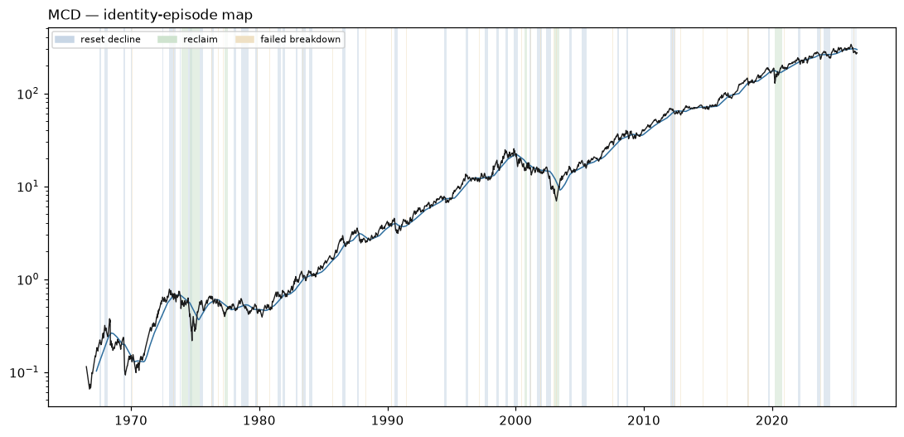

# MCD — Identity Atlas v0 dossier

Descriptive behavioral read. **Zero authority**: nothing on this page ranks, sizes, gates, originates a signal, or escalates. No expert content exists in W1 by law. Episode *resolutions* use future data by design — they are a research-time labeling instrument, never a live surface.

## Identity

| field | value |
|---|---|
| pilot role | operator core |
| price plane | `stocks_tr_v1` |
| first print | 1966-07-05 |
| last print | 2026-08-13 |
| sessions | 15127 |
| `open` available | False |
| sector stratum | Consumer Discretionary |
| cap stratum | adv3 (dollar-ADV tercile **proxy** — no per-name cap store is tracked) |
| vol stratum | vol1 |
| epoch key | `epoch_0` (listing-to-date; epoch detector: none/provisional) |
| tape ended | False |
| terminated reason | right_censored_at_asof (tape active through asof) |

**Survivor-only cohort:** the allowed price planes retain no ceased tapes; no dead name could be included (registration §2). Any cohort comparison this name appears in is a comparison among survivors and cannot name who is missing.

### Ticker-identity hygiene (§9.6)

No reused-ticker, rename, fixup, or delisting flag on this symbol.

**First-print sanity:** `PREDATES_CALENDAR` — first print 1966-07-05 predates the deal calendar's earliest priced date (2024-12-03)

## Behavioral fingerprint v0 (snapshot at asof)

Percentiles are PIT ranks against the contemporaneous evaluated universe. `—` is a coverage mask (the value is unavailable, which is not a low rank). `unstable` marks an adjacent-window quartile jump: the windows disagree, so the number is reported flagged rather than averaged into a clean-looking one.

### Metric block

The only block any future distance or map may read. Label-free by construction: no sector, industry, cap bucket, plane, or basket member here, and no gap-family member (the gap family is structurally unavailable on the open-less curated plane, so the plane law excludes it from this block universe-wide).

| feature | family | raw | universe pct | covered | unstable |
|---|---|---:|---:|:--:|:--:|
| `f1_kaufman_er_63` | F1 | 0.0084 | 4.2 | yes | **unstable** |
| `f1_kaufman_er_126` | F1 | 0.1293 | 75.8 | yes | **unstable** |
| `f1_kaufman_er_252` | F1 | 0.0345 | 27.6 | yes | **unstable** |
| `f1_logprice_r2_126` | F1 | 0.8435 | 92.3 | yes | **unstable** |
| `f1_logprice_r2_252` | F1 | 0.3154 | 34.4 | yes | **unstable** |
| `f1_share_above_50dma_252` | F1 | 0.4563 | 27.0 | yes |  |
| `f1_share_above_200dma_252` | F1 | 0.5873 | 43.3 | yes |  |
| `f1_new_high_cadence_252` | F1 | 0.0317 | 44.5 | yes |  |
| `f1_new_high_cadence_756` | F1 | 0.0357 | 45.0 | yes |  |
| `f2_drawdown_median_756` | F2 | 0.0150 | 13.4 | yes |  |
| `f2_drawdown_p90_756` | F2 | 0.1238 | 33.8 | yes |  |
| `f2_resets_per_year_15pct` | F2 | 0.3333 | 26.3 | yes |  |
| `f2_resets_per_year_30pct` | F2 | 0.0000 | 24.4 | yes |  |
| `f2_time_under_water_median_756` | F2 | 6.0000 | 55.4 | yes |  |
| `f2_ulcer_126` | F2 | 14.8874 | 43.5 | yes |  |
| `f2_ulcer_252` | F2 | 10.8502 | 22.0 | yes |  |
| `f3_post_trough_63d_atr_median` | F3 | 4.1886 | 48.1 | yes |  |
| `f3_time_to_50pct_retrace_median` | F3 | 33.0000 | 74.4 | yes |  |
| `f4_ar1_daily_252` | F4 | -0.1217 | 14.0 | yes |  |
| `f4_ar1_weekly_756` | F4 | -0.1172 | 15.5 | yes |  |
| `f4_variance_ratio_k5_756` | F4 | 0.9319 | 41.0 | yes |  |
| `f4_variance_ratio_k20_756` | F4 | 0.8940 | 56.3 | yes |  |
| `f4_mr_half_life_252` | F4 | 45.3663 | 55.7 | yes |  |
| `f4_oscillator_dwell_extreme_252` | F4 | 1.8333 | 11.4 | yes |  |
| `f5_realized_vol_21` | F5 | 21.2321 | 9.4 | yes |  |
| `f5_realized_vol_63` | F5 | 22.1060 | 8.7 | yes |  |
| `f5_realized_vol_252` | F5 | 17.9817 | 1.1 | yes |  |
| `f5_vol_of_vol_252` | F5 | 4.0599 | 4.3 | yes |  |
| `f5_acf_abs_ret_1_252` | F5 | 0.0453 | 36.3 | yes |  |
| `f5_natr_regime_spread_252` | F5 | 0.3623 | 4.9 | yes |  |
| `f7_atr_dist_20dma_252` | F7 | -0.1518 | 18.6 | yes |  |
| `f7_atr_dist_50dma_252` | F7 | -0.3341 | 23.1 | yes |  |
| `f7_atr_dist_200dma_252` | F7 | -0.2705 | 33.4 | yes |  |
| `f7_cross_freq_50dma_252` | F7 | 0.1230 | 94.4 | yes |  |
| `f7_cross_freq_200dma_252` | F7 | 0.0833 | 94.4 | yes |  |
| `f7_dwell_run_above_50dma_252` | F7 | 7.1875 | 8.2 | yes |  |
| `f7_dwell_run_above_200dma_252` | F7 | 13.4545 | 20.8 | yes |  |
| `f7_bounce_rate_50dma_756` | F7 | 0.5405 | 56.7 | yes |  |
| `f8_detrended_acf_peak_1260` | F8 | 0.3536 | 78.0 | yes |  |
| `f8_detrended_acf_peak_lag_1260` | F8 | 518.0000 | 75.7 | yes |  |
| `f8_detrended_acf_peak_sharpness_1260` | F8 | 2.4499 | 64.7 | yes |  |
| `f8_swing_period_median_756` | F8 | 117.0000 | 94.2 | yes |  |
| `f8_swing_period_median_1260` | F8 | 104.0000 | 95.7 | yes |  |
| `f9_beta_univ_ew_252` | F9 | 0.1014 | 5.1 | yes |  |
| `f9_beta_univ_ew_756` | F9 | 0.1628 | 1.7 | yes |  |
| `f9_idio_share_252` | F9 | 0.9897 | 93.2 | yes |  |
| `f9_idio_share_756` | F9 | 0.9654 | 93.8 | yes |  |
| `f10_dollar_adv_63` | F10 | 1.173e+09 | 96.7 | yes |  |
| `f10_dollar_adv_252` | F10 | 1.015e+09 | 96.7 | yes |  |
| `f10_turnover_proxy_252` | F10 | 1.2827 | 77.2 | yes |  |
| `f10_amihud_252` | F10 | 0.0000 | 1.3 | yes |  |
| `f10_cs_spread_252` | F10 | 0.0036 | 0.8 | yes |  |

### Diagnostic block

Census and baseline use only — never a distance input, never a map input.

| feature | raw | universe pct | covered |
|---|---:|---:|:--:|
| `d_sector` | — | — | no |
| `d_industry` | UNKNOWN | — | yes |
| `d_cap_bucket` | — | — | no |
| `d_market_cap_b` | — | — | no |
| `d_price_plane_id` | stocks_tr_v1 | — | yes |
| `d_listing_venue_class` | — | — | no |
| `d_f6_gap_share_252` | — | — | no |
| `d_f6_event_gap_contrib_252` | — | — | no |
| `d_f6_gap_fill_rate_252` | — | — | no |
| `d_close_jump_freq_252` | 0.0397 | 89.9 | yes |
| `d_close_jump_drift5_252` | 0.0660 | 47.2 | yes |

## Identity-episode catalog

Built with no expert event anywhere in its construction. Censored episodes are kept: a decline that never prints a durable low is the case that would otherwise silently disappear from every downstream count.

| type | tier | start | anchor | end | depth % | depth ATR | sessions | resolution | censored |
|---|---:|---|---|---|---:|---:|---:|---|:--:|
| failed_breakdown | 3 | 1966-09-30 | 1966-10-06 | 1966-10-12 | 11.2 | 2.59 | 8 | recovered | no |
| reset_decline | 3 | 1967-07-27 | 1967-09-05 | 1967-09-05 | 16.9 | 7.79 | 27 | durable_low | no |
| reset_decline | 2 | 1967-12-15 | 1968-03-05 | 1968-03-05 | 28.7 | 11.44 | 53 | durable_low | no |
| failed_breakdown | 3 | 1968-02-29 | 1968-03-05 | 1968-03-13 | 12.8 | 5.08 | 9 | recovered | no |
| reset_decline | 3 | 1968-05-07 | 1968-05-21 | 1968-05-21 | 55.9 | 22.78 | 10 | durable_low | no |
| failed_breakdown | 3 | 1968-08-02 | 1968-08-05 | 1968-08-06 | 4.4 | 1.15 | 2 | recovered | no |
| failed_breakdown | 3 | 1969-03-10 | 1969-03-10 | 1969-03-14 | 3.4 | 1.27 | 4 | recovered | no |
| reset_decline | 2 | 1969-05-21 | 1969-07-22 | 1969-07-22 | 62.5 | 29.22 | 41 | durable_low | no |
| failed_breakdown | 3 | 1969-06-30 | 1969-07-01 | 1969-07-02 | 1.6 | 0.22 | 2 | recovered | no |
| reset_decline | 3 | 1970-01-06 | 1970-01-29 | 1970-01-29 | 17.7 | 5.77 | 17 | durable_low | no |
| failed_breakdown | 3 | 1970-01-26 | 1970-01-29 | 1970-02-03 | 4.8 | 1.49 | 6 | recovered | no |
| failed_breakdown | 3 | 1970-05-25 | 1970-05-26 | 1970-05-27 | 3.9 | 0.69 | 2 | recovered | no |
| reset_decline | 3 | 1972-06-16 | 1972-07-17 | 1972-07-17 | 16.4 | 5.42 | 20 | durable_low | no |
| reset_decline | 2 | 1972-12-27 | 1973-06-25 | 1973-06-25 | 29.8 | 11.62 | 122 | durable_low | no |
| failed_breakdown | 3 | 1973-03-22 | 1973-03-22 | 1973-03-23 | 1.0 | 0.28 | 1 | recovered | no |
| failed_breakdown | 3 | 1973-04-25 | 1973-04-27 | 1973-05-02 | 5.0 | 1.61 | 5 | recovered | no |
| reset_decline | 3 | 1973-10-11 | 1973-11-23 | 1973-11-23 | 35.7 | 12.55 | 30 | durable_low | no |
| reclaim | 1 | 1973-12-03 | 1974-06-06 | 1974-06-20 | 38.6 | 9.27 | 128 | failed | no |
| reset_decline | 1 | 1974-06-10 | 1974-10-04 | 1974-10-04 | 66.4 | 26.27 | 82 | durable_low | no |
| reclaim | 1 | 1974-08-08 | 1975-02-11 | 1975-05-13 | 44.2 | 15.51 | 129 | held | no |
| failed_breakdown | 3 | 1974-09-09 | 1974-09-13 | 1974-09-19 | 10.3 | 1.48 | 8 | recovered | no |
| reset_decline | 2 | 1975-05-14 | 1975-08-20 | 1975-08-20 | 26.9 | 8.92 | 68 | durable_low | no |
| failed_breakdown | 3 | 1975-07-25 | 1975-07-25 | 1975-07-28 | 0.2 | 0.09 | 1 | recovered | no |
| reset_decline | 3 | 1976-04-05 | 1976-06-07 | 1976-06-07 | 19.9 | 11.33 | 43 | durable_low | no |
| failed_breakdown | 3 | 1976-04-15 | 1976-04-15 | 1976-04-19 | 0.8 | 0.42 | 1 | recovered | no |
| failed_breakdown | 3 | 1976-06-04 | 1976-06-07 | 1976-06-11 | 3.9 | 1.86 | 5 | recovered | no |
| failed_breakdown | 3 | 1976-10-14 | 1976-10-14 | 1976-10-18 | 0.9 | 0.46 | 2 | recovered | no |
| failed_breakdown | 3 | 1976-10-19 | 1976-10-22 | 1976-10-28 | 5.4 | 2.51 | 7 | recovered | no |
| failed_breakdown | 3 | 1977-02-25 | 1977-02-28 | 1977-03-01 | 0.5 | 0.29 | 2 | recovered | no |
| failed_breakdown | 3 | 1977-03-08 | 1977-03-09 | 1977-03-15 | 2.8 | 1.75 | 5 | recovered | no |
| failed_breakdown | 3 | 1977-04-22 | 1977-04-25 | 1977-04-28 | 4.4 | 1.95 | 4 | recovered | no |
| reclaim | 2 | 1977-04-22 | 1977-07-18 | 1977-07-27 | 39.8 | 27.97 | 58 | failed | no |
| failed_breakdown | 3 | 1977-10-18 | 1977-10-19 | 1977-10-21 | 1.5 | 1.03 | 3 | recovered | no |
| reset_decline | 3 | 1977-12-23 | 1978-03-06 | 1978-03-06 | 15.6 | 9.90 | 48 | durable_low | no |
| failed_breakdown | 3 | 1978-01-26 | 1978-01-26 | 1978-01-30 | 2.7 | 1.39 | 2 | recovered | no |
| failed_breakdown | 3 | 1978-03-06 | 1978-03-06 | 1978-03-07 | 0.5 | 0.30 | 1 | recovered | no |
| reset_decline | 2 | 1978-08-08 | 1979-03-07 | 1979-03-07 | 33.2 | 17.75 | 146 | durable_low | no |
| failed_breakdown | 3 | 1978-09-15 | 1978-09-15 | 1978-09-18 | 0.1 | 0.03 | 1 | recovered | no |
| failed_breakdown | 3 | 1978-09-20 | 1978-09-20 | 1978-09-22 | 1.7 | 0.68 | 2 | recovered | no |
| failed_breakdown | 3 | 1978-09-27 | 1978-09-27 | 1978-09-29 | 1.2 | 0.60 | 2 | recovered | no |
| failed_breakdown | 3 | 1978-10-03 | 1978-10-03 | 1978-10-04 | 0.7 | 0.39 | 1 | recovered | no |
| failed_breakdown | 3 | 1979-01-15 | 1979-01-17 | 1979-01-26 | 2.2 | 1.01 | 9 | recovered | no |
| failed_breakdown | 3 | 1979-02-27 | 1979-03-07 | 1979-03-12 | 2.2 | 1.31 | 9 | recovered | no |
| reset_decline | 2 | 1979-08-31 | 1979-11-07 | 1979-11-07 | 21.5 | 14.97 | 47 | durable_low | no |
| failed_breakdown | 3 | 1979-11-02 | 1979-11-07 | 1979-11-14 | 5.5 | 2.53 | 8 | recovered | no |
| failed_breakdown | 3 | 1980-10-23 | 1980-10-30 | 1980-11-05 | 3.9 | 2.11 | 8 | recovered | no |
| reset_decline | 3 | 1981-06-15 | 1981-09-09 | 1981-09-09 | 17.3 | 10.87 | 60 | durable_low | no |
| failed_breakdown | 3 | 1981-09-09 | 1981-09-09 | 1981-09-10 | 0.2 | 0.11 | 1 | recovered | no |
| reset_decline | 3 | 1981-11-02 | 1982-01-13 | 1982-01-13 | 18.9 | 9.52 | 49 | durable_low | no |
| reset_decline | 3 | 1982-11-05 | 1982-12-15 | 1982-12-15 | 16.0 | 5.56 | 27 | durable_low | no |
| reset_decline | 2 | 1983-04-21 | 1983-08-23 | 1983-08-23 | 23.4 | 12.36 | 86 | durable_low | no |
| failed_breakdown | 3 | 1983-05-27 | 1983-05-31 | 1983-06-01 | 0.8 | 0.31 | 2 | recovered | no |
| failed_breakdown | 3 | 1983-06-02 | 1983-06-08 | 1983-06-09 | 3.2 | 1.22 | 5 | recovered | no |
| failed_breakdown | 3 | 1983-08-23 | 1983-08-23 | 1983-08-26 | 1.3 | 0.64 | 3 | recovered | no |
| reset_decline | 3 | 1983-11-15 | 1984-02-13 | 1984-02-13 | 13.7 | 8.21 | 61 | durable_low | no |
| failed_breakdown | 3 | 1984-05-21 | 1984-05-29 | 1984-06-01 | 2.9 | 1.79 | 8 | recovered | no |
| failed_breakdown | 3 | 1985-09-20 | 1985-09-24 | 1985-09-26 | 2.0 | 1.37 | 4 | recovered | no |
| reset_decline | 2 | 1986-07-01 | 1986-10-01 | 1986-10-01 | 25.8 | 13.16 | 64 | durable_low | no |
| failed_breakdown | 3 | 1986-07-29 | 1986-08-06 | 1986-08-12 | 7.2 | 2.51 | 10 | recovered | no |
| failed_breakdown | 3 | 1986-09-29 | 1986-10-01 | 1986-10-03 | 2.4 | 0.86 | 4 | recovered | no |
| reset_decline | 2 | 1987-08-17 | 1987-10-19 | 1987-10-19 | 40.2 | 19.19 | 44 | durable_low | no |
| failed_breakdown | 3 | 1987-10-06 | 1987-10-06 | 1987-10-07 | 2.7 | 1.10 | 1 | recovered | no |
| failed_breakdown | 3 | 1988-03-28 | 1988-03-28 | 1988-03-29 | 0.6 | 0.27 | 1 | recovered | no |
| failed_breakdown | 3 | 1988-04-19 | 1988-04-20 | 1988-04-25 | 1.5 | 0.61 | 4 | recovered | no |
| failed_breakdown | 3 | 1990-02-23 | 1990-02-23 | 1990-02-26 | 0.4 | 0.17 | 1 | recovered | no |
| failed_breakdown | 3 | 1990-04-26 | 1990-04-30 | 1990-05-02 | 1.4 | 0.68 | 4 | recovered | no |
| reset_decline | 2 | 1990-07-17 | 1990-10-31 | 1990-10-31 | 33.6 | 14.14 | 75 | durable_low | no |
| failed_breakdown | 3 | 1990-09-17 | 1990-09-17 | 1990-09-18 | 0.2 | 0.04 | 1 | recovered | no |
| failed_breakdown | 3 | 1990-09-19 | 1990-09-24 | 1990-10-01 | 3.8 | 1.05 | 8 | recovered | no |
| failed_breakdown | 3 | 1990-10-31 | 1990-10-31 | 1990-11-01 | 0.5 | 0.15 | 1 | recovered | no |
| failed_breakdown | 3 | 1991-06-18 | 1991-06-24 | 1991-06-27 | 3.2 | 1.40 | 7 | recovered | no |
| failed_breakdown | 3 | 1991-08-05 | 1991-08-05 | 1991-08-06 | 0.4 | 0.20 | 1 | recovered | no |
| failed_breakdown | 3 | 1991-08-19 | 1991-08-19 | 1991-08-21 | 1.6 | 0.76 | 2 | recovered | no |
| failed_breakdown | 3 | 1992-03-31 | 1992-03-31 | 1992-04-01 | 0.3 | 0.11 | 1 | recovered | no |
| failed_breakdown | 3 | 1992-07-23 | 1992-07-23 | 1992-07-24 | 1.5 | 0.61 | 1 | recovered | no |
| failed_breakdown | 3 | 1992-08-07 | 1992-08-10 | 1992-08-11 | 1.2 | 0.49 | 2 | recovered | no |
| failed_breakdown | 3 | 1992-08-25 | 1992-08-25 | 1992-08-26 | 0.1 | 0.03 | 1 | recovered | no |
| failed_breakdown | 3 | 1993-04-19 | 1993-04-23 | 1993-04-28 | 3.5 | 1.82 | 7 | recovered | no |
| reset_decline | 3 | 1994-06-07 | 1994-08-16 | 1994-08-16 | 17.1 | 11.31 | 49 | durable_low | no |
| failed_breakdown | 3 | 1994-08-16 | 1994-08-16 | 1994-08-17 | 0.5 | 0.22 | 1 | recovered | no |
| reset_decline | 3 | 1996-02-12 | 1996-04-11 | 1996-04-11 | 14.0 | 6.46 | 41 | durable_low | no |
| failed_breakdown | 3 | 1996-06-18 | 1996-06-18 | 1996-06-24 | 0.9 | 0.44 | 4 | recovered | no |
| failed_breakdown | 3 | 1997-01-10 | 1997-01-10 | 1997-01-13 | 0.4 | 0.20 | 1 | recovered | no |
| failed_breakdown | 3 | 1997-02-27 | 1997-02-28 | 1997-03-04 | 1.0 | 0.38 | 3 | recovered | no |
| reset_decline | 3 | 1997-07-30 | 1997-10-27 | 1997-10-27 | 19.3 | 10.03 | 62 | durable_low | no |
| failed_breakdown | 3 | 1997-09-15 | 1997-09-15 | 1997-09-16 | 0.1 | 0.06 | 1 | recovered | no |
| failed_breakdown | 3 | 1997-10-13 | 1997-10-13 | 1997-10-14 | 0.1 | 0.07 | 1 | recovered | no |
| failed_breakdown | 3 | 1997-10-16 | 1997-10-16 | 1997-10-17 | 1.4 | 0.67 | 1 | recovered | no |
| failed_breakdown | 3 | 1997-10-27 | 1997-10-27 | 1997-10-28 | 2.9 | 1.16 | 1 | recovered | no |
| reset_decline | 2 | 1998-07-07 | 1998-09-17 | 1998-09-17 | 23.9 | 12.75 | 51 | durable_low | no |
| failed_breakdown | 3 | 1998-08-07 | 1998-08-07 | 1998-08-10 | 0.8 | 0.29 | 1 | recovered | no |
| failed_breakdown | 3 | 1998-08-31 | 1998-08-31 | 1998-09-08 | 7.6 | 2.64 | 5 | recovered | no |
| failed_breakdown | 3 | 1998-09-17 | 1998-09-17 | 1998-09-18 | 0.1 | 0.03 | 1 | recovered | no |
| reset_decline | 3 | 1999-03-05 | 1999-05-27 | 1999-05-27 | 19.4 | 8.94 | 58 | durable_low | no |
| failed_breakdown | 3 | 1999-05-10 | 1999-05-10 | 1999-05-11 | 1.2 | 0.40 | 1 | recovered | no |
| failed_breakdown | 3 | 1999-05-24 | 1999-05-27 | 1999-06-03 | 3.8 | 1.29 | 7 | recovered | no |
| reset_decline | 1 | 1999-11-12 | 2000-03-07 | 2000-03-07 | 38.2 | 13.22 | 78 | durable_low | no |
| failed_breakdown | 3 | 2000-01-04 | 2000-01-04 | 2000-01-05 | 0.7 | 0.22 | 1 | recovered | no |
| failed_breakdown | 3 | 2000-03-02 | 2000-03-02 | 2000-03-03 | 0.4 | 0.10 | 1 | recovered | no |
| failed_breakdown | 3 | 2000-03-07 | 2000-03-07 | 2000-03-09 | 3.2 | 0.77 | 2 | recovered | no |
| failed_breakdown | 3 | 2000-06-13 | 2000-06-16 | 2000-06-23 | 3.7 | 0.81 | 8 | recovered | no |
| failed_breakdown | 3 | 2000-06-29 | 2000-06-29 | 2000-06-30 | 0.2 | 0.05 | 1 | recovered | no |
| failed_breakdown | 3 | 2000-07-21 | 2000-07-24 | 2000-07-25 | 3.2 | 1.05 | 2 | recovered | no |
| reclaim | 2 | 2000-09-13 | 2000-11-10 | 2000-11-27 | 43.7 | 22.53 | 42 | failed | no |
| failed_breakdown | 3 | 2000-09-21 | 2000-09-21 | 2000-09-22 | 0.7 | 0.17 | 1 | recovered | no |
| reset_decline | 2 | 2001-01-17 | 2001-03-23 | 2001-03-23 | 27.9 | 8.89 | 46 | durable_low | no |
| failed_breakdown | 3 | 2001-01-26 | 2001-01-26 | 2001-01-29 | 1.7 | 0.38 | 1 | recovered | no |
| failed_breakdown | 3 | 2001-03-02 | 2001-03-07 | 2001-03-08 | 2.1 | 0.69 | 4 | recovered | no |
| reset_decline | 3 | 2001-08-23 | 2002-01-25 | 2002-01-25 | 16.2 | 8.29 | 102 | durable_low | no |
| failed_breakdown | 3 | 2001-09-25 | 2001-09-26 | 2001-09-27 | 1.1 | 0.36 | 2 | recovered | no |
| failed_breakdown | 3 | 2001-10-30 | 2001-10-30 | 2001-11-02 | 1.0 | 0.30 | 3 | recovered | no |
| failed_breakdown | 3 | 2001-12-12 | 2001-12-12 | 2001-12-14 | 0.5 | 0.20 | 2 | recovered | no |
| failed_breakdown | 3 | 2002-01-25 | 2002-01-25 | 2002-01-28 | 0.1 | 0.03 | 1 | recovered | no |
| reset_decline | 1 | 2002-05-22 | 2002-10-09 | 2002-10-09 | 46.0 | 23.43 | 97 | durable_low | no |
| failed_breakdown | 3 | 2002-09-30 | 2002-09-30 | 2002-10-01 | 1.1 | 0.22 | 1 | recovered | no |
| failed_breakdown | 3 | 2002-10-04 | 2002-10-09 | 2002-10-11 | 6.2 | 1.29 | 5 | recovered | no |
| failed_breakdown | 3 | 2002-12-17 | 2002-12-24 | 2003-01-02 | 5.2 | 1.34 | 10 | recovered | no |
| reclaim | 1 | 2003-01-06 | 2003-05-09 | 2003-05-20 | 44.9 | 24.78 | 86 | failed | no |
| failed_breakdown | 3 | 2003-02-24 | 2003-02-26 | 2003-02-28 | 4.3 | 1.27 | 4 | recovered | no |
| failed_breakdown | 3 | 2003-03-05 | 2003-03-06 | 2003-03-07 | 1.6 | 0.45 | 2 | recovered | no |
| failed_breakdown | 3 | 2003-03-10 | 2003-03-12 | 2003-03-13 | 1.8 | 0.54 | 3 | recovered | no |
| reset_decline | 3 | 2004-03-05 | 2004-05-20 | 2004-05-20 | 15.2 | 8.88 | 53 | durable_low | no |
| reset_decline | 3 | 2005-03-07 | 2005-07-06 | 2005-07-06 | 19.0 | 11.63 | 84 | durable_low | no |
| failed_breakdown | 3 | 2005-04-11 | 2005-04-11 | 2005-04-12 | 0.3 | 0.16 | 1 | recovered | no |
| failed_breakdown | 3 | 2005-04-29 | 2005-04-29 | 2005-05-03 | 1.0 | 0.47 | 2 | recovered | no |
| failed_breakdown | 3 | 2005-06-08 | 2005-06-09 | 2005-06-10 | 1.1 | 0.61 | 2 | recovered | no |
| failed_breakdown | 3 | 2005-06-15 | 2005-06-15 | 2005-06-16 | 0.1 | 0.06 | 1 | recovered | no |
| failed_breakdown | 3 | 2006-04-25 | 2006-04-25 | 2006-04-27 | 1.2 | 0.77 | 2 | recovered | no |
| failed_breakdown | 3 | 2006-06-13 | 2006-06-13 | 2006-06-14 | 2.4 | 1.36 | 1 | recovered | no |
| failed_breakdown | 3 | 2007-07-27 | 2007-07-31 | 2007-08-06 | 2.9 | 1.47 | 6 | recovered | no |
| failed_breakdown | 3 | 2007-08-15 | 2007-08-15 | 2007-08-16 | 0.6 | 0.24 | 1 | recovered | no |
| reset_decline | 3 | 2007-12-11 | 2008-01-29 | 2008-01-29 | 19.6 | 10.64 | 32 | durable_low | no |
| failed_breakdown | 3 | 2008-01-11 | 2008-01-11 | 2008-01-14 | 0.5 | 0.21 | 1 | recovered | no |
| reset_decline | 2 | 2008-08-11 | 2008-10-15 | 2008-10-15 | 21.4 | 8.19 | 46 | durable_low | no |
| failed_breakdown | 3 | 2008-10-07 | 2008-10-09 | 2008-10-13 | 8.9 | 2.18 | 4 | recovered | no |
| failed_breakdown | 3 | 2008-10-15 | 2008-10-15 | 2008-10-16 | 1.0 | 0.15 | 1 | recovered | no |
| failed_breakdown | 3 | 2009-02-20 | 2009-02-23 | 2009-02-24 | 1.5 | 0.50 | 2 | recovered | no |
| failed_breakdown | 3 | 2009-08-17 | 2009-08-17 | 2009-08-18 | 0.6 | 0.37 | 1 | recovered | no |
| failed_breakdown | 3 | 2011-01-04 | 2011-01-13 | 2011-01-19 | 3.1 | 3.02 | 10 | recovered | no |
| reset_decline | 3 | 2012-01-20 | 2012-06-04 | 2012-06-04 | 13.9 | 11.41 | 93 | durable_low | no |
| failed_breakdown | 3 | 2012-03-22 | 2012-03-23 | 2012-03-26 | 1.1 | 1.06 | 2 | recovered | no |
| failed_breakdown | 3 | 2012-04-19 | 2012-04-19 | 2012-04-20 | 0.3 | 0.23 | 1 | recovered | no |
| failed_breakdown | 3 | 2012-04-23 | 2012-04-24 | 2012-04-26 | 0.7 | 0.49 | 3 | recovered | no |
| failed_breakdown | 3 | 2012-06-01 | 2012-06-04 | 2012-06-14 | 2.9 | 2.15 | 9 | recovered | no |
| failed_breakdown | 3 | 2012-11-08 | 2012-11-15 | 2012-11-23 | 3.0 | 2.41 | 10 | recovered | no |
| failed_breakdown | 3 | 2013-06-05 | 2013-06-05 | 2013-06-06 | 0.2 | 0.12 | 1 | recovered | no |
| failed_breakdown | 3 | 2013-10-08 | 2013-10-09 | 2013-10-10 | 0.9 | 0.79 | 2 | recovered | no |
| failed_breakdown | 3 | 2014-01-27 | 2014-01-27 | 2014-01-28 | 0.0 | 0.03 | 1 | recovered | no |
| failed_breakdown | 3 | 2014-01-29 | 2014-01-29 | 2014-01-31 | 1.0 | 0.96 | 2 | recovered | no |
| failed_breakdown | 3 | 2014-02-03 | 2014-02-03 | 2014-02-05 | 0.1 | 0.12 | 2 | recovered | no |
| failed_breakdown | 3 | 2014-08-05 | 2014-08-07 | 2014-08-19 | 1.0 | 1.07 | 10 | recovered | no |
| failed_breakdown | 3 | 2014-09-08 | 2014-09-09 | 2014-09-10 | 1.5 | 1.85 | 2 | recovered | no |
| failed_breakdown | 3 | 2014-10-13 | 2014-10-13 | 2014-10-14 | 0.4 | 0.31 | 1 | recovered | no |
| failed_breakdown | 3 | 2014-10-15 | 2014-10-16 | 2014-10-17 | 0.9 | 0.69 | 2 | recovered | no |
| failed_breakdown | 3 | 2014-12-15 | 2014-12-15 | 2014-12-17 | 0.7 | 0.49 | 2 | recovered | no |
| failed_breakdown | 3 | 2015-08-24 | 2015-08-25 | 2015-08-26 | 3.3 | 2.15 | 2 | recovered | no |
| failed_breakdown | 3 | 2016-06-22 | 2016-06-22 | 2016-06-23 | 0.4 | 0.30 | 1 | recovered | no |
| failed_breakdown | 3 | 2016-06-24 | 2016-06-27 | 2016-07-05 | 3.6 | 2.78 | 6 | recovered | no |
| failed_breakdown | 3 | 2016-08-19 | 2016-08-26 | 2016-08-31 | 1.6 | 1.41 | 8 | recovered | no |
| failed_breakdown | 3 | 2016-10-04 | 2016-10-05 | 2016-10-06 | 0.1 | 0.11 | 2 | recovered | no |
| failed_breakdown | 3 | 2016-10-17 | 2016-10-20 | 2016-10-21 | 2.5 | 1.99 | 4 | recovered | no |
| reset_decline | 3 | 2018-01-26 | 2018-03-02 | 2018-03-02 | 16.3 | 16.36 | 24 | durable_low | no |
| failed_breakdown | 3 | 2018-02-05 | 2018-02-05 | 2018-02-06 | 0.5 | 0.29 | 1 | recovered | no |
| failed_breakdown | 3 | 2018-02-08 | 2018-02-08 | 2018-02-12 | 3.0 | 1.27 | 2 | recovered | no |
| failed_breakdown | 3 | 2018-02-16 | 2018-02-20 | 2018-02-22 | 1.1 | 0.46 | 3 | recovered | no |
| failed_breakdown | 3 | 2018-03-01 | 2018-03-02 | 2018-03-09 | 5.1 | 2.20 | 6 | recovered | no |
| failed_breakdown | 3 | 2018-07-26 | 2018-07-26 | 2018-07-27 | 0.1 | 0.08 | 1 | recovered | no |
| failed_breakdown | 3 | 2018-08-02 | 2018-08-02 | 2018-08-03 | 0.5 | 0.33 | 1 | recovered | no |
| reset_decline | 3 | 2019-09-06 | 2019-11-04 | 2019-11-04 | 14.3 | 10.56 | 41 | durable_low | no |
| failed_breakdown | 3 | 2019-10-02 | 2019-10-02 | 2019-10-03 | 0.5 | 0.36 | 1 | recovered | no |
| failed_breakdown | 3 | 2020-03-09 | 2020-03-09 | 2020-03-10 | 3.4 | 1.20 | 1 | recovered | no |
| reclaim | 1 | 2020-03-23 | 2020-07-15 | 2020-10-13 | 36.9 | 6.52 | 79 | held | no |
| failed_breakdown | 3 | 2020-12-02 | 2020-12-02 | 2020-12-03 | 0.2 | 0.11 | 1 | recovered | no |
| failed_breakdown | 3 | 2020-12-04 | 2020-12-11 | 2020-12-14 | 1.5 | 0.75 | 6 | recovered | no |
| failed_breakdown | 3 | 2021-01-27 | 2021-01-28 | 2021-01-29 | 0.5 | 0.27 | 2 | recovered | no |
| failed_breakdown | 3 | 2021-03-04 | 2021-03-04 | 2021-03-05 | 0.3 | 0.19 | 1 | recovered | no |
| reset_decline | 3 | 2022-01-06 | 2022-03-10 | 2022-03-10 | 17.2 | 13.97 | 43 | durable_low | no |
| failed_breakdown | 3 | 2023-02-09 | 2023-02-09 | 2023-02-10 | 0.6 | 0.33 | 1 | recovered | no |
| reset_decline | 3 | 2023-06-30 | 2023-10-12 | 2023-10-12 | 17.1 | 14.61 | 72 | durable_low | no |
| failed_breakdown | 3 | 2023-08-17 | 2023-08-21 | 2023-08-24 | 0.7 | 0.56 | 5 | recovered | no |
| failed_breakdown | 3 | 2023-09-06 | 2023-09-06 | 2023-09-08 | 1.1 | 0.96 | 2 | recovered | no |
| failed_breakdown | 3 | 2023-10-06 | 2023-10-12 | 2023-10-18 | 2.4 | 1.52 | 8 | recovered | no |
| reset_decline | 3 | 2024-01-19 | 2024-07-09 | 2024-07-09 | 17.2 | 14.82 | 117 | durable_low | no |
| failed_breakdown | 3 | 2024-03-13 | 2024-03-18 | 2024-03-20 | 1.6 | 1.16 | 5 | recovered | no |
| failed_breakdown | 3 | 2024-07-09 | 2024-07-09 | 2024-07-10 | 0.8 | 0.46 | 1 | recovered | no |
| failed_breakdown | 3 | 2025-01-10 | 2025-01-16 | 2025-01-27 | 2.4 | 1.53 | 10 | recovered | no |
| reset_decline | 2 | 2026-02-27 | — | 2026-08-13 | 22.0 | 13.99 | 115 | censored | yes |
| failed_breakdown | 3 | 2026-05-07 | 2026-05-11 | 2026-05-21 | 3.3 | 1.80 | 10 | recovered | no |
| failed_breakdown | 3 | 2026-06-04 | 2026-06-04 | 2026-06-05 | 0.0 | 0.01 | 1 | recovered | no |
| failed_breakdown | 3 | 2026-06-22 | 2026-06-22 | 2026-06-24 | 1.0 | 0.51 | 2 | recovered | no |
| failed_breakdown | 3 | 2026-06-25 | 2026-06-25 | 2026-06-30 | 2.1 | 1.05 | 3 | recovered | no |
| failed_breakdown | 3 | 2026-07-21 | 2026-07-23 | 2026-07-24 | 0.7 | 0.28 | 3 | recovered | no |

**192 episodes**, 1 censored; by type {'failed_breakdown': 144, 'reset_decline': 42, 'reclaim': 6}; by tier {3: 169, 2: 16, 1: 7}.

## State shares by year

Eight mutually-exclusive bars-only states, first-match-wins precedence. Gap basis on this plane: `close_vs_prev_close` — a close-to-close proxy absorbs the whole session's move, not just the overnight jump, so cross-plane comparisons of the dislocation share carry that caveat.

| year | post event dislocation | deep washout | breakdown | recovery reclaim | controlled pullback | structural uptrend | vol transition | range |
|---:|---:|---:|---:|---:|---:|---:|---:|---:|
| 1966 | 16% | 0% | 0% | 0% | 0% | 0% | 0% | 84% |
| 1967 | 10% | 0% | 0% | 0% | 18% | 26% | 0% | 46% |
| 1968 | 11% | 49% | 0% | 0% | 27% | 9% | 0% | 5% |
| 1969 | 10% | 59% | 0% | 12% | 0% | 0% | 1% | 19% |
| 1970 | 6% | 17% | 0% | 43% | 0% | 6% | 3% | 26% |
| 1971 | 8% | 0% | 0% | 0% | 14% | 77% | 0% | 0% |
| 1972 | 8% | 0% | 0% | 0% | 27% | 65% | 0% | 0% |
| 1973 | 4% | 0% | 2% | 0% | 43% | 9% | 10% | 33% |
| 1974 | 8% | 38% | 4% | 1% | 2% | 0% | 7% | 41% |
| 1975 | 0% | 9% | 0% | 48% | 31% | 9% | 0% | 2% |
| 1976 | 0% | 0% | 0% | 0% | 9% | 34% | 0% | 56% |
| 1977 | 8% | 0% | 2% | 23% | 8% | 6% | 3% | 50% |
| 1978 | 8% | 0% | 0% | 0% | 27% | 23% | 10% | 31% |
| 1979 | 2% | 0% | 0% | 0% | 26% | 7% | 28% | 37% |
| 1980 | 6% | 0% | 0% | 0% | 37% | 18% | 8% | 31% |
| 1981 | 6% | 0% | 0% | 0% | 41% | 49% | 3% | 1% |
| 1982 | 12% | 0% | 0% | 0% | 31% | 40% | 7% | 11% |
| 1983 | 8% | 0% | 0% | 0% | 45% | 35% | 2% | 10% |
| 1984 | 4% | 0% | 0% | 0% | 41% | 38% | 1% | 16% |
| 1985 | 4% | 0% | 0% | 0% | 20% | 76% | 0% | 0% |
| 1986 | 4% | 0% | 0% | 0% | 27% | 42% | 0% | 28% |
| 1987 | 4% | 0% | 0% | 0% | 34% | 40% | 1% | 20% |
| 1988 | 4% | 0% | 0% | 0% | 36% | 8% | 11% | 40% |
| 1989 | 4% | 0% | 0% | 0% | 17% | 79% | 0% | 0% |
| 1990 | 2% | 0% | 0% | 0% | 27% | 25% | 0% | 46% |
| 1991 | 4% | 0% | 0% | 0% | 67% | 18% | 2% | 9% |
| 1992 | 0% | 0% | 0% | 0% | 28% | 67% | 0% | 5% |
| 1993 | 2% | 0% | 0% | 0% | 26% | 69% | 0% | 3% |
| 1994 | 4% | 0% | 0% | 0% | 20% | 42% | 17% | 16% |
| 1995 | 4% | 0% | 0% | 0% | 11% | 85% | 0% | 0% |
| 1996 | 2% | 0% | 0% | 0% | 49% | 13% | 14% | 22% |
| 1997 | 6% | 0% | 0% | 0% | 28% | 23% | 17% | 26% |
| 1998 | 6% | 0% | 0% | 0% | 33% | 48% | 1% | 13% |
| 1999 | 4% | 0% | 0% | 0% | 54% | 30% | 10% | 2% |
| 2000 | 2% | 0% | 4% | 6% | 2% | 0% | 16% | 70% |
| 2001 | 0% | 0% | 0% | 6% | 17% | 0% | 19% | 59% |
| 2002 | 4% | 4% | 23% | 0% | 13% | 15% | 10% | 29% |
| 2003 | 10% | 26% | 3% | 41% | 4% | 15% | 0% | 1% |
| 2004 | 4% | 0% | 0% | 0% | 44% | 46% | 2% | 5% |
| 2005 | 4% | 0% | 0% | 0% | 30% | 50% | 0% | 16% |
| 2006 | 4% | 0% | 0% | 0% | 2% | 82% | 6% | 7% |
| 2007 | 4% | 0% | 0% | 0% | 12% | 84% | 0% | 0% |
| 2008 | 4% | 0% | 0% | 0% | 46% | 34% | 0% | 16% |
| 2009 | 2% | 0% | 0% | 0% | 33% | 23% | 0% | 42% |
| 2010 | 0% | 0% | 0% | 0% | 2% | 98% | 0% | 0% |
| 2011 | 4% | 0% | 0% | 0% | 12% | 83% | 0% | 0% |
| 2012 | 4% | 0% | 0% | 0% | 5% | 34% | 21% | 36% |
| 2013 | 0% | 0% | 0% | 0% | 12% | 72% | 2% | 14% |
| 2014 | 4% | 0% | 0% | 0% | 0% | 43% | 18% | 35% |
| 2015 | 8% | 0% | 0% | 0% | 0% | 81% | 4% | 8% |
| 2016 | 8% | 0% | 0% | 0% | 19% | 46% | 5% | 21% |
| 2017 | 6% | 0% | 0% | 0% | 3% | 91% | 0% | 0% |
| 2018 | 12% | 0% | 0% | 0% | 20% | 29% | 8% | 31% |
| 2019 | 4% | 0% | 0% | 0% | 4% | 74% | 8% | 10% |
| 2020 | 5% | 0% | 0% | 21% | 13% | 29% | 4% | 28% |
| 2021 | 2% | 0% | 0% | 0% | 14% | 83% | 0% | 0% |
| 2022 | 2% | 0% | 0% | 0% | 19% | 56% | 3% | 20% |
| 2023 | 0% | 0% | 0% | 0% | 2% | 80% | 5% | 13% |
| 2024 | 6% | 0% | 0% | 0% | 13% | 43% | 11% | 27% |
| 2025 | 4% | 0% | 0% | 0% | 14% | 67% | 5% | 10% |
| 2026 | 0% | 0% | 0% | 0% | 12% | 31% | 4% | 54% |

## Episode map

Log price with the 200DMA, episode spans shaded by type, durable lows marked, and the daily state strip beneath. On histories longer than 5,000 sessions the two price LINES are drawn at weekly resolution for legibility and file size; spans, markers and the state strip stay daily.

---

Constants: `77e111c11672524c826948455a8c2ea5b812cdddb3f0d9dac1807b253604e9d0` · fingerprint spec: `0e3457b11f41452e1c3efac3858196f5f42b573d1961b798ea581e1590b33187` · partition: `a546c64983431f0afca01cfd9aacc230ef3bed875520c44898090520cf98164a` · asof 2026-08-13
