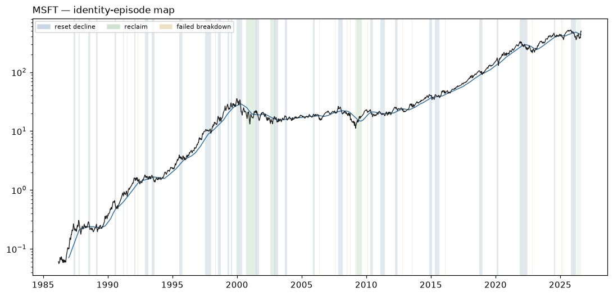

# MSFT — Identity Atlas v0 dossier

Descriptive behavioral read. **Zero authority**: nothing on this page ranks, sizes, gates, originates a signal, or escalates. No expert content exists in W1 by law. Episode *resolutions* use future data by design — they are a research-time labeling instrument, never a live surface.

## Identity

| field | value |
|---|---|
| pilot role | stressor — steady-trender control |
| price plane | `stocks_tr_v1` |
| first print | 1986-03-13 |
| last print | 2026-08-13 |
| sessions | 10183 |
| `open` available | False |
| sector stratum | Information Technology |
| cap stratum | adv3 (dollar-ADV tercile **proxy** — no per-name cap store is tracked) |
| vol stratum | vol1 |
| epoch key | `epoch_0` (listing-to-date; epoch detector: none/provisional) |
| tape ended | False |
| terminated reason | right_censored_at_asof (tape active through asof) |

**Survivor-only cohort:** the allowed price planes retain no ceased tapes; no dead name could be included (registration §2). Any cohort comparison this name appears in is a comparison among survivors and cannot name who is missing.

### Ticker-identity hygiene (§9.6)

No reused-ticker, rename, fixup, or delisting flag on this symbol.

**First-print sanity:** `PREDATES_CALENDAR` — first print 1986-03-13 predates the deal calendar's earliest priced date (2024-12-03)

## Behavioral fingerprint v0 (snapshot at asof)

Percentiles are PIT ranks against the contemporaneous evaluated universe. `—` is a coverage mask (the value is unavailable, which is not a low rank). `unstable` marks an adjacent-window quartile jump: the windows disagree, so the number is reported flagged rather than averaged into a clean-looking one.

### Metric block

The only block any future distance or map may read. Label-free by construction: no sector, industry, cap bucket, plane, or basket member here, and no gap-family member (the gap family is structurally unavailable on the open-less curated plane, so the plane law excludes it from this block universe-wide).

| feature | family | raw | universe pct | covered | unstable |
|---|---|---:|---:|:--:|:--:|
| `f1_kaufman_er_63` | F1 | 0.1820 | 69.5 | yes |  |
| `f1_kaufman_er_126` | F1 | 0.1142 | 69.4 | yes | **unstable** |
| `f1_kaufman_er_252` | F1 | 0.0192 | 15.5 | yes | **unstable** |
| `f1_logprice_r2_126` | F1 | 0.1309 | 22.1 | yes | **unstable** |
| `f1_logprice_r2_252` | F1 | 0.5433 | 53.2 | yes | **unstable** |
| `f1_share_above_50dma_252` | F1 | 0.3651 | 13.5 | yes |  |
| `f1_share_above_200dma_252` | F1 | 0.4484 | 29.9 | yes |  |
| `f1_new_high_cadence_252` | F1 | 0.0040 | 23.5 | yes | **unstable** |
| `f1_new_high_cadence_756` | F1 | 0.0794 | 85.0 | yes | **unstable** |
| `f2_drawdown_median_756` | F2 | 0.0116 | 9.1 | yes |  |
| `f2_drawdown_p90_756` | F2 | 0.0499 | 8.1 | yes |  |
| `f2_resets_per_year_15pct` | F2 | 0.3333 | 26.3 | yes |  |
| `f2_resets_per_year_30pct` | F2 | 0.0000 | 24.4 | yes |  |
| `f2_time_under_water_median_756` | F2 | 3.0000 | 7.3 | yes |  |
| `f2_ulcer_126` | F2 | 21.8720 | 60.9 | yes |  |
| `f2_ulcer_252` | F2 | 19.4067 | 46.4 | yes |  |
| `f3_post_trough_63d_atr_median` | F3 | 3.6423 | 36.1 | yes |  |
| `f3_time_to_50pct_retrace_median` | F3 | 24.0000 | 51.6 | yes |  |
| `f4_ar1_daily_252` | F4 | 0.1069 | 96.6 | yes |  |
| `f4_ar1_weekly_756` | F4 | -0.0090 | 56.7 | yes |  |
| `f4_variance_ratio_k5_756` | F4 | 1.0825 | 90.6 | yes |  |
| `f4_variance_ratio_k20_756` | F4 | 0.9803 | 74.0 | yes |  |
| `f4_mr_half_life_252` | F4 | 42.7715 | 53.2 | yes |  |
| `f4_oscillator_dwell_extreme_252` | F4 | 2.8182 | 38.6 | yes |  |
| `f5_realized_vol_21` | F5 | 55.4859 | 62.5 | yes |  |
| `f5_realized_vol_63` | F5 | 44.4874 | 46.8 | yes |  |
| `f5_realized_vol_252` | F5 | 31.6886 | 26.2 | yes |  |
| `f5_vol_of_vol_252` | F5 | 11.2412 | 41.2 | yes |  |
| `f5_acf_abs_ret_1_252` | F5 | 0.0855 | 55.7 | yes |  |
| `f5_natr_regime_spread_252` | F5 | 1.1646 | 58.6 | yes |  |
| `f7_atr_dist_20dma_252` | F7 | -0.2305 | 14.7 | yes |  |
| `f7_atr_dist_50dma_252` | F7 | -0.8229 | 13.3 | yes |  |
| `f7_atr_dist_200dma_252` | F7 | -0.7495 | 29.4 | yes |  |
| `f7_cross_freq_50dma_252` | F7 | 0.0794 | 61.3 | yes |  |
| `f7_cross_freq_200dma_252` | F7 | 0.0317 | 55.0 | yes |  |
| `f7_dwell_run_above_50dma_252` | F7 | 8.3636 | 14.1 | yes |  |
| `f7_dwell_run_above_200dma_252` | F7 | 22.6000 | 38.2 | yes |  |
| `f7_bounce_rate_50dma_756` | F7 | 0.4595 | 36.7 | yes |  |
| `f8_detrended_acf_peak_1260` | F8 | 0.0732 | 3.3 | yes |  |
| `f8_detrended_acf_peak_lag_1260` | F8 | 126.0000 | 30.9 | yes |  |
| `f8_detrended_acf_peak_sharpness_1260` | F8 | 2.4247 | 62.9 | yes |  |
| `f8_swing_period_median_756` | F8 | 84.5000 | 87.6 | yes |  |
| `f8_swing_period_median_1260` | F8 | 66.0000 | 81.5 | yes |  |
| `f9_beta_univ_ew_252` | F9 | 0.4256 | 16.1 | yes |  |
| `f9_beta_univ_ew_756` | F9 | 0.4483 | 11.1 | yes |  |
| `f9_idio_share_252` | F9 | 0.9416 | 76.3 | yes |  |
| `f9_idio_share_756` | F9 | 0.8735 | 64.6 | yes |  |
| `f10_dollar_adv_63` | F10 | 1.425e+10 | 99.8 | yes |  |
| `f10_dollar_adv_252` | F10 | 1.233e+10 | 99.9 | yes |  |
| `f10_turnover_proxy_252` | F10 | 1.2192 | 72.9 | yes |  |
| `f10_amihud_252` | F10 | 0.0000 | 0.1 | yes |  |
| `f10_cs_spread_252` | F10 | 0.0039 | 1.5 | yes |  |

### Diagnostic block

Census and baseline use only — never a distance input, never a map input.

| feature | raw | universe pct | covered |
|---|---:|---:|:--:|
| `d_sector` | — | — | no |
| `d_industry` | UNKNOWN | — | yes |
| `d_cap_bucket` | — | — | no |
| `d_market_cap_b` | — | — | no |
| `d_price_plane_id` | stocks_tr_v1 | — | yes |
| `d_listing_venue_class` | — | — | no |
| `d_f6_gap_share_252` | — | — | no |
| `d_f6_event_gap_contrib_252` | — | — | no |
| `d_f6_gap_fill_rate_252` | — | — | no |
| `d_close_jump_freq_252` | 0.0357 | 81.5 | yes |
| `d_close_jump_drift5_252` | -0.8322 | 6.6 | yes |

## Identity-episode catalog

Built with no expert event anywhere in its construction. Censored episodes are kept: a decline that never prints a durable low is the case that would otherwise silently disappear from every downstream count.

| type | tier | start | anchor | end | depth % | depth ATR | sessions | resolution | censored |
|---|---:|---|---|---|---:|---:|---:|---|:--:|
| failed_breakdown | 3 | 1986-07-09 | 1986-07-10 | 1986-07-16 | 5.2 | 1.73 | 5 | recovered | no |
| failed_breakdown | 3 | 1986-09-03 | 1986-09-03 | 1986-09-04 | 0.9 | 0.32 | 1 | recovered | no |
| reset_decline | 2 | 1987-05-08 | 1987-07-07 | 1987-07-07 | 28.7 | 8.37 | 40 | durable_low | no |
| failed_breakdown | 3 | 1987-07-07 | 1987-07-07 | 1987-07-08 | 2.4 | 0.67 | 1 | recovered | no |
| reset_decline | 3 | 1987-10-05 | 1987-10-26 | 1987-10-26 | 50.3 | 15.60 | 15 | durable_low | no |
| failed_breakdown | 3 | 1987-10-19 | 1987-10-19 | 1987-10-20 | 1.4 | 0.17 | 1 | recovered | no |
| failed_breakdown | 3 | 1987-10-26 | 1987-10-26 | 1987-10-29 | 13.3 | 1.03 | 3 | recovered | no |
| reset_decline | 3 | 1988-07-05 | 1988-08-22 | 1988-08-22 | 31.1 | 14.31 | 34 | durable_low | no |
| failed_breakdown | 3 | 1988-08-22 | 1988-08-22 | 1988-08-24 | 5.0 | 1.30 | 2 | recovered | no |
| failed_breakdown | 3 | 1988-11-02 | 1988-11-04 | 1988-11-08 | 3.1 | 0.99 | 4 | recovered | no |
| failed_breakdown | 3 | 1988-11-16 | 1988-11-17 | 1988-11-18 | 1.1 | 0.31 | 2 | recovered | no |
| reset_decline | 3 | 1989-02-09 | 1989-03-17 | 1989-03-17 | 27.1 | 9.81 | 25 | durable_low | no |
| failed_breakdown | 3 | 1989-03-17 | 1989-03-17 | 1989-03-23 | 7.5 | 1.98 | 4 | recovered | no |
| reset_decline | 3 | 1990-07-16 | 1990-08-23 | 1990-08-23 | 34.7 | 12.75 | 28 | durable_low | no |
| failed_breakdown | 3 | 1990-08-06 | 1990-08-06 | 1990-08-08 | 4.3 | 0.86 | 2 | recovered | no |
| failed_breakdown | 3 | 1990-08-17 | 1990-08-23 | 1990-08-27 | 14.5 | 3.02 | 6 | recovered | no |
| reset_decline | 3 | 1991-03-05 | 1991-03-22 | 1991-03-22 | 15.9 | 5.13 | 13 | durable_low | no |
| failed_breakdown | 3 | 1991-07-03 | 1991-07-05 | 1991-07-08 | 5.2 | 1.40 | 2 | recovered | no |
| reset_decline | 3 | 1992-01-15 | 1992-02-21 | 1992-02-21 | 12.9 | 4.71 | 26 | durable_low | no |
| failed_breakdown | 3 | 1992-04-24 | 1992-04-28 | 1992-05-05 | 4.8 | 1.11 | 7 | recovered | no |
| failed_breakdown | 3 | 1992-06-11 | 1992-06-11 | 1992-06-12 | 0.9 | 0.32 | 1 | recovered | no |
| failed_breakdown | 3 | 1992-06-25 | 1992-06-26 | 1992-06-29 | 7.3 | 2.07 | 2 | recovered | no |
| reset_decline | 3 | 1992-11-20 | 1993-02-22 | 1993-02-22 | 19.2 | 7.68 | 62 | durable_low | no |
| failed_breakdown | 3 | 1993-02-04 | 1993-02-04 | 1993-02-05 | 0.1 | 0.05 | 1 | recovered | no |
| failed_breakdown | 3 | 1993-02-09 | 1993-02-09 | 1993-02-10 | 1.3 | 0.39 | 1 | recovered | no |
| failed_breakdown | 3 | 1993-02-12 | 1993-02-22 | 1993-02-24 | 8.5 | 2.52 | 7 | recovered | no |
| reset_decline | 2 | 1993-06-01 | 1993-08-10 | 1993-08-10 | 26.2 | 9.98 | 49 | durable_low | no |
| failed_breakdown | 3 | 1993-07-19 | 1993-07-19 | 1993-07-20 | 2.0 | 0.69 | 1 | recovered | no |
| failed_breakdown | 3 | 1993-07-22 | 1993-07-27 | 1993-07-29 | 4.1 | 1.30 | 5 | recovered | no |
| failed_breakdown | 3 | 1995-01-30 | 1995-01-30 | 1995-02-03 | 1.0 | 0.44 | 4 | recovered | no |
| reset_decline | 2 | 1995-07-17 | 1995-10-09 | 1995-10-09 | 23.7 | 9.40 | 59 | durable_low | no |
| failed_breakdown | 3 | 1995-09-26 | 1995-09-26 | 1995-09-28 | 0.8 | 0.27 | 2 | recovered | no |
| failed_breakdown | 3 | 1995-10-04 | 1995-10-09 | 1995-10-17 | 5.8 | 1.76 | 9 | recovered | no |
| failed_breakdown | 3 | 1996-01-09 | 1996-01-09 | 1996-01-11 | 6.8 | 2.21 | 2 | recovered | no |
| reset_decline | 2 | 1997-07-17 | 1997-12-24 | 1997-12-24 | 20.4 | 7.93 | 112 | durable_low | no |
| failed_breakdown | 3 | 1997-10-27 | 1997-10-27 | 1997-10-28 | 1.4 | 0.50 | 1 | recovered | no |
| failed_breakdown | 3 | 1997-10-30 | 1997-10-30 | 1997-10-31 | 0.2 | 0.06 | 1 | recovered | no |
| failed_breakdown | 3 | 1997-12-22 | 1997-12-24 | 1997-12-30 | 7.5 | 2.71 | 5 | recovered | no |
| reset_decline | 3 | 1998-04-22 | 1998-05-07 | 1998-05-07 | 15.7 | 6.63 | 11 | durable_low | no |
| reset_decline | 2 | 1998-07-17 | 1998-10-08 | 1998-10-08 | 22.7 | 8.88 | 58 | durable_low | no |
| failed_breakdown | 3 | 1998-10-07 | 1998-10-08 | 1998-10-09 | 5.0 | 1.06 | 2 | recovered | no |
| reset_decline | 3 | 1999-04-05 | 1999-05-25 | 1999-05-25 | 19.7 | 6.09 | 36 | durable_low | no |
| reset_decline | 3 | 1999-07-16 | 1999-08-12 | 1999-08-12 | 17.8 | 7.30 | 19 | durable_low | no |
| failed_breakdown | 3 | 1999-11-17 | 1999-11-18 | 1999-11-22 | 1.6 | 0.47 | 3 | recovered | no |
| reset_decline | 1 | 1999-12-27 | 2000-05-26 | 2000-05-26 | 48.4 | 15.57 | 106 | durable_low | no |
| failed_breakdown | 3 | 2000-02-29 | 2000-02-29 | 2000-03-02 | 2.1 | 0.47 | 2 | recovered | no |
| failed_breakdown | 3 | 2000-05-10 | 2000-05-10 | 2000-05-11 | 0.7 | 0.11 | 1 | recovered | no |
| failed_breakdown | 3 | 2000-05-19 | 2000-05-26 | 2000-06-02 | 7.2 | 1.53 | 9 | recovered | no |
| reclaim | 1 | 2000-09-14 | 2001-04-18 | 2001-07-18 | 44.8 | 30.53 | 148 | held | no |
| failed_breakdown | 3 | 2000-10-16 | 2000-10-16 | 2000-10-19 | 6.3 | 1.37 | 3 | recovered | no |
| reset_decline | 2 | 2001-06-07 | 2001-09-21 | 2001-09-21 | 32.5 | 11.66 | 70 | durable_low | no |
| failed_breakdown | 3 | 2001-08-15 | 2001-08-15 | 2001-08-16 | 2.0 | 0.66 | 1 | recovered | no |
| failed_breakdown | 3 | 2001-09-04 | 2001-09-04 | 2001-09-05 | 1.5 | 0.38 | 1 | recovered | no |
| failed_breakdown | 3 | 2001-09-06 | 2001-09-07 | 2001-09-10 | 1.2 | 0.30 | 2 | recovered | no |
| failed_breakdown | 3 | 2002-02-21 | 2002-02-22 | 2002-02-25 | 1.6 | 0.53 | 2 | recovered | no |
| reclaim | 1 | 2002-08-02 | 2002-11-04 | 2002-12-13 | 37.0 | 9.93 | 65 | failed | no |
| reset_decline | 2 | 2002-11-25 | 2003-03-11 | 2003-03-11 | 21.4 | 7.34 | 71 | durable_low | no |
| failed_breakdown | 3 | 2003-01-22 | 2003-01-22 | 2003-01-23 | 0.4 | 0.15 | 1 | recovered | no |
| failed_breakdown | 3 | 2003-02-11 | 2003-02-11 | 2003-02-13 | 0.3 | 0.09 | 2 | recovered | no |
| failed_breakdown | 3 | 2003-03-04 | 2003-03-04 | 2003-03-05 | 0.3 | 0.10 | 1 | recovered | no |
| failed_breakdown | 3 | 2003-03-10 | 2003-03-11 | 2003-03-12 | 1.2 | 0.37 | 2 | recovered | no |
| reset_decline | 3 | 2003-09-19 | 2003-11-20 | 2003-11-20 | 15.8 | 7.59 | 44 | durable_low | no |
| failed_breakdown | 3 | 2004-03-23 | 2004-03-23 | 2004-03-25 | 1.4 | 0.81 | 2 | recovered | no |
| failed_breakdown | 3 | 2005-03-29 | 2005-03-29 | 2005-03-30 | 0.3 | 0.22 | 1 | recovered | no |
| reset_decline | 3 | 2005-11-21 | 2005-12-30 | 2005-12-30 | 7.1 | 5.40 | 27 | durable_low | no |
| failed_breakdown | 3 | 2006-05-16 | 2006-05-19 | 2006-05-24 | 2.3 | 0.87 | 6 | recovered | no |
| failed_breakdown | 3 | 2007-02-16 | 2007-02-16 | 2007-02-20 | 0.0 | 0.02 | 1 | recovered | no |
| failed_breakdown | 3 | 2007-07-31 | 2007-07-31 | 2007-08-02 | 1.2 | 0.55 | 2 | recovered | no |
| failed_breakdown | 3 | 2007-08-03 | 2007-08-03 | 2007-08-06 | 0.1 | 0.05 | 1 | recovered | no |
| reset_decline | 2 | 2007-11-02 | 2008-03-03 | 2008-03-03 | 26.6 | 10.59 | 81 | durable_low | no |
| failed_breakdown | 3 | 2008-02-22 | 2008-02-22 | 2008-02-26 | 1.2 | 0.38 | 2 | recovered | no |
| failed_breakdown | 3 | 2008-02-29 | 2008-03-03 | 2008-03-05 | 2.5 | 0.81 | 3 | recovered | no |
| failed_breakdown | 3 | 2008-06-03 | 2008-06-03 | 2008-06-05 | 1.6 | 0.67 | 2 | recovered | no |
| failed_breakdown | 3 | 2008-06-11 | 2008-06-11 | 2008-06-12 | 0.7 | 0.27 | 1 | recovered | no |
| failed_breakdown | 3 | 2008-07-01 | 2008-07-14 | 2008-07-16 | 7.3 | 2.85 | 10 | recovered | no |
| failed_breakdown | 3 | 2008-09-17 | 2008-09-17 | 2008-09-18 | 1.9 | 0.63 | 1 | recovered | no |
| failed_breakdown | 3 | 2008-10-07 | 2008-10-10 | 2008-10-13 | 12.5 | 2.56 | 4 | recovered | no |
| failed_breakdown | 3 | 2008-10-27 | 2008-10-27 | 2008-10-28 | 1.5 | 0.18 | 1 | recovered | no |
| failed_breakdown | 3 | 2008-11-06 | 2008-11-06 | 2008-11-07 | 1.4 | 0.20 | 1 | recovered | no |
| failed_breakdown | 3 | 2008-11-12 | 2008-11-12 | 2008-11-13 | 2.8 | 0.44 | 1 | recovered | no |
| failed_breakdown | 3 | 2008-11-14 | 2008-11-20 | 2008-11-24 | 13.1 | 1.92 | 6 | recovered | no |
| failed_breakdown | 3 | 2009-01-22 | 2009-01-22 | 2009-01-26 | 2.4 | 0.50 | 2 | recovered | no |
| failed_breakdown | 3 | 2009-01-30 | 2009-01-30 | 2009-02-02 | 0.1 | 0.01 | 1 | recovered | no |
| failed_breakdown | 3 | 2009-02-25 | 2009-03-09 | 2009-03-11 | 10.8 | 2.34 | 10 | recovered | no |
| reclaim | 2 | 2009-03-19 | 2009-05-29 | 2009-08-27 | 44.9 | 18.74 | 49 | held | no |
| failed_breakdown | 3 | 2010-02-04 | 2010-02-08 | 2010-02-16 | 1.6 | 0.63 | 7 | recovered | no |
| reset_decline | 2 | 2010-04-22 | 2010-06-30 | 2010-06-30 | 26.4 | 18.21 | 48 | durable_low | no |
| failed_breakdown | 3 | 2010-06-09 | 2010-06-09 | 2010-06-11 | 0.9 | 0.27 | 2 | recovered | no |
| failed_breakdown | 3 | 2010-06-25 | 2010-06-30 | 2010-07-12 | 7.2 | 2.41 | 10 | recovered | no |
| reset_decline | 3 | 2011-01-27 | 2011-06-10 | 2011-06-10 | 16.8 | 10.91 | 93 | durable_low | no |
| failed_breakdown | 3 | 2011-03-16 | 2011-03-17 | 2011-03-23 | 2.4 | 1.28 | 5 | recovered | no |
| failed_breakdown | 3 | 2011-05-16 | 2011-05-16 | 2011-05-18 | 0.8 | 0.45 | 2 | recovered | no |
| failed_breakdown | 3 | 2011-05-23 | 2011-05-24 | 2011-05-26 | 1.1 | 0.56 | 3 | recovered | no |
| failed_breakdown | 3 | 2011-06-03 | 2011-06-10 | 2011-06-14 | 1.8 | 0.96 | 7 | recovered | no |
| failed_breakdown | 3 | 2011-11-25 | 2011-11-25 | 2011-11-28 | 0.2 | 0.08 | 1 | recovered | no |
| reset_decline | 3 | 2012-03-15 | 2012-06-01 | 2012-06-01 | 12.8 | 8.99 | 54 | durable_low | no |
| failed_breakdown | 3 | 2012-06-01 | 2012-06-01 | 2012-06-06 | 2.1 | 1.07 | 3 | recovered | no |
| failed_breakdown | 3 | 2012-10-19 | 2012-10-25 | 2012-11-01 | 3.7 | 2.27 | 7 | recovered | no |
| failed_breakdown | 3 | 2012-11-13 | 2012-11-16 | 2012-11-23 | 4.1 | 2.02 | 7 | recovered | no |
| failed_breakdown | 3 | 2012-12-03 | 2012-12-04 | 2012-12-05 | 0.6 | 0.27 | 2 | recovered | no |
| failed_breakdown | 3 | 2013-07-19 | 2013-07-19 | 2013-07-22 | 0.4 | 0.21 | 1 | recovered | no |
| failed_breakdown | 3 | 2013-07-25 | 2013-07-25 | 2013-07-26 | 0.0 | 0.01 | 1 | recovered | no |
| failed_breakdown | 3 | 2013-09-06 | 2013-09-06 | 2013-09-09 | 0.1 | 0.02 | 1 | recovered | no |
| reset_decline | 3 | 2014-11-13 | 2015-01-30 | 2015-01-30 | 18.1 | 11.70 | 52 | durable_low | no |
| reset_decline | 3 | 2015-04-28 | 2015-08-25 | 2015-08-25 | 16.6 | 7.92 | 83 | durable_low | no |
| failed_breakdown | 3 | 2015-08-21 | 2015-08-25 | 2015-08-27 | 7.7 | 3.75 | 4 | recovered | no |
| failed_breakdown | 3 | 2016-01-21 | 2016-01-21 | 2016-01-22 | 0.2 | 0.05 | 1 | recovered | no |
| failed_breakdown | 3 | 2016-02-05 | 2016-02-09 | 2016-02-12 | 2.4 | 0.79 | 5 | recovered | no |
| failed_breakdown | 3 | 2016-06-27 | 2016-06-27 | 2016-06-28 | 2.0 | 1.00 | 1 | recovered | no |
| reset_decline | 3 | 2018-10-01 | 2018-12-24 | 2018-12-24 | 18.2 | 12.77 | 58 | durable_low | no |
| failed_breakdown | 3 | 2018-10-24 | 2018-10-24 | 2018-10-25 | 3.2 | 1.21 | 1 | recovered | no |
| failed_breakdown | 3 | 2018-11-20 | 2018-11-20 | 2018-11-21 | 0.2 | 0.05 | 1 | recovered | no |
| failed_breakdown | 3 | 2018-12-20 | 2018-12-24 | 2019-01-04 | 7.5 | 2.18 | 9 | recovered | no |
| reset_decline | 3 | 2020-02-10 | 2020-03-16 | 2020-03-16 | 28.0 | 16.07 | 24 | durable_low | no |
| failed_breakdown | 3 | 2020-03-09 | 2020-03-09 | 2020-03-10 | 0.1 | 0.01 | 1 | recovered | no |
| failed_breakdown | 3 | 2020-03-12 | 2020-03-12 | 2020-03-13 | 7.7 | 1.53 | 1 | recovered | no |
| failed_breakdown | 3 | 2020-03-16 | 2020-03-16 | 2020-03-17 | 2.6 | 0.40 | 1 | recovered | no |
| reset_decline | 2 | 2021-11-19 | 2022-06-13 | 2022-06-13 | 29.1 | 20.20 | 140 | durable_low | no |
| failed_breakdown | 3 | 2022-01-13 | 2022-01-13 | 2022-01-14 | 0.7 | 0.27 | 1 | recovered | no |
| failed_breakdown | 3 | 2022-01-18 | 2022-01-25 | 2022-01-28 | 5.4 | 2.01 | 8 | recovered | no |
| failed_breakdown | 3 | 2022-02-22 | 2022-02-23 | 2022-02-24 | 2.6 | 0.87 | 2 | recovered | no |
| failed_breakdown | 3 | 2022-03-07 | 2022-03-08 | 2022-03-09 | 1.6 | 0.49 | 2 | recovered | no |
| failed_breakdown | 3 | 2022-04-22 | 2022-04-22 | 2022-04-25 | 0.7 | 0.23 | 1 | recovered | no |
| failed_breakdown | 3 | 2022-04-26 | 2022-04-26 | 2022-04-27 | 1.4 | 0.46 | 1 | recovered | no |
| failed_breakdown | 3 | 2022-06-13 | 2022-06-13 | 2022-06-21 | 4.1 | 1.21 | 5 | recovered | no |
| failed_breakdown | 3 | 2022-09-30 | 2022-09-30 | 2022-10-03 | 1.5 | 0.55 | 1 | recovered | no |
| failed_breakdown | 3 | 2022-10-10 | 2022-10-11 | 2022-10-13 | 3.2 | 1.05 | 3 | recovered | no |
| failed_breakdown | 3 | 2022-11-02 | 2022-11-03 | 2022-11-07 | 5.0 | 1.36 | 3 | recovered | no |
| failed_breakdown | 3 | 2023-09-26 | 2023-09-26 | 2023-10-02 | 1.4 | 0.72 | 4 | recovered | no |
| failed_breakdown | 3 | 2024-04-30 | 2024-04-30 | 2024-05-03 | 2.4 | 1.15 | 3 | recovered | no |
| reset_decline | 3 | 2024-07-05 | 2024-08-05 | 2024-08-05 | 15.5 | 10.92 | 21 | durable_low | no |
| failed_breakdown | 3 | 2024-08-02 | 2024-08-05 | 2024-08-13 | 3.3 | 1.43 | 7 | recovered | no |
| failed_breakdown | 3 | 2025-02-07 | 2025-02-07 | 2025-02-10 | 0.3 | 0.13 | 1 | recovered | no |
| failed_breakdown | 3 | 2025-02-12 | 2025-02-12 | 2025-02-13 | 0.2 | 0.08 | 1 | recovered | no |
| failed_breakdown | 3 | 2025-02-14 | 2025-02-14 | 2025-02-18 | 0.1 | 0.07 | 1 | recovered | no |
| failed_breakdown | 3 | 2025-03-13 | 2025-03-13 | 2025-03-14 | 0.4 | 0.14 | 1 | recovered | no |
| failed_breakdown | 3 | 2025-03-31 | 2025-03-31 | 2025-04-01 | 0.9 | 0.40 | 1 | recovered | no |
| failed_breakdown | 3 | 2025-04-03 | 2025-04-08 | 2025-04-09 | 5.5 | 2.38 | 4 | recovered | no |
| reset_decline | 2 | 2025-10-28 | 2026-03-27 | 2026-03-27 | 33.9 | 24.15 | 103 | durable_low | no |
| failed_breakdown | 3 | 2026-01-13 | 2026-01-21 | 2026-01-27 | 5.9 | 3.62 | 9 | recovered | no |
| failed_breakdown | 3 | 2026-02-23 | 2026-02-23 | 2026-02-25 | 2.1 | 0.76 | 2 | recovered | no |
| reclaim | 2 | 2026-03-26 | 2026-07-30 | 2026-08-13 | 33.9 | 21.29 | 86 | censored | yes |
| failed_breakdown | 3 | 2026-06-25 | 2026-06-25 | 2026-06-26 | 1.5 | 0.44 | 1 | recovered | no |

**143 episodes**, 1 censored; by type {'failed_breakdown': 108, 'reset_decline': 31, 'reclaim': 4}; by tier {3: 127, 2: 13, 1: 3}.

## State shares by year

Eight mutually-exclusive bars-only states, first-match-wins precedence. Gap basis on this plane: `close_vs_prev_close` — a close-to-close proxy absorbs the whole session's move, not just the overnight jump, so cross-plane comparisons of the dislocation share carry that caveat.

| year | post event dislocation | deep washout | breakdown | recovery reclaim | controlled pullback | structural uptrend | vol transition | range |
|---:|---:|---:|---:|---:|---:|---:|---:|---:|
| 1986 | 10% | 0% | 0% | 0% | 0% | 0% | 0% | 90% |
| 1987 | 12% | 2% | 0% | 3% | 36% | 19% | 0% | 28% |
| 1988 | 2% | 0% | 0% | 35% | 15% | 0% | 0% | 48% |
| 1989 | 8% | 0% | 0% | 0% | 50% | 22% | 0% | 20% |
| 1990 | 2% | 0% | 0% | 0% | 38% | 53% | 0% | 7% |
| 1991 | 4% | 0% | 0% | 0% | 25% | 71% | 0% | 0% |
| 1992 | 4% | 0% | 0% | 0% | 45% | 30% | 14% | 7% |
| 1993 | 0% | 0% | 0% | 0% | 35% | 13% | 18% | 34% |
| 1994 | 0% | 0% | 0% | 0% | 31% | 60% | 0% | 9% |
| 1995 | 6% | 0% | 0% | 0% | 51% | 41% | 0% | 2% |
| 1996 | 8% | 0% | 0% | 0% | 19% | 70% | 0% | 4% |
| 1997 | 5% | 0% | 0% | 0% | 43% | 51% | 0% | 2% |
| 1998 | 4% | 0% | 0% | 0% | 47% | 48% | 0% | 0% |
| 1999 | 2% | 0% | 0% | 0% | 62% | 35% | 1% | 0% |
| 2000 | 8% | 20% | 10% | 0% | 20% | 2% | 14% | 27% |
| 2001 | 2% | 21% | 0% | 33% | 16% | 1% | 10% | 18% |
| 2002 | 2% | 0% | 2% | 15% | 4% | 2% | 8% | 67% |
| 2003 | 4% | 0% | 0% | 4% | 37% | 17% | 6% | 31% |
| 2004 | 2% | 0% | 0% | 0% | 28% | 40% | 0% | 29% |
| 2005 | 4% | 0% | 0% | 0% | 10% | 47% | 6% | 33% |
| 2006 | 10% | 0% | 0% | 0% | 7% | 56% | 6% | 21% |
| 2007 | 6% | 0% | 0% | 0% | 31% | 49% | 0% | 14% |
| 2008 | 6% | 8% | 4% | 0% | 8% | 1% | 1% | 72% |
| 2009 | 8% | 8% | 5% | 29% | 0% | 27% | 0% | 23% |
| 2010 | 2% | 0% | 0% | 0% | 32% | 18% | 3% | 46% |
| 2011 | 4% | 0% | 0% | 0% | 39% | 14% | 1% | 42% |
| 2012 | 6% | 0% | 0% | 0% | 30% | 39% | 10% | 16% |
| 2013 | 11% | 0% | 0% | 0% | 24% | 42% | 3% | 21% |
| 2014 | 6% | 0% | 0% | 0% | 9% | 85% | 0% | 0% |
| 2015 | 8% | 0% | 0% | 0% | 10% | 48% | 11% | 23% |
| 2016 | 10% | 0% | 0% | 0% | 25% | 58% | 3% | 4% |
| 2017 | 6% | 0% | 0% | 0% | 0% | 94% | 0% | 0% |
| 2018 | 6% | 0% | 0% | 0% | 14% | 77% | 0% | 3% |
| 2019 | 2% | 0% | 0% | 0% | 10% | 84% | 0% | 4% |
| 2020 | 8% | 0% | 0% | 0% | 36% | 54% | 0% | 1% |
| 2021 | 4% | 0% | 0% | 0% | 7% | 89% | 0% | 0% |
| 2022 | 10% | 0% | 0% | 0% | 16% | 1% | 3% | 70% |
| 2023 | 4% | 0% | 0% | 0% | 40% | 45% | 0% | 11% |
| 2024 | 4% | 0% | 0% | 0% | 30% | 56% | 4% | 6% |
| 2025 | 8% | 0% | 0% | 0% | 20% | 48% | 9% | 14% |
| 2026 | 6% | 0% | 2% | 5% | 2% | 0% | 16% | 69% |

## Episode map

Log price with the 200DMA, episode spans shaded by type, durable lows marked, and the daily state strip beneath. On histories longer than 5,000 sessions the two price LINES are drawn at weekly resolution for legibility and file size; spans, markers and the state strip stay daily.

---

Constants: `77e111c11672524c826948455a8c2ea5b812cdddb3f0d9dac1807b253604e9d0` · fingerprint spec: `0e3457b11f41452e1c3efac3858196f5f42b573d1961b798ea581e1590b33187` · partition: `a546c64983431f0afca01cfd9aacc230ef3bed875520c44898090520cf98164a` · asof 2026-08-13
