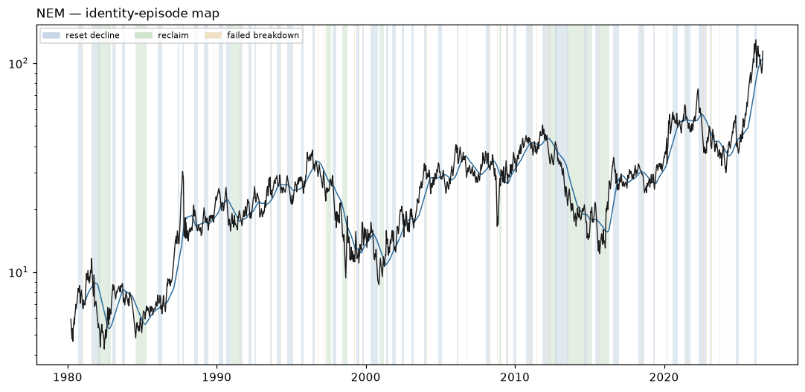

# NEM — Identity Atlas v0 dossier

Descriptive behavioral read. **Zero authority**: nothing on this page ranks, sizes, gates, originates a signal, or escalates. No expert content exists in W1 by law. Episode *resolutions* use future data by design — they are a research-time labeling instrument, never a live surface.

## Identity

| field | value |
|---|---|
| pilot role | miner neighborhood probe + disagreement set |
| price plane | `stocks_tr_v1` |
| first print | 1980-03-17 |
| last print | 2026-08-13 |
| sessions | 11697 |
| `open` available | False |
| sector stratum | Materials |
| cap stratum | adv3 (dollar-ADV tercile **proxy** — no per-name cap store is tracked) |
| vol stratum | vol2 |
| epoch key | `epoch_0` (listing-to-date; epoch detector: none/provisional) |
| tape ended | False |
| terminated reason | right_censored_at_asof (tape active through asof) |

**Survivor-only cohort:** the allowed price planes retain no ceased tapes; no dead name could be included (registration §2). Any cohort comparison this name appears in is a comparison among survivors and cannot name who is missing.

### Ticker-identity hygiene (§9.6)

No reused-ticker, rename, fixup, or delisting flag on this symbol.

**First-print sanity:** `PREDATES_CALENDAR` — first print 1980-03-17 predates the deal calendar's earliest priced date (2024-12-03)

## Behavioral fingerprint v0 (snapshot at asof)

Percentiles are PIT ranks against the contemporaneous evaluated universe. `—` is a coverage mask (the value is unavailable, which is not a low rank). `unstable` marks an adjacent-window quartile jump: the windows disagree, so the number is reported flagged rather than averaged into a clean-looking one.

### Metric block

The only block any future distance or map may read. Label-free by construction: no sector, industry, cap bucket, plane, or basket member here, and no gap-family member (the gap family is structurally unavailable on the open-less curated plane, so the plane law excludes it from this block universe-wide).

| feature | family | raw | universe pct | covered | unstable |
|---|---|---:|---:|:--:|:--:|
| `f1_kaufman_er_63` | F1 | 0.0291 | 13.7 | yes |  |
| `f1_kaufman_er_126` | F1 | 0.0294 | 20.3 | yes | **unstable** |
| `f1_kaufman_er_252` | F1 | 0.0775 | 59.4 | yes | **unstable** |
| `f1_logprice_r2_126` | F1 | 0.4509 | 50.8 | yes |  |
| `f1_logprice_r2_252` | F1 | 0.3591 | 37.7 | yes |  |
| `f1_share_above_50dma_252` | F1 | 0.6151 | 59.9 | yes |  |
| `f1_share_above_200dma_252` | F1 | 0.8532 | 71.5 | yes |  |
| `f1_new_high_cadence_252` | F1 | 0.1508 | 93.7 | yes |  |
| `f1_new_high_cadence_756` | F1 | 0.0992 | 92.6 | yes |  |
| `f2_drawdown_median_756` | F2 | 0.0165 | 16.5 | yes |  |
| `f2_drawdown_p90_756` | F2 | 0.0851 | 17.3 | yes |  |
| `f2_resets_per_year_15pct` | F2 | 1.3333 | 80.7 | yes |  |
| `f2_resets_per_year_30pct` | F2 | 0.3333 | 64.1 | yes |  |
| `f2_time_under_water_median_756` | F2 | 4.0000 | 21.5 | yes |  |
| `f2_ulcer_126` | F2 | 19.6253 | 55.5 | yes |  |
| `f2_ulcer_252` | F2 | 14.9637 | 34.2 | yes |  |
| `f3_post_trough_63d_atr_median` | F3 | 4.6523 | 58.5 | yes |  |
| `f3_time_to_50pct_retrace_median` | F3 | 21.5000 | 43.1 | yes |  |
| `f4_ar1_daily_252` | F4 | -0.0255 | 52.7 | yes |  |
| `f4_ar1_weekly_756` | F4 | -0.1543 | 7.8 | yes |  |
| `f4_variance_ratio_k5_756` | F4 | 1.0451 | 84.0 | yes |  |
| `f4_variance_ratio_k20_756` | F4 | 0.8200 | 37.8 | yes |  |
| `f4_mr_half_life_252` | F4 | 24.7905 | 28.2 | yes |  |
| `f4_oscillator_dwell_extreme_252` | F4 | 8.2857 | 97.6 | yes |  |
| `f5_realized_vol_21` | F5 | 48.1436 | 53.2 | yes |  |
| `f5_realized_vol_63` | F5 | 48.5218 | 52.7 | yes |  |
| `f5_realized_vol_252` | F5 | 48.6719 | 52.7 | yes |  |
| `f5_vol_of_vol_252` | F5 | 13.2102 | 49.9 | yes |  |
| `f5_acf_abs_ret_1_252` | F5 | 0.0339 | 30.9 | yes |  |
| `f5_natr_regime_spread_252` | F5 | 1.2102 | 60.7 | yes |  |
| `f7_atr_dist_20dma_252` | F7 | 0.6826 | 90.8 | yes |  |
| `f7_atr_dist_50dma_252` | F7 | 1.5135 | 87.9 | yes |  |
| `f7_atr_dist_200dma_252` | F7 | 6.2688 | 95.1 | yes |  |
| `f7_cross_freq_50dma_252` | F7 | 0.0794 | 61.3 | yes |  |
| `f7_cross_freq_200dma_252` | F7 | 0.0159 | 31.6 | yes |  |
| `f7_dwell_run_above_50dma_252` | F7 | 14.0909 | 48.3 | yes |  |
| `f7_dwell_run_above_200dma_252` | F7 | 71.6667 | 75.3 | yes |  |
| `f7_bounce_rate_50dma_756` | F7 | 0.6364 | 77.7 | yes |  |
| `f8_detrended_acf_peak_1260` | F8 | 0.4314 | 91.1 | yes |  |
| `f8_detrended_acf_peak_lag_1260` | F8 | 126.0000 | 30.9 | yes |  |
| `f8_detrended_acf_peak_sharpness_1260` | F8 | 2.6030 | 74.5 | yes |  |
| `f8_swing_period_median_756` | F8 | 32.0000 | 44.7 | yes |  |
| `f8_swing_period_median_1260` | F8 | 36.5000 | 51.1 | yes |  |
| `f9_beta_univ_ew_252` | F9 | 1.0026 | 58.2 | yes | **unstable** |
| `f9_beta_univ_ew_756` | F9 | 0.6398 | 21.8 | yes | **unstable** |
| `f9_idio_share_252` | F9 | 0.8627 | 46.1 | yes |  |
| `f9_idio_share_756` | F9 | 0.8981 | 74.4 | yes |  |
| `f10_dollar_adv_63` | F10 | 7.818e+08 | 95.1 | yes |  |
| `f10_dollar_adv_252` | F10 | 8.464e+08 | 95.9 | yes |  |
| `f10_turnover_proxy_252` | F10 | 0.8062 | 21.4 | yes |  |
| `f10_amihud_252` | F10 | 0.0000 | 5.9 | yes |  |
| `f10_cs_spread_252` | F10 | 0.0064 | 23.5 | yes |  |

### Diagnostic block

Census and baseline use only — never a distance input, never a map input.

| feature | raw | universe pct | covered |
|---|---:|---:|:--:|
| `d_sector` | — | — | no |
| `d_industry` | UNKNOWN | — | yes |
| `d_cap_bucket` | — | — | no |
| `d_market_cap_b` | — | — | no |
| `d_price_plane_id` | stocks_tr_v1 | — | yes |
| `d_listing_venue_class` | — | — | no |
| `d_f6_gap_share_252` | — | — | no |
| `d_f6_event_gap_contrib_252` | — | — | no |
| `d_f6_gap_fill_rate_252` | — | — | no |
| `d_close_jump_freq_252` | 0.0317 | 68.3 | yes |
| `d_close_jump_drift5_252` | -0.6466 | 11.1 | yes |

## Identity-episode catalog

Built with no expert event anywhere in its construction. Censored episodes are kept: a decline that never prints a durable low is the case that would otherwise silently disappear from every downstream count.

| type | tier | start | anchor | end | depth % | depth ATR | sessions | resolution | censored |
|---|---:|---|---|---|---:|---:|---:|---|:--:|
| reset_decline | 2 | 1980-09-22 | 1981-01-12 | 1981-01-12 | 28.0 | 11.79 | 76 | durable_low | no |
| failed_breakdown | 3 | 1980-12-29 | 1980-12-30 | 1981-01-05 | 4.7 | 1.60 | 4 | recovered | no |
| failed_breakdown | 3 | 1981-01-08 | 1981-01-12 | 1981-01-19 | 3.9 | 1.11 | 7 | recovered | no |
| failed_breakdown | 3 | 1981-06-22 | 1981-06-22 | 1981-06-23 | 0.4 | 0.16 | 1 | recovered | no |
| reset_decline | 1 | 1981-08-14 | 1982-03-12 | 1982-03-12 | 62.3 | 23.42 | 145 | durable_low | no |
| failed_breakdown | 3 | 1981-09-04 | 1981-09-08 | 1981-09-10 | 6.3 | 1.56 | 3 | recovered | no |
| failed_breakdown | 3 | 1981-09-25 | 1981-09-28 | 1981-10-01 | 4.9 | 1.06 | 4 | recovered | no |
| failed_breakdown | 3 | 1981-11-09 | 1981-11-09 | 1981-11-10 | 0.3 | 0.06 | 1 | recovered | no |
| reclaim | 1 | 1981-12-30 | 1982-08-20 | 1982-11-18 | 44.7 | 37.58 | 162 | held | no |
| failed_breakdown | 3 | 1982-01-18 | 1982-01-19 | 1982-01-28 | 4.1 | 1.49 | 8 | recovered | no |
| failed_breakdown | 3 | 1982-02-09 | 1982-02-09 | 1982-02-10 | 0.7 | 0.25 | 1 | recovered | no |
| reset_decline | 3 | 1982-09-10 | 1982-09-30 | 1982-09-30 | 20.1 | 7.99 | 14 | durable_low | no |
| reset_decline | 2 | 1983-01-10 | 1983-03-23 | 1983-03-23 | 20.2 | 7.52 | 51 | durable_low | no |
| failed_breakdown | 3 | 1983-03-17 | 1983-03-23 | 1983-03-31 | 2.5 | 0.84 | 10 | recovered | no |
| failed_breakdown | 3 | 1983-06-29 | 1983-06-30 | 1983-07-01 | 1.2 | 0.52 | 2 | recovered | no |
| reset_decline | 2 | 1983-08-29 | 1983-11-07 | 1983-11-07 | 24.2 | 13.76 | 49 | durable_low | no |
| failed_breakdown | 3 | 1983-11-01 | 1983-11-01 | 1983-11-02 | 0.3 | 0.09 | 1 | recovered | no |
| failed_breakdown | 3 | 1983-11-03 | 1983-11-03 | 1983-11-04 | 0.3 | 0.09 | 1 | recovered | no |
| failed_breakdown | 3 | 1983-11-07 | 1983-11-07 | 1983-11-08 | 0.8 | 0.29 | 1 | recovered | no |
| failed_breakdown | 3 | 1984-02-13 | 1984-02-13 | 1984-02-14 | 0.3 | 0.12 | 1 | recovered | no |
| failed_breakdown | 3 | 1984-07-23 | 1984-07-26 | 1984-08-02 | 4.5 | 1.45 | 8 | recovered | no |
| reclaim | 1 | 1984-08-02 | 1985-01-18 | 1985-04-19 | 44.1 | 27.29 | 117 | held | no |
| failed_breakdown | 3 | 1984-12-20 | 1984-12-21 | 1984-12-24 | 1.4 | 0.78 | 2 | recovered | no |
| failed_breakdown | 3 | 1985-06-27 | 1985-07-03 | 1985-07-09 | 4.5 | 3.20 | 7 | recovered | no |
| reset_decline | 2 | 1986-01-16 | 1986-05-01 | 1986-05-01 | 20.8 | 11.57 | 73 | durable_low | no |
| failed_breakdown | 3 | 1986-04-23 | 1986-04-24 | 1986-04-25 | 0.6 | 0.25 | 2 | recovered | no |
| failed_breakdown | 3 | 1986-04-30 | 1986-05-01 | 1986-05-12 | 5.9 | 3.01 | 8 | recovered | no |
| reset_decline | 3 | 1987-05-19 | 1987-06-22 | 1987-06-22 | 18.3 | 5.61 | 23 | durable_low | no |
| failed_breakdown | 3 | 1987-06-22 | 1987-06-22 | 1987-06-23 | 0.6 | 0.19 | 1 | recovered | no |
| reset_decline | 3 | 1987-09-18 | 1987-10-20 | 1987-10-20 | 58.8 | 19.43 | 22 | durable_low | no |
| failed_breakdown | 3 | 1988-02-03 | 1988-02-04 | 1988-02-08 | 1.6 | 0.35 | 3 | recovered | no |
| reset_decline | 2 | 1988-06-21 | 1988-09-19 | 1988-09-19 | 27.9 | 11.55 | 62 | durable_low | no |
| failed_breakdown | 3 | 1988-09-19 | 1988-09-19 | 1988-09-21 | 2.5 | 1.02 | 2 | recovered | no |
| failed_breakdown | 3 | 1989-01-04 | 1989-01-04 | 1989-01-05 | 1.6 | 0.69 | 1 | recovered | no |
| reset_decline | 2 | 1989-02-22 | 1989-06-05 | 1989-06-05 | 25.4 | 8.01 | 71 | durable_low | no |
| failed_breakdown | 3 | 1989-06-05 | 1989-06-05 | 1989-06-06 | 0.4 | 0.11 | 1 | recovered | no |
| failed_breakdown | 3 | 1989-10-19 | 1989-10-23 | 1989-10-26 | 4.5 | 1.56 | 5 | recovered | no |
| reset_decline | 2 | 1990-02-21 | 1990-06-14 | 1990-06-14 | 24.5 | 9.47 | 79 | durable_low | no |
| failed_breakdown | 3 | 1990-03-27 | 1990-03-27 | 1990-03-29 | 1.6 | 0.52 | 2 | recovered | no |
| failed_breakdown | 3 | 1990-04-27 | 1990-04-27 | 1990-05-01 | 0.6 | 0.22 | 2 | recovered | no |
| failed_breakdown | 3 | 1990-06-08 | 1990-06-08 | 1990-06-11 | 0.3 | 0.11 | 1 | recovered | no |
| failed_breakdown | 3 | 1990-06-14 | 1990-06-14 | 1990-06-15 | 2.4 | 1.02 | 1 | recovered | no |
| reset_decline | 1 | 1990-08-16 | 1990-12-06 | 1990-12-06 | 39.6 | 16.83 | 78 | durable_low | no |
| failed_breakdown | 3 | 1990-09-19 | 1990-09-20 | 1990-09-21 | 0.3 | 0.11 | 2 | recovered | no |
| failed_breakdown | 3 | 1990-10-15 | 1990-10-16 | 1990-10-19 | 2.1 | 0.60 | 4 | recovered | no |
| failed_breakdown | 3 | 1990-12-03 | 1990-12-03 | 1990-12-04 | 0.3 | 0.13 | 1 | recovered | no |
| failed_breakdown | 3 | 1990-12-05 | 1990-12-06 | 1990-12-17 | 5.4 | 2.37 | 8 | recovered | no |
| reclaim | 1 | 1990-12-11 | 1991-06-06 | 1991-08-06 | 38.7 | 23.37 | 122 | failed | no |
| failed_breakdown | 3 | 1991-04-29 | 1991-04-29 | 1991-04-30 | 0.4 | 0.17 | 1 | recovered | no |
| failed_breakdown | 3 | 1991-05-22 | 1991-05-23 | 1991-05-28 | 2.9 | 1.66 | 3 | recovered | no |
| reset_decline | 3 | 1991-07-08 | 1991-09-13 | 1991-09-13 | 16.7 | 8.45 | 48 | durable_low | no |
| failed_breakdown | 3 | 1991-08-22 | 1991-08-23 | 1991-08-26 | 1.0 | 0.46 | 2 | recovered | no |
| failed_breakdown | 3 | 1991-08-30 | 1991-08-30 | 1991-09-03 | 0.4 | 0.18 | 1 | recovered | no |
| failed_breakdown | 3 | 1991-09-11 | 1991-09-13 | 1991-09-18 | 2.1 | 1.18 | 5 | recovered | no |
| reset_decline | 2 | 1992-02-12 | 1992-04-29 | 1992-04-29 | 23.3 | 11.13 | 53 | durable_low | no |
| failed_breakdown | 3 | 1992-03-18 | 1992-03-18 | 1992-03-19 | 0.7 | 0.26 | 1 | recovered | no |
| failed_breakdown | 3 | 1992-03-30 | 1992-03-30 | 1992-03-31 | 0.7 | 0.29 | 1 | recovered | no |
| failed_breakdown | 3 | 1992-04-08 | 1992-04-08 | 1992-04-09 | 1.3 | 0.63 | 1 | recovered | no |
| failed_breakdown | 3 | 1992-04-20 | 1992-04-20 | 1992-04-21 | 1.0 | 0.41 | 1 | recovered | no |
| failed_breakdown | 3 | 1992-04-29 | 1992-04-29 | 1992-04-30 | 1.4 | 0.57 | 1 | recovered | no |
| reset_decline | 3 | 1992-07-17 | 1992-08-13 | 1992-08-13 | 17.9 | 9.30 | 19 | durable_low | no |
| failed_breakdown | 3 | 1992-11-24 | 1992-11-24 | 1992-11-25 | 0.3 | 0.12 | 1 | recovered | no |
| reset_decline | 3 | 1993-08-02 | 1993-09-13 | 1993-09-13 | 23.8 | 9.38 | 29 | durable_low | no |
| failed_breakdown | 3 | 1993-09-07 | 1993-09-07 | 1993-09-09 | 2.9 | 1.02 | 2 | recovered | no |
| failed_breakdown | 3 | 1993-09-13 | 1993-09-13 | 1993-09-15 | 1.1 | 0.37 | 2 | recovered | no |
| reset_decline | 3 | 1994-01-04 | 1994-04-20 | 1994-04-20 | 19.5 | 10.81 | 74 | durable_low | no |
| failed_breakdown | 3 | 1994-02-08 | 1994-02-08 | 1994-02-09 | 0.5 | 0.18 | 1 | recovered | no |
| failed_breakdown | 3 | 1994-03-07 | 1994-03-07 | 1994-03-08 | 0.4 | 0.20 | 1 | recovered | no |
| failed_breakdown | 3 | 1994-04-15 | 1994-04-20 | 1994-04-28 | 6.6 | 2.82 | 8 | recovered | no |
| reset_decline | 2 | 1994-09-27 | 1995-02-07 | 1995-02-07 | 28.4 | 14.66 | 92 | durable_low | no |
| failed_breakdown | 3 | 1994-11-14 | 1994-11-15 | 1994-11-16 | 0.9 | 0.48 | 2 | recovered | no |
| failed_breakdown | 3 | 1994-12-08 | 1994-12-08 | 1994-12-12 | 2.1 | 0.90 | 2 | recovered | no |
| failed_breakdown | 3 | 1994-12-16 | 1994-12-16 | 1994-12-19 | 1.1 | 0.44 | 1 | recovered | no |
| failed_breakdown | 3 | 1994-12-22 | 1994-12-22 | 1994-12-28 | 1.4 | 0.60 | 3 | recovered | no |
| failed_breakdown | 3 | 1995-01-04 | 1995-01-04 | 1995-01-09 | 1.0 | 0.41 | 3 | recovered | no |
| failed_breakdown | 3 | 1995-02-07 | 1995-02-07 | 1995-02-08 | 0.9 | 0.38 | 1 | recovered | no |
| reset_decline | 3 | 1995-09-12 | 1995-10-27 | 1995-10-27 | 17.5 | 10.40 | 33 | durable_low | no |
| failed_breakdown | 3 | 1995-10-02 | 1995-10-03 | 1995-10-09 | 1.8 | 1.00 | 5 | recovered | no |
| failed_breakdown | 3 | 1995-10-27 | 1995-10-27 | 1995-11-01 | 1.0 | 0.39 | 3 | recovered | no |
| reset_decline | 2 | 1996-05-31 | 1996-07-30 | 1996-07-30 | 23.5 | 12.17 | 41 | durable_low | no |
| failed_breakdown | 3 | 1996-06-21 | 1996-06-21 | 1996-06-24 | 0.3 | 0.09 | 1 | recovered | no |
| failed_breakdown | 3 | 1996-06-26 | 1996-06-26 | 1996-07-01 | 1.0 | 0.36 | 3 | recovered | no |
| failed_breakdown | 3 | 1996-10-17 | 1996-10-18 | 1996-10-22 | 2.4 | 1.06 | 3 | recovered | no |
| failed_breakdown | 3 | 1996-12-18 | 1996-12-18 | 1996-12-20 | 0.9 | 0.30 | 2 | recovered | no |
| failed_breakdown | 3 | 1997-02-06 | 1997-02-06 | 1997-02-07 | 1.3 | 0.50 | 1 | recovered | no |
| failed_breakdown | 3 | 1997-03-31 | 1997-03-31 | 1997-04-01 | 0.0 | 0.01 | 1 | recovered | no |
| failed_breakdown | 3 | 1997-04-07 | 1997-04-07 | 1997-04-08 | 1.0 | 0.39 | 1 | recovered | no |
| failed_breakdown | 3 | 1997-04-09 | 1997-04-09 | 1997-04-10 | 0.3 | 0.14 | 1 | recovered | no |
| reclaim | 1 | 1997-04-21 | 1997-08-06 | 1997-09-11 | 43.5 | 24.10 | 75 | failed | no |
| reset_decline | 1 | 1997-10-08 | 1998-01-12 | 1998-01-12 | 47.0 | 22.86 | 65 | durable_low | no |
| failed_breakdown | 3 | 1997-11-28 | 1997-11-28 | 1997-12-01 | 0.6 | 0.14 | 1 | recovered | no |
| failed_breakdown | 3 | 1998-01-08 | 1998-01-12 | 1998-01-16 | 11.6 | 2.79 | 6 | recovered | no |
| reclaim | 1 | 1998-06-05 | 1998-10-01 | 1998-10-12 | 44.8 | 18.97 | 82 | failed | no |
| failed_breakdown | 3 | 1998-07-10 | 1998-07-10 | 1998-07-14 | 1.1 | 0.28 | 2 | recovered | no |
| failed_breakdown | 3 | 1998-08-11 | 1998-08-12 | 1998-08-20 | 7.3 | 1.62 | 7 | recovered | no |
| failed_breakdown | 3 | 1998-08-26 | 1998-08-31 | 1998-09-03 | 17.4 | 3.83 | 6 | recovered | no |
| failed_breakdown | 3 | 1998-12-04 | 1998-12-04 | 1998-12-07 | 2.7 | 0.37 | 1 | recovered | no |
| failed_breakdown | 3 | 1998-12-21 | 1998-12-22 | 1998-12-29 | 5.5 | 0.77 | 5 | recovered | no |
| failed_breakdown | 3 | 1999-03-29 | 1999-03-30 | 1999-03-31 | 3.1 | 0.71 | 2 | recovered | no |
| reset_decline | 2 | 1999-05-06 | 1999-07-19 | 1999-07-19 | 36.8 | 7.99 | 50 | durable_low | no |
| failed_breakdown | 3 | 1999-07-15 | 1999-07-19 | 1999-07-21 | 5.4 | 1.23 | 4 | recovered | no |
| reset_decline | 3 | 1999-10-04 | 1999-11-05 | 1999-11-05 | 30.9 | 6.97 | 24 | durable_low | no |
| failed_breakdown | 3 | 2000-01-24 | 2000-01-25 | 2000-01-27 | 5.7 | 1.18 | 3 | recovered | no |
| reset_decline | 1 | 2000-05-04 | 2000-10-25 | 2000-10-25 | 53.0 | 11.63 | 121 | durable_low | no |
| failed_breakdown | 3 | 2000-06-26 | 2000-06-26 | 2000-06-27 | 0.2 | 0.03 | 1 | recovered | no |
| failed_breakdown | 3 | 2000-06-29 | 2000-06-29 | 2000-06-30 | 0.3 | 0.06 | 1 | recovered | no |
| failed_breakdown | 3 | 2000-09-20 | 2000-09-20 | 2000-09-21 | 2.4 | 0.63 | 1 | recovered | no |
| failed_breakdown | 3 | 2000-09-26 | 2000-09-26 | 2000-09-27 | 1.5 | 0.38 | 1 | recovered | no |
| reclaim | 1 | 2000-11-29 | 2001-03-08 | 2001-03-15 | 44.9 | 17.96 | 67 | failed | no |
| reset_decline | 3 | 2001-05-21 | 2001-07-06 | 2001-07-06 | 24.0 | 5.82 | 32 | durable_low | no |
| reset_decline | 2 | 2001-10-01 | 2002-01-08 | 2002-01-08 | 24.6 | 5.82 | 68 | durable_low | no |
| failed_breakdown | 3 | 2001-12-11 | 2001-12-11 | 2001-12-12 | 0.2 | 0.04 | 1 | recovered | no |
| failed_breakdown | 3 | 2002-01-04 | 2002-01-04 | 2002-01-07 | 0.4 | 0.15 | 1 | recovered | no |
| failed_breakdown | 3 | 2002-01-08 | 2002-01-08 | 2002-01-09 | 0.6 | 0.23 | 1 | recovered | no |
| reset_decline | 2 | 2002-05-28 | 2002-07-26 | 2002-07-26 | 30.5 | 9.07 | 42 | durable_low | no |
| failed_breakdown | 3 | 2002-06-27 | 2002-06-28 | 2002-07-01 | 2.5 | 0.54 | 2 | recovered | no |
| failed_breakdown | 3 | 2002-07-02 | 2002-07-05 | 2002-07-08 | 3.4 | 0.73 | 3 | recovered | no |
| failed_breakdown | 3 | 2002-07-23 | 2002-07-26 | 2002-08-02 | 12.7 | 2.47 | 8 | recovered | no |
| reset_decline | 3 | 2003-01-24 | 2003-03-21 | 2003-03-21 | 19.1 | 5.36 | 39 | durable_low | no |
| reset_decline | 3 | 2003-12-02 | 2004-01-29 | 2004-01-29 | 17.7 | 6.98 | 39 | durable_low | no |
| failed_breakdown | 3 | 2004-01-26 | 2004-01-26 | 2004-01-27 | 0.9 | 0.24 | 1 | recovered | no |
| failed_breakdown | 3 | 2004-01-28 | 2004-01-29 | 2004-02-02 | 1.6 | 0.41 | 3 | recovered | no |
| failed_breakdown | 3 | 2004-05-07 | 2004-05-07 | 2004-05-18 | 5.3 | 1.55 | 7 | recovered | no |
| reset_decline | 3 | 2004-11-12 | 2005-02-08 | 2005-02-08 | 18.5 | 7.88 | 59 | durable_low | no |
| failed_breakdown | 3 | 2005-02-01 | 2005-02-01 | 2005-02-02 | 0.1 | 0.07 | 1 | recovered | no |
| failed_breakdown | 3 | 2005-02-03 | 2005-02-08 | 2005-02-11 | 2.5 | 1.29 | 6 | recovered | no |
| failed_breakdown | 3 | 2005-04-14 | 2005-04-15 | 2005-04-18 | 1.3 | 0.64 | 2 | recovered | no |
| reset_decline | 3 | 2006-02-01 | 2006-03-09 | 2006-03-09 | 22.7 | 8.60 | 25 | durable_low | no |
| failed_breakdown | 3 | 2006-03-09 | 2006-03-09 | 2006-03-14 | 2.7 | 0.68 | 3 | recovered | no |
| failed_breakdown | 3 | 2006-06-13 | 2006-06-13 | 2006-06-14 | 0.6 | 0.15 | 1 | recovered | no |
| failed_breakdown | 3 | 2006-09-25 | 2006-09-25 | 2006-09-26 | 0.3 | 0.08 | 1 | recovered | no |
| failed_breakdown | 3 | 2006-09-29 | 2006-09-29 | 2006-10-02 | 0.8 | 0.24 | 1 | recovered | no |
| failed_breakdown | 3 | 2006-10-03 | 2006-10-04 | 2006-10-13 | 4.5 | 1.44 | 8 | recovered | no |
| failed_breakdown | 3 | 2007-03-13 | 2007-03-13 | 2007-03-16 | 2.0 | 0.77 | 3 | recovered | no |
| failed_breakdown | 3 | 2007-05-01 | 2007-05-01 | 2007-05-02 | 0.2 | 0.10 | 1 | recovered | no |
| failed_breakdown | 3 | 2007-06-26 | 2007-06-26 | 2007-06-27 | 0.4 | 0.17 | 1 | recovered | no |
| reset_decline | 2 | 2008-01-14 | 2008-04-29 | 2008-04-29 | 23.5 | 6.77 | 73 | durable_low | no |
| failed_breakdown | 3 | 2008-04-22 | 2008-04-29 | 2008-05-05 | 4.2 | 1.17 | 9 | recovered | no |
| failed_breakdown | 3 | 2008-09-03 | 2008-09-09 | 2008-09-17 | 11.3 | 2.82 | 10 | recovered | no |
| failed_breakdown | 3 | 2008-10-02 | 2008-10-07 | 2008-10-08 | 11.5 | 1.80 | 4 | recovered | no |
| failed_breakdown | 3 | 2008-10-27 | 2008-10-27 | 2008-10-28 | 7.6 | 0.54 | 1 | recovered | no |
| reclaim | 3 | 2008-12-08 | 2009-01-21 | 2009-01-28 | 43.6 | 8.41 | 29 | failed | no |
| reset_decline | 3 | 2009-05-29 | 2009-07-10 | 2009-07-10 | 22.3 | 5.61 | 29 | durable_low | no |
| failed_breakdown | 3 | 2009-07-08 | 2009-07-10 | 2009-07-13 | 0.5 | 0.11 | 3 | recovered | no |
| reset_decline | 2 | 2009-12-02 | 2010-01-29 | 2010-01-29 | 23.1 | 7.11 | 39 | durable_low | no |
| failed_breakdown | 3 | 2010-01-29 | 2010-01-29 | 2010-02-01 | 1.4 | 0.41 | 1 | recovered | no |
| reset_decline | 2 | 2010-09-22 | 2011-03-16 | 2011-03-16 | 22.0 | 9.11 | 121 | durable_low | no |
| failed_breakdown | 3 | 2010-11-29 | 2010-11-29 | 2010-11-30 | 0.5 | 0.18 | 1 | recovered | no |
| failed_breakdown | 3 | 2011-01-06 | 2011-01-07 | 2011-01-11 | 1.8 | 0.77 | 3 | recovered | no |
| failed_breakdown | 3 | 2011-01-13 | 2011-01-24 | 2011-01-26 | 3.0 | 1.26 | 8 | recovered | no |
| failed_breakdown | 3 | 2011-01-28 | 2011-01-28 | 2011-02-01 | 0.3 | 0.12 | 2 | recovered | no |
| failed_breakdown | 3 | 2011-02-24 | 2011-02-25 | 2011-02-28 | 1.0 | 0.39 | 2 | recovered | no |
| failed_breakdown | 3 | 2011-06-16 | 2011-06-17 | 2011-06-20 | 0.2 | 0.08 | 2 | recovered | no |
| reset_decline | 1 | 2011-11-07 | 2012-05-15 | 2012-05-15 | 39.1 | 11.08 | 130 | durable_low | no |
| failed_breakdown | 3 | 2011-12-28 | 2011-12-28 | 2012-01-03 | 2.5 | 0.85 | 3 | recovered | no |
| failed_breakdown | 3 | 2012-01-20 | 2012-01-24 | 2012-01-25 | 3.3 | 1.14 | 3 | recovered | no |
| failed_breakdown | 3 | 2012-04-05 | 2012-04-05 | 2012-04-10 | 1.6 | 0.54 | 2 | recovered | no |
| failed_breakdown | 3 | 2012-04-20 | 2012-04-23 | 2012-04-26 | 3.0 | 1.10 | 4 | recovered | no |
| failed_breakdown | 3 | 2012-05-03 | 2012-05-08 | 2012-05-09 | 3.3 | 1.24 | 4 | recovered | no |
| reclaim | 1 | 2012-05-11 | 2012-09-12 | 2012-11-02 | 39.1 | 19.41 | 85 | failed | no |
| failed_breakdown | 3 | 2012-05-14 | 2012-05-15 | 2012-05-17 | 3.1 | 0.97 | 3 | recovered | no |
| reset_decline | 1 | 2012-09-14 | 2013-08-07 | 2013-08-07 | 52.3 | 21.93 | 223 | durable_low | no |
| failed_breakdown | 3 | 2012-11-14 | 2012-11-15 | 2012-11-21 | 2.8 | 0.97 | 5 | recovered | no |
| failed_breakdown | 3 | 2012-12-04 | 2012-12-05 | 2012-12-11 | 2.7 | 1.02 | 5 | recovered | no |
| failed_breakdown | 3 | 2012-12-19 | 2012-12-19 | 2012-12-20 | 0.5 | 0.20 | 1 | recovered | no |
| failed_breakdown | 3 | 2013-01-25 | 2013-01-28 | 2013-02-04 | 2.1 | 0.92 | 6 | recovered | no |
| failed_breakdown | 3 | 2013-05-15 | 2013-05-17 | 2013-05-29 | 5.3 | 1.49 | 9 | recovered | no |
| reclaim | 1 | 2013-06-18 | 2014-06-20 | 2014-09-19 | 42.6 | 23.07 | 254 | failed | no |
| failed_breakdown | 3 | 2013-07-08 | 2013-07-10 | 2013-07-11 | 2.2 | 0.44 | 3 | recovered | no |
| failed_breakdown | 3 | 2013-08-07 | 2013-08-07 | 2013-08-08 | 0.5 | 0.10 | 1 | recovered | no |
| failed_breakdown | 3 | 2013-10-11 | 2013-10-11 | 2013-10-17 | 2.5 | 0.66 | 4 | recovered | no |
| failed_breakdown | 3 | 2013-12-19 | 2013-12-23 | 2013-12-24 | 2.3 | 0.73 | 3 | recovered | no |
| failed_breakdown | 3 | 2014-01-31 | 2014-02-05 | 2014-02-11 | 7.2 | 2.12 | 7 | recovered | no |
| failed_breakdown | 3 | 2014-05-27 | 2014-05-28 | 2014-06-05 | 2.0 | 0.80 | 7 | recovered | no |
| reset_decline | 2 | 2014-08-29 | 2014-12-16 | 2014-12-16 | 34.2 | 18.26 | 75 | durable_low | no |
| failed_breakdown | 3 | 2014-10-03 | 2014-10-03 | 2014-10-06 | 1.3 | 0.57 | 1 | recovered | no |
| failed_breakdown | 3 | 2014-10-07 | 2014-10-07 | 2014-10-08 | 0.7 | 0.27 | 1 | recovered | no |
| failed_breakdown | 3 | 2014-10-09 | 2014-10-10 | 2014-10-14 | 1.5 | 0.53 | 3 | recovered | no |
| reclaim | 3 | 2014-12-15 | 2015-01-20 | 2015-03-09 | 34.2 | 11.39 | 23 | failed | no |
| failed_breakdown | 3 | 2014-12-16 | 2014-12-16 | 2014-12-17 | 0.2 | 0.03 | 1 | recovered | no |
| reset_decline | 1 | 2015-05-15 | 2015-09-23 | 2015-09-23 | 43.7 | 17.24 | 90 | durable_low | no |
| failed_breakdown | 3 | 2015-07-31 | 2015-08-07 | 2015-08-12 | 6.3 | 1.43 | 8 | recovered | no |
| failed_breakdown | 3 | 2015-08-26 | 2015-08-26 | 2015-08-27 | 2.0 | 0.41 | 1 | recovered | no |
| failed_breakdown | 3 | 2015-09-04 | 2015-09-04 | 2015-09-08 | 0.7 | 0.14 | 1 | recovered | no |
| failed_breakdown | 3 | 2015-09-09 | 2015-09-10 | 2015-09-11 | 0.7 | 0.15 | 2 | recovered | no |
| reclaim | 1 | 2015-09-21 | 2016-02-01 | 2016-05-02 | 43.7 | 15.80 | 91 | held | no |
| failed_breakdown | 3 | 2015-09-23 | 2015-09-23 | 2015-09-24 | 0.1 | 0.01 | 1 | recovered | no |
| failed_breakdown | 3 | 2016-01-19 | 2016-01-19 | 2016-01-25 | 3.3 | 0.75 | 4 | recovered | no |
| reset_decline | 2 | 2016-08-02 | 2016-12-15 | 2016-12-15 | 32.5 | 11.11 | 95 | durable_low | no |
| failed_breakdown | 3 | 2016-11-11 | 2016-11-11 | 2016-11-15 | 6.7 | 1.49 | 2 | recovered | no |
| failed_breakdown | 3 | 2016-11-23 | 2016-11-23 | 2016-11-25 | 0.3 | 0.06 | 1 | recovered | no |
| failed_breakdown | 3 | 2016-12-15 | 2016-12-15 | 2016-12-16 | 1.7 | 0.38 | 1 | recovered | no |
| failed_breakdown | 3 | 2017-05-04 | 2017-05-04 | 2017-05-05 | 0.4 | 0.14 | 1 | recovered | no |
| failed_breakdown | 3 | 2017-06-29 | 2017-06-29 | 2017-06-30 | 0.0 | 0.00 | 1 | recovered | no |
| failed_breakdown | 3 | 2017-07-03 | 2017-07-03 | 2017-07-05 | 1.1 | 0.48 | 1 | recovered | no |
| failed_breakdown | 3 | 2017-11-10 | 2017-11-10 | 2017-11-13 | 0.5 | 0.24 | 1 | recovered | no |
| failed_breakdown | 3 | 2017-12-08 | 2017-12-12 | 2017-12-13 | 2.4 | 1.34 | 3 | recovered | no |
| reset_decline | 2 | 2018-04-19 | 2018-09-11 | 2018-09-11 | 29.1 | 13.32 | 100 | durable_low | no |
| failed_breakdown | 3 | 2018-06-20 | 2018-06-27 | 2018-07-05 | 3.0 | 1.82 | 10 | recovered | no |
| failed_breakdown | 3 | 2018-07-13 | 2018-07-16 | 2018-07-18 | 1.3 | 0.67 | 3 | recovered | no |
| failed_breakdown | 3 | 2018-08-16 | 2018-08-16 | 2018-08-17 | 0.6 | 0.24 | 1 | recovered | no |
| reset_decline | 3 | 2019-04-08 | 2019-05-09 | 2019-05-09 | 16.3 | 7.64 | 22 | durable_low | no |
| failed_breakdown | 3 | 2019-11-07 | 2019-11-08 | 2019-11-15 | 2.5 | 1.03 | 6 | recovered | no |
| reset_decline | 3 | 2020-03-06 | 2020-03-13 | 2020-03-13 | 24.5 | 7.01 | 5 | durable_low | no |
| failed_breakdown | 3 | 2020-03-13 | 2020-03-13 | 2020-03-16 | 2.1 | 0.32 | 1 | recovered | no |
| reset_decline | 3 | 2020-08-05 | 2020-11-24 | 2020-11-24 | 18.9 | 5.73 | 78 | durable_low | no |
| failed_breakdown | 3 | 2020-10-28 | 2020-10-28 | 2020-10-29 | 2.6 | 1.02 | 1 | recovered | no |
| failed_breakdown | 3 | 2020-11-24 | 2020-11-24 | 2020-11-30 | 3.0 | 0.90 | 3 | recovered | no |
| failed_breakdown | 3 | 2021-02-25 | 2021-02-26 | 2021-03-02 | 4.0 | 1.35 | 3 | recovered | no |
| reset_decline | 2 | 2021-05-18 | 2021-10-01 | 2021-10-01 | 26.8 | 10.72 | 95 | durable_low | no |
| failed_breakdown | 3 | 2021-07-16 | 2021-07-23 | 2021-07-28 | 2.8 | 1.30 | 8 | recovered | no |
| failed_breakdown | 3 | 2021-10-01 | 2021-10-01 | 2021-10-04 | 0.3 | 0.12 | 1 | recovered | no |
| failed_breakdown | 3 | 2021-12-02 | 2021-12-02 | 2021-12-03 | 0.5 | 0.21 | 1 | recovered | no |
| reset_decline | 1 | 2022-04-18 | 2022-11-03 | 2022-11-03 | 54.8 | 18.58 | 139 | durable_low | no |
| failed_breakdown | 3 | 2022-05-18 | 2022-05-18 | 2022-05-19 | 2.1 | 0.55 | 1 | recovered | no |
| failed_breakdown | 3 | 2022-06-14 | 2022-06-15 | 2022-06-16 | 1.1 | 0.31 | 2 | recovered | no |
| failed_breakdown | 3 | 2022-08-03 | 2022-08-03 | 2022-08-04 | 0.4 | 0.09 | 1 | recovered | no |
| failed_breakdown | 3 | 2022-08-19 | 2022-08-19 | 2022-08-23 | 2.0 | 0.56 | 2 | recovered | no |
| failed_breakdown | 3 | 2022-08-26 | 2022-09-01 | 2022-09-09 | 6.0 | 1.89 | 9 | recovered | no |
| failed_breakdown | 3 | 2022-09-27 | 2022-09-27 | 2022-09-28 | 0.2 | 0.07 | 1 | recovered | no |
| failed_breakdown | 3 | 2022-11-02 | 2022-11-03 | 2022-11-04 | 6.2 | 1.93 | 2 | recovered | no |
| reset_decline | 3 | 2023-01-25 | 2023-03-09 | 2023-03-09 | 23.5 | 7.57 | 30 | durable_low | no |
| failed_breakdown | 3 | 2023-02-24 | 2023-02-27 | 2023-03-01 | 1.1 | 0.31 | 3 | recovered | no |
| failed_breakdown | 3 | 2023-03-07 | 2023-03-09 | 2023-03-13 | 2.8 | 0.96 | 4 | recovered | no |
| failed_breakdown | 3 | 2023-05-25 | 2023-05-30 | 2023-06-01 | 3.2 | 1.07 | 4 | recovered | no |
| failed_breakdown | 3 | 2023-08-08 | 2023-08-08 | 2023-08-11 | 0.4 | 0.16 | 3 | recovered | no |
| failed_breakdown | 3 | 2023-09-27 | 2023-10-03 | 2023-10-10 | 6.9 | 3.08 | 9 | recovered | no |
| failed_breakdown | 3 | 2023-11-08 | 2023-11-09 | 2023-11-14 | 3.6 | 1.14 | 4 | recovered | no |
| failed_breakdown | 3 | 2024-02-05 | 2024-02-05 | 2024-02-06 | 0.8 | 0.26 | 1 | recovered | no |
| failed_breakdown | 3 | 2024-02-08 | 2024-02-09 | 2024-02-12 | 1.7 | 0.61 | 2 | recovered | no |
| failed_breakdown | 3 | 2024-02-13 | 2024-02-13 | 2024-02-15 | 2.3 | 0.82 | 2 | recovered | no |
| failed_breakdown | 3 | 2024-02-22 | 2024-02-27 | 2024-03-04 | 6.8 | 2.34 | 7 | recovered | no |
| reset_decline | 2 | 2024-10-22 | 2024-12-30 | 2024-12-30 | 36.6 | 17.48 | 47 | durable_low | no |
| reset_decline | 3 | 2025-10-16 | 2025-10-27 | 2025-10-27 | 20.0 | 7.39 | 7 | durable_low | no |
| reset_decline | 2 | 2026-01-28 | 2026-03-20 | 2026-03-20 | 27.2 | 9.19 | 36 | durable_low | no |
| failed_breakdown | 3 | 2026-03-19 | 2026-03-20 | 2026-03-25 | 3.8 | 0.72 | 4 | recovered | no |
| failed_breakdown | 3 | 2026-06-10 | 2026-06-10 | 2026-06-11 | 2.9 | 0.61 | 1 | recovered | no |
| failed_breakdown | 3 | 2026-07-16 | 2026-07-20 | 2026-07-22 | 3.8 | 0.94 | 4 | recovered | no |

**238 episodes**, 0 censored; by type {'failed_breakdown': 177, 'reset_decline': 50, 'reclaim': 11}; by tier {3: 199, 2: 22, 1: 17}.

## State shares by year

Eight mutually-exclusive bars-only states, first-match-wins precedence. Gap basis on this plane: `close_vs_prev_close` — a close-to-close proxy absorbs the whole session's move, not just the overnight jump, so cross-plane comparisons of the dislocation share carry that caveat.

| year | post event dislocation | deep washout | breakdown | recovery reclaim | controlled pullback | structural uptrend | vol transition | range |
|---:|---:|---:|---:|---:|---:|---:|---:|---:|
| 1980 | 10% | 0% | 0% | 0% | 0% | 0% | 0% | 90% |
| 1981 | 13% | 0% | 2% | 0% | 25% | 21% | 0% | 38% |
| 1982 | 7% | 58% | 0% | 35% | 0% | 0% | 0% | 0% |
| 1983 | 6% | 0% | 0% | 11% | 52% | 8% | 5% | 18% |
| 1984 | 14% | 4% | 7% | 0% | 4% | 0% | 20% | 52% |
| 1985 | 12% | 0% | 0% | 4% | 31% | 48% | 2% | 4% |
| 1986 | 11% | 0% | 0% | 0% | 23% | 46% | 3% | 17% |
| 1987 | 18% | 14% | 0% | 1% | 17% | 46% | 0% | 3% |
| 1988 | 6% | 44% | 0% | 23% | 0% | 0% | 5% | 22% |
| 1989 | 12% | 0% | 0% | 12% | 44% | 13% | 4% | 15% |
| 1990 | 8% | 0% | 4% | 0% | 19% | 24% | 15% | 30% |
| 1991 | 17% | 0% | 0% | 0% | 27% | 11% | 15% | 30% |
| 1992 | 9% | 0% | 0% | 0% | 37% | 26% | 14% | 14% |
| 1993 | 6% | 0% | 0% | 0% | 44% | 22% | 10% | 18% |
| 1994 | 0% | 0% | 0% | 0% | 26% | 15% | 7% | 52% |
| 1995 | 2% | 0% | 0% | 0% | 36% | 33% | 7% | 22% |
| 1996 | 4% | 0% | 0% | 0% | 28% | 27% | 15% | 26% |
| 1997 | 10% | 0% | 8% | 17% | 0% | 0% | 28% | 36% |
| 1998 | 10% | 42% | 10% | 4% | 0% | 0% | 0% | 35% |
| 1999 | 12% | 21% | 0% | 41% | 0% | 0% | 7% | 19% |
| 2000 | 4% | 13% | 6% | 4% | 34% | 0% | 4% | 36% |
| 2001 | 6% | 5% | 0% | 34% | 19% | 6% | 9% | 21% |
| 2002 | 2% | 0% | 0% | 0% | 44% | 29% | 4% | 21% |
| 2003 | 2% | 0% | 0% | 0% | 35% | 51% | 2% | 10% |
| 2004 | 2% | 0% | 0% | 0% | 53% | 13% | 9% | 23% |
| 2005 | 12% | 0% | 0% | 0% | 21% | 14% | 9% | 44% |
| 2006 | 4% | 0% | 0% | 0% | 40% | 9% | 15% | 32% |
| 2007 | 8% | 0% | 0% | 0% | 17% | 13% | 18% | 44% |
| 2008 | 2% | 13% | 6% | 0% | 25% | 8% | 4% | 42% |
| 2009 | 2% | 0% | 0% | 31% | 37% | 15% | 0% | 15% |
| 2010 | 0% | 0% | 0% | 0% | 50% | 47% | 0% | 3% |
| 2011 | 2% | 0% | 0% | 0% | 31% | 17% | 2% | 49% |
| 2012 | 4% | 0% | 3% | 12% | 12% | 0% | 20% | 49% |
| 2013 | 4% | 39% | 12% | 0% | 0% | 0% | 5% | 40% |
| 2014 | 4% | 6% | 2% | 16% | 10% | 0% | 21% | 41% |
| 2015 | 10% | 0% | 13% | 29% | 4% | 0% | 4% | 39% |
| 2016 | 6% | 0% | 0% | 15% | 23% | 35% | 4% | 17% |
| 2017 | 4% | 0% | 0% | 0% | 36% | 12% | 1% | 48% |
| 2018 | 6% | 0% | 0% | 0% | 22% | 23% | 2% | 47% |
| 2019 | 2% | 0% | 0% | 0% | 33% | 41% | 3% | 21% |
| 2020 | 6% | 0% | 0% | 0% | 47% | 40% | 2% | 6% |
| 2021 | 6% | 0% | 0% | 0% | 22% | 14% | 6% | 52% |
| 2022 | 6% | 32% | 0% | 0% | 28% | 14% | 4% | 16% |
| 2023 | 8% | 6% | 0% | 21% | 3% | 0% | 20% | 42% |
| 2024 | 6% | 0% | 0% | 0% | 17% | 39% | 22% | 15% |
| 2025 | 9% | 0% | 0% | 0% | 32% | 45% | 4% | 9% |
| 2026 | 3% | 0% | 0% | 0% | 54% | 19% | 1% | 23% |

## Episode map

Log price with the 200DMA, episode spans shaded by type, durable lows marked, and the daily state strip beneath. On histories longer than 5,000 sessions the two price LINES are drawn at weekly resolution for legibility and file size; spans, markers and the state strip stay daily.

---

Constants: `77e111c11672524c826948455a8c2ea5b812cdddb3f0d9dac1807b253604e9d0` · fingerprint spec: `0e3457b11f41452e1c3efac3858196f5f42b573d1961b798ea581e1590b33187` · partition: `a546c64983431f0afca01cfd9aacc230ef3bed875520c44898090520cf98164a` · asof 2026-08-13
