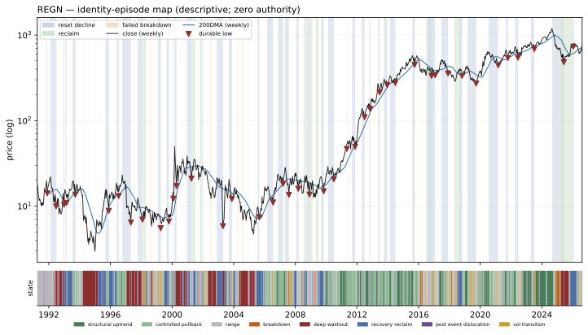

# REGN — Identity Atlas v0 dossier

Descriptive behavioral read. **Zero authority**: nothing on this page ranks, sizes, gates, originates a signal, or escalates. No expert content exists in W1 by law. Episode *resolutions* use future data by design — they are a research-time labeling instrument, never a live surface.

## Identity

| field | value |
|---|---|
| pilot role | operator core |
| price plane | `stocks_tr_v1` |
| first print | 1991-04-02 |
| last print | 2026-08-13 |
| sessions | 8906 |
| `open` available | False |
| sector stratum | Health Care |
| cap stratum | adv3 (dollar-ADV tercile **proxy** — no per-name cap store is tracked) |
| vol stratum | vol1 |
| epoch key | `epoch_0` (listing-to-date; epoch detector: none/provisional) |
| tape ended | False |
| terminated reason | right_censored_at_asof (tape active through asof) |

**Survivor-only cohort:** the allowed price planes retain no ceased tapes; no dead name could be included (registration §2). Any cohort comparison this name appears in is a comparison among survivors and cannot name who is missing.

### Ticker-identity hygiene (§9.6)

No reused-ticker, rename, fixup, or delisting flag on this symbol.

**First-print sanity:** `PREDATES_CALENDAR` — first print 1991-04-02 predates the deal calendar's earliest priced date (2024-12-03)

## Behavioral fingerprint v0 (snapshot at asof)

Percentiles are PIT ranks against the contemporaneous evaluated universe. `—` is a coverage mask (the value is unavailable, which is not a low rank). `unstable` marks an adjacent-window quartile jump: the windows disagree, so the number is reported flagged rather than averaged into a clean-looking one.

### Metric block

The only block any future distance or map may read. Label-free by construction: no sector, industry, cap bucket, plane, or basket member here, and no gap-family member (the gap family is structurally unavailable on the open-less curated plane, so the plane law excludes it from this block universe-wide).

| feature | family | raw | universe pct | covered | unstable |
|---|---|---:|---:|:--:|:--:|
| `f1_kaufman_er_63` | F1 | 0.1379 | 57.1 | yes | **unstable** |
| `f1_kaufman_er_126` | F1 | 0.0226 | 15.7 | yes | **unstable** |
| `f1_kaufman_er_252` | F1 | 0.0969 | 70.6 | yes | **unstable** |
| `f1_logprice_r2_126` | F1 | 0.2595 | 33.7 | yes |  |
| `f1_logprice_r2_252` | F1 | 0.1559 | 21.6 | yes |  |
| `f1_share_above_50dma_252` | F1 | 0.6071 | 58.2 | yes |  |
| `f1_share_above_200dma_252` | F1 | 0.5913 | 43.7 | yes |  |
| `f1_new_high_cadence_252` | F1 | 0.0079 | 26.6 | yes |  |
| `f1_new_high_cadence_756` | F1 | 0.0516 | 63.4 | yes |  |
| `f2_drawdown_median_756` | F2 | 0.0144 | 12.3 | yes |  |
| `f2_drawdown_p90_756` | F2 | 0.0516 | 8.4 | yes |  |
| `f2_resets_per_year_15pct` | F2 | 0.0000 | 7.7 | yes |  |
| `f2_resets_per_year_30pct` | F2 | 0.0000 | 24.4 | yes |  |
| `f2_time_under_water_median_756` | F2 | 4.0000 | 21.5 | yes |  |
| `f2_ulcer_126` | F2 | 14.5850 | 42.8 | yes |  |
| `f2_ulcer_252` | F2 | 24.9508 | 57.3 | yes |  |
| `f3_post_trough_63d_atr_median` | F3 | 5.7466 | 79.1 | yes |  |
| `f3_time_to_50pct_retrace_median` | F3 | 18.0000 | 27.9 | yes |  |
| `f4_ar1_daily_252` | F4 | -0.0373 | 47.1 | yes |  |
| `f4_ar1_weekly_756` | F4 | -0.0248 | 49.7 | yes |  |
| `f4_variance_ratio_k5_756` | F4 | 0.9837 | 64.2 | yes |  |
| `f4_variance_ratio_k20_756` | F4 | 0.9492 | 68.2 | yes |  |
| `f4_mr_half_life_252` | F4 | 38.0127 | 47.3 | yes |  |
| `f4_oscillator_dwell_extreme_252` | F4 | 5.0000 | 83.9 | yes |  |
| `f5_realized_vol_21` | F5 | 31.5664 | 26.5 | yes |  |
| `f5_realized_vol_63` | F5 | 35.8398 | 32.5 | yes |  |
| `f5_realized_vol_252` | F5 | 33.3134 | 29.1 | yes |  |
| `f5_vol_of_vol_252` | F5 | 6.7600 | 20.4 | yes |  |
| `f5_acf_abs_ret_1_252` | F5 | -0.0689 | 2.2 | yes |  |
| `f5_natr_regime_spread_252` | F5 | 0.3723 | 5.6 | yes |  |
| `f7_atr_dist_20dma_252` | F7 | 0.4177 | 69.5 | yes |  |
| `f7_atr_dist_50dma_252` | F7 | 0.7632 | 61.7 | yes |  |
| `f7_atr_dist_200dma_252` | F7 | 2.0069 | 56.3 | yes |  |
| `f7_cross_freq_50dma_252` | F7 | 0.1190 | 93.0 | yes |  |
| `f7_cross_freq_200dma_252` | F7 | 0.0119 | 25.4 | yes |  |
| `f7_dwell_run_above_50dma_252` | F7 | 9.5625 | 21.0 | yes |  |
| `f7_dwell_run_above_200dma_252` | F7 | 74.5000 | 76.4 | yes |  |
| `f7_bounce_rate_50dma_756` | F7 | 0.3684 | 20.5 | yes |  |
| `f8_detrended_acf_peak_1260` | F8 | 0.2999 | 65.7 | yes |  |
| `f8_detrended_acf_peak_lag_1260` | F8 | 126.0000 | 30.9 | yes |  |
| `f8_detrended_acf_peak_sharpness_1260` | F8 | 3.2691 | 95.0 | yes |  |
| `f8_swing_period_median_756` | F8 | 123.5000 | 94.8 | yes |  |
| `f8_swing_period_median_1260` | F8 | 58.0000 | 74.7 | yes |  |
| `f9_beta_univ_ew_252` | F9 | 0.3792 | 14.1 | yes |  |
| `f9_beta_univ_ew_756` | F9 | 0.4732 | 12.0 | yes |  |
| `f9_idio_share_252` | F9 | 0.9581 | 82.0 | yes |  |
| `f9_idio_share_756` | F9 | 0.9056 | 77.0 | yes |  |
| `f10_dollar_adv_63` | F10 | 6.193e+08 | 93.8 | yes |  |
| `f10_dollar_adv_252` | F10 | 5.746e+08 | 93.7 | yes |  |
| `f10_turnover_proxy_252` | F10 | 0.9065 | 34.9 | yes |  |
| `f10_amihud_252` | F10 | 0.0000 | 5.8 | yes |  |
| `f10_cs_spread_252` | F10 | 0.0060 | 18.5 | yes |  |

### Diagnostic block

Census and baseline use only — never a distance input, never a map input.

| feature | raw | universe pct | covered |
|---|---:|---:|:--:|
| `d_sector` | — | — | no |
| `d_industry` | UNKNOWN | — | yes |
| `d_cap_bucket` | — | — | no |
| `d_market_cap_b` | — | — | no |
| `d_price_plane_id` | stocks_tr_v1 | — | yes |
| `d_listing_venue_class` | — | — | no |
| `d_f6_gap_share_252` | — | — | no |
| `d_f6_event_gap_contrib_252` | — | — | no |
| `d_f6_gap_fill_rate_252` | — | — | no |
| `d_close_jump_freq_252` | 0.0238 | 33.0 | yes |
| `d_close_jump_drift5_252` | -0.0157 | 41.2 | yes |

## Identity-episode catalog

Built with no expert event anywhere in its construction. Censored episodes are kept: a decline that never prints a durable low is the case that would otherwise silently disappear from every downstream count.

| type | tier | start | anchor | end | depth % | depth ATR | sessions | resolution | censored |
|---|---:|---|---|---|---:|---:|---:|---|:--:|
| failed_breakdown | 3 | 1991-07-05 | 1991-07-05 | 1991-07-09 | 1.2 | 0.21 | 2 | recovered | no |
| failed_breakdown | 3 | 1991-07-25 | 1991-07-25 | 1991-07-26 | 3.7 | 0.66 | 1 | recovered | no |
| reset_decline | 3 | 1991-11-11 | 1991-11-26 | 1991-11-26 | 30.5 | 5.13 | 11 | durable_low | no |
| reset_decline | 1 | 1992-02-06 | 1992-06-22 | 1992-06-22 | 55.6 | 12.00 | 94 | durable_low | no |
| failed_breakdown | 3 | 1992-03-16 | 1992-03-16 | 1992-03-17 | 6.2 | 0.88 | 1 | recovered | no |
| failed_breakdown | 3 | 1992-03-30 | 1992-03-30 | 1992-03-31 | 3.3 | 0.51 | 1 | recovered | no |
| failed_breakdown | 3 | 1992-04-08 | 1992-04-08 | 1992-04-09 | 1.7 | 0.25 | 1 | recovered | no |
| failed_breakdown | 3 | 1992-05-15 | 1992-05-15 | 1992-05-18 | 2.2 | 0.26 | 1 | recovered | no |
| failed_breakdown | 3 | 1992-06-17 | 1992-06-22 | 1992-06-29 | 10.1 | 1.41 | 8 | recovered | no |
| failed_breakdown | 3 | 1992-10-08 | 1992-10-08 | 1992-10-09 | 1.5 | 0.21 | 1 | recovered | no |
| failed_breakdown | 3 | 1992-10-15 | 1992-10-15 | 1992-10-16 | 1.5 | 0.21 | 1 | recovered | no |
| reset_decline | 3 | 1992-12-08 | 1992-12-28 | 1992-12-28 | 26.3 | 5.31 | 13 | durable_low | no |
| reset_decline | 3 | 1993-02-01 | 1993-02-22 | 1993-02-22 | 33.3 | 5.46 | 14 | durable_low | no |
| reset_decline | 2 | 1993-07-19 | 1993-09-20 | 1993-09-20 | 36.0 | 9.65 | 44 | durable_low | no |
| failed_breakdown | 3 | 1993-08-24 | 1993-08-24 | 1993-08-26 | 1.6 | 0.25 | 2 | recovered | no |
| failed_breakdown | 3 | 1993-09-17 | 1993-09-20 | 1993-09-27 | 8.3 | 1.43 | 6 | recovered | no |
| failed_breakdown | 3 | 1994-03-02 | 1994-03-02 | 1994-03-07 | 5.5 | 1.54 | 3 | recovered | no |
| failed_breakdown | 3 | 1994-04-04 | 1994-04-04 | 1994-04-07 | 5.6 | 0.58 | 3 | recovered | no |
| failed_breakdown | 3 | 1994-05-16 | 1994-05-19 | 1994-05-20 | 5.9 | 0.69 | 4 | recovered | no |
| failed_breakdown | 3 | 1994-07-13 | 1994-07-13 | 1994-07-18 | 3.1 | 0.28 | 3 | recovered | no |
| failed_breakdown | 3 | 1994-08-01 | 1994-08-02 | 1994-08-03 | 8.1 | 0.82 | 2 | recovered | no |
| failed_breakdown | 3 | 1994-11-10 | 1994-11-10 | 1994-11-11 | 3.3 | 0.35 | 1 | recovered | no |
| failed_breakdown | 3 | 1994-12-30 | 1994-12-30 | 1995-01-03 | 4.0 | 0.38 | 1 | recovered | no |
| failed_breakdown | 3 | 1995-06-02 | 1995-06-02 | 1995-06-06 | 2.2 | 0.44 | 2 | recovered | no |
| reset_decline | 2 | 1995-09-06 | 1995-11-22 | 1995-11-22 | 46.2 | 10.89 | 55 | durable_low | no |
| failed_breakdown | 3 | 1995-11-22 | 1995-11-22 | 1995-11-27 | 11.3 | 1.93 | 2 | recovered | no |
| reset_decline | 3 | 1996-05-29 | 1996-07-15 | 1996-07-15 | 32.9 | 5.91 | 32 | durable_low | no |
| failed_breakdown | 3 | 1996-07-15 | 1996-07-15 | 1996-07-16 | 0.9 | 0.13 | 1 | recovered | no |
| reset_decline | 1 | 1996-10-08 | 1997-04-30 | 1997-04-30 | 73.6 | 17.86 | 141 | durable_low | no |
| failed_breakdown | 3 | 1997-03-12 | 1997-03-19 | 1997-03-24 | 12.4 | 2.13 | 8 | recovered | no |
| failed_breakdown | 3 | 1997-04-03 | 1997-04-03 | 1997-04-04 | 5.0 | 0.64 | 1 | recovered | no |
| failed_breakdown | 3 | 1997-04-25 | 1997-04-30 | 1997-05-02 | 8.8 | 1.26 | 5 | recovered | no |
| failed_breakdown | 3 | 1997-08-26 | 1997-08-26 | 1997-08-27 | 2.7 | 0.49 | 1 | recovered | no |
| failed_breakdown | 3 | 1997-09-10 | 1997-09-10 | 1997-09-12 | 1.4 | 0.29 | 2 | recovered | no |
| reset_decline | 1 | 1997-10-09 | 1998-01-29 | 1998-01-29 | 46.2 | 11.37 | 76 | durable_low | no |
| failed_breakdown | 3 | 1997-12-11 | 1997-12-11 | 1997-12-12 | 4.1 | 0.72 | 1 | recovered | no |
| failed_breakdown | 3 | 1997-12-26 | 1997-12-26 | 1997-12-30 | 2.9 | 0.52 | 2 | recovered | no |
| failed_breakdown | 3 | 1998-01-07 | 1998-01-07 | 1998-01-09 | 2.9 | 0.47 | 2 | recovered | no |
| failed_breakdown | 3 | 1998-01-16 | 1998-01-16 | 1998-01-20 | 1.5 | 0.25 | 1 | recovered | no |
| reclaim | 2 | 1998-02-09 | 1998-04-15 | 1998-04-27 | 43.3 | 12.39 | 45 | failed | no |
| failed_breakdown | 3 | 1998-07-17 | 1998-07-20 | 1998-07-29 | 6.0 | 1.45 | 8 | recovered | no |
| failed_breakdown | 3 | 1998-08-03 | 1998-08-05 | 1998-08-10 | 6.0 | 1.09 | 5 | recovered | no |
| failed_breakdown | 3 | 1998-08-26 | 1998-09-01 | 1998-09-02 | 8.8 | 1.38 | 5 | recovered | no |
| failed_breakdown | 3 | 1998-09-04 | 1998-09-04 | 1998-09-08 | 4.1 | 0.46 | 1 | recovered | no |
| reset_decline | 2 | 1999-02-02 | 1999-04-07 | 1999-04-07 | 43.7 | 8.42 | 44 | durable_low | no |
| failed_breakdown | 3 | 1999-03-24 | 1999-03-24 | 1999-03-25 | 0.9 | 0.16 | 1 | recovered | no |
| failed_breakdown | 3 | 1999-03-26 | 1999-03-26 | 1999-03-29 | 1.0 | 0.16 | 1 | recovered | no |
| failed_breakdown | 3 | 1999-04-06 | 1999-04-07 | 1999-04-15 | 14.4 | 2.72 | 7 | recovered | no |
| reset_decline | 2 | 1999-08-23 | 1999-10-18 | 1999-10-18 | 32.3 | 9.97 | 39 | durable_low | no |
| failed_breakdown | 3 | 1999-10-13 | 1999-10-13 | 1999-10-14 | 2.5 | 0.55 | 1 | recovered | no |
| failed_breakdown | 3 | 1999-10-18 | 1999-10-18 | 1999-10-21 | 7.8 | 1.31 | 3 | recovered | no |
| reset_decline | 3 | 2000-01-18 | 2000-01-31 | 2000-01-31 | 27.6 | 5.01 | 9 | durable_low | no |
| reset_decline | 3 | 2000-02-29 | 2000-04-14 | 2000-04-14 | 69.1 | 9.61 | 33 | durable_low | no |
| failed_breakdown | 3 | 2000-10-24 | 2000-10-25 | 2000-10-26 | 0.5 | 0.06 | 2 | recovered | no |
| failed_breakdown | 3 | 2000-10-27 | 2000-10-30 | 2000-10-31 | 16.6 | 2.06 | 2 | recovered | no |
| failed_breakdown | 3 | 2000-11-20 | 2000-11-22 | 2000-11-24 | 5.0 | 0.54 | 3 | recovered | no |
| reset_decline | 1 | 2000-12-18 | 2001-04-03 | 2001-04-03 | 47.2 | 9.06 | 72 | durable_low | no |
| failed_breakdown | 3 | 2001-03-30 | 2001-04-03 | 2001-04-05 | 6.1 | 0.74 | 4 | recovered | no |
| reclaim | 3 | 2001-04-06 | 2001-05-17 | 2001-07-10 | 44.2 | 10.40 | 28 | failed | no |
| failed_breakdown | 3 | 2001-08-08 | 2001-08-08 | 2001-08-09 | 0.5 | 0.09 | 1 | recovered | no |
| reclaim | 2 | 2001-10-19 | 2001-12-17 | 2002-01-03 | 44.2 | 11.07 | 40 | failed | no |
| failed_breakdown | 3 | 2002-02-06 | 2002-02-06 | 2002-02-08 | 6.8 | 1.08 | 2 | recovered | no |
| failed_breakdown | 3 | 2002-05-21 | 2002-05-21 | 2002-05-23 | 4.1 | 0.51 | 2 | recovered | no |
| failed_breakdown | 3 | 2002-06-21 | 2002-06-21 | 2002-06-24 | 1.0 | 0.11 | 1 | recovered | no |
| failed_breakdown | 3 | 2002-06-25 | 2002-06-25 | 2002-06-26 | 2.9 | 0.29 | 1 | recovered | no |
| failed_breakdown | 3 | 2002-07-02 | 2002-07-10 | 2002-07-16 | 14.4 | 1.35 | 9 | recovered | no |
| reset_decline | 1 | 2002-11-25 | 2003-04-22 | 2003-04-22 | 73.6 | 15.56 | 100 | durable_low | no |
| failed_breakdown | 3 | 2003-04-16 | 2003-04-22 | 2003-04-23 | 4.4 | 0.26 | 4 | recovered | no |
| reset_decline | 2 | 2003-09-08 | 2003-11-19 | 2003-11-19 | 45.3 | 14.29 | 52 | durable_low | no |
| failed_breakdown | 3 | 2003-11-10 | 2003-11-11 | 2003-11-12 | 1.9 | 0.33 | 2 | recovered | no |
| failed_breakdown | 3 | 2003-11-18 | 2003-11-19 | 2003-11-24 | 3.6 | 0.63 | 4 | recovered | no |
| failed_breakdown | 3 | 2004-03-19 | 2004-03-24 | 2004-03-29 | 6.2 | 1.07 | 6 | recovered | no |
| failed_breakdown | 3 | 2004-04-13 | 2004-04-15 | 2004-04-19 | 4.2 | 0.79 | 4 | recovered | no |
| failed_breakdown | 3 | 2004-05-10 | 2004-05-10 | 2004-05-11 | 2.1 | 0.32 | 1 | recovered | no |
| failed_breakdown | 3 | 2004-06-03 | 2004-06-03 | 2004-06-04 | 0.9 | 0.15 | 1 | recovered | no |
| failed_breakdown | 3 | 2004-07-16 | 2004-07-16 | 2004-07-20 | 4.4 | 0.79 | 2 | recovered | no |
| failed_breakdown | 3 | 2004-07-21 | 2004-07-26 | 2004-07-29 | 9.2 | 1.45 | 6 | recovered | no |
| failed_breakdown | 3 | 2004-08-05 | 2004-08-09 | 2004-08-18 | 8.1 | 1.17 | 9 | recovered | no |
| failed_breakdown | 3 | 2004-10-22 | 2004-10-25 | 2004-10-26 | 0.7 | 0.11 | 2 | recovered | no |
| failed_breakdown | 3 | 2005-01-24 | 2005-01-24 | 2005-01-25 | 1.5 | 0.28 | 1 | recovered | no |
| failed_breakdown | 3 | 2005-01-28 | 2005-01-28 | 2005-01-31 | 0.6 | 0.11 | 1 | recovered | no |
| failed_breakdown | 3 | 2005-04-14 | 2005-04-14 | 2005-04-15 | 0.4 | 0.06 | 1 | recovered | no |
| reset_decline | 3 | 2005-07-21 | 2005-08-31 | 2005-08-31 | 27.3 | 6.34 | 29 | durable_low | no |
| reset_decline | 1 | 2006-03-06 | 2006-07-21 | 2006-07-21 | 38.2 | 8.07 | 96 | durable_low | no |
| failed_breakdown | 3 | 2006-04-10 | 2006-04-12 | 2006-04-18 | 7.3 | 1.56 | 5 | recovered | no |
| failed_breakdown | 3 | 2006-04-26 | 2006-04-26 | 2006-04-27 | 0.8 | 0.16 | 1 | recovered | no |
| failed_breakdown | 3 | 2006-07-18 | 2006-07-18 | 2006-07-19 | 1.7 | 0.35 | 1 | recovered | no |
| failed_breakdown | 3 | 2006-07-21 | 2006-07-21 | 2006-07-24 | 1.0 | 0.18 | 1 | recovered | no |
| reset_decline | 2 | 2006-11-13 | 2007-03-16 | 2007-03-16 | 24.3 | 5.60 | 83 | durable_low | no |
| failed_breakdown | 3 | 2007-02-05 | 2007-02-06 | 2007-02-08 | 3.9 | 1.11 | 3 | recovered | no |
| failed_breakdown | 3 | 2007-03-02 | 2007-03-02 | 2007-03-06 | 1.9 | 0.43 | 2 | recovered | no |
| failed_breakdown | 3 | 2007-03-07 | 2007-03-07 | 2007-03-08 | 0.2 | 0.05 | 1 | recovered | no |
| failed_breakdown | 3 | 2007-03-13 | 2007-03-16 | 2007-03-20 | 1.4 | 0.34 | 5 | recovered | no |
| reset_decline | 2 | 2007-05-02 | 2007-08-02 | 2007-08-02 | 52.2 | 13.62 | 64 | durable_low | no |
| failed_breakdown | 3 | 2007-06-07 | 2007-06-07 | 2007-06-08 | 0.8 | 0.13 | 1 | recovered | no |
| failed_breakdown | 3 | 2007-06-12 | 2007-06-12 | 2007-06-13 | 1.5 | 0.25 | 1 | recovered | no |
| failed_breakdown | 3 | 2007-06-22 | 2007-06-26 | 2007-06-27 | 1.5 | 0.30 | 3 | recovered | no |
| failed_breakdown | 3 | 2007-07-16 | 2007-07-16 | 2007-07-19 | 1.0 | 0.30 | 3 | recovered | no |
| failed_breakdown | 3 | 2007-11-26 | 2007-11-27 | 2007-11-29 | 3.0 | 0.50 | 3 | recovered | no |
| reset_decline | 3 | 2008-01-22 | 2008-03-11 | 2008-03-11 | 34.9 | 8.13 | 34 | durable_low | no |
| failed_breakdown | 3 | 2008-03-07 | 2008-03-11 | 2008-03-20 | 8.6 | 1.36 | 9 | recovered | no |
| failed_breakdown | 3 | 2008-07-07 | 2008-07-07 | 2008-07-08 | 3.4 | 0.58 | 1 | recovered | no |
| reclaim | 3 | 2008-07-14 | 2008-07-29 | 2008-09-05 | 39.3 | 10.97 | 11 | failed | no |
| reset_decline | 2 | 2008-09-19 | 2008-12-01 | 2008-12-01 | 40.4 | 6.14 | 50 | durable_low | no |
| failed_breakdown | 3 | 2008-10-24 | 2008-10-27 | 2008-10-29 | 8.4 | 0.73 | 3 | recovered | no |
| failed_breakdown | 3 | 2008-11-20 | 2008-11-21 | 2008-11-28 | 9.8 | 0.90 | 5 | recovered | no |
| failed_breakdown | 3 | 2008-12-01 | 2008-12-01 | 2008-12-02 | 1.4 | 0.12 | 1 | recovered | no |
| reclaim | 2 | 2008-12-01 | 2009-02-03 | 2009-02-10 | 44.4 | 6.91 | 43 | failed | no |
| reclaim | 2 | 2009-04-28 | 2009-06-18 | 2009-07-09 | 44.3 | 14.40 | 36 | failed | no |
| reset_decline | 2 | 2009-09-01 | 2009-11-04 | 2009-11-04 | 34.9 | 11.42 | 45 | durable_low | no |
| failed_breakdown | 3 | 2009-11-04 | 2009-11-04 | 2009-11-05 | 2.2 | 0.53 | 1 | recovered | no |
| reset_decline | 2 | 2010-02-17 | 2010-07-01 | 2010-07-01 | 31.7 | 8.30 | 94 | durable_low | no |
| failed_breakdown | 3 | 2010-05-07 | 2010-05-07 | 2010-05-10 | 0.8 | 0.13 | 1 | recovered | no |
| reset_decline | 3 | 2011-04-27 | 2011-05-05 | 2011-05-05 | 29.8 | 11.96 | 6 | durable_low | no |
| failed_breakdown | 3 | 2011-08-03 | 2011-08-08 | 2011-08-12 | 13.6 | 3.18 | 7 | recovered | no |
| reset_decline | 2 | 2011-09-08 | 2011-11-18 | 2011-11-18 | 31.0 | 5.71 | 51 | durable_low | no |
| failed_breakdown | 3 | 2011-11-11 | 2011-11-11 | 2011-11-14 | 0.5 | 0.09 | 1 | recovered | no |
| failed_breakdown | 3 | 2011-11-16 | 2011-11-18 | 2011-11-21 | 5.9 | 1.13 | 3 | recovered | no |
| reset_decline | 2 | 2012-04-27 | 2012-06-28 | 2012-06-28 | 21.0 | 6.06 | 43 | durable_low | no |
| failed_breakdown | 3 | 2012-06-13 | 2012-06-14 | 2012-06-18 | 3.3 | 0.72 | 3 | recovered | no |
| failed_breakdown | 3 | 2012-06-28 | 2012-06-28 | 2012-06-29 | 0.2 | 0.05 | 1 | recovered | no |
| reset_decline | 3 | 2012-10-17 | 2012-11-08 | 2012-11-08 | 16.2 | 6.46 | 14 | durable_low | no |
| failed_breakdown | 3 | 2013-02-19 | 2013-02-20 | 2013-02-27 | 3.4 | 0.94 | 6 | recovered | no |
| reset_decline | 3 | 2013-05-14 | 2013-06-21 | 2013-06-21 | 23.8 | 7.35 | 27 | durable_low | no |
| reset_decline | 3 | 2013-10-01 | 2013-12-17 | 2013-12-17 | 17.3 | 5.44 | 54 | durable_low | no |
| failed_breakdown | 3 | 2013-12-11 | 2013-12-11 | 2013-12-12 | 1.4 | 0.39 | 1 | recovered | no |
| failed_breakdown | 3 | 2013-12-13 | 2013-12-17 | 2013-12-18 | 3.0 | 0.84 | 3 | recovered | no |
| reset_decline | 2 | 2014-02-24 | 2014-06-27 | 2014-06-27 | 20.2 | 6.06 | 87 | durable_low | no |
| failed_breakdown | 3 | 2014-04-28 | 2014-04-28 | 2014-04-29 | 0.2 | 0.05 | 1 | recovered | no |
| failed_breakdown | 3 | 2014-05-08 | 2014-05-09 | 2014-05-12 | 0.7 | 0.16 | 2 | recovered | no |
| failed_breakdown | 3 | 2014-06-24 | 2014-06-24 | 2014-06-25 | 0.5 | 0.15 | 1 | recovered | no |
| failed_breakdown | 3 | 2014-06-27 | 2014-06-27 | 2014-06-30 | 0.3 | 0.10 | 1 | recovered | no |
| reset_decline | 2 | 2015-08-05 | 2015-09-29 | 2015-09-29 | 23.7 | 8.78 | 38 | durable_low | no |
| failed_breakdown | 3 | 2015-09-25 | 2015-09-29 | 2015-10-09 | 9.0 | 2.34 | 10 | recovered | no |
| failed_breakdown | 3 | 2016-03-17 | 2016-03-18 | 2016-03-21 | 0.4 | 0.09 | 2 | recovered | no |
| failed_breakdown | 3 | 2016-03-28 | 2016-03-28 | 2016-03-29 | 0.2 | 0.04 | 1 | recovered | no |
| failed_breakdown | 3 | 2016-03-30 | 2016-03-30 | 2016-04-01 | 1.1 | 0.27 | 2 | recovered | no |
| reclaim | 1 | 2016-06-24 | 2016-11-09 | 2016-11-29 | 44.1 | 22.86 | 96 | failed | no |
| reset_decline | 2 | 2016-08-03 | 2016-11-03 | 2016-11-03 | 23.9 | 9.58 | 65 | durable_low | no |
| failed_breakdown | 3 | 2016-10-28 | 2016-11-03 | 2016-11-07 | 7.2 | 2.85 | 6 | recovered | no |
| reset_decline | 2 | 2016-11-14 | 2017-01-26 | 2017-01-26 | 23.3 | 7.01 | 49 | durable_low | no |
| reset_decline | 2 | 2017-06-22 | 2017-11-29 | 2017-11-29 | 31.9 | 11.48 | 111 | durable_low | no |
| failed_breakdown | 3 | 2017-11-29 | 2017-11-29 | 2017-12-01 | 2.0 | 0.71 | 2 | recovered | no |
| failed_breakdown | 3 | 2018-02-21 | 2018-02-22 | 2018-02-23 | 2.1 | 0.48 | 2 | recovered | no |
| failed_breakdown | 3 | 2018-04-20 | 2018-04-20 | 2018-04-23 | 0.5 | 0.17 | 1 | recovered | no |
| failed_breakdown | 3 | 2018-04-24 | 2018-04-24 | 2018-04-25 | 0.7 | 0.26 | 1 | recovered | no |
| reclaim | 2 | 2018-04-30 | 2018-07-05 | 2018-10-03 | 44.7 | 23.40 | 46 | held | no |
| reset_decline | 3 | 2018-08-30 | 2018-10-26 | 2018-10-26 | 17.8 | 7.61 | 40 | durable_low | no |
| failed_breakdown | 3 | 2018-10-24 | 2018-10-26 | 2018-11-07 | 7.2 | 2.18 | 10 | recovered | no |
| reset_decline | 1 | 2019-03-01 | 2019-09-27 | 2019-09-27 | 37.8 | 17.24 | 146 | durable_low | no |
| failed_breakdown | 3 | 2019-05-31 | 2019-05-31 | 2019-06-03 | 0.3 | 0.08 | 1 | recovered | no |
| failed_breakdown | 3 | 2019-06-05 | 2019-06-06 | 2019-06-07 | 0.7 | 0.21 | 2 | recovered | no |
| failed_breakdown | 3 | 2019-07-11 | 2019-07-11 | 2019-07-18 | 2.6 | 0.77 | 5 | recovered | no |
| failed_breakdown | 3 | 2019-08-23 | 2019-08-27 | 2019-09-06 | 3.6 | 1.22 | 9 | recovered | no |
| failed_breakdown | 3 | 2019-09-09 | 2019-09-09 | 2019-09-10 | 0.9 | 0.30 | 1 | recovered | no |
| failed_breakdown | 3 | 2019-09-27 | 2019-09-27 | 2019-10-03 | 2.0 | 0.70 | 4 | recovered | no |
| reset_decline | 2 | 2020-07-20 | 2021-03-03 | 2021-03-03 | 32.1 | 9.77 | 156 | durable_low | no |
| failed_breakdown | 3 | 2020-10-30 | 2020-10-30 | 2020-11-02 | 0.2 | 0.07 | 1 | recovered | no |
| failed_breakdown | 3 | 2020-12-30 | 2020-12-30 | 2020-12-31 | 0.1 | 0.06 | 1 | recovered | no |
| failed_breakdown | 3 | 2021-01-06 | 2021-01-06 | 2021-01-07 | 1.7 | 0.66 | 1 | recovered | no |
| reset_decline | 3 | 2021-09-01 | 2021-10-18 | 2021-10-18 | 20.2 | 8.20 | 32 | durable_low | no |
| failed_breakdown | 3 | 2021-10-18 | 2021-10-18 | 2021-10-19 | 0.2 | 0.07 | 1 | recovered | no |
| reset_decline | 2 | 2022-04-08 | 2022-06-14 | 2022-06-14 | 25.8 | 11.38 | 45 | durable_low | no |
| failed_breakdown | 3 | 2022-05-09 | 2022-05-09 | 2022-05-10 | 0.5 | 0.17 | 1 | recovered | no |
| failed_breakdown | 3 | 2022-06-09 | 2022-06-14 | 2022-06-23 | 8.6 | 2.53 | 9 | recovered | no |
| failed_breakdown | 3 | 2023-01-09 | 2023-01-09 | 2023-01-11 | 3.6 | 1.51 | 2 | recovered | no |
| reset_decline | 3 | 2023-04-13 | 2023-07-07 | 2023-07-07 | 16.6 | 8.99 | 58 | durable_low | no |
| failed_breakdown | 3 | 2023-05-16 | 2023-05-16 | 2023-05-17 | 0.2 | 0.10 | 1 | recovered | no |
| failed_breakdown | 3 | 2023-05-24 | 2023-05-25 | 2023-06-05 | 2.3 | 1.13 | 7 | recovered | no |
| failed_breakdown | 3 | 2024-04-26 | 2024-04-26 | 2024-04-29 | 0.8 | 0.41 | 1 | recovered | no |
| reset_decline | 1 | 2024-08-27 | 2025-06-05 | 2025-06-05 | 59.7 | 32.24 | 193 | durable_low | no |
| failed_breakdown | 3 | 2024-11-19 | 2024-11-22 | 2024-12-02 | 2.5 | 0.82 | 8 | recovered | no |
| failed_breakdown | 3 | 2024-12-13 | 2024-12-16 | 2024-12-17 | 1.8 | 0.62 | 2 | recovered | no |
| failed_breakdown | 3 | 2025-01-10 | 2025-01-10 | 2025-01-13 | 0.7 | 0.29 | 1 | recovered | no |
| failed_breakdown | 3 | 2025-01-14 | 2025-01-14 | 2025-01-15 | 0.9 | 0.28 | 1 | recovered | no |
| failed_breakdown | 3 | 2025-01-17 | 2025-01-22 | 2025-01-23 | 1.6 | 0.50 | 3 | recovered | no |
| failed_breakdown | 3 | 2025-01-24 | 2025-01-24 | 2025-01-27 | 0.6 | 0.20 | 1 | recovered | no |
| failed_breakdown | 3 | 2025-01-31 | 2025-02-03 | 2025-02-04 | 1.3 | 0.46 | 2 | recovered | no |
| failed_breakdown | 3 | 2025-02-11 | 2025-02-12 | 2025-02-13 | 0.4 | 0.13 | 2 | recovered | no |
| reclaim | 1 | 2025-03-24 | 2025-10-28 | 2026-01-29 | 44.9 | 25.37 | 151 | held | no |
| failed_breakdown | 3 | 2025-05-09 | 2025-05-09 | 2025-05-12 | 3.4 | 0.70 | 1 | recovered | no |
| failed_breakdown | 3 | 2025-05-30 | 2025-06-05 | 2025-06-13 | 8.3 | 2.09 | 10 | recovered | no |
| reset_decline | 3 | 2026-01-07 | 2026-01-16 | 2026-01-16 | 9.8 | 4.52 | 7 | durable_low | no |

**183 episodes**, 0 censored; by type {'failed_breakdown': 131, 'reset_decline': 43, 'reclaim': 9}; by tier {3: 149, 2: 24, 1: 10}.

## State shares by year

Eight mutually-exclusive bars-only states, first-match-wins precedence. Gap basis on this plane: `close_vs_prev_close` — a close-to-close proxy absorbs the whole session's move, not just the overnight jump, so cross-plane comparisons of the dislocation share carry that caveat.

| year | post event dislocation | deep washout | breakdown | recovery reclaim | controlled pullback | structural uptrend | vol transition | range |
|---:|---:|---:|---:|---:|---:|---:|---:|---:|
| 1991 | 8% | 0% | 0% | 0% | 0% | 0% | 0% | 92% |
| 1992 | 2% | 52% | 0% | 7% | 0% | 0% | 0% | 39% |
| 1993 | 8% | 0% | 0% | 45% | 28% | 4% | 0% | 15% |
| 1994 | 2% | 78% | 0% | 0% | 4% | 0% | 0% | 16% |
| 1995 | 11% | 17% | 0% | 53% | 17% | 2% | 0% | 0% |
| 1996 | 2% | 0% | 0% | 35% | 49% | 7% | 4% | 3% |
| 1997 | 12% | 83% | 0% | 3% | 2% | 0% | 0% | 0% |
| 1998 | 6% | 15% | 0% | 17% | 0% | 0% | 26% | 36% |
| 1999 | 9% | 2% | 0% | 30% | 11% | 1% | 18% | 29% |
| 2000 | 13% | 58% | 0% | 16% | 9% | 3% | 0% | 0% |
| 2001 | 6% | 6% | 1% | 41% | 0% | 0% | 3% | 43% |
| 2002 | 2% | 53% | 0% | 13% | 0% | 0% | 12% | 20% |
| 2003 | 10% | 12% | 0% | 46% | 0% | 0% | 13% | 19% |
| 2004 | 4% | 58% | 0% | 13% | 0% | 0% | 3% | 22% |
| 2005 | 10% | 35% | 0% | 43% | 6% | 1% | 1% | 6% |
| 2006 | 2% | 0% | 0% | 0% | 60% | 18% | 8% | 11% |
| 2007 | 8% | 3% | 0% | 12% | 29% | 11% | 24% | 14% |
| 2008 | 4% | 0% | 8% | 28% | 13% | 0% | 1% | 46% |
| 2009 | 4% | 3% | 9% | 38% | 9% | 3% | 3% | 31% |
| 2010 | 10% | 0% | 0% | 0% | 55% | 19% | 0% | 17% |
| 2011 | 3% | 0% | 0% | 0% | 60% | 31% | 2% | 3% |
| 2012 | 14% | 0% | 0% | 0% | 33% | 53% | 0% | 0% |
| 2013 | 6% | 0% | 0% | 0% | 61% | 33% | 0% | 0% |
| 2014 | 6% | 0% | 0% | 0% | 42% | 46% | 0% | 6% |
| 2015 | 2% | 0% | 0% | 0% | 39% | 56% | 0% | 3% |
| 2016 | 4% | 0% | 16% | 4% | 0% | 0% | 17% | 59% |
| 2017 | 6% | 0% | 0% | 0% | 28% | 22% | 11% | 34% |
| 2018 | 4% | 2% | 8% | 31% | 10% | 0% | 16% | 30% |
| 2019 | 4% | 0% | 0% | 0% | 23% | 18% | 24% | 31% |
| 2020 | 2% | 0% | 0% | 0% | 44% | 42% | 2% | 11% |
| 2021 | 4% | 0% | 0% | 0% | 32% | 21% | 7% | 36% |
| 2022 | 2% | 0% | 0% | 0% | 33% | 38% | 8% | 19% |
| 2023 | 10% | 0% | 0% | 0% | 12% | 67% | 11% | 0% |
| 2024 | 4% | 0% | 10% | 0% | 10% | 66% | 3% | 7% |
| 2025 | 6% | 51% | 20% | 16% | 0% | 0% | 0% | 7% |
| 2026 | 10% | 0% | 0% | 40% | 14% | 6% | 12% | 18% |

## Episode map

Log price with the 200DMA, episode spans shaded by type, durable lows marked, and the daily state strip beneath. On histories longer than 5,000 sessions the two price LINES are drawn at weekly resolution for legibility and file size; spans, markers and the state strip stay daily.

---

Constants: `77e111c11672524c826948455a8c2ea5b812cdddb3f0d9dac1807b253604e9d0` · fingerprint spec: `0e3457b11f41452e1c3efac3858196f5f42b573d1961b798ea581e1590b33187` · partition: `a546c64983431f0afca01cfd9aacc230ef3bed875520c44898090520cf98164a` · asof 2026-08-13
