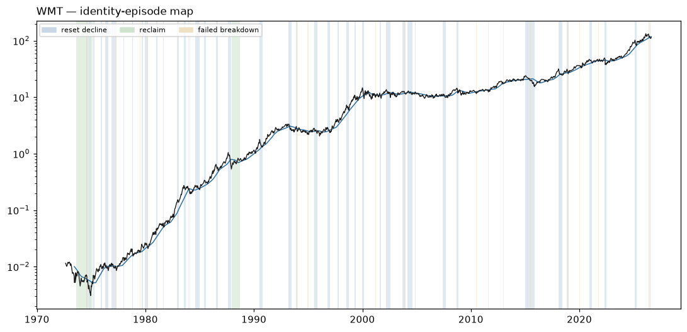

# WMT — Identity Atlas v0 dossier

Descriptive behavioral read. **Zero authority**: nothing on this page ranks, sizes, gates, originates a signal, or escalates. No expert content exists in W1 by law. Episode *resolutions* use future data by design — they are a research-time labeling instrument, never a live surface.

## Identity

| field | value |
|---|---|
| pilot role | operator core |
| price plane | `stocks_tr_v1` |
| first print | 1972-08-25 |
| last print | 2026-08-13 |
| sessions | 13603 |
| `open` available | False |
| sector stratum | Consumer Staples |
| cap stratum | adv3 (dollar-ADV tercile **proxy** — no per-name cap store is tracked) |
| vol stratum | vol1 |
| epoch key | `epoch_0` (listing-to-date; epoch detector: none/provisional) |
| tape ended | False |
| terminated reason | right_censored_at_asof (tape active through asof) |

**Survivor-only cohort:** the allowed price planes retain no ceased tapes; no dead name could be included (registration §2). Any cohort comparison this name appears in is a comparison among survivors and cannot name who is missing.

### Ticker-identity hygiene (§9.6)

No reused-ticker, rename, fixup, or delisting flag on this symbol.

**First-print sanity:** `PREDATES_CALENDAR` — first print 1972-08-25 predates the deal calendar's earliest priced date (2024-12-03)

## Behavioral fingerprint v0 (snapshot at asof)

Percentiles are PIT ranks against the contemporaneous evaluated universe. `—` is a coverage mask (the value is unavailable, which is not a low rank). `unstable` marks an adjacent-window quartile jump: the windows disagree, so the number is reported flagged rather than averaged into a clean-looking one.

### Metric block

The only block any future distance or map may read. Label-free by construction: no sector, industry, cap bucket, plane, or basket member here, and no gap-family member (the gap family is structurally unavailable on the open-less curated plane, so the plane law excludes it from this block universe-wide).

| feature | family | raw | universe pct | covered | unstable |
|---|---|---:|---:|:--:|:--:|
| `f1_kaufman_er_63` | F1 | 0.1726 | 67.2 | yes |  |
| `f1_kaufman_er_126` | F1 | 0.0665 | 44.2 | yes |  |
| `f1_kaufman_er_252` | F1 | 0.0394 | 30.8 | yes |  |
| `f1_logprice_r2_126` | F1 | 0.5540 | 60.2 | yes |  |
| `f1_logprice_r2_252` | F1 | 0.4181 | 42.6 | yes |  |
| `f1_share_above_50dma_252` | F1 | 0.6429 | 65.4 | yes |  |
| `f1_share_above_200dma_252` | F1 | 0.8532 | 71.5 | yes |  |
| `f1_new_high_cadence_252` | F1 | 0.0873 | 75.3 | yes |  |
| `f1_new_high_cadence_756` | F1 | 0.1534 | 99.5 | yes |  |
| `f2_drawdown_median_756` | F2 | 0.0104 | 8.1 | yes |  |
| `f2_drawdown_p90_756` | F2 | 0.0575 | 9.2 | yes |  |
| `f2_resets_per_year_15pct` | F2 | 0.3333 | 26.3 | yes |  |
| `f2_resets_per_year_30pct` | F2 | 0.0000 | 24.4 | yes |  |
| `f2_time_under_water_median_756` | F2 | 4.0000 | 21.5 | yes |  |
| `f2_ulcer_126` | F2 | 10.7386 | 30.8 | yes |  |
| `f2_ulcer_252` | F2 | 8.0057 | 13.1 | yes |  |
| `f3_post_trough_63d_atr_median` | F3 | 6.5116 | 87.2 | yes |  |
| `f3_time_to_50pct_retrace_median` | F3 | 22.0000 | 44.8 | yes |  |
| `f4_ar1_daily_252` | F4 | 0.0725 | 92.2 | yes |  |
| `f4_ar1_weekly_756` | F4 | -0.0500 | 38.7 | yes |  |
| `f4_variance_ratio_k5_756` | F4 | 0.9888 | 65.9 | yes |  |
| `f4_variance_ratio_k20_756` | F4 | 0.9081 | 59.4 | yes |  |
| `f4_mr_half_life_252` | F4 | 36.0337 | 45.3 | yes |  |
| `f4_oscillator_dwell_extreme_252` | F4 | 2.3333 | 24.5 | yes |  |
| `f5_realized_vol_21` | F5 | 20.6001 | 8.3 | yes |  |
| `f5_realized_vol_63` | F5 | 26.9677 | 18.3 | yes |  |
| `f5_realized_vol_252` | F5 | 24.5217 | 10.4 | yes |  |
| `f5_vol_of_vol_252` | F5 | 5.4633 | 11.7 | yes |  |
| `f5_acf_abs_ret_1_252` | F5 | 0.1217 | 71.4 | yes |  |
| `f5_natr_regime_spread_252` | F5 | 0.5559 | 20.2 | yes |  |
| `f7_atr_dist_20dma_252` | F7 | 0.2629 | 53.7 | yes |  |
| `f7_atr_dist_50dma_252` | F7 | 0.7791 | 62.4 | yes |  |
| `f7_atr_dist_200dma_252` | F7 | 4.1135 | 80.0 | yes |  |
| `f7_cross_freq_50dma_252` | F7 | 0.0556 | 28.5 | yes |  |
| `f7_cross_freq_200dma_252` | F7 | 0.0119 | 25.4 | yes |  |
| `f7_dwell_run_above_50dma_252` | F7 | 20.2500 | 74.4 | yes |  |
| `f7_dwell_run_above_200dma_252` | F7 | 107.5000 | 82.5 | yes |  |
| `f7_bounce_rate_50dma_756` | F7 | 0.7188 | 90.1 | yes |  |
| `f8_detrended_acf_peak_1260` | F8 | 0.3365 | 74.6 | yes |  |
| `f8_detrended_acf_peak_lag_1260` | F8 | 126.0000 | 30.9 | yes |  |
| `f8_detrended_acf_peak_sharpness_1260` | F8 | 2.3239 | 56.9 | yes |  |
| `f8_swing_period_median_756` | F8 | 279.0000 | 99.3 | yes |  |
| `f8_swing_period_median_1260` | F8 | 44.0000 | 61.3 | yes |  |
| `f9_beta_univ_ew_252` | F9 | -0.0091 | 2.5 | yes |  |
| `f9_beta_univ_ew_756` | F9 | 0.2174 | 3.0 | yes |  |
| `f9_idio_share_252` | F9 | 1.0000 | 99.8 | yes |  |
| `f9_idio_share_756` | F9 | 0.9595 | 92.3 | yes |  |
| `f10_dollar_adv_63` | F10 | 2.569e+09 | 98.8 | yes |  |
| `f10_dollar_adv_252` | F10 | 2.230e+09 | 99.0 | yes |  |
| `f10_turnover_proxy_252` | F10 | 0.9837 | 45.7 | yes |  |
| `f10_amihud_252` | F10 | 0.0000 | 0.7 | yes |  |
| `f10_cs_spread_252` | F10 | 0.0048 | 6.1 | yes |  |

### Diagnostic block

Census and baseline use only — never a distance input, never a map input.

| feature | raw | universe pct | covered |
|---|---:|---:|:--:|
| `d_sector` | — | — | no |
| `d_industry` | UNKNOWN | — | yes |
| `d_cap_bucket` | — | — | no |
| `d_market_cap_b` | — | — | no |
| `d_price_plane_id` | stocks_tr_v1 | — | yes |
| `d_listing_venue_class` | — | — | no |
| `d_f6_gap_share_252` | — | — | no |
| `d_f6_event_gap_contrib_252` | — | — | no |
| `d_f6_gap_fill_rate_252` | — | — | no |
| `d_close_jump_freq_252` | 0.0238 | 33.0 | yes |
| `d_close_jump_drift5_252` | 0.2453 | 59.4 | yes |

## Identity-episode catalog

Built with no expert event anywhere in its construction. Censored episodes are kept: a decline that never prints a durable low is the case that would otherwise silently disappear from every downstream count.

| type | tier | start | anchor | end | depth % | depth ATR | sessions | resolution | censored |
|---|---:|---|---|---|---:|---:|---:|---|:--:|
| failed_breakdown | 3 | 1973-04-16 | 1973-04-18 | 1973-04-19 | 1.7 | 0.75 | 3 | recovered | no |
| failed_breakdown | 3 | 1973-05-23 | 1973-05-24 | 1973-05-25 | 2.4 | 1.58 | 2 | recovered | no |
| failed_breakdown | 3 | 1973-06-26 | 1973-06-26 | 1973-06-27 | 1.7 | 0.36 | 1 | recovered | no |
| reclaim | 1 | 1973-08-21 | 1974-06-06 | 1974-08-14 | 43.2 | 19.95 | 200 | failed | no |
| reset_decline | 1 | 1974-07-19 | 1974-12-10 | 1974-12-10 | 60.9 | 50.13 | 100 | durable_low | no |
| failed_breakdown | 3 | 1974-08-15 | 1974-08-20 | 1974-08-26 | 7.8 | 3.75 | 7 | recovered | no |
| failed_breakdown | 3 | 1974-09-13 | 1974-09-16 | 1974-09-18 | 1.4 | 0.57 | 3 | recovered | no |
| reclaim | 2 | 1974-11-06 | 1975-01-30 | 1975-02-25 | 42.2 | 29.22 | 58 | failed | no |
| failed_breakdown | 3 | 1974-11-25 | 1974-11-25 | 1974-11-27 | 1.2 | 0.45 | 2 | recovered | no |
| reset_decline | 3 | 1975-03-11 | 1975-04-30 | 1975-04-30 | 17.0 | 5.91 | 35 | durable_low | no |
| reset_decline | 3 | 1975-11-17 | 1975-12-23 | 1975-12-23 | 19.7 | 8.02 | 25 | durable_low | no |
| reset_decline | 2 | 1976-04-07 | 1976-07-26 | 1976-07-26 | 30.0 | 12.75 | 75 | durable_low | no |
| failed_breakdown | 3 | 1976-05-28 | 1976-06-01 | 1976-06-14 | 7.1 | 3.58 | 10 | recovered | no |
| failed_breakdown | 3 | 1976-06-28 | 1976-06-28 | 1976-06-30 | 6.5 | 2.07 | 2 | recovered | no |
| failed_breakdown | 3 | 1976-07-26 | 1976-07-26 | 1976-08-02 | 3.1 | 0.93 | 5 | recovered | no |
| reset_decline | 2 | 1976-11-19 | 1977-04-29 | 1977-04-29 | 25.9 | 10.75 | 111 | durable_low | no |
| failed_breakdown | 3 | 1977-04-06 | 1977-04-06 | 1977-04-11 | 0.8 | 0.35 | 2 | recovered | no |
| failed_breakdown | 3 | 1977-04-19 | 1977-04-19 | 1977-04-20 | 1.0 | 0.45 | 1 | recovered | no |
| failed_breakdown | 3 | 1977-04-22 | 1977-04-29 | 1977-05-05 | 6.8 | 3.04 | 9 | recovered | no |
| reset_decline | 3 | 1977-12-29 | 1978-01-16 | 1978-01-16 | 15.9 | 7.70 | 11 | durable_low | no |
| reset_decline | 3 | 1978-10-12 | 1978-11-14 | 1978-11-14 | 29.6 | 15.18 | 23 | durable_low | no |
| failed_breakdown | 3 | 1978-11-13 | 1978-11-14 | 1978-11-15 | 3.0 | 0.69 | 2 | recovered | no |
| failed_breakdown | 3 | 1979-07-02 | 1979-07-03 | 1979-07-10 | 2.8 | 1.97 | 5 | recovered | no |
| reset_decline | 3 | 1979-08-31 | 1979-10-18 | 1979-10-18 | 16.1 | 9.44 | 33 | durable_low | no |
| reset_decline | 2 | 1979-12-10 | 1980-03-28 | 1980-03-28 | 22.2 | 14.03 | 76 | durable_low | no |
| failed_breakdown | 3 | 1980-03-17 | 1980-03-17 | 1980-03-18 | 0.9 | 0.36 | 1 | recovered | no |
| failed_breakdown | 3 | 1980-03-28 | 1980-03-28 | 1980-04-01 | 1.4 | 0.74 | 2 | recovered | no |
| reset_decline | 3 | 1981-01-06 | 1981-02-02 | 1981-02-02 | 17.8 | 6.53 | 19 | durable_low | no |
| reset_decline | 3 | 1981-08-14 | 1981-09-08 | 1981-09-08 | 16.6 | 11.16 | 16 | durable_low | no |
| failed_breakdown | 3 | 1981-09-04 | 1981-09-08 | 1981-09-11 | 4.2 | 1.84 | 4 | recovered | no |
| reset_decline | 3 | 1982-12-08 | 1983-01-24 | 1983-01-24 | 17.2 | 6.61 | 32 | durable_low | no |
| reset_decline | 3 | 1983-07-22 | 1983-09-15 | 1983-09-15 | 17.7 | 5.09 | 38 | durable_low | no |
| failed_breakdown | 3 | 1983-09-13 | 1983-09-13 | 1983-09-14 | 0.2 | 0.06 | 1 | recovered | no |
| failed_breakdown | 3 | 1983-09-15 | 1983-09-15 | 1983-09-16 | 0.3 | 0.09 | 1 | recovered | no |
| failed_breakdown | 3 | 1983-12-13 | 1983-12-21 | 1983-12-27 | 6.9 | 2.83 | 9 | recovered | no |
| failed_breakdown | 3 | 1984-02-06 | 1984-02-08 | 1984-02-10 | 6.1 | 1.56 | 4 | recovered | no |
| reset_decline | 3 | 1984-08-07 | 1984-12-28 | 1984-12-28 | 17.5 | 7.16 | 100 | durable_low | no |
| failed_breakdown | 3 | 1984-12-05 | 1984-12-05 | 1984-12-17 | 3.2 | 1.53 | 8 | recovered | no |
| failed_breakdown | 3 | 1984-12-28 | 1984-12-28 | 1985-01-02 | 1.5 | 0.66 | 2 | recovered | no |
| reset_decline | 3 | 1985-06-06 | 1985-07-30 | 1985-07-30 | 15.6 | 8.20 | 37 | durable_low | no |
| reset_decline | 2 | 1986-07-02 | 1986-09-15 | 1986-09-15 | 25.0 | 11.06 | 51 | durable_low | no |
| failed_breakdown | 3 | 1987-05-20 | 1987-05-20 | 1987-05-21 | 1.7 | 0.55 | 1 | recovered | no |
| reset_decline | 1 | 1987-08-21 | 1987-12-03 | 1987-12-03 | 50.6 | 20.30 | 72 | durable_low | no |
| failed_breakdown | 3 | 1987-10-12 | 1987-10-12 | 1987-10-13 | 1.4 | 0.32 | 1 | recovered | no |
| reclaim | 1 | 1987-12-14 | 1988-06-08 | 1988-09-07 | 42.2 | 12.04 | 122 | held | no |
| failed_breakdown | 3 | 1988-05-11 | 1988-05-11 | 1988-05-16 | 2.3 | 0.72 | 3 | recovered | no |
| failed_breakdown | 3 | 1988-11-16 | 1988-11-16 | 1988-11-17 | 0.3 | 0.13 | 1 | recovered | no |
| failed_breakdown | 3 | 1990-02-06 | 1990-02-06 | 1990-02-07 | 0.2 | 0.07 | 1 | recovered | no |
| failed_breakdown | 3 | 1990-02-22 | 1990-02-23 | 1990-02-26 | 2.4 | 0.97 | 2 | recovered | no |
| reset_decline | 2 | 1990-07-16 | 1990-10-17 | 1990-10-17 | 30.9 | 12.22 | 66 | durable_low | no |
| failed_breakdown | 3 | 1990-08-21 | 1990-08-23 | 1990-08-27 | 7.4 | 1.64 | 4 | recovered | no |
| failed_breakdown | 3 | 1990-10-10 | 1990-10-10 | 1990-10-12 | 1.3 | 0.32 | 2 | recovered | no |
| failed_breakdown | 3 | 1990-10-17 | 1990-10-17 | 1990-10-18 | 0.5 | 0.12 | 1 | recovered | no |
| reset_decline | 2 | 1993-03-10 | 1993-06-22 | 1993-06-22 | 26.7 | 11.95 | 72 | durable_low | no |
| failed_breakdown | 3 | 1993-04-06 | 1993-04-06 | 1993-04-12 | 5.8 | 1.73 | 3 | recovered | no |
| failed_breakdown | 3 | 1993-05-03 | 1993-05-03 | 1993-05-04 | 0.5 | 0.13 | 1 | recovered | no |
| failed_breakdown | 3 | 1993-05-10 | 1993-05-11 | 1993-05-12 | 1.0 | 0.27 | 2 | recovered | no |
| failed_breakdown | 3 | 1993-06-16 | 1993-06-22 | 1993-06-24 | 4.2 | 1.52 | 6 | recovered | no |
| failed_breakdown | 3 | 1993-09-20 | 1993-09-21 | 1993-09-22 | 1.6 | 0.62 | 2 | recovered | no |
| reset_decline | 3 | 1993-11-16 | 1994-01-07 | 1994-01-07 | 18.7 | 7.68 | 36 | durable_low | no |
| failed_breakdown | 3 | 1993-12-30 | 1993-12-31 | 1994-01-03 | 1.9 | 0.71 | 2 | recovered | no |
| failed_breakdown | 3 | 1994-01-06 | 1994-01-07 | 1994-01-11 | 2.5 | 0.95 | 3 | recovered | no |
| failed_breakdown | 3 | 1994-04-15 | 1994-04-19 | 1994-04-21 | 2.9 | 0.93 | 4 | recovered | no |
| failed_breakdown | 3 | 1994-05-16 | 1994-05-16 | 1994-05-18 | 5.2 | 1.92 | 2 | recovered | no |
| failed_breakdown | 3 | 1994-09-30 | 1994-10-04 | 1994-10-11 | 3.2 | 1.33 | 7 | recovered | no |
| failed_breakdown | 3 | 1994-11-17 | 1994-11-17 | 1994-11-18 | 0.5 | 0.24 | 1 | recovered | no |
| failed_breakdown | 3 | 1994-12-01 | 1994-12-08 | 1994-12-14 | 5.4 | 2.28 | 9 | recovered | no |
| failed_breakdown | 3 | 1994-12-27 | 1994-12-27 | 1994-12-28 | 0.6 | 0.21 | 1 | recovered | no |
| failed_breakdown | 3 | 1995-01-03 | 1995-01-03 | 1995-01-04 | 1.8 | 0.62 | 1 | recovered | no |
| failed_breakdown | 3 | 1995-05-01 | 1995-05-01 | 1995-05-03 | 1.4 | 0.65 | 2 | recovered | no |
| reset_decline | 2 | 1995-07-21 | 1995-10-31 | 1995-10-31 | 21.2 | 9.39 | 71 | durable_low | no |
| failed_breakdown | 3 | 1995-08-28 | 1995-08-28 | 1995-08-29 | 0.5 | 0.21 | 1 | recovered | no |
| failed_breakdown | 3 | 1995-10-26 | 1995-10-31 | 1995-11-02 | 3.9 | 1.60 | 5 | recovered | no |
| reset_decline | 2 | 1996-10-18 | 1997-01-06 | 1997-01-06 | 21.2 | 9.24 | 53 | durable_low | no |
| failed_breakdown | 3 | 1996-12-12 | 1996-12-17 | 1996-12-26 | 4.0 | 1.70 | 9 | recovered | no |
| failed_breakdown | 3 | 1996-12-31 | 1996-12-31 | 1997-01-02 | 1.1 | 0.44 | 1 | recovered | no |
| failed_breakdown | 3 | 1997-01-03 | 1997-01-06 | 1997-01-07 | 2.7 | 1.08 | 2 | recovered | no |
| reset_decline | 3 | 1997-09-12 | 1997-10-27 | 1997-10-27 | 16.8 | 5.57 | 31 | durable_low | no |
| failed_breakdown | 3 | 1997-10-17 | 1997-10-17 | 1997-10-20 | 0.9 | 0.35 | 1 | recovered | no |
| failed_breakdown | 3 | 1997-10-24 | 1997-10-27 | 1997-10-29 | 7.2 | 2.48 | 3 | recovered | no |
| reset_decline | 2 | 1998-07-17 | 1998-10-01 | 1998-10-01 | 22.9 | 9.69 | 53 | durable_low | no |
| failed_breakdown | 3 | 1998-09-29 | 1998-10-01 | 1998-10-06 | 8.9 | 1.88 | 5 | recovered | no |
| reset_decline | 3 | 1999-04-12 | 1999-05-27 | 1999-05-27 | 21.6 | 7.63 | 33 | durable_low | no |
| failed_breakdown | 3 | 1999-05-25 | 1999-05-25 | 1999-05-26 | 0.7 | 0.15 | 1 | recovered | no |
| failed_breakdown | 3 | 1999-05-27 | 1999-05-27 | 1999-05-28 | 2.9 | 0.63 | 1 | recovered | no |
| failed_breakdown | 3 | 1999-08-04 | 1999-08-04 | 1999-08-05 | 0.3 | 0.09 | 1 | recovered | no |
| failed_breakdown | 3 | 1999-08-09 | 1999-08-09 | 1999-08-10 | 1.8 | 0.48 | 1 | recovered | no |
| reset_decline | 2 | 1999-12-27 | 2000-02-25 | 2000-02-25 | 35.9 | 10.56 | 42 | durable_low | no |
| failed_breakdown | 3 | 2000-01-28 | 2000-01-31 | 2000-02-01 | 1.7 | 0.37 | 2 | recovered | no |
| failed_breakdown | 3 | 2000-08-10 | 2000-08-10 | 2000-08-14 | 2.9 | 0.62 | 2 | recovered | no |
| failed_breakdown | 3 | 2000-08-31 | 2000-08-31 | 2000-09-01 | 1.7 | 0.43 | 1 | recovered | no |
| failed_breakdown | 3 | 2000-09-26 | 2000-09-26 | 2000-09-27 | 0.4 | 0.10 | 1 | recovered | no |
| failed_breakdown | 3 | 2000-10-26 | 2000-10-27 | 2000-10-31 | 2.0 | 0.43 | 3 | recovered | no |
| failed_breakdown | 3 | 2001-03-14 | 2001-03-16 | 2001-03-21 | 2.1 | 0.49 | 5 | recovered | no |
| failed_breakdown | 3 | 2001-07-06 | 2001-07-06 | 2001-07-09 | 1.5 | 0.59 | 1 | recovered | no |
| reset_decline | 3 | 2001-08-02 | 2001-09-17 | 2001-09-17 | 21.4 | 8.60 | 27 | durable_low | no |
| failed_breakdown | 3 | 2001-09-07 | 2001-09-17 | 2001-09-24 | 7.1 | 2.15 | 7 | recovered | no |
| reset_decline | 2 | 2002-03-15 | 2002-07-22 | 2002-07-22 | 29.9 | 17.36 | 88 | durable_low | no |
| failed_breakdown | 3 | 2002-04-22 | 2002-04-22 | 2002-04-23 | 0.5 | 0.22 | 1 | recovered | no |
| failed_breakdown | 3 | 2002-05-10 | 2002-05-10 | 2002-05-13 | 0.6 | 0.21 | 1 | recovered | no |
| failed_breakdown | 3 | 2002-06-03 | 2002-06-03 | 2002-06-04 | 1.0 | 0.34 | 1 | recovered | no |
| failed_breakdown | 3 | 2002-07-12 | 2002-07-12 | 2002-07-15 | 0.4 | 0.13 | 1 | recovered | no |
| failed_breakdown | 3 | 2002-12-27 | 2002-12-27 | 2002-12-30 | 0.9 | 0.33 | 1 | recovered | no |
| failed_breakdown | 3 | 2003-02-05 | 2003-02-05 | 2003-02-11 | 0.8 | 0.27 | 4 | recovered | no |
| reset_decline | 3 | 2003-09-04 | 2003-12-15 | 2003-12-15 | 15.4 | 10.56 | 71 | durable_low | no |
| failed_breakdown | 3 | 2003-11-13 | 2003-11-18 | 2003-11-24 | 1.9 | 1.31 | 7 | recovered | no |
| reset_decline | 3 | 2004-03-04 | 2004-08-06 | 2004-08-06 | 15.5 | 9.75 | 107 | durable_low | no |
| failed_breakdown | 3 | 2004-08-06 | 2004-08-06 | 2004-08-10 | 0.8 | 0.44 | 2 | recovered | no |
| reset_decline | 3 | 2004-11-15 | 2004-11-30 | 2004-11-30 | 9.8 | 6.76 | 10 | durable_low | no |
| failed_breakdown | 3 | 2005-02-23 | 2005-02-24 | 2005-03-01 | 0.9 | 0.79 | 4 | recovered | no |
| failed_breakdown | 3 | 2005-03-14 | 2005-03-15 | 2005-03-16 | 0.8 | 0.68 | 2 | recovered | no |
| failed_breakdown | 3 | 2005-03-23 | 2005-03-23 | 2005-03-28 | 0.5 | 0.34 | 2 | recovered | no |
| failed_breakdown | 3 | 2006-02-07 | 2006-02-07 | 2006-02-08 | 0.5 | 0.26 | 1 | recovered | no |
| failed_breakdown | 3 | 2006-12-12 | 2006-12-12 | 2006-12-13 | 0.5 | 0.32 | 1 | recovered | no |
| reset_decline | 3 | 2007-06-04 | 2007-09-10 | 2007-09-10 | 17.0 | 11.64 | 68 | durable_low | no |
| failed_breakdown | 3 | 2007-07-27 | 2007-07-27 | 2007-08-02 | 0.8 | 0.50 | 4 | recovered | no |
| failed_breakdown | 3 | 2007-08-03 | 2007-08-03 | 2007-08-06 | 0.9 | 0.51 | 1 | recovered | no |
| failed_breakdown | 3 | 2007-09-05 | 2007-09-10 | 2007-09-14 | 2.1 | 1.00 | 7 | recovered | no |
| reset_decline | 3 | 2008-09-11 | 2008-10-27 | 2008-10-27 | 21.4 | 9.36 | 32 | durable_low | no |
| failed_breakdown | 3 | 2008-10-27 | 2008-10-27 | 2008-10-28 | 0.8 | 0.12 | 1 | recovered | no |
| failed_breakdown | 3 | 2009-07-10 | 2009-07-10 | 2009-07-13 | 0.1 | 0.05 | 1 | recovered | no |
| failed_breakdown | 3 | 2010-05-07 | 2010-05-07 | 2010-05-12 | 0.4 | 0.24 | 3 | recovered | no |
| failed_breakdown | 3 | 2010-06-25 | 2010-07-02 | 2010-07-12 | 4.0 | 2.54 | 10 | recovered | no |
| failed_breakdown | 3 | 2011-03-16 | 2011-03-17 | 2011-03-18 | 0.0 | 0.02 | 2 | recovered | no |
| failed_breakdown | 3 | 2011-08-02 | 2011-08-10 | 2011-08-16 | 6.8 | 5.71 | 10 | recovered | no |
| failed_breakdown | 3 | 2012-04-24 | 2012-04-25 | 2012-04-26 | 1.2 | 0.79 | 2 | recovered | no |
| failed_breakdown | 3 | 2012-12-28 | 2012-12-28 | 2012-12-31 | 0.1 | 0.05 | 1 | recovered | no |
| failed_breakdown | 3 | 2013-06-20 | 2013-06-20 | 2013-06-25 | 1.7 | 1.28 | 3 | recovered | no |
| failed_breakdown | 3 | 2013-08-28 | 2013-08-28 | 2013-08-30 | 0.3 | 0.24 | 2 | recovered | no |
| failed_breakdown | 3 | 2013-10-07 | 2013-10-07 | 2013-10-08 | 0.7 | 0.59 | 1 | recovered | no |
| failed_breakdown | 3 | 2014-06-17 | 2014-06-17 | 2014-06-18 | 0.4 | 0.42 | 1 | recovered | no |
| failed_breakdown | 3 | 2014-06-26 | 2014-06-26 | 2014-06-27 | 0.1 | 0.11 | 1 | recovered | no |
| failed_breakdown | 3 | 2014-07-30 | 2014-08-05 | 2014-08-08 | 2.1 | 2.44 | 7 | recovered | no |
| reset_decline | 1 | 2015-01-08 | 2015-11-13 | 2015-11-13 | 36.4 | 26.16 | 215 | durable_low | no |
| failed_breakdown | 3 | 2015-03-04 | 2015-03-04 | 2015-03-05 | 0.5 | 0.32 | 1 | recovered | no |
| failed_breakdown | 3 | 2015-03-10 | 2015-03-11 | 2015-03-16 | 1.7 | 1.20 | 4 | recovered | no |
| failed_breakdown | 3 | 2015-04-07 | 2015-04-07 | 2015-04-08 | 0.2 | 0.15 | 1 | recovered | no |
| failed_breakdown | 3 | 2015-06-25 | 2015-06-25 | 2015-06-26 | 0.1 | 0.09 | 1 | recovered | no |
| failed_breakdown | 3 | 2015-06-29 | 2015-06-30 | 2015-07-01 | 1.3 | 1.22 | 2 | recovered | no |
| failed_breakdown | 3 | 2015-10-30 | 2015-10-30 | 2015-11-02 | 0.4 | 0.22 | 1 | recovered | no |
| failed_breakdown | 3 | 2015-11-12 | 2015-11-13 | 2015-11-16 | 1.4 | 0.87 | 2 | recovered | no |
| failed_breakdown | 3 | 2016-05-18 | 2016-05-18 | 2016-05-19 | 2.8 | 1.46 | 1 | recovered | no |
| failed_breakdown | 3 | 2016-09-09 | 2016-09-09 | 2016-09-12 | 0.2 | 0.18 | 1 | recovered | no |
| failed_breakdown | 3 | 2017-01-13 | 2017-01-13 | 2017-01-17 | 1.1 | 0.84 | 1 | recovered | no |
| failed_breakdown | 3 | 2017-01-23 | 2017-01-23 | 2017-01-24 | 0.7 | 0.52 | 1 | recovered | no |
| failed_breakdown | 3 | 2017-01-27 | 2017-01-27 | 2017-01-31 | 1.5 | 1.13 | 2 | recovered | no |
| reset_decline | 2 | 2018-01-29 | 2018-05-29 | 2018-05-29 | 23.9 | 17.72 | 83 | durable_low | no |
| failed_breakdown | 3 | 2018-03-07 | 2018-03-07 | 2018-03-09 | 1.2 | 0.40 | 2 | recovered | no |
| failed_breakdown | 3 | 2018-03-22 | 2018-03-23 | 2018-03-26 | 2.1 | 0.86 | 2 | recovered | no |
| failed_breakdown | 3 | 2018-05-09 | 2018-05-09 | 2018-05-16 | 2.8 | 1.41 | 5 | recovered | no |
| failed_breakdown | 3 | 2018-05-25 | 2018-05-29 | 2018-05-30 | 0.2 | 0.09 | 2 | recovered | no |
| reset_decline | 3 | 2018-11-09 | 2018-12-24 | 2018-12-24 | 18.3 | 11.14 | 29 | durable_low | no |
| failed_breakdown | 3 | 2018-12-14 | 2018-12-24 | 2018-12-31 | 7.5 | 3.76 | 10 | recovered | no |
| failed_breakdown | 3 | 2020-01-07 | 2020-01-08 | 2020-01-09 | 0.4 | 0.37 | 2 | recovered | no |
| failed_breakdown | 3 | 2020-01-13 | 2020-01-13 | 2020-01-14 | 0.2 | 0.22 | 1 | recovered | no |
| failed_breakdown | 3 | 2020-01-15 | 2020-01-15 | 2020-01-16 | 0.5 | 0.48 | 1 | recovered | no |
| failed_breakdown | 3 | 2020-01-17 | 2020-01-17 | 2020-01-21 | 0.3 | 0.26 | 1 | recovered | no |
| failed_breakdown | 3 | 2020-01-24 | 2020-01-24 | 2020-01-27 | 0.5 | 0.46 | 1 | recovered | no |
| failed_breakdown | 3 | 2020-02-03 | 2020-02-03 | 2020-02-04 | 0.1 | 0.07 | 1 | recovered | no |
| failed_breakdown | 3 | 2020-02-26 | 2020-02-28 | 2020-03-02 | 5.8 | 3.75 | 3 | recovered | no |
| failed_breakdown | 3 | 2020-03-12 | 2020-03-12 | 2020-03-13 | 3.4 | 0.94 | 1 | recovered | no |
| reset_decline | 3 | 2020-11-30 | 2021-03-04 | 2021-03-04 | 16.2 | 9.52 | 64 | durable_low | no |
| failed_breakdown | 3 | 2021-02-01 | 2021-02-01 | 2021-02-02 | 0.9 | 0.50 | 1 | recovered | no |
| failed_breakdown | 3 | 2021-10-01 | 2021-10-04 | 2021-10-07 | 2.4 | 1.80 | 4 | recovered | no |
| failed_breakdown | 3 | 2021-12-02 | 2021-12-02 | 2021-12-03 | 0.2 | 0.11 | 1 | recovered | no |
| failed_breakdown | 3 | 2022-02-14 | 2022-02-16 | 2022-02-17 | 1.0 | 0.56 | 3 | recovered | no |
| reset_decline | 2 | 2022-04-21 | 2022-06-17 | 2022-06-17 | 25.7 | 14.43 | 40 | durable_low | no |
| failed_breakdown | 3 | 2022-06-17 | 2022-06-17 | 2022-06-21 | 0.7 | 0.23 | 1 | recovered | no |
| failed_breakdown | 3 | 2023-03-08 | 2023-03-10 | 2023-03-15 | 1.3 | 0.75 | 5 | recovered | no |
| failed_breakdown | 3 | 2023-11-17 | 2023-11-20 | 2023-11-21 | 0.3 | 0.18 | 2 | recovered | no |
| failed_breakdown | 3 | 2023-11-22 | 2023-11-22 | 2023-11-24 | 0.4 | 0.23 | 1 | recovered | no |
| failed_breakdown | 3 | 2023-12-01 | 2023-12-04 | 2023-12-05 | 0.2 | 0.15 | 2 | recovered | no |
| failed_breakdown | 3 | 2023-12-06 | 2023-12-08 | 2023-12-13 | 1.9 | 1.17 | 5 | recovered | no |
| reset_decline | 2 | 2025-02-13 | 2025-04-08 | 2025-04-08 | 21.9 | 14.09 | 37 | durable_low | no |
| failed_breakdown | 3 | 2025-04-04 | 2025-04-08 | 2025-04-09 | 2.9 | 1.10 | 3 | recovered | no |
| reset_decline | 3 | 2026-05-19 | — | 2026-08-13 | 19.2 | 9.68 | 59 | censored | yes |
| failed_breakdown | 3 | 2026-05-26 | 2026-05-27 | 2026-05-28 | 0.2 | 0.08 | 2 | recovered | no |
| failed_breakdown | 3 | 2026-05-29 | 2026-06-02 | 2026-06-05 | 4.6 | 1.79 | 5 | recovered | no |
| failed_breakdown | 3 | 2026-07-01 | 2026-07-01 | 2026-07-08 | 3.8 | 1.56 | 4 | recovered | no |
| failed_breakdown | 3 | 2026-07-23 | 2026-07-23 | 2026-07-24 | 0.4 | 0.16 | 1 | recovered | no |

**180 episodes**, 1 censored; by type {'failed_breakdown': 137, 'reset_decline': 40, 'reclaim': 3}; by tier {3: 160, 2: 15, 1: 5}.

## State shares by year

Eight mutually-exclusive bars-only states, first-match-wins precedence. Gap basis on this plane: `close_vs_prev_close` — a close-to-close proxy absorbs the whole session's move, not just the overnight jump, so cross-plane comparisons of the dislocation share carry that caveat.

| year | post event dislocation | deep washout | breakdown | recovery reclaim | controlled pullback | structural uptrend | vol transition | range |
|---:|---:|---:|---:|---:|---:|---:|---:|---:|
| 1972 | 34% | 0% | 0% | 0% | 0% | 0% | 0% | 66% |
| 1973 | 36% | 6% | 1% | 2% | 0% | 0% | 0% | 56% |
| 1974 | 36% | 20% | 1% | 13% | 0% | 0% | 0% | 30% |
| 1975 | 19% | 2% | 0% | 34% | 23% | 16% | 0% | 6% |
| 1976 | 20% | 0% | 0% | 0% | 46% | 13% | 9% | 13% |
| 1977 | 8% | 0% | 0% | 0% | 23% | 31% | 2% | 37% |
| 1978 | 13% | 0% | 0% | 0% | 38% | 32% | 6% | 12% |
| 1979 | 21% | 0% | 0% | 0% | 55% | 11% | 1% | 12% |
| 1980 | 11% | 0% | 0% | 0% | 31% | 45% | 3% | 9% |
| 1981 | 12% | 0% | 0% | 0% | 24% | 62% | 2% | 1% |
| 1982 | 13% | 0% | 0% | 0% | 28% | 59% | 0% | 0% |
| 1983 | 6% | 0% | 0% | 0% | 55% | 39% | 0% | 0% |
| 1984 | 4% | 0% | 0% | 0% | 37% | 16% | 13% | 30% |
| 1985 | 2% | 0% | 0% | 0% | 38% | 58% | 0% | 2% |
| 1986 | 4% | 0% | 0% | 0% | 60% | 36% | 0% | 0% |
| 1987 | 4% | 3% | 1% | 0% | 27% | 50% | 0% | 15% |
| 1988 | 2% | 0% | 0% | 2% | 44% | 6% | 15% | 31% |
| 1989 | 2% | 0% | 0% | 0% | 15% | 83% | 0% | 0% |
| 1990 | 4% | 0% | 0% | 0% | 53% | 37% | 1% | 5% |
| 1991 | 4% | 0% | 0% | 0% | 28% | 68% | 0% | 0% |
| 1992 | 2% | 0% | 0% | 0% | 50% | 48% | 0% | 0% |
| 1993 | 4% | 0% | 0% | 0% | 18% | 14% | 11% | 53% |
| 1994 | 2% | 0% | 0% | 0% | 17% | 0% | 23% | 58% |
| 1995 | 2% | 0% | 0% | 0% | 37% | 26% | 10% | 25% |
| 1996 | 6% | 0% | 0% | 0% | 31% | 28% | 9% | 26% |
| 1997 | 4% | 0% | 0% | 0% | 21% | 62% | 12% | 0% |
| 1998 | 4% | 0% | 0% | 0% | 23% | 73% | 0% | 0% |
| 1999 | 4% | 0% | 0% | 0% | 47% | 46% | 2% | 1% |
| 2000 | 0% | 0% | 0% | 0% | 42% | 2% | 4% | 52% |
| 2001 | 2% | 0% | 0% | 0% | 46% | 14% | 3% | 35% |
| 2002 | 0% | 0% | 0% | 0% | 19% | 26% | 6% | 49% |
| 2003 | 2% | 0% | 0% | 0% | 19% | 50% | 0% | 29% |
| 2004 | 2% | 0% | 0% | 0% | 9% | 24% | 1% | 64% |
| 2005 | 4% | 0% | 0% | 0% | 13% | 0% | 8% | 76% |
| 2006 | 2% | 0% | 0% | 0% | 11% | 31% | 16% | 40% |
| 2007 | 10% | 0% | 0% | 0% | 31% | 23% | 11% | 24% |
| 2008 | 4% | 0% | 0% | 0% | 10% | 65% | 2% | 19% |
| 2009 | 2% | 0% | 0% | 0% | 23% | 12% | 2% | 61% |
| 2010 | 2% | 0% | 0% | 0% | 2% | 65% | 4% | 27% |
| 2011 | 2% | 0% | 0% | 0% | 9% | 57% | 4% | 28% |
| 2012 | 12% | 0% | 0% | 0% | 10% | 76% | 0% | 2% |
| 2013 | 2% | 0% | 0% | 0% | 24% | 65% | 1% | 8% |
| 2014 | 6% | 0% | 0% | 0% | 0% | 65% | 8% | 21% |
| 2015 | 6% | 0% | 0% | 0% | 16% | 12% | 25% | 40% |
| 2016 | 6% | 0% | 0% | 0% | 31% | 47% | 1% | 15% |
| 2017 | 8% | 0% | 0% | 0% | 3% | 74% | 2% | 14% |
| 2018 | 8% | 0% | 0% | 0% | 40% | 14% | 5% | 33% |
| 2019 | 4% | 0% | 0% | 0% | 19% | 76% | 0% | 0% |
| 2020 | 10% | 0% | 0% | 0% | 19% | 66% | 2% | 2% |
| 2021 | 2% | 0% | 0% | 0% | 22% | 44% | 4% | 28% |
| 2022 | 8% | 0% | 0% | 0% | 16% | 26% | 2% | 48% |
| 2023 | 2% | 0% | 0% | 0% | 32% | 63% | 3% | 0% |
| 2024 | 6% | 0% | 0% | 0% | 1% | 93% | 0% | 0% |
| 2025 | 12% | 0% | 0% | 0% | 40% | 47% | 0% | 1% |
| 2026 | 3% | 0% | 0% | 0% | 29% | 44% | 0% | 24% |

## Episode map

Log price with the 200DMA, episode spans shaded by type, durable lows marked, and the daily state strip beneath. On histories longer than 5,000 sessions the two price LINES are drawn at weekly resolution for legibility and file size; spans, markers and the state strip stay daily.

---

Constants: `77e111c11672524c826948455a8c2ea5b812cdddb3f0d9dac1807b253604e9d0` · fingerprint spec: `0e3457b11f41452e1c3efac3858196f5f42b573d1961b798ea581e1590b33187` · partition: `a546c64983431f0afca01cfd9aacc230ef3bed875520c44898090520cf98164a` · asof 2026-08-13
