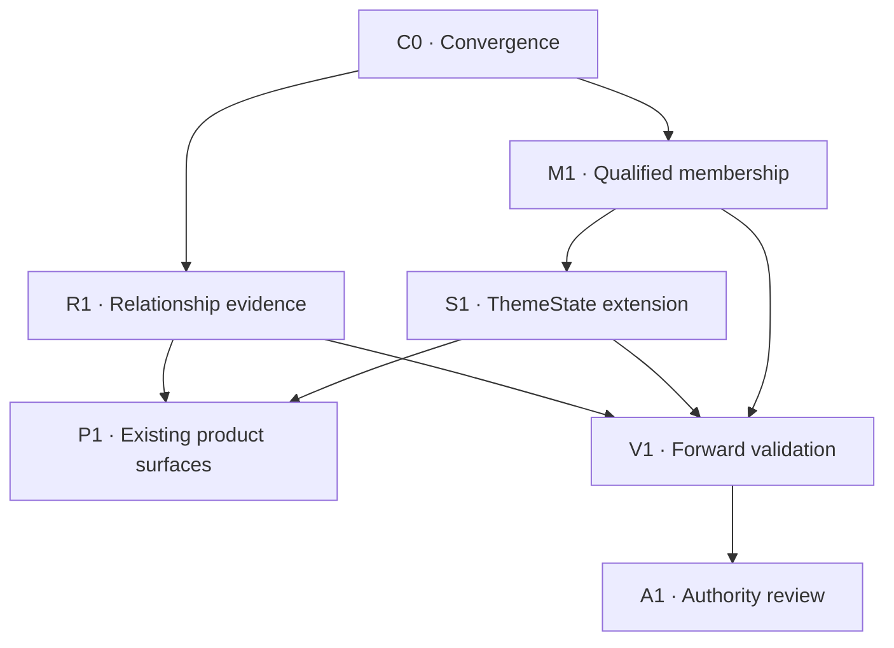

# Theme Fabric completion research and decision architecture

**Commission date:** 2026-10-07 (America/Chicago). **Research completed:** 2026-10-08 UTC.  
**Canonical owner:** `WS:GMI-THEME-GRAPH`. **Package purpose:** research and implementation convergence; no ontology admission or production implementation is performed by this package.  
**Operation:** `theme-fabric-completion-research-20261007-web-001`. **Recipient:** incumbent GMI implementation lead through the canonical Macro research handoff.

## Executive decision

Theme Fabric should be completed as the existing GMI semantic graph plus qualified membership, three separately defined exposure axes, one ThemeState owner, dated economic relationships, and projections into existing products. Its value is explaining a security's role in an economic mechanism and the evidence for current thematic behavior. Membership, state, economic dependence and forecast authority remain distinct assertions.

The W-C4 proposal's **68 microthemes are sufficient for a V1 structural navigation baseline**. They are not a completed set of measurable microtheme populations. The **current any-parent primary-basket diagnostic finds zero exact micro cohort identities, 49 broad parent proxies and 19 without a primary basket through any parent**. The inherited census reindexed to W-C4 remains **0/48/20**; it omitted surgical robotics' robotics-parent proxy while retaining its medical-devices parent. Current main has 18 canonical themes; the populated hierarchy remains active work at the source observations in this report. The work required next is principally membership qualification, owner admission and useful consumer projection.

The most justified semantic refinements are a **reviewed split of HBM memory from advanced packaging**, and a **scope review separating optical components from switch/NIC silicon where the incumbent interconnect definition combines them**. These are proposals for owner adjudication, with membership and provenance gates. General server CPU economics deserve review, but broad CPU business must not be placed under AI Semiconductors without a canonical scope/parent ruling. A narrow AI/HPC host-CPU child requires actual deployment/product evidence of that use.

Keep all 18 canonical themes for convergence. Open bounded canonical-theme reviews for **enterprise AI workflow software**, **digital-asset transaction infrastructure** and **retail-media monetization**. Original issuer evidence supports distinct mechanisms; admission remains deferred because a lawful house cohort, overlap audit, incumbent vertical mapping and named consumer contract have not all been established. Empty Consumer or Crypto macro categories do not require children. Generic crypto, blanket consumer/franchise and industrial reshoring are refused as automatic new economic themes.

Freeze the universal ceiling at **macro category → theme → microtheme**. Products, technology generations, application modes, economic roles, sites, indications, contracts and temporary bottlenecks belong in incumbent vertical/evidence records and typed relationships. Existing graph schemas do not yet support product/process node kinds; this research does not pretend that they do. A future additive schema proposal must demonstrate an actual machine traversal need to the same GMI owner.

Extend the **existing ThemeState owner**, after its current acceptance gates, with independently qualified microtheme subjects and measurements. Reuse the existing price, group, breadth, earnings, revisions, news, options and holdings primitives; preserve their different definitions and clocks. Do not produce a universal scalar Theme Fabric score. Descriptive measurement validity, incremental predictive evidence and downstream action authority have different gates.

Treat the illustrative AI-to-copper sequence as a set of economic hypotheses. Physical supply, enabling capacity, an active bottleneck, a conditional beneficiary and a catalyst have different directions and evidence requirements. None implies transitive equity-return causation. K3-D retains propagation-hypothesis ownership; F04 retains downstream explanation ownership; GMI retains semantic truth.

### What this research makes possible

Before this commission, the implementation lead had active hierarchy and census work, but no single reconciled decision package connecting semantic grain, membership, exposure, state, relationships, validation and the real consumers. This package supplies that architecture, the exact current evidence boundary, explicit decisions, machine-readable gaps and an ordered handoff.

**Research commission:** complete after the package's adversarial and publication receipts. **Theme Fabric parent mission:** incomplete. No new hierarchy member, economic exposure value, causal fact, microtheme state, public rights grant, Prophet score or production capability is made true by a research merge.

## 1. Method, scope and evidence precision

The investigation repinned protected procedure, read current owner records and the four active commission PRs, consumed the two incumbent censuses, and performed bounded reconciliation rather than replacing their work. Parallel read-only investigations covered semantic/exposure relationships, state/empirical design, and omitted active populations/consumer paths. Original issuer, standards, official data documentation and research-method sources were used to test the architectural proposals. No new return experiment, provider collection, graph materialization, production browser session or user-cohort capture was run.

Main Macro source is pinned at **`6848743faa613f2aad55d4b4d831b88f8482f89e`**. Protected Mastermind procedure is pinned at **`c7e47c859eb2925c5626931fd511800773ba09ac`**. Bounded Terminal source is pinned at **`d660d98b1ebc0bdf0d1b16d66202b1760f6cc94a`**. Later repository movement is evaluated for material dependency changes; it does not turn these historical observations into current live proof.

Use the following distinctions throughout:

- **Observed committed fact:** a file, count, schema or implementation was inspected at an exact commit. This is not necessarily the current served production generation.
- **Recorded owner acceptance:** the canonical workstream contains a historical receipt. This research does not silently repeat or strengthen that receipt.
- **Research recommendation:** a proposed design or disposition, with owner, falsifier and gate.
- **Unresolved:** a source, cohort, entitlement, identity, timestamp, consumer or empirical condition was not established. Null is retained; absence is not fabricated.

Research dates and artifact dates differ. A board's as-of date, its generation time, a filing's period end and its public availability time answer different questions. Calendar age alone is not a market-calendar freshness judgment. Aggregate vendor diagnostics in this package do not authorize redistribution of vendor membership lists or copying vendor structure into house taxonomy.

### 1.1 Current capability ledger

| Capability | State at evidence boundary | Discriminating evidence | Remaining gate |
|---|---|---|---|
| Canonical GMI graph and bitemporal semantic spine | PARTIAL as an end-to-end Fabric; existing core implementation and committed generations | Current graph metadata, contract, rights and membership readers | Qualified extension and real consumer proof for each new subject/use |
| 18 canonical theme identities and crosswalk | BUILT_NOT_PROVEN for this session's live path; committed source confirmed | 18 current crosswalk rows; 13 primary baskets, five null | Preserve identities; repair only explicit substrate gaps |
| Populated 10/68/93 hierarchy | BUILT_NOT_PROVEN; active draft W-C4 | #8629 exact head and source; main research seed differs | Incumbent conflict resolution, source/countersign/date checks, CI, review and actual integration |
| Structural hierarchy reader | BUILT_NOT_PROVEN for new populated hierarchy | Existing `structural_navigation.hierarchy_paths` and guards | Accepted population plus consumer proof; no company-to-all-descendants inference |
| Finviz and THS local semantic plane | PARTIAL; substantial committed populations, internal-use restrictions | 268 current Finviz subthemes; 375 THS concepts; current rights registry | Current purpose-specific use qualification, identity and historical-source completeness |
| Microtheme membership | NOT_BUILT/admitted for W-C4 V1 | V1 blocks micro ticker membership and basket EXPRESSES; inherited 0/48/20 plus current any-parent 0/49/19 reconciliation | Explicit amendment to incumbent admission/read law and curated group/slice evidence |
| Legacy canonical ThemeState | PARTIAL | Committed 18-row v1 artifact, nine stale divergence legs, display capabilities false | Per-leg freshness; preserve compatibility while incumbent successor acceptance proceeds |
| W3B owner and graph-shadow continuation | PARTIAL | Owner lineage #8455 and recorded #8539 continuation; D2E #8540 still held | Existing D2E and natural nightly accepted-generation receipt, not a new state service |
| Microtheme ThemeState | SPEC_ONLY | Current subject validation/capture select canonical/local subjects | Owner subject-contract extension after cohort qualification; no v3 build in this commission |
| Economic exposure measures | SPEC_ONLY/PARTIAL source facts | Reserved axes null; issuer filings can establish selected facts, not universal product shares | Incumbent filing/data owner, basis/denominator/period/clocks, permitted use and attribution |
| Trading and attention exposure | PARTIAL research evidence | Existing W2 prereg/report/erratum; imperfect attention inputs | Qualified PIT cohorts and sources, independent new validation where needed |
| Economic relationship semantics | PARTIAL vocabulary; insufficient qualified edges for the target intelligence | Existing five relation types and closed evidence schema | Evidence packets, endpoint semantics, qualified ratification and K3-D handoff |
| Theme Gap Discovery | PARTIAL | Existing diagnostic and probation queue; 236 mapping proposals, statistical evidence refs empty | Extend existing report/packet validation and populate immutable references |
| F04/Company Theme Context | PARTIAL | Existing CTE v1 reader/gateway/card and F04 owner; W-C8 draft | Version-compatible optional ancestor projection and natural consumer receipt |
| Selection-cohort context | DARK_OR_DISCONNECTED because source admission is unavailable | US/CN artifacts explicitly `SOURCE_UNAVAILABLE:CAPTURE_RIGHTS_UNAVAILABLE` | Incumbent capture/rights decision; zero counts are not observed empty populations |
| Microtheme alpha / autonomous ontology / new scoring | NOT_BUILT or REJECTED_BY_DESIGN | No new outcome test; machine proposal cannot ratify; action flags false | Separate preregistered evidence and explicit owner authority decision; automatic promotion prohibited |

No row is labeled PROVEN_LIVE solely because source code exists. Specific unavailable legs can coexist with a working context card. A system can correctly refuse a source; that refusal is a readiness limitation rather than necessarily a code defect.

## 2. Exact authority, source ownership and collision register

The source register at the end of this report and the JSON matrix preserve immutable file URLs and available Git blob SHAs. The core governing chain is: current protected procedure; GMI workstream and end-to-end ownership decision; hierarchy decision/spec and contract; admitted crosswalk/source/rights owners; exact current implementation; research artifacts. A newer research recommendation does not silently supersede an accepted owner law.

| Active dependency | Exact observed head | State at initial collision read | Owned scope and convergence rule |
|---|---|---|---|
| Macro #8629 W-C4 | `f64ee5f26ba32e4e6a5af69d16869e224d681fcc` | Open draft; conflicted | Incumbent hierarchy population. Do not edit its crosswalk/materialization paths from this research branch |
| Macro #8631 W-C8 | `be0223198ce4b6b161a2d32d3576331ca886c7a4` | Open draft | Optional F04 exposure_map ancestor injection; current head governs over older SHA in body |
| Macro #8633 micro membership census | `e0ce7a5d2d5e38008a7d828fe23cc748662c1efe` | Open draft | Consume its table; reconcile 69 to actual 68; do not replace census path |
| Macro #8635 whole-GMI classification census | `c29dde7f8006bce68fcf70bc6719bda6264c6f2b` | Open draft | Consume its broader inventory; correct only stale 11/7 primary-basket summary at current source |
| Macro #8540 D2E | `52d57f34aad6956b3ddb697fff34c82588e791af` | Open draft; acceptance HOLD | Existing qualified ThemeState/generation acceptance predecessor |
| Macro #6514 K3-D | `74b6426c8be71adec27df00f2f98172f8528c2b2` | Open draft; HOLD-FOR-SOL | Economic propagation hypotheses; no separate GMI propagation program |
| Macro #7870 shared semiconductor foundation | `f12db8bff1d1a46a2c9fbf100bed8f6f3abc9ec9` | Open draft; HOLD | Exact vertical slice-key parity and countersign before federation/content changes |
| Macro #6504 F04 ownership | Recorded merged/closed | Historical accepted ownership | Downstream explanation is F04; parent operation `marketontology-f04-ontology-transmission-20260826-fable-001` |

The incumbent GMI workstream records `coo-fable` and implementation seat `6f14c2da`. These are source observations for routing, not fresh execution custody granted by this report. The final handoff is placed under the existing owner; no new workstream, queue or lead is created.

The four named active PRs had no returned comments at the initial read. This is bounded comment evidence, not an assertion that no external review or later message exists. Before implementation or release, re-read material PR heads, governing paths and explicit holds. Do not absorb unrelated repository churn or replay the full census merely because main advances.

### 2.1 Deliberate non-supersession

This package corrects two bounded census claims: the inherited micro table's **69/0/49/20** versus W-C4's **68/0/48/20**, and the classification report's **11 primary/7 null** versus current crosswalk's **13/5**. It does not replace those reports wholesale.

The 69-micro research seed remains historical evidence. `sic_gan_specialty` is its extra micro; `industrial_robot_arms` appears in both sets. W-C4's `hbm_packaging` nomination is `research:config/theme_pathways.yml`; a different seed nomination is not interchangeable proof. Per-entry `asserted_on` must not precede actual house admission/merge. Preserve the existing top-level crosswalk version/date semantics instead of using a global timestamp bump to hide that distinction.

### 2.2 Later material source check

Protected Mastermind master remained `c7e47c859eb2925c5626931fd511800773ba09ac`. Macro main advanced to `1385697ab8353e849f376ad5b2d29994076652ee`. The 22 enumerated governing/source-code paths in the machine matrix were re-read there; every Git blob matched the research observation. This is a bounded source-compatibility receipt, not a new census or live-state refresh.

| PR / owner scope | Exact observed head | Later state |
|---|---|---|
| [#8629](https://github.com/mastermindx-market-intelligence/macro/pull/8629) theme-graph(content): populate the house theme hierarchy \u2014 10 categories / 68 micro-themes / 93 PARENT_OF (W-C4) | `f64ee5f26ba32e4e6a5af69d16869e224d681fcc` | open; draft=true; mergeable=false |
| [#8631](https://github.com/mastermindx-market-intelligence/macro/pull/8631) market-ontology(F04): optional display-only ancestors on exposure_map rows via injected hierarchy_paths (W-C8) | `be0223198ce4b6b161a2d32d3576331ca886c7a4` | open; draft=true; mergeable=false |
| [#8633](https://github.com/mastermindx-market-intelligence/macro/pull/8633) theme-graph(census): micro-theme membership census Q1-Q6, GMI hierarchy V1.1 input (docs only) | `e0ce7a5d2d5e38008a7d828fe23cc748662c1efe` | open; draft=true; mergeable=false |
| [#8635](https://github.com/mastermindx-market-intelligence/macro/pull/8635) theme-graph(census): whole-GMI classification census G1-G5, hierarchy V1.1 input (docs only) | `c29dde7f8006bce68fcf70bc6719bda6264c6f2b` | open; draft=true; mergeable=false |
| [#8540](https://github.com/mastermindx-market-intelligence/macro/pull/8540) theme-graph(D2E): D2 acceptance gate matrix \u2014 Phase-1 interim record (HOLD pending natural receipt) | `52d57f34aad6956b3ddb697fff34c82588e791af` | open; draft=true; mergeable=false |
| [#6514](https://github.com/mastermindx-market-intelligence/macro/pull/6514) HOLD-FOR-SOL: contracts(k3d): Economic Propagation hypothesis v1 — do not merge until Sol accepts | `74b6426c8be71adec27df00f2f98172f8528c2b2` | open; draft=true; mergeable=false |
| [#7870](https://github.com/mastermindx-market-intelligence/macro/pull/7870) [DRAFT/HOLD] Semiconductor Theme Intelligence B — implementation carrier | `f12db8bff1d1a46a2c9fbf100bed8f6f3abc9ec9` | open; draft=true; mergeable=false |

The exact heads were unchanged. GitHub's later mergeable=false observations update the initial flags and remain incumbent integration work. The research's data counts continue to describe the explicit pinned snapshot. Its own release checks and exact reviewed head are recorded by the carrying PR.

## 3. Current taxonomy, membership and active-population census

### 3.1 Graph inventory and denominators

At Macro's pinned graph metadata, the generation was computed **2026-10-07T08:00:17Z**, with belief date 2026-10-07 and observed nightly era. It reports **3,882 nodes**, **25,101 physical edge rows**, **12,863 latest edges** and **23 evidence rows**. Physical, latest-belief and currently usable counts must remain separate.

Current capability entries are **505 measurement + 138 semantic = 643**, versus **644 physical rows**. Current identity resolution counts are **2,375 resolved + 195 not in master + 233 unsupported + 1 deferred = 2,804**, versus **2,807 physical rows**. These are graph inventory statistics, not proof that 505 measured ThemeState legs or 2,375 current tradable securities are available.

| Source/group family | Committed inventory | Interpretation |
|---|---|---|
| Finviz | 40 themes; 268 subthemes; 2,365 interval rows, 26 closed, **2,339 current slots**; **924 current unique raw ticker strings** | Local narrative classification; two retained vintages (2026-06-27 and 2026-08-15). Historical identity minted/resolved totals are not current unique-name counts |
| THS local concepts | 375 concepts; 237 mapping/EXPRESSES records; 314 unmapped concepts in relevant metadata; concept-map as-of 2026-10-03 | Different relation/count denominators; source-local status and rights preserved |
| US house baskets | 49 baskets; 708 companies; 1,038 membership edges | Includes sectors and context groups, not 49 canonical themes |
| Canada house baskets | 16 baskets; 167 companies; 167 edges | Regional source population |
| China house baskets | 22 baskets; 280 companies; 285 edges | Separate from THS raw concept membership |
| THS-derived admitted per-basket family | 237 baskets; 919 companies; 3,532 edges; 21,192 PIT rows | PER_BASKET_ONLY collection scope; no whole-collection receipt. Do not conflate with raw THS dump |
| Hong Kong house baskets | 17 baskets; 147 companies; 176 edges | Regional source population |
| International house baskets | 17 baskets; 233 companies; 279 edges | May overlap regional populations; do not sum into unique global securities |
| Canonical crosswalk | 18 themes; 74 EXPRESSES; 61 local concepts/61 THS codes; 48 canonical basket joins and 13 without that join in the relevant mapping inventory | These relation counts are not primary-basket counts or theme member Ns |

Source: pinned `data/theme_graph/_meta.json`, `config/theme_crosswalk.yml`, current house membership artifacts and source contracts. Raw Finviz/THS labels and constituent lists are not republished in this package.

### 3.2 Hierarchy and vertical vocabulary

W-C4 proposes **10 macro categories, 18 existing theme nodes, 68 unique micros and 93 parent relationships**: 21 category→theme and 72 theme→micro. Four micros have two parents: `hbm_packaging`, `hv_transformers_switchgear`, `military_space_communications`, and `surgical_robotics_systems`. Preserve their multiple paths; don't duplicate the economic security population or assign a weight from parent count.

The categories are technology/software; semiconductors/hardware; energy/power; materials/mining; industrials/defense; healthcare/life sciences; financial services; consumer cyclical; consumer defensive; and crypto/digital assets. The last two consumer categories and crypto category are structurally empty. Fintech/payments has no admitted micro child, consistent with the Finance R11 federation gate.

Vertical registries are already economic vocabulary, not a license to fork theme IDs. The shared semiconductor base requires slice parity/countersign. Finance's 52 slices across seven domains require the incumbent federation decision; they are not automatically 52 themes. Consumer and Industrials projector mechanisms remain in their own vertical scope unless a specific persistent theme is admitted. Sector/industry classifications are orthogonal controls and navigation axes; no rule should force every industry or active company into a foresight theme.

The all-68 disposition table below makes the proposed V1 retention and specific V1.1 review candidates explicit. The machine matrix also carries each micro's parents, inherited substrate classification and decision.

### 3.3 Active Prophet populations and coverage bounds

#### 3.3.1 Four market board artifacts

| Market | Committed source as-of | Board definition | Source-declared universe | Source-declared eligible | `buy` rows | `watch` rows | Distinct `buy ∪ watch` | House basket raw-symbol matches in union |
|---|---|---|---:|---:|---:|---:|---:|---:|
| US | 2026-10-06 | `us_prophet_v3` | 1,586 | 150 | 89 | 48 | 137 | 55/137 |
| China | 2026-09-30 | `cn_prophet_v4` | 1,593 | 99 | 24 | 75 | 99 | 27/99 |
| Hong Kong | 2026-10-07 | `hk_prophet_v2` | 156 | 19 | 13 | 8 | 21 | 20/21 |
| Canada | 2026-10-06 | `ca_prophet_branch_b_v1` | 216 | 2 | 10 | 8 | 18 | 12/18 |

Sources: [US board](https://github.com/mastermindx-market-intelligence/macro/blob/6848743faa613f2aad55d4b4d831b88f8482f89e/site/factordata/us_standouts.json), [China board](https://github.com/mastermindx-market-intelligence/macro/blob/6848743faa613f2aad55d4b4d831b88f8482f89e/site/factordata/china_standouts.json), [Hong Kong board](https://github.com/mastermindx-market-intelligence/macro/blob/6848743faa613f2aad55d4b4d831b88f8482f89e/site/factordata/hk_standouts.json), [Canada board](https://github.com/mastermindx-market-intelligence/macro/blob/6848743faa613f2aad55d4b4d831b88f8482f89e/site/factordata/canada_standouts.json), joined to each region's committed `data/baskets*/membership.json` at the same pin.

The columns deliberately retain the source's different definitions. In HK and Canada, the count of rows in a legacy `buy` key is not the same as the source-declared eligible count. Canada explicitly declares `authority=screen`, `selection_status=accruing`, `official_pick_authority=false` and `legacy_buy_key_semantics=ripe_list_screen`. A cross-market classifier must preserve these distinctions.

The four source timestamps also differ. This report does not call the China date stale without checking its own trading calendar and settlement policy. The source dates are data observations, not verified serving timestamps. None of these committed snapshots proves the production browser currently serves those bytes.

The US file separately reports `universe_sources.total=3069`, all six source groups complete, with 251 deep-history holdings, 256 additional breadth names, 602 small-cap, 398 mid-cap, 1,356 Russell and 206 curated extra/ETF names. Its `universe=1586` is assigned from `len(cand)`, while `universe_sources` describes the upstream loader. These are different stages, not interchangeable denominators. See [build_stock_library.py](https://github.com/mastermindx-market-intelligence/macro/blob/6848743faa613f2aad55d4b4d831b88f8482f89e/scripts/build_stock_library.py), `universe_sources`, `universe`, and assignment `wide["universe"] = len(cand)`.

#### 3.3.2 Bounded US candidate and board diagnostic

| US population | Exact raw symbols | Any current house basket | Canonical primary basket | Current Finviz local snapshot | Neither house nor Finviz |
|---|---:|---:|---:|---:|---:|
| `buy` | 89 | 39 | 12 | 33 | 38 |
| `watch` | 48 | 16 | 3 | 17 | 24 |
| `buy ∪ watch` | 137 | 55 | 15 | 50 | 62 |
| `candidate_pool.rows` | 150 | 65 | 21 | 50 | 69 |

The candidate pool is not merely a concatenation of the two visible lists: its own lanes contain 11 featured, 104 more actionable, 19 late/unfillable and 16 forming names. It preserves 61 candidates outside the `buy` list. It also discloses a featured-count mismatch involving CSCO (`board_featured_count=12`, pool featured=11, CSCO pool lane=forming). This is a source diagnostic, not something this research commission should fix or normalize away.

The JSON retains current board/candidate names without a house-basket raw-symbol match for identity triage. It does not republish vendor-derived per-name membership or absence lists. A house no-match is not an ontology gap: many names should remain sector/industry or issuer-specific stories.

**Still unavailable as an observed ID denominator:** the complete contemporary US scan roster; the complete four-market analyzed candidate stores and their eligibility-tested union; any current user portfolio/watchlist/search-demand population; identities and vintage membership for every source row. The US scan resolver uses the R2-canonical `data/massive_stock_day` store and remains separate from board admission. See [us_scan_universe.py](https://github.com/mastermindx-market-intelligence/macro/blob/6848743faa613f2aad55d4b4d831b88f8482f89e/engine/us_scan_universe.py). The older August D1 3,253-name/2,368-uncovered census is a historical baseline only, not a current measurement.

### 3.4 Membership substrate, overlap and explicit gap classes

#### 3.4.1 Corrected semantic/membership counts

The W-C4 micro reconciliation is exact: 68 intended IDs; 68 matched inherited rows; no missing row; one inherited extra, `sic_gan_specialty`. The inherited 0/49/20 summary becomes **0/48/20** over the correct 68. `PROXY` means the parent has a basket that may help inspect a broad mechanism. It does not authorize every parent-basket stock as a micro member. `NONE` means the inherited table found no primary parent basket; it does not establish that the real economy or vertical owner has no relevant securities.

Current canonical primary-substrate sizes are:

| Canonical theme | Current primary-basket members | Canonical theme | Current primary-basket members |
|---|---:|---|---:|
| AI semiconductors | 12 | Cybersecurity | 10 |
| Memory/storage | 4 | Defense/aerospace | 21 |
| Semiconductor equipment | 16 | Robotics/automation | 12 |
| Data-center power | 8 | GLP-1/obesity | 14 |
| Nuclear power | 9 | Fintech/payments | 21 |
| Grid electrification | 24 | Space/satellite | 15 |
| Rare earth/critical minerals | 11 | Five themes without a primary basket | null |

The five nulls are `copper_steel_electrify`, `ag_fertilizer`, `medical_devices`, `diagnostics_lifesci`, and `solar`. Source: actual rows of [theme_crosswalk.yml](https://github.com/mastermindx-market-intelligence/macro/blob/6848743faa613f2aad55d4b4d831b88f8482f89e/config/theme_crosswalk.yml), joined to [US membership](https://github.com/mastermindx-market-intelligence/macro/blob/6848743faa613f2aad55d4b4d831b88f8482f89e/data/baskets/membership.json).

Memory/storage's four-member parent makes micro statistical power an immediate concern. A semantic split into HBM, DRAM and storage can be useful for reading a company dossier even when there are too few independently exposed listed issuers to compute stable standalone breadth. The masterplan should retain `semantic_only` and `measurement_candidate` as separate population states and admit each measurement leg independently. A universal member-count threshold would be too crude: exact membership, usable price observations, issuer independence, share-class de-duplication, concentration, overlap and effective sample size are all relevant.

**Do not reverse every `basket_ids` entry into membership.** The crosswalk explicitly includes supply-chain and economic proxy baskets in `basket_ids`; its primary field is the direct semantic identity. For example, a price proxy can legitimately inform a theme while the proxy's constituents are not canonical members of that theme. A coverage measure based on all forward price mappings would inflate coverage and create false exposure.

### Current any-parent diagnostic: preserve the surgical-robotics path

The inherited 68-row reindex and a current any-parent availability check have different definitions. W-C4 gives `theme:surgical_robotics_systems` both `theme:robotics_automation` and `theme:medical_devices` as parents. The inherited census retained only medical devices and called this micro NONE. The current robotics primary basket exists, with 12 active members; medical devices still has no primary basket.

| Diagnostic over the 68 W-C4 IDs | Exact micro identity established | Broad parent proxy | No primary basket through the diagnostic's parent scope |
|---|---:|---:|---:|
| Inherited census classifications, reindexed without changing their meaning | 0 | 48 | 20 |
| Current availability through any W-C4 parent | 0 | 49 | 19 |

Only surgical robotics changes availability class in this bounded reconciliation. The JSON retains every inherited classification and adds the separately named current parent diagnostic with supporting parent/basket references. The 12 robotics names are not admitted surgical-robotics members. All micro membership admissions remain false and all new exposure/state measurements remain unqualified/null.

Sources: [W-C4 parent paths](https://github.com/mastermindx-market-intelligence/macro/blob/f64ee5f26ba32e4e6a5af69d16869e224d681fcc/config/theme_crosswalk.yml), [current primary crosswalk](https://github.com/mastermindx-market-intelligence/macro/blob/6848743faa613f2aad55d4b4d831b88f8482f89e/config/theme_crosswalk.yml), [current house membership](https://github.com/mastermindx-market-intelligence/macro/blob/6848743faa613f2aad55d4b4d831b88f8482f89e/data/baskets/membership.json), and [inherited micro census](https://github.com/mastermindx-market-intelligence/macro/blob/e0ce7a5d2d5e38008a7d828fe23cc748662c1efe/research/theme_graph/census/MICRO_MEMBERSHIP_CENSUS_2026-10-07.md).

#### 3.4.2 Finviz comparison-only statistics

Across the current 268 subthemes and 924 raw ticker strings, 428 tickers have multiple memberships (46.3%); 97 belong to at least five subthemes and 26 to at least ten. MSFT=66, AMZN=56, GOOGL=55 and NVDA=38. Their 215 slots account for 9.19% of all 2,339 slots, although they are only 4 of 924 names. The current snapshot has 3 subthemes with three members and 9 with four members; thus 12/268 have fewer than five raw members. Source: [themes_tree.json](https://github.com/mastermindx-market-intelligence/macro/blob/6848743faa613f2aad55d4b4d831b88f8482f89e/data/themes_heatmap/themes_tree.json).

Over 35,778 unordered subtheme pairs, three reach Jaccard ≥0.8, including one equal-member-set pair. The package retains these aggregate diagnostics without republishing source-local pair identifiers. These are comparison statistics only. An identical set can reflect a vendor's limited listed-security choices, not a duplicate mechanism; a broad issuer can span genuinely distinct mechanisms. Therefore overlap screens should propose review, never auto-merge.

A comparable house-canonical overlap analysis must use admitted PIT cohorts and exact securities, then de-duplicate economic issuers and distinguish multiple real exposures from share classes. No 68-micro covariance matrix is justified by copying their parent baskets 48 times. That would create fabricated independent series and repeated evidence.

#### 3.4.3 Explicit gap classes

| Observed situation | Correct gap class | Required next evidence/action | What it is not |
|---|---|---|---|
| W-C4 micro exists but only a broad parent basket is available | Membership definition/read contract | House/vertical owner supplies justified group or slice cohort, valid/known dates and provenance | Missing taxonomy |
| Five canonical themes lack a primary house basket | Primary semantic substrate; some also lack measurement | Check incumbent vertical and lawful curated group before adding any basket | Proof that all thematic evidence is absent |
| Active candidate has no exact raw-symbol join | Identity or coverage triage | Data OS join, then separate sector/industry, local concept, canonical and micro paths | Automatic new-theme nomination |
| Complete micro cohort exists but no qualified state receipt | State readiness | Project eligible legs through existing ThemeState owner | New ThemeState owner |
| Current state is present but a supply/benefit chain is unrecorded | Relationship evidence | Typed, dated relationship claim through incumbent owner | Permission to infer causation from return correlation |
| Display card exists but source says capture-rights unavailable | Rights/admission | Resolve the specific incumbent rights decision or retain typed unavailability | Broken UI wiring |
| State artifact top date is current but individual legs are stale | Per-leg freshness | Preserve/null each leg according to its owner contract | Fully fresh state |
| Existing group vocabulary exactly covers the mechanism | Federation/crosswalk decision | Reuse incumbent vertical identifiers and evidence | A reason to mint synonym theme IDs |

## 4. Semantic grain and where taxonomy stops

Freeze three universal thematic levels for this completion wave. This is a product and governance decision, not a claim that the world inherently has only three semantic depths.

SKOS distinguishes immediate broader/narrower relations from transitive ancestry and permits multiple broader paths. It does not prescribe a universal depth of three. Its separation of conceptual relationships, collections and mapping relations is useful here: a group for browsing, a source-local mapping and an economic dependence are different assertions. The house can borrow those distinctions without adopting RDF or creating a replacement graph. [S01]

A fourth tier would require a concrete consumer that repeatedly needs intrinsic thematic containment below a micro, a stable house-authored definition and PIT cohort, and evidence that existing vertical product/process records plus typed relationships cannot answer the question. No such case was established. A hardware generation, interface speed, package variant, drug route, product indication, plant location, named contract, economic role or temporary bottleneck is insufficient.

| Concept below or across a micro | Correct representation under the current boundary | Incorrect inference to prevent |
|---|---|---|
| HBM generation, DRAM stack configuration, CoWoS variant, optical line rate | Existing technical/vertical evidence record or product facet, linked from a qualified mechanism claim | Every specification becomes a fourth-level theme |
| Supplier, customer, IP licensor, foundry, integrator, operator, input consumer | Dated economic role in incumbent evidence or read-time projection | All company roles imply identical exposure |
| Molecule, formulation route, indication, trial, approval | Incumbent health product/catalyst record, with dated relationship to an admitted theme where warranted | One security becomes several independent economic populations |
| Manufacturing site, country, policy eligibility | Site/geography/policy fact using its incumbent owner and qualified relation | Location alone proves domestic revenue, tariff benefit or reshoring demand |
| Order, capacity, backlog, qualification, award, outage | Dated facts and catalysts; conditional relationships | An announcement equals realized production, recognized revenue or profit |
| Bottleneck, overcapacity, adoption rate, pricing pressure | Time-varying evidence or a named state leg | A permanent taxonomic identity or universal positive share-price effect |

There is a real contract gap behind the commission's phrase “product/process nodes”: current nodes.v1 supports theme, company, ETF, catalyst, policy_program, commodity, participant_class, market, basket and local_theme; it does not support product or technology/process node kinds. Do not invent them in emitted data or misuse participant_class. Initially keep this detail in incumbent vertical/evidence records and reference it through the existing evidence path. If machine traversal later requires a product/process identity, make the minimal additive node-kind proposal to the same owner after demonstrating the consumer need. That is a possible future schema decision, not an implementation assumed complete. [I4]

### Hierarchy is not a causal chain

The commission's AI demand → HBM → packaging → WFE → networking → cooling → transformers → copper sequence is a useful investigation storyboard, but not a single directed economic chain. Memory and packaging complement each other; WFE supplies fabrication capacity; networking, thermal and electrical systems are parallel complements to a deployed system. Demand propagation can run opposite to physical supply. A beneficiary-to-driver BENEFITS_FROM arrow also runs opposite to driver-to-effect ENABLES.

Do not compose those unlike arrows into a guaranteed transitive statement. A copper-price increase may benefit a miner's revenue while raising a cable producer's input cost; whether margins improve depends on contracts, pass-through and other costs. Physical necessity is not identified equity-return causality. The typed relation contract in §8 makes these differences explicit.

### 4.2 Candidate decisions: nine-criterion matrix

The table proposes future decisions, not changes to W-C4. “Keep V1” means retain the current structural proposal while its owner completes its gates; it does not certify current membership, source coverage or factor independence. All new content remains subject to the existing curation/probation/admission path.

Criterion 1 = distinct economic mechanism; 2 = persistence; 3 = PIT membership; 4 = public-security substrate; 5 = ability to differ from siblings; 6 = named consumer; 7 = non-duplication; 8 = lawful provenance; 9 = falsifier. Criterion 5 is a testable economic hypothesis; no return distinctness was measured in this contribution.

Consumer abbreviations in the matrix refer to actual inspected consumers: F04 exposure_map / CompanyThemeContextCard for explanation; ThemeState and its established hierarchy child-lead prereg for state research; SectorIntelligenceWorkspace for incumbent vertical financial explanation. These are proposed uses, not evidence that new feature support already ships. The present Consumer Cyclical financial projector is narrowly scoped and cannot be generalized by this report.

| ID and disposition | 1. Economic mechanism | 2. Persistence | 3. PIT membership | 4. Public substrate | 5. Distinctness hypothesis | 6. Named consumer | 7. Non-duplication decision | 8. Lawful provenance | 9. Falsifier / rejection gate |
|---|---|---|---|---|---|---|---|---|---|
| D01 KEEP merchant accelerators and custom ASICs separate | Merchant programmable platforms versus customer-specified compute designs | Product/business architecture, not a one-quarter label | Dated products/shipments; separate roadmap from current product | AMD and Broadcom are inspected examples; illustrative, not an admitted cohort | Design cycle, customer concentration and pricing may differ | F04; semiconductor SectorIntelligenceWorkspace; later ThemeState | Preserve gpu_merchant_accelerators and custom_asic_silicon; no duplicate “AI chip” node | S04,S08; house slice countersign | Merge only if scoped evidence and cohorts cannot distinguish roles; never infer pure AI segment share |
| D02 DEFER CPU admission; scope/parent decision first | Host CPU platform economics differ from accelerators; general CPU refresh is broader than AI | Persistent CPU role; the current rally is not its definition | Qualifying AI/HPC product/deployment fact required for a narrow child; general server data cannot be relabeled | AMD/Intel server platforms; Arm role changes require dates and security admission | Server CPU demand, licensing and accelerator demand can diverge; untested | F04; semiconductor vertical; future state experiment | Preferred general server_cpu_platforms requires explicit canonical compute-parent/scope review; only a genuinely narrow AI/HPC host-CPU candidate can fit current ai_semiconductors | S04,S05,S06; #7870 parity | Reject narrow child if evidence only says “AI capable,” generic server refresh, or PC/client CPU; reject entire data-center revenue attribution |
| D03 SPLIT REVIEW hbm_packaging | Memory die/stack product versus multi-die packaging/interposer integration service | Distinct recurring production stages | Manufacturer versus packager evidence at filing/product date | Micron and SK hynix for memory; TSMC for packaging; no automatic cross-market price readiness | Memory pricing/yields can differ from packaging capacity/qualification | F04; semiconductor vertical; ThemeState only with sufficient cohort | Prospective hbm_memory and advanced_packaging_services; preserve old ID history; countersign shared slice migration | S03,S07,S11 | Defer content if source identities or semantic cohort/consumer evidence cannot be established; thin cohorts independently block measurements; never pad with GPU customers/packagers |
| D04 SPLIT/ADD REVIEW optical versus switching interconnect | Optical transmit/receive/laser components versus switching/NIC/connectivity silicon | Stable physical roles; speeds and CPO packaging modes are facets | Dated production products; roadmap evidence separately labeled | Broadcom, Coherent, Lumentum inspected; mixed businesses and overlapping issuers | Component cycles and constraints may differ; common AI capex exposure can dominate | F04; semiconductor vertical; later ThemeState | Review exact ai_interconnect_silicon scope before adding optical_interconnect_components; no silent narrowing of old ID | S08,S09,S10 | Reject if only a technology generation or vendor label distinguishes cohorts; no independent basket if same names dominate |
| D05 KEEP nand_enterprise_storage; REFUSE mechanical NAND/SSD split | Nonvolatile memory and storage devices are related; SSD includes NAND, controller and firmware | Durable storage function | Product/segment facts, not company name or parent proxy | Micron source supports multiple products but not pure theme share | Device integration could matter, but not demonstrated here | F04; semiconductor vertical | Keep V1; separate systems/software role only after actual mixed-substrate evidence | S03 | Do not invent NAND-chip versus SSD independent populations merely because the components differ |
| D06 DEFER transformer/switchgear split | Voltage conversion versus switching, isolation and protection | Durable electrical functions | Product and installed-use evidence; distinguish data-center from broad utility exposure | Incumbent equipment suppliers exist, but a split house cohort was not audited here | Lead times, manufacturing capacity and service mix may differ | F04; industrial SectorIntelligenceWorkspace | Keep hv_transformers_switchgear now; candidate product distinction without new owner | S12,S13,S14 | Reject split if parent cohort simply duplicated; “AI power demand” alone cannot attribute all grid sales |
| D07 DEFER fuel_cycle stage split | Mining, conversion, enrichment and fabrication have different inputs/capacity | Recurring nuclear fuel stages | Operating stage, plant and contract dates | Cameco conversion inspected; public-stage cohorts can be thin or mixed | Contract and commodity sensitivities plausibly differ | F04; nuclear ThemeState research | Keep V1; use stage/commodity relations first; no arbitrary four-child expansion | S15 | Refuse a stage basket made from unrelated nuclear names or private producers without public-security support |
| D08 MERGE/RECLASSIFY REVIEW collaborative versus industrial arms | “Collaborative” can describe integrated operation, not a disjoint robot production mechanism | Robot arms persist; application mode crosscuts them | Product plus application/system evidence, not marketing adjective | Overlapping robot vendors; no distinct house cohort proven | Independence is weak if shared suppliers and demand | F04; robotics state research | Keep frozen IDs until adjudication; prefer one robot-arm mechanism plus application facet if overlap persists | S16,S17 | Reject merge if owner demonstrates different durable economics and dated public cohorts; reject assumption that all industrial arms cannot be collaborative |
| D09 MERGE-AS-MEASUREMENT / FACET REVIEW oral route and cardiorenal indications | Route and indication may change demand for the same molecule/product | Therapeutic mechanism persists; approvals/route are separate dimensions | Approval/clinical/product dates; precommercial evidence not revenue | Same issuers can recur across therapy, oral formulation and indication | Distinct catalyst behavior possible; independence cannot be presumed | F04; health vertical and catalyst owner | Keep current structure pending owner ruling; do not issue three duplicated state factors; move detail to product/catalyst facet if no distinct cohort | S18 plus incumbent health definitions | Reject standalone measured cohort if merely duplicate securities/one drug; do not fabricate indication revenue |
| D10 KEEP critical_mineral_mining_development as broad semantic context; REFUSE common economic sign | Commodity production and development differ by mineral and stage | Persistent activities; “critical” designation/eligibility changes over time | Mineral, stage, jurisdiction, policy and production-date evidence | Existing house parent proxy is not an identity cohort | Mineral prices and developers/producers need not move together | F04; commodity and industrial evidence | Avoid proliferating each policy list into new micros; qualify commodity and stage | I1–I3; original project evidence required before each relationship | Refuse uniform bottleneck, benefit or scalar exposure across all critical-mineral names |
| D11 DEFER sic_gan_specialty | Power conversion semiconductor roles can be distinct from AI compute | Device physics/application persists | Reviewed product/end-market facts and slice parity | Not established by this contribution as a current admitted cohort | EV/industrial power demand can differ from AI silicon | F04; semiconductor vertical | It is not one of W-C4's 68; do not reinsert seed-only content; parent-scope and #7870 countersign first | I1–I3; external dossier still required | Reject admission based solely on stale seed count or generic semiconductor membership |
| D12 OPEN CANONICAL REVIEW; DEFER enterprise_ai_workflow_software admission | Paid enterprise workflows and application automation differ from selling silicon/power | Commercial recurring software, while “agent” naming evolves | Shipped offering and paid use; bundle/ARR not revenue share | ServiceNow and Salesforce inspected; mixed products | Subscription/usage economics may differ from infrastructure capex; untested | F04; software SectorIntelligenceWorkspace; future ThemeState | House ai_software/ai_agents nominate one scope review; do not create two synonymous themes or hide under chips | S19,S20 plus house basket evidence | Reject if ordinary software relabeled AI, no incremental cohort, or consumer only needs an existing sector view |
| D13 OPEN CANONICAL REVIEW; DEFER digital_asset_transaction_infrastructure admission | Exchange/custody/settlement/stablecoin services; reserve yield and fee channels separate | Services can persist across token cycles | Licensed/operating service, revenue-category and counterparty facts at date | Coinbase inspected; further independent issuer/cohort receipts required | Fee volume and reserve rates differ from mining/hash economics | F04; Finance SectorIntelligenceWorkspace; future state research | Start from house crypto_rails nomination; Finance52/fintech overlap adjudication before any new ID | S21,S22; house-only vocabulary decision | Refuse if no distinction from existing fintech slice, if cohort is mostly treasury/mining proxy, or rates and fee roles are conflated |
| D14 REFUSE generic crypto as automatic economic theme | Token inventory, mining, fee services and reserve income are different mechanisms | Shared narrative may persist; economic identity is not coherent | Narrative membership is source-local, not economic evidence | Public names exist, but existence alone does not make one exposure | Common crypto beta is a trading question, not a business model | F04 can show separate source-local context and qualified roles | Preserve source-local crypto and existing context-vector use; no catch-all canonical economics | S21,S22; I1 | Reconsider only with a precise durable mechanism and cohort; price correlation alone fails |
| D15 OPEN CANONICAL REVIEW; DEFER retail_media_networks admission | Monetizing shopper/commerce attention through ad services differs from merchandise margin | Commercial repeated service, not generic consumer sentiment | Identify actual advertiser service and accounting treatment; exclude ad-fund pass-through | Amazon and Walmart inspected; no independent house micro cohort proven | Ad demand/yield and retail unit sales can differ; conglomerate overlap limits stock distinctness | F04; SectorIntelligenceWorkspace after explicit scope extension | Missing from 18, but audit overlap with software/media vocabulary and keep retail basket as nomination only | S25,S26,S27 | Reject if membership uses any retailer that spends on advertising, or if parent/financial data cannot isolate the mechanism |
| D16 REFUSE blanket consumer-membership/franchise theme now; KEEP vertical roles | Renewal/dues, royalty and owned-unit economics are distinct explainable business roles | Persistent roles | Issuer period/basis/contract facts | Costco and PLNT inspected; their different economics do not imply a shared thematic cohort | Revenue recognition/cost structures differ | Existing Consumer Cyclical economic-change projector; SectorIntelligenceWorkspace | Reuse incumbent consumer/earnings owner; consumer category remains honestly unfilled where no thematic mechanism qualifies | S23,S24; I8,I9 | Reopen only for a bounded transformation mechanism plus cross-issuer cohort; empty category or consumer sector coverage fails |
| D17 REFUSE blanket industrial reshoring; use qualified pathways | Geography/policy shifts affect demand, input cost, labor, capacity and timing differently | Long-lived policy/capacity cycle possible; one direction is not assured | Site, project, award, construction, operation and orders have distinct dates | Suppliers/beneficiaries possible, but no vetted standalone house cohort here | Winners, delayed projects and input-cost losers may coexist | F04; existing Industrials result-to-cash vertical | Factory automation already overlaps robotics; semicap/grid/materials remain existing themes; policy/site facts are relationships | I1,I10; original project docs required | Reject generic domestic listing, political slogan, or capex announcement as realized revenue; only reopen for nonduplicative recurring mechanism |
| D18 REFUSE fourth universal tier for generation/site/route/role | These are orthogonal details or instances | Detail can persist without becoming a theme | Existing product/catalyst/evidence owner provides dates | Public security list cannot establish ontological depth | No extra independent behavior established | F04 and incumbent vertical detail | Keep three tiers; additive non-theme node-kind decision only if machine consumer proves need | S01,S02; I4 | Reconsider only when repeated intrinsic thematic containment cannot be represented by existing facets/qualified relations |

### CPU decision: do not repair a trading blind spot by changing economic meaning

The AMD filing explicitly distinguishes server CPUs, data-center GPUs and other data-center products, while its financial segment combines them. Intel documents server CPU platforms, and Arm's June 2026 filing shows why roles require dates: licensing/royalties remain its described business while a newly announced company CPU silicon product has prospective production timing. Those facts establish meaningful mechanisms; they do not make every CPU shipment, every server refresh or all segment revenue “AI.” [S04–S06]

Two options must remain explicit. First, a narrow ai_hpc_host_cpu_platforms micro could be considered below AI Semiconductors if house criteria require evidence of the relevant AI/HPC host/deployment role. A generic “AI capable” marketing statement, client PC refresh and all-purpose cloud demand are insufficient. Such membership would mean participation in that mechanism, with all numeric AI shares still null. It would not solve the broad CPU-market blind spot.

Second, if the desired consumer is general server CPU economics, propose a reviewed canonical compute-scope decision before admitting server_cpu_platforms. Options include a new appropriately scoped compute theme or a deliberate change to the existing parent's charter with full legacy migration impact; neither is a silent label edit. The current ai_infra basket's broad capex proxy description cannot authorize this semantic expansion. The house semiconductor vertical may expose dated CPU financial/product evidence in the meantime without a new canonical theme or stored ticker tag.

### What the matrix deliberately does not claim

The sources show commercial/physical distinctions and disclosure limitations. They do not prove incremental alpha, separate return factors, current house memberships, sufficient effective constituent counts, or a binding bottleneck today. A micro can remain useful for explanation when too thin for state. Conversely, a large source-local label can be economically incoherent. The candidate cohort selection must be frozen before a return-distinctness test; choosing after looking at rallies invalidates the test.

### 4.3 Exact disposition of all 68 W-C4 micros

This is the exact observed PR population, not the 69-row seed. The table screens every ID, parent relation and nomination. “KEEP structural V1” for a row without a D-record means no change is proposed from this research; it is not a claim that this row received a separate issuer-level technical dossier or currently has an identity cohort. The source-intensive mechanism challenges are the D-records above. No row is approved for stored ticker exposure or independent ThemeState merely by appearing here.

| W-C4 micro ID (theme: prefix omitted) | Proposed parent(s), prefix omitted | Disposition | Decision record |
|---|---|---|---|
| hbm_packaging | ai_semiconductors, memory_storage | KEEP V1; SPLIT REVIEW | D03 |
| gpu_merchant_accelerators | ai_semiconductors | KEEP distinct mechanism | D01 |
| ai_interconnect_silicon | ai_semiconductors | KEEP V1; optical/silicon SPLIT REVIEW | D04 |
| custom_asic_silicon | ai_semiconductors | KEEP distinct mechanism | D01 |
| conventional_dram | memory_storage | KEEP structural V1 | No change proposed |
| nand_enterprise_storage | memory_storage | KEEP; REFUSE automatic NAND/SSD split | D05 |
| lithography_tools | semicap_equipment | KEEP structural V1 | No change proposed |
| etch_deposition_equipment | semicap_equipment | KEEP structural V1 | No change proposed |
| process_metrology_inspection | semicap_equipment | KEEP structural V1 | No change proposed |
| wafer_fab_subsystems | semicap_equipment | KEEP structural V1 | No change proposed |
| liquid_cooling_thermal | data_center_power | KEEP structural V1 | No change proposed |
| hv_transformers_switchgear | data_center_power, grid_electrification | KEEP V1; split DEFERRED | D06 |
| ups_power_conversion | data_center_power | KEEP structural V1 | No change proposed |
| reactor_technology | nuclear_power | KEEP structural V1 | No change proposed |
| nuclear_components | nuclear_power | KEEP structural V1 | No change proposed |
| fuel_cycle | nuclear_power | KEEP V1; stage split DEFERRED | D07 |
| grid_distribution_automation | grid_electrification | KEEP structural V1 | No change proposed |
| transmission_hvdc_cabling | grid_electrification | KEEP structural V1 | No change proposed |
| endpoint_security | cybersecurity | KEEP structural V1 | No change proposed |
| network_security | cybersecurity | KEEP structural V1 | No change proposed |
| identity_access_management | cybersecurity | KEEP structural V1 | No change proposed |
| cloud_security | cybersecurity | KEEP structural V1 | No change proposed |
| missiles_munitions_effects | defense_aerospace | KEEP structural V1 | No change proposed |
| missile_propulsion_supply | defense_aerospace | KEEP structural V1 | No change proposed |
| defense_sensors_electronics_c2 | defense_aerospace | KEEP structural V1 | No change proposed |
| autonomous_systems_counter_uas | defense_aerospace | KEEP structural V1 | No change proposed |
| naval_shipbuilding | defense_aerospace | KEEP structural V1 | No change proposed |
| aerospace_components_aftermarket | defense_aerospace | KEEP structural V1 | No change proposed |
| military_space_communications | defense_aerospace, space_satellite | KEEP structural V1 | No change proposed |
| machine_vision | robotics_automation | KEEP structural V1 | No change proposed |
| industrial_motion_controls | robotics_automation | KEEP structural V1 | No change proposed |
| collaborative_robot_arms | robotics_automation | KEEP V1; MERGE/FACET REVIEW | D08 |
| industrial_robot_arms | robotics_automation | KEEP V1; MERGE/FACET REVIEW | D08 |
| precision_actuators_servo_motors | robotics_automation | KEEP structural V1 | No change proposed |
| surgical_robotics_systems | robotics_automation, medical_devices | KEEP structural V1 | No change proposed |
| glp1_incretin_therapies | glp1_obesity | KEEP structural V1 | No change proposed |
| oral_glp1_formulations | glp1_obesity | KEEP V1; FACET/MEASUREMENT MERGE REVIEW | D09 |
| glp1_api_manufacturing | glp1_obesity | KEEP structural V1 | No change proposed |
| cardiorenal_metabolic_indications | glp1_obesity | KEEP V1; FACET/MEASUREMENT MERGE REVIEW | D09 |
| fill_finish_delivery_devices | glp1_obesity | KEEP structural V1 | No change proposed |
| launch_services | space_satellite | KEEP structural V1 | No change proposed |
| satellite_broadband_services | space_satellite | KEEP structural V1 | No change proposed |
| direct_to_device_connectivity | space_satellite | KEEP structural V1 | No change proposed |
| earth_observation | space_satellite | KEEP structural V1 | No change proposed |
| satellite_ground_terminals | space_satellite | KEEP structural V1 | No change proposed |
| rare_earth_separation_refining | rare_earth_critical_min | KEEP structural V1 | No change proposed |
| ndfeb_permanent_magnets | rare_earth_critical_min | KEEP structural V1 | No change proposed |
| critical_mineral_mining_development | rare_earth_critical_min | KEEP context; REFUSE uniform exposure/state inference | D10 |
| gallium_germanium_supply_chain | rare_earth_critical_min | KEEP structural V1 | No change proposed |
| copper_mining | copper_steel_electrify | KEEP structural V1 | No change proposed |
| refined_copper | copper_steel_electrify | KEEP structural V1 | No change proposed |
| structural_steel_electrification | copper_steel_electrify | KEEP structural V1 | No change proposed |
| copper_wire_cable | copper_steel_electrify | KEEP structural V1 | No change proposed |
| nitrogen_fertilizer_production | ag_fertilizer | KEEP structural V1 | No change proposed |
| potash_phosphate_nutrients | ag_fertilizer | KEEP structural V1 | No change proposed |
| precision_agriculture_platforms | ag_fertilizer | KEEP structural V1 | No change proposed |
| medical_imaging | medical_devices | KEEP structural V1 | No change proposed |
| remote_patient_monitoring | medical_devices | KEEP structural V1 | No change proposed |
| surgical_implants_instruments | medical_devices | KEEP structural V1 | No change proposed |
| liquid_biopsy_assays | diagnostics_lifesci | KEEP structural V1 | No change proposed |
| genomic_sequencing | diagnostics_lifesci | KEEP structural V1 | No change proposed |
| proteomics_discovery_platforms | diagnostics_lifesci | KEEP structural V1 | No change proposed |
| life_science_lab_instruments | diagnostics_lifesci | KEEP structural V1 | No change proposed |
| diagnostic_reagents_kits | diagnostics_lifesci | KEEP structural V1 | No change proposed |
| pv_cell_module_manufacturing | solar | KEEP structural V1 | No change proposed |
| polysilicon_solar_feedstock | solar | KEEP structural V1 | No change proposed |
| solar_inverters | solar | KEEP structural V1 | No change proposed |
| solar_trackers_bos | solar | KEEP structural V1 | No change proposed |

No fourth-tier child is proposed for any of these 68. sic_gan_specialty is separately DEFERRED in D11 and is not counted. hbm_memory, advanced_packaging_services, optical_interconnect_components and CPU or new canonical-theme names above are proposal labels, not minted IDs.

The incumbent micro census describes identity/proxy/missing substrate on its own 69-row seed population. Removing the excluded SiC/GaN proxy yields inherited labels of 48 parent-proxy and 20 no-primary-basket rows. The separate current any-parent check is 49/19 because surgical robotics also has a robotics-parent proxy. Neither diagnostic establishes an identity micro cohort. This is a deterministic reconciliation of that census and the exact crosswalk, not a new census or proof that no other lawful source could later support membership. [I1–I3]

## 5. Microtheme membership: admission and read-time composition

A microtheme definition answers “what economic mechanism is this?” A membership assertion answers “which issuer/security participates, in which role, during which interval, according to what evidence?” An economic share answers a further quantitative question. A house price basket can support a chart without proving every constituent's semantic identity.

The existing hierarchy V1 intentionally does not admit microtheme MEMBER_OF or EXPRESSES edges. The implementation sequence must first obtain an explicit, minimal amendment to that incumbent admission/read boundary. It must not bypass the guard by adding a parallel ticker-rule YAML file, free-standing membership table, precomputed company→theme store, or scorer-generated labels.

### 5.1 Preferred membership path

1. Reuse a qualified existing house group or vertical slice whose definition actually matches the micro. Reuse its identity and history; do not equate a similar name or current overlap with semantic equivalence.
2. If no such cohort exists, the incumbent group/membership owner curates the minimum new group or slice using existing intake, identity and evidence practices. A new cohort in the existing owner is different from creating a new membership system.
3. The GMI owner admits a dated group-to-micro binding through the reviewed existing crosswalk/contract path. The amendment must explicitly address micro endpoint eligibility, reader behavior, purpose-specific rights and historical assertions.
4. Company/security context is composed at read time through the authoritative member→group→micro→theme→category paths, with multiple legitimate paths retained and common securities deduplicated for measurement.
5. Economic roles and product evidence qualify a member's participation. A customer, supplier and diversified parent are distinguishable roles; none is assigned a pure-play revenue fraction by the semantic join.

Public-security substrate must distinguish issuer, security and listing. Two share classes, an ADR and its ordinary listing, or the same company through several parent paths do not provide independent economic observations. Region-specific calendars, corporate actions, delistings and identifier changes must remain with Data OS and price owners. An unresolvable symbol is a typed identity refusal, not a zero exposure.

### 5.2 Two independent eligibility decisions

**Semantic admission** requires a precise mechanism, durable distinction, evidence-backed dated membership, non-duplication, lawful provenance and a useful consumer. A small cohort may still support a dossier explanation.

**Measurement eligibility** is per leg. It additionally requires enough independent issuers, usable source observations, appropriate history, benchmark coverage, defensible weighting, tolerated concentration and an explicit missingness policy. A semantic micro may therefore be `semantic_only`; another may be a `measurement_candidate`; neither state is a scored forecast.

Do not adopt “five members means valid” as a universal law. Five near-identical listings can contain less information than three independent issuers; a diversified five-name cohort may not measure the claimed mechanism at all. Membership counts, eligible observations, independent dates, effective concentration and power belong in separate fields. The proposed empirical protocol must set its thresholds before observing outcomes.

This distinction also qualifies the candidate matrix: a thin HBM cohort can block a standalone return/breadth series without disproving the economic distinction between HBM and packaging. Defer semantic admission only where its own evidence/consumer criteria fail; defer measurements independently when their population is insufficient.

### 5.3 Point-in-time and correction rules

An assertion is eligible only when both economic validity and information availability match the query: `valid_from <= effective_at < valid_to` (with the incumbent open-ended convention), and the assertion/evidence was known by `known_at`. Preserve source-publication, provider observation, system observation, curation/admission and graph-belief clocks. A filing period end is not the date its facts became available.

Current constituent sets are appropriate for a clearly labeled current descriptive snapshot. They cannot be retroactively applied to a historical backtest. A reconstructed seed is useful context and must retain its reconstruction era; it is not forward promotion evidence.

Corrections append a superseding belief through the existing owner rather than erasing history. A withdrawal or right-to-use change may suppress current projection while historical evidence lineage remains auditable. A delisted, stale or failed member remains in the declared population and missingness accounting according to the preregistered outcome policy; silently dropping it would select the winners.

The implementation must distinguish direct semantics, a proxy mapping, and contextual association in both wire data and UI. Do not reverse every `basket_ids` price mapping into company membership. Do not inherit every micro descendant from a parent theme. Four multiple-parent micros are one subject each, not four duplicate cohorts.

### 5.4 Adding a group has a consumer blast radius

The incumbent #8633 census documents all-basket readers including scripts/build_baskets.py, engine/options_universe.py, price-fetch membership sweeps, and group/turn/context consumers with different prefix filters. Adding a new basket is not a metadata-only operation: it can widen downstream price, options and display populations. No inspected reader used an arbitrary tier: micro field as a universal isolation rule. Refresh only affected paths at implementation pickup and preserve admission/collection rights gates.

Prefer an exact existing group or qualified vertical slice. If a new group is necessary, make its consumer admission explicit through existing owners before publication. Current-roster back-projection into old chart history remains a reconstruction, even after a new group is admitted.

## 6. Exposure: what is measurable, what stays null, and where it belongs

Economic exposure, trading sensitivity and attention association answer different questions. Semantic membership states that a company/basket participates in a mechanism; it does not state what fraction of revenue comes from it, how its stock trades, or how often it is mentioned. Finviz/THS multi-label membership must remain source-local classification evidence rather than a numeric denominator or a substitute for business dependence.

### Reuse the existing W2 research lane

The current repository already contains W2_EXPOSURE_AXES_PREREG.md, the probe script/tests and research receipts. Reuse them. Its historical August 11 census and planned future checks are not a fresh October coverage census or a completed validation result. A current receipt must determine today's status. [I7]

W2 deliberately leaves economic_share null without an approved formula. It describes a trading_beta.v0 probe using an ex-self, equal-weight, own-market basket; daily log returns; a 63-session window with at least 40 overlapping observations; month-end estimates and a causal one-day shift. Reconstruction-era membership is labeled honestly. A shrunk companion is display-only. It distinguishes CN attention-index shares, CN dragon-tiger appearances, and bounded US social/news sources. Price momentum is not attention.

The prereg's existing coverage floor is 0.70, with abstention rather than imputation. Its cross-axis distinctness and temporal stability gates, including the underpowered condition for fewer than three adjacent month pairs, must not be replaced after seeing results. These are research gates, not proof of predictive utility. No micro extension should be represented as current capability merely because a theme-level formula exists. [I7]

### Source/readiness matrix

“Now” below means source facts or a bounded research calculation are possible; it does not mean permission to publish new numeric graph exposure fields. Current graph fields remain reserved-null under the incumbent law unless an explicit future decision reopens the relevant lane.

| Axis / claim | Source and incumbent owner to reuse | PIT and denominator requirements | Readiness from inspected evidence | Null / refusal condition | Named consumer and authority |
|---|---|---|---|---|---|
| Canonical semantic participation | House basket membership history, crosswalk and existing GMI materializer; vertical read-time federation only after its gates | Dated house membership plus hierarchy admission known at as-of; market/security identity preserved | Theme-tier paths exist; W-C4 micros structural-only, no identity cohorts established | No micro claim from a parent proxy; vendor membership is not house participation | F04 / CompanyThemeContextCard; explanatory only |
| Revenue from an exactly disclosed product/service | Original filing/iXBRL or issuer release; existing fundamentals/filing/vertical owner | Exact numerator, denominator, reporting entity, period, unit, gross/net basis, segment mapping and filing-publication time | Select facts now; broad product/segment ingestion incomplete in W2 evidence | Null for a mixed segment, undisclosed split, mismatched period/entity, synthetic allocation or missing revenue-geography adjudication | SectorIntelligenceWorkspace and factual dossier; no new GMI exposure database |
| Customer concentration / dependence | Original customer-concentration note or disclosed counterparty contract; incumbent filing/forensics path | Percent of what sales/entity, unnamed versus named customer, effective term and publication date | Partially possible issuer by issuer; qualitative concentration may be all that is reported | Do not guess unnamed customer or distribute a top-customer aggregate across themes | F04 relation evidence and financial dossier; descriptive |
| Capacity / capex sensitivity | Plant/project records, issuer capex/capacity disclosures, equipment orders; incumbent industrial/semiconductor owner | Installed vs qualified vs usable capacity; current vs planned; currency/period; direct vs allocated capex; dates/conditions | Qualitative role and some disclosed values possible; theme attribution often incomplete | Company capex is not customer AI capex; no theme allocation by segment sales without explicit basis | Industrial result-to-cash and F04 mechanism explanation |
| Supply-chain dependence | Original supplier/customer disclosures, contracts, technical specs and public project documents | Named output, counterparty/scope, substitutability, dates, concentration basis | Qualitative dated relationships can be prepared now; full global coverage not established | Absence of a disclosed customer/supplier is unknown, not zero dependence | Qualified SUPPLIES/ENABLES evidence in existing graph path |
| Earnings sensitivity / operating elasticity | Deterministic scenario or approved statistical model, grounded in disclosed cost/revenue structure | Named outcome, shock, baseline, horizon, units, assumptions; business overlap and nonlinearities | Future/bounded scenario only; no common approved exposure formula established | A revenue share, management optimism or correlation cannot be relabeled earnings elasticity | Existing financial/scenario consumer after separate review; no sizing/rank effect |
| Trading beta / correlation | Existing W2 probe, causal price and basket-membership owners | Ex-self basket, adequate overlap, own-market calendar, PIT constituents, causal lag; corporate actions/price version recorded | Research lane exists; no current pass is inferred from prereg | Thin/one-name cohorts, unavailable history, proxy-only micro membership, leakage or unstable coverage => null/abstain | Existing exposure research; later F04 display only after acceptance |
| Incremental residual sensitivity | New prereg extension of existing W2 research, not a replacement owner | Market/sector/parent controls, overlapping constituents, predeclared estimation window and holdout; freeze membership first | Future; not the current raw-beta formula | No ex-post control shopping, post-rally cohort selection or translating correlation into economic dependence | ThemeState research/evaluation; no causal or trading authorization |
| News / earnings-call attention | Entitled timestamped news/call source with entity resolution and dedup; existing attention owner | Observed document universe, publication/ingestion time, entity ambiguity, syndicated duplicates, speaker/source type and theme-definition version | Partial, source-specific; no broad universal market-attention denominator established | Missing feeds, no licensed history, uncertain attribution, unobserved zero => null | Named attention leg or F04 evidence; no new composite |
| Social / search / CN appearance attention | Existing W2 source-specific inputs and rights snapshots | Source universe/coverage, window, cadence, bot/spam/entity filters where relevant; do not mix count with search-index units | Some shallow historical sources exist in prereg; live sufficiency needs current receipt | No pooling US social and CN appearance shares into one cross-market quantity; no price-based proxy | Existing attention research / ThemeState source-qualified leg |
| Theme-level aggregate attention, revisions, breadth and flow | One ThemeState owner, using its named legs and incumbent source owners | Unique underlying securities/documents; universe and coverage separate from observed level; freshness and availability gates | §7 determines current leg readiness | No child-factor multiplication, double-counted conglomerates, fabricated options/institutional feed, or local-label rights laundering | ThemeState display under its current authority; not ticker exposure storage |

A source-specific attention share is share of that observed corpus, not share of all market attention. A zero is meaningful only when the relevant universe was observed and the numerator truly was zero. A missing price, missing source, ambiguous match, zero denominator, rights denial, stale observation, mixed segment and too-thin cohort are different reasons for null. Preserve those reasons in the incumbent read model/evidence contract; do not add arbitrary fields to a closed graph schema.

### Economic attribution needs a typed bundle of facts

A single economic_share scalar cannot carry revenue, capex, customer dependence, supply dependence and earnings elasticity. They have different units and may disagree. A diversified company can sell an input, consume it in another segment, license IP and hold financial assets. Keep the native facts in the owner that already understands their entity, segment, accounting basis and period. GMI should reference the evidence and compose the explanation at read time.

For a future exact revenue fraction, the minimal reproducible packet would contain the original source/locator and snapshot digest, filing accession or immutable document identity, numerator/denominator native refs, subject/security/segment identity, reported period, unit/scale, consolidation and gross/net basis, theme definition/version, mapping basis, known/publication times, derivation ID, coverage and missingness. An unsupported numerator stays null; a broad reported segment may be shown under its actual name. No “weak/core” or percentage should be generated by an LLM from prose. The existing reserved display tags are not permission to reopen stored ticker tags. [I4–I7]

SEC's Companyfacts APIs aggregate standard-taxonomy facts that apply to the whole filing entity. They cannot be assumed to provide all custom/dimensional product or segment facts needed here. Original filing contexts, extensions and segment/product notes remain necessary. Automated availability of an entity-wide revenue number does not solve the numerator. [S28]

### Four concrete exposure counterexamples

1. **Micron:** its FY2025 segment reorganization combines hyperscale memory products and HBM within a reported segment, rather than publishing a clean HBM-only numerator. Its note also lacks the segment capex allocation one might want. Retrospective comparative tables published with that reorganization are known when disclosed; they cannot be inserted into an earlier historical knowledge set. A native segment fact can be displayed, but HBM revenue/capex shares remain null without further evidence. [S03]
2. **CPU companies:** a mixed data-center segment is not pure accelerator or AI host-CPU revenue. A licensing role can coexist with a dated plan to sell silicon. Keep actual, prospective and inferred roles distinct. [S04–S06]
3. **Coinbase:** stablecoin reserve-linked income and transaction fee economics respond to different drivers; a generic crypto tag cannot quantify either. Mining/hash economics in MARA's filing are another mechanism, not a substitute cohort for transaction infrastructure. [S21,S22]
4. **Retail and consumer:** Amazon separately reports advertising services alongside other products/services. Walmart explicitly explains that its advertising business can be recorded either as net sales or a reduction of cost of sales, depending on arrangement. Dividing an undifferentiated advertising-business headline by consolidated revenue is therefore not a consistent revenue-share calculation. PLNT ad-fund receipts/expenses and Costco membership-fee recognition illustrate other distinct roles; an “advertising” string or “membership” label is insufficient. [S23–S27]

These examples are why the proposed first deliverable is a bounded native-fact/relationship explanation, not a new all-company numeric exposure producer.

## 7. Existing ThemeState architecture and per-leg readiness

| Inspected surface | What is implemented at the pin | Consequence for Theme Fabric |
|---|---|---|
| `engine/theme_graph/theme_state.py` | Pure `theme_state/v1` composition and research read; closed ontology/identity/membership/rights/eligibility roles; receipt identity/query/generation checks; temporal checks and typed nulls. Subject validator currently accepts only `canonical_theme` and `local_theme`. [R01] | Reuse its authority boundary. Microtheme state needs an explicit extension of the existing subject contract; adding ontology nodes alone does not admit them. A digest is integrity evidence, not authentication of an owner. |
| `engine/theme_graph/theme_state_production.py` | Version-selected `neuralweb.theme_state.v2` composition/read contract. Source records retain native clocks and duplicates/conflicts; reserved economic axes are null; all listed action capabilities are false. The S1 output explicitly says unmaterialized/no active writer and does not allow qualified rights. [R02] | Do not represent this S1 contract as a live successor production release. Do not fill reserved price/flow/positioning axes by relabeling an existing score. |
| `engine/neuralweb/theme_state_adapter.py` | Captures immutable specialist bytes, supplies scoped records/native clocks, checks source rereads, and binds owner-qualified receipts when supplied. Current population construction selects canonical crosswalk themes and local graph subjects. Site specialist paths lack source-family/purpose rights binding; observed record count is not complete declared population. [R03] | Extend this adapter rather than introducing a new data collector or ThemeState service. Authentication, qualification, and complete coverage remain owner obligations. Date-only clocks do not automatically establish same-day usability. |
| Legacy `engine/neuralweb/thematic_state.py` | Context-only display composition of foresight, basket intel, radar, narrative overlap, subsector rotation and divergence, with a five-calendar-day stale policy and a weekly history heartbeat. [R04] | Useful compatibility surface. It is not a daily replayable store of every proposed primitive, and its composite/recommendation fields are not measurement qualification. |
| Existing build/generation paths | Existing graph shadow mode is `GRAPH_SHADOW_STATE` in `scripts/build_thematic_state.py`; incumbent generation machinery owns locking, history/generation checks and atomic publication. [R05, R06] The workstream records W3B continuation merged through #8539 while retaining D2E/nightly-commit acceptance conditions and truthful prior-generation use. [R07] | Preserve the real W3B work. Do not describe all W3B as absent, create a third producer, rerun its active census, or certify its acceptance from this research. |
| Existing empirical standards | Distinguish implementation, descriptive evidence, and scored authority; require mature observations, holdouts, honest denominators, falsifiers and demotion. [R08] | Statistical promotion is a separate authority decision. A PASS is evidence submitted for review, never an automatic write of ranking, sizing, origination or gate flags. |

### Current committed artifacts actually inspected

These are structural observations at the pinned source, not fresh provider calls or new outcome tests.

| Artifact | Observed metadata/coverage | Interpretation |
|---|---|---|
| `data/neuralweb/theme_state.json` | v1; as of 2026-10-07; generated 2026-10-07T10:13:31Z; 18 themes; context capabilities false. Blob `29f187a23742cc730e66d75bd349aa2a2123a110`. [R09] | Establishes a committed legacy state generation. It does not prove the new owner contract has accepted microtheme subjects. |
| `data/neuralweb/theme_options_witness.json` | As of 2026-09-30; generated 2026-09-30T03:20:45.567152+00:00; 18 themes; zero with any options coverage; three suppressed; store absent. Blob `8b59ed1a8d84a04628bf769722a83196f0605bce`. [R10] | Options implementation exists; this committed witness does not establish usable current options observations or entitlement. |
| `site/basketdata/earnings_pulse.json` | 49 basket rows, all as of 2026-10-06, generated 2026-10-07T20:18:17.542693+00:00; two non-null guidance bands and 48 non-null sympathy ratios. Blob `a0f6958d179db1732aab574a8e7897b860f4a0ce`. [R11] | These are 49 baskets, including sector baskets, not 49 canonical themes. Presence of a sympathy ratio does not prove valid causal or PIT microtheme evidence. |
| `site/basketdata/foresight_cascade.json` | As of 2026-10-07; 18 themes; health reports T4 level coverage 18/18, acceleration 15/18 and guidance 7/18. Blob `da713592fd657f55c6c82ee39c6e612d8f1be8d3`. [R12] | Existing composite health counts are not independent source-completeness or authority receipts for proposed state legs. |

The root investigation separately observed graph metadata computed 2026-10-07T08:00:17Z: 18 canonical themes / 3,882 nodes, and 505 measurement plus 138 semantic capabilities = 643 current capabilities versus 644 physical parquet rows. Those denominators describe different inventories and must not be substituted for dynamic-measurement coverage. This contribution did not repeat that census.

### 7.2 Leg-by-leg reuse and qualification matrix

**Status convention.** “Reusable” below means that inspected code offers a relevant primitive or source owner. It does not mean a new microtheme leg is implemented, entitled, PIT-complete, empirically validated, or authorized. All proposed ThemeState legs start with downstream capabilities false. Freshness must be evaluated at the native observation/availability clock, not the newest timestamp anywhere in a rollup.

| Proposed leg | Existing owner and source | PIT, population, coverage and freshness constraints | Validation and projection boundary |
|---|---|---|---|
| **Relative strength / absolute returns** | `lib/closes_panel.py` owns source merging, population observations and latest-common alignment; `engine/baskets.py` implements dated-member returns and relative performance versus SPY. [R13, R14] | Use owner-admitted memberships at the decision cutoff and a fixed outcome cohort. Historical curated membership is explicitly hindsight. Current adjusted-price reads do not establish frozen price vintages. Report requested/eligible/observed names and common close date. The basket doc's monthly-rebalance wording does not match the inspected daily-mean return implementation; freeze the actual method. | Carry absolute and benchmark-relative returns with explicit simple/log convention. Do not infer economic exposure from co-movement. Primitive reuse is available; incremental forecast value is unproven. |
| **Acceleration / impulse** | `engine/group_flow.py:prep_group` computes RS changes and second-difference acceleration; `engine/theme_scoring.py` combines 5/20/60-day trends; `engine/subsector_turn.py` has a distinct turn primitive. [R15–R17] | Different modules' “acceleration” labels are not interchangeable. Freeze one method/version per leg, trailing-only normalization and exact lookbacks. Require complete benchmark and price windows. | Expose distinct measurements instead of selecting whichever looks best. Existing sector group persistence failure cannot be revived under a microtheme name. |
| **Multi-timeframe momentum** | `engine/basket_mtf.py` reuses existing cycle/MTF owner over basket candles: D/3D/W/M weights .15/.15/.35/.35, renormalized over available frames. [R18] | Frame eligibility and weights must accompany the value. Monthly history requirements can exclude young subjects. Synthetic basket history constructed from later-selected membership is not PIT training evidence. | This reuses an algorithm, not evidence that it predicts microtheme outcomes. New frame combinations create hypothesis variants. |
| **Breadth levels** | `group_flow` and `theme_scoring:_breadth_leg`; `basket_breadth_divergence.py` owns additional descriptive participation observations. [R15, R16, R19] | Per-metric eligible denominator is essential. The inspected scoring code compares every latest-live member against moving averages requiring 25/100 observations; unavailable MAs compare false. Do not import this sparse-history behavior as observed negative breadth. Record declared, price-eligible, metric-eligible and observed counts separately. | Report percent above MA and high/low fractions, their counts, and missingness bounds. Do not fuse into an “ignition” recommendation. |
| **Participation / advance-decline** | `theme_scoring:_impulse_leg`, daily advance/decline and deduplicated universe statistics. [R16] | A threshold such as ±3% is a construction choice, not a universal event definition. Deduplicate issuer/listing overlap and distinguish absent prices from flat returns. | Descriptive participation only. Parent/child overlap must be excluded or modeled before a propagation test. |
| **Synchronization / coherence** | `group_flow:_mean_pairwise_corr`, sign agreement and fingerprint windows; `theme_crowding` has residual pairwise correlation. [R15, R20] | Raw correlation, factor-residual correlation and sign agreement are different measurements. Publish window, valid pair count, name count and residual-model fit cutoff. Overlapping windows cause mechanical stability. | Synchronized returns do not prove capital flows, economic linkage or transmission. Existing killed sector construction remains killed. |
| **Dispersion** | `engine/dispersion.py` supplies cross-sectional return dispersion and a broad-market eigenblock. [R21] | Global eigenblock uses minimum 20 names / 120 days and can fill missing returns with zero. Its variance-ratio “average correlation” is a proxy, not exact pairwise correlation. Do not apply it mechanically to three-name microthemes. | Prefer explicit SD/IQR of a qualified microtheme return panel; create a new method version inside the existing measurement owner if needed. Null unsupported eigen diagnostics. |
| **Concentration / HHI** | Member set and portfolio construction in `basket_index.py`; option-strike HHI in `theme_options_witness.py` is a different object. [R22, R23] | Name the weight basis: membership count, construction weight, float capitalization, traded dollars or positive/absolute return contribution. Equal-weight HHI is simply 1/n. Signed contributions do not form probability shares. | Construction concentration is not revenue exposure or ownership concentration. Option HHI must never fill member-concentration slots. No inspected standalone generic leadership-HHI owner was established. |
| **Leadership entropy** | Reuse qualified member returns and the existing group peer/continuity owner; no inspected dedicated entropy implementation was established. [R15] | **Proposed pure measurement**, not a new source owner: define leader selection, ties, observation window and frequency weights before implementation. Entropy needs a nonnegative normalized distribution and explicit treatment of one-name/empty groups. | No empirical threshold is supported. Do not manufacture calibrated health probabilities from entropy. |
| **Leader–median / peer gap** | `group_flow:independent_peer_observation` and `independent_peer_continuity` track independent peers, focal-minus-peer and retained/entered/exited cohorts. [R15] | Preserve independence, quorum and unresolved prior roster states. Leader selection on the same window must be explicit. `theme_catalyst_binder` can fall back to the first active member when leader history is insufficient; that fallback is unsuitable for a claimed measured leader. [R24] | Suitable descriptive reuse. A widening leader–median gap is not a validated opportunity or automatic warning by itself. |
| **Breadth change / broadening** | `group_flow` trailing breadth-change z; `basket_breadth_divergence` maintains a forward log and descriptive price-high/participation observations. [R15, R19] | Compare the same eligible cohort or disclose composition change. Missing data must not masquerade as participation loss. Preserve existing forward-log ownership instead of adding another grader. | Existing descriptive logic has no general theme timing proof. New breadth-propagation tests require a preregistered arm. |
| **Price–volume / tape** | `basket_index` consolidated OHLCV and `basket_tape.py` adapters over existing volatility-hole, signed-volume/Chaikin and “whale” primitives. [R22, R25] | Synthetic high/low combines constituent extremes and is not necessarily an executable basket high/low at one instant. Current-cohort modes and five-bar stale exits are not fixed PIT outcome cohorts. Publish volume units, constituent coverage and aggregation method. | These are price–volume proxies. Signed volume or a “whale” label cannot be renamed measured institutional flow. |
| **Earnings revisions** | `theme_revisions_for` can accept an admitted member list and reuse `data/revisions` latest/history; `collectors/equity_revisions.py` owns collection. [R26, R27] | Coverage floors differ: reviser count, analyst coverage and covered-member minimum. Real prior snapshots are preferred at roughly 21 days with a 10-day minimum. A 30-vs-90-day drift proxy remains insufficient history for broadening. Current collector rotation and six-day freshness mean member as-of dates can differ. | Carry median estimate drift and coverage-weighted revision breadth independently. A proxy never upgrades the historical broadening state. Current latest plus a history file is not itself point-in-time qualification. |
| **Earnings expectations / realized events** | Same revisions collector now emits SRC-A1 expectation observations; `group_earnings.py` reuses earnings, EDGAR 8-K dates, guidance hits, revisions and price sources. [R27, R28] | SRC-A1 explicitly leaves issuer/security references, fiscal fields, units/currency/basis and source effective/published clocks missing in relevant paths; rights class UNKNOWN. It refuses historical fabrication of system-observed time. Group earnings uses current basket rosters; event coverage does not establish historical microtheme membership. | Existing sympathy is a SPY-adjusted descriptive event statistic, not sector-excluded causal transmission. Preserve reported/revision/drift/event/reporter/cohort Ns and their different floors. |
| **News / catalyst** | `qbus_news_contract.py` owns immutable provider news revisions and separated clocks; `news_vector.py` owns macro news first-seen/dedup; `theme_catalyst_binder` is an explicitly proxy catalyst surface. [R24, R29, R30] | Use source item/revision identity, first available clock, correction/retraction handling and exact entity attribution. Provider ticker tags and macro text are not complete issuer populations. Catalyst binder's recent EPS/upcoming-event/LLM summary mix is not a full beat-and-guide parser. | Preserve event facts separately from interpretive text and confidence. A shared headline or event timestamp does not establish a directed causal edge. |
| **Attention / narrative** | `narrative_flare.py` owns per-issuer witnesses; `news_vector`, existing narrative-emergence surfaces and `theme_activity.py` are relevant adapters. [R30–R32] | Flare's trailing news-count normalization needs history; novelty needs prior documents; alias scores are heuristics, not calibrated identity probabilities. W2 found static WSB re-stamps and degenerate US attention; absent source coverage cannot mean zero attention. Current microtheme coverage remains to be qualified. [R33, R34] | Keep attention independent of trading exposure and news events. W2's narrow CN result does not validate broad US or microtheme attention. |
| **Entitled options / positioning** | `theme_options_witness` has separate strike-OI concentration, put/call OI and IV-premium hazards. [R23] | Private store and valid entitlement required; coverage minimum .40 and history/strike floors vary by leg. Current committed artifact has zero any-coverage. OI effective date and publication date differ; inspected A/B paths do not apply identical shift semantics. Official ThetaData documentation says morning OI represents the previous session. [W04] | Retain three independent descriptive/hazard legs and all capability restrictions. Reconcile native clock semantics with actual store schema before extension. Do not grant entitlement from a documentation page or relabel hazard as a positive signal. |
| **Institutional / holdings / flow** | `theme_flow_rollup.py` aggregates ETF/ARK holding-weight changes; `theme_activity` has government-contract, congressional and lobbying context. [R31, R35] | Sparse configured coverage, current membership and source cadence; flow rollup's .10 covered fraction is permissive and not a defensible universal microtheme floor. Holdings-weight change may reflect price/denominator change, not net dollars bought. Government awards have long lags and are not trading flows. | Label ETF holdings-weight-change proxy precisely. A real institutional-flow leg remains null until a source measures the intended quantity with entitlement, publication lag, coverage and historical vintages. |

A caution about naming: `engine/theme_validation.py` is an economic-context overlay that can provide incumbent upgrade/tie-break behavior; it is not a statistical validation service. Reusing its name or function would accidentally inherit an unrelated consumer behavior. [R36]

### 7.3 Proposed extension contract inside the incumbent owner

The following fields and rules are **design recommendations, not implemented schema assertions**. The version number should be selected by the existing owner, not invented in this research. Keep one state owner, one accepted generation lineage, and the incumbent writer/lock paths.

| Contract area | Required content and behavior |
|---|---|
| Subject and graph binding | Exact existing graph-native node ID/kind; source-local or canonical grain; market; graph generation; ontology/hierarchy version; membership query and digest; node lifecycle; formation/first-belief timestamps. Microtheme IDs must come from the graph owner, never from labels generated by a scorer. |
| Membership | Effective-at and known-at selection; authoritative membership edge references; issuer/security/listing identity; inclusion/exclusion reasons; duplicate resolution; membership versus quantitative construction weights kept separate. Never inherit an entire parent constituent set merely because a microtheme is its child. |
| Measurement identity | Stable leg key, method ID/version, units, sign convention, horizon, return convention, benchmark and residualization recipe if any. Distinguish nominal/revenue units from normalized scores and observed facts from proxies. |
| Value and missingness | Typed AVAILABLE / VALID_EMPTY / UNAVAILABLE / INVALID states using incumbent conventions; explicit null reason; raw observation references. A valid empty population requires the source owner's completeness receipt. A missing row is not an observed zero. |
| Coverage | Declared members, resolvable identities, price-eligible, metric-eligible and observed members; counts and weights; coverage fraction with its denominator; missing reasons; benchmark availability; duplicate/overlap statistics. Counts are facts, not proof of inferential sample size. |
| Measurement uncertainty | Where useful, sampling or measurement intervals with their method; for breadth report a missingness range. If b observed names are positive, o observed and d declared, the unconditional fraction lies between b/d and (b+d−o)/d before stronger assumptions. Keep this separate from a sampling confidence interval. |
| Native time and vintage | Source effective/published/provider-observed/system-observed/available clocks, precision and timezone; query effective/known cutoff; market session; adjustment vintage; correction/supersedes link; source payload digest. Do not treat date-only stamps as precise availability instants. |
| Rights and qualification | Source family, provider identity, purpose-specific entitlement/decision receipt, decision time, historical-use and redistribution scope, qualified-population receipt and source-owner authentication. Current membership and source bytes cannot manufacture a rights grant. |
| Construction | Weight policy and rebalance timing; missing-constituent behavior; stale handling; common close alignment; distinct benchmark exclusion policy; minimum-member/history rules. Display interpolation and statistical outcome handling must not silently share incompatible rules. |
| Validation and capabilities | Measurement QA status; descriptive validity; hypothesis/protocol reference; episode definition and mature independent N; current validation tier/verdict; future review/demotion rule. Every action capability remains explicitly false unless independently authorized by its existing owner. |
| Provenance and compatibility | Existing capture/generation IDs, predecessor/correction ancestry, legacy compatibility digest, exact subject population mapping, freshness policy version and reader schema. There is no new free-standing canonical-state cache or independent publisher. |

### Measurement choices to freeze before implementation

For price legs, expose basic absolute and market-relative returns at a small declared set of horizons; add sector-relative returns only with the sector identity and historical benchmark construction recorded. Log-return and simple-return aggregation are not interchangeable. E1 already fixes a particular mean-log-return outcome; a chart's equal-weight simple-return level must not silently replace it.

For breadth, first compute the eligible cohort for each MA/high/low rule and show both metric-eligible and declared-population coverage. If eligibility changes, report a stable-cohort change alongside a whole-population change or make the composition contribution explicit. Newer listings with too little history are unavailable for that metric, not bearish.

For leadership, use the existing peer-independence and continuity mechanisms. A concentration measure over positive contributions, a concentration measure over absolute contributions, and construction-weight HHI answer three different questions. Entropy is useful only after specifying a distribution, window, tie policy and minimum observations; no numeric “healthy entropy” threshold has been validated here.

For synchronization and dispersion, retain both raw and residual variants only when they are explicitly different registered measurements. A broad-market covariance model must be fitted with information available before its prediction cutoff. Small groups can receive descriptive pairwise observations and wide uncertainty, while unsupported eigenstate remains null.

For economic, attention and flow fields, preserve the raw units and economic meaning. Annual filing facts, current estimate consensus, government awards, news volume, option strike concentration and ETF holdings-weight change cannot be collapsed into a generic exposure or “money flow” axis.

### 7.4 Migration design and acceptance evidence

| Stage | Concrete work within existing ownership | Reviewable exit evidence |
|---|---|---|
| **0 — Reconcile incumbent lineage** | Consume accepted W3B/D2E records and graph/microtheme wiring through their owners. Confirm which reader, producer, generation and population are active. Leave the open draft's acceptance to its incumbent lane. | Exact accepted commit/receipts, current mode, predecessor generation, subject population and known lag. No new writer. |
| **1 — Qualify sources per purpose** | Extend incumbent source-ref/qualification bindings for eligible specialist paths; authenticate source-owner receipts; define native time and denominator semantics. Reconcile the options OI date semantics against actual store data before any use. | Positive, valid-empty, unavailable, invalid/future and revoked-rights examples; provenance replay; no synthetic grant from a hash or vocabulary family. |
| **2 — Extend existing subject contract** | Admit graph-native microtheme subjects with exact node kind and PIT membership query; preserve canonical/local semantics and source-local membership evidence. | Legacy population/ordering compatibility and separate new-subject population; correct refusal before first belief; overlap/issuer dedup and lifecycle evidence. |
| **3 — Add basic pure measurements** | Reuse shared closes and existing group primitives; expose raw price, breadth, dispersion and leader/peer observations with method IDs and coverage. No composite score. | Formula checks on known small cohorts; missing-history denominator check; stale and future data refusal; corrected-vintage lineage; independent baseline comparators. |
| **4 — Add qualified specialists** | Revisions, earnings/events, news/attention, options and holdings contribute independent typed legs only after their own qualification. | Actual provider coverage/entitlement and native-clock receipts; no proxy relabeling; unsupported microthemes remain null. |
| **5 — Single-owner shadow and cutover** | Use incumbent capture/generation/lock/publication mechanisms and the existing compatibility/read path. Compare source hashes, subject membership and outputs in shadow. | Accepted full-path artifact from source through read/render; correction/replay behavior; explicit capabilities false; current rights and freshness visible; incumbent release approval. |
| **6 — Accumulate forward evidence** | Activate only authorized preregistered arms at their true formation clocks; use existing forward grader/result ownership. | Mature episode counts and allowed readiness metadata before the read gate; results only at permitted looks; separate operator decision for any promotion. |

Meaningful verification targets the concrete risks above: source chronology, receipt scope/authentication, false valid-empty claims, sparse-history denominators, membership drift, source-local/canonical confusion, issuer overlap, proxy units, legacy compatibility and capability escalation. This does not call for a second census, broad unrelated tests, an alternate store, or new production collection.

## 8. Typed economic relationship contract

SUPPLIES, ENABLES, BOTTLENECK_OF, BENEFITS_FROM and CATALYST_OF already exist in edges.v1. An enum entry is neither evidence that populated edges exist nor permission for generic causal inference. The following is a future ratification/consumer contract to enforce through the incumbent owner.

### Admissible endpoints and direction

In this table a mechanism theme means a canonical theme or micro-theme with an explicit class-level scope; it never means every constituent automatically has the relation. Current micro-membership restrictions remain in force. Existing company, commodity, catalyst and policy_program kinds can represent the relevant entities where already lawfully materialized.

| Relation | Proposed admissible direction / endpoint kinds | Meaning that must be established | Minimum affirmative evidence | What must be refused |
|---|---|---|---|---|
| SUPPLIES | Company → company; company → mechanism theme; mechanism theme → mechanism theme only as a qualified class-level assertion | The source provides a named good/service/input to the destination scope in a specified period | Identified product/service and counterparty/use; dated contract, shipment, issuer disclosure or technical supply evidence; scope states instance versus class | Mere sector overlap, vendor co-membership, an unnamed customer guessed from context, or inheritance to all source/destination members |
| ENABLES | Company / commodity / policy_program / mechanism theme → company / mechanism theme | A named resource, capability or permission supports a named activity or feasible outcome | Mechanism and conditions grounded in original technical/operating evidence; distinguish optional complement from necessary input | Conflating technical feasibility with sufficient demand, actual deployment, profitability or stock-price gain |
| BOTTLENECK_OF | Company / commodity / mechanism theme → company / mechanism theme | The source's capacity/availability/qualification is a binding constraint on a destination activity under stated conditions | Dated constraint evidence, affected output/horizon, explanation why relaxing it would matter, and alternative-constraint check | Permanent global label; lead time alone; all suppliers inferred scarce; “bottleneck” without expiry/freshness and counterevidence |
| BENEFITS_FROM | Beneficiary company / mechanism theme → driver mechanism theme / commodity / policy_program / catalyst | A specified change in the driver improves a named beneficiary business outcome, conditionally | Revenue volume, price, cost, utilization or other named channel; sign, baseline/horizon and assumptions; direct evidence or clearly marked reviewed inference | Reverse-arrow ambiguity, unconditional net-profit claim, positive share-price promise, or extrapolation from correlation |
| CATALYST_OF | Catalyst / policy_program → company / mechanism theme / commodity | A dated event/decision changes a named condition relevant to the destination | Actual event identity/status, announcement/effective date, targeted subject, affected mechanism and uncertainty | Roadmap treated as completed event, policy announcement treated as awarded cash, or an automatic bullish/bearish rank |

Categories, broad baskets, local themes, ETFs, market symbols and generic participant classes should not be used as surrogate operating companies or mechanisms in this pilot. ETF exposures already have their own tracking/membership semantics. A commodity is an input or constraint, not an acting company that “supplies” itself. If the question needs a producer identity, use the actual company or qualified producer mechanism.

SUPPLIES is physical/commercial supply direction. BENEFITS_FROM is beneficiary-to-driver direction. A path reader must show these verbs rather than treating every arrow as “causes positive returns.” PARENT_OF remains semantic containment and cannot be substituted for any of them.

### Required evidence packet

Every ratified economic edge needs an immutable evidence packet reachable through the current evidence references, containing at least:

- Endpoint identities and an explicit instance-level or mechanism-class scope, including the product/output and destination activity.
- Claim type: observed commercial relationship, documented physical mechanism, management assertion, reviewed conditional inference, or empirical association. These are different evidence statuses, not a numerical confidence scale.
- Named business outcome and channel. For a benefit, record whose volume, price, cost, margin or cash flow could change; state whether the sign is unknown or conditional. Never silently replace these with stock returns.
- Source publication/observation time, effective period and actual system belief/admission time; source version/digest/locator and provenance/rights refs.
- Applicability conditions, horizon, expected lag when supportable, material alternatives/substitutes, counterevidence and what would invalidate the claim.
- Evidence freshness/expiry or a condition requiring re-review. A capacity constraint generally needs a shorter review horizon than a stable physical input relationship.
- Ratifier identity and delegated scope, source/claim/derivation basis, related proposal/review receipt and append-only correction history.

Do not invent these as extra fields on edges.v1. Both edges.v1 and evidence.v1 are closed schemas. Current evidence.v1 has no general structured economic-qualifier payload. A human-reviewed pilot can preserve the conditions in an immutable incumbent research/curation packet referenced by source_ref. If a consumer needs machine-readable qualifiers, the owner must first ratify a small additive contract amendment and corresponding validators/readers. No extra evidence service, causal graph, lifecycle table or control plane is necessary. [I4]

PROV-O's qualified influence pattern is useful guidance for keeping role/context/provenance attached to a relationship. Its word “influence” describes provenance semantics; it does not establish financial causation or license causal estimates. [S02]

### PIT, ratification and retraction

The graph already distinguishes valid time (when a fact is true in the world), evidence time (when its supporting evidence was published/observed) and belief time (when this system came to believe the version). Querying the world at historical date D must also restrict belief to what was known at D. A recent disclosure about an old supply contract can describe old effective time but cannot become retrospectively known by the historical consumer. Backfill belief time is the actual backfill run date. [I4]

Hierarchy admission is separately constrained by the reviewed merge date. An old source document does not authorize an early asserted_on for a new house concept or parent edge. Date-grain graph fields also cannot support intraday claims of knowledge ordering. Preserve finer publication metadata in the evidence record where available and apply a conservative next eligible market session for price-based research when the release/session boundary is ambiguous. Do not claim intraday PIT using day-only columns.

An LLM may prepare a proposal and cite a dated source. It may not ratify its own unsupported statement, fabricate confidence percentages, or promote a relationship to financial authority. Existing operator/delegated curation and the incumbent rights/probation/materialization process must approve it within the owner's scope. “llm_proposed_ratified” is an evidence lineage, not a lesser proof standard.

Corrections append a new belief/version. Closing a relationship appends its valid-to/withdrawal evidence and preserves what was known earlier. A definition change, endpoint change or relation-meaning change requires an explicit identity/migration decision rather than rewriting history or redirecting an old ID. Contradictory evidence should remain available with its dates. A model that knows only the latest corrected filing may not evaluate a historical strategy as if it had the correction then.

### A bounded first relationship pilot

Prepare a small evidence-backed dossier through the existing GMI proposal/curation path, not a new producer. It can demonstrate:

- HBM memory and advanced packaging as complementary mechanisms, with TSMC's documented integration role and Micron's memory description.
- Switchgear and transformers as distinct electrical functions; a transformer/cable constraint claim restricted to the IEA report's observed scope and timing.
- Nuclear fuel conversion feeding later fuel-cycle stages, supported by Cameco's process description.
- A corporate benefit claim such as advertising-mix contribution only at the disclosed business/accounting scope, with no share-price conclusion.

IEA's transmission report identifies supply-chain constraints alongside permitting and workforce issues. It is support for a dated industry constraint assessment, not proof that transformers bind every project or that every equipment supplier's margin rises. An adverse-case demonstration should therefore show a project for which permitting or another input binds first. [S12]

Technical specs can establish that an input is used. They cannot by themselves establish commercial contract scale, market scarcity, realized net profits or a security's returns. Company disclosures can establish a named commercial relation or management's explanation, but also need careful scope and counterevidence. Empirical co-movement remains a separately labeled statistical result with its own causal limitations.

### Consumer presentation and authority

F04 should show a short mechanism path with verbs, qualifiers, evidence date, availability and source links. A path is an explanation or hypothesis, not a propagated scalar. Do not multiply edge confidence, recursively sum beneficiaries, infer transitive causality, or give a stock a “theme benefit” rank. A new canonical micro cannot create state merely by inheriting its parent's prices.

ThemeState can separately show a named outcome/input observation from its own source and formula. Earnings, revisions, attention and price data may corroborate or contradict the proposed channel. Demonstrating that a physical mechanism exists does not validate a lead-lag strategy; demonstrating a beta does not prove economic exposure.

## 9. Theme Gap Discovery through existing owners

### 9.1 What the current tool really does

[theme_coverage_gaps.py](https://github.com/mastermindx-market-intelligence/macro/blob/6848743faa613f2aad55d4b4d831b88f8482f89e/scripts/theme_coverage_gaps.py) resolves supplied company-node IDs or unambiguous symbols, folds direct company→local-theme membership and company→basket→local-theme paths, computes shared local-concept counts, separates zero-membership names from names that are covered individually but isolated within the supplied set, and reports names covered only by broad concepts. The breadth default of 25 is explicitly a report parameter, not a scientific threshold. Cases B/C (discovery clusters and co-movement) are documented as deferred.

Its limitation is structural: `membership_index` deliberately indexes local themes. It does not distinguish canonical/micro semantic coverage, sector/industry coverage or admitted economic exposure. `proposals_from` only proposes one `new_theme` row when at least two already-covered names are isolated. Zero-membership and broad-only cases are diagnostic output but do not become proposals. Co-occurrence in a caller's question does not itself prove a common mechanism.

The current report also uses current live rows (`valid_to` null) rather than an explicit queried as-of/known-at interval, lists at most 200 shared pairs without a total-pair count, and exits with a notice when the store is empty. A future automated consumer needs explicit completeness and indeterminate-state metadata, not an absent or stale report that resembles no gaps.

### 9.2 Incumbent probation contract and evidence readiness

[probation.py](https://github.com/mastermindx-market-intelligence/macro/blob/6848743faa613f2aad55d4b4d831b88f8482f89e/engine/theme_graph/probation.py) and the [proposal schema](https://github.com/mastermindx-market-intelligence/macro/blob/6848743faa613f2aad55d4b4d831b88f8482f89e/contracts/theme_graph/probation_proposal.v1.schema.json) already provide deterministic `(kind, subject)` proposal IDs, `mapping/new_theme/merge/split/hierarchy` kinds, free-form `evidence`, `evidence_refs`, author/decision clocks and keep-first append semantics. This is sufficient storage for the proposed evidence packet; no new queue or proposal database is required. Hierarchy validation separately bars vendor nominators and ratified `llm_proposed` hierarchy rows. A machine proposal is not made ratifiable by simply changing its proposer field.

The exact committed queue [proposals.jsonl](https://github.com/mastermindx-market-intelligence/macro/blob/6848743faa613f2aad55d4b4d831b88f8482f89e/data/theme_graph/probation/proposals.jsonl) has 236 unique IDs: 234 overlap-stat proposals and 2 rejected LLM proposals. All are `mapping`. The 234 statistical rows include overlap/null statistics but no `evidence_refs`; the absence of replayable input artifact references is the material improvement target. Counting physical rows did not execute strict admission or a producer.

### 9.3 Proposed evidence-packet profile

Put the following fields inside existing `evidence`, with immutable receipts in existing `evidence_refs`. Stable identity remains in `subject`; dates, daily ranks and mutable metrics must not be added to subject merely to manufacture new proposal IDs.

| Packet field group | Required contents |
|---|---|
| Trigger/source population | Source owner, exact artifact/blob/digest, schema, market, source as-of, capture/known time, population definition, row/unique-ID counts and exclusions |
| Identity | Supplied IDs, Data OS joins and typed unresolved/ambiguous/entity-type refusals; issuer/security/listing grain |
| Coverage decomposition | Separate structural, source-local, canonical, micro and measurement states; complete/partial/unavailable labels for each |
| Mechanism thesis | Specific persistent economic mechanism, distinctness from incumbent vocabulary, named user/machine consumer, falsifier and alternative explanation |
| Membership feasibility | Lawful proposed group/slice owner; point-in-time cohort availability; current unique issuers/securities; minimum viable substrate; projection versus direct evidence |
| Redundancy | Jaccard and both containment directions; comparisons to parent, siblings and sector/industry; degree/mega-cap-adjusted sensitivity; duplicate-issuer audit |
| Empirical context | Price, revisions, earnings/news or supply-chain clustering receipts only where available; measurement windows, null model, industry/beta controls and uncertainty |
| Rights/correction | Family and purpose, current rights receipt, allowed public/machine use, source withdrawal/revision path, original receipt retained |
| Decision | Existing proposal ID/kind; reviewable keep/map/split/merge/add/refuse recommendation; owner disposition and decision clock; no authority promotion |

The workflow should remain **proposal → evidence packet → overlap/distinctness review → operator or delegated curation → reviewed incumbent crosswalk/group change**. An accepted research hypothesis does not require ontology admission. A rejected hypothesis is durable useful evidence and must survive subsequent rediscovery.

Input adapters should read named incumbent outputs: finalized Prophet source packets; house group/slice membership; qualified co-movement, earnings/revision/news cluster owners; vertical supply-chain evidence; and privacy-permitted existing search-demand aggregates if they actually exist. Finviz/THS can supply internal comparison statistics within rights, not names or members laundered into house nomination. News/LLM tags remain proposals or display annotations; prohibited classification-originating paths remain prohibited.

Because keep-first deduplication intentionally does not refresh evidence, a later run with new evidence should create a new immutable evidence artifact linked under the existing owner workflow and seek a reviewed evidence-reference amendment. It must not overwrite a prior rejection, alter proposal identity to evade deduplication, or introduce a second daily proposal lifecycle.

### 9.4 First bounded implementation actions

1. Extend `analyse`'s report envelope with source/store revisions, query as-of/known-at, population denominator, total versus displayed pair counts, and typed `INDETERMINATE`/partial states. Reject non-company supplied nodes as input errors instead of classifying them as zero-membership companies.
2. Add typed coverage outputs by reading existing structural/semantic readers, including `structural_navigation.hierarchy_paths`; keep the current local-plane diagnostic as a named component. No new membership index becomes an authority.
3. Add a versioned evidence-packet validation profile under existing probation owner/schema practice. Populate current `evidence` and `evidence_refs` fields; do not add an unrelated proposal store.
4. Review zero-membership and broad-only cases by identity and mechanism. Generate existing-kind proposals only when the packet supports the kind; no automatic `new_theme` for every unmapped active stock.
5. Have the incumbent nightly/off-render owner publish only the approved diagnostic/report through existing lanes, with explicit return ownership and useful source-change triggers. This research does not schedule a new watcher.

## 10. Empirical record: what is known and what remains untested

### 10.1 Existing E1 is the baseline, not a blank page

The 7 October E1 preregistration already fixes an unusually careful child-leads-parent design. It is committed before computation, marks the theme-to-category clock not started and its W0 undefined at registration, and leaves the microtheme-to-theme arm dormant until merged membership wiring. Later evidence of activation must come from the incumbent owner; this research does not start either clock. [R39, lines 3–18, 56–64]

Its main protections should be preserved:

- Graph membership is selected by what was believed at the decision date, then by validity, through the house reader; reconstructed pre-belief history cannot contribute mature N. The source explicitly records a residual limitation because node lifecycle itself is not bitemporal. [R39, 22–32]
- Parent outcomes remove **all** child constituents, including names shared through other siblings. This prevents a child partly predicting itself. Minimum eligible child and leave-child-out parent populations are separately specified. [R39, 40–46, 70–86]
- The signal is a 20-session child-versus-parent-relative log-return contrast. The future parent-minus-child outcome skips a close and covers five sessions. Fixed cohorts and a five-session decision grid make outcome windows non-overlapping. [R39, 44–64]
- One mature observation is an eligible decision episode, not each pair or each ticker. Each eligible date needs at least eight pairs across at least three parents. The first gate requires 50 mature episodes **and** 250 NYSE sessions; at most a second read at 100 episodes is allowed if inconclusive. [R39, 60–86]
- The frozen test includes a positive mean rank statistic, shuffled-parent comparison, and paired non-parent comparator, with specified seed/permutations and decision rules. It calls out survivor/curated membership and current adjusted-price-vintage limitations. [R39, 88–125]
- PASS explicitly grants no authority. A later separately authorized promotion has a predeclared next-26-episode demotion condition; ten consecutive ineligible scheduled dates trigger a clock-freeze rule with an explicit amendment. [R39, 100, 144–148, 184–188]

**Remaining inference risk, not a retrospective change request.** Non-overlapping outcome windows do not make episode statistics independent: 20-day signal windows overlap; the same parents and issuers recur; market regimes persist; eligibility can cluster in time. The prereg's Newey–West lag-four check is only a sensitivity. A fixed two-look threshold does not by itself prove calibrated error control for this particular serially dependent, finite-sample rank statistic.

Pocock-style boundaries were developed for specified sequential sampling/information structures. Official SAS documentation describes their repeated-testing purpose and the equally spaced information setting. The safe inference is to validate applicability before the first authorized read, not to assume a numerical threshold transfers automatically. If a stronger dependence analysis is desired, register it as a clearly separate companion or prospective amendment under existing authority, preserving the frozen E1 verdict and its lineage. [W05; R39, 88]

A conventional 95% interval is also not automatically a 95% sequential interval after two opportunities to stop. Report the actual interval method, its time-dependence assumptions and whether it has sequential coverage. Do not quietly present a sensitivity interval as the preregistered primary decision.

### 10.2 W2 contains both narrow evidence and adverse evidence

The existing W2 probe is already concluded and should not be rerun for this commission. The final masterplan adjudication is narrower than “the axes work”: a CN comment-attention construction was distinct from trading beta in three tested slots (recorded median absolute rank correlation .181); it did not establish an analogous US claim. LHB was overwhelmingly tied to price-triggered selection and was rejected as an attention proxy. The record reports stronger US than CN quarterly beta stability, weak CN mature-cohort stability, and a weaker return-correlation component. These are recorded historical verdicts from the inspected files, not results computed here. [R37, line 282]

Adverse evidence directly relevant to new state legs includes adjacent overlapping 63-session windows, large attention tie masses, static WSB re-stamps, surfaced-ticker selection that cannot establish absent-ticker zeros, and a full-sample coverage universe that would be unsuitable for a future PIT test. The report also labels the correlation decomposition a quarantined companion, not a substitute verdict. [R33, 434–555]

The 4 October erratum corrects a mathematical explanation in the original report: applying the same positive affine shrinkage to every item preserves Spearman ranks and ties. It cannot explain an increase in rank stability. Heterogeneous shrinkage, clipping, rounding or sample changes are different transformations. The erratum does not rerun results or reopen authority. [R34, 5–10, 30–49, 69–72]

**Implication:** do not fill price/trading/economic/attention state axes by renaming beta, popularity or a blended signal. Preserve the actual measurement and the narrow geography, construction, period and cohort in which it was tested.

### 10.3 Current do-not-rebuild restrictions must travel with the design

At the pinned Macro authority:

- **DNR:KILL-TREND-PERSISTENCE-SECTOR-GROUP-PERSISTENCE** kills the exact tested 11-sector, seven-feature rank-linear constructions at 20/60-session horizons against own-return/volatility baselines. Industry, basket and dynamic-theme variants are untested, not vindicated. A reopen needs a **new preregistration with formation dates after that preregistration merges**. [R38, line 134]
- **DNR:LAW-TIME-CLUSTERED-CI** forbids ticker-cluster bootstrap confidence intervals without time control; repeated common observations cannot convert ticker count into independent temporal evidence. The DNR identifies months as the relevant effective-N dimension for its setting. [R38, line 142]
- **DNR:HOLD-IGNITION-SURFACES** keeps the legacy surface background-only pending at least 30 graded calls, acceptable broad true-positive evidence, event-sector exclusions, honest null treatment and an operator ruling. Keep the engine/forward grading; do not revive the UI as “microtheme ignition.” [R38, line 171]

These constraints do not prohibit retaining truthful descriptive primitives. They prohibit importing a failed or held forecast/display claim into the new taxonomy.

### 10.4 Proposed forward-only evaluation program

This section is a **new protocol design**, not a claim that any experiment below has started, passed, or acquired enough observations. Register through existing research/validation ownership. Do not add a parallel state owner, grading queue or alternative E1 result file.

#### 10.4.1 Unit of evidence and cohort ledger

For every arm, freeze the graph/membership snapshot as known at formation; source payload/vintage; qualified clocks and rights; eligible population; exclusions; feature computation; decision timestamp; horizon; label maturity time; benchmark; and correction policy. Preserve empty/ineligible scheduled episodes. A graph correction received tomorrow may correct today's knowledge, but cannot retroactively create yesterday's admissible training row.

Display four different denominators: declared subjects, qualified/eligible subjects, mature subject outcomes, and independent temporal episodes. Retain distinct-issuer counts and parent/industry concentration as dependence diagnostics. A result table with 3,000 subject rows across 30 shared monthly environments is not 3,000 independent experiments.

For cross-sectional outcomes, resample or analyze **the whole same-date vector of subjects together**, with time blocks appropriate to the target horizon and dependence, so common shocks and overlapping constituents survive inference. For event studies, cluster/deduplicate shared events as well as control time dependence. Ticker-only resampling is insufficient under the DNR. Fit transforms, residual models and comparison models only on observations available before each test decision.

#### 10.4.2 Small registered family of distinct questions

| Proposed question | Baseline and comparison | Leakage/dependence controls | Admission and outcome boundary |
|---|---|---|---|
| **Microtheme leads its parent** | Preserve dormant E1b exactly when its own activation conditions are met; its matched non-parent and shuffled-parent controls remain. | Leave out every child issuer from the parent's label; respect first-belief, fixed cohort, mature episode and read restrictions. | E1 PASS remains evidence only. This research creates no E1b rows. |
| **Breadth adds information beyond price** | Frozen nested comparison: own momentum/volatility + market + PIT sector/industry + parent state, then add a narrowly specified breadth/change measure. | Formation after the new prereg merges; identical test dates and outcome populations for baseline/augmentation; stable-cohort breadth; shared-date inference. | Tests incremental value, not whether breadth is visually interesting. Existing sector failure is adverse prior evidence. |
| **Ordered chains forecast downstream response** | Compare a proposed edge/chain with own-history, market/industry/parent and matched non-edge baselines. | Define edges and lags before outcomes; exclude shared issuers from downstream labels; control common exposures; reverse-direction, nonadjacent and matched/shuffled-edge placebos. Preserve degree/sector/size/coverage structure in nulls where relevant. | Forecast propagation is the initial claim. Directed economic causation needs a separately justified identification strategy. |
| **Revisions/events add to the same price baseline** | Add one separately qualified revisions or event feature; compare event/no-event and matched same-sector/time populations as specified. | Use first available revision/news timestamp, event/revision dedup, corrections, earnings schedule and sector-event exclusions. No latest consensus backfill; no headline-to-many-ticker multiplication of N. | Eligibility clock starts only when source facts, rights and identity/fiscal semantics are qualified. |
| **Theme state improves a stock forecast** | Stock own return/volatility, market, industry and parent baseline, then add the stock-excluded group's state. | Leave focal issuer out of group features; control recurring issuers and same-date regimes; locked temporal test; no reuse of held-out choices. | Evaluate a specified target/horizon; no trade recommendation follows from a statistically positive descriptor. |

Every variant—horizon, lag, lookback, weighting scheme, parent mapping, event definition, filter, residual model, threshold—belongs to the trial ledger. Choose a small primary family before observing results; keep secondary screens labeled exploratory.

#### 10.4.3 Out-of-sample incrementality and multiplicity

Use a chronological development period for methodological checks, a validation period for the allowed selection step, and a locked forward test with formation dates after the applicable preregistration. If the best candidate changes after looking at the test, it becomes a new candidate requiring new prospective evidence. As-of feature snapshots must be stored by existing source/qualification owners; present-day reconstruction can be labeled a diagnostic but cannot be laundered into forward evidence.

Compare augmented and baseline forecasts on identical mature episodes. Report the preregistered proper forecast loss or target-appropriate metric, paired difference, uncertainty and economic effect size, plus rank discrimination or calibration when relevant. A positive standalone IC does not establish incremental information after own momentum, volatility, market, industry and parent. Define the minimum practically relevant improvement before the test; this contribution supplies no fabricated universal threshold.

White's original Reality Check addresses the data-snooping problem created by choosing a model after repeatedly using the same dataset. The relevant design implication is to include the candidate search in the evaluation record and control selection; an isolated p-value for the winner is insufficient. [W03] Harvey, Liu and Zhu likewise show why the conventional t≈2 rule is inadequate in a heavily searched factor literature. Their paper's context-specific hurdle is not a universal replacement cutoff for every Theme Fabric arm. [W02]

For new families, use valid dependent-data p-values first, then a registered family-level procedure. For a small confirmatory family where a false promotion is costly, a Holm familywise procedure is a defensible proposal. For broader exploratory screens, Benjamini–Yekutieli provides a conservative FDR adjustment under arbitrary dependence. Ordinary BH requires independence or appropriate positive dependence conditions; overlapping memberships do not establish those conditions merely because correlations are positive. [W01]

Keep E1's frozen BH specification intact. A separately registered dependence-robust companion may report a stricter analysis without replacing E1's original labels. Do not mix fixed-look and sequential p-values casually: first account for authorized repeated looks, then apply the registered family correction. Where a claim requires several valid component tests to pass, formulate that conjunction explicitly; do not treat separate favorable tests as repeated chances to win.

Null generation needs its own validity argument. Shuffling parents while discarding ineligible draws can change the tested population. Report omitted draws/episodes and whether the null preserves the relevant count, overlap and eligibility structure. Time-block lengths and matching strata are methodological choices to freeze or sensitivity-analyze transparently, not tune until significance appears.

#### 10.4.4 Promotion, degradation and auto-demotion

Maintain three distinct statuses: source/measurement eligibility, empirical claim status, and downstream capability authorization.

A newly missing entitlement, invalid source clock, future record, broken identity or insufficient coverage invalidates that leg for the affected use immediately through the incumbent qualification path. It need not delete unrelated valid descriptive legs. A stale factual observation may remain accessible with truthful age where the existing read policy permits it, but must not look current.

For an empirical claim, follow its preregistered mature evaluation schedule. Preserve E1's next-26-episode rule if a later owner authorizes promotion. Other arms need a declared future review batch, performance/drift falsifier and sequential error plan before promotion. Repeated rolling significance tests are additional looks. Null, underpowered, stale and negative outcomes have different meanings and must remain distinct.

A demoted forecast may retain truthful descriptive measurements; its forecast label and any separately granted capabilities must be withdrawn according to the existing authority contract. Renaming a failed arm, changing taxonomy, or moving a feature into a composite does not erase its trial history or DNR status.

Documented customer–supplier research by Cohen and Frazzini (2008) provides an original example of studying economic links while addressing own-return and industry confounds. It motivates actual relationship dates, non-edge comparisons and common-exposure controls. Its historical sample and return results are not evidence of a current AI-chain strategy or Theme Fabric alpha. [P06]

## 11. Current consumer readiness and product integration

| Consumer | Pinned current evidence | Readiness and required continuation |
|---|---|---|
| Macro State of Themes | `scripts/build_state_of_themes.py` reads `site/neuralwebdata/theme_state.json`, thesis, asymmetry and pathways into the existing page | Existing 18-theme descriptive surface. Add lawful hierarchy navigation, per-leg freshness and micro drill-down in the same page after cohort/state contracts are ready. Do not use the legacy row's existence as evidence of micro measurement. |
| Macro structural navigation | `engine/theme_graph/structural_navigation.py:hierarchy_paths` reads adjacent category→theme→micro `PARENT_OF`, requires rights/provenance and as-known endpoints, composes company paths through baskets | Existing canonical read capability. Theme subjects can navigate descendants; a company only inherits supported membership paths. Merely belonging to a parent must never imply belonging to every micro child. |
| Terminal Sector Central | `terminal/app/api/sector-intelligence/route.ts` maps `themes` to `/neuralwebdata/theme_state.json`; `SectorIntelligenceWorkspace.tsx` renders the feed's global theme rows in Drivers disclosure | Concrete existing host for canonical theme navigation. Current rows are a global 18-theme context disclosure, not a verified sector-specific micro browser. Preserve sector/group/source context, URL/back behavior and source-age warnings. |
| Terminal Prophet selection context | `SelectionCohortCard.tsx` plus `selectionCohort.ts`, same-origin `/api/nw?f=selection_cohort_us` | Counts-only US consumer exists, requiring exact schema, `research_internal_only` ceiling and all six capability flags false. Current committed source is rights-unavailable; retain exact reason. China card should follow incumbent availability/rights conditions, not a new capture route. |
| Company/stock dossier | `CompanyThemeContextCard.tsx`, `/api/company-theme-context/[symbol]`, `companyThemeExposure.ts` | Existing context card verifies mutable R2 marker→immutable generation manifest→company artifact and Company Intelligence alignment. Strict wire schema remains `company_theme_exposure.v1`; direct/proxy/context qualifiers and unmapped coverage already exist. Do not send a new version into this reader until its explicit migration is accepted. |
| US stock context vector | `engine/us_context_vector.py` | Stores multiple basket IDs but selects the best-ranked basket for a display pulse. Keep all semantic paths accessible; a strongest-basket badge is a selected contextual view, not the company's complete thematic identity. |
| Entry/rotation | Existing Prophet Live pack imports `build_stock_library.universe` and the board's gate; rotation/basket owners already exist | Later consume exact dated Fabric context through incumbent readers. Membership or strong state alone must not create readiness, a candidate, entry, size or score. Low-timeframe state needs its own observed timestamp, leg availability and forward validation. |

Primary current code links: [Macro state builder](https://github.com/mastermindx-market-intelligence/macro/blob/6848743faa613f2aad55d4b4d831b88f8482f89e/scripts/build_state_of_themes.py), [structural navigation](https://github.com/mastermindx-market-intelligence/macro/blob/6848743faa613f2aad55d4b4d831b88f8482f89e/engine/theme_graph/structural_navigation.py), [Terminal Sector gateway](https://github.com/mastermindx-market-intelligence/mastermind-terminal/blob/d660d98b1ebc0bdf0d1b16d66202b1760f6cc94a/terminal/app/api/sector-intelligence/route.ts), [Sector workspace](https://github.com/mastermindx-market-intelligence/mastermind-terminal/blob/d660d98b1ebc0bdf0d1b16d66202b1760f6cc94a/terminal/components/sector-intelligence/SectorIntelligenceWorkspace.tsx), [selection reader](https://github.com/mastermindx-market-intelligence/mastermind-terminal/blob/d660d98b1ebc0bdf0d1b16d66202b1760f6cc94a/terminal/lib/selectionCohort.ts), [CTE reader](https://github.com/mastermindx-market-intelligence/mastermind-terminal/blob/d660d98b1ebc0bdf0d1b16d66202b1760f6cc94a/terminal/lib/companyThemeExposure.ts), [dossier card](https://github.com/mastermindx-market-intelligence/mastermind-terminal/blob/d660d98b1ebc0bdf0d1b16d66202b1760f6cc94a/terminal/components/fin/CompanyThemeContextCard.tsx), [US context vector](https://github.com/mastermindx-market-intelligence/macro/blob/6848743faa613f2aad55d4b4d831b88f8482f89e/engine/us_context_vector.py), [Prophet Live pack](https://github.com/mastermindx-market-intelligence/macro/blob/6848743faa613f2aad55d4b4d831b88f8482f89e/scripts/build_prophet_live_pack.py).

The current [legacy theme-state artifact](https://github.com/mastermindx-market-intelligence/macro/blob/6848743faa613f2aad55d4b4d831b88f8482f89e/site/neuralwebdata/theme_state.json) is `neuralweb.theme_state.v1`, as-of 2026-10-07, generated 10:13:31Z, 18 rows, display-only and all relevant authority booleans false. Nine named divergence legs are stale, including dates as old as 2026-08-08 for space and 2026-08-27 for cyber. A top-level current date must not erase those leg dates. This is the legacy projection and must not be confused with W3B graph-shadow ThemeState or a hypothetical new owner.

Both committed [US](https://github.com/mastermindx-market-intelligence/macro/blob/6848743faa613f2aad55d4b4d831b88f8482f89e/site/neuralwebdata/selection_cohort/us.json) and [CN](https://github.com/mastermindx-market-intelligence/macro/blob/6848743faa613f2aad55d4b4d831b88f8482f89e/site/neuralwebdata/selection_cohort/cn.json) cohort projections have `availability.status=UNAVAILABLE`, `overlap=UNAVAILABLE`, `n_selected=0` and `SOURCE_UNAVAILABLE:CAPTURE_RIGHTS_UNAVAILABLE`. The workstream reports Terminal deployment receipts, but this lane did not inspect the production session, authenticated browser or R2 generation. It establishes current committed artifacts/code, not independent live acceptance.

### Product contract for a completed Fabric projection

Each detail surface should expose six separately labeled sections from their canonical owners: semantic membership; measured economic exposure with units/denominator; estimated trading exposure with window/model uncertainty; attention association; current qualified theme state; and dated economic relationships/leadership role. A null leg has a plain reason and source date, not a fabricated zero. The current CTE implementation's use of the word exposure must not be silently upgraded from curated membership to revenue dependence.

A graph relationship can be navigable without being a trade signal. A semantic micro can be useful in navigation without a standalone performance line. UI receipts should preserve why a group is semantic-only, why a metric is missing, what evidence supports a relationship and whether the current read is display-only. No separate page per mechanism is necessary: the existing theme/detail and dossier shells can carry nested navigation and evidence drawers.

For acceptance, require matching human and machine meaning for complete, partial, unavailable, thin-cohort and stale-leg cases; exact subject identity; retained multi-parent paths; direct/proxy distinction; source/knowledge clocks; rights withholding; no downward membership inheritance; no double-counting shared names; and invariant existing Prophet rank/order/entry behavior. These are behavior checks against owner outputs, not cosmetic screenshots alone. Production acceptance still requires natural served artifacts plus authenticated source→gateway→view proof after the implementation lands.

## 12. Rights, provenance and correction model

Reuse `engine/theme_graph/rights.py`, `rights_use.py`, `membership_evidence.py`, the source registry and current owner qualification receipts. No new rights resolver is warranted. A source family's classification, a historical mint-time snapshot and a current purpose-specific read decision are related but different objects.

At the pinned current registry, house-curated content has direct-display permission while Finviz and THS are internal-only after the recorded Gate 2 reconciliation. Existing grandfathered exact paths do not create a general public license for new Theme Fabric surfaces. In particular, `site/marketdata/themes_heatmap.json` and `site/marketdata/subsector_rotation.json` cannot be used as precedents for a new vendor-derived public browser. Read/capture/publication are distinct uses. A denied capture cannot be bypassed by reading an older public-looking export or renaming vendor labels as house content.

Official Finviz documentation distinguishes subscriber export/API access from permission to sell raw historical data. THS's published terms also contain restrictions on unauthorized copying and derivative uses. These corroborate the need for entitlement review; they do not replace the house's current source/purpose decision or supply legal clearance. The governing operational decision remains the existing rights owner. [P01, P02]

The existing read-use, capture-write and pre-read phases retain their roles. Rights must be rechecked at the point of use as required by that owner, not assumed from a graph node's historical admission. The G5 relation action resolver's typed unavailable owner authority is a real gate, not a missing boolean that research may fill. Machine proposal permission never implies ratification authority.

### 12.1 Data provenance requirements by family

| Source family | Permitted contribution when qualified | Required clocks and caveats | Must remain unavailable when |
|---|---|---|---|
| House/vertical group | Semantic nomination, dated membership and direct evidence | Owner identity, definition/version, first-known and validity dates, correction chain | Parent proxy is the only evidence, slice parity/countersign is missing, or identity is unresolved |
| Issuer filing / official product or regulatory fact | Specific economic/operating fact and evidence for a mechanism/relationship | Filing accession or document identity; period/effective date; acceptance/publication time; fiscal basis; reported versus estimate | Product share is undisclosed, units or denominator mismatch, or evidence is only roadmap/marketing language |
| Price and benchmark owner | Trading exposure and descriptive group state | Exact security, corporate-action/adjustment vintage, market session, close availability, cohort vintage | Backfilled membership or price vintages are presented as known at formation, benchmark is absent, or history is insufficient |
| Finviz / THS | Source-local classification and internal comparison under existing rights | Snapshot vintage, source identity, row/collection scope, qualification receipt | Use purpose is not allowed, complete collection is not proven, or vendor structure is being laundered into canonical authorship |
| Analyst expectations/revisions | Period-specific consensus and changes | Source-effective/published/observed clocks; fiscal period; metric/unit/currency/basis; actual vintage | SRC-A1 missing fields or UNKNOWN rights prevent the proposed purpose |
| News / search / social | Attention association and dated event evidence | First seen, published, revision identity, corpus/query scope, alias adjudication, platform/sample denominator | Restamped static data, unavailable history, unqualified attribution or absent rights is mistaken for zero attention |
| Options / holdings | Exact entitled option or holding fact | Native effective date and publication lag; contract/position identity; source coverage and cadence | Private store/entitlement is absent or a derived proxy is renamed the requested economic quantity |

SEC's current Companyfacts service aggregates selected standardized, entity-wide facts. It is not a universal product-segment database. Its frames endpoint chooses a last-filed fact matching a period and must not be treated as an as-known historical snapshot. Product/segment exposure needs original filings and incumbent extraction where available, including numerator and denominator comparability. [P03]

Google Trends supplies sampled, time/geography-normalized search interest, and can show zero for low-volume terms. It cannot provide a universal absolute “share of investor attention” by relabeling its 0–100 scale. A lawful attention construction needs its own corpus, entity mapping, denominator and historical query receipt. [P04]

### 12.2 Corrections that affect downstream meaning

A micro split or merge must preserve the old ID and evidence history, set explicit validity/admission dates, and provide the incumbent supported migration relationship or mapping disposition. Do not retroactively rewrite old ThemeState or E1 episodes into the new definition. `SAME_AS` must not encode a merely overlapping predecessor, and probation mapping vocabulary is not automatically an emitted graph edge type.

A relationship correction changes its evidence/valid interval and may invalidate a downstream hypothesis. A source correction changes a fact vintage. A rights withdrawal changes current permissible use. A measurement-method change creates a new method/version. These should all be linked through existing provenance rather than collapsed into a mutable latest-score overwrite.

If a value is unavailable, preserve why: no admitted membership; unresolved identity; insufficient history; sparse eligible population; source unavailable; rights unqualified; stale observation; conflicting evidence; unsupported subject; or method not validated. These are proposed reason classes to align with the incumbent enum, not new already-implemented wire values.

## 13. Implementation wave graph under the existing owners

These labels are planning references in this research package, not a new lifecycle or control system. The incumbent workstream retains assignment, custody, approvals and acceptance.

| Wave | Existing owner and exact working paths | Dependencies and concrete work | Acceptance / stop condition |
|---|---|---|---|
| **C0 Convergence and bounded source reconciliation** | GMI implementation lead; active #8629/#8631/#8633/#8635; `config/theme_crosswalk.yml`; hierarchy spec/census sources | Compare material heads; preserve 68/93 baseline; reconcile seed extra, nomination parity, first-admission dates and Finance/semiconductor holds; accept or amend each D01–D18 research decision | Written disposition under GMI, no conflicting writer, exact reviewed source. This research does not merge or overwrite those PRs |
| **M1 Coverage and qualified membership** | GMI membership/probation + Data OS + incumbent group/vertical owners; `scripts/theme_coverage_gaps.py`, `engine/theme_graph/probation.py`, `membership_evidence.py`, `structural_navigation.py`, existing proposal schema and group membership sources | First improve evidence-complete diagnostics over the observed active populations. Then obtain explicit micro admission amendment and qualified cohort bindings; start with a few distinct useful mechanisms, not all 68 duplicated parents | Typed coverage complete/partial/unavailable; exact identity and PIT/rights receipts; rejected/semantic-only cases retained; zero shadow membership stores |
| **S1 Same-owner state extension** | Existing W3B/D2E ThemeState owner; `engine/theme_graph/theme_state.py`, `theme_state_production.py`, `engine/neuralweb/theme_state_adapter.py`, existing capture/generation/build scripts | Existing D2E/nightly acceptance plus M1. Extend subject contract and reader compatibility; add basic descriptive legs with separate method/coverage clocks; defer unavailable specialist legs | Exact accepted generation and real qualified read; all new action flags false; complete/partial/thin/stale/rights-refused behavior. No independent v3 service or new publisher |
| **R1 Typed economic evidence** | GMI semantic owner, incumbent vertical owners, K3-D hypothesis owner; current edge/evidence schemas and `evidence_refs`/probation paths | Dated supplier/enabler/bottleneck/beneficiary/catalyst packets. Use existing evidence records before any demonstrated minimal schema amendment; route hypotheses to #6514 lineage | Qualified endpoint/role/direction review; ratifier identity, correction/withdrawal replay, contradictory evidence preserved; no transitive causal-return claim |
| **P1 Existing consumer projection** | F04/CTE + Terminal/Macro owners; W-C8 paths, `scripts/build_state_of_themes.py`, CTE views/reader, Terminal Sector workspace and dossier card | M1 plus available S1/R1 results; integrate optional ancestors in existing shell, preserve strict CTE schema migration and source rights | Real source→generation/gateway→human view and machine read; same meaning for null/partial/overlap; Prophet rank/order/gate/size unchanged |
| **V1 Forward empirical program** | Existing GMI E1 and empirical owners; prereg/history/episode artifacts under incumbent research owners; K3-D for chain arm | Freeze new companion protocols before first formation; accrue after qualified hierarchy/cohorts/relationship knowledge dates; separate price, breadth and event families | Honest mature N and time blocks, fixed horizons, overlap controls, own-price/industry/market controls, placebos, multiplicity and holdout results; publish null/failure |
| **A1 Separate use/authority decision** | Existing promotion and downstream Prophet/entry/rotation owners | V1 result and predeclared costs/benefit, stability and demotion review. Descriptive UI may exist before this decision | Explicit owner ruling only. PASS never sets score, rank, gate, size, candidate or trade flags automatically |

M1's evidence-envelope work can be prepared immediately on a separate bounded incumbent branch after custody is established; it does not depend on approving new canonical themes. R1 evidence collection can proceed independently of return-panel construction once its owners/rights are clear. Specialist source qualification can proceed in parallel, but unavailable legs must not hold unrelated descriptive measurements hostage.

### 13.1 First implementation actions after convergence

1. **Read the current exact C4/C8/census heads and apply C0 dispositions.** The first substantive decision is whether the incumbent 68/93 candidate's provenance, semantic scope and actual admission dates are ready. Preserve held Finance/semiconductor work and route repairs to its writer.
2. **Commission a bounded coverage-packet extension in the existing diagnostic/probation owner.** Input the actual US candidate pool and each region's separately defined board population; qualify identity before calling any stock uncovered. Preserve source denominators, snapshot clocks, available rights and complete/partial status.
3. **Choose a small membership pilot from already justified economic mechanisms.** HBM versus packaging and optical versus switching are priority evidence reviews; no admission until D03/D04 gates and incumbent slice parity are satisfied. Keep measurements null if public cohorts remain thin. A less disputed existing micro can be the first operational pilot if its owner evidence is stronger.
4. **Amend micro subject/membership admission through GMI, then extend the existing ThemeState owner.** Require independent prices/coverage/clocks and same-owner generation acceptance. Do not start by cloning parent returns or by designing a new state service.
5. **Project through F04 and existing Theme/Macro/Terminal details, and preregister empirical companions before data formation.** Expose semantic usefulness immediately where lawful and proved; do not imply predictive or trade authority.

No production deployment, runtime scheduling, corpus capture or automatic new-wave start is authorized by this research artifact alone. The commission asks for an executable decision architecture; actual implementations follow existing assignments and gates.

## 14. Adversarial findings and DO_NOT_REDO boundaries

| Challenge | Finding / repair built into this plan | Remaining falsifier or owner gate |
|---|---|---|
| More labels could masquerade as completion | 68 micros retained for navigation; inherited 0/48/20 and current any-parent 0/49/19 kept separate | A qualified cohort and consumer must exist before a measured micro capability is claimed |
| Stale research counts could become current truth | Corrected 69→68 and 11/7→13/5 using exact current source; seed difference named | Reconcile future material owner changes instead of silently editing source history |
| Parent baskets could create fake micro precision | Explicit admission/read contract and independent measurement eligibility | Any consumer inferring all child memberships from a parent fails acceptance |
| Scope could turn all CPU/retailer revenue into AI/media exposure | CPU parent review and retail-media accounting distinction; reported/estimated/undisclosed separate | Missing product denominator remains null |
| “Below micro use product nodes” could invent unsupported schema | Current node kinds and closed evidence contract explicitly acknowledged | Minimal same-owner schema decision only after real traversal need |
| Causal storyboard could become a false linear graph | Different edge directions, complementarity and conditional benefit; no automatic transitivity | Each relation needs original dated evidence, scope and ratification |
| Hypothesis confidence could become a probability | Evidence class/confidence describes support, not calibrated forecast odds | Probability labels need separate calibration and outcome law |
| Promiscuous vendor tags could become exposure | Aggregate diagnostics only; source-local plane stays distinct | Rights and house nomination checks prevent vendor-label laundering |
| Current timestamps could hide stale legs | Per-leg native clocks and nulls; committed state has stale divergence legs | Served-generation proof must show actual leg freshness |
| Missing/denied capture could be interpreted as zero | Explicit US/CN unavailable envelope preserved | Only a source completeness receipt permits VALID_EMPTY |
| Existing code could be mistaken for measurable inputs | Options store absent; revisions metadata incomplete; sparse holdings proxies | Actual qualified source receipt, no fallback meaning change |
| Window overlap and parent overlap could manufacture predictive evidence | Separate E1 frozen arm from new companion; leave-child-out, time blocks, embargo and null controls | Independent mature forward episodes and predeclared inference |
| A killed signal could be revived under “microtheme” | `KILL-TREND-PERSISTENCE-SECTOR-GROUP-PERSISTENCE`, `LAW-TIME-CLUSTERED-CI`, `HOLD-IGNITION-SURFACES` explicitly carry forward | New constructions require new preregistration and future formation dates; old UI hold remains |
| LLM proposals could become semantic facts | Existing probation; human/delegated curation; source evidence and ratifier receipt | No machine ratification, model-memory membership or co-occurrence causality |
| A docs merge could close the parent or release authority | Research completion separated from Fabric implementation | Parent remains incomplete; no scoring, capture rights, runtime or product flags advanced |

Also retain `HOLD-TICKER-EXPOSURE-TAGS` and the killed LLM shock/frame/contagion tagging constructions. Do not recreate standalone GMI W4/W5/W6 consumer/propagation programs that the ownership decision already folded into F04/K3-D. Do not repeat active censuses, create another graph/crosswalk registry, fork the source rights resolver, add a new proposal queue, fabricate a canonical exposure database, introduce a parallel publication lifecycle, or use this report as a fourth hierarchy tier.

### 14.1 Independent final review receipt

**Package review status:** PASS. The carrying PR preserves the immutable review/verification receipt. Independent findings were resolved before final publication; the external receipt binds the exact accepted source head and file set.

The release evidence for this package records the exact reviewed file digests/head, adversarial findings and their disposition. Final research acceptance requires all report/matrix/handoff counts and gates to agree, no unsupported production or authority claim, and durable exact-head readback. Review of the research cannot substitute for later owner semantic admission, D2E acceptance, forward empirical evidence or live consumer proof.

#### Final-pass findings and bounded repairs

The independent review of candidate commit 884db54012fad23360d20b1f71f9f8ea7f1b405c found one material parent-path reconciliation issue and three smaller matrix issues. F01 preserves inherited 0/48/20 while adding current any-parent 0/49/19; F02 renames the all-basket-reference count to basket_ids_n; F03 points exact gap claims at their direct data/code receipts; F04 replaces the contribution-level Track E locator with the integrated state matrix. No ontology, membership, measurement, source-rights or downstream capability was changed by these repairs.

The initial independent review receipt has SHA-256 bea22bad2c2d8bd617cf10f6f2499f55a8fbfbb080ec5a10daf67aa2805ea20b. The carrying PR records the targeted repaired-candidate acceptance and exact final blobs. The full architecture otherwise satisfied all nine research tracks and eighteen required components in that review.

## 15. Acceptance map and unresolved evidence

| Commission requirement | Where resolved |
|---|---|
| Current capability ledger | §1.1 |
| Exact source/PR/commit register | §2 and source register; JSON pins/dependencies |
| Taxonomy and membership census | §3; all-68 decisions; JSON populations |
| Gap decomposition | Census gap table; JSON gap entries |
| Ontology recommendation and explicit keep/merge/split/add/refuse | §4 and D01–D18; per-micro registry |
| Membership and hierarchy ceiling | §4–5 |
| Exposure architecture | §6 |
| ThemeState architecture and owner/leg matrix | §7 |
| Causal relationship architecture | §8 |
| Discovery/probation workflow | §9 |
| Validation program | §10 |
| Consumer/product architecture | §11 |
| Rights/PIT/correction model | §5 and §12 |
| Implementation wave graph | §13 and handoff |
| Active dependencies and collisions / do-not-redo | §2, §13–14 |
| Red-team findings and final review | §14 plus exact publication review receipt |
| Exact first implementation actions | §13.1 and convergence handoff |

The remaining unknowns are implementation inputs or future empirical facts, not reasons to invent conclusions: current full scan/eligibility rosters beyond the inspected board/candidate artifacts; Data OS-qualified joins for unmatched raw symbols; owner-admitted micro cohorts; product-level economic denominators; current source/rights qualification for specialist legs; accepted W3B/D2E natural-generation proof; served consumer behavior; and forward outcome evidence. Each is assigned a concrete next owner and gate in the matrix/handoff.

The research establishes which questions are settled and how the unresolved ones must be answered. It does not promise that more microthemes will produce alpha. The first continuation is **C0 owner convergence on the existing hierarchy candidate and this decision matrix**, followed by the evidence-complete M1 coverage/membership work.

## 16. Evidence register

### 16.1 Economic and ontology primary sources

All external sources below are original issuer documents, official technical descriptions, official standards guidance or public agencies. The decision logic and proposed taxonomy are house research inferences. Public accessibility does not itself mint redistribution rights: evidence snapshots, quotations and any display must still pass the incumbent provider/rights policy, including current-time enforcement. No machine rights flags were created here.

| Source | Primary URL | Inspected section / locator | Supported point and limit |
|---|---|---|---|
| S01 — W3C SKOS Reference | [Original source](https://www.w3.org/TR/skos-reference/) | Sections 8.6.6 and 8.6.9; sections 9–10; broader/narrower, transitive ancestry, polyhierarchy, collections and mappings. | No universal depth limit; grouping, mapping and concept relations are distinct. |
| S02 — W3C PROV-O | [Original source](https://www.w3.org/TR/prov-o/) | Qualified influence discussion and qualification examples; revision/invalidation properties. | Qualification supports provenance context; it is not financial causal identification. |
| S03 — Micron FY2025 Form 10-K | [Original source](https://s25.q4cdn.com/621799436/files/doc_financials/2025/ar/2025-Form-10-K.pdf) | PDF page 7 (printed p.8), Products and technologies; Note 27, PDF pp.93–95, new reporting segments and allocation disclosures. | HBM stacked DRAM; NAND/SSD distinction; combined segment is not pure HBM; later restatement and absent segment capex constrain exposure. |
| S04 — AMD FY2025 Form 10-K | [Original source](https://ir.amd.com/financial-information/sec-filings/content/0000002488-26-000018/amd-20251227.htm) | Business: Server CPUs, Data Center GPUs, DPU/NIC products, parsed lines219–234; segment discussion1244–1250. | Server CPUs, accelerator GPUs and infrastructure silicon differ; segment reporting combines roles. |
| S05 — Intel FY2025 Form 10-K | [Original source](https://www.intc.com/filings-reports/all-sec-filings/content/0000050863-26-000011/intc-20251227.htm) | Data-center CPU/platform discussion, parsed lines440–459. | Server platform scope includes cloud/HPC/AI; does not support assigning all CPU revenue to AI. |
| S06 — Arm quarter ended June 2026 filing | [Original source](https://investors.arm.com/node/8361/html) | Business model and introduction of Arm AGI CPU; parsed lines1205–1219 and1302. | Licensing/royalty role and prospective CPU silicon require distinct dates; planned production is not shipped revenue. |
| S07 — TSMC CoWoS technology description | [Original source](https://3dfabric.tsmc.com/english/dedicatedFoundry/technology/cowos.htm) | CoWoS integration and variants, parsed lines170–196. | Packaging integrates SoCs and HBM; package integration is distinct from memory manufacture. |
| S08 — Broadcom FY2025 Form 10-K | [Original source](https://investors.broadcom.com/node/63806/html) | Semiconductor solutions, custom XPUs/ASICs, networking/NIC/optical capabilities; parsed lines147–164. | Custom compute and interconnect roles differ but share vendors and end markets. |
| S09 — Coherent 2025 analyst/investor-day issuer release | [Original source](https://www.coherent.com/news/press-releases/2025-analyst-investor-day) | AI/data-center optical products and components, parsed lines114–120; May28 2025. | Original issuer product evidence for optical components; forward projections are not validated demand. |
| S10 — Lumentum next-generation InP solutions issuer release | [Original source](https://investor.lumentum.com/financial-news-releases/news-release-details/2025/Lumentum-Showcases-Next-Generation-InP-Chip-Solutions-Enabling-Scalable-AI-Data-Centers-at-OFC-2025/default.aspx) | InP component descriptions and available versus demonstrated product generations; parsed lines11–22. | Optical components are defensible physical scope; performance generations remain facets. |
| S11 — SK hynix FY2025 financial results | [Original source](https://news.skhynix.com/en/sk-hynix-announces-fy25-financial-results/) | Original release body, parsed lines57–71; January28 2026. AI-generated summary excluded. | HBM, conventional server DRAM, NAND/eSSD and internal packaging capacity; foreign public-security readiness not established. |
| S12 — IEA Building the Future Transmission Grid — executive summary | [Original source](https://www.iea.org/reports/building-the-future-transmission-grid/executive-summary) | Supply-chain, permitting, workforce and lead-time observations, parsed lines73–98. | Constraints are multiple, dated and scoped; cannot infer universal bottleneck or issuer profit. |
| S13 — Eaton low-voltage switchgear fundamentals | [Original source](https://www.eaton.com/us/en-us/products/low-voltage-power-distribution-control-systems/switchgear-lv/low-voltage-switchgear-fundamentals---eaton.html) | Switchgear protection/control/isolation and substation role, parsed lines79–94. | Switchgear function differs from transformation; no automatic separate public cohort. |
| S14 — US DOE AFDC electricity production and distribution | [Original source](https://afdc.energy.gov/fuels/electricity-production) | Transmission/distribution voltage conversion, parsed lines63–66. | Transformer role is voltage conversion; it is not synonymous with switchgear. |
| S15 — Cameco Port Hope conversion | [Original source](https://www.cameco.com/businesses/fuel-services/conversion-port-hope) | Conversion products and downstream enrichment route, parsed lines37–42 and69–80. | Fuel-cycle stages are physically distinct; public-stage cohort viability remains open. |
| S16 — ISO 10218-2:2025 official scope page | [Original source](https://committee.iso.org/standard/73934.html) | Edition/scope, parsed lines47–51 and129; full paid standard not accessed. | Robot integration/application scope; no claim to have reviewed full safety standard. |
| S17 — FANUC four types of collaborative robot operation | [Original source](https://www.fanucamerica.com/articles/the-four-types-of-collaborative-robot-operation) | Collaborative application and integrated industrial robot safety discussion, parsed lines113–127; page updated2026-08-27. | Collaborative operation can crosscut industrial-arm product identity. |
| S18 — FDA Wegovy cardiovascular-risk indication approval | [Original source](https://www.fda.gov/news-events/press-announcements/fda-approves-first-treatment-reduce-risk-serious-heart-problems-specifically-adults-obesity-or) | March8 2024 announcement, parsed lines56–77. | Same therapeutic product receives another indication; route, mechanism and indication are separate dimensions. |
| S19 — ServiceNow FY2025 Form 10-K | [Original source](https://www.sec.gov/Archives/edgar/data/1373715/000137371526000007/now-20251231.htm) | Business/AI offerings and workflow products, parsed lines169,220,234,239,282,396. | Commercial enterprise application/workflow mechanism outside infrastructure; no pure AI revenue share. |
| S20 — Salesforce FY2025 fourth-quarter and annual results | [Original source](https://investor.salesforce.com/news/news-details/2025/Salesforce-Announces-Fourth-Quarter-and-Fiscal-Year-2025-Results/) | February26 2025 release, Data Cloud/AI and paid Agentforce adoption, parsed lines38–42. | Commercial software evidence; combined ARR is not pure agents revenue. |
| S21 — Coinbase FY2025 Form 10-K | [Original source](https://www.sec.gov/Archives/edgar/data/1679788/000167978826000015/coin-20251231.htm) | Stablecoin reserve sensitivity, transaction/business revenue categories; parsed lines787–789,2188–2190,2816–2820. | Reserve yield, transaction volume and service fees are separate economic channels. |
| S22 — MARA FY2025 Form 10-K | [Original source](https://ir.mara.com/sec-filings/all-sec-filings/content/0001507605-26-000007/mara-20251231.htm) | Mining/energy economics, parsed lines1367–1400,1812–1813,2625. | Mining/hash activity differs from exchange, custody and settlement services. |
| S23 — Planet Fitness FY2025 Form 10-K | [Original source](https://www.sec.gov/Archives/edgar/data/1637207/000163720726000011/plnt-20251231.htm) | Franchise/corporate/equipment segmentation, parsed lines1384,1429–1450; NAF revenue/expense and Note19,1729–1739,3591–3637. | Franchising, owned units, equipment and ad funds are different roles; fund receipts are not a retail-media business by string matching. |
| S24 — Costco FY2025 Form 10-K | [Original source](https://www.sec.gov/Archives/edgar/data/909832/000090983225000101/cost-20250831.htm) | Membership fees/renewals and revenue recognition, parsed lines745–760; financial statement net sales versus membership revenue1029–1031. | Membership fee recognition differs from merchandise sales and from other membership business models. |
| S25 — Amazon FY2025 Form 10-K | [Original source](https://www.sec.gov/Archives/edgar/data/1018724/000101872426000004/amzn-20251231.htm) | Advertisers, parsed lines166–167; advertising recognition1431; product/service net-sales table2404–2424. | Advertising services are separately described/reported; still broader than a guaranteed pure retail-media numerator. |
| S26 — Walmart FY2026 Form 10-K | [Original source](https://www.sec.gov/Archives/edgar/data/104169/000010416926000055/wmt-20260131.htm) | Advertising/services business scope213,243,277; margin-mix discussion930; accounting1872–1905. | Retail advertising is a real business mechanism with accounting-basis caveats; spending on ads is a different role. |
| S27 — Walmart Q4 FY2026 results release | [Original source](https://corporate.walmart.com/news/2026/02/19/walmart-releases-q4-fy26-earnings) | February19 2026 release, footnote3 at parsed line372. | Global advertising business is recorded in net sales or as a cost-of-sales reduction depending on arrangement. |
| S28 — SEC EDGAR application programming interfaces | [Original source](https://www.sec.gov/search-filings/edgar-application-programming-interfaces) | XBRL API scope, parsed lines41–46. | Standard-taxonomy, entity-wide fact aggregation is insufficient for all custom dimensional product/segment exposure. |

Sources were inspected for the stated mechanism/accounting questions. They do not themselves decide house admission, validate an equity factor or supply a qualified house micro cohort.

### Internal pinned evidence

| ID | Inspected source and pin | Sections used / limit |
|---|---|---|
| I1 | [W-C4 exact crosswalk](https://github.com/mastermindx-market-intelligence/macro/blob/f64ee5f26ba32e4e6a5af69d16869e224d681fcc/config/theme_crosswalk.yml); local wc4_crosswalk.yml | Full hierarchy IDs/parents/nomination/date fields, legacy theme notes and unmapped baskets. Draft proposal, not merged authority. |
| I2 | [Frozen hierarchy spec](https://github.com/mastermindx-market-intelligence/macro/blob/6848743faa613f2aad55d4b4d831b88f8482f89e/research/theme_graph/THEME_HIERARCHY_SPEC_V1_2026-10-07.md) and [main research seed](https://github.com/mastermindx-market-intelligence/macro/blob/6848743faa613f2aad55d4b4d831b88f8482f89e/research/theme_graph/hierarchy_content/HIERARCHY_BLOCK_V1.yaml) | Three-tier law, V1 micro prohibition, vendor comparison-only, federation/#7870, per-entry PIT, 69-row seed versus 68-row PR reconciliation. |
| I3 | [Active micro census PR8633](https://github.com/mastermindx-market-intelligence/macro/blob/e0ce7a5d2d5e38008a7d828fe23cc748662c1efe/research/theme_graph/census/MICRO_MEMBERSHIP_CENSUS_2026-10-07.md), local micro_census.md; [classification census PR8635](https://github.com/mastermindx-market-intelligence/macro/blob/c29dde7f8006bce68fcf70bc6719bda6264c6f2b/research/theme_graph/census/GMI_CLASSIFICATION_CENSUS_2026-10-07.md), local classification_census.md | Micro census Q5–Q6 and options; its audited tree70d2bef9662618d9209aad40b534e2fb8ef10864. Classification census audited treef2c33b5e1373a344fde232a6750ef479ccfd6331. Each retains its own scope/pin; no claim both audit latest Macro pin. |
| I4 | [Contract README](https://github.com/mastermindx-market-intelligence/macro/blob/6848743faa613f2aad55d4b4d831b88f8482f89e/contracts/theme_graph/README.md), [nodes.v1](https://github.com/mastermindx-market-intelligence/macro/blob/6848743faa613f2aad55d4b4d831b88f8482f89e/contracts/theme_graph/nodes.v1.schema.json), [edges.v1](https://github.com/mastermindx-market-intelligence/macro/blob/6848743faa613f2aad55d4b4d831b88f8482f89e/contracts/theme_graph/edges.v1.schema.json), [evidence.v1](https://github.com/mastermindx-market-intelligence/macro/blob/6848743faa613f2aad55d4b4d831b88f8482f89e/contracts/theme_graph/evidence.v1.schema.json) | Full enums, required fields, additionalProperties=false, exposure reservations, valid/evidence/belief dates, date provenance and source classes. |
| I5 | [Macro GMI workstream](https://github.com/mastermindx-market-intelligence/macro/blob/6848743faa613f2aad55d4b4d831b88f8482f89e/agentos/workstreams/WS-GMI-THEME-GRAPH.md) at 6848743faa613f2aad55d4b4d831b88f8482f89e; protected procedure separately pinned | One owner, active wave and consumer boundaries. Current protected procedure and the actual Macro owner record control convergence. |
| I6 | [DO_NOT_REBUILD.md](https://github.com/mastermindx-market-intelligence/macro/blob/6848743faa613f2aad55d4b4d831b88f8482f89e/research/DO_NOT_REBUILD.md), HOLD-TICKER-EXPOSURE-TAGS row | Existing hold is deferred group-level taxonomy; revival needs revenue-geography ingestion and own adjudication. |
| I7 | [W2 exposure prereg](https://github.com/mastermindx-market-intelligence/macro/blob/6848743faa613f2aad55d4b4d831b88f8482f89e/research/theme_graph/W2_EXPOSURE_AXES_PREREG.md), local W2_EXPOSURE_AXES_PREREG.md | Entire prereg, historical source census, definitions, coverage/distinctness/stability gates, probe script/receipt names. No current-run verdict inferred. |
| I8 | [Consumer Cyclical projection](https://github.com/mastermindx-market-intelligence/macro/blob/6848743faa613f2aad55d4b4d831b88f8482f89e/engine/sector_intelligence/consumer_cyclical_projection.py) | First200 lines: pure deterministic native-ref financial composition; PLNT/USD-thousands scope, total/ad revenue and ad-expense decomposition, withheld denominator/null rules and authority blocks. |
| I9 | [Consumer Defensive CDV1 program](https://github.com/mastermindx-market-intelligence/macro/blob/6848743faa613f2aad55d4b4d831b88f8482f89e/research/consumer_defensive/cdv1_program/README.md) | First180 lines: P&G evidence/source selection, earnings owner, native facts and shared foundation, no new shell/store; an issuer program, not new theme taxonomy authority. |
| I10 | [Industrials first vertical requirement index](https://github.com/mastermindx-market-intelligence/macro/blob/6848743faa613f2aad55d4b4d831b88f8482f89e/research/industrials/first_vertical_program/requirement_index.md) | First160 lines: existing result-to-cash program and many explicit NO_SOURCE anchors; no automatic reshoring taxonomy or source mapping invented. |

### 16.2 State and empirical implementation sources

All R references use the inspected Macro commit 6848743faa613f2aad55d4b4d831b88f8482f89e, including R07's Macro workstream. Locators describe bounded inspection, not whole-file endorsement.

| ID | Immutable source | Inspected locators |
|---|---|---|
| R01 | [engine/theme_graph/theme_state.py](https://github.com/mastermindx-market-intelligence/macro/blob/6848743faa613f2aad55d4b4d831b88f8482f89e/engine/theme_graph/theme_state.py) | 1–9;27–34;67–132;155–274 |
| R02 | [engine/theme_graph/theme_state_production.py](https://github.com/mastermindx-market-intelligence/macro/blob/6848743faa613f2aad55d4b4d831b88f8482f89e/engine/theme_graph/theme_state_production.py) | 1–29;59–184;231–329 |
| R03 | [engine/neuralweb/theme_state_adapter.py](https://github.com/mastermindx-market-intelligence/macro/blob/6848743faa613f2aad55d4b4d831b88f8482f89e/engine/neuralweb/theme_state_adapter.py) | 33–43;329–406;496–575;945–1059 |
| R04 | [engine/neuralweb/thematic_state.py](https://github.com/mastermindx-market-intelligence/macro/blob/6848743faa613f2aad55d4b4d831b88f8482f89e/engine/neuralweb/thematic_state.py) | 1–80;156–441;553–581 |
| R05 | [scripts/build_thematic_state.py](https://github.com/mastermindx-market-intelligence/macro/blob/6848743faa613f2aad55d4b4d831b88f8482f89e/scripts/build_thematic_state.py) | 64–125;143–198 |
| R06 | [engine/neuralweb/theme_state_generation.py](https://github.com/mastermindx-market-intelligence/macro/blob/6848743faa613f2aad55d4b4d831b88f8482f89e/engine/neuralweb/theme_state_generation.py) | 197–235;486–706 |
| R07 | [agentos/workstreams/WS-GMI-THEME-GRAPH.md](https://github.com/mastermindx-market-intelligence/macro/blob/6848743faa613f2aad55d4b4d831b88f8482f89e/agentos/workstreams/WS-GMI-THEME-GRAPH.md) | 96–116;275–279 |
| R08 | [research/MASTERMIND_EVALUATION_STANDARDS.md](https://github.com/mastermindx-market-intelligence/macro/blob/6848743faa613f2aad55d4b4d831b88f8482f89e/research/MASTERMIND_EVALUATION_STANDARDS.md) | 12–50;65–99;163–167;265;289–305;329–351 |
| R09 | [data/neuralweb/theme_state.json](https://github.com/mastermindx-market-intelligence/macro/blob/6848743faa613f2aad55d4b4d831b88f8482f89e/data/neuralweb/theme_state.json) | 1–32 |
| R10 | [data/neuralweb/theme_options_witness.json](https://github.com/mastermindx-market-intelligence/macro/blob/6848743faa613f2aad55d4b4d831b88f8482f89e/data/neuralweb/theme_options_witness.json) | 1–32 |
| R11 | [site/basketdata/earnings_pulse.json](https://github.com/mastermindx-market-intelligence/macro/blob/6848743faa613f2aad55d4b4d831b88f8482f89e/site/basketdata/earnings_pulse.json) | selected committed metadata |
| R12 | [site/basketdata/foresight_cascade.json](https://github.com/mastermindx-market-intelligence/macro/blob/6848743faa613f2aad55d4b4d831b88f8482f89e/site/basketdata/foresight_cascade.json) | selected committed metadata |
| R13 | [lib/closes_panel.py](https://github.com/mastermindx-market-intelligence/macro/blob/6848743faa613f2aad55d4b4d831b88f8482f89e/lib/closes_panel.py) | 1–62; panel population/alignment functions |
| R14 | [engine/baskets.py](https://github.com/mastermindx-market-intelligence/macro/blob/6848743faa613f2aad55d4b4d831b88f8482f89e/engine/baskets.py) | 1–22;69–117;141–158;173–271;317–319 |
| R15 | [engine/group_flow.py](https://github.com/mastermindx-market-intelligence/macro/blob/6848743faa613f2aad55d4b4d831b88f8482f89e/engine/group_flow.py) | 1–27;48–64;88–123;168–526;571–710 |
| R16 | [engine/theme_scoring.py](https://github.com/mastermindx-market-intelligence/macro/blob/6848743faa613f2aad55d4b4d831b88f8482f89e/engine/theme_scoring.py) | 1–21;540–610;652–690;1215–1231 |
| R17 | [engine/subsector_turn.py](https://github.com/mastermindx-market-intelligence/macro/blob/6848743faa613f2aad55d4b4d831b88f8482f89e/engine/subsector_turn.py) | 517–590 |
| R18 | [engine/basket_mtf.py](https://github.com/mastermindx-market-intelligence/macro/blob/6848743faa613f2aad55d4b4d831b88f8482f89e/engine/basket_mtf.py) | 1–22;56–116 |
| R19 | [engine/basket_breadth_divergence.py](https://github.com/mastermindx-market-intelligence/macro/blob/6848743faa613f2aad55d4b4d831b88f8482f89e/engine/basket_breadth_divergence.py) | 1–34;94–194;200–309 |
| R20 | [engine/theme_crowding.py](https://github.com/mastermindx-market-intelligence/macro/blob/6848743faa613f2aad55d4b4d831b88f8482f89e/engine/theme_crowding.py) | 1–28;133–200 |
| R21 | [engine/dispersion.py](https://github.com/mastermindx-market-intelligence/macro/blob/6848743faa613f2aad55d4b4d831b88f8482f89e/engine/dispersion.py) | 20–35;41–143;162–177 |
| R22 | [engine/basket_index.py](https://github.com/mastermindx-market-intelligence/macro/blob/6848743faa613f2aad55d4b4d831b88f8482f89e/engine/basket_index.py) | 1–35;317–339;360–382 |
| R23 | [engine/theme_options_witness.py](https://github.com/mastermindx-market-intelligence/macro/blob/6848743faa613f2aad55d4b4d831b88f8482f89e/engine/theme_options_witness.py) | 1–78;130–132;251–264;367–396 |
| R24 | [engine/theme_catalyst_binder.py](https://github.com/mastermindx-market-intelligence/macro/blob/6848743faa613f2aad55d4b4d831b88f8482f89e/engine/theme_catalyst_binder.py) | 1–36 |
| R25 | [engine/basket_tape.py](https://github.com/mastermindx-market-intelligence/macro/blob/6848743faa613f2aad55d4b4d831b88f8482f89e/engine/basket_tape.py) | 1–38 |
| R26 | [engine/theme_revisions.py](https://github.com/mastermindx-market-intelligence/macro/blob/6848743faa613f2aad55d4b4d831b88f8482f89e/engine/theme_revisions.py) | 1–32;47–61;100–123;203–320;332–373 |
| R27 | [collectors/equity_revisions.py](https://github.com/mastermindx-market-intelligence/macro/blob/6848743faa613f2aad55d4b4d831b88f8482f89e/collectors/equity_revisions.py) | 82–113;281–365;440–462;744–805 |
| R28 | [engine/group_earnings.py](https://github.com/mastermindx-market-intelligence/macro/blob/6848743faa613f2aad55d4b4d831b88f8482f89e/engine/group_earnings.py) | 1–45;96–125;161–167 |
| R29 | [engine/qbus_news_contract.py](https://github.com/mastermindx-market-intelligence/macro/blob/6848743faa613f2aad55d4b4d831b88f8482f89e/engine/qbus_news_contract.py) | 1–59 |
| R30 | [engine/news_vector.py](https://github.com/mastermindx-market-intelligence/macro/blob/6848743faa613f2aad55d4b4d831b88f8482f89e/engine/news_vector.py) | 1–48 |
| R31 | [engine/theme_activity.py](https://github.com/mastermindx-market-intelligence/macro/blob/6848743faa613f2aad55d4b4d831b88f8482f89e/engine/theme_activity.py) | 1–60 |
| R32 | [engine/narrative_flare.py](https://github.com/mastermindx-market-intelligence/macro/blob/6848743faa613f2aad55d4b4d831b88f8482f89e/engine/narrative_flare.py) | 1–34 |
| R33 | [research/theme_graph/w2_probe/W2_PROBE_REPORT.md](https://github.com/mastermindx-market-intelligence/macro/blob/6848743faa613f2aad55d4b4d831b88f8482f89e/research/theme_graph/w2_probe/W2_PROBE_REPORT.md) | 10–22;425–573 |
| R34 | [research/theme_graph/w2_probe/W2_COMMON_SHRINKAGE_SPEARMAN_ERRATUM_2026-10-04.md](https://github.com/mastermindx-market-intelligence/macro/blob/6848743faa613f2aad55d4b4d831b88f8482f89e/research/theme_graph/w2_probe/W2_COMMON_SHRINKAGE_SPEARMAN_ERRATUM_2026-10-04.md) | 5–10;30–49;69–72 |
| R35 | [engine/theme_flow_rollup.py](https://github.com/mastermindx-market-intelligence/macro/blob/6848743faa613f2aad55d4b4d831b88f8482f89e/engine/theme_flow_rollup.py) | 1–48;108–180 |
| R36 | [engine/theme_validation.py](https://github.com/mastermindx-market-intelligence/macro/blob/6848743faa613f2aad55d4b4d831b88f8482f89e/engine/theme_validation.py) | 1–16 |
| R37 | [research/GLOBAL_MARKET_INTELLIGENCE_MASTERPLAN_BY_FABLE.md](https://github.com/mastermindx-market-intelligence/macro/blob/6848743faa613f2aad55d4b4d831b88f8482f89e/research/GLOBAL_MARKET_INTELLIGENCE_MASTERPLAN_BY_FABLE.md) | 282 |
| R38 | [research/DO_NOT_REBUILD.md](https://github.com/mastermindx-market-intelligence/macro/blob/6848743faa613f2aad55d4b4d831b88f8482f89e/research/DO_NOT_REBUILD.md) | 134;142;171 |
| R39 | [research/theme_graph/THEME_HIERARCHY_E1_CHILD_LEADS_PARENT_PREREG_2026-10-07.md](https://github.com/mastermindx-market-intelligence/macro/blob/6848743faa613f2aad55d4b4d831b88f8482f89e/research/theme_graph/THEME_HIERARCHY_E1_CHILD_LEADS_PARENT_PREREG_2026-10-07.md) | 3–32;40–125;144–148;180–188 |

### 16.3 Methods, rights and data documentation

| ID | Original source | Supported point and limit |
|---|---|---|
| W01 | [Benjamini and Yekutieli (2001): FDR under dependency](https://www.math.tau.ac.il/~yekutiel/papers/dep_annals.pdf) | BH dependence assumptions and conservative harmonic correction for arbitrary dependence; new-family proposal, no E1 rewrite. |
| W02 | [Harvey, Liu and Zhu (2016): … and the Cross-Section of Expected Returns](https://people.duke.edu/~charvey/Research/Published_Papers/P118_and_the_cross.PDF) | Multiplicity after factor search; no universal t-statistic threshold imported. |
| W03 | [White (2000): A Reality Check for Data Snooping](https://onlinelibrary.wiley.com/doi/abs/10.1111/1468-0262.00152) | Publisher abstract inspected; supports selection/data-snooping problem, not a detailed implemented bootstrap. |
| W04 | [ThetaData: option historical open interest](https://thetadata.net/docs/operations/option_history_open_interest.html) | Native OI reporting semantics; not proof of private-store entitlement or coverage. |
| W05 | [SAS SEQDESIGN: Group Sequential Methods](https://support.sas.com/documentation/cdl/en/statug/63347/HTML/default/statug_seqdesign_sect013.htm) | Repeated looks require a specified sequential design; no proof E1 finite-sample dependence is calibrated. |
| P01 | [Finviz FAQ](https://finviz.com/help/faq) | API/export availability differs from raw-data resale permission; current house rights owner controls use. |
| P02 | [THS published terms](https://www.10jqka.com.cn/ia/pass_buck.php) | Section 14 restrictions on unauthorized use/copy/derivative work; no independent license clearance inferred. |
| P03 | [SEC EDGAR application programming interfaces](https://www.sec.gov/search-filings/edgar-application-programming-interfaces) | Companyfacts entity-wide standardized scope; frames last-filed selection is not a PIT snapshot. |
| P04 | [Google Trends data FAQ](https://support.google.com/trends/answer/4365533?hl=en) | Sampled normalized interest, low-volume zeros, query/time/geography denominator; not absolute investor-attention share. |
| P05 | [IEA Energy and AI (2025): AI and energy security](https://www.iea.org/reports/energy-and-ai/ai-and-energy-security) | Multiple local grid/equipment/material constraints; no current trade alpha inferred. |
| P06 | [Cohen and Frazzini (2008): Economic Links and Predictable Returns](https://people.stern.nyu.edu/afrazzin/pdf/Economic%20Links%20and%20Predictable%20Returns%20-%20Cohen%20and%20Frazzini.pdf) | Original documented customer-supplier research motivates economic-link controls; historic return results are not transferred to current Theme Fabric. |

### 16.4 Core authority and census blob register

| ID | Immutable source | Git blob |
|---|---|---|
| G01 | [index](https://github.com/mastermindx-market-intelligence/Mastermind/blob/c7e47c859eb2925c5626931fd511800773ba09ac/docs/sol_skills/INDEX.md) | `38a18571229e487f525b1c9780f7993220a5da93` |
| G02 | [ws](https://github.com/mastermindx-market-intelligence/macro/blob/6848743faa613f2aad55d4b4d831b88f8482f89e/agentos/workstreams/WS-GMI-THEME-GRAPH.md) | `fd7f8a16f9e4505d9bd923bb098a2cc6f22e521a` |
| G03 | [hierarchy_decision](https://github.com/mastermindx-market-intelligence/macro/blob/6848743faa613f2aad55d4b4d831b88f8482f89e/agentos/decisions/DEC-GMI-THEME-HIERARCHY-ON-CROSSWALK.md) | `55f9345a9c7903bb9debc0be1678335e7686a913` |
| G04 | [completion_decision](https://github.com/mastermindx-market-intelligence/macro/blob/6848743faa613f2aad55d4b4d831b88f8482f89e/agentos/decisions/DEC-GMI-THEME-GRAPH-END-TO-END-COMPLETION-OWNERSHIP-SEQUENCING.md) | `212258074d74934a579a20aebc4c5caa7eca7b3a` |
| G05 | [rights_use](https://github.com/mastermindx-market-intelligence/macro/blob/6848743faa613f2aad55d4b4d831b88f8482f89e/engine/theme_graph/rights_use.py) | `8df57a304af18df88d20a57866208108d3b91dfb` |
| G06 | [source_rights](https://github.com/mastermindx-market-intelligence/macro/blob/6848743faa613f2aad55d4b4d831b88f8482f89e/research/theme_graph/W3A_SOURCE_RIGHTS_AND_PROCUREMENT.md) | `be5c03e18e51cfeede06c0e906661735e42fff62` |
| G07 | [gmi_handoff](https://github.com/mastermindx-market-intelligence/macro/blob/6848743faa613f2aad55d4b4d831b88f8482f89e/agentos/handoffs/GMI-THEME-GRAPH-2026-10-06.md) | `5fa04c7fe0b28f1add91c90d617f2d1c7ea69915` |
| G08 | [delivery_law](https://github.com/mastermindx-market-intelligence/Mastermind/blob/c7e47c859eb2925c5626931fd511800773ba09ac/docs/DELIVERY_WORKFLOW.md) | `1aa822c511d1af89f3ec580b2178f62ad75502a3` |
| G09 | [w2prereg](https://github.com/mastermindx-market-intelligence/macro/blob/6848743faa613f2aad55d4b4d831b88f8482f89e/research/theme_graph/W2_EXPOSURE_AXES_PREREG.md) | `e4a1fb9d8e89ebef9c3ba0dd3fab6a1e0f569075` |
| G10 | [wc4crosswalk](https://github.com/mastermindx-market-intelligence/macro/blob/f64ee5f26ba32e4e6a5af69d16869e224d681fcc/config/theme_crosswalk.yml) | `f07bcde13dfa9eaf0842d5b2b46d71053867705b` |
| G11 | [classification_census](https://github.com/mastermindx-market-intelligence/macro/blob/c29dde7f8006bce68fcf70bc6719bda6264c6f2b/research/theme_graph/census/GMI_CLASSIFICATION_CENSUS_2026-10-07.md) | `5575c2bf11960a9603d19a8719103b238b77a2cd` |
| G12 | [micro_census](https://github.com/mastermindx-market-intelligence/macro/blob/e0ce7a5d2d5e38008a7d828fe23cc748662c1efe/research/theme_graph/census/MICRO_MEMBERSHIP_CENSUS_2026-10-07.md) | `17902860bcc5279bfc3c36bf7909d7bbcb78fc60` |
| G13 | [sources_config](https://github.com/mastermindx-market-intelligence/macro/blob/6848743faa613f2aad55d4b4d831b88f8482f89e/config/theme_sources.yml) | `20e20cb9f40ba838821aabba371f4498724943f2` |
| G14 | [macro:research/theme_graph/THEME_HIERARCHY_SPEC_V1_2026-10-07.md](https://github.com/mastermindx-market-intelligence/macro/blob/6848743faa613f2aad55d4b4d831b88f8482f89e/research/theme_graph/THEME_HIERARCHY_SPEC_V1_2026-10-07.md) | `1b81dda74607f383ce358c3ec1d26737ae640690` |
| G15 | [macro:contracts/theme_graph/README.md](https://github.com/mastermindx-market-intelligence/macro/blob/6848743faa613f2aad55d4b4d831b88f8482f89e/contracts/theme_graph/README.md) | `d386ad7d0a52652143b5777cd8b2ed01aebcb5a3` |
| G16 | [macro:config/theme_crosswalk.yml](https://github.com/mastermindx-market-intelligence/macro/blob/6848743faa613f2aad55d4b4d831b88f8482f89e/config/theme_crosswalk.yml) | `806b1f65da35df9e28107adef086671c6e90ef0a` |
| G17 | [macro:research/theme_graph/hierarchy_content/HIERARCHY_BLOCK_V1.yaml](https://github.com/mastermindx-market-intelligence/macro/blob/6848743faa613f2aad55d4b4d831b88f8482f89e/research/theme_graph/hierarchy_content/HIERARCHY_BLOCK_V1.yaml) | `f316e48f974626442e64fb4abdbdb802861d7712` |
| G18 | [macro:data/theme_graph/_meta.json](https://github.com/mastermindx-market-intelligence/macro/blob/6848743faa613f2aad55d4b4d831b88f8482f89e/data/theme_graph/_meta.json) | `99eb52e5062ad6cbc5232d00229c46a26f3901fa` |
| G19 | [macro:data/themes_heatmap/themes_tree.json](https://github.com/mastermindx-market-intelligence/macro/blob/6848743faa613f2aad55d4b4d831b88f8482f89e/data/themes_heatmap/themes_tree.json) | `65b0e9e3f5f938aaf224130f0af14cd6922aafed` |
| G20 | [macro:scripts/theme_coverage_gaps.py](https://github.com/mastermindx-market-intelligence/macro/blob/6848743faa613f2aad55d4b4d831b88f8482f89e/scripts/theme_coverage_gaps.py) | `35dd9f8f56e2b66a6ffb52d27bdde6da9c580c74` |
| G21 | [macro:engine/theme_graph/theme_state.py](https://github.com/mastermindx-market-intelligence/macro/blob/6848743faa613f2aad55d4b4d831b88f8482f89e/engine/theme_graph/theme_state.py) | `38274c5002bcd5d5773c28dee27016fb2eef830e` |
| G22 | [macro:engine/theme_graph/theme_state_production.py](https://github.com/mastermindx-market-intelligence/macro/blob/6848743faa613f2aad55d4b4d831b88f8482f89e/engine/theme_graph/theme_state_production.py) | `9807052a4505b172a5c31244da450485ad20f80b` |
| G23 | [macro:research/theme_graph/THEME_HIERARCHY_E1_CHILD_LEADS_PARENT_PREREG_2026-10-07.md](https://github.com/mastermindx-market-intelligence/macro/blob/6848743faa613f2aad55d4b4d831b88f8482f89e/research/theme_graph/THEME_HIERARCHY_E1_CHILD_LEADS_PARENT_PREREG_2026-10-07.md) | `0ce498cb4bcb95b12ba5928beed105c3807e34a2` |
| G24 | [macro:engine/theme_graph/rights.py](https://github.com/mastermindx-market-intelligence/macro/blob/6848743faa613f2aad55d4b4d831b88f8482f89e/engine/theme_graph/rights.py) | `edeee1714a63436935d6b7494acc94a28d23adc5` |
| G25 | [macro:contracts/theme_graph/nodes.v1.schema.json](https://github.com/mastermindx-market-intelligence/macro/blob/6848743faa613f2aad55d4b4d831b88f8482f89e/contracts/theme_graph/nodes.v1.schema.json) | `100d4903d48a4c6a4ffc12cc49737ca2267e2776` |
| G26 | [macro:contracts/theme_graph/edges.v1.schema.json](https://github.com/mastermindx-market-intelligence/macro/blob/6848743faa613f2aad55d4b4d831b88f8482f89e/contracts/theme_graph/edges.v1.schema.json) | `5323dd270ca218778d3bde0e96d8cfed5761cb73` |
| G27 | [macro:contracts/theme_graph/evidence.v1.schema.json](https://github.com/mastermindx-market-intelligence/macro/blob/6848743faa613f2aad55d4b4d831b88f8482f89e/contracts/theme_graph/evidence.v1.schema.json) | `83dece15e98b9c8775a584afcd6ee09811dad220` |
| G28 | [macro:engine/theme_graph/membership_evidence.py](https://github.com/mastermindx-market-intelligence/macro/blob/6848743faa613f2aad55d4b4d831b88f8482f89e/engine/theme_graph/membership_evidence.py) | `7b8fcc1ab2f087906329f406d260aeea09c7af82` |
| G29 | [macro:research/DO_NOT_REBUILD.md](https://github.com/mastermindx-market-intelligence/macro/blob/6848743faa613f2aad55d4b4d831b88f8482f89e/research/DO_NOT_REBUILD.md) | `479c4d8ddc9ab66bb851ddf143ebc93329b505d2` |
| G30 | [site/factordata/us_standouts.json](https://github.com/mastermindx-market-intelligence/macro/blob/6848743faa613f2aad55d4b4d831b88f8482f89e/site/factordata/us_standouts.json) | `469cecb0ed37e4ae0d3f11f001fedfdd7aa89d74` |
| G31 | [site/factordata/china_standouts.json](https://github.com/mastermindx-market-intelligence/macro/blob/6848743faa613f2aad55d4b4d831b88f8482f89e/site/factordata/china_standouts.json) | `f5ce2df12011ff5ec4bd11496345cc63e2f95c6a` |
| G32 | [site/factordata/hk_standouts.json](https://github.com/mastermindx-market-intelligence/macro/blob/6848743faa613f2aad55d4b4d831b88f8482f89e/site/factordata/hk_standouts.json) | `57f87cd83280220eb42ea42c7f61a00d01d94c0a` |
| G33 | [site/factordata/canada_standouts.json](https://github.com/mastermindx-market-intelligence/macro/blob/6848743faa613f2aad55d4b4d831b88f8482f89e/site/factordata/canada_standouts.json) | `74a34d9045892ed54d7bb1ebf56c47e7c414f86f` |
| G34 | [data/baskets/membership.json](https://github.com/mastermindx-market-intelligence/macro/blob/6848743faa613f2aad55d4b4d831b88f8482f89e/data/baskets/membership.json) | `c5b838d59fad8115d40cd369410846e9aaf5ec11` |
| G35 | [data/baskets_china/membership.json](https://github.com/mastermindx-market-intelligence/macro/blob/6848743faa613f2aad55d4b4d831b88f8482f89e/data/baskets_china/membership.json) | `4084cb7dcedf0677fc9db7bb36917360c1197c14` |
| G36 | [data/baskets_hk/membership.json](https://github.com/mastermindx-market-intelligence/macro/blob/6848743faa613f2aad55d4b4d831b88f8482f89e/data/baskets_hk/membership.json) | `27272f68453d52b96b162b154bf025cd660b7eb3` |
| G37 | [data/baskets_canada/membership.json](https://github.com/mastermindx-market-intelligence/macro/blob/6848743faa613f2aad55d4b4d831b88f8482f89e/data/baskets_canada/membership.json) | `74dba290821c3e3f1667bc6ad056afb7048007f5` |
| G38 | [data/theme_graph/probation/proposals.jsonl](https://github.com/mastermindx-market-intelligence/macro/blob/6848743faa613f2aad55d4b4d831b88f8482f89e/data/theme_graph/probation/proposals.jsonl) | `58d8d8722d7834f30df55dd8b1e571ee20f7b773` |
| G39 | [site/neuralwebdata/theme_state.json](https://github.com/mastermindx-market-intelligence/macro/blob/6848743faa613f2aad55d4b4d831b88f8482f89e/site/neuralwebdata/theme_state.json) | `29f187a23742cc730e66d75bd349aa2a2123a110` |
| G40 | [site/neuralwebdata/selection_cohort/us.json](https://github.com/mastermindx-market-intelligence/macro/blob/6848743faa613f2aad55d4b4d831b88f8482f89e/site/neuralwebdata/selection_cohort/us.json) | `533ad2e21f2154d49efda7196504dc64e88511b8` |
| G41 | [site/neuralwebdata/selection_cohort/cn.json](https://github.com/mastermindx-market-intelligence/macro/blob/6848743faa613f2aad55d4b4d831b88f8482f89e/site/neuralwebdata/selection_cohort/cn.json) | `533ad2e21f2154d49efda7196504dc64e88511b8` |

### 16.5 Additional direct consumer/diagnostic receipts

| ID | Pinned source | Git blob |
|---|---|---|
| C01 | [scripts/build_stock_library.py](https://github.com/mastermindx-market-intelligence/macro/blob/6848743faa613f2aad55d4b4d831b88f8482f89e/scripts/build_stock_library.py) | `ab362f61746ebe8008ac82c515eec742417dd942` |
| C02 | [terminal/lib/companyThemeExposure.ts](https://github.com/mastermindx-market-intelligence/mastermind-terminal/blob/d660d98b1ebc0bdf0d1b16d66202b1760f6cc94a/terminal/lib/companyThemeExposure.ts) | `671b81a9a5b8f8f9592209c384e1613cbd7b4326` |
| C03 | [engine/theme_graph/probation.py](https://github.com/mastermindx-market-intelligence/macro/blob/6848743faa613f2aad55d4b4d831b88f8482f89e/engine/theme_graph/probation.py) | `c313402fc4a781171227aa6465c5944e6d22c4cb` |
| C04 | [terminal/app/api/sector-intelligence/route.ts](https://github.com/mastermindx-market-intelligence/mastermind-terminal/blob/d660d98b1ebc0bdf0d1b16d66202b1760f6cc94a/terminal/app/api/sector-intelligence/route.ts) | `7bbd4a3256f4945da684c6ac20f05e1226d367d8` |
| C05 | [engine/theme_graph/structural_navigation.py](https://github.com/mastermindx-market-intelligence/macro/blob/6848743faa613f2aad55d4b4d831b88f8482f89e/engine/theme_graph/structural_navigation.py) | `5f1056e4bade9924cb7f7aeda60f52e75c0f21b0` |
